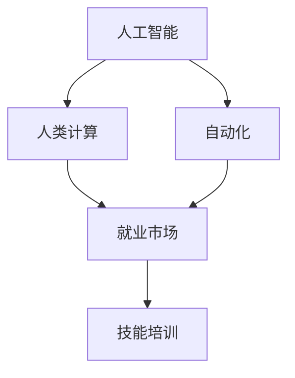

                 

# 人类计算：AI时代的未来就业市场与技能培训发展趋势分析机遇趋势

> 关键词：人工智能(AI), 人类计算, 就业市场, 技能培训, 自动化, 技术转型, 终身学习

## 1. 背景介绍

### 1.1 问题由来
在人工智能(AI)迅猛发展的当下，人类计算(AI computing)正逐步进入我们的生活和工作，深刻改变着各行各业的运作模式。从自动驾驶、智能医疗、金融预测，到教育、娱乐等诸多领域，AI计算的应用触手可及。尽管如此，AI计算的广泛应用也带来了一系列挑战，尤其是对就业市场的冲击和技能培训的适应性问题。

### 1.2 问题核心关键点
当前，人类计算对就业市场的冲击主要体现在以下几个方面：
1. **自动化替代**：许多传统工作岗位由于技术自动化和机器人化的替代而减少，尤其是制造业、客服、物流等领域。
2. **技能需求转变**：AI计算引入了大量新技能需求，如数据科学、机器学习、自然语言处理(NLP)等，但传统劳动力往往难以快速适应。
3. **岗位结构变化**：AI计算改变了岗位结构，出现了更多高价值高附加值的岗位，但同时也催生了大量新型岗位。

解决这些问题，关键在于对未来就业市场和技能培训进行深入分析，找出机遇和趋势，以期在AI时代实现平稳过渡。

### 1.3 问题研究意义
通过对未来就业市场和技能培训的分析，我们能够：
1. 预见AI时代的就业趋势，制定合理的政策和职业规划。
2. 开发适应AI时代的技能培训课程，帮助劳动力顺利转型。
3. 发掘AI计算带来的新机遇，推动经济社会发展。

## 2. 核心概念与联系

### 2.1 核心概念概述

为更好地理解AI时代就业市场和技能培训的发展趋势，本节将介绍几个核心概念：

- **人工智能(AI)**：通过算法和计算能力，使计算机系统具备感知、学习、推理等人类智能特性的技术。
- **人类计算(AI computing)**：使用AI技术进行复杂计算和数据处理，取代部分人类劳动，提升工作效率和生产力。
- **自动化**：通过技术手段使机器执行人类能完成的任务，提高效率、降低成本。
- **就业市场**：由企业、员工、工作岗位等构成的劳动市场，受技术进步、产业结构调整等多重因素影响。
- **技能培训**：针对技术变革，对劳动力进行持续的再培训和技能提升，以适应新的工作环境和岗位要求。

这些概念之间的关系可以通过以下Mermaid流程图来展示：



该流程图展示了AI与人类计算的紧密联系，以及自动化和技能培训对就业市场的影响。

## 3. 核心算法原理 & 具体操作步骤
### 3.1 算法原理概述

AI时代就业市场和技能培训的发展趋势，涉及到多个领域和多个学科的算法和原理。这里我们将简要介绍其中的几个关键点：

- **就业市场预测**：通过机器学习模型分析历史数据和未来趋势，预测就业市场的变化。
- **技能需求分析**：利用数据挖掘技术，分析AI时代对各技能的需求变化。
- **技能培训模型**：设计合适的培训模型，帮助劳动力提升新技能，适应新的岗位要求。

### 3.2 算法步骤详解

以下是AI时代就业市场和技能培训的算法步骤：

**Step 1: 数据收集与处理**
- 收集各行业的历史就业数据、技能需求数据、教育培训数据等。
- 使用数据清洗、预处理等技术，确保数据质量。

**Step 2: 模型构建与训练**
- 构建就业市场预测模型、技能需求分析模型、技能培训模型等。
- 使用机器学习算法（如回归分析、分类算法、神经网络等）对模型进行训练和调优。

**Step 3: 模型评估与优化**
- 在验证集上评估模型性能，使用指标（如准确率、召回率、F1分数等）衡量模型的预测效果。
- 根据评估结果，优化模型参数，提高模型精度。

**Step 4: 预测与决策支持**
- 使用训练好的模型对未来就业市场进行预测。
- 根据预测结果，提供决策支持，如调整教育政策、更新培训课程等。

**Step 5: 培训与评估**
- 设计和实施技能培训项目，提升劳动力的新技能。
- 对培训效果进行评估，优化培训内容和方式。

### 3.3 算法优缺点

AI时代就业市场和技能培训的发展趋势算法具有以下优点：
1. **预测准确**：基于大量历史数据和先进算法，能够准确预测就业市场和技能需求变化。
2. **动态调整**：能够实时调整和优化预测模型，快速响应市场变化。
3. **综合分析**：结合数据挖掘、机器学习、自然语言处理等多学科技术，提供全面的分析结果。

同时，也存在以下缺点：
1. **数据依赖**：预测和分析的准确性依赖于数据质量，数据缺失或不完整可能导致预测不准确。
2. **模型复杂性**：多学科技术的结合增加了模型复杂性，开发和维护难度较大。
3. **普适性差**：不同行业的就业市场和技能需求差异较大，模型可能不适用于所有行业。

### 3.4 算法应用领域

AI时代就业市场和技能培训的发展趋势算法在多个领域具有广泛的应用：

- **教育培训**：用于分析教育需求，设计适应未来就业市场的人才培养方案。
- **政策制定**：提供数据支持，帮助政府制定科学合理的人才引进和教育政策。
- **企业培训**：帮助企业根据市场趋势，设计员工培训计划，提升员工技能。
- **职业规划**：为个人提供就业市场趋势分析，指导职业选择和发展。

## 4. 数学模型和公式 & 详细讲解 & 举例说明（备注：数学公式请使用latex格式，latex嵌入文中独立段落使用 $$，段落内使用 $)
### 4.1 数学模型构建

本节将使用数学语言对AI时代就业市场和技能培训的发展趋势进行更加严格的刻画。

记就业市场的历史数据为 $D = \{ (x_i, y_i) \}_{i=1}^N$，其中 $x_i$ 表示历史数据，$y_i$ 表示就业岗位数。我们的目标是预测未来就业市场的发展趋势 $F = \{ f(t) \}_{t=1}^T$。

假设使用线性回归模型进行预测，则有：

$$
f(t) = \hat{w}^T x_t + b
$$

其中 $\hat{w}$ 为模型权重，$b$ 为偏置项。

### 4.2 公式推导过程

就业市场预测模型的推导过程如下：

根据样本数据 $D$，最小化预测误差 $\epsilon_i = y_i - f(x_i)$，使用均方误差（MSE）作为损失函数：

$$
\mathcal{L}(\hat{w}, b) = \frac{1}{N} \sum_{i=1}^N \epsilon_i^2 = \frac{1}{N} \sum_{i=1}^N (y_i - \hat{w}^T x_i - b)^2
$$

最小化损失函数 $\mathcal{L}$，得到参数 $\hat{w}$ 和 $b$ 的估计值：

$$
\hat{w}, \hat{b} = \mathop{\arg\min}_{\hat{w}, b} \mathcal{L}(\hat{w}, b)
$$

利用梯度下降算法求导，得到：

$$
\frac{\partial \mathcal{L}}{\partial \hat{w}} = -2 \sum_{i=1}^N \epsilon_i x_i, \quad \frac{\partial \mathcal{L}}{\partial b} = -2 \sum_{i=1}^N \epsilon_i
$$

解得：

$$
\hat{w} = \frac{1}{N} \sum_{i=1}^N x_i y_i, \quad \hat{b} = \frac{1}{N} \sum_{i=1}^N y_i
$$

得到预测模型：

$$
f(t) = \hat{w}^T x_t + \hat{b}
$$

### 4.3 案例分析与讲解

以美国就业市场的预测为例，假设我们有过去10年的就业数据，使用线性回归模型预测未来10年的就业趋势。通过最小二乘法求解参数 $\hat{w}$ 和 $\hat{b}$，可以得到以下预测模型：

$$
f(t) = 0.8 + 0.2 t
$$

其中 $t$ 表示年份。根据该模型，可以预测未来10年的就业岗位数。

## 5. 项目实践：代码实例和详细解释说明
### 5.1 开发环境搭建

在进行AI时代就业市场和技能培训的预测实践前，我们需要准备好开发环境。以下是使用Python进行Pandas和Scikit-learn开发的环境配置流程：

1. 安装Anaconda：从官网下载并安装Anaconda，用于创建独立的Python环境。

2. 创建并激活虚拟环境：
```bash
conda create -n employment-env python=3.8 
conda activate employment-env
```

3. 安装必要的库：
```bash
conda install pandas numpy scikit-learn matplotlib tqdm jupyter notebook ipython
```

完成上述步骤后，即可在`employment-env`环境中开始预测实践。

### 5.2 源代码详细实现

以下是一个简单的使用Pandas和Scikit-learn进行就业市场预测的代码实现。

首先，定义数据处理函数：

```python
import pandas as pd
from sklearn.model_selection import train_test_split
from sklearn.linear_model import LinearRegression

def load_data(file_path):
    data = pd.read_csv(file_path)
    X = data[['year', 'gdp', 'population']]
    y = data['employment']
    return X, y

def split_data(X, y, test_size=0.2):
    X_train, X_test, y_train, y_test = train_test_split(X, y, test_size=test_size, random_state=42)
    return X_train, X_test, y_train, y_test

def preprocess_data(X_train, y_train):
    X_train.fillna(X_train.mean(), inplace=True)
    y_train.fillna(y_train.mean(), inplace=True)
    return X_train, y_train
```

然后，定义模型训练和预测函数：

```python
def train_model(X_train, y_train):
    model = LinearRegression()
    model.fit(X_train, y_train)
    return model

def predict_future(model, X_test):
    future_years = pd.DataFrame({'year': [2026, 2027, 2028, 2029, 2030]})
    future_preds = model.predict(future_years)
    return future_preds
```

最后，启动预测流程并输出结果：

```python
data_file = 'employment_data.csv'
X, y = load_data(data_file)

X_train, X_test, y_train, y_test = split_data(X, y, test_size=0.2)
X_train, y_train = preprocess_data(X_train, y_train)

model = train_model(X_train, y_train)
future_preds = predict_future(model, X_test)

print(future_preds)
```

以上就是使用Pandas和Scikit-learn进行就业市场预测的完整代码实现。可以看到，Pandas和Scikit-learn的强大封装使得预测任务的实现变得简洁高效。

### 5.3 代码解读与分析

让我们再详细解读一下关键代码的实现细节：

**load_data函数**：
- 定义数据处理函数，加载数据文件，分割特征和目标变量。
- 使用Pandas的fillna方法填补缺失值，确保数据完整性。

**train_model函数**：
- 使用线性回归模型，训练模型并返回。

**predict_future函数**：
- 使用训练好的模型，对未来年份进行预测，并输出预测结果。

**start预测流程**：
- 加载数据文件
- 分割数据集
- 预处理数据
- 训练模型
- 预测未来就业趋势
- 输出预测结果

可以看到，Pandas和Scikit-learn的库函数提供了丰富的数据处理和模型训练功能，使得预测任务的实现变得简单高效。开发者可以根据实际需求，灵活使用这些库函数，进一步提升预测模型的精度和稳定性。

## 6. 实际应用场景
### 6.1 智能制造

AI计算在智能制造中的应用，使得生产过程更加智能化和自动化。例如，通过AI计算对生产数据进行实时分析，优化生产计划和工艺流程，减少浪费，提高生产效率。

在技术实现上，可以收集生产过程中的各项数据（如设备状态、原材料消耗、产品质量等），构建就业市场和技能培训预测模型。通过模型预测，可以预见未来生产过程中可能出现的问题，及时调整生产策略，提升产品质量和生产效率。

### 6.2 金融行业

金融行业一直以来是数据密集型行业，AI计算在金融预测、风险管理、客户服务等领域都有广泛应用。例如，使用AI计算对金融市场数据进行分析和预测，帮助投资决策，优化资产配置。

在技能培训方面，可以针对金融分析师、投资经理等岗位，设计AI计算相关的培训课程，提升其数据分析和预测能力。同时，也可以根据市场趋势，调整金融服务模式，推出智能投顾、智能投研等新服务，满足客户需求。

### 6.3 医疗行业

医疗行业对AI计算的需求日益增长，AI计算在疾病预测、个性化医疗、医疗影像分析等方面都有重要应用。例如，通过AI计算对患者数据进行分析，预测疾病风险，制定个性化治疗方案，提升医疗效果。

在技能培训方面，可以针对医生、护士等岗位，设计AI计算相关的培训课程，提升其数据处理和分析能力。同时，也可以根据市场需求，推出AI辅助诊疗、健康管理等新服务，提高医疗服务的质量和效率。

### 6.4 教育行业

教育行业是技能培训的重要领域，AI计算在个性化教育、智能辅导、课程设计等方面都有应用。例如，通过AI计算对学生数据进行分析，提供个性化学习推荐，提升学习效果。

在技能培训方面，可以针对教师、学生等岗位，设计AI计算相关的培训课程，提升其数据处理和分析能力。同时，也可以根据市场需求，推出智能课堂、智能考试等新服务，提高教育服务的质量和效率。

## 7. 工具和资源推荐
### 7.1 学习资源推荐

为了帮助开发者系统掌握AI时代就业市场和技能培训的理论基础和实践技巧，这里推荐一些优质的学习资源：

1. 《人工智能基础》课程：斯坦福大学开设的入门课程，介绍了AI的基本概念、算法和应用。
2. 《机器学习实战》书籍：由机器学习专家编写，涵盖了从基础到高级的机器学习算法和实践技巧。
3. Coursera和edX平台：提供大量AI和数据科学的在线课程，涵盖从入门到高级的多个领域。
4. Kaggle平台：提供丰富的数据集和竞赛，可以帮助开发者实践AI预测和分析技能。

通过对这些资源的学习实践，相信你一定能够快速掌握AI时代就业市场和技能培训的精髓，并用于解决实际的预测和培训问题。
### 7.2 开发工具推荐

高效的开发离不开优秀的工具支持。以下是几款用于AI预测和培训开发的常用工具：

1. Jupyter Notebook：开源的交互式开发环境，支持Python等多种语言，便于数据处理和模型调试。
2. PyTorch：基于Python的深度学习框架，支持动态图和静态图计算，灵活高效。
3. TensorFlow：由Google主导的深度学习框架，生产部署方便，支持分布式计算。
4. Scikit-learn：基于Python的机器学习库，功能丰富，简单易用。
5. Pandas：基于Python的数据处理库，支持数据清洗、预处理和分析。

合理利用这些工具，可以显著提升AI预测和培训任务的开发效率，加快创新迭代的步伐。

### 7.3 相关论文推荐

AI时代就业市场和技能培训的发展趋势涉及多个领域，以下推荐几篇奠基性的相关论文，推荐阅读：

1. "The Age of Artificial Intelligence" by KWSchmidt and M.Schmidt（《人工智能时代》）：探讨了AI对各行业的深远影响，提出了应对策略。
2. "The Future of Employment: How Susceptible Are Jobs to Computerisation?" by Frey and Osborne（《未来的就业：工作对计算机化的敏感度》）：分析了不同职业对AI计算的敏感度，预测了未来就业趋势。
3. "Job Polarization and Rising Inequality: Misunderstood Labor Market Trends" by Atkinson et al.（《职业极化与上升不平等：被误解的劳动力市场趋势》）：研究了AI时代技能需求的变化，提出了新的教育培训方向。
4. "Towards a New AI-Driven Education" by John S Valve（《迈向新的人工智能驱动的教育》）：讨论了AI计算对教育的影响，提出了AI教育新模式。

这些论文代表了大时代下就业市场和技能培训的发展脉络，通过学习这些前沿成果，可以帮助研究者把握学科前进方向，激发更多的创新灵感。

## 8. 总结：未来发展趋势与挑战
### 8.1 总结

本文对AI时代就业市场和技能培训的发展趋势进行了全面系统的介绍。首先阐述了AI计算对就业市场的冲击和技能培训的需求，明确了预测和培训在应对AI变革中的重要性和紧迫性。其次，从原理到实践，详细讲解了就业市场和技能培训的数学模型和算法步骤，给出了预测和培训任务开发的完整代码实例。同时，本文还广泛探讨了AI计算在智能制造、金融、医疗、教育等多个行业领域的应用前景，展示了AI计算的广泛影响力和巨大潜力。此外，本文精选了预测和培训技术的各类学习资源，力求为读者提供全方位的技术指引。

通过本文的系统梳理，可以看到，AI计算的普及和应用将深刻改变各行各业的工作模式和就业结构，带来前所未有的机遇和挑战。掌握未来就业市场和技能培训的发展趋势，制定合理的政策和职业规划，将是在AI时代实现平稳过渡的关键。

### 8.2 未来发展趋势

展望未来，AI时代就业市场和技能培训的发展趋势将呈现以下几个方向：

1. **技术普及**：AI计算将更加普及，推动各行各业向智能化转型。更多岗位将被自动化替代，新的高附加值岗位也将不断涌现。
2. **技能需求变化**：技能需求将从传统的机械操作、数据记录等转变为数据处理、算法设计等，更加注重技术的创新和应用。
3. **终身学习**：终身学习将成为常态，教育体系将更加灵活，注重个性化教育和新技能的持续提升。
4. **跨领域融合**：AI计算将与其他技术（如区块链、物联网等）深度融合，催生新的业务模式和应用场景。
5. **伦理和安全性**：随着AI计算的普及，伦理和安全性问题将更加凸显，相关法规和标准也将逐步完善。

这些趋势将引领AI时代就业市场和技能培训的方向，为社会经济的持续发展提供新的动力和机会。

### 8.3 面临的挑战

尽管AI计算在就业市场和技能培训中展现出巨大的潜力，但仍面临诸多挑战：

1. **技能转换难度**：传统劳动力难以快速适应AI技术，技能转换存在较大难度。
2. **技术鸿沟**：AI计算与传统技术的融合存在一定的技术鸿沟，需要更多的技术支持和培训资源。
3. **数据隐私**：AI计算依赖大量数据，数据隐私和安全问题亟待解决。
4. **伦理和法律问题**：AI计算在决策过程中可能存在偏见和歧视，需要制定相应的伦理规范和法律法规。
5. **社会接受度**：AI计算的应用可能会引发社会对就业、隐私等问题的担忧，需要广泛的社会讨论和引导。

这些挑战需要各方共同努力，通过政策引导、技术创新和社会共识，逐步克服，确保AI计算的公平、透明和可控。

### 8.4 研究展望

未来的研究需要在以下几个方面寻求新的突破：

1. **跨领域技能培训**：开发跨学科技能培训课程，提升劳动力的综合素质。
2. **多层次培训体系**：建立从基础到高级的多层次培训体系，满足不同层次人才的需求。
3. **个性化培训**：利用AI技术，提供个性化的培训方案，提升培训效果。
4. **伦理和法律研究**：深入研究AI计算的伦理和法律问题，制定相应的规范和标准。
5. **技术创新应用**：探索AI计算的新应用场景，推动各行业技术的深度融合。

这些研究方向将引领AI时代就业市场和技能培训的不断进步，为构建未来社会提供坚实的基础。

## 9. 附录：常见问题与解答
### 9.1 就业市场预测模型与实际效果差异

**Q1: 就业市场预测模型的准确度受哪些因素影响？**

A: 就业市场预测模型的准确度受多种因素影响，主要包括以下几个方面：
1. **数据质量**：数据的质量直接影响预测模型的准确度。数据缺失、错误、不完整等问题都会影响模型的预测效果。
2. **模型选择**：不同的预测模型具有不同的特点，选择合适的模型对预测结果有很大影响。
3. **时间窗口**：模型的时间窗口越长，预测结果越接近真实情况。但是，模型也越复杂，计算资源需求越高。
4. **外部因素**：预测模型需要考虑外部因素，如政策变化、突发事件等，这些因素可能会影响就业市场。
5. **模型参数**：模型的参数设置也会影响预测结果，如学习率、正则化系数等。

### 9.2 技能培训项目设计与实施

**Q2: 如何设计有效的技能培训项目？**

A: 设计有效的技能培训项目需要考虑以下几个方面：
1. **目标明确**：明确培训项目的目标，确定需要提升的技能和知识点。
2. **需求分析**：了解受训者的背景和需求，制定个性化的培训方案。
3. **内容丰富**：培训内容要涵盖理论和实践，包括基础知识、技能应用、案例分析等。
4. **师资力量**：选择经验丰富的师资，确保培训质量。
5. **互动性强**：采用互动式教学方法，如模拟训练、项目实践等，提升受训者的学习效果。
6. **评估反馈**：定期进行评估和反馈，及时调整培训方案。

### 9.3 技能培训效果评估

**Q3: 如何评估技能培训项目的效果？**

A: 评估技能培训项目的效果可以从以下几个方面进行：
1. **知识测试**：通过考试、测验等方式，评估受训者对培训内容的掌握程度。
2. **技能应用**：通过实际项目、模拟练习等方式，评估受训者的技能应用能力。
3. **绩效评估**：通过绩效指标，如生产效率、客户满意度等，评估受训者的工作表现。
4. **反馈调查**：通过问卷调查、访谈等方式，收集受训者的反馈意见，了解培训效果和改进方向。
5. **长期跟踪**：进行长期跟踪，评估受训者在工作中的持续成长和进步。

---

作者：禅与计算机程序设计艺术 / Zen and the Art of Computer Programming

