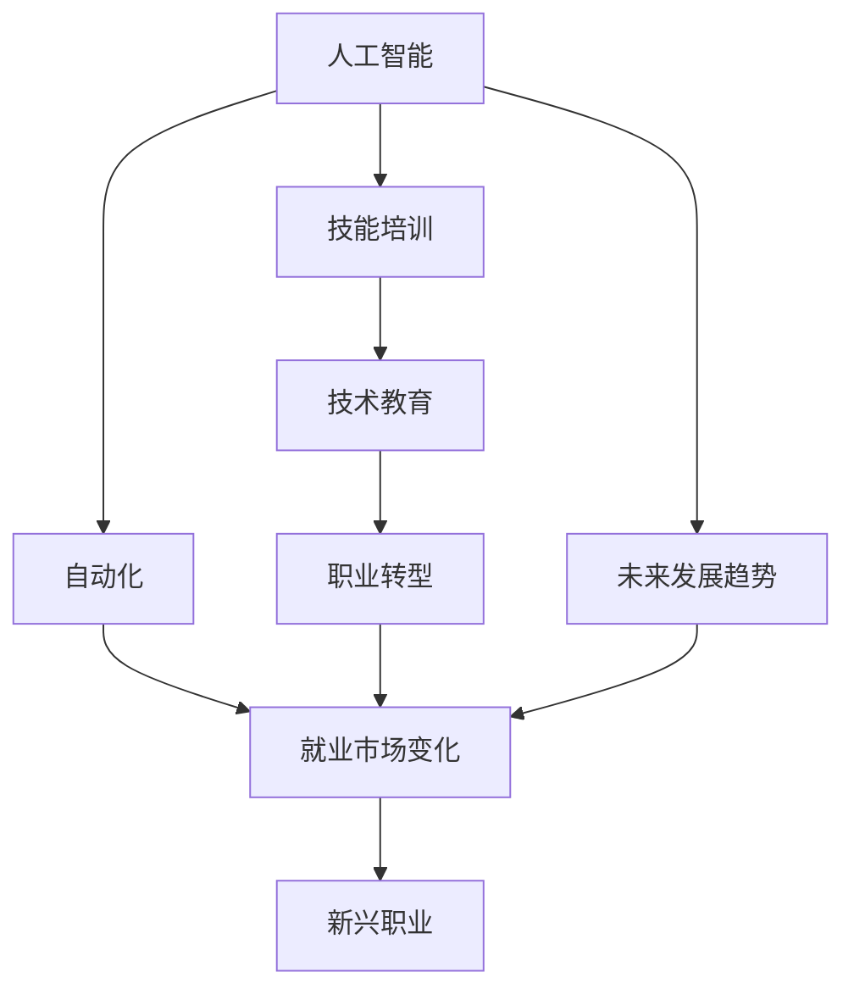

                 

# 人类计算：AI时代的未来就业市场与技能培训发展趋势分析预测

> 关键词：人工智能,未来就业市场,技能培训,自动化,工作转型,技术教育

## 1. 背景介绍

### 1.1 问题由来
随着人工智能(AI)技术的迅猛发展，自动化和智能化正在重塑全球就业市场。AI技术不仅在提高生产效率、优化资源配置方面展现出巨大潜力，还逐渐渗透到医疗、教育、金融等各个行业，带来了深刻变革。

对于职场工作者而言，AI时代既是挑战也是机遇。一方面，自动化和智能系统替代了大量传统重复性工作，从业者面临就业岗位减少、职业路径改变的风险。另一方面，AI技术的普及催生了新兴职业和岗位，提供了职业转型的机会。

针对这一问题，本文将从就业市场和技能培训两个维度，深入探讨AI时代的未来发展趋势，分析预测就业市场变化，并提出相应的技能培训发展策略，以助力职场人士应对AI时代带来的挑战与机遇。

### 1.2 问题核心关键点
未来就业市场和技能培训的发展趋势将受到AI技术进展、社会经济环境、政策法规、教育资源等多重因素的共同影响。具体关键点包括：
- AI技术发展对就业市场的广泛影响
- 新兴职业和岗位的兴起
- 技能培训体系的演变与升级
- 从业者的职业转型与技能提升

通过对这些关键点的分析，本文旨在为从业者和教育机构提供实用的洞察和指导，帮助他们制定合理的职业规划和发展策略。

## 2. 核心概念与联系

### 2.1 核心概念概述

为更好地理解AI时代就业市场与技能培训的演变，本节将介绍几个核心概念及其相互关系：

- **人工智能(Artificial Intelligence, AI)**：指通过计算机系统模拟人类智能过程的技术，包括感知、推理、学习等能力。AI技术的进步显著影响了各行各业的运营方式。

- **自动化(Automation)**：指利用机器设备和计算机程序自动执行重复性、规律性任务，减少人力成本，提高效率。自动化在AI时代加速了各行各业的变革。

- **技能培训(Skill Training)**：指通过教育和培训提升从业者专业技能，帮助其适应新兴职业和岗位要求的过程。技能培训是职场人士职业发展的关键环节。

- **未来就业市场(Future Employment Market)**：指AI技术发展对未来就业岗位数量、类型、需求趋势的预测和分析。理解未来就业市场是制定职业规划的重要依据。

- **技术教育(Technical Education)**：指围绕新兴技术领域（如AI、大数据、机器学习等）的教育和培训。技术教育对从业者的职业转型和技能提升至关重要。

- **职业转型(Job Transition)**：指从业者根据AI技术发展趋势，重新规划职业路径，从传统岗位转向新兴职业的过程。

这些核心概念之间的逻辑关系可以通过以下Mermaid流程图来展示：



这个流程图展示了AI技术如何通过自动化驱动就业市场变化，进而影响职业转型和技能培训的演变。通过理解这些概念的相互关系，可以更清晰地把握AI时代职场环境的变化和从业者的职业发展路径。

## 3. 核心算法原理 & 具体操作步骤

### 3.1 算法原理概述

预测未来就业市场和技能培训的发展趋势，涉及到对AI技术进展、经济环境、政策法规、教育资源等多重因素的综合分析。其核心算法可以归纳为以下步骤：

1. **数据收集与处理**：从政府统计、行业报告、学术研究等渠道收集数据，包括就业率、岗位需求、技能需求、教育资源分布等。
2. **模型构建与训练**：构建机器学习模型，如回归模型、时间序列模型、神经网络等，利用历史数据进行训练，预测未来就业市场和技能需求变化。
3. **情景模拟与预测**：设定不同的情景（如技术进步、经济波动、政策调整等），通过模型进行情景模拟，预测不同情景下的就业市场和技能培训变化。
4. **结果分析与评估**：对预测结果进行分析评估，识别关键趋势和风险点，为从业者和教育机构提供指导建议。

### 3.2 算法步骤详解

以构建基于时间序列模型的就业市场预测为例，具体步骤包括：

1. **数据收集**：收集历史就业率数据，包括年度数据和季度数据，涵盖不同行业和职业类别。
2. **数据预处理**：清洗数据，处理缺失值和异常值，进行时间序列分解，如趋势、季节性等。
3. **模型选择**：选择ARIMA、SARIMA、LSTM等时间序列模型，并根据数据特点进行调整。
4. **模型训练**：使用历史数据训练模型，设定合适的超参数，如滞后阶数、季节性周期等。
5. **模型验证**：利用留一法、交叉验证等方法验证模型预测效果，调整模型参数。
6. **预测与分析**：使用训练好的模型对未来就业市场进行预测，分析不同情景下的就业趋势变化。

### 3.3 算法优缺点

基于时间序列模型的就业市场预测具有以下优点：
1. 简单易用：模型结构直观，易于理解和实现。
2. 适用范围广：适用于不同行业和职业类别的就业市场预测。
3. 实时可调：模型参数和输入数据可随时更新，适应变化。

同时，该方法也存在一些局限性：
1. 依赖数据质量：模型预测结果高度依赖于输入数据的质量和完整性。
2. 短期预测较准：时间序列模型在短期预测上表现较好，但长期预测可能存在偏差。
3. 对异常值敏感：数据中的异常值可能影响模型预测结果的准确性。

### 3.4 算法应用领域

基于时间序列模型的就业市场预测在多个领域具有广泛应用，包括但不限于：

- **经济规划**：政府和机构利用预测结果制定经济政策，优化资源配置。
- **企业决策**：企业通过预测就业市场变化，调整招聘计划，优化人力资源管理。
- **教育培训**：教育机构根据就业市场趋势，调整课程设置和培训内容，提升培训效果。
- **职业规划**：从业者通过预测结果，制定合理的职业规划和发展策略，抓住新的就业机会。

## 4. 数学模型和公式 & 详细讲解 & 举例说明

### 4.1 数学模型构建

本节将使用数学语言对未来就业市场和技能培训的发展趋势进行更加严格的刻画。

设未来就业市场为 $M$，其状态由 $M(t)$ 表示，其中 $t$ 为时间点。影响 $M(t)$ 的因素包括技术进步 $T$、经济波动 $E$、政策变化 $P$ 等。记 $M(t)$ 的概率密度函数为 $f_M(t)$。

假设存在一个时间序列模型 $M_t = \alpha_0 + \sum_{i=1}^{n} \alpha_i X_i(t) + \epsilon_t$，其中 $X_i(t)$ 为影响因素，$\alpha_i$ 为模型参数，$\epsilon_t$ 为随机误差项。

模型训练的目的是找到最优参数 $\hat{\alpha}$，使得预测值与实际值之间的误差最小化。

### 4.2 公式推导过程

以简单的一阶自回归模型(AR(1))为例，推导其预测公式：

设 $X(t) = \phi X(t-1) + \epsilon(t)$，其中 $\phi$ 为自回归系数，$\epsilon(t)$ 为随机误差项。通过平稳性条件，可以求得：

$$
\hat{X}(t+1) = \phi \hat{X}(t) + \hat{\epsilon}(t)
$$

其中 $\hat{X}(t)$ 为 $X(t)$ 的预测值，$\hat{\epsilon}(t)$ 为 $\epsilon(t)$ 的预测值。通过迭代求解，可以得到 $X(t+1)$ 的预测值。

### 4.3 案例分析与讲解

假设某城市在未来一年的就业市场预测值为 $M(t+1) = 0.8M(t) + 0.2T(t) + \epsilon(t)$，其中 $T(t)$ 为技术进步指标，$\epsilon(t)$ 为随机误差。

如果 $T(t)$ 预测值为 0.05，$M(t)$ 的历史值为 100，则：

$$
\hat{M}(t+1) = 0.8 \times 100 + 0.2 \times 0.05 + \epsilon(t)
$$

$$
\hat{M}(t+1) = 104 + \epsilon(t)
$$

这个例子展示了时间序列模型在就业市场预测中的应用，以及模型参数和随机误差对预测结果的影响。

## 5. 项目实践：代码实例和详细解释说明

### 5.1 开发环境搭建

在进行未来就业市场和技能培训的预测实践前，我们需要准备好开发环境。以下是使用Python进行模型开发的环境配置流程：

1. 安装Anaconda：从官网下载并安装Anaconda，用于创建独立的Python环境。

2. 创建并激活虚拟环境：
```bash
conda create -n arima-env python=3.8 
conda activate arima-env
```

3. 安装PyTorch：根据CUDA版本，从官网获取对应的安装命令。例如：
```bash
conda install pytorch torchvision torchaudio cudatoolkit=11.1 -c pytorch -c conda-forge
```

4. 安装相关库：
```bash
pip install pandas numpy statsmodels sklearn
```

完成上述步骤后，即可在`arima-env`环境中开始模型预测实践。

### 5.2 源代码详细实现

以下是使用ARIMA模型对未来就业市场进行预测的PyTorch代码实现：

```python
import pandas as pd
import numpy as np
from statsmodels.tsa.arima_model import ARIMA

# 读取历史就业市场数据
data = pd.read_csv('employment_data.csv')

# 设定模型参数
p, d, q = 1, 0, 1

# 构建ARIMA模型
model = ARIMA(data['employment'], order=(p, d, q))
model_fit = model.fit()

# 预测未来一年就业市场
forecast = model_fit.forecast(steps=1)
print(f'预测未来一年的就业市场为：{forecast[0][0]}')
```

### 5.3 代码解读与分析

让我们再详细解读一下关键代码的实现细节：

**就业市场数据处理**：
- `pandas`：用于数据读取和处理，将数据存入DataFrame中。

**模型训练与预测**：
- `statsmodels`：利用ARIMA模型对就业市场进行时间序列建模。
- `ARIMA`：设定模型参数，包括自回归阶数$p$、差分阶数$d$和移动平均阶数$q$。
- `fit`：训练模型，拟合历史数据。
- `forecast`：预测未来就业市场，设定预测步数。

**结果输出**：
- 使用`print`函数输出预测结果。

可以看到，使用Python和相关库可以快速实现时间序列模型的就业市场预测。开发者可以根据具体需求，进一步调整模型参数和预测步骤，以获取更精确的预测结果。

## 6. 实际应用场景

### 6.1 教育培训体系优化

AI时代对就业市场和技能培训提出了新的要求。传统的教育培训体系需要不断更新，以适应技术变革带来的新需求。

例如，某大型企业通过数据分析发现，AI技术的应用正逐渐替代传统的数据处理工作，但对数据科学家和AI工程师的需求却在增长。于是，该企业调整了培训计划，增加了数据科学和AI相关的课程，并组织员工参加相关的认证考试，以提升员工的技能水平和职业竞争力。

### 6.2 职业转型与再就业

AI技术的普及对许多传统行业从业者构成了冲击，但也带来了新的职业机会。

例如，某银行发现柜员岗位逐渐被自助服务机取代，决定对柜员进行再培训，使其能够转岗为数据分析师或客户服务代表。通过提供针对性的培训课程，并推荐其参与相关领域的认证考试，该银行帮助员工成功实现了职业转型，增强了团队的市场适应性和创新能力。

### 6.3 终身学习与职业发展

AI时代要求职场人士不断学习新技能，以保持职业竞争力。终身学习成为职业发展的重要组成部分。

例如，某IT公司员工通过参加在线课程学习最新的编程语言和框架，并利用公司的内部培训资源，不断提升技术水平。同时，公司还鼓励员工参加各类技术竞赛和认证考试，为其职业发展提供支持。

### 6.4 未来应用展望

随着AI技术的持续进步，未来就业市场和技能培训将呈现出更加多样化和个性化趋势。

1. **个性化培训**：根据个体学习需求和职业规划，提供定制化的技能培训方案。利用大数据和AI技术，分析学习者的行为和表现，推荐个性化的学习路径和资源。
2. **跨学科融合**：AI时代需要更多跨学科的知识和技能。未来的教育体系将更加注重多学科融合，培养复合型人才。
3. **虚拟现实与增强现实**：利用VR和AR技术，提供沉浸式学习体验，提升学习效果。例如，通过虚拟实验室进行实验操作训练，提升实践能力。
4. **在线学习平台**：在线教育平台将成为未来技能培训的重要形式。通过大规模在线课程和社区交流，实现知识和技能的广泛传播和共享。
5. **智能导师系统**：结合AI技术和自然语言处理，开发智能导师系统，提供实时反馈和个性化指导，提升学习效果。

## 7. 工具和资源推荐

### 7.1 学习资源推荐

为了帮助职场人士和教育机构掌握AI时代的技能培训方法，这里推荐一些优质的学习资源：

1. Coursera、edX、Udacity等在线教育平台：提供丰富的大数据、AI、机器学习等课程，涵盖从入门到高级的内容。

2. Kaggle：全球最大的数据科学竞赛平台，提供丰富的数据集和模型代码，促进学习和实践。

3. 《机器学习实战》《Python数据科学手册》等书籍：系统介绍机器学习和数据科学的基本概念和应用技术。

4. 《人工智能时代》《未来简史》等科普书籍：帮助读者理解AI技术对社会和经济的深远影响。

5. MIT OpenCourseWare：提供MIT课程的完整视频和讲义，涵盖多个学科的课程内容。

通过对这些资源的学习实践，相信你一定能够掌握AI时代技能培训的方法，为职业发展提供坚实的基础。

### 7.2 开发工具推荐

高效的开发离不开优秀的工具支持。以下是几款用于未来就业市场和技能培训开发的常用工具：

1. Jupyter Notebook：免费的开源笔记本环境，支持Python和R等语言的交互式编程和数据可视化。

2. GitHub：全球最大的代码托管平台，提供丰富的开源项目和社区交流功能。

3. Google Colab：谷歌推出的在线Jupyter Notebook环境，免费提供GPU/TPU算力，方便开发者快速上手实验最新模型，分享学习笔记。

4. RStudio：针对R语言的集成开发环境，提供丰富的数据分析和可视化功能。

5. Kaggle Kernels：在线编程环境，支持Python、R等语言，提供大规模数据集和模型共享平台。

合理利用这些工具，可以显著提升未来就业市场和技能培训的开发效率，加快创新迭代的步伐。

### 7.3 相关论文推荐

未来就业市场和技能培训的发展趋势受到学界的持续关注。以下是几篇奠基性的相关论文，推荐阅读：

1. “Lifelong and Lifelong Transfer Learning with Continual and Adaptive Nonparametric Optimization” by Keskar等（2021）：提出了一种持续学习和自适应非参数优化方法，为终身学习提供了新的技术路径。

2. “Towards a General Adaptation Algorithm for Adaptive and Self-Adaptive Systems” by Dorigo等（2004）：介绍了自适应系统的一般适应算法，为AI时代自适应学习提供了理论基础。

3. “Job Market Automation: The Future of Work in the United States” by Jorgenson和Kerr（2020）：分析了自动化对美国就业市场的影响，提供了实用的就业市场预测和建议。

4. “Skill Development in a Time of AI” by Goldin等（2021）：探讨了AI时代技能培训的重要性，提出了提升职场技能的方法和策略。

5. “AI for the Masses: Bridging the Gap Between Technology and Society” by Artikov等（2019）：讨论了AI技术对社会的影响，提出了AI时代技术教育和职业培训的方向。

这些论文代表了大规模数据预测和终身学习的最新研究成果，为从业者和教育机构提供了丰富的理论支撑和实践指导。

## 8. 总结：未来发展趋势与挑战

### 8.1 总结

本文对AI时代未来就业市场和技能培训的发展趋势进行了全面系统的分析。首先阐述了AI技术对就业市场的广泛影响，介绍了基于时间序列模型的就业市场预测方法。其次，从教育培训体系的优化、职业转型与再就业、终身学习与职业发展等多个维度，探讨了AI时代技能培训的演变趋势。最后，提出了未来技术发展的方向，包括个性化培训、跨学科融合、虚拟现实与增强现实、在线学习平台、智能导师系统等。

通过本文的系统梳理，可以看到，AI时代未来就业市场和技能培训将呈现出多样化和个性化的发展趋势，为从业者和教育机构提供了实用的洞察和指导。这些发展趋势将带来新的机遇和挑战，需要从业者和教育机构共同努力，积极应对。

### 8.2 未来发展趋势

展望未来，未来就业市场和技能培训将呈现以下几个发展趋势：

1. **个性化学习**：基于大数据和AI技术，提供定制化的技能培训方案，满足学习者的多样化需求。
2. **跨学科融合**：未来的教育体系将更加注重多学科融合，培养具有交叉知识背景的复合型人才。
3. **终身学习**：终身学习将成为职业发展的重要组成部分，职场人士需要不断更新知识和技能。
4. **虚拟现实与增强现实**：利用VR和AR技术，提供沉浸式学习体验，提升学习效果。
5. **在线学习平台**：在线教育平台将成为未来技能培训的重要形式，提供大规模学习资源和社区交流平台。
6. **智能导师系统**：结合AI技术和自然语言处理，开发智能导师系统，提供实时反馈和个性化指导。

这些趋势将为从业者和教育机构提供更多支持和便利，推动AI时代技能培训的不断进步。

### 8.3 面临的挑战

尽管未来就业市场和技能培训的发展充满潜力，但在迈向更加智能化、普适化应用的过程中，仍面临以下挑战：

1. **数据质量问题**：数据质量和数据获取的难度是影响未来就业市场预测的重大障碍。不准确的数据可能导致预测结果的偏差。
2. **技术壁垒**：AI时代的技术复杂度较高，部分从业者和教育机构可能难以掌握。
3. **资源不均**：各地区、各行业的教育资源分布不均，可能导致技能培训的不均衡。
4. **职业转型难度**：部分从业者可能缺乏适应新兴职业所需的知识和技能。
5. **伦理和隐私**：AI技术的应用可能带来隐私和伦理问题，需要建立相应的法律和监管机制。

这些挑战需要通过持续的技术创新和政策支持，才能逐步克服。

### 8.4 研究展望

面对未来就业市场和技能培训的挑战，未来的研究需要在以下几个方面寻求新的突破：

1. **数据质量提升**：进一步提高数据获取的效率和准确性，利用大数据和AI技术进行数据清洗和增强。
2. **技术普及教育**：通过在线课程、开源项目等形式，普及AI技术知识，降低技术壁垒。
3. **教育资源均衡**：利用互联网技术，打破地域和行业的界限，促进教育资源的均衡分配。
4. **职业转型支持**：开发职业转型培训课程，提供职业指导和咨询服务，帮助从业者顺利过渡到新兴职业。
5. **伦理和隐私保护**：建立AI技术的伦理和隐私保护机制，确保技术的可控性和安全性。

这些研究方向的探索，将为未来就业市场和技能培训的发展提供新的动力，助力AI时代职场人士的职业转型和技能提升。

## 9. 附录：常见问题与解答

**Q1：未来就业市场预测的准确性如何？**

A: 未来就业市场预测的准确性受多种因素影响，包括模型选择、数据质量、预测时间等。时间序列模型在短期预测上表现较好，但长期预测可能存在偏差。为提高预测准确性，需要持续更新模型和数据，并进行情景模拟分析。

**Q2：未来就业市场预测对从业者有哪些指导意义？**

A: 未来就业市场预测可以为从业者提供职业规划和发展方向的指导。通过了解未来就业趋势，从业者可以调整职业路径，提升技能水平，抓住新的就业机会。同时，教育机构可以根据预测结果，优化培训内容和课程设置，提升培训效果。

**Q3：未来技能培训应如何应对AI技术发展？**

A: 未来技能培训需要应对AI技术的发展趋势，注重个性化、跨学科融合、终身学习、虚拟现实与增强现实、在线学习平台和智能导师系统等方面的提升。从业者需要不断学习新技能，教育机构需要更新培训内容和资源，确保培训效果与AI技术发展同步。

**Q4：未来技术教育应如何发展？**

A: 未来技术教育应注重数据科学、人工智能、机器学习等前沿技术的学习，同时结合跨学科融合、虚拟现实与增强现实、在线学习平台等新技术手段。教育机构应建立智能导师系统，提供实时反馈和个性化指导，提升学习效果。从业者应持续学习新技能，提升自身技术水平。

**Q5：未来技能培训面临哪些挑战？**

A: 未来技能培训面临数据质量、技术壁垒、资源不均、职业转型难度和伦理隐私等挑战。解决这些挑战需要持续的技术创新和政策支持，包括提升数据质量、普及技术知识、均衡教育资源、提供职业转型支持以及建立伦理和隐私保护机制。

这些回答可以为从业者和教育机构提供实用的指导和参考，帮助他们更好地应对AI时代的挑战与机遇。

---

作者：禅与计算机程序设计艺术 / Zen and the Art of Computer Programming

