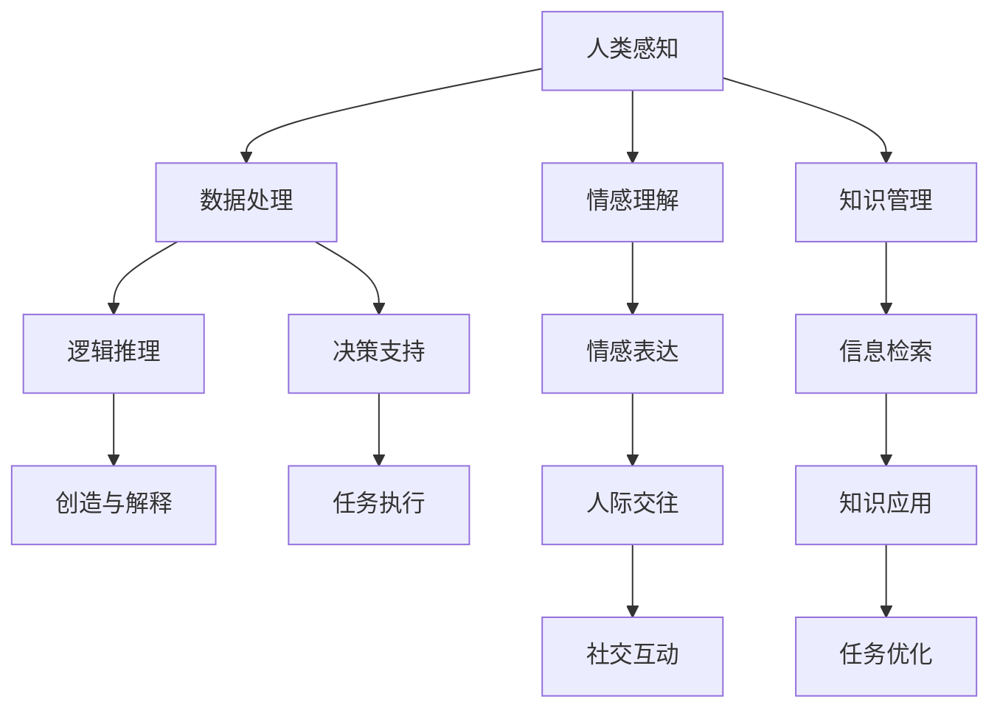

                 

# 人类计算：AI时代的未来技能发展

在科技飞速发展的今天，人工智能（AI）正日益渗透到各个行业，成为推动社会进步的重要力量。随着AI技术的不断演进，人类计算范式的转变亦成为不可避免的趋势。本文将探讨人类计算的概念、AI时代对未来技能发展的影响，并提供详细的算法原理与实践指导，以期为未来技能的发展提供有益的参考。

## 1. 背景介绍

### 1.1 问题由来
随着AI技术的迅猛发展，计算机在处理大量数据、执行复杂任务上的优势愈发凸显。然而，在面对一些具有高度创造性、情感理解和人际交往等非结构化任务时，人工智能系统的表现仍显不足。这些问题促使我们重新审视人类计算与AI技术的结合，探寻AI时代下，人类计算的新形态。

### 1.2 问题核心关键点
在AI时代，人类计算的核心关键点包括：
- 人机协同：利用AI处理海量数据，发挥人类的创造力和情感理解能力。
- 智能增强：通过AI辅助，提高人类计算效率和准确性。
- 技能融合：结合AI与人类技能，实现更高效、智能化的解决方案。

### 1.3 问题研究意义
研究人类计算与AI结合，有助于：
- 提升工作质量：AI能高效处理数据，人类可专注于创造性工作。
- 促进知识共享：AI能整合知识库，人类能更快速获取所需信息。
- 优化资源利用：AI可处理耗时任务，人类能专注于高价值任务。
- 加速技能发展：AI能提供个性化学习方案，提升人类技能水平。

## 2. 核心概念与联系

### 2.1 核心概念概述

为更好地理解人类计算的概念与AI结合，本节将介绍几个核心概念：

- **人类计算(Human Computation)**：利用人类的感知、理解、创造能力，结合计算机处理数据、逻辑推理等技术，实现复杂任务的解决方案。
- **人工智能(Artificial Intelligence)**：通过算法和机器学习，使计算机具备类似于人类的智能，能够在特定领域内执行任务。
- **人机协同(Co-Humanity)**：指计算机与人类结合，共同处理任务，充分发挥各自优势。
- **智能增强(Augmented Intelligence)**：通过AI技术提升人类智能，实现更高效、精准的计算。
- **技能融合(Skill Fusion)**：将AI技术与人类技能融合，产生新的复合型能力。

### 2.2 核心概念原理和架构的 Mermaid 流程图



此图展示了人类计算和AI结合的原理和架构：

1. **数据处理**：计算机高效处理数据，提供给人类处理。
2. **逻辑推理**：计算机执行复杂的逻辑推理，人类提供创造性和情感理解能力。
3. **决策支持**：计算机提供决策建议，人类进行最终决策。
4. **任务执行**：计算机执行具体任务，人类监督指导。
5. **人际交往**：计算机提供社交支持，人类进行人际互动。

## 3. 核心算法原理 & 具体操作步骤

### 3.1 算法原理概述

基于人类计算的AI时代，核心算法原理包括以下几个方面：

- **人机协同算法**：通过将复杂任务分解成多个子任务，由计算机处理数据和逻辑推理，人类负责创造性和情感理解。
- **智能增强算法**：利用AI技术处理海量数据，提取模式和规律，辅助人类进行决策。
- **技能融合算法**：结合AI的强大计算能力和人类丰富的经验，实现更高效、更智能化的解决方案。

### 3.2 算法步骤详解

#### 步骤1：任务分解与设计

1. **任务识别**：明确任务的性质和需求，将其分解为多个可操作的小任务。
2. **任务设计**：设计适合计算机处理和人类执行的子任务流程，确保任务连贯性和可操作性。

#### 步骤2：数据输入与处理

1. **数据采集**：收集与任务相关的数据，确保数据质量与代表性。
2. **数据清洗**：处理缺失、异常数据，去除冗余信息。
3. **数据标注**：为训练数据打上标签，方便后续AI模型的训练。

#### 步骤3：模型训练与优化

1. **模型选择**：根据任务性质选择合适的AI模型，如深度学习、强化学习等。
2. **模型训练**：利用标注数据训练AI模型，调整超参数，优化模型性能。
3. **模型验证**：在验证集上测试模型效果，进行必要的调整和改进。

#### 步骤4：人机协同执行

1. **任务分配**：根据任务性质和模型表现，合理分配任务给计算机和人类。
2. **协同执行**：人类监督AI模型的输出，提供反馈和改进建议。
3. **结果整合**：综合计算机与人类计算结果，生成最终解决方案。

### 3.3 算法优缺点

**优点：**
- **高效性**：利用计算机处理海量数据，提升计算效率。
- **精准性**：AI模型能够精确提取数据中的模式和规律。
- **灵活性**：结合人类创造性和情感理解能力，实现更复杂的任务。

**缺点：**
- **依赖数据**：高质量数据对AI模型至关重要，数据获取成本高。
- **技术复杂**：需要多领域技术协同，技术门槛高。
- **成本高昂**：高质量的AI模型和协同执行成本较高。

### 3.4 算法应用领域

基于人类计算的AI时代，其应用领域广泛，涵盖医疗、金融、教育、娱乐等多个领域：

- **医疗领域**：利用AI处理医疗数据，辅助诊断和治疗；结合医生的经验，进行精准治疗方案设计。
- **金融领域**：通过AI分析海量金融数据，进行风险评估和投资决策；结合人类对市场的敏感度，优化投资组合。
- **教育领域**：利用AI提供个性化学习方案，辅助教学；结合教师经验，进行教学方法的改进。
- **娱乐领域**：通过AI生成个性化内容，提升用户体验；结合娱乐专家的创意，创作高质量内容。

## 4. 数学模型和公式 & 详细讲解 & 举例说明

### 4.1 数学模型构建

在本节中，我们将构建一个简单的AI辅助人类计算的数学模型。假设有一个简单的分类问题，分类函数为：

$$ f(x) = \frac{1}{1 + e^{-(w_0 + w_1x_1 + w_2x_2)}} $$

其中 $x_1$ 和 $x_2$ 为输入特征，$w_0$、$w_1$ 和 $w_2$ 为模型参数。当 $f(x) > 0.5$ 时，分类结果为正类，否则为负类。

### 4.2 公式推导过程

1. **损失函数定义**：定义交叉熵损失函数为：
   $$ L(y,f(x)) = -y\log f(x) - (1-y)\log(1-f(x)) $$

2. **梯度计算**：对损失函数求偏导，得到梯度公式：
   $$ \frac{\partial L}{\partial w_i} = f(x)(1-y) - (1-f(x))y $$

3. **模型训练**：利用梯度下降算法更新模型参数，直到损失函数收敛。

### 4.3 案例分析与讲解

以金融领域的股票价格预测为例，说明如何使用AI辅助人类进行复杂计算。

1. **任务识别**：预测未来几天的股票价格。
2. **任务设计**：输入历史股价、交易量、市场情绪等数据，输出未来几天的预测价格。
3. **数据采集**：收集历史股价、交易量等数据，确保数据的完整性和准确性。
4. **模型选择**：选择适合的机器学习模型，如线性回归、支持向量机等。
5. **模型训练**：利用历史数据训练AI模型，调整超参数，优化模型性能。
6. **模型验证**：在验证集上测试模型效果，进行必要的调整和改进。
7. **人机协同执行**：人类分析AI模型的预测结果，结合市场情绪等主观因素，进行综合判断。
8. **结果整合**：结合AI预测和人类分析，生成最终预测结果。

## 5. 项目实践：代码实例和详细解释说明

### 5.1 开发环境搭建

为了进行AI辅助人类计算的实践，首先需要搭建开发环境。以下是使用Python进行TensorFlow开发的环境配置流程：

1. 安装Anaconda：从官网下载并安装Anaconda，用于创建独立的Python环境。
2. 创建并激活虚拟环境：
   ```bash
   conda create -n tf-env python=3.7 
   conda activate tf-env
   ```
3. 安装TensorFlow：
   ```bash
   pip install tensorflow==2.5
   ```
4. 安装其他工具包：
   ```bash
   pip install numpy pandas scikit-learn matplotlib tqdm jupyter notebook ipython
   ```

完成上述步骤后，即可在`tf-env`环境中进行AI辅助人类计算的实践。

### 5.2 源代码详细实现

以下是使用TensorFlow实现股票价格预测的代码示例：

```python
import tensorflow as tf
import numpy as np
import pandas as pd

# 加载数据集
data = pd.read_csv('stock_data.csv')

# 定义输入和输出
x_train = data.iloc[:800, :-1].values
y_train = data.iloc[:800, -1].values
x_test = data.iloc[800:, :-1].values
y_test = data.iloc[800:, -1].values

# 定义模型
model = tf.keras.Sequential([
    tf.keras.layers.Dense(32, activation='relu', input_shape=[3,]),
    tf.keras.layers.Dense(1)
])

# 编译模型
model.compile(optimizer='adam', loss='mse')

# 训练模型
model.fit(x_train, y_train, epochs=10, batch_size=32, validation_data=(x_test, y_test))

# 预测未来股票价格
x_future = np.array([[100, 50, 20]])
prediction = model.predict(x_future)
print(prediction)
```

### 5.3 代码解读与分析

让我们再详细解读一下关键代码的实现细节：

**数据加载与处理**：
- 使用Pandas加载CSV文件，定义输入特征 $x$ 和输出 $y$。
- 数据集分为训练集和测试集，训练集用于模型训练，测试集用于模型验证。

**模型定义与编译**：
- 使用Keras API定义一个简单的神经网络模型，包括两个全连接层。
- 编译模型，选择Adam优化器和均方误差损失函数。

**模型训练与验证**：
- 使用训练集训练模型，设置训练轮数为10轮。
- 在验证集上评估模型性能，避免过拟合。

**未来价格预测**：
- 使用训练好的模型预测未来股票价格。
- 预测结果为单个数值，即未来价格。

## 6. 实际应用场景

### 6.1 智能客服系统

基于AI辅助的人类计算，智能客服系统能够实现高效、精准的客户服务。

1. **任务识别**：识别客户咨询的内容和类型。
2. **任务设计**：将咨询内容分解为多个子任务，由AI处理和人类监督。
3. **数据采集**：收集客户咨询的历史记录。
4. **模型训练**：利用历史数据训练AI模型，优化客户分流和路由。
5. **人机协同执行**：AI处理常见的咨询问题，人类处理复杂和个性化的咨询。
6. **结果整合**：综合AI处理和人类解答的结果，生成最终回复。

### 6.2 金融舆情监测

在金融领域，AI辅助的人类计算能够实现精确的舆情监测。

1. **任务识别**：监测社交媒体、新闻等平台上的金融舆情。
2. **任务设计**：输入舆情文本，输出情绪倾向和市场影响。
3. **数据采集**：收集社交媒体、新闻等数据。
4. **模型训练**：利用标注数据训练情感分析模型。
5. **人机协同执行**：AI分析舆情情绪，人类结合市场情况进行综合判断。
6. **结果整合**：综合AI分析和人类判断，生成最终的舆情报告。

### 6.3 个性化推荐系统

AI辅助的人类计算在个性化推荐系统中具有重要应用。

1. **任务识别**：为用户推荐感兴趣的内容。
2. **任务设计**：输入用户的兴趣历史和行为数据，输出推荐结果。
3. **数据采集**：收集用户浏览、点击、评论等行为数据。
4. **模型训练**：利用行为数据训练推荐模型，优化推荐算法。
5. **人机协同执行**：AI生成初步推荐结果，人类审核并调整。
6. **结果整合**：综合AI生成的推荐结果和人类调整，生成最终的推荐列表。

### 6.4 未来应用展望

随着AI技术的不断发展，基于人类计算的AI时代将展现出更广阔的应用前景：

1. **医疗领域**：AI辅助的诊断和治疗，结合医生的经验，实现精准医疗。
2. **金融领域**：AI辅助的投资决策和风险评估，结合人类对市场的敏感度，优化投资策略。
3. **教育领域**：AI辅助的学习方案设计，结合教师的指导，提供个性化的教育服务。
4. **娱乐领域**：AI生成的个性化内容，结合娱乐专家的创意，创造高质量的娱乐作品。

## 7. 工具和资源推荐

### 7.1 学习资源推荐

为了帮助开发者系统掌握AI辅助人类计算的理论基础和实践技巧，这里推荐一些优质的学习资源：

1. **《深度学习》书籍**：Ian Goodfellow等人所著，系统介绍了深度学习的原理、算法和应用。
2. **《Python机器学习》书籍**：Sebastian Raschka等人所著，介绍了Python在机器学习中的使用方法。
3. **Coursera《机器学习》课程**：由Andrew Ng教授讲授，涵盖机器学习的基础理论和实践技巧。
4. **Kaggle数据竞赛平台**：提供大量真实世界的数据集和竞赛任务，实战锻炼数据处理和模型训练能力。

通过对这些资源的学习实践，相信你一定能够快速掌握AI辅助人类计算的精髓，并用于解决实际的AI问题。

### 7.2 开发工具推荐

高效的开发离不开优秀的工具支持。以下是几款用于AI辅助人类计算开发的常用工具：

1. **TensorFlow**：由Google主导开发的开源深度学习框架，生产部署方便，适合大规模工程应用。
2. **PyTorch**：基于Python的开源深度学习框架，灵活动态的计算图，适合快速迭代研究。
3. **Keras**：高级神经网络API，提供了简单易用的接口，适合快速构建和训练模型。
4. **Jupyter Notebook**：交互式的开发环境，支持Python和其他科学计算语言的集成，适合数据探索和模型调试。
5. **Weights & Biases**：模型训练的实验跟踪工具，可以记录和可视化模型训练过程中的各项指标，方便对比和调优。

合理利用这些工具，可以显著提升AI辅助人类计算任务的开发效率，加快创新迭代的步伐。

### 7.3 相关论文推荐

AI辅助人类计算的发展源于学界的持续研究。以下是几篇奠基性的相关论文，推荐阅读：

1. **"Human-AI Collaboration: A Survey of Empirical Studies and Experimental Findings"**：由AI领域的知名学者联合发表，系统综述了人机协同的研究进展和实验结果。
2. **"Integrating Human and Machine Intelligence for Complex Decision-Making"**：探讨了人机协同在复杂决策中的应用，提出了多种协同算法。
3. **"Augmented Intelligence: Human-Machine Collaboration for Enhanced Decision-Making"**：介绍了AI增强人类智能的理论框架和实际案例。
4. **"Skill Fusion: A Framework for Integrating Human Expertise with AI"**：提出了一种技能融合模型，将AI与人类专家知识结合，实现更高效的解决方案。

这些论文代表了大语言模型微调技术的发展脉络。通过学习这些前沿成果，可以帮助研究者把握学科前进方向，激发更多的创新灵感。

## 8. 总结：未来发展趋势与挑战

### 8.1 研究成果总结

本文对AI辅助人类计算进行了全面系统的介绍。首先阐述了AI时代对未来技能发展的影响，明确了人类计算与AI结合的潜在价值。其次，从原理到实践，详细讲解了AI辅助人类计算的数学模型和操作步骤，提供了完整的代码实现和详细解释。同时，本文还广泛探讨了AI辅助人类计算在多个行业领域的应用前景，展示了其广阔的应用潜力。此外，本文精选了学习资源、开发工具和相关论文，力求为读者提供全方位的技术指引。

通过本文的系统梳理，可以看到，AI辅助人类计算在提升工作效率、优化决策质量、推动智能发展等方面具有重要意义。未来，伴随AI技术的不断演进，人类计算与AI结合将展现出更广阔的应用前景，为构建智能驱动的未来社会奠定坚实基础。

### 8.2 未来发展趋势

展望未来，AI辅助人类计算的发展趋势包括：

1. **智能化水平提升**：AI模型将具备更强的自我学习和自我优化能力，提升人类计算的智能化水平。
2. **领域特化增强**：AI模型将更深入地结合特定领域的知识和经验，实现更精准的任务处理。
3. **人机协同优化**：将AI与人类计算的优势充分结合，实现更高效、更智能化的协同作业。
4. **实时计算能力增强**：AI模型将具备更强的实时计算能力，支持即时响应和决策。
5. **情感理解和生成**：AI模型将具备更强的情感理解与生成能力，提升人机互动的自然性和真实感。

### 8.3 面临的挑战

尽管AI辅助人类计算具有广阔的前景，但在迈向更加智能化、普适化应用的过程中，仍面临诸多挑战：

1. **数据质量和获取**：高质量数据的获取成本较高，数据质量和获取难度较大。
2. **技术复杂度**：实现高效的人机协同需要多领域技术的协同，技术门槛高。
3. **成本问题**：高质量的AI模型和协同执行成本较高，难以大规模应用。
4. **伦理和安全问题**：AI模型可能存在偏见和歧视，伦理和安全问题亟待解决。
5. **用户接受度**：用户对AI辅助计算的接受度和信任度有待提高。

### 8.4 研究展望

面对AI辅助人类计算所面临的挑战，未来的研究需要在以下几个方面寻求新的突破：

1. **数据质量和获取**：探索更高效的数据获取和处理技术，降低数据获取成本。
2. **技术复杂度**：开发更加简单、易用的工具和框架，降低技术门槛。
3. **成本问题**：研究更高效的模型压缩和优化技术，降低模型成本。
4. **伦理和安全问题**：引入伦理导向的评估指标，设计公平、安全的AI模型。
5. **用户接受度**：设计更友好、自然的用户界面，提高用户接受度。

这些研究方向的探索，必将引领AI辅助人类计算技术迈向更高的台阶，为构建安全、可靠、可解释、可控的智能系统铺平道路。面向未来，AI辅助人类计算技术还需要与其他人工智能技术进行更深入的融合，如知识表示、因果推理、强化学习等，多路径协同发力，共同推动智能交互系统的进步。

## 9. 附录：常见问题与解答

**Q1：AI辅助人类计算的原理是什么？**

A: AI辅助人类计算的原理是通过将复杂任务分解为多个子任务，由计算机处理数据和逻辑推理，人类负责创造性和情感理解。

**Q2：如何进行有效的数据采集？**

A: 数据采集的第一步是确定需要采集的数据类型和范围。一般通过爬虫技术从公开数据源获取数据，也可以通过API接口或合作企业获取数据。此外，需要确保数据的质量和代表性，避免数据偏见和缺失。

**Q3：如何优化AI辅助人类计算的模型？**

A: 模型优化的方法包括调整超参数、增加训练轮数、使用正则化等。另外，可以采用迁移学习、自监督学习等方法，提高模型的泛化能力和鲁棒性。

**Q4：AI辅助人类计算面临哪些挑战？**

A: 数据获取和处理、技术复杂度、成本问题、伦理和安全问题以及用户接受度是AI辅助人类计算面临的主要挑战。

**Q5：未来AI辅助人类计算的发展方向是什么？**

A: 智能化水平提升、领域特化增强、人机协同优化、实时计算能力增强以及情感理解和生成是AI辅助人类计算未来的发展方向。

---

作者：禅与计算机程序设计艺术 / Zen and the Art of Computer Programming

