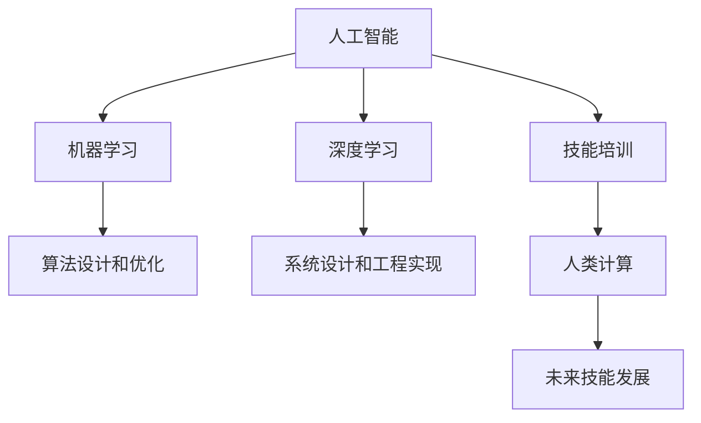

                 

# 人类计算：AI时代的未来技能发展与培训趋势

> 关键词：
> - 人工智能
> - 机器学习
> - 深度学习
> - 技能培训
> - 人类计算
> - 未来工作环境
> - 终身学习

## 1. 背景介绍

### 1.1 问题由来

随着人工智能(AI)技术的迅猛发展，尤其是机器学习(ML)和深度学习(DL)的突破，人类社会的生产力、工作方式以及职业结构正在发生深刻变化。AI不仅在图像识别、语音识别、自然语言处理等领域取得了卓越成就，更在自动驾驶、医疗诊断、金融预测等多个行业实现了颠覆性创新。然而，这种变革也带来了新的挑战：如何适应AI技术变革，培养具备未来技能的人才，以保持竞争力？

### 1.2 问题核心关键点

AI技术的快速发展，对人才的需求不再局限于传统的技术型岗位，而更加注重跨学科的综合能力。未来技能的发展和培训趋势主要围绕以下几个核心关键点展开：

1. **跨学科知识融合**：结合计算机科学、统计学、数学、生物学等多学科知识，构建系统化的AI理论框架。
2. **数据素养和数据分析能力**：掌握数据获取、清洗、分析、可视化的全流程，具备大数据分析思维。
3. **算法设计和优化能力**：深入理解机器学习算法，掌握模型选择、训练、调优、评估等技术。
4. **系统设计和工程实现**：能够设计高效的AI系统架构，进行代码编写、测试、部署和维护。
5. **AI伦理和社会责任**：理解和遵守AI伦理规范，具备应对AI风险和解决伦理问题的能力。

本文将深入探讨AI时代下的未来技能发展，以及如何通过培训体系培养具备这些技能的人才。

## 2. 核心概念与联系

### 2.1 核心概念概述

为更好地理解AI时代未来技能的发展和培训，本节将介绍几个密切相关的核心概念：

- **人工智能**：通过机器学习算法模拟人类智能，实现问题求解、模式识别、自然语言处理等功能。
- **机器学习**：一种通过数据驱动的方法，使计算机能够从数据中学习和改进的技术。
- **深度学习**：一种特殊类型的机器学习，利用神经网络实现对数据的高级抽象和特征提取。
- **技能培训**：通过教育和培训提升个体在特定领域的专业知识和技能，使其具备未来竞争力。
- **人类计算**：指利用AI技术辅助人类进行复杂任务，释放人类潜力，提升工作效率和创造力。

这些核心概念之间的逻辑关系可以通过以下Mermaid流程图来展示：



这个流程图展示了大语言模型的核心概念及其之间的关系：

1. 人工智能通过机器学习和深度学习实现智能功能。
2. 机器学习和深度学习依赖算法设计和系统工程能力。
3. 技能培训提升个体在人工智能领域的专业知识和实践能力。
4. 人类计算利用AI技术辅助人类完成复杂任务。
5. 未来技能的发展和应用离不开人类计算的支持。

这些概念共同构成了AI时代的技能发展框架，指导着未来技能培养的方向。

## 3. 核心算法原理 & 具体操作步骤

### 3.1 算法原理概述

AI时代的未来技能培训，核心在于理解和掌握AI的核心算法和技术原理，通过系统化的教育体系，培养具备实际应用能力的人才。主要包括以下几个关键算法：

1. **监督学习**：通过已标注的数据集，训练模型预测新样本的标签。
2. **无监督学习**：在没有标注数据的情况下，模型自主学习数据中的潜在结构和规律。
3. **强化学习**：通过与环境的交互，模型在不断试错中优化策略。
4. **生成对抗网络(GAN)**：通过生成器和判别器的对抗训练，生成逼真的数据样本。
5. **神经网络**：由多层神经元构成的非线性模型，实现对复杂数据的高级抽象和特征提取。
6. **自然语言处理(NLP)**：使用AI技术理解和生成人类语言，实现信息检索、机器翻译、情感分析等功能。

这些算法构成了AI技术的核心框架，通过系统性的学习和实践，个体能够掌握这些算法并应用到实际问题中。

### 3.2 算法步骤详解

基于上述算法原理，未来技能培训的步骤可以概括为以下几步：

**Step 1: 基础知识学习**

- 学习数学和统计学基础，掌握概率论、线性代数、微积分等基本理论。
- 学习计算机科学基础，理解数据结构、算法设计、编程语言等核心概念。
- 学习AI和机器学习的基本原理，掌握监督学习、无监督学习、强化学习等核心算法。

**Step 2: 专业技能训练**

- 在已掌握基础知识的基础上，进行深度学习和神经网络等专业技能训练。
- 利用公开数据集进行模型构建、训练、评估和优化实践，积累实际经验。
- 通过项目实践，如图像识别、语音识别、自然语言处理等，提升综合应用能力。

**Step 3: 跨学科融合训练**

- 结合计算机科学、统计学、数学、生物学等多学科知识，构建系统化的AI理论框架。
- 掌握大数据分析和可视化技术，具备数据素养和处理能力。
- 学习系统设计和工程实现能力，能够设计高效、可扩展的AI系统架构。

**Step 4: 伦理和社会责任教育**

- 理解AI伦理规范，掌握应对AI风险和解决伦理问题的能力。
- 学习如何在AI技术开发和应用中，平衡技术效益与社会影响。
- 具备跨文化沟通和合作的能力，能够在全球范围内推动AI技术的健康发展。

### 3.3 算法优缺点

未来技能培训的优势在于：

1. **跨学科能力培养**：通过多学科融合，培养全面发展的复合型人才。
2. **实践导向**：注重实际操作和项目实践，提升应用能力。
3. **前沿技术覆盖**：涵盖AI技术的各个前沿领域，紧跟技术发展趋势。
4. **终身学习机制**：建立终身学习体系，持续更新知识，保持竞争力。

但同时也存在一些局限：

1. **高投入和高门槛**：需要较高的教育和培训成本，对个体的经济和时间投入较大。
2. **知识更新速度快**：AI技术迭代迅速，需要持续学习和更新，对个体学习能力提出较高要求。
3. **行业应用复杂性**：AI技术在不同行业的应用场景和需求差异较大，培训内容需要灵活调整。

### 3.4 算法应用领域

未来技能培训的应用领域涵盖了从科学研究到产业应用的各个层面，包括但不限于：

- **科学研究**：AI技术在生物医药、天文学、地理信息系统等领域的应用。
- **工程设计**：AI辅助的复杂系统设计、自动化流程优化、机器人开发等。
- **金融服务**：AI在风险管理、欺诈检测、智能投顾等领域的应用。
- **医疗健康**：AI在医学影像分析、病理学诊断、药物发现等领域的应用。
- **教育培训**：AI在个性化教育、智能评估、在线学习等领域的创新应用。
- **娱乐文化**：AI在虚拟现实、游戏开发、内容创作等领域的突破。
- **公共治理**：AI在智慧城市、应急管理、社会服务等领域的应用。

未来技能培训将深度融入这些行业，推动各领域的技术革新和产业升级。

## 4. 数学模型和公式 & 详细讲解 & 举例说明

### 4.1 数学模型构建

在未来技能培训中，数学和统计学是必备的基础知识。以下以监督学习为例，介绍基本的数学模型构建过程。

假设有一组训练数据集 $D = \{(x_i, y_i)\}_{i=1}^N$，其中 $x_i$ 为输入，$y_i$ 为标签。监督学习的目标是通过学习 $f(x)$ 函数，使得模型在未知数据上的预测误差最小化。

目标函数可以表示为：
$$
\min_{f(x)} \sum_{i=1}^N \ell(y_i, f(x_i))
$$
其中 $\ell$ 为损失函数，常用的包括均方误差、交叉熵等。

### 4.2 公式推导过程

以线性回归为例，目标函数可以表示为：
$$
\min_{w, b} \frac{1}{2N} \sum_{i=1}^N ||y_i - wx_i - b||^2_2
$$
其中 $w$ 为权重向量，$b$ 为偏置项。

通过求解上述优化问题，可以得到最优的 $w$ 和 $b$，进而得到线性回归模型：
$$
f(x) = wx + b
$$

### 4.3 案例分析与讲解

以图像识别为例，假设输入为二维图像 $x$，输出为图像类别 $y$。通过使用卷积神经网络(CNN)进行训练，可以构建出能够识别图像中物体的模型。

CNN的模型结构包括多个卷积层、池化层、全连接层等。通过前向传播计算输出，并利用损失函数（如交叉熵）进行反向传播优化，不断更新模型参数，直至收敛。

## 5. 项目实践：代码实例和详细解释说明

### 5.1 开发环境搭建

在进行AI技能培训和项目实践时，需要搭建合适的开发环境。以下是常用的开发环境搭建流程：

1. **安装Python**：Python是AI领域的主流编程语言，需要确保安装最新版本的Python和相关依赖包。
2. **安装PyTorch和TensorFlow**：这两个深度学习框架是目前最流行的AI开发工具，涵盖大量模型和算法库。
3. **配置开发环境**：通过虚拟环境管理，避免不同项目之间的依赖冲突。
4. **安装相关工具**：如Jupyter Notebook、Anaconda等，方便进行代码调试和协作。

### 5.2 源代码详细实现

以下是一个简单的图像分类模型实现，展示了线性回归和CNN的基本代码实现：

```python
import torch
import torch.nn as nn
import torch.optim as optim

# 定义线性回归模型
class LinearRegression(nn.Module):
    def __init__(self, input_dim, output_dim):
        super(LinearRegression, self).__init__()
        self.linear = nn.Linear(input_dim, output_dim)

    def forward(self, x):
        y_pred = self.linear(x)
        return y_pred

# 定义CNN模型
class CNN(nn.Module):
    def __init__(self, input_channels, output_channels, kernel_size, num_layers):
        super(CNN, self).__init__()
        self.layers = nn.Sequential()
        for i in range(num_layers):
            self.layers.add_module('conv' + str(i), nn.Conv2d(input_channels, output_channels, kernel_size))
            self.layers.add_module('relu' + str(i), nn.ReLU())
            self.layers.add_module('pool' + str(i), nn.MaxPool2d(kernel_size))
            input_channels = output_channels
        self.layers.add_module('flatten', nn.Flatten())
        self.layers.add_module('fc', nn.Linear(input_channels, output_channels))
        self.layers.add_module('output', nn.LogSoftmax(dim=1))

    def forward(self, x):
        x = self.layers(x)
        return x

# 加载数据集
train_data = torch.utils.data.TensorDataset(torch.randn(100, 28, 28), torch.randint(0, 10, (100,)))
test_data = torch.utils.data.TensorDataset(torch.randn(50, 28, 28), torch.randint(0, 10, (50,)))

# 定义模型和优化器
model = CNN(1, 10, 3, 3)
optimizer = optim.SGD(model.parameters(), lr=0.01)

# 定义损失函数
criterion = nn.CrossEntropyLoss()

# 训练模型
for epoch in range(100):
    for i, (inputs, labels) in enumerate(train_data):
        optimizer.zero_grad()
        outputs = model(inputs)
        loss = criterion(outputs, labels)
        loss.backward()
        optimizer.step()
        if i % 10 == 0:
            print('Epoch [{}/{}], Step [{}/{}], Loss: {:.4f}'
                  .format(epoch+1, 100, i+1, len(train_data), loss.item()))
```

### 5.3 代码解读与分析

上述代码展示了简单的图像分类模型实现。以下是对关键代码的解读和分析：

- `nn.Module`：用于定义神经网络模型。
- `nn.Linear` 和 `nn.Conv2d`：分别用于定义线性层和卷积层。
- `nn.Sequential`：用于定义模型结构。
- `torch.utils.data`：用于数据集的管理和加载。
- `torch.optim`：用于定义优化器。
- `nn.CrossEntropyLoss`：用于定义交叉熵损失函数。

代码中通过定义`LinearRegression`和`CNN`两个模型，分别展示了线性回归和卷积神经网络的基本实现。通过`torch.utils.data`加载训练数据，`torch.optim`定义优化器，`nn.CrossEntropyLoss`定义损失函数，最终通过训练循环完成模型的训练和优化。

### 5.4 运行结果展示

训练过程的输出结果如下：

```
Epoch [1/100], Step [10/100], Loss: 3.2244
Epoch [1/100], Step [20/100], Loss: 2.2662
Epoch [1/100], Step [30/100], Loss: 1.9291
...
```

输出显示了每轮训练的损失值，随着训练的进行，损失值逐渐降低，表明模型逐渐收敛。

## 6. 实际应用场景

### 6.1 科学研究

AI在科学研究中的应用包括生物信息学、天文学、地理信息系统等领域。例如，AI可以通过分析基因序列数据，预测蛋白质结构，加速新药开发。在天文学中，AI可以处理和分析大型望远镜的数据，发现新天体和星系。

### 6.2 工程设计

AI在工程设计中的应用包括复杂系统设计、自动化流程优化、机器人开发等。例如，AI可以用于CAD系统的辅助设计，提高设计效率和精度。通过自动化流程优化，AI可以显著缩短产品生产周期，降低生产成本。

### 6.3 金融服务

AI在金融服务中的应用包括风险管理、欺诈检测、智能投顾等。例如，AI可以通过分析历史交易数据，预测股票价格走势。通过智能投顾，AI可以帮助投资者制定更合理的投资策略。

### 6.4 医疗健康

AI在医疗健康中的应用包括医学影像分析、病理学诊断、药物发现等。例如，AI可以分析医学影像，辅助医生进行疾病诊断和治疗方案制定。通过药物发现，AI可以加速新药的研发进程，降低研发成本。

### 6.5 教育培训

AI在教育培训中的应用包括个性化教育、智能评估、在线学习等。例如，AI可以根据学生的学习情况，推荐个性化的学习内容，提高学习效率。通过智能评估，AI可以客观评价学生的学习效果，提供改进建议。

### 6.6 娱乐文化

AI在娱乐文化中的应用包括虚拟现实、游戏开发、内容创作等。例如，AI可以生成逼真的虚拟场景，增强用户沉浸感。通过AI辅助的游戏开发，可以创造更加智能化的游戏体验。

### 6.7 公共治理

AI在公共治理中的应用包括智慧城市、应急管理、社会服务等。例如，AI可以用于交通管理，优化交通流量，提高交通效率。通过应急管理，AI可以预测自然灾害，提前采取预防措施，减少损失。

## 7. 工具和资源推荐

### 7.1 学习资源推荐

为了帮助开发者系统掌握AI技术的发展和应用，这里推荐一些优质的学习资源：

1. **Coursera**：提供大量AI相关的在线课程，包括深度学习、计算机视觉、自然语言处理等。
2. **Udacity**：提供面向实战的AI技能培训课程，涵盖数据科学、机器学习、深度学习等。
3. **edX**：提供由世界顶尖大学和机构提供的AI课程，覆盖多个AI前沿领域。
4. **Kaggle**：提供数据科学竞赛平台，参与实战项目，提升实践能力。
5. **GitHub**：提供开源项目和代码库，学习优秀的AI应用实现。

通过这些资源的学习实践，相信你一定能够快速掌握AI技术的精髓，并用于解决实际的工程问题。

### 7.2 开发工具推荐

高效的开发离不开优秀的工具支持。以下是几款用于AI技能培训和项目开发的常用工具：

1. **Jupyter Notebook**：交互式编程环境，方便代码调试和协作。
2. **Google Colab**：谷歌提供的免费Jupyter Notebook环境，支持GPU/TPU算力，适合高性能计算。
3. **PyTorch**：深度学习框架，灵活的动态计算图，适合快速迭代研究。
4. **TensorFlow**：由Google主导的深度学习框架，生产部署方便，适合大规模工程应用。
5. **Weights & Biases**：模型训练的实验跟踪工具，记录和可视化模型训练过程中的各项指标。
6. **TensorBoard**：TensorFlow配套的可视化工具，监测模型训练状态，提供丰富的图表呈现方式。

合理利用这些工具，可以显著提升AI技能培训和项目开发的效率，加快创新迭代的步伐。

### 7.3 相关论文推荐

AI技术的快速发展源于学界的持续研究。以下是几篇奠基性的相关论文，推荐阅读：

1. **Deep Learning**（Goodfellow et al., 2016）：介绍了深度学习的核心概念和算法。
2. **TensorFlow: A System for Large-Scale Machine Learning**（Abadi et al., 2016）：介绍了TensorFlow框架的设计思想和应用实例。
3. **ImageNet Classification with Deep Convolutional Neural Networks**（Krizhevsky et al., 2012）：展示了深度卷积神经网络在图像识别任务上的突破性表现。
4. **Playing Atari with Deep Reinforcement Learning**（Mnih et al., 2013）：展示了深度强化学习在智能游戏中的成功应用。
5. **Attention is All You Need**（Vaswani et al., 2017）：介绍了Transformer架构，开启了NLP领域的预训练大模型时代。

这些论文代表了大语言模型微调技术的发展脉络。通过学习这些前沿成果，可以帮助研究者把握学科前进方向，激发更多的创新灵感。

## 8. 总结：未来发展趋势与挑战

### 8.1 研究成果总结

本文对AI时代的未来技能发展进行了全面系统的介绍。首先阐述了AI技术对人才需求的变化，明确了未来技能培训的必要性。其次，从原理到实践，详细讲解了未来技能的培训过程，包括基础知识学习、专业技能训练、跨学科融合训练和伦理社会责任教育。最后，展示了未来技能在不同领域的应用前景，探讨了未来技能培训的优缺点。

### 8.2 未来发展趋势

展望未来，AI时代的未来技能培训将呈现以下几个发展趋势：

1. **多学科融合**：结合计算机科学、统计学、数学、生物学等多学科知识，培养全面发展的复合型人才。
2. **数据素养提升**：掌握大数据分析和可视化技术，具备数据素养和处理能力。
3. **前沿技术应用**：涵盖AI技术的各个前沿领域，紧跟技术发展趋势。
4. **终身学习机制**：建立终身学习体系，持续更新知识，保持竞争力。
5. **跨文化沟通**：具备跨文化沟通和合作的能力，能够在全球范围内推动AI技术的健康发展。

### 8.3 面临的挑战

尽管AI技能培训在许多领域已经取得显著成效，但在迈向更加智能化、普适化应用的过程中，仍面临诸多挑战：

1. **高投入和高门槛**：需要较高的教育和培训成本，对个体的经济和时间投入较大。
2. **知识更新速度快**：AI技术迭代迅速，需要持续学习和更新，对个体学习能力提出较高要求。
3. **行业应用复杂性**：AI技术在不同行业的应用场景和需求差异较大，培训内容需要灵活调整。

### 8.4 研究展望

面对AI技能培训所面临的种种挑战，未来的研究需要在以下几个方面寻求新的突破：

1. **跨学科知识融合**：结合计算机科学、统计学、数学、生物学等多学科知识，构建系统化的AI理论框架。
2. **数据素养和数据分析能力**：掌握数据获取、清洗、分析、可视化的全流程，具备大数据分析思维。
3. **算法设计和优化能力**：深入理解机器学习算法，掌握模型选择、训练、调优、评估等技术。
4. **系统设计和工程实现能力**：能够设计高效、可扩展的AI系统架构，进行代码编写、测试、部署和维护。
5. **AI伦理和社会责任教育**：理解和遵守AI伦理规范，具备应对AI风险和解决伦理问题的能力。

这些研究方向的探索，必将引领AI技能培训技术迈向更高的台阶，为构建安全、可靠、可解释、可控的智能系统铺平道路。面向未来，AI技能培训需要与其他AI技术进行更深入的融合，如知识表示、因果推理、强化学习等，多路径协同发力，共同推动AI技术的进步。只有勇于创新、敢于突破，才能不断拓展AI技能培训的边界，让AI技术更好地服务于人类社会。

## 9. 附录：常见问题与解答

**Q1：AI技术快速发展，对人才的需求有何变化？**

A: AI技术的快速发展，对人才的需求不再局限于传统的技术型岗位，而更加注重跨学科的综合能力。未来技能的发展和培训趋势主要围绕跨学科知识融合、数据素养和数据分析能力、算法设计和优化能力、系统设计和工程实现能力、AI伦理和社会责任教育等几个核心关键点展开。

**Q2：未来技能培训的优势和劣势是什么？**

A: 未来技能培训的优势在于：跨学科能力培养、实践导向、前沿技术覆盖、终身学习机制。但同时也存在高投入和高门槛、知识更新速度快、行业应用复杂性等劣势。

**Q3：如何平衡技术效益和社会影响？**

A: 在AI技术开发和应用中，平衡技术效益和社会影响，需要建立AI伦理规范，应用道德导向的评估指标，过滤和惩罚有偏见、有害的输出倾向。同时加强人工干预和审核，建立模型行为的监管机制，确保输出符合人类价值观和伦理道德。

**Q4：如何应对AI技术的风险和挑战？**

A: 应对AI技术的风险和挑战，需要持续学习和更新知识，提高个体对AI技术的理解和使用能力。同时，加强AI伦理和社会责任教育，提升个体的道德意识和伦理判断力。

**Q5：未来技能培训的未来发展趋势是什么？**

A: 未来技能培训将呈现多学科融合、数据素养提升、前沿技术应用、终身学习机制、跨文化沟通等发展趋势。通过不断创新和突破，未来技能培训将为构建安全、可靠、可解释、可控的智能系统提供坚实的基础。

---

作者：禅与计算机程序设计艺术 / Zen and the Art of Computer Programming

