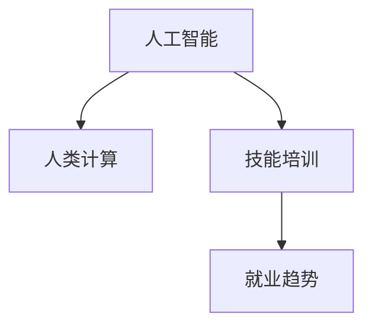

                 

# 人类计算：AI时代的未来技能培训与就业趋势

在人工智能(AI)技术迅猛发展的今天，我们面临着前所未有的机遇和挑战。AI不仅是技术领域的一次革命，也深刻影响着教育、就业和社会结构。本文将探讨在AI时代，人类计算的演进、技能培训和就业趋势，以及如何迎接这些变化。

## 1. 背景介绍

### 1.1 人工智能的崛起
近年来，AI技术的快速发展尤其是深度学习、自然语言处理(NLP)、计算机视觉(CV)等领域的突破，已经让机器开始在越来越多的场景下替代人类执行复杂计算任务。例如，谷歌的AlphaGo击败了世界围棋冠军，OpenAI的GPT-3可以生成高质量的文本，自动驾驶技术逐渐成熟。这些成就展示了AI在特定任务上的惊人能力，同时也引发了对人类就业的担忧。

### 1.2 就业市场变化
AI技术在提高生产效率、降低成本的同时，也在重塑就业市场。自动化和智能化工具逐渐普及，对低技能岗位产生冲击。另一方面，AI技术也创造了新的职业机会，如AI工程师、数据科学家、机器学习专家等。

## 2. 核心概念与联系

### 2.1 核心概念概述

- **人工智能**：机器通过学习算法模仿人类智能行为的技术。
- **人类计算**：人类通过自身智能解决复杂问题的过程。
- **AI时代的技能培训**：针对AI技能和应用的教育培训，帮助人类适应AI时代的职业环境。
- **就业趋势**：AI技术对不同行业就业市场的长期影响和预测。

这些概念相互关联，共同构成了AI时代下人类计算和就业的新图景。

### 2.2 核心概念原理和架构的 Mermaid 流程图



这个流程图展示了大体的人工智能、人类计算、技能培训和就业趋势之间的关系：

1. **人工智能**：作为技术基础，AI提供了处理复杂计算任务的工具。
2. **人类计算**：在AI技术的支持下，人类计算能力得以增强和拓展。
3. **技能培训**：培训人类掌握AI技术，提高技能水平。
4. **就业趋势**：AI技术带来的就业市场变化和未来趋势。

## 3. 核心算法原理 & 具体操作步骤

### 3.1 算法原理概述

AI时代的技能培训和就业趋势分析，离不开对核心算法的理解。算法原理概述如下：

1. **监督学习**：通过有标签的数据集训练模型，使其能够在特定任务上表现出色。
2. **无监督学习**：使用无标签数据，通过数据内在规律学习模型。
3. **强化学习**：通过与环境交互，不断调整策略以最大化预期回报。

这些学习方式构成了AI技能培训的主要方法。

### 3.2 算法步骤详解

AI时代的技能培训通常包括以下步骤：

1. **需求分析**：确定哪些技能是未来所需的核心能力。
2. **课程设计**：基于需求设计课程内容，包括理论知识、实践技能和工具使用。
3. **教学实施**：通过在线课程、工作坊、实验室等形式实施教学。
4. **技能评估**：通过考试、项目评估等方式评估学员的学习效果。

### 3.3 算法优缺点

**优点**：
- **提升技能**：通过系统培训，可以显著提高学习者的技能水平。
- **灵活性高**：在线课程和工作坊可以根据需求随时调整内容。

**缺点**：
- **资源需求大**：需要大量专业师资、高质量课程内容和先进教学设备。
- **个体差异**：培训效果因个体差异而异，难以确保每位学员都能达到目标。

### 3.4 算法应用领域

AI技能培训广泛应用于各个行业，如科技、金融、医疗、教育、制造业等。不同行业的具体需求和应用形式有所不同，但总体目标都是提升人力资源的AI素养。

## 4. 数学模型和公式 & 详细讲解 & 举例说明

### 4.1 数学模型构建

本节将介绍一个基本的监督学习模型——线性回归模型，用于预测某一变量的值。线性回归的数学模型为：

$$ y = \theta_0 + \theta_1 x_1 + \theta_2 x_2 + \cdots + \theta_n x_n $$

其中，$y$ 为预测值，$\theta$ 为模型参数，$x$ 为输入变量。

### 4.2 公式推导过程

线性回归模型的目标是最小化预测值与实际值之间的平方误差：

$$ J(\theta) = \frac{1}{2m} \sum_{i=1}^m (y_i - \hat{y_i})^2 $$

其中，$m$ 为样本数，$y_i$ 为实际值，$\hat{y_i}$ 为预测值。

通过梯度下降算法求解最小化问题，得到模型参数的更新公式：

$$ \theta_j = \theta_j - \alpha \frac{1}{m} \sum_{i=1}^m (x_{ij} - \bar{x_j})(y_i - \hat{y_i}) $$

其中，$\alpha$ 为学习率。

### 4.3 案例分析与讲解

假设某公司希望通过员工的教育水平、工作经验预测其工资水平。可以通过收集员工的教育水平、工作经验以及工资数据，设计线性回归模型进行预测。通过训练和测试模型，可以找到最优的模型参数，从而实现对新员工工资的预测。

## 5. 项目实践：代码实例和详细解释说明

### 5.1 开发环境搭建

开发环境搭建包括以下步骤：

1. 安装Python：建议安装最新版本。
2. 安装必要的库：如Numpy、Pandas、Scikit-learn、Matplotlib等。
3. 安装Jupyter Notebook：用于编写和运行代码。

### 5.2 源代码详细实现

以线性回归为例，以下是Python代码实现：

```python
import numpy as np
from sklearn.linear_model import LinearRegression

# 定义样本数据
X = np.array([[1, 2], [2, 3], [3, 4], [4, 5]])
y = np.array([3, 5, 7, 9])

# 创建线性回归模型
model = LinearRegression()

# 训练模型
model.fit(X, y)

# 预测新样本
new_X = np.array([[5, 6]])
predicted_y = model.predict(new_X)

print("预测值：", predicted_y)
```

### 5.3 代码解读与分析

以上代码实现了线性回归模型的训练和预测过程。首先，定义了样本数据X和y，然后使用LinearRegression类创建线性回归模型，并使用fit方法进行训练。最后，使用predict方法对新样本进行预测，并输出结果。

## 6. 实际应用场景

### 6.1 智能制造

在制造业中，AI技术用于优化生产流程、提升产品质量、降低成本。技能培训应侧重于机器学习、数据分析和自动化工具的使用。

### 6.2 医疗健康

医疗领域对AI技术的需求日益增长，从疾病预测到个性化治疗，AI技术在医疗中的应用越来越广泛。技能培训应包括医学影像分析、药物研发和患者数据处理等领域的知识和技能。

### 6.3 金融服务

金融行业正逐步采用AI进行风险管理、欺诈检测、客户服务自动化等。技能培训重点在于数据科学、机器学习、算法设计等方面的能力。

### 6.4 未来应用展望

未来，AI技术将在更多领域得到应用，技能培训应持续更新以应对不断变化的需求。例如，智能城市、教育、农业等领域都将需要大量具备AI技能的人才。

## 7. 工具和资源推荐

### 7.1 学习资源推荐

1. Coursera、edX等在线教育平台提供了丰富的AI相关课程。
2. GitHub上开源的AI项目和代码是学习的良好资源。
3. Kaggle数据科学竞赛平台可以锻炼实际应用能力。

### 7.2 开发工具推荐

1. Python：Python是AI领域最流行的编程语言，具有丰富的第三方库支持。
2. Jupyter Notebook：Jupyter Notebook提供了一个交互式环境，便于代码编写和实验。
3. TensorFlow和PyTorch：这些深度学习框架提供了强大的工具和接口，便于模型构建和训练。

### 7.3 相关论文推荐

1. "Deep Learning" by Ian Goodfellow、Yoshua Bengio、Aaron Courville。
2. "Human-AI Collaboration: Promising Innovations, Challenges, and Ethical Considerations" by Mark Myrow et al.
3. "Artificial Intelligence in the Workplace: Challenges and Opportunities" by Brian Wilcox.

## 8. 总结：未来发展趋势与挑战

### 8.1 研究成果总结

AI技术的快速发展对各行各业产生了深远影响，技能培训应紧跟技术趋势，培养未来所需的人才。

### 8.2 未来发展趋势

1. **技术融合**：AI技术与传统行业的深度融合将创造更多新的职业机会。
2. **技能转型**：不断学习新技能，适应AI技术带来的变化。
3. **跨领域应用**：跨学科知识的掌握将成为必备能力。

### 8.3 面临的挑战

1. **资源限制**：技能培训需要大量资源，包括资金、师资、设备等。
2. **技术快速变化**：AI技术快速发展，培训内容需要及时更新。
3. **伦理和社会问题**：AI技术的广泛应用可能带来伦理和社会问题，需要综合考虑。

### 8.4 研究展望

未来的研究应关注如何更好地整合跨学科知识、开发智能学习系统、提升AI技术的可解释性，并确保技术的伦理和社会责任。

## 9. 附录：常见问题与解答

**Q1：AI技能培训应如何与实际工作场景相结合？**

A: 培训内容应紧密结合实际工作需求，包括案例分析、项目实践、模拟场景等。同时，企业应为员工提供学习平台和资源支持，鼓励在工作中应用所学技能。

**Q2：AI技能培训应重点关注哪些方面？**

A: 重点应包括数据处理、模型构建、算法优化、结果评估等方面的能力。同时，应注重跨学科知识的融合和应用，如医疗、金融、制造等领域。

**Q3：AI技能培训中如何评估学习效果？**

A: 评估应综合理论考试、项目实践和实际工作表现。定期进行技能测试，及时发现和解决问题，确保培训效果。

**Q4：AI技能培训面临的主要挑战是什么？**

A: 资源限制、技术快速变化、伦理问题等是主要挑战。需要多方合作，共同应对。

通过以上探讨，我们不难看出，AI时代下的技能培训和就业趋势充满了挑战与机遇。只有积极适应技术变化，不断提升自身技能，才能在未来的职场中保持竞争力。同时，企业和教育机构应共同努力，构建更加完善的培训体系，为AI时代的人才培养贡献力量。

