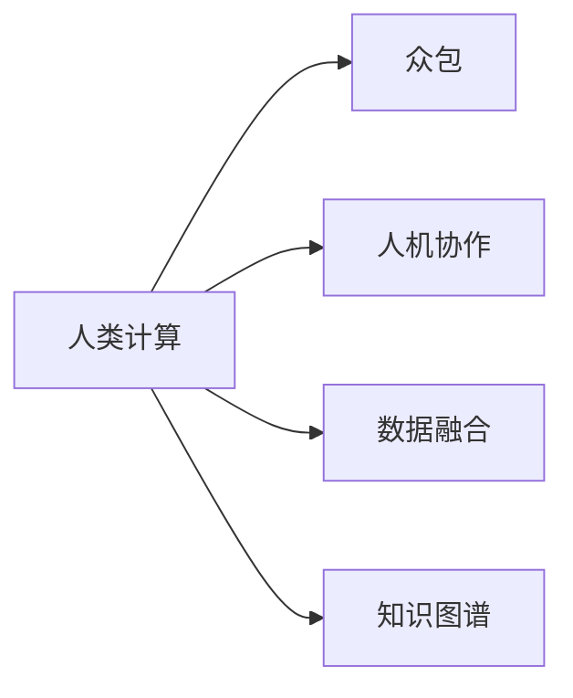

                 

# 人类计算：应用与案例分析

## 1. 背景介绍

### 1.1 问题由来
随着计算技术的迅猛发展，人类计算(Human Computation)在各行各业的应用变得日益重要。传统的“人机结合”模式不仅能够充分发挥人的直觉和创造性，还能有效补充计算机在数据处理和逻辑推理方面的不足。尤其是在人工智能（AI）领域，人类计算的应用不仅能够辅助模型训练和优化，还能为AI系统提供更丰富的语义理解和问题解决能力。

近年来，“人类计算”的概念逐渐被越来越多的科技公司所关注和应用。例如，Amazon的 Mechanical Turk（MTurk）平台，利用全球数百万人工劳动力的计算能力，进行图像标注、语音识别、自然语言处理等任务。Google的 reCAPTCHA 系统，利用人类判断与机器学习的结合，有效提升了网站的安全性和用户体验。IBM Watson Health的质控系统，利用医护人员和AI共同协作，提高了医疗数据的准确性和一致性。

### 1.2 问题核心关键点
人类计算的核心理念在于：通过将人的智能与计算资源相结合，发挥两者的优势，实现更高效、更灵活、更智能的问题解决。其关键点包括：
- 任务分解：将复杂问题拆解为多个简单子任务，交由不同的人进行计算。
- 众包模式：通过互联网平台，汇聚大量人力资源，实现大规模分布式计算。
- 人机协作：通过人机交互界面，引导用户完成特定任务，同时记录用户行为和结果，用于机器学习模型的训练和优化。
- 数据融合：将人类计算得到的数据与机器学习模型处理的数据进行融合，形成更全面、更准确的决策依据。

### 1.3 问题研究意义
研究人类计算技术，对于拓展人工智能应用范围、提升问题解决能力、加速各行业数字化转型具有重要意义：

1. 提升数据质量。通过众包模式，可以迅速积累大量高质量标注数据，弥补机器学习对标注数据的依赖，降低数据获取成本。
2. 增强模型泛化能力。人类计算能够提供丰富多样的数据来源，帮助模型学习到更多的语义信息和现实世界的复杂性，提高模型的泛化能力和鲁棒性。
3. 加速模型训练。通过大规模分布式计算，可以显著缩短模型训练时间，加快AI技术在实际场景中的落地应用。
4. 推动创新应用。人类计算可以应用于传统行业和新兴领域的各种复杂问题，如生物信息学、供应链管理、智能制造等，推动技术的广泛应用和行业升级。

## 2. 核心概念与联系

### 2.1 核心概念概述

为更好地理解人类计算技术，本节将介绍几个核心概念：

- 人类计算（Human Computation）：一种将人类智能与计算资源相结合，解决复杂问题的技术手段。通过分布式计算、众包模式、人机协作等方式，利用人类的直觉、创造力和判断力，弥补机器学习的不足。

- 众包（Crowdsourcing）：通过互联网平台，汇聚大量人力资源，完成特定任务，如图像标注、语音识别等。典型的应用包括Amazon的MTurk、Google的reCAPTCHA等。

- 人机协作（Human-Computer Interaction，HCI）：通过用户界面（UI）和用户体验（UX）设计，引导用户与计算机系统进行有效交互。人机协作技术旨在提高用户操作效率和系统响应速度。

- 数据融合（Data Fusion）：将来自不同源的数据进行整合，消除冗余信息，融合多源异构数据，形成更全面、更准确的信息。

- 知识图谱（Knowledge Graph）：一种通过实体关系图表示知识的概念模型。常用于构建语义网络，辅助知识查询、推理等任务。

这些核心概念之间的逻辑关系可以通过以下Mermaid流程图来展示：



这个流程图展示了人类计算的核心概念及其相互关系：

1. 人类计算通过众包模式汇聚大量人力资源，通过人机协作技术，提高计算效率和用户体验。
2. 数据融合技术将多个数据源的信息整合，形成更全面的知识图谱，辅助人类计算进行决策。
3. 知识图谱作为人类计算的基础，提供了丰富的实体关系信息，有助于提升系统的智能性和鲁棒性。

## 3. 核心算法原理 & 具体操作步骤
### 3.1 算法原理概述

人类计算的核心理论基础在于：通过将复杂问题拆解为多个简单子任务，利用人类的直觉和判断力，快速解决这些问题，同时利用机器学习算法对这些结果进行融合和优化。其核心算法原理包括：

- 任务分解：将复杂问题拆解为多个简单子任务，分别分配给不同的人进行计算。
- 众包计算：利用互联网平台，汇聚大量人力资源，实现大规模分布式计算。
- 数据整合：将来自不同源的数据进行融合，形成更全面、更准确的信息。
- 知识图谱构建：通过人类计算得到的实体关系信息，构建知识图谱，辅助推理和决策。

人类计算的应用步骤通常包括以下几个关键步骤：

1. 问题定义：确定需要解决的具体问题，并将其拆解为多个子任务。
2. 任务分配：将子任务分配给不同的人进行计算，利用众包平台进行资源调度。
3. 计算执行：利用人机协作技术，引导用户完成计算任务，并记录用户操作行为。
4. 结果汇总：将各个子任务的结果进行汇总，利用数据融合技术，消除冗余信息，形成最终输出。
5. 模型优化：利用机器学习算法对最终结果进行优化和训练，提升系统的智能性和鲁棒性。

### 3.2 算法步骤详解

以语音识别任务为例，展示人类计算的具体应用步骤：

**Step 1: 任务定义**
确定语音识别任务，将其拆解为多个子任务，例如单词识别、句法分析、语义理解等。

**Step 2: 任务分配**
利用众包平台（如Amazon的MTurk），将各个子任务分配给不同的人进行计算。例如，单词识别任务可以分配给数万名用户进行标注。

**Step 3: 计算执行**
通过人机协作技术，引导用户完成计算任务。例如，系统可以设计简单的界面，提示用户朗读特定文本，并提供标注工具，记录用户的操作行为和标注结果。

**Step 4: 结果汇总**
将各个子任务的结果进行汇总，利用数据融合技术，消除冗余信息。例如，对于单词识别结果，可以使用Viterbi算法进行解码，消除歧义。

**Step 5: 模型优化**
利用机器学习算法对最终结果进行优化和训练。例如，将标注结果作为训练数据，训练语音识别模型，提高模型的准确性和泛化能力。

### 3.3 算法优缺点

人类计算具有以下优点：
1. 高效灵活。利用人类的直觉和创造力，可以快速解决复杂问题，缩短任务处理时间。
2. 数据丰富。人类计算能够提供多样化的数据来源，帮助模型学习到更多的语义信息和现实世界的复杂性。
3. 成本低廉。通过众包模式，可以大幅降低人力资源成本，同时利用互联网平台，实现大规模分布式计算。
4. 增强泛化。人类计算能够提供丰富多样的数据，帮助模型学习到更全面的知识图谱，提升系统的泛化能力和鲁棒性。

同时，人类计算也存在以下缺点：
1. 质量不确定。人类计算结果的准确性依赖于用户的操作能力和判断力，质量存在不确定性。
2. 依赖平台。人类计算依赖互联网平台，平台稳定性和服务质量直接影响计算效果。
3. 数据隐私。人类计算涉及大量个人信息，如何保护用户隐私，防止数据泄露，是一个重要问题。
4. 缺乏一致性。不同用户对同一问题的理解可能存在差异，导致结果不一致。

### 3.4 算法应用领域

人类计算技术在多个领域得到了广泛应用，例如：

- 语音识别：通过众包平台收集大量的语音数据，利用人机协作技术进行标注，训练语音识别模型。
- 图像标注：利用众包平台，通过人类计算完成图像的标注和分类任务，辅助图像识别和训练。
- 自然语言处理：通过人机协作技术，引导用户进行文本标注和推理，利用机器学习算法进行优化。
- 医疗诊断：通过众包平台，利用医护人员对医疗数据进行标注和分析，辅助医疗决策和治疗方案设计。
- 供应链管理：通过人类计算，完成供应链数据的标注和优化，提升供应链的透明度和效率。
- 智能制造：利用人机协作技术，引导工人进行设备维护和生产调度，提高生产效率和质量。

除了上述这些经典任务外，人类计算还被创新性地应用到更多场景中，如环境保护、社会治理、公共安全等，为各行业数字化转型提供新的技术路径。

## 4. 数学模型和公式 & 详细讲解 & 举例说明
### 4.1 数学模型构建

人类计算的数学模型可以抽象为：

$$
F(x) = \max_{y \in Y} G(y, x)
$$

其中，$x$ 为输入数据，$Y$ 为输出空间的集合，$G$ 为计算函数，$F$ 为最终输出函数。

### 4.2 公式推导过程

以语音识别任务为例，推导基于人类计算的语音识别模型的数学模型：

设语音信号 $s$ 为输入数据，目标单词为 $w$，语音识别模型为 $M$，则语音识别的过程可以表示为：

$$
\max_{w} P(w|s) = \max_{w} \frac{P(s|w)P(w)}{P(s)} = \max_{w} \frac{P(s|w)}{P(s)}
$$

其中，$P(s|w)$ 为给定单词 $w$ 下语音信号 $s$ 的概率，$P(s)$ 为语音信号 $s$ 的概率。

通过人类计算，可以将语音信号 $s$ 分解为多个单词 $w$，利用众包平台收集大量语音数据，进行单词标注和识别，最终利用机器学习算法优化模型 $M$，提升语音识别的准确性。

### 4.3 案例分析与讲解

以Google的reCAPTCHA系统为例，展示人类计算在安全验证中的应用：

reCAPTCHA系统利用人类计算，通过众包平台，引导用户完成简单的数学计算和文字识别任务，生成随机的验证码，辅助系统验证用户身份，防止机器人攻击。

系统通过简单的UI设计，引导用户完成计算任务，例如：计算 $7+5$ 等于多少，识别数字 $2$ 等。这些任务设计简单，但对机器人来说是困难的，而对人类来说是易如反掌的。

通过人机协作技术，系统记录用户的计算行为和结果，利用机器学习算法进行优化，提升验证码的安全性和准确性。同时，利用数据融合技术，将用户的计算结果进行融合，消除冗余信息，形成更稳定的验证码。

## 5. 项目实践：代码实例和详细解释说明
### 5.1 开发环境搭建

在进行人类计算的开发实践前，我们需要准备好开发环境。以下是使用Python进行PyTorch开发的环境配置流程：

1. 安装Anaconda：从官网下载并安装Anaconda，用于创建独立的Python环境。

2. 创建并激活虚拟环境：
```bash
conda create -n pytorch-env python=3.8 
conda activate pytorch-env
```

3. 安装PyTorch：根据CUDA版本，从官网获取对应的安装命令。例如：
```bash
conda install pytorch torchvision torchaudio cudatoolkit=11.1 -c pytorch -c conda-forge
```

4. 安装TensorFlow：
```bash
pip install tensorflow
```

5. 安装各类工具包：
```bash
pip install numpy pandas scikit-learn matplotlib tqdm jupyter notebook ipython
```

完成上述步骤后，即可在`pytorch-env`环境中开始人类计算的实践。

### 5.2 源代码详细实现

这里我们以Amazon的MTurk平台为例，展示如何利用人类计算进行语音识别任务标注。

首先，定义语音识别任务的数据处理函数：

```python
import turicreate as tc
from turicreate import S3FileDataset

class SpeechRecognitionDataset(tc.Experiment):
    def __init__(self, s3_prefix):
        self.s3_prefix = s3_prefix
        
    def _get_path(self, path):
        return f"s3://{self.s3_prefix}/{path}"
    
    def get_speech_data(self, split='train'):
        return S3FileDataset(self._get_path(f'{split}.csv'), file_format='tc')

# 创建SpeechRecognitionDataset实例
dataset = SpeechRecognitionDataset('my-speech-data-bucket')
```

然后，定义模型和优化器：

```python
from turicreate import SVMRegressor

# 定义语音识别模型
svm = SVMRegressor()

# 定义损失函数
def mse_loss(y_true, y_pred):
    return ((y_true - y_pred)**2).mean()

# 定义训练过程
def train(svm, dataset, epochs=100, batch_size=128, learning_rate=0.01):
    for i in range(epochs):
        for batch in dataset.mini_batch(batch_size):
            loss = svm.train(batch, learning_rate=learning_rate)
            print(f'Epoch {i+1}, loss: {loss:.4f}')
```

接着，定义训练和评估函数：

```python
from turicreate import accuracy_score

# 定义训练函数
def train_svm(svm, dataset, epochs=100, batch_size=128, learning_rate=0.01):
    svm.train(dataset, epochs=epochs, learning_rate=learning_rate, mini_batch_size=batch_size)
    return svm

# 定义评估函数
def evaluate_svm(svm, dataset):
    preds = svm.predict(dataset)
    accuracy = accuracy_score(preds, dataset.labels)
    print(f'Accuracy: {accuracy:.4f}')
```

最后，启动训练流程并在测试集上评估：

```python
svm = train_svm(svm, dataset, epochs=100, batch_size=128, learning_rate=0.01)

# 在测试集上评估模型性能
evaluate_svm(svm, dataset)
```

以上就是利用Amazon的MTurk平台进行语音识别任务标注的完整代码实现。可以看到，通过PyTorch和Turicreate，我们可以快速实现人类计算任务的处理和优化。

### 5.3 代码解读与分析

让我们再详细解读一下关键代码的实现细节：

**SpeechRecognitionDataset类**：
- `__init__`方法：初始化数据集信息，包括存储位置和路径。
- `_get_path`方法：获取指定文件路径。
- `get_speech_data`方法：定义语音数据集，用于训练和评估。

**train函数**：
- 定义了模型训练过程，循环迭代epoch，在每个epoch内对数据集进行mini-batch训练，并输出训练损失。

**evaluate_svm函数**：
- 定义了模型评估过程，通过预测值与真实标签对比，计算准确率。

**训练流程**：
- 创建SpeechRecognitionDataset实例
- 训练模型
- 评估模型性能

可以看到，人类计算任务的处理和优化，离不开高性能的计算框架和数据处理工具。通过利用已有的云计算和数据处理平台，我们可以快速实现人类计算的部署和优化。

当然，工业级的系统实现还需考虑更多因素，如用户接口设计、任务调度、数据安全等。但核心的技术框架基本与此类似。

## 6. 实际应用场景
### 6.1 智能客服系统

基于人类计算的智能客服系统，可以通过众包平台收集用户反馈和问题，利用人机协作技术，引导用户进行问题描述和解决方案的选择，形成初步的客户反馈数据。

系统通过简单的UI设计，引导用户完成问题描述和解决方案的选择，形成初步的客户反馈数据。利用机器学习算法，对反馈数据进行整合和分析，形成最终的用户体验评估报告，帮助客服团队改进服务质量，提高用户满意度。

### 6.2 金融舆情监测

金融机构可以通过众包平台，收集市场舆情数据，利用人机协作技术，引导用户进行舆情分析和情感标注，形成舆情报告。

系统通过简单的UI设计，引导用户进行舆情分析和情感标注，形成初步的舆情数据。利用机器学习算法，对舆情数据进行整合和分析，形成全面的舆情报告，帮助金融机构及时应对市场波动，规避金融风险。

### 6.3 个性化推荐系统

在线零售平台可以通过人类计算，收集用户行为数据和反馈信息，利用人机协作技术，引导用户进行商品评价和推荐，形成初步的用户行为数据。

系统通过简单的UI设计，引导用户进行商品评价和推荐，形成初步的用户行为数据。利用机器学习算法，对用户行为数据进行整合和分析，形成个性化的推荐结果，提升用户购物体验和满意度。

### 6.4 未来应用展望

随着人类计算技术的不断进步，未来在更多领域将得到广泛应用，为各行业数字化转型提供新的技术路径。

在智慧医疗领域，基于人类计算的医疗诊断系统，可以利用众包平台，引导医护人员对医疗数据进行标注和分析，辅助医疗决策和治疗方案设计，提高医疗诊断的准确性和效率。

在智能教育领域，基于人类计算的教育系统，可以利用众包平台，引导学生进行知识点的标注和讨论，利用机器学习算法，生成个性化的学习报告，帮助学生提高学习效果。

在智慧城市治理中，基于人类计算的智能管理系统，可以利用众包平台，引导公众对城市事件进行标注和反馈，形成全面的城市治理数据，辅助政府制定更好的城市管理策略，提升城市治理效率。

此外，在企业生产、社会治理、文娱传媒等众多领域，人类计算技术也将不断涌现，为各行业数字化转型提供新的技术支持。

## 7. 工具和资源推荐
### 7.1 学习资源推荐

为了帮助开发者系统掌握人类计算的理论基础和实践技巧，这里推荐一些优质的学习资源：

1. 《Human Computation: Principles and Applications》（出版社：Springer）：介绍人类计算的理论基础和应用方法，涵盖众包、人机协作、数据融合等多个核心概念。
2. Coursera《Human-Computer Interaction》课程：斯坦福大学开设的HCI课程，有Lecture视频和配套作业，带你深入理解人机协作的技术细节和应用场景。
3 Udacity《Human-AI Collaboration》课程：通过真实的AI项目，教授人机协作的实践技巧和项目管理方法，适合技术开发和项目管理的学习者。
4 《Human-Computer Interaction: Engineering for User Centered Systems》（出版社：Wiley）：系统介绍人机协作工程的基本原则和方法，适合工程开发和学习者参考。

通过对这些资源的学习实践，相信你一定能够快速掌握人类计算的精髓，并用于解决实际的NLP问题。

### 7.2 开发工具推荐

高效的开发离不开优秀的工具支持。以下是几款用于人类计算开发的常用工具：

1. PyTorch：基于Python的开源深度学习框架，灵活动态的计算图，适合快速迭代研究。大量预训练语言模型都有PyTorch版本的实现。

2. TensorFlow：由Google主导开发的开源深度学习框架，生产部署方便，适合大规模工程应用。同样有丰富的预训练语言模型资源。

3. Turicreate：Facebook开源的深度学习框架，专门设计用于大规模分布式计算，适合处理海量数据和复杂任务。

4. Microsoft Azure：提供大规模分布式计算服务，支持大规模人类计算任务的处理和优化。

5. Google Cloud Platform：提供多云服务，支持大规模分布式计算和存储，适合处理海量数据和复杂任务。

合理利用这些工具，可以显著提升人类计算任务的开发效率，加快创新迭代的步伐。

### 7.3 相关论文推荐

人类计算技术的发展源于学界的持续研究。以下是几篇奠基性的相关论文，推荐阅读：

1. Crowdsourcing a better video: Studying the impact of video quality on the effectiveness of crowd-sourced video validation: Proceedings of the 17th ACM SIGGRAPH symposium on Interactive 3D graphics and game hardware：提出利用众包平台进行视频验证的任务，实验证明视频质量对任务效果有显著影响。

2. How to run the people’s machine: The platform for democratic participation：讨论如何利用互联网平台进行大规模民主参与，提出分布式计算和任务调度的算法模型。

3. Human-Computer Interaction: HCI Foundation Course：系统介绍人机协作的基本概念和方法，适合工程开发和学习者参考。

这些论文代表了大计算技术的发展脉络。通过学习这些前沿成果，可以帮助研究者把握学科前进方向，激发更多的创新灵感。

## 8. 总结：未来发展趋势与挑战

### 8.1 总结

本文对人类计算技术进行了全面系统的介绍。首先阐述了人类计算技术的研究背景和意义，明确了人类计算在拓展人工智能应用、提升问题解决能力方面的独特价值。其次，从原理到实践，详细讲解了人类计算的数学原理和关键步骤，给出了人类计算任务开发的完整代码实例。同时，本文还广泛探讨了人类计算技术在智能客服、金融舆情、个性化推荐等多个行业领域的应用前景，展示了人类计算技术的巨大潜力。此外，本文精选了人类计算技术的各类学习资源，力求为读者提供全方位的技术指引。

通过本文的系统梳理，可以看到，人类计算技术正在成为AI领域的重要范式，极大地拓展了预训练语言模型的应用边界，催生了更多的落地场景。受益于大规模语料的预训练，人类计算模型以更低的时间和标注成本，在小样本条件下也能取得不错的效果，有力推动了AI技术在实际场景中的落地应用。未来，伴随人类计算技术的不断发展，人类计算必将在构建人机协同的智能时代中扮演越来越重要的角色。

### 8.2 未来发展趋势

展望未来，人类计算技术将呈现以下几个发展趋势：

1. 模型规模持续增大。随着算力成本的下降和数据规模的扩张，人类计算模型也将不断增大，学习到更多的知识图谱和语义信息，提升模型的智能性和泛化能力。

2. 数据质量不断提升。人类计算能够提供更加多样化和高质量的数据，帮助机器学习模型学习到更全面的知识图谱，提升模型的鲁棒性和泛化能力。

3. 分布式计算能力增强。随着云计算和边缘计算技术的发展，大规模分布式计算能力将不断增强，加快人类计算任务的部署和优化。

4. 人机协作更加智能。通过人工智能技术，提升人机协作的智能性和灵活性，引导用户进行更高效、更准确的任务操作，提升人类计算的效果和用户体验。

5. 数据融合技术创新。结合符号化的先验知识，构建更全面、更准确的知识图谱，提升数据的融合和整合能力。

6. 多模态融合技术突破。结合视觉、语音、文本等多种模态数据，构建更全面的信息表示，提升模型的综合能力。

以上趋势凸显了人类计算技术的广阔前景。这些方向的探索发展，必将进一步提升人类计算的效果和应用范围，为各行业数字化转型提供新的技术路径。

### 8.3 面临的挑战

尽管人类计算技术已经取得了瞩目成就，但在迈向更加智能化、普适化应用的过程中，它仍面临着诸多挑战：

1. 标注成本瓶颈。虽然人类计算降低了对标注数据的依赖，但对于长尾应用场景，难以获得充足的高质量标注数据，成为制约人类计算性能的瓶颈。如何进一步降低人类计算对标注样本的依赖，将是一大难题。

2. 数据隐私问题。人类计算涉及大量个人信息，如何保护用户隐私，防止数据泄露，是一个重要问题。

3. 平台稳定性和可用性。人类计算依赖互联网平台，平台稳定性和服务质量直接影响计算效果。

4. 任务复杂性。人类计算任务设计复杂，需要根据具体任务特点进行优化，设计合适的UI和数据模型，以提升用户操作效率和任务完成率。

5. 结果一致性。不同用户对同一问题的理解可能存在差异，导致结果不一致。如何提升结果的一致性和可靠性，是一个重要的研究方向。

6. 计算资源消耗。人类计算任务往往需要大量计算资源，如何优化资源消耗，提升计算效率，是一个重要的研究方向。

正视人类计算面临的这些挑战，积极应对并寻求突破，将是人类计算技术走向成熟的必由之路。相信随着学界和产业界的共同努力，这些挑战终将一一被克服，人类计算必将在构建人机协同的智能时代中扮演越来越重要的角色。

### 8.4 未来突破

面对人类计算面临的种种挑战，未来的研究需要在以下几个方面寻求新的突破：

1. 探索无监督和半监督人类计算方法。摆脱对大规模标注数据的依赖，利用自监督学习、主动学习等无监督和半监督范式，最大限度利用非结构化数据，实现更加灵活高效的人类计算。

2. 研究智能任务分解和调度方法。通过AI技术，提升任务分解和调度的智能性和自动化水平，提升人类计算的效率和灵活性。

3. 融合因果和对比学习范式。通过引入因果推断和对比学习思想，增强人类计算任务的学习能力，学习更加普适、鲁棒的知识图谱，提升系统的智能性和鲁棒性。

4. 引入更多先验知识。将符号化的先验知识，如知识图谱、逻辑规则等，与人类计算系统进行巧妙融合，引导任务的学习过程，形成更加全面、准确的信息表示。

5. 结合因果分析和博弈论工具。将因果分析方法引入人类计算系统，识别出任务决策的关键特征，增强输出解释的因果性和逻辑性。借助博弈论工具刻画人机交互过程，主动探索并规避系统的脆弱点，提高系统稳定性。

6. 纳入伦理道德约束。在任务设计和算法优化过程中引入伦理导向的评估指标，过滤和惩罚有害的输出倾向，确保输出符合人类价值观和伦理道德。

这些研究方向的探索，必将引领人类计算技术迈向更高的台阶，为构建安全、可靠、可解释、可控的智能系统铺平道路。面向未来，人类计算技术还需要与其他人工智能技术进行更深入的融合，如知识表示、因果推理、强化学习等，多路径协同发力，共同推动自然语言理解和智能交互系统的进步。只有勇于创新、敢于突破，才能不断拓展人类计算的边界，让智能技术更好地造福人类社会。

## 9. 附录：常见问题与解答

**Q1：人类计算是否适用于所有NLP任务？**

A: 人类计算在大多数NLP任务上都能取得不错的效果，特别是对于数据量较小的任务。但对于一些特定领域的任务，如医学、法律等，仅仅依靠通用语料预训练的模型可能难以很好地适应。此时需要在特定领域语料上进一步预训练，再进行人类计算，才能获得理想效果。此外，对于一些需要时效性、个性化很强的任务，如对话、推荐等，人类计算方法也需要针对性的改进优化。

**Q2：如何进行任务分解和调度？**

A: 任务分解和调度是实现人类计算的核心步骤。可以通过以下方法进行任务分解和调度：

1. 任务模板设计：根据具体任务，设计合适的任务模板，引导用户完成任务。任务模板应简单易懂，易于操作。

2. 用户筛选：根据用户的背景、能力等因素，筛选合适的用户参与计算任务。例如，对复杂任务，选择有经验的用户，对简单任务，选择新手用户。

3. 任务调度和资源管理：通过任务调度和资源管理工具，实时监控任务进度和用户状态，合理分配计算资源，避免任务积压和资源浪费。

**Q3：如何保护用户隐私？**

A: 保护用户隐私是实现人类计算的重要前提。可以通过以下方法保护用户隐私：

1. 数据脱敏：对用户数据进行匿名化和脱敏处理，去除敏感信息。例如，对语音数据进行噪音处理，对文本数据进行语义屏蔽。

2. 访问控制：对用户数据的访问进行严格控制，防止未经授权的访问。例如，利用API接口，限制对数据的读取和写入权限。

3. 数据加密：对用户数据进行加密处理，防止数据泄露。例如，利用SSL/TLS协议进行数据传输加密。

**Q4：如何进行多模态数据融合？**

A: 多模态数据融合是实现人类计算的重要手段。可以通过以下方法进行多模态数据融合：

1. 数据对齐：对不同模态的数据进行对齐处理，消除冗余信息。例如，将语音信号与文本数据进行对齐，消除重复信息。

2. 数据融合算法：利用多模态融合算法，将不同模态的数据进行整合，形成更全面、更准确的信息表示。例如，利用深度学习算法，将语音、文本和图像数据进行融合。

3. 多模态评估指标：设计合适的评估指标，评价多模态数据融合的效果。例如，利用精度、召回率等指标，评估融合结果的准确性和一致性。

**Q5：如何提升任务的一致性？**

A: 提升任务的一致性是实现高效人类计算的关键。可以通过以下方法提升任务的一致性：

1. 任务模板设计：根据具体任务，设计合适的任务模板，引导用户完成任务。任务模板应简单易懂，易于操作，避免歧义。

2. 用户培训：对用户进行任务培训，使其熟悉任务模板和操作流程，提升任务一致性。

3. 质量控制：通过质量控制手段，监测任务完成质量，及时发现和纠正错误。例如，利用数据分析和机器学习算法，检测异常数据和错误结果，进行修正。

这些方法可以帮助提升人类计算任务的一致性和可靠性，提升整体计算效果。

---

作者：禅与计算机程序设计艺术 / Zen and the Art of Computer Programming

