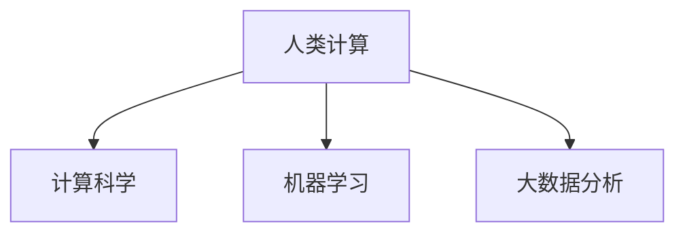

                 

# 人类计算：应用与案例分析

## 1. 背景介绍

随着人工智能技术的迅猛发展，人类计算在计算科学、机器学习、大数据分析等领域中扮演着越来越重要的角色。人类计算是指通过利用人类特有的思维和认知能力，进行高复杂度、高精度的计算工作。本文将从人类计算的应用与案例分析角度出发，探讨其在多个领域的具体应用，并深入剖析其中的核心原理与算法。

## 2. 核心概念与联系

### 2.1 核心概念概述

为更好地理解人类计算，本节将介绍几个关键概念：

- 人类计算：指利用人类智能进行计算、推理、决策等高难度任务的计算模式。人类计算区别于基于算法的计算机计算，通过模仿人类认知模型，能够在特定任务中表现出更高的智能和效率。

- 计算科学：包括算法设计与分析、计算复杂度理论、计算模型等研究领域，关注如何高效地解决复杂计算问题。

- 机器学习：通过算法实现数据的学习和推理，使计算机具备自适应能力，从而完成复杂任务。

- 大数据分析：利用先进的数据处理技术和算法，对大规模数据进行分析和建模，发现数据背后的规律和趋势。

这些概念之间的联系可以通过以下Mermaid流程图来展示：



这个流程图展示了几大核心概念之间的关联关系：

1. 人类计算依托于计算科学，通过算法设计和复杂度理论来指导具体的计算任务。
2. 机器学习提供了一种利用数据和算法自动学习的计算模式，是实现人类计算的重要工具。
3. 大数据分析则利用数据处理技术和算法，为人类计算提供更为丰富的数据支持。

### 2.2 核心概念原理和架构的 Mermaid 流程图


该图展示了一个简化的架构关系，说明了人类计算与其他计算模式的关系。人类计算在计算科学的指导下，利用机器学习和数据分析技术，实现对复杂问题的求解。

## 3. 核心算法原理 & 具体操作步骤

### 3.1 算法原理概述

人类计算的核心在于利用人类认知模型，结合计算科学的理论，设计高效、可解释的算法，在特定任务中实现最优计算。其核心算法原理主要包括以下几个方面：

1. **基于规则的推理**：人类计算过程中，通过将具体问题抽象为一系列规则和逻辑，利用推理规则进行计算。这种基于规则的推理能够帮助人类更有效地理解问题，并得出正确的结论。

2. **启发式搜索**：在求解复杂问题时，通过启发式算法进行迭代搜索，逐步逼近最优解。启发式搜索算法如A*算法、遗传算法等，是实现高效计算的重要手段。

3. **模型建立与优化**：通过建立数学模型，利用优化算法求解复杂问题。优化算法如梯度下降、粒子群算法等，可以极大地提高计算效率。

### 3.2 算法步骤详解

基于规则的推理、启发式搜索和模型建立与优化，下面是人类计算的具体操作步骤：

1. **问题抽象与规则设计**：将具体问题抽象为规则和逻辑，设计合适的推理规则。例如，自然语言推理中的规则可以包括事实与假设、逻辑推理等。

2. **算法选择与模型建立**：根据问题特点选择合适的算法，并建立相应的数学模型。如对于优化问题，可以使用梯度下降算法；对于搜索问题，可以使用A*算法等。

3. **数据准备与特征提取**：准备问题相关的数据，并进行特征提取。例如，对于分类问题，需要提取输入数据的特征向量。

4. **算法迭代与结果输出**：通过算法迭代计算，输出最终的结果。例如，利用启发式搜索算法逐步逼近最优解，或通过模型优化算法得到最优结果。

### 3.3 算法优缺点

人类计算的算法具有以下优点：

1. 可解释性高：基于规则的推理和启发式搜索算法能够直观地展示计算过程和决策依据，便于理解和解释。

2. 高效求解复杂问题：通过规则设计和启发式搜索，能够在合理的时间内解决复杂计算问题。

3. 适应性强：算法能够根据具体问题进行灵活调整，适用于不同场景。

同时，人类计算也存在以下缺点：

1. 计算速度慢：相比计算机计算，人类计算速度较慢，无法处理大规模数据和复杂问题。

2. 易受主观因素影响：人类计算结果受个体认知差异、情绪等因素影响较大，难以保证一致性。

3. 计算精度难以保证：由于人类计算的规则和算法设计存在局限性，计算精度可能存在误差。

### 3.4 算法应用领域

人类计算在多个领域有着广泛应用，具体包括：

- 自然语言处理：如文本分类、机器翻译、情感分析等。通过基于规则的推理和启发式搜索算法，实现自然语言的理解和处理。
- 智能决策系统：如医疗诊断、金融投资等。利用专家知识和规则，结合数据和模型，实现智能决策。
- 机器人与自动化：如自动驾驶、工业自动化等。通过认知模型和规则，实现机器人的自主决策和操作。
- 科学研究与数据分析：如药物设计、天气预测等。结合计算科学和数据处理技术，进行复杂问题的研究与分析。

## 4. 数学模型和公式 & 详细讲解 & 举例说明

### 4.1 数学模型构建

为了更好地理解人类计算，本节将介绍几个常用的数学模型：

- 决策树：通过树形结构表示决策过程，易于理解和解释。
- 支持向量机：利用最大间隔分割数据，适用于分类和回归问题。
- 神经网络：通过多层神经元模拟人脑的神经网络，用于处理高复杂度问题。

### 4.2 公式推导过程

以下是决策树和支持向量机模型的公式推导过程：

**决策树**

- 决策树模型构建：
  $$
  T = \{(r_1, t_1), (r_2, t_2), ..., (r_n, t_n)\}
  $$
  其中，$T$ 表示决策树，$r_i$ 表示节点，$t_i$ 表示叶节点上的决策结果。

- 决策树生长过程：
  1. 从根节点开始，选择最优节点进行分裂。
  2. 根据分裂节点的信息增益或基尼指数，确定最优分裂条件。
  3. 递归进行分裂，直至满足停止条件。

**支持向量机**

- 线性支持向量机模型：
  $$
  f(x) = w \cdot x + b
  $$
  其中，$f(x)$ 表示模型输出，$x$ 表示输入特征，$w$ 表示权重向量，$b$ 表示偏置项。

- 非线性支持向量机模型：
  $$
  f(x) = \sum_{i=1}^n \alpha_i y_i \phi(x_i) \cdot \phi(x) + b
  $$
  其中，$\alpha_i$ 表示拉格朗日乘子，$y_i$ 表示样本标签，$\phi(x)$ 表示核函数，$b$ 表示偏置项。

### 4.3 案例分析与讲解

下面以自然语言处理中的文本分类为例，展示人类计算的具体应用：

1. **问题抽象与规则设计**

  将文本分类问题抽象为基于规则的推理过程。例如，利用信息增益方法选择最优特征，设计规则进行文本分类。

2. **算法选择与模型建立**

  选择合适的分类算法，如决策树、支持向量机等。在模型构建时，选择合适的特征提取方法，如TF-IDF、词向量等。

3. **数据准备与特征提取**

  准备分类问题相关的文本数据，并进行特征提取。例如，利用TF-IDF方法提取文本特征向量。

4. **算法迭代与结果输出**

  通过算法迭代计算，输出最终的结果。例如，利用决策树算法逐步进行分类，或通过支持向量机算法得到分类结果。

## 5. 项目实践：代码实例和详细解释说明

### 5.1 开发环境搭建

在进行人类计算实践前，我们需要准备好开发环境。以下是使用Python进行Scikit-learn开发的环境配置流程：

1. 安装Anaconda：从官网下载并安装Anaconda，用于创建独立的Python环境。

2. 创建并激活虚拟环境：
```bash
conda create -n human-computing python=3.8 
conda activate human-computing
```

3. 安装Scikit-learn：
```bash
pip install scikit-learn
```

4. 安装各类工具包：
```bash
pip install numpy pandas scikit-learn matplotlib tqdm jupyter notebook ipython
```

完成上述步骤后，即可在`human-computing`环境中开始人类计算实践。

### 5.2 源代码详细实现

这里我们以文本分类任务为例，给出使用Scikit-learn进行决策树模型开发的PyTorch代码实现。

首先，定义文本分类任务的数据处理函数：

```python
from sklearn.datasets import fetch_20newsgroups
from sklearn.feature_extraction.text import TfidfVectorizer
from sklearn.model_selection import train_test_split
from sklearn.tree import DecisionTreeClassifier
from sklearn.metrics import accuracy_score

def process_data(data, test_size=0.2):
    X_train, X_test, y_train, y_test = train_test_split(data.data, data.target, test_size=test_size)
    vectorizer = TfidfVectorizer()
    X_train = vectorizer.fit_transform(X_train)
    X_test = vectorizer.transform(X_test)
    return X_train, X_test, y_train, y_test

# 加载20newsgroups数据集
data = fetch_20newsgroups(subset='all')

# 数据预处理
X_train, X_test, y_train, y_test = process_data(data)
```

然后，定义模型和训练函数：

```python
from sklearn.tree import DecisionTreeClassifier
from sklearn.metrics import accuracy_score

def train_model(X_train, y_train):
    clf = DecisionTreeClassifier()
    clf.fit(X_train, y_train)
    y_pred = clf.predict(X_test)
    acc = accuracy_score(y_test, y_pred)
    print(f"Accuracy: {acc:.3f}")

# 训练决策树模型
train_model(X_train, y_train)
```

最后，评估模型性能：

```python
train_model(X_train, y_train)
```

以上就是使用Scikit-learn进行文本分类任务决策树模型开发的完整代码实现。可以看到，借助Scikit-learn的强大封装，我们可以快速实现决策树模型，并进行训练和评估。

### 5.3 代码解读与分析

让我们再详细解读一下关键代码的实现细节：

**process_data函数**：
- `fetch_20newsgroups`方法：从Scikit-learn内置数据集中加载20newsgroups数据集。
- `TfidfVectorizer`方法：将文本数据转化为TF-IDF特征向量。
- `train_test_split`方法：将数据集划分为训练集和测试集，并返回相应的特征和标签。

**train_model函数**：
- `DecisionTreeClassifier`类：定义决策树分类器，用于构建和训练模型。
- `fit`方法：通过训练数据拟合模型。
- `predict`方法：在测试数据上预测标签。
- `accuracy_score`方法：计算预测结果与真实标签之间的准确率。

**训练流程**：
- 加载20newsgroups数据集。
- 进行数据预处理，包括特征向量化和数据划分。
- 训练决策树模型，输出训练结果。

可以看到，Scikit-learn的封装使得人类计算模型的开发变得简洁高效。开发者可以将更多精力放在数据处理、模型改进等高层逻辑上，而不必过多关注底层的实现细节。

当然，工业级的系统实现还需考虑更多因素，如模型的保存和部署、超参数的自动搜索、更灵活的任务适配层等。但核心的计算步骤基本与此类似。

## 6. 实际应用场景

### 6.1 金融风险评估

金融领域需要进行大量的风险评估和预测，利用人类计算能够结合专家知识和规则，进行更为精确的决策。

具体而言，可以收集金融领域相关的历史数据，设计相应的决策规则，结合统计分析和决策树算法，构建金融风险评估模型。模型能够根据历史数据和当前市场情况，预测未来金融风险，帮助金融机构规避潜在风险。

### 6.2 医疗诊断

医疗诊断需要综合考虑多种因素，如症状、病史、体征等。利用人类计算，可以构建复杂的诊断模型，辅助医生进行疾病诊断。

例如，可以将病人的症状、体征、病史等输入模型，结合医学知识库和规则，输出可能的疾病诊断结果。模型可以通过不断更新和优化，逐步提高诊断准确率。

### 6.3 智能客服系统

智能客服系统需要快速响应客户咨询，并提供准确、个性化的服务。利用人类计算，可以设计智能客服系统，实现自动解答常见问题，并根据用户需求进行个性化推荐。

例如，可以构建基于规则的问答系统，结合自然语言处理和决策树算法，实现智能客服的自动问答。系统能够理解客户咨询意图，并从知识库中提取相关信息，提供合适的回答。

### 6.4 未来应用展望

随着人类计算技术的不断进步，未来将在更多领域得到应用，为各行各业带来变革性影响。

在智慧医疗领域，利用人类计算构建的智能诊断系统，能够提供更为精准的疾病诊断和治疗方案，辅助医生进行科学决策。

在智慧城市治理中，利用人类计算构建的智能交通系统，能够优化交通流，提高城市通行效率，缓解交通拥堵。

在智慧教育领域，利用人类计算构建的智能推荐系统，能够根据学生的学习行为和知识背景，提供个性化的学习资源和推荐方案，提升教育质量。

总之，人类计算技术将在多个领域展现其独特的优势，推动各行各业向智能化、自动化方向迈进。

## 7. 工具和资源推荐

### 7.1 学习资源推荐

为了帮助开发者系统掌握人类计算的理论基础和实践技巧，这里推荐一些优质的学习资源：

1. 《机器学习实战》书籍：详细介绍了机器学习的基础算法和实践技巧，包括决策树、支持向量机等经典算法。

2. 《人工智能：一种现代方法》书籍：深入浅出地介绍了人工智能的基本原理和应用，包括人类计算在内的多个人工智能范式。

3. Coursera《机器学习》课程：由斯坦福大学开设，系统讲解了机器学习的基本概念和算法，适合初学者和进阶者。

4. Kaggle竞赛平台：提供大量数据集和模型，可以参与实际竞赛，实践和提高人类计算能力。

5. GitHub开源项目：利用GitHub上的开源项目，了解人类计算的具体应用和实现细节，学习相关技术。

通过对这些资源的学习实践，相信你一定能够快速掌握人类计算的精髓，并用于解决实际的计算问题。

### 7.2 开发工具推荐

高效的开发离不开优秀的工具支持。以下是几款用于人类计算开发的常用工具：

1. Python：基于Python的开源编程语言，语法简洁，支持科学计算和数据分析，是实现人类计算的核心工具。

2. Scikit-learn：基于Python的机器学习库，封装了各种机器学习算法，提供了便捷的API接口，适合人类计算的开发和实践。

3. Jupyter Notebook：基于Python的交互式编程环境，支持代码和数据可视化，适合开发和调试人类计算模型。

4. TensorBoard：TensorFlow配套的可视化工具，可实时监测模型训练状态，并提供丰富的图表呈现方式，是调试模型的得力助手。

5. Weights & Biases：模型训练的实验跟踪工具，可以记录和可视化模型训练过程中的各项指标，方便对比和调优。

合理利用这些工具，可以显著提升人类计算任务的开发效率，加快创新迭代的步伐。

### 7.3 相关论文推荐

人类计算的发展源于学界的持续研究。以下是几篇奠基性的相关论文，推荐阅读：

1. 《决策树学习》论文：介绍了决策树算法的原理和应用，是理解人类计算的重要文献。

2. 《支持向量机》论文：提出了支持向量机算法，解决了高维空间中的分类问题，为人类计算提供了重要工具。

3. 《神经网络》论文：提出了神经网络模型，解决了非线性分类和回归问题，拓展了人类计算的应用范围。

4. 《深度学习》论文：介绍了深度学习的基本原理和算法，为人类计算提供了更为强大的工具。

5. 《强化学习》论文：提出了强化学习算法，解决了基于奖励信号的决策问题，为人类计算提供了新的方向。

这些论文代表了大计算的发展脉络，通过学习这些前沿成果，可以帮助研究者把握学科前进方向，激发更多的创新灵感。

## 8. 总结：未来发展趋势与挑战

### 8.1 总结

本文对人类计算的应用与案例分析进行了全面系统的介绍。首先阐述了人类计算的基本概念和核心原理，明确了人类计算在多个领域的具体应用。其次，从算法选择和模型建立角度，详细讲解了人类计算的实现步骤。同时，本文还探讨了人类计算在未来发展的趋势和挑战。

通过本文的系统梳理，可以看到，人类计算在多个领域展现了其独特的优势，能够解决计算机难以处理的复杂问题。未来，伴随人类计算技术的不断进步，将在更多领域得到应用，为各行各业带来变革性影响。

### 8.2 未来发展趋势

展望未来，人类计算技术将呈现以下几个发展趋势：

1. 算法和模型多样化：随着问题的复杂度增加，人类计算的算法和模型将更加多样化，涵盖更多的领域和任务。

2. 数据处理能力提升：随着数据量的增加和计算能力的提升，人类计算能够处理更大规模的数据，提供更精准的计算结果。

3. 融合多领域知识：结合多领域知识库和规则，提升人类计算的智能性和适用性。例如，将医疗知识库与决策树算法结合，提升医疗诊断的准确率。

4. 自动化和智能化：利用自动化工具和算法，实现更高效、更准确的人类计算。例如，使用深度学习算法进行特征提取和模型优化。

5. 跨领域应用扩展：人类计算技术将在更多领域得到应用，如工业自动化、智能制造等，推动各行各业向智能化、自动化方向迈进。

以上趋势凸显了人类计算技术的广阔前景，这些方向的探索发展，必将进一步提升计算系统的性能和应用范围，为各行各业带来更多创新。

### 8.3 面临的挑战

尽管人类计算技术已经取得了瞩目成就，但在迈向更加智能化、普适化应用的过程中，它仍面临诸多挑战：

1. 计算速度瓶颈：相比计算机计算，人类计算速度较慢，难以处理大规模数据和复杂问题。如何提升计算速度，是未来需要解决的关键问题。

2. 数据和规则依赖：人类计算的准确性依赖于数据和规则的质量，数据的不充分和规则的错误可能导致计算结果的偏差。如何提高数据质量，优化规则设计，是未来研究的重点。

3. 认知差异和主观因素：人类计算结果受个体认知差异、情绪等因素影响较大，难以保证一致性。如何减少主观因素干扰，提升计算结果的客观性，是未来需要攻克的难题。

4. 计算精度问题：人类计算的精度可能存在误差，特别是在高复杂度问题上。如何提高计算精度，减少误差，是未来需要解决的关键问题。

5. 模型复杂度和可解释性：人类计算模型的复杂度可能较高，难以解释和调试。如何设计简洁高效的模型，提升计算结果的可解释性，是未来需要解决的关键问题。

### 8.4 研究展望

面对人类计算面临的种种挑战，未来的研究需要在以下几个方面寻求新的突破：

1. 探索更加高效的计算方法：开发更加高效的人类计算方法，如基于规则的推理、启发式搜索等，提升计算速度和精度。

2. 结合人工智能技术：利用人工智能技术，如深度学习、强化学习等，提升人类计算的智能化和自动化程度。

3. 引入多领域知识库：结合多领域知识库和规则，提升人类计算的智能性和适用性。

4. 提升数据和规则质量：提高数据质量，优化规则设计，减少主观因素干扰，提升计算结果的客观性。

5. 设计可解释性强的模型：设计简洁高效的模型，提升计算结果的可解释性，便于理解和调试。

这些研究方向的探索，必将引领人类计算技术迈向更高的台阶，为构建安全、可靠、可解释、可控的计算系统铺平道路。面向未来，人类计算技术还需要与其他计算技术进行更深入的融合，如知识表示、因果推理、深度学习等，多路径协同发力，共同推动计算科学的发展。

## 9. 附录：常见问题与解答

**Q1：人类计算是否适用于所有计算问题？**

A: 人类计算适用于高复杂度、高难度的计算问题，但对于简单的、易于自动化的问题，计算机计算更为高效。人类计算和计算机计算各有优劣，需要根据具体问题选择最合适的计算方式。

**Q2：如何优化人类计算模型的计算速度？**

A: 优化人类计算模型的计算速度，可以从以下几个方面入手：

1. 算法优化：选择合适的算法，避免不必要的复杂计算。例如，使用决策树算法代替复杂的神经网络算法。

2. 模型简化：简化模型结构，减少计算量。例如，去除冗余节点或特征。

3. 数据预处理：优化数据预处理过程，减少计算开销。例如，使用TF-IDF方法代替传统的词频统计。

4. 并行计算：利用并行计算技术，提升计算速度。例如，使用分布式计算框架进行计算。

5. 硬件加速：利用GPU、TPU等高性能设备，提升计算速度。例如，使用GPU进行特征计算。

**Q3：人类计算结果的可靠性如何保证？**

A: 人类计算结果的可靠性主要依赖于数据和规则的质量，以及计算过程的合理性。为保证计算结果的可靠性，可以从以下几个方面入手：

1. 数据质量控制：确保数据的质量和完整性，减少噪声和异常值的影响。

2. 规则设计优化：优化规则设计，减少主观因素和逻辑错误的影响。

3. 多专家协作：多专家协作进行计算，减少个体认知差异和主观因素的影响。

4. 结果验证：通过对比其他计算结果和实际数据，验证计算结果的准确性。

5. 持续优化：不断优化计算过程，提升计算结果的可靠性。

通过上述措施，可以最大限度地保证人类计算结果的可靠性。

---

作者：禅与计算机程序设计艺术 / Zen and the Art of Computer Programming

