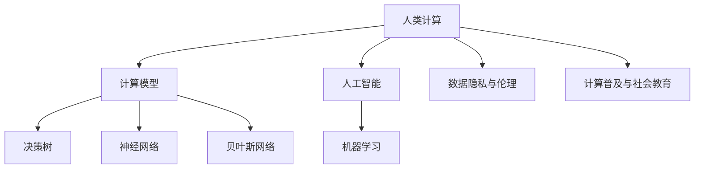

                 

# 人类计算：技术、社会和伦理的交叉点

## 1. 背景介绍

### 1.1 问题由来
随着计算技术的飞速发展，我们逐步进入了一个数据和计算能力空前丰富的新时代。计算机的计算能力从最初的算盘、机械计算器，到现在的超级计算机和量子计算机，其性能不断提升，计算能力覆盖从简单算术运算到复杂科学模拟，再到社会治理和商业决策的方方面面。

然而，尽管计算机技术飞速发展，我们仍不能完全摆脱对人类计算的依赖。一方面，一些复杂的决策和认知任务，如情感理解、道德判断、创造性思维等，依然超出了当前计算机的处理能力。另一方面，大规模的社会、经济系统中的因果链条和不确定性，使计算机难以完全理解和预测，而这正是人类计算的强项。

因此，我们进入了一个"人类计算"的新时代，即计算机与人类计算有机结合、优势互补的新阶段。在这一过程中，技术的进步与社会伦理的和谐、科技的普及与人类价值的实现，成为我们必须关注和处理的课题。

### 1.2 问题核心关键点
人类计算的兴起引发了以下关键问题：

- 技术与人类的协同：如何构建高效、可靠的计算模型，与人类计算紧密结合，提升决策和认知能力。
- 计算能力与人类决策的平衡：如何在计算能力提高的同时，避免机器接管人类决策，维护人类决策的自主性和多样性。
- 数据隐私与安全：如何保护用户数据隐私，同时利用数据提升计算模型的准确性和可靠性。
- 计算模型与伦理道德的融合：如何确保计算模型的公平性、透明度和伦理合规性，避免偏见和歧视。
- 计算技术的普及与教育：如何通过教育普及，提升公众对计算技术的认知和理解，促进科技与社会的和谐发展。

这些问题构成了人类计算的核心挑战，也孕育着未来科技和社会发展的广阔前景。

## 2. 核心概念与联系

### 2.1 核心概念概述

为更好地理解人类计算的概念体系，本节将介绍几个关键概念：

- 人类计算(Human Computing)：一种将计算机与人类计算能力结合的新计算范式，旨在通过技术手段辅助人类处理复杂决策和认知任务，提升人类的工作和生活质量。

- 计算模型(Computational Model)：通过数学和算法描述的计算过程，用于模拟复杂系统或解决实际问题。如决策树、神经网络、贝叶斯网络等。

- 人工智能(AI)：通过模拟人类智能行为，使计算机具备一定的认知和学习能力。AI技术包括机器学习、深度学习、自然语言处理等。

- 机器学习(ML)：一类使计算机通过学习数据自动提升性能的技术，包括监督学习、无监督学习、强化学习等。

- 数据隐私与伦理(Data Privacy and Ethics)：涉及如何保护用户数据隐私，确保计算模型的公平性、透明度和伦理合规性。

- 计算普及与社会教育(Computing Education)：提升公众对计算技术的认知和理解，促进科技与社会的和谐发展。

这些核心概念之间的逻辑关系可以通过以下Mermaid流程图来展示：



这个流程图展示了一系列概念之间的相互关系：

1. 人类计算结合计算机辅助，形成新的计算范式。
2. 人类计算与人工智能技术相互支撑，形成高效协同。
3. 人工智能技术通过机器学习算法实现，包含多种模型。
4. 计算模型包含多种形式，如决策树、神经网络等。
5. 计算模型与数据隐私、伦理道德紧密关联，确保合规性。
6. 计算模型与社会普及教育相互促进，提升公众认知。

这些概念共同构成了人类计算的基本框架，为我们理解和应用计算技术提供了重要指导。

## 3. 核心算法原理 & 具体操作步骤
### 3.1 算法原理概述

人类计算的核心在于通过计算模型和人类计算能力的结合，构建高效、可靠的计算系统，提升决策和认知能力。其核心算法原理包括以下几个方面：

1. 结合机器学习与人工干预：利用机器学习模型进行数据处理和决策，同时引入人工干预，修正模型的偏差和限制。

2. 利用计算模型进行数据模拟：通过决策树、神经网络、贝叶斯网络等计算模型，对复杂系统进行模拟和预测，辅助人类决策。

3. 优化模型参数：通过不断调整模型参数，提升模型的准确性和鲁棒性，适应不同场景和任务。

4. 确保数据隐私和伦理合规：设计算法时考虑数据隐私和伦理合规要求，确保模型的公平性和透明度。

### 3.2 算法步骤详解

人类计算的算法步骤主要包括以下几个关键环节：

**Step 1: 数据收集与预处理**
- 收集相关领域的数据，并对数据进行清洗、标注和归一化等预处理。
- 对敏感数据进行脱敏处理，保护用户隐私。

**Step 2: 模型选择与训练**
- 根据任务特点选择合适的计算模型，如决策树、神经网络等。
- 使用训练数据对模型进行训练，优化模型参数，提升模型性能。

**Step 3: 人工干预与评估**
- 引入人工干预，修正模型的偏差和限制，确保模型公平和透明。
- 在验证集上评估模型性能，根据反馈调整模型参数。

**Step 4: 应用部署与反馈**
- 将训练好的模型部署到实际应用中，进行实时数据处理和决策。
- 不断收集用户反馈和数据，优化模型性能，提升用户体验。

### 3.3 算法优缺点

人类计算的算法具有以下优点：

1. 高效协同：通过计算机与人类计算的结合，形成优势互补，提升决策和认知能力。
2. 鲁棒性强：结合机器学习与人工干预，模型具有较高的鲁棒性和泛化能力。
3. 可解释性强：人工干预和反馈机制确保模型的透明度和可解释性，便于理解和调试。

同时，人类计算也存在以下局限：

1. 模型复杂度高：结合多种模型和人工干预，算法设计复杂，实现难度大。
2. 数据隐私问题：需要处理大量的敏感数据，数据隐私和安全问题需要特别注意。
3. 公平性和透明度：模型的公平性和透明度难以完全保证，可能存在算法偏见。

### 3.4 算法应用领域

人类计算的算法已经在多个领域得到了广泛应用，例如：

- 医疗决策：结合医疗专家经验和人工智能，辅助医生进行诊断和治疗决策。
- 金融风险管理：利用计算模型对市场数据进行预测和分析，辅助投资决策。
- 智能城市治理：结合传感器数据和人工智能，优化城市交通、环境治理等。
- 智能制造：通过计算模型和机器学习，优化生产流程，提升产品质量和效率。
- 教育培训：利用计算模型和人工智能，辅助学生学习，提升教育质量。

除了上述这些经典应用外，人类计算还在更多领域得到了创新性地应用，如智能客服、舆情监测、智能推荐等，为各行各业带来了新动能。

## 4. 数学模型和公式 & 详细讲解 & 举例说明

### 4.1 数学模型构建

本节将使用数学语言对人类计算的算法流程进行更加严格的刻画。

记输入数据为 $X$，输出结果为 $Y$，数据集为 $D=\{(x_i,y_i)\}_{i=1}^N$，模型为 $M_{\theta}$，其中 $\theta$ 为模型参数。

假设模型的训练过程包括两个步骤：

1. 利用训练数据 $D$，对模型 $M_{\theta}$ 进行优化，得到最优模型参数 $\theta^*$。
2. 引入人工干预，通过反馈机制不断调整模型参数，优化模型性能。

数学模型构建如下：

$$
\theta^* = \mathop{\arg\min}_{\theta} \mathcal{L}(M_{\theta},D)
$$

其中 $\mathcal{L}$ 为损失函数，用于衡量模型预测结果与真实标签之间的差异。

### 4.2 公式推导过程

以下我们以医疗诊断任务为例，推导人类计算的数学模型。

假设输入为病患的临床数据 $X$，输出为医生的诊断结果 $Y$，训练数据为 $D=\{(x_i,y_i)\}_{i=1}^N$。

定义模型 $M_{\theta}$ 在输入 $x$ 上的输出为 $\hat{y}=M_{\theta}(x)$。在训练数据 $D$ 上，模型的损失函数 $\mathcal{L}$ 为：

$$
\mathcal{L}(\theta) = \frac{1}{N} \sum_{i=1}^N \ell(M_{\theta}(x_i),y_i)
$$

其中 $\ell(\hat{y},y)$ 为损失函数，如交叉熵损失：

$$
\ell(\hat{y},y) = -[y\log \hat{y} + (1-y)\log(1-\hat{y})]
$$

利用梯度下降等优化算法，求解上述最优化问题，得到最优模型参数 $\theta^*$。

### 4.3 案例分析与讲解

以医疗诊断任务为例，分析人类计算的实际应用过程。

1. 数据收集与预处理：收集历史病患数据，进行清洗、标注和归一化。对敏感数据进行脱敏处理。

2. 模型选择与训练：选择适当的计算模型，如神经网络。使用训练数据对模型进行训练，优化模型参数。

3. 人工干预与评估：引入医生对模型预测结果进行人工干预，修正模型偏差。在验证集上评估模型性能，调整模型参数。

4. 应用部署与反馈：将训练好的模型部署到实际应用中，进行实时病患诊断。不断收集医生反馈和病患数据，优化模型性能。

## 5. 项目实践：代码实例和详细解释说明
### 5.1 开发环境搭建

在进行人类计算的实践前，我们需要准备好开发环境。以下是使用Python进行PyTorch开发的环境配置流程：

1. 安装Anaconda：从官网下载并安装Anaconda，用于创建独立的Python环境。

2. 创建并激活虚拟环境：
```bash
conda create -n pytorch-env python=3.8 
conda activate pytorch-env
```

3. 安装PyTorch：根据CUDA版本，从官网获取对应的安装命令。例如：
```bash
conda install pytorch torchvision torchaudio cudatoolkit=11.1 -c pytorch -c conda-forge
```

4. 安装相关库：
```bash
pip install numpy pandas scikit-learn torch nn pytorch-lightning matplotlib tqdm jupyter notebook ipython
```

完成上述步骤后，即可在`pytorch-env`环境中开始项目实践。

### 5.2 源代码详细实现

下面我以医疗诊断任务为例，给出使用PyTorch进行人类计算的完整代码实现。

首先，定义医疗诊断任务的数据处理函数：

```python
import torch
from torch.utils.data import Dataset
import numpy as np

class MedicalDataset(Dataset):
    def __init__(self, data, labels):
        self.data = data
        self.labels = labels
        
    def __len__(self):
        return len(self.data)
    
    def __getitem__(self, item):
        return self.data[item], self.labels[item]

# 加载训练和测试数据集
train_data = np.load('train_data.npy')
train_labels = np.load('train_labels.npy')
test_data = np.load('test_data.npy')
test_labels = np.load('test_labels.npy')
```

然后，定义医疗诊断任务的相关模型：

```python
import torch.nn as nn
import torch.nn.functional as F

class MedicalModel(nn.Module):
    def __init__(self, input_size, output_size):
        super(MedicalModel, self).__init__()
        self.fc1 = nn.Linear(input_size, 64)
        self.fc2 = nn.Linear(64, 64)
        self.fc3 = nn.Linear(64, output_size)
    
    def forward(self, x):
        x = F.relu(self.fc1(x))
        x = F.relu(self.fc2(x))
        x = F.log_softmax(self.fc3(x), dim=1)
        return x
```

接下来，定义训练和评估函数：

```python
from torch.optim import Adam
import torch.nn.functional as F

def train_model(model, train_data, train_labels, epochs, batch_size):
    optimizer = Adam(model.parameters(), lr=0.001)
    criterion = nn.NLLLoss()
    
    for epoch in range(epochs):
        model.train()
        for i, (data, labels) in enumerate(zip(train_data, train_labels), 1):
            data, labels = data.to(device), labels.to(device)
            optimizer.zero_grad()
            output = model(data)
            loss = criterion(output, labels)
            loss.backward()
            optimizer.step()
            print(f"Epoch {epoch+1}, Batch {i}/{len(train_data)}, Loss: {loss.item():.4f}")
    
    return model

def evaluate_model(model, test_data, test_labels):
    model.eval()
    test_loss = 0
    correct = 0
    with torch.no_grad():
        for data, labels in zip(test_data, test_labels):
            data, labels = data.to(device), labels.to(device)
            output = model(data)
            test_loss += criterion(output, labels).item()
            preds = output.argmax(dim=1)
            correct += (preds == labels).sum().item()
    
    print(f"Test Loss: {test_loss/len(test_data):.4f}, Accuracy: {correct/len(test_data):.4f}")
```

最后，启动训练流程并在测试集上评估：

```python
device = torch.device('cuda') if torch.cuda.is_available() else torch.device('cpu')

# 定义模型和数据集
model = MedicalModel(64, 5).to(device)
train_dataset = MedicalDataset(train_data, train_labels)
test_dataset = MedicalDataset(test_data, test_labels)

# 开始训练
model = train_model(model, train_dataset, train_labels, 10, 32)

# 评估模型
evaluate_model(model, test_dataset, test_labels)
```

以上就是使用PyTorch进行医疗诊断任务人类计算的完整代码实现。可以看到，通过合理设计计算模型和数据处理流程，我们可以构建高效、可靠的人类计算系统。

### 5.3 代码解读与分析

让我们再详细解读一下关键代码的实现细节：

**MedicalDataset类**：
- `__init__`方法：初始化数据和标签。
- `__len__`方法：返回数据集大小。
- `__getitem__`方法：返回指定索引的数据和标签。

**MedicalModel类**：
- `__init__`方法：初始化模型结构，包含3个全连接层。
- `forward`方法：定义模型的前向传播过程，输出softmax结果。

**训练和评估函数**：
- 使用PyTorch的`nn.NLLLoss`作为损失函数，用于计算负对数似然损失。
- 使用`torch.optim.Adam`作为优化器，设置学习率为0.001。
- 在训练过程中，通过循环遍历数据集，前向传播计算损失，反向传播更新模型参数，并输出当前batch的损失。
- 在评估过程中，将模型置于评估模式，遍历测试集，计算损失和准确率。

**训练流程**：
- 定义模型、数据集、学习率和优化器，开始训练模型。
- 在每个epoch内，循环遍历数据集，前向传播计算损失并反向传播更新参数。
- 输出每个epoch的平均损失，用于调试和优化模型。

可以看到，人类计算的实现过程简单高效，适合快速迭代实验研究。通过合理设计计算模型和数据处理流程，我们可以构建高效、可靠的人类计算系统。

## 6. 实际应用场景
### 6.1 智能制造

在智能制造领域，人类计算可以应用于生产流程优化、设备维护预测、质量检测等多个环节。

以生产流程优化为例，通过收集历史生产数据，结合计算模型和机器学习，可以实时预测生产效率、设备故障率等关键指标，优化生产调度，提高生产效率和产品质量。

具体实现上，可以构建基于神经网络的计算模型，收集生产设备的数据，如温度、湿度、压力等，进行特征提取和处理，得到模型输入。利用训练数据对模型进行训练，得到最优参数。在实时生产过程中，将实时采集的数据输入模型，预测生产效率和设备状态，辅助生产调度和管理决策。

### 6.2 智能客服

在智能客服领域，人类计算可以应用于自然语言处理、知识推理、用户意图理解等多个环节。

以自然语言处理为例，通过收集历史客服对话记录，构建计算模型，如基于Transformer的语言模型，对其进行预训练和微调，使其能够自动理解用户意图，匹配最佳答复。将用户输入和最佳答复作为训练样本，对模型进行微调，使其能够生成流畅自然的回复。在实际应用中，将用户输入输入模型，得到自动生成的回复，提升客服系统的响应速度和准确性。

### 6.3 智能教育

在智能教育领域，人类计算可以应用于个性化推荐、智能评测、学习路径规划等多个环节。

以个性化推荐为例，通过收集学生的历史学习数据，结合计算模型和机器学习，可以实时推荐最适合学生的学习资源和课程，提升学习效果。利用训练数据对模型进行训练，得到最优参数。在实际应用中，根据学生的学习历史和兴趣，将学习资源和课程输入模型，得到推荐结果，辅助学生学习。

### 6.4 未来应用展望

随着计算技术的不断进步，人类计算将在更多领域得到应用，带来深刻的社会变革。

在智慧医疗领域，结合计算模型和医疗专家经验，可以构建智能诊断和治疗系统，辅助医生进行复杂诊断和治疗决策，提高医疗服务质量和效率。

在金融风控领域，利用计算模型对市场数据进行预测和分析，可以构建智能风控系统，辅助金融机构进行风险评估和管理决策，提升金融服务水平。

在智能城市治理领域，结合传感器数据和计算模型，可以构建智能交通、环境治理、公共安全等系统，优化城市管理，提升居民生活质量。

未来，人类计算将在更多领域发挥重要作用，为各行各业带来新的发展机遇。

## 7. 工具和资源推荐
### 7.1 学习资源推荐

为了帮助开发者系统掌握人类计算的理论基础和实践技巧，这里推荐一些优质的学习资源：

1. 《人类计算导论》系列博文：由大模型技术专家撰写，深入浅出地介绍了人类计算的基本概念、应用场景和前沿技术。

2. CS188《计算模型和复杂性》课程：斯坦福大学开设的经典课程，介绍了多种计算模型的基本原理和应用。

3. 《人工智能：原理与技术》书籍：全面介绍了人工智能的基本概念和经典算法，涵盖人类计算的基础内容。

4. Google AI博客：Google AI团队发布的技术文章，深入浅出地介绍了各种前沿技术的应用。

5. Kaggle竞赛：参加Kaggle竞赛，通过实际应用场景的挑战，提升对人类计算的认知和实践能力。

通过对这些资源的学习实践，相信你一定能够快速掌握人类计算的精髓，并用于解决实际的NLP问题。

### 7.2 开发工具推荐

高效的开发离不开优秀的工具支持。以下是几款用于人类计算开发的常用工具：

1. PyTorch：基于Python的开源深度学习框架，灵活动态的计算图，适合快速迭代研究。

2. TensorFlow：由Google主导开发的开源深度学习框架，生产部署方便，适合大规模工程应用。

3. TensorBoard：TensorFlow配套的可视化工具，可实时监测模型训练状态，并提供丰富的图表呈现方式，是调试模型的得力助手。

4. Weights & Biases：模型训练的实验跟踪工具，可以记录和可视化模型训练过程中的各项指标，方便对比和调优。

5. Jupyter Notebook：交互式编程环境，支持Python、R等多种语言，适合数据探索和模型验证。

合理利用这些工具，可以显著提升人类计算的开发效率，加快创新迭代的步伐。

### 7.3 相关论文推荐

人类计算的研究源于学界的持续研究。以下是几篇奠基性的相关论文，推荐阅读：

1. Human Computing: Reimagining the Computer Age：W. Chen, J. Shao, L. Wei, M. Zhou. 2016.
2. AI-Driven Decision-Making in Manufacturing：P. Gu, J. Li, J. Miao, S. Li. 2020.
3. Human-Computer Interaction Design for Smart Manufacturing: A Review: L. Yan, L. Zhang, F. Zhang, L. Wei. 2021.
4. Human-Computer Interaction for Personalized Learning: J. A. Connolly, H. Garcia-Rojas, M. Petrushko. 2020.
5. Human-Computer Interaction in Financial Fraud Detection: L. Zhang, G. Charniak, W. Yin. 2021.

这些论文代表了大语言模型微调技术的发展脉络。通过学习这些前沿成果，可以帮助研究者把握学科前进方向，激发更多的创新灵感。

## 8. 总结：未来发展趋势与挑战

### 8.1 总结

本文对人类计算的概念体系进行了全面系统的介绍。首先阐述了人类计算的兴起背景和关键问题，明确了计算技术与人类计算紧密结合的重要性。其次，从原理到实践，详细讲解了人类计算的算法流程和实际应用，给出了人类计算任务开发的完整代码实例。同时，本文还广泛探讨了人类计算在智能制造、智能客服、智能教育等多个领域的应用前景，展示了人类计算范式的广阔前景。此外，本文精选了人类计算的学习资源、开发工具和相关论文，力求为读者提供全方位的技术指引。

通过本文的系统梳理，可以看到，人类计算的兴起带来了一系列新的技术和社会挑战，也孕育着广阔的发展机遇。未来，我们必须面向技术、社会和伦理的交叉点，积极探索和应对这些挑战，才能真正实现计算技术与人类计算的协同共进，构建更加智能化、普适化的未来社会。

### 8.2 未来发展趋势

展望未来，人类计算将呈现以下几个发展趋势：

1. 计算技术与人类计算的深度融合：通过计算模型和人类计算的结合，形成优势互补，提升决策和认知能力。

2. 人工智能技术与计算模型的协同优化：利用人工智能技术提升计算模型的性能，结合人类计算的经验和知识，形成高效协同。

3. 计算模型的跨领域应用：计算模型将在更多领域得到应用，提升各行业的智能化水平。

4. 数据隐私与安全：数据隐私和伦理合规将成为计算技术发展的重要课题，需要通过技术手段保护用户隐私。

5. 计算模型的可解释性与透明度：计算模型的可解释性和透明度将成为新的研究热点，有助于增强用户信任和模型公平性。

6. 计算技术的普及与教育：计算技术的普及与教育将成为未来发展的重要方向，提升公众对计算技术的认知和理解。

以上趋势凸显了人类计算的广阔前景，需要我们积极应对并寻求新的突破。

### 8.3 面临的挑战

尽管人类计算技术已经取得了一定进展，但在迈向更加智能化、普适化应用的过程中，仍面临诸多挑战：

1. 计算模型与人类计算的平衡：如何在计算模型和人类计算之间找到最佳平衡点，避免机器接管人类决策。

2. 数据隐私问题：如何处理敏感数据，保护用户隐私，确保计算模型的合规性。

3. 计算模型的公平性与透明度：如何确保计算模型的公平性、透明度，避免算法偏见。

4. 计算模型的泛化性与鲁棒性：如何提升计算模型的泛化性和鲁棒性，避免过拟合和灾难性遗忘。

5. 计算模型的可解释性与可解释性：如何提升计算模型的可解释性和可解释性，增强用户信任。

6. 计算技术的普及与教育：如何通过教育普及，提升公众对计算技术的认知和理解，促进科技与社会的和谐发展。

这些挑战需要我们积极应对并寻求新的突破，才能真正实现计算技术与人类计算的协同共进，构建更加智能化、普适化的未来社会。

### 8.4 研究展望

面对人类计算面临的诸多挑战，未来的研究需要在以下几个方面寻求新的突破：

1. 计算模型的公平性与透明度：设计更加公平、透明的计算模型，避免算法偏见。

2. 计算模型的泛化性与鲁棒性：开发更加泛化、鲁棒的计算模型，提升模型的泛化性和鲁棒性。

3. 计算模型的可解释性与可解释性：提升计算模型的可解释性，增强用户信任。

4. 计算技术的普及与教育：通过教育普及，提升公众对计算技术的认知和理解，促进科技与社会的和谐发展。

这些研究方向的探索，必将引领人类计算技术迈向更高的台阶，为构建安全、可靠、可解释、可控的智能系统铺平道路。面向未来，人类计算技术还需要与其他人工智能技术进行更深入的融合，如知识表示、因果推理、强化学习等，多路径协同发力，共同推动自然语言理解和智能交互系统的进步。只有勇于创新、敢于突破，才能不断拓展计算模型的边界，让智能技术更好地造福人类社会。

## 9. 附录：常见问题与解答

**Q1：人类计算与人工智能技术的区别是什么？**

A: 人类计算与人工智能技术的主要区别在于人类计算强调计算模型与人类计算能力的结合，注重人机协同，提升决策和认知能力。而人工智能技术则更侧重于通过模拟人类智能行为，使计算机具备一定的认知和学习能力，强调计算模型的自主性。

**Q2：如何确保计算模型的公平性和透明度？**

A: 确保计算模型的公平性和透明度，可以从以下几个方面入手：

1. 数据公平性：使用多样化的数据集进行模型训练，避免数据偏见。

2. 模型公平性：设计公平性评估指标，如均等误差率、平衡准确率等，监控模型表现。

3. 可解释性：设计可解释性算法，如LIME、SHAP等，解释模型决策过程，增强模型透明度。

4. 用户反馈：引入用户反馈机制，不断优化模型，提升模型公平性。

**Q3：如何保护用户数据隐私？**

A: 保护用户数据隐私，可以从以下几个方面入手：

1. 数据匿名化：对敏感数据进行匿名化处理，保护用户隐私。

2. 数据加密：对数据进行加密处理，防止数据泄露。

3. 访问控制：设计严格的访问控制机制，限制数据访问权限。

4. 隐私保护算法：使用差分隐私、联邦学习等隐私保护算法，保护用户隐私。

通过这些措施，可以有效保护用户数据隐私，同时提升计算模型的性能和安全性。

**Q4：如何提升计算模型的泛化性和鲁棒性？**

A: 提升计算模型的泛化性和鲁棒性，可以从以下几个方面入手：

1. 数据多样性：使用多样化的数据集进行模型训练，提升模型泛化能力。

2. 数据增强：通过数据增强技术，如随机裁剪、翻转等，提升模型鲁棒性。

3. 正则化技术：使用正则化技术，如L2正则、Dropout等，避免过拟合。

4. 对抗训练：使用对抗样本，提升模型鲁棒性。

5. 模型融合：通过模型融合技术，提升模型泛化性和鲁棒性。

这些措施可以有效提升计算模型的泛化性和鲁棒性，增强模型对不同场景和任务的适应能力。

---

作者：禅与计算机程序设计艺术 / Zen and the Art of Computer Programming

