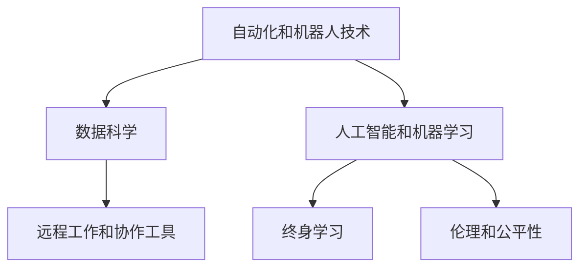

                 

## 1. 背景介绍

在人类历史上，计算技术一直扮演着重要的角色。从早期的手工计数到电算器的出现，再到如今机器学习和大数据技术的广泛应用，计算技术的演进始终与人类生产力的提升密切相关。然而，随着人工智能（AI）和机器学习（ML）的飞速发展，未来工作世界的面貌正在发生根本性的变化。本文旨在探讨这种变革背后的驱动力，以及其在未来工作和就业市场中的潜在影响。

### 1.1 问题由来

近几十年来，人工智能技术的迅猛发展对工作世界的未来产生了深远影响。自动化、机器学习和数据科学正在改变劳动力的结构和技能需求，这些变化不仅影响了特定行业，还可能对整个社会产生广泛影响。这种变化的背景包括：

1. **自动化和机器人技术**：这些技术使得许多重复性、例行性工作可以被机器和算法取代。
2. **数据科学和大数据分析**：数据在决策过程中扮演着越来越重要的角色，数据科学技能变得至关重要。
3. **人工智能和机器学习**：这些技术正在改变各行各业的工作方式，从客户服务到医疗保健。
4. **远程工作和协作工具**：新冠疫情加速了远程工作和协作工具的普及，这可能对工作模式和员工技能产生持久影响。

### 1.2 问题核心关键点

- **自动化和机器人**：自动化技术可以取代许多基于规则的重复性任务，但也能创造新的、复杂的工作机会。
- **技能需求变化**：未来工作市场将更加重视创造性思维、数据处理和分析、以及与人工智能系统协作的能力。
- **工作模式变革**：远程工作、共享经济和自由职业等新工作模式的兴起，将改变传统的职场结构。
- **终身学习**：技能更新和持续学习成为新常态，以适应不断变化的工作环境。
- **伦理和公平性**：确保AI技术的公正应用，避免偏见和不公平现象，是未来技术发展的重要挑战。

## 2. 核心概念与联系

### 2.1 核心概念概述

要理解人类计算的未来，我们需要掌握几个关键概念：

1. **自动化和机器人技术**：指使用计算机系统和机器人执行例行性、重复性任务的过程，如自动化生产线、机器人和自动化决策系统。
2. **数据科学**：涉及数据处理、分析和建模，以提取有用信息和洞察力，支持决策制定。
3. **人工智能和机器学习**：指使用算法和模型来模拟人类智能的行为，包括学习、推理和决策。
4. **远程工作和协作工具**：指允许员工在物理位置上分散工作，同时利用数字工具进行有效沟通和协作的技术。
5. **终身学习**：指个体在整个职业生涯中持续学习和技能更新的过程，以适应快速变化的工作环境。
6. **伦理和公平性**：确保技术应用过程中遵守道德和法律规范，避免歧视和不公平现象。

这些概念之间的逻辑关系可以通过以下Mermaid流程图来展示：



这个流程图展示了自动化和机器人技术如何驱动数据科学和人工智能的发展，数据科学和人工智能如何影响远程工作和协作工具的采用，以及这些技术如何促进终身学习和伦理公平性的重视。

## 3. 核心算法原理 & 具体操作步骤

### 3.1 算法原理概述

基于自动化和人工智能的计算技术正深刻改变工作世界的未来。其核心原理包括：

1. **自动化**：通过算法和机器人执行例行性任务，提高效率和准确性。
2. **数据科学**：利用数据和模型进行决策，优化业务流程。
3. **人工智能和机器学习**：模仿人类智能，实现更复杂的决策和任务。
4. **远程工作和协作工具**：通过数字化技术实现分散工作模式的有效沟通和协作。

### 3.2 算法步骤详解

基于自动化和人工智能的计算技术在工作世界中的应用，通常遵循以下步骤：

1. **需求分析**：确定需要自动化的任务和应用场景。
2. **选择技术和工具**：根据任务需求选择合适的自动化工具和AI算法。
3. **数据准备**：收集和准备用于训练模型的数据。
4. **模型训练**：使用数据训练AI模型，优化模型参数。
5. **部署和测试**：将训练好的模型部署到生产环境，进行性能测试和优化。
6. **持续改进**：根据反馈和新的数据持续改进模型和算法。

### 3.3 算法优缺点

**优点**：

1. **效率提升**：自动化和人工智能可以显著提高生产效率和任务执行速度。
2. **成本降低**：通过减少人工成本，提高任务执行的一致性和准确性。
3. **创新能力**：使企业能够专注于更具创造性和战略性的任务。
4. **灵活性**：能够快速适应新任务和新需求。

**缺点**：

1. **技能差距**：需要大量具备AI和数据科学技能的专业人才。
2. **伦理和公平性**：需要确保AI应用的公正性和透明度。
3. **就业影响**：可能对某些职位造成失业风险。
4. **数据隐私**：需要保护个人数据隐私，避免滥用。

### 3.4 算法应用领域

自动化和人工智能技术已经被广泛应用于以下几个领域：

1. **制造业**：自动化生产线、机器人焊接、质量控制等。
2. **医疗保健**：疾病预测、个性化治疗、患者监护等。
3. **金融服务**：欺诈检测、风险管理、自动化交易等。
4. **客户服务**：聊天机器人、语音识别、情感分析等。
5. **零售和电子商务**：推荐系统、库存管理、客户反馈分析等。

## 4. 数学模型和公式 & 详细讲解 & 举例说明

### 4.1 数学模型构建

在自动化和人工智能的应用中，数学模型和算法扮演着关键角色。常见的数学模型包括线性回归、决策树、神经网络等。以神经网络为例，其基本数学模型为：

$$
\hat{y} = \sum_{i=1}^n w_i x_i + b
$$

其中，$x_i$ 为输入数据，$w_i$ 为权重，$b$ 为偏置，$\hat{y}$ 为预测输出。

### 4.2 公式推导过程

以线性回归为例，其优化目标是使得预测值 $\hat{y}$ 与真实值 $y$ 的差异最小化。常用的优化算法包括梯度下降、Adam等。以梯度下降为例，其优化目标为：

$$
\min_{w,b} \frac{1}{2N} \sum_{i=1}^N (\hat{y}_i - y_i)^2
$$

其中，$N$ 为样本数量。通过计算梯度 $\frac{\partial}{\partial w_i} \frac{1}{2N} \sum_{i=1}^N (\hat{y}_i - y_i)^2$，并使用反向传播算法更新权重 $w_i$ 和偏置 $b$。

### 4.3 案例分析与讲解

考虑一个电商平台的推荐系统，通过收集用户的历史购买记录和浏览行为数据，使用神经网络模型进行用户兴趣预测和商品推荐。具体步骤如下：

1. **数据准备**：收集用户数据，包括浏览记录、购买记录、商品属性等。
2. **特征工程**：提取和处理用户数据中的特征，如商品类别、用户评分等。
3. **模型训练**：使用历史数据训练神经网络模型，预测用户对商品的可能购买意愿。
4. **部署和测试**：将训练好的模型部署到推荐引擎中，进行性能测试和优化。
5. **持续改进**：根据用户反馈和新的数据持续改进模型，优化推荐效果。

## 5. 项目实践：代码实例和详细解释说明

### 5.1 开发环境搭建

为进行自动化和人工智能项目开发，需要以下开发环境：

1. **编程语言**：Python是最常用的AI开发语言。
2. **库和框架**：TensorFlow、PyTorch、Scikit-Learn、Keras等库和框架是常用的AI开发工具。
3. **计算资源**：高性能计算资源，如GPU和TPU，是进行大规模数据处理和模型训练所必需的。
4. **协作工具**：如Jupyter Notebook、Git等，便于团队协作和版本控制。

### 5.2 源代码详细实现

以下是一个简单的Python代码示例，展示了如何使用TensorFlow构建和训练一个简单的神经网络模型：

```python
import tensorflow as tf

# 准备数据
(x_train, y_train), (x_test, y_test) = tf.keras.datasets.mnist.load_data()
x_train = x_train / 255.0
x_test = x_test / 255.0

# 构建模型
model = tf.keras.models.Sequential([
    tf.keras.layers.Flatten(input_shape=(28, 28)),
    tf.keras.layers.Dense(128, activation='relu'),
    tf.keras.layers.Dense(10, activation='softmax')
])

# 编译模型
model.compile(optimizer='adam',
              loss='sparse_categorical_crossentropy',
              metrics=['accuracy'])

# 训练模型
model.fit(x_train, y_train, epochs=5)

# 评估模型
model.evaluate(x_test, y_test)
```

### 5.3 代码解读与分析

上述代码展示了如何使用TensorFlow构建和训练一个简单的神经网络模型，用于手写数字识别。具体步骤如下：

1. **数据准备**：使用MNIST数据集，准备训练和测试数据。
2. **模型构建**：使用Sequential模型，定义输入层、隐藏层和输出层。
3. **模型编译**：定义优化器、损失函数和评估指标。
4. **模型训练**：使用训练数据训练模型，设定5个epoch。
5. **模型评估**：使用测试数据评估模型性能。

## 6. 实际应用场景

### 6.1 智能客服系统

基于自动化和人工智能的智能客服系统可以显著提升客户服务效率和质量。通过自然语言处理（NLP）技术和聊天机器人，智能客服可以处理大量的客户咨询，提供24/7的客户服务。例如，IBM Watson Assistant就是一个基于AI的智能客服平台，可以处理多种语言的客户查询，提供定制化的解决方案。

### 6.2 医疗保健

在医疗保健领域，自动化和人工智能技术可以显著提升诊断和治疗的准确性和效率。例如，Google Health使用深度学习技术分析医学影像，帮助医生快速诊断疾病。DeepMind开发的AlphaGo也展示了AI在医疗诊断中的潜力，通过分析大量医疗数据，可以提供更精准的治疗方案。

### 6.3 金融服务

金融领域广泛应用自动化和人工智能技术，如欺诈检测、风险管理、自动化交易等。例如，JPMorgan Chase使用AI技术进行信贷评估和风险管理，通过分析客户数据，可以更准确地评估贷款风险。此外，自动化交易系统可以实时监控市场变化，快速执行交易指令，提高市场响应速度。

### 6.4 未来应用展望

未来，自动化和人工智能技术将在更多领域得到应用，例如：

1. **自动驾驶**：通过AI和传感器技术，实现自动驾驶汽车，提高交通安全和效率。
2. **智能家居**：通过AI技术，实现家庭自动化和智能控制，提升生活品质。
3. **个性化推荐**：通过AI技术，提供个性化的产品和服务推荐，提升用户体验。
4. **教育**：通过AI技术，提供个性化学习路径和智能辅导，提高教育质量。
5. **环境保护**：通过AI技术，实现智能监测和管理，保护环境资源。

## 7. 工具和资源推荐

### 7.1 学习资源推荐

以下是一些有用的学习资源，帮助深入理解自动化和人工智能技术：

1. **Coursera和edX**：提供大量在线课程，涵盖AI、机器学习和数据科学等领域。
2. **Deep Learning Specialization**：Andrew Ng教授在Coursera上开设的深度学习课程，系统介绍了深度学习的基本概念和应用。
3. **Kaggle**：一个数据科学竞赛平台，提供大量数据集和案例研究，可以实践和验证学习成果。
4. **GitHub**：代码托管平台，可以找到大量开源项目和代码库，学习和参考。
5. **Google AI Blog**：Google AI团队发布的博客，分享最新研究和应用案例，了解行业动态。

### 7.2 开发工具推荐

以下是一些常用的自动化和人工智能开发工具：

1. **Jupyter Notebook**：用于编写和分享代码，支持多种编程语言。
2. **Git和GitHub**：版本控制和代码托管工具，便于团队协作和项目管理。
3. **TensorFlow和PyTorch**：两大流行的深度学习框架，提供丰富的API和工具。
4. **Scikit-Learn**：Python中的科学计算库，支持多种机器学习算法和工具。
5. **Keras**：高级神经网络API，易于上手和调试，支持TensorFlow和Theano。

### 7.3 相关论文推荐

以下是一些关键的自动化和人工智能论文，推荐阅读：

1. **ImageNet Classification with Deep Convolutional Neural Networks**：AlexNet论文，介绍了深度卷积神经网络在图像分类中的应用。
2. **DeepMind AI Blog**：DeepMind团队发布的博客，分享最新的AI研究成果和应用案例。
3. **Attention is All You Need**：Transformer论文，介绍自注意力机制在深度学习中的应用。
4. **AlphaGo Zero**：DeepMind团队开发的自动围棋系统，展示了AI在复杂决策中的应用。
5. **GPT-3**：OpenAI发布的语言模型，展示了大规模预训练语言模型的强大能力。

## 8. 总结：未来发展趋势与挑战

### 8.1 研究成果总结

本文讨论了自动化和人工智能技术在未来的广泛应用，以及这些技术对工作市场和就业的影响。自动化和人工智能技术的演进，正在深刻改变工作世界的未来，带来新的机遇和挑战。

### 8.2 未来发展趋势

未来，自动化和人工智能技术将呈现以下几个发展趋势：

1. **智能化**：AI技术将变得更加智能化，能够进行更复杂、更个性化的任务。
2. **自动化**：自动化技术将进一步普及，覆盖更多行业和领域。
3. **数据驱动**：数据将成为决策制定和业务运营的核心驱动力。
4. **协作工具**：远程协作和智能化工具将变得更加普及，提升工作效率。
5. **伦理和公平**：AI技术的伦理和公平性问题将受到越来越多的关注。

### 8.3 面临的挑战

自动化和人工智能技术在发展过程中，也面临一些挑战：

1. **技能差距**：需要大量具备AI和数据科学技能的专业人才，满足市场需求。
2. **伦理和公平**：AI技术的应用需要确保公正性和透明度，避免偏见和歧视。
3. **隐私和安全**：需要保护数据隐私和模型安全，防止滥用和攻击。
4. **失业风险**：AI技术可能对某些职位造成失业风险，需要提供再就业培训和支持。

### 8.4 研究展望

未来的研究需要在以下几个方面寻求突破：

1. **技能培训和教育**：开发更多针对AI和数据科学的课程和培训项目，提升劳动力的技能水平。
2. **伦理和公平性**：研究如何确保AI技术的公正性和透明度，制定相关政策和标准。
3. **隐私和安全**：开发隐私保护和安全防护技术，确保数据和模型的安全。
4. **跨领域应用**：研究AI技术在不同领域的跨领域应用，提升技术综合性和实用性。

## 9. 附录：常见问题与解答

### 附录：常见问题与解答

**Q1: 自动化和人工智能技术将如何影响就业市场？**

A: 自动化和人工智能技术将在多个方面影响就业市场：

1. **新的就业机会**：自动化和AI技术将创造新的职位，如数据分析师、机器学习工程师等。
2. **技能需求变化**：未来工作市场将更加重视创造性思维、数据处理和分析、以及与AI系统协作的能力。
3. **失业风险**：部分重复性、例行性工作将被自动化取代，如数据录入、客户服务等。

**Q2: 如何应对自动化和AI技术的挑战？**

A: 应对自动化和AI技术的挑战，需要从多个方面入手：

1. **终身学习**：员工需要不断更新和提升自己的技能，以适应快速变化的工作环境。
2. **技能培训**：企业和教育机构需要提供更多的培训和再教育机会，帮助员工掌握新技能。
3. **跨领域应用**：AI技术在不同领域的跨领域应用，可以创造新的商业模式和工作机会。
4. **伦理和公平**：确保AI技术的公正性和透明度，制定相关政策和标准。

**Q3: 自动化和AI技术在医疗保健中的应用前景如何？**

A: 自动化和AI技术在医疗保健领域具有广泛的应用前景：

1. **疾病预测和诊断**：通过分析大量的医疗数据，AI可以辅助医生进行疾病预测和诊断。
2. **个性化治疗**：AI可以分析患者的基因、病史等信息，提供个性化的治疗方案。
3. **患者监护**：通过远程监控设备和AI算法，可以实时监测患者的健康状况。

**Q4: 如何确保AI技术的伦理和公平性？**

A: 确保AI技术的伦理和公平性需要多方面的努力：

1. **透明和可解释性**：开发可解释的AI模型，确保其决策过程透明、可理解。
2. **公正性**：确保AI系统不带有偏见，使用公平的训练数据和算法。
3. **用户隐私**：保护用户隐私，确保数据的安全和合法使用。
4. **多方协作**：政府、企业和学术界需要共同努力，制定相关政策和标准。

---

作者：禅与计算机程序设计艺术 / Zen and the Art of Computer Programming

