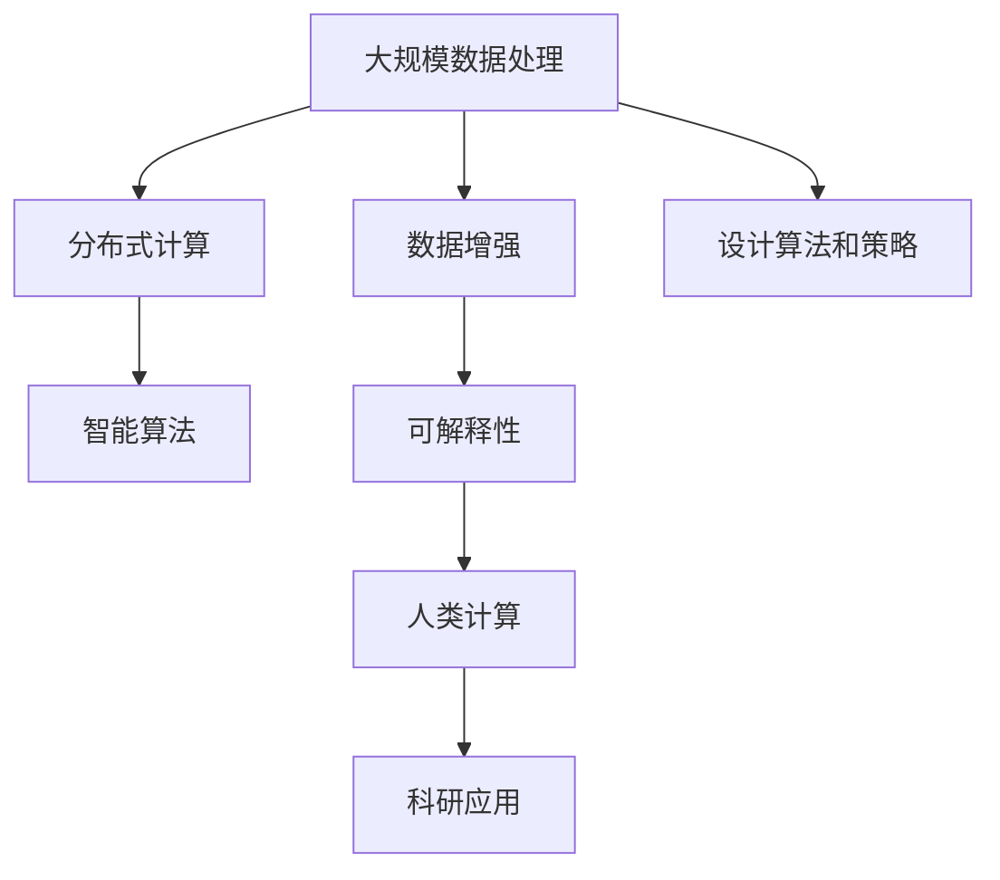

                 

# 人类计算：科学研究的新范式

## 1. 背景介绍

### 1.1 问题由来
随着计算技术的飞速发展，科学研究从以人类为主导的实验和观察模式，逐步转向了以计算机为中心的计算模式。计算模式通过在算法指导下的大规模数据处理，极大地提升了科学研究的效率和精度。然而，这种模式也面临着计算资源的巨大需求和计算算法的高门槛，限制了科学研究的普及和创新。

为解决这一问题，近年来，研究人员提出了一种全新的科学研究模式——“人类计算”。人类计算结合了人类思维的创造性和计算机计算的高效性，通过人类设计算法和策略，让计算机进行大规模数据处理，最终获得可解释性强、适用范围广的科学研究成果。这种模式有望在科学研究中大放异彩，成为未来科学发展的新范式。

### 1.2 问题核心关键点
人类计算的核心在于充分利用人类智慧与计算机算力，通过设计算法和策略，让计算机在科学研究中发挥最大效能。这一过程中，算法的科学性、计算资源的合理配置以及结果的可解释性是关键点。

## 2. 核心概念与联系

### 2.1 核心概念概述

为更好地理解人类计算，本节将介绍几个密切相关的核心概念：

- 人类计算(Human Computation)：利用人类智慧与计算机算力结合，通过设计算法和策略，让计算机在科学研究中发挥效能。人类计算强调结合人类思维和计算机算力的优势，使科研工作更具可解释性和创造性。

- 大规模数据处理：指通过计算机算法对大规模数据集进行高效处理，获取有用信息的过程。

- 分布式计算：指将大规模计算任务分布在多个计算机节点上，提高计算效率和资源利用率。

- 智能算法：指能够利用先验知识和经验，自动优化算法参数和策略的高级算法。

- 数据增强：通过增加数据集的多样性和规模，提升模型的泛化能力和鲁棒性。

- 可解释性(AI Explanation)：指机器学习模型的输出结果能够以人类可理解的方式解释，增强科学研究的可解释性和可信度。

这些核心概念之间的逻辑关系可以通过以下Mermaid流程图来展示：



这个流程图展示了大规模数据处理、分布式计算、智能算法、数据增强和可解释性等核心概念之间的联系，以及它们如何共同构成人类计算的基础。

## 3. 核心算法原理 & 具体操作步骤
### 3.1 算法原理概述

人类计算的核心算法原理主要包括：

- **算法设计**：人类主导设计高效的算法，以指导计算机处理数据。算法设计需要结合领域知识、统计分析、数据可视化等手段，确保算法的科学性和适用性。

- **分布式计算**：将大规模计算任务分布到多个计算机节点上，利用分布式系统的并行计算能力，提高计算效率。分布式计算需要考虑节点间的通信效率、数据一致性等问题。

- **智能算法**：利用机器学习、深度学习等高级算法，自动优化算法参数和策略，提升数据处理和分析的精度和效率。

- **数据增强**：通过数据扩充和扩维，增强算法的泛化能力和鲁棒性，提升模型在不同数据分布下的表现。

- **可解释性**：通过解释模型决策过程和输出结果，增强科学研究的可解释性和可信度。

### 3.2 算法步骤详解

基于人类计算的核心算法原理，科学研究的计算过程主要包括以下步骤：

**Step 1: 问题建模与算法设计**

1. **确定研究问题**：明确研究目标和科学问题，确定所需处理的数据类型和规模。
2. **设计算法和策略**：根据研究问题和数据特点，设计合适的算法和策略，指导计算机进行数据处理。

**Step 2: 分布式计算**

1. **数据分区**：将大规模数据集划分为多个子集，分配到不同的计算节点上。
2. **并行计算**：利用分布式系统的并行计算能力，同时处理多个子集数据，提高计算效率。
3. **结果汇聚**：将各节点的计算结果汇总，进行数据融合和整合。

**Step 3: 智能算法优化**

1. **模型训练**：利用机器学习算法对数据进行处理和分析，训练出高效的模型。
2. **参数调优**：通过自动搜索或手动调整算法参数，优化模型性能。
3. **结果验证**：对模型进行验证和测试，确保模型准确性和鲁棒性。

**Step 4: 数据增强与可解释性**

1. **数据增强**：通过数据扩充和扩维，增强算法的泛化能力和鲁棒性。
2. **可解释性分析**：对模型决策过程和输出结果进行解释，增强科学研究的可解释性和可信度。

**Step 5: 结果展示与应用**

1. **结果可视化**：通过数据可视化技术，展示科学研究的发现和结论。
2. **结果应用**：将研究成果应用于实际问题解决和科学创新，推动科学研究向前发展。

### 3.3 算法优缺点

人类计算算法具有以下优点：

- **高效性**：结合人类智慧和计算机算力，大幅提升科学研究的效率和精度。
- **可解释性**：通过设计算法和策略，增强了科学研究的可解释性和可信度。
- **创新性**：融合人类思维与计算机算力，推动科学研究的创新和突破。

同时，这种算法也存在一些局限性：

- **技术门槛高**：设计高效的算法和策略需要高度的领域知识和专业知识，对研究者提出了较高的技术要求。
- **计算资源需求大**：大规模数据处理和分布式计算需要大量的计算资源，对计算硬件提出了较高要求。
- **结果解释难度大**：虽然可解释性得到了增强，但复杂模型的解释仍具有一定的难度。

尽管存在这些局限性，但人类计算方法仍然是一种非常有前景的科学研究模式，能够有效推动科学研究的进步和发展。

### 3.4 算法应用领域

人类计算方法在科学研究中得到了广泛的应用，主要涵盖以下几个领域：

- **生物医学研究**：利用人类计算处理生物信息学数据，分析基因序列、蛋白质结构等生物信息，推动基因编辑、药物研发等前沿研究。
- **天文学研究**：利用人类计算处理天文观测数据，分析宇宙结构和演化过程，推动恒星形成、黑洞研究等前沿研究。
- **地理信息系统**：利用人类计算处理地理空间数据，分析气候变化、自然灾害等环境问题，推动城市规划、资源管理等研究。
- **社会网络分析**：利用人类计算处理社交媒体数据，分析人类行为和社会结构，推动社会科学研究。
- **人工智能研究**：利用人类计算处理机器学习数据，优化算法和策略，推动深度学习、自然语言处理等研究。

这些领域的应用展示了人类计算方法在科学研究中的强大潜力，为科学研究的全面发展和进步提供了新思路和新方向。

## 4. 数学模型和公式 & 详细讲解 & 举例说明
### 4.1 数学模型构建

假设研究问题是处理一组大规模数据集 $D = \{(x_i, y_i)\}_{i=1}^N$，其中 $x_i$ 为输入数据，$y_i$ 为输出标签。人类计算的核心数学模型为 $f(x) = M(x; \theta)$，其中 $M$ 为算法模型，$\theta$ 为模型参数。

### 4.2 公式推导过程

对于特定任务，如分类任务，目标是最小化损失函数 $L(f(x), y)$，推导如下：

1. **损失函数**：
   $$
   L(f(x), y) = -\log P(y|x)
   $$
   其中 $P(y|x)$ 为模型在输入 $x$ 下输出 $y$ 的概率。

2. **梯度下降优化**：
   $$
   \theta \leftarrow \theta - \eta \nabla_{\theta} L(f(x), y)
   $$
   其中 $\eta$ 为学习率，$\nabla_{\theta} L(f(x), y)$ 为损失函数对参数 $\theta$ 的梯度。

3. **数据增强**：
   $$
   x'_i = x_i + \epsilon_i
   $$
   其中 $\epsilon_i$ 为随机噪声，增加数据集的多样性和规模。

### 4.3 案例分析与讲解

以天文学数据处理为例，介绍人类计算方法的具体应用。

假设研究问题是分析一组天文学数据，目标是预测星体运动轨迹。首先，将原始数据集 $D$ 分为训练集和测试集。然后，设计算法模型 $M$，利用梯度下降优化，训练出高效模型。最后，对测试集进行预测，评估模型性能。

在训练过程中，利用数据增强技术，增加数据集的多样性和规模，提高模型的泛化能力和鲁棒性。通过可解释性分析，解释模型的决策过程和输出结果，增强科学研究的可信度。

## 5. 项目实践：代码实例和详细解释说明
### 5.1 开发环境搭建

在进行人类计算实践前，我们需要准备好开发环境。以下是使用Python进行Scikit-learn开发的环境配置流程：

1. 安装Anaconda：从官网下载并安装Anaconda，用于创建独立的Python环境。

2. 创建并激活虚拟环境：
```bash
conda create -n sklearn-env python=3.8 
conda activate sklearn-env
```

3. 安装Scikit-learn：
```bash
pip install scikit-learn
```

4. 安装其他工具包：
```bash
pip install numpy pandas matplotlib scikit-learn
```

完成上述步骤后，即可在`sklearn-env`环境中开始人类计算实践。

### 5.2 源代码详细实现

这里我们以天文学数据处理为例，给出使用Scikit-learn进行人类计算的Python代码实现。

```python
import numpy as np
import pandas as pd
from sklearn.model_selection import train_test_split
from sklearn.ensemble import RandomForestRegressor
from sklearn.metrics import mean_squared_error
from sklearn.preprocessing import StandardScaler

# 加载数据集
data = pd.read_csv('astronomy_data.csv')

# 数据预处理
features = data[['feature1', 'feature2', 'feature3']]
target = data['target']
scaler = StandardScaler()
features = scaler.fit_transform(features)

# 数据分区
train_features, test_features, train_target, test_target = train_test_split(features, target, test_size=0.2, random_state=42)

# 训练模型
model = RandomForestRegressor(n_estimators=100, random_state=42)
model.fit(train_features, train_target)

# 预测与评估
predictions = model.predict(test_features)
mse = mean_squared_error(test_target, predictions)
print(f'Mean Squared Error: {mse:.3f}')
```

### 5.3 代码解读与分析

让我们再详细解读一下关键代码的实现细节：

**数据加载与预处理**：
- `pd.read_csv('astronomy_data.csv')`：读取天文学数据集，将其存储为Pandas DataFrame。
- `features = data[['feature1', 'feature2', 'feature3']]`：选择需要用于建模的特征列。
- `target = data['target']`：获取目标变量（星体运动轨迹预测值）。
- `scaler = StandardScaler()`：标准化特征数据，使模型更加鲁棒。
- `features = scaler.fit_transform(features)`：对特征数据进行标准化处理。

**模型训练**：
- `train_features, test_features, train_target, test_target = train_test_split(features, target, test_size=0.2, random_state=42)`：将数据集分为训练集和测试集。
- `model = RandomForestRegressor(n_estimators=100, random_state=42)`：创建随机森林回归模型。
- `model.fit(train_features, train_target)`：在训练集上训练模型。

**模型评估**：
- `predictions = model.predict(test_features)`：在测试集上对模型进行预测。
- `mse = mean_squared_error(test_target, predictions)`：计算预测值与真实值之间的均方误差。
- `print(f'Mean Squared Error: {mse:.3f}')`：输出评估结果。

可以看到，使用Scikit-learn进行人类计算的数据处理和模型训练过程非常简洁高效，开发者可以将更多精力放在算法设计和策略优化上，而不必过多关注底层的实现细节。

## 6. 实际应用场景

### 6.1 生物医学研究

在生物医学研究中，人类计算方法可以处理大规模的基因组数据，分析基因序列、蛋白质结构等信息，推动基因编辑、药物研发等前沿研究。例如，利用人类计算方法分析癌症基因组数据，设计高效基因编辑策略，有望加速癌症治疗的进程。

### 6.2 天文学研究

天文学研究需要处理大量天文观测数据，利用人类计算方法进行数据处理和分析，有助于发现新的星体、研究宇宙结构等重要问题。例如，利用人类计算方法分析多普勒效应数据，预测恒星运动轨迹，有助于更好地理解恒星形成过程。

### 6.3 地理信息系统

地理信息系统（GIS）研究需要处理大量地理空间数据，分析气候变化、自然灾害等环境问题，推动城市规划、资源管理等研究。例如，利用人类计算方法分析气候变化数据，预测未来气候趋势，有助于优化城市规划。

### 6.4 社会网络分析

社会网络分析需要处理社交媒体数据，分析人类行为和社会结构，推动社会科学研究。例如，利用人类计算方法分析社交媒体数据，预测群体行为，有助于构建更健康、和谐的社会。

### 6.5 人工智能研究

人工智能研究需要处理大量机器学习数据，设计高效算法和策略，推动深度学习、自然语言处理等研究。例如，利用人类计算方法优化深度学习模型，提升图像识别和语音识别等应用性能。

这些领域的应用展示了人类计算方法在科学研究中的强大潜力，为科学研究的全面发展和进步提供了新思路和新方向。

## 7. 工具和资源推荐

### 7.1 学习资源推荐

为帮助开发者系统掌握人类计算的理论基础和实践技巧，这里推荐一些优质的学习资源：

1. 《机器学习基础》系列博文：由机器学习专家撰写，深入浅出地介绍了机器学习原理和常用算法。

2. 《统计学习基础》课程：斯坦福大学开设的统计学习课程，有Lecture视频和配套作业，带你入门统计学习基础。

3. 《深度学习》书籍：深度学习领域的经典教材，全面介绍了深度学习原理和应用。

4. Scikit-learn官方文档：Scikit-learn的官方文档，提供了海量数据处理和建模工具，是上手实践的必备资料。

5. Kaggle竞赛：Kaggle提供的数据竞赛平台，涵盖大量真实数据和挑战，是锻炼数据处理和建模能力的绝佳场所。

通过对这些资源的学习实践，相信你一定能够快速掌握人类计算的精髓，并用于解决实际的科学研究问题。

### 7.2 开发工具推荐

高效的开发离不开优秀的工具支持。以下是几款用于人类计算开发的常用工具：

1. Python：开源的编程语言，以其简洁、高效、可扩展性著称，适合数据处理和算法开发。

2. R：统计分析领域常用的语言，具有强大的数据分析和可视化能力。

3. Scikit-learn：基于Python的机器学习库，提供了丰富的数据处理和建模工具。

4. TensorFlow：由Google主导开发的深度学习框架，生产部署方便，适合大规模工程应用。

5. PyTorch：基于Python的深度学习框架，灵活动态的计算图，适合快速迭代研究。

6. Jupyter Notebook：交互式的开发环境，支持Python、R等多种语言，方便实时调试和展示结果。

合理利用这些工具，可以显著提升人类计算任务的开发效率，加快创新迭代的步伐。

### 7.3 相关论文推荐

人类计算技术的发展源于学界的持续研究。以下是几篇奠基性的相关论文，推荐阅读：

1. “Human Computation and Distributed Computing”：介绍人类计算和分布式计算的原理和应用。

2. “Large-Scale Human Computation with Amazon Mechanical Turk”：展示大规模人类计算的实际应用，利用Amazon Mechanical Turk平台进行任务分配和结果收集。

3. “Human-Computer Collaboration in Medicine: A Survey”：综述人类计算在医学领域的应用，包括疾病预测、诊断和治疗等。

4. “Human Computation and the Advent of Cyberspace”：探讨人类计算对网络空间的贡献，包括在线社交网络、虚拟现实等。

5. “Human Computer Interaction Design Patterns for Social Media”：介绍社交媒体中人类计算的应用，如信息推荐、情感分析等。

这些论文代表了大规模计算研究的发展脉络，是了解人类计算技术的基石。通过学习这些前沿成果，可以帮助研究者把握学科前进方向，激发更多的创新灵感。

## 8. 总结：未来发展趋势与挑战

### 8.1 总结

本文对人类计算方法进行了全面系统的介绍。首先阐述了人类计算的研究背景和意义，明确了人类计算在科学研究中的应用价值。其次，从原理到实践，详细讲解了人类计算的数学原理和操作步骤，给出了人类计算任务开发的完整代码实例。同时，本文还广泛探讨了人类计算方法在生物医学、天文学、地理信息系统、社会网络分析和人工智能等领域的应用前景，展示了人类计算方法在科学研究中的强大潜力。此外，本文精选了人类计算技术的各类学习资源，力求为读者提供全方位的技术指引。

通过本文的系统梳理，可以看到，人类计算方法结合了人类智慧和计算机算力，为科学研究提供了新的视角和方法，有望成为未来科学发展的新范式。未来，伴随人类计算技术的不断演进，科学研究将更加智能化、高效化和多样化，推动人类认知智能的进步。

### 8.2 未来发展趋势

展望未来，人类计算方法将呈现以下几个发展趋势：

1. **融合多模态数据**：人类计算将更多地融合图像、声音、文本等多种数据类型，提升模型对复杂环境的适应能力。

2. **深度学习与传统算法结合**：利用深度学习模型进行特征提取，结合传统算法进行复杂任务处理，提升科学研究的效率和精度。

3. **分布式计算和云计算**：利用云计算平台和分布式计算技术，处理海量数据，提升计算效率和资源利用率。

4. **智能算法优化**：利用自动调参技术，优化算法参数和策略，提升数据处理和分析的效率和精度。

5. **可解释性增强**：通过解释模型决策过程和输出结果，增强科学研究的可信度。

6. **数据增强和知识融合**：通过数据增强技术提升模型的泛化能力和鲁棒性，利用外部知识库增强模型的理解能力。

以上趋势凸显了人类计算方法的广阔前景。这些方向的探索发展，必将进一步提升人类计算的计算能力，推动科学研究的全面发展。

### 8.3 面临的挑战

尽管人类计算方法已经取得了瞩目成就，但在迈向更加智能化、普适化应用的过程中，它仍面临着诸多挑战：

1. **技术门槛高**：设计高效的算法和策略需要高度的领域知识和专业知识，对研究者提出了较高的技术要求。

2. **计算资源需求大**：大规模数据处理和分布式计算需要大量的计算资源，对计算硬件提出了较高要求。

3. **结果解释难度大**：虽然可解释性得到了增强，但复杂模型的解释仍具有一定的难度。

4. **数据隐私和安全**：大规模数据处理和分布式计算带来了数据隐私和安全问题，需要采取有效的措施进行保护。

5. **算法复杂性高**：复杂模型的设计和优化需要深入的领域知识和实践经验，增加了研究难度。

6. **跨领域融合难度大**：不同领域的数据和知识具有不同的特点，跨领域融合和应用面临较大挑战。

正视人类计算面临的这些挑战，积极应对并寻求突破，将是人类计算技术迈向成熟的必由之路。相信随着学界和产业界的共同努力，这些挑战终将一一被克服，人类计算必将在构建人机协同的智能系统中扮演越来越重要的角色。

### 8.4 研究展望

面向未来，人类计算技术需要在以下几个方面进行深入探索和创新：

1. **融合更多先验知识**：利用符号化的先验知识，如知识图谱、逻辑规则等，引导人类计算过程，增强模型的理解能力。

2. **引入因果分析和博弈论**：将因果分析方法和博弈论工具引入人类计算，提高模型的鲁棒性和稳定性。

3. **智能算法优化**：利用自动调参技术和智能算法，优化人类计算过程，提升模型的性能和效率。

4. **跨领域融合**：推动不同领域的数据和知识融合，提升模型的跨领域应用能力。

5. **可解释性增强**：通过解释模型决策过程和输出结果，增强科学研究的可信度。

6. **分布式计算优化**：优化分布式计算架构，提高资源利用率和计算效率。

这些研究方向的探索，必将引领人类计算技术迈向更高的台阶，为构建安全、可靠、可解释、可控的智能系统铺平道路。面向未来，人类计算技术还需要与其他人工智能技术进行更深入的融合，如知识表示、因果推理、强化学习等，多路径协同发力，共同推动人类认知智能的进步。

## 9. 附录：常见问题与解答

**Q1：人类计算是否适用于所有科学研究领域？**

A: 人类计算方法在大多数科学研究领域中都能取得不错的效果，特别是对于数据量较大的任务。但对于一些特定领域的任务，如医学、法律等，仅仅依靠通用计算平台可能难以很好地适应。此时需要在特定领域计算平台上进行优化，才能获得理想效果。

**Q2：如何选择合适的算法和策略？**

A: 选择合适的算法和策略需要考虑多个因素，包括数据类型、任务复杂度、计算资源等。一般建议根据具体任务和数据特点进行评估，选择最适合的算法和策略。可以参考已有文献和研究案例，进行算法调优和策略设计。

**Q3：人类计算中如何处理大规模数据？**

A: 处理大规模数据需要利用分布式计算和云计算技术，将数据分区并分配到不同的计算节点上，利用并行计算能力提高计算效率。同时，可以使用数据增强技术，增加数据集的多样性和规模，提升模型的泛化能力和鲁棒性。

**Q4：如何增强人类计算的可解释性？**

A: 增强人类计算的可解释性需要从模型设计和结果解释两个方面进行努力。在模型设计中，可以使用可解释性强的算法和策略，如决策树、线性回归等。在结果解释中，可以使用数据可视化、特征解释等技术，展示模型的决策过程和输出结果。

**Q5：人类计算在实际应用中需要注意哪些问题？**

A: 将人类计算应用于实际问题解决和科学研究中，还需要考虑以下因素：

1. 数据隐私和安全：保护数据隐私，防止数据泄露和滥用。
2. 计算资源优化：合理利用计算资源，提高计算效率。
3. 结果验证和验证：对模型进行验证和测试，确保模型准确性和鲁棒性。
4. 数据质量控制：确保数据的准确性和完整性，提高模型的可靠性。
5. 模型优化和迭代：持续优化模型，提高模型的性能和应用效果。

总之，人类计算需要结合数据处理、算法设计、分布式计算等多方面因素，进行全面优化，才能在实际应用中取得理想的效果。

---

作者：禅与计算机程序设计艺术 / Zen and the Art of Computer Programming

