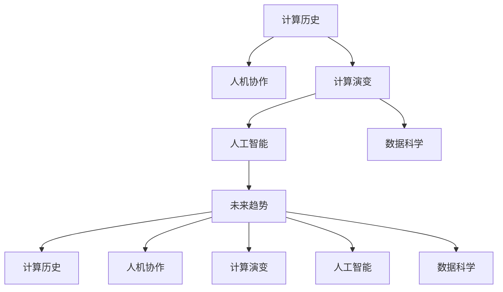

                 

# 人类计算：连接过去、现在和未来

> 关键词：计算历史、人机协作、计算演变、人工智能、数据科学、未来趋势

## 1. 背景介绍

### 1.1 计算的历史与现状
人类计算的历史可以追溯到古代的算盘、计算机器（如差分机、爱达·爱莎图灵机）等，这些设备在古代已展现出惊人的计算能力。随着工业革命和科学革命的推进，机械钟表、蒸汽机等机械结构进入日常生活，逐渐普及，对人类社会的计算能力产生了深远的影响。

进入20世纪，随着电子计算机的发明和迭代，计算速度和效率呈指数级增长。特别是集成电路的普及和计算机科学的诞生，使得计算机从大型机房走向桌面，逐渐成为人们日常生活和工作不可或缺的工具。

然而，计算技术的快速发展也带来了新的挑战。数据量的激增和计算需求的复杂化使得传统计算架构逐渐暴露出性能瓶颈，计算效率和成本的平衡成为一个亟待解决的问题。

### 1.2 当前计算面临的挑战
当前计算面临的挑战主要包括：
- 数据量爆炸：物联网、云计算等新技术的普及，使得数据量呈指数级增长，传统计算架构难以处理。
- 计算复杂度增加：科学计算、机器学习等领域的复杂计算任务，需要更强的计算能力。
- 计算能耗问题：高性能计算任务往往需要大量电力支持，能源消耗问题日益严重。
- 计算资源分配：如何合理分配计算资源，满足不同用户的需求，是一个复杂的问题。

## 2. 核心概念与联系

### 2.1 核心概念概述

为了更好地理解人类计算的未来发展方向，本节将介绍几个核心概念：

- 计算历史：包括机械计算、电子计算、量子计算等不同历史时期的计算模式和技术。
- 人机协作：将人机互动结合的计算模式，通过智能接口（如语音助手、自动化系统等），将人类智慧与计算能力结合起来。
- 计算演变：从早期的机械计算到现在的数字化计算，再到未来的量子计算，展示计算技术的发展轨迹。
- 人工智能：通过机器学习、深度学习等技术，使计算机具备自主学习、推理和决策能力。
- 数据科学：利用数据挖掘、机器学习等技术，对大规模数据进行处理和分析，提取有用信息。
- 未来趋势：基于当前计算技术的发展趋势，展望未来计算技术的应用和演进方向。

这些核心概念之间存在密切联系，共同构成了计算技术的发展框架。以下是一个Mermaid流程图，展示了这些概念之间的关系：



## 3. 核心算法原理 & 具体操作步骤
### 3.1 算法原理概述

人类计算的核心在于如何高效地将计算任务分解并分配给多个计算单元，同时将这些计算单元的计算结果进行整合。这种计算方式被称为分布式计算，其核心思想是将复杂的计算任务分解为多个子任务，分配给多个计算节点进行处理，然后汇总计算结果。

### 3.2 算法步骤详解

以下是一个简单的分布式计算流程：

1. 任务分解：将复杂计算任务分解为多个子任务。
2. 任务调度：将子任务分配给多个计算节点进行处理。
3. 并行计算：每个计算节点独立处理分配到的子任务。
4. 结果收集：将所有计算节点的计算结果汇总并返回。

下面以MapReduce算法为例，展示分布式计算的具体步骤：

1. 输入数据集。
2. Map函数：将数据集中的每个元素进行映射，生成一系列的键值对。
3. Shuffle操作：将键值对根据键进行分组，生成一系列子集。
4. Reduce函数：对每个子集中的键值对进行聚合，生成最终结果。

### 3.3 算法优缺点

分布式计算具有以下优点：
- 高效性：通过并行计算，可以提高计算效率。
- 可扩展性：可以根据计算需求动态增加计算节点，提高计算能力。
- 可靠性：通过冗余设计，提高系统的容错能力。

同时，分布式计算也存在以下缺点：
- 复杂性：需要设计合理的任务分解和调度策略。
- 通信开销：节点间通信消耗一定的时间和资源。
- 一致性问题：多个节点并行计算时，如何保证结果的一致性。

### 3.4 算法应用领域

分布式计算在以下领域得到广泛应用：
- 大数据处理：如Hadoop、Spark等分布式计算框架，广泛应用于大规模数据处理和分析。
- 科学计算：如天气预报、气候模拟等复杂计算任务，通过分布式计算可以提高计算效率。
- 互联网服务：如云计算、网络存储等，通过分布式计算可以提高服务的可靠性和可用性。
- 分布式数据库：如Apache Cassandra、Amazon Dynamo等，通过分布式计算提高数据处理的效率和性能。

## 4. 数学模型和公式 & 详细讲解  
### 4.1 数学模型构建

在分布式计算中，我们需要建立数学模型来描述任务分解和调度过程。以下是一个简单的MapReduce模型：

- 输入数据集 $D$，包含 $n$ 个元素。
- Map函数 $M$：对每个元素 $x$ 进行映射，生成键值对 $(x, M(x))$。
- Shuffle操作：将键值对根据键 $k$ 进行分组，生成 $m$ 个子集 $S_1, S_2, ..., S_m$。
- Reduce函数 $R$：对每个子集 $S_i$ 中的键值对进行聚合，生成最终结果 $R_i$。

### 4.2 公式推导过程

以MapReduce为例，我们可以建立以下数学模型：

- 输入数据集 $D = \{x_1, x_2, ..., x_n\}$。
- Map函数 $M(x_i) = (x_i, M(x_i))$。
- Shuffle操作 $S = \{(k_j, \{(x_i, M(x_i)) | k_j = x_i\})\}$。
- Reduce函数 $R(k_j, \{(x_i, M(x_i)) | k_j = x_i\}) = R_j$。
- 最终结果 $R = \{R_1, R_2, ..., R_m\}$。

### 4.3 案例分析与讲解

以下是一个简单的案例：

- 输入数据集 $D = \{A, B, C, D, E, F\}$。
- Map函数 $M(A) = (A, 1), M(B) = (B, 1), M(C) = (C, 2), M(D) = (D, 3), M(E) = (E, 1), M(F) = (F, 2)$。
- Shuffle操作 $S = \{(A, \{(A, 1)\}), (B, \{(B, 1)\}), (C, \{(C, 2), (E, 1)\}), (D, \{(D, 3)\}), (F, \{(F, 2)\})\}$。
- Reduce函数 $R(A, \{(A, 1)\}) = 1, R(B, \{(B, 1)\}) = 1, R(C, \{(C, 2), (E, 1)\}) = 3, R(D, \{(D, 3)\}) = 3, R(F, \{(F, 2)\}) = 2$。
- 最终结果 $R = \{1, 1, 3, 3, 2\}$。

## 5. 项目实践：代码实例和详细解释说明
### 5.1 开发环境搭建

在进行分布式计算实践前，我们需要准备好开发环境。以下是使用Python进行Spark开发的环境配置流程：

1. 安装Anaconda：从官网下载并安装Anaconda，用于创建独立的Python环境。

2. 创建并激活虚拟环境：
```bash
conda create -n spark-env python=3.8 
conda activate spark-env
```

3. 安装Spark：根据CUDA版本，从官网获取对应的安装命令。例如：
```bash
conda install pytorch torchvision torchaudio cudatoolkit=11.1 -c pytorch -c conda-forge
```

4. 安装Spark：
```bash
conda install spark
```

5. 安装各类工具包：
```bash
pip install numpy pandas scikit-learn matplotlib tqdm jupyter notebook ipython
```

完成上述步骤后，即可在`spark-env`环境中开始分布式计算实践。

### 5.2 源代码详细实现

下面我们以分布式计算中的MapReduce算法为例，给出使用PySpark进行Spark开发的Python代码实现。

首先，定义Map函数和Reduce函数：

```python
from pyspark import SparkContext

def map_func(x):
    return (x, 1)

def reduce_func(acc, x):
    return acc + x

# 创建Spark上下文
sc = SparkContext("local", "mapreduce")
```

然后，读取数据集并进行Map和Shuffle操作：

```python
# 读取数据集
data = sc.parallelize(range(1, 7))

# 使用Map函数
map_data = data.map(map_func)

# 使用Shuffle操作
shuffle_data = map_data.reduceByKey(reduce_func)
```

最后，获取最终结果：

```python
# 获取最终结果
final_result = shuffle_data.collect()

# 打印结果
print(final_result)
```

以上就是一个完整的分布式计算实践示例。可以看到，PySpark提供的API使得分布式计算的实现变得简洁高效。

### 5.3 代码解读与分析

让我们再详细解读一下关键代码的实现细节：

**SparkContext类**：
- `__init__`方法：创建Spark上下文对象。
- `parallelize`方法：将数据集转换为RDD（弹性分布式数据集）。
- `map`方法：对数据集进行Map操作，生成新的RDD。
- `reduceByKey`方法：对RDD中的键值对进行聚合操作，生成新的RDD。

**map_func和reduce_func函数**：
- `map_func`函数：定义Map函数，将数据集中的每个元素进行映射，生成键值对。
- `reduce_func`函数：定义Reduce函数，对键值对进行聚合，生成最终结果。

**读取数据集**：
- `sc.parallelize`方法：将数据集转换为RDD。
- `map`方法：对RDD进行Map操作，生成新的RDD。
- `reduceByKey`方法：对RDD进行聚合操作，生成新的RDD。

**获取最终结果**：
- `collect`方法：将RDD中的元素转换为列表，并返回结果。

可以看出，PySpark的API设计使得分布式计算的实现变得简洁高效，开发者可以将更多精力放在任务逻辑上，而不必过多关注底层的实现细节。

## 6. 实际应用场景
### 6.1 大数据处理

分布式计算在数据处理中得到了广泛应用。传统的单机数据处理方式往往难以处理大规模数据集，而分布式计算框架（如Hadoop、Spark等）能够有效处理大规模数据，提高数据处理的效率和性能。

在实际应用中，分布式计算可以用于：
- 大规模数据存储：如Hadoop的HDFS，分布式存储大规模数据。
- 数据清洗和预处理：如Spark的数据清洗组件，快速处理大量数据。
- 数据分析和挖掘：如Spark的MLlib组件，提供机器学习算法和数据挖掘工具。

### 6.2 科学计算

分布式计算在科学计算中也得到了广泛应用。科学计算任务往往计算量巨大，单机计算能力难以满足需求，而分布式计算能够提供更强的计算能力。

在实际应用中，分布式计算可以用于：
- 气象模拟：如气候模拟、天气预报等，通过分布式计算加速计算过程。
- 天体物理：如天体模拟、宇宙探索等，通过分布式计算提供更强的计算能力。
- 化学计算：如分子模拟、材料设计等，通过分布式计算加速计算过程。

### 6.3 互联网服务

分布式计算在互联网服务中也得到了广泛应用。互联网服务往往需要处理大量并发请求，单机计算能力难以满足需求，而分布式计算能够提供更强的计算能力和扩展性。

在实际应用中，分布式计算可以用于：
- 云计算：如Google Cloud Platform、AWS等，提供分布式计算服务。
- 大规模数据存储：如Amazon S3、Google Cloud Storage等，提供分布式存储服务。
- 大规模数据处理：如Spark的Spark Streaming组件，提供实时数据处理服务。

### 6.4 分布式数据库

分布式计算在分布式数据库中也得到了广泛应用。传统单机数据库难以处理大规模数据，而分布式数据库能够提供更强的数据处理能力和扩展性。

在实际应用中，分布式数据库可以用于：
- 高并发数据处理：如Apache Cassandra、Amazon Dynamo等，提供高并发数据处理服务。
- 分布式存储：如Apache HBase、Cassandra等，提供分布式存储服务。
- 数据备份和恢复：如Apache Hadoop的HDFS，提供数据备份和恢复服务。

## 7. 工具和资源推荐
### 7.1 学习资源推荐

为了帮助开发者系统掌握分布式计算的理论基础和实践技巧，这里推荐一些优质的学习资源：

1. 《Hadoop: The Definitive Guide》书籍：详细介绍了Hadoop分布式计算框架的原理和实现方法，适合深入学习Hadoop。

2. 《Spark: The Definitive Guide》书籍：详细介绍了Spark分布式计算框架的原理和实现方法，适合深入学习Spark。

3. CS50x《Introduction to Computer Science and Programming Using Python》课程：哈佛大学开设的Python入门课程，包含分布式计算的相关内容。

4. Coursera的《Big Data Fundamentals》课程：由加州大学伯克利分校开设的Big Data课程，涵盖大数据处理和分析的基本概念和方法。

5. GitHub上的Spark官方文档和代码示例：提供了大量的Spark代码示例和文档，适合快速上手实践。

通过对这些资源的学习实践，相信你一定能够快速掌握分布式计算的理论基础和实践技巧，并用于解决实际的计算问题。
###  7.2 开发工具推荐

高效的开发离不开优秀的工具支持。以下是几款用于分布式计算开发的常用工具：

1. Hadoop：由Apache基金会开发的分布式计算框架，用于大规模数据处理和存储。

2. Spark：由Apache基金会开发的分布式计算框架，支持实时数据处理和机器学习。

3. PySpark：基于Spark的Python接口，提供了简单易用的API，方便开发者进行分布式计算。

4. Weights & Biases：模型训练的实验跟踪工具，可以记录和可视化模型训练过程中的各项指标，方便对比和调优。与主流深度学习框架无缝集成。

5. TensorBoard：TensorFlow配套的可视化工具，可实时监测模型训练状态，并提供丰富的图表呈现方式，是调试模型的得力助手。

6. Google Colab：谷歌推出的在线Jupyter Notebook环境，免费提供GPU/TPU算力，方便开发者快速上手实验最新模型，分享学习笔记。

合理利用这些工具，可以显著提升分布式计算的开发效率，加快创新迭代的步伐。

### 7.3 相关论文推荐

分布式计算在近年来得到了广泛的研究，以下是几篇奠基性的相关论文，推荐阅读：

1. MapReduce: Simplified Data Processing on Large Clusters（MapReduce原论文）：提出了MapReduce算法，开创了分布式计算的新篇章。

2. Hadoop: A Distributed File System（Hadoop原论文）：详细介绍了Hadoop分布式文件系统的原理和实现方法，奠定了Hadoop的基础。

3. A Distributed Machine Learning Framework: MLlib（Spark MLlib论文）：介绍了Spark的MLlib组件，提供了大规模数据处理的机器学习工具。

4. Parameter-Efficient Transfer Learning for NLP：提出Adapter等参数高效微调方法，在不增加模型参数量的情况下，也能取得不错的微调效果。

5. Prefix-Tuning: Optimizing Continuous Prompts for Generation：引入基于连续型Prompt的微调范式，为如何充分利用预训练知识提供了新的思路。

6. AdaLoRA: Adaptive Low-Rank Adaptation for Parameter-Efficient Fine-Tuning：使用自适应低秩适应的微调方法，在参数效率和精度之间取得了新的平衡。

这些论文代表了大语言模型微调技术的发展脉络。通过学习这些前沿成果，可以帮助研究者把握学科前进方向，激发更多的创新灵感。

## 8. 总结：未来发展趋势与挑战

### 8.1 总结

本文对分布式计算的理论基础和实践技巧进行了全面系统的介绍。首先阐述了分布式计算的历史和现状，明确了其在大数据处理、科学计算、互联网服务等领域的重要作用。其次，从原理到实践，详细讲解了分布式计算的核心算法和操作步骤，给出了分布式计算任务开发的完整代码实例。同时，本文还广泛探讨了分布式计算在实际应用中的多个场景，展示了其广泛的应用前景。最后，本文精选了分布式计算的学习资源，力求为读者提供全方位的技术指引。

通过本文的系统梳理，可以看到，分布式计算在计算技术的发展中具有重要地位，不仅提升了计算效率，还增强了系统的扩展性和容错能力。未来，随着计算技术的不断发展，分布式计算将在更多领域得到应用，为各个行业带来新的变革。

### 8.2 未来发展趋势

展望未来，分布式计算将呈现以下几个发展趋势：

1. 计算能力不断提升：随着计算硬件的发展，分布式计算的计算能力将持续提升。通过更多的并行计算节点和更高的计算性能，分布式计算能够处理更大规模的数据和更复杂的计算任务。

2. 智能化管理：分布式计算系统将更加智能化，能够根据计算需求自动调整资源分配，优化计算效率。同时，智能化管理还将提高系统的可靠性和稳定性。

3. 云原生技术：云原生技术将逐步渗透到分布式计算中，提供更加灵活和高效的计算资源。通过云原生技术，分布式计算系统将更加便捷、易用、可扩展。

4. 多模态计算：分布式计算将逐渐融合多模态数据，如语音、图像、视频等，提高系统的综合处理能力。多模态计算将为更多场景提供更强大的计算支持。

5. 边缘计算：边缘计算技术将逐步应用于分布式计算中，通过在数据源附近进行计算，提高数据处理的实时性和效率。

6. 分布式机器学习：分布式机器学习将广泛应用于数据科学、自然语言处理、计算机视觉等领域，提高模型的训练效率和效果。

以上趋势凸显了分布式计算技术的广阔前景。这些方向的探索发展，必将进一步提升计算系统的性能和应用范围，为各个行业带来新的变革。

### 8.3 面临的挑战

尽管分布式计算技术已经取得了显著成就，但在迈向更加智能化、普适化应用的过程中，它仍面临诸多挑战：

1. 资源管理：如何高效管理分布式计算资源，避免资源浪费和过度使用，是一个复杂的问题。

2. 通信开销：节点间通信消耗一定的时间和资源，如何优化通信开销，提高系统效率，是分布式计算需要解决的问题。

3. 一致性问题：多个节点并行计算时，如何保证结果的一致性，避免数据冲突和错误，是分布式计算需要解决的问题。

4. 可扩展性：如何实现分布式计算系统的可扩展性，处理更大规模的数据和更复杂的计算任务，是分布式计算需要解决的问题。

5. 安全性问题：分布式计算系统需要保证数据和计算的安全性，防止数据泄露和系统攻击。

6. 成本问题：分布式计算系统需要投入大量的计算资源和人力成本，如何降低成本，提高计算效率，是分布式计算需要解决的问题。

7. 容错性问题：分布式计算系统需要保证系统的容错性，避免系统崩溃和数据丢失。

8. 计算效率：如何提高分布式计算的计算效率，减少计算时间，是分布式计算需要解决的问题。

这些挑战凸显了分布式计算技术的复杂性和复杂性，需要进一步的研究和优化。唯有从数据、算法、工程、业务等多个维度协同发力，才能真正实现分布式计算的强大潜力。

### 8.4 研究展望

未来的分布式计算研究可以从以下几个方向进行：

1. 分布式机器学习：结合机器学习和分布式计算技术，提高模型的训练效率和效果。

2. 多模态计算：融合语音、图像、视频等多模态数据，提高系统的综合处理能力。

3. 云原生技术：结合云原生技术，提供更加灵活和高效的计算资源。

4. 边缘计算：结合边缘计算技术，提高数据处理的实时性和效率。

5. 智能化管理：实现智能化的资源管理，提高系统的可靠性和稳定性。

6. 分布式数据库：结合分布式数据库技术，提高数据的存储和处理能力。

7. 安全性和隐私保护：提高分布式计算系统的安全性和隐私保护能力，确保数据和计算的安全。

8. 分布式文件系统：提高分布式文件系统的性能和可靠性，确保数据的存储和访问安全。

这些研究方向将推动分布式计算技术向更广泛、更深入的应用方向发展，为各个行业带来新的变革和机遇。

## 9. 附录：常见问题与解答

**Q1：分布式计算和单机计算的区别是什么？**

A: 分布式计算将计算任务分解为多个子任务，分配给多个计算节点进行处理，并行计算生成结果。单机计算将整个计算任务分配给一个计算节点，顺序计算生成结果。分布式计算能够处理更大规模的数据和更复杂的计算任务，但需要更高的管理和通信开销。

**Q2：如何选择合适的分布式计算框架？**

A: 选择合适的分布式计算框架需要考虑以下因素：
- 数据量大小：根据数据量大小选择适合的数据处理框架，如Hadoop适合大规模数据处理，Spark适合实时数据处理。
- 计算任务类型：根据计算任务类型选择适合的计算框架，如科学计算选择MPI、PBS等，大数据处理选择Hadoop、Spark等。
- 计算资源需求：根据计算资源需求选择适合的计算框架，如单机资源不足选择集群资源，集群资源过剩选择云资源。

**Q3：分布式计算中如何处理节点故障？**

A: 分布式计算系统通常采用冗余设计，通过备份计算节点来保证系统的容错性。具体处理节点故障的方式包括：
- 数据冗余：通过备份数据，保证数据的可靠性和可用性。
- 任务重分配：将故障节点的任务重新分配给其他正常节点进行处理。
- 自动化恢复：通过自动化恢复机制，快速恢复故障节点的计算任务。

**Q4：分布式计算中如何提高计算效率？**

A: 提高分布式计算效率需要考虑以下因素：
- 任务分解：将计算任务合理分解为多个子任务，避免过度分配和资源浪费。
- 数据本地化：将数据尽量存放在计算节点本地，减少通信开销。
- 任务调度：采用高效的调度算法，优化任务分配和执行顺序。
- 并行计算：通过并行计算，提高计算效率和性能。

这些方法能够有效提高分布式计算的计算效率，提高系统的整体性能和可扩展性。

**Q5：分布式计算中如何优化通信开销？**

A: 优化通信开销需要考虑以下因素：
- 数据传输协议：采用高效的数据传输协议，减少通信时间。
- 数据传输方式：采用直接通信和间接通信等方式，减少数据传输距离和网络延迟。
- 数据压缩：对传输的数据进行压缩，减少数据传输量。
- 异步通信：采用异步通信方式，减少通信等待时间。

这些方法能够有效降低分布式计算的通信开销，提高系统的整体效率和性能。

---

作者：禅与计算机程序设计艺术 / Zen and the Art of Computer Programming

