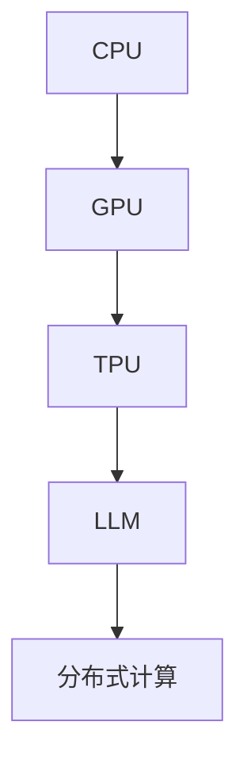

                 

# 从CPU到LLM：计算模式的演进历程

> 关键词：计算模式，处理器架构，深度学习，大语言模型，GPU，TPU，分布式计算

## 1. 背景介绍

### 1.1 问题由来
计算机的计算模式从早期的CPU时代，到逐渐引入GPU并最终迈向LLM（Large Language Model，大语言模型）的时代，经历了翻天覆地的变革。这一变化不仅代表了硬件计算能力的大幅提升，更是带来了对数据处理、算法设计、编程模式等多方面技术的深刻影响。理解这一演进历程，将有助于我们更好地把握未来的计算模式趋势和技术方向。

### 1.2 问题核心关键点
本节将围绕以下几个核心关键点展开：

- **计算模式的历史演进**：从早期的CPU到GPU，再到LLM，计算机的计算模式经历了哪些重要变化？
- **处理器架构的影响**：不同架构（如CPU、GPU、TPU等）对计算模式有何影响？
- **深度学习与大语言模型的崛起**：深度学习技术如何引领计算模式的演进？
- **分布式计算的重要性**：在计算模式演进中，分布式计算扮演了怎样的角色？
- **未来计算模式的展望**：未来计算模式将呈现哪些新趋势？

### 1.3 问题研究意义
了解计算模式的演进历程，对于理解现代计算机科学的发展脉络，把握未来的技术趋势，具有重要意义：

- **技术回顾**：帮助开发者和研究者回顾和总结历史上的重要计算模式和硬件创新。
- **性能提升**：理解不同计算模式的特点和优势，选择最适合应用的硬件架构，提升计算性能。
- **算法优化**：深入分析深度学习和大语言模型对计算模式的依赖，优化算法设计和模型训练。
- **行业应用**：结合实际行业需求，选择合适的计算模式，推动技术在更多领域的应用和创新。

## 2. 核心概念与联系

### 2.1 核心概念概述

为更好地理解从CPU到LLM的计算模式演进，本节将介绍几个密切相关的核心概念：

- **CPU**：Central Processing Unit，中央处理器，是传统计算机的计算核心。
- **GPU**：Graphics Processing Unit，图形处理器，最初用于加速图形渲染，后逐渐应用于深度学习。
- **TPU**：Tensor Processing Unit，张量处理器，专门用于加速TensorFlow等深度学习框架中的计算任务。
- **LLM**：Large Language Model，大语言模型，基于深度学习技术构建的，能够理解和生成自然语言的大型神经网络模型。
- **分布式计算**：利用多台计算机共同分担计算任务，提高计算效率和可靠性。

这些核心概念之间的逻辑关系可以通过以下Mermaid流程图来展示：



这个流程图展示了计算模式演进的脉络：

1. 传统的计算任务主要依赖CPU进行处理。
2. GPU的出现，特别是CUDA和OpenCL等并行编程模型，使得计算任务开始从CPU向GPU迁移。
3. TPU的引入，进一步优化了深度学习等复杂计算任务的执行效率。
4. 大语言模型在TPU等专用硬件的支持下，达到了前所未有的计算性能。
5. 随着模型规模的不断增大，分布式计算成为提升计算能力的重要手段。

## 3. 核心算法原理 & 具体操作步骤

### 3.1 算法原理概述

从CPU到LLM的计算模式演进，本质上是一个从串行计算到并行计算，再到分布式计算的过程。其核心原理在于如何更高效地利用计算资源，处理更大规模、更复杂的数据。

### 3.2 算法步骤详解

#### 3.2.1 CPU计算模式
- **串行计算**：早期的CPU采用串行计算模式，即任务按顺序执行，每个任务只占用一个处理器核心，计算效率较低。

#### 3.2.2 GPU计算模式
- **并行计算**：GPU采用并行计算模式，利用大量CUDA核心或OpenCL工作项，同时处理多个计算任务，极大地提升了计算速度。
- **数据并行**：将一个大的数据集切分成多个小批次，并行地处理这些小批次，提高了数据处理的效率。

#### 3.2.3 TPU计算模式
- **加速计算**：TPU专门为深度学习等计算密集型任务设计，通过专用的矩阵运算加速器，大幅度提升了计算速度。
- **自动并行化**：TPU能够自动并行化深度学习模型的计算图，进一步优化了计算效率。

#### 3.2.4 LLM计算模式
- **大规模并行**：大语言模型通常由数十亿甚至数百亿个参数组成，需要通过大规模并行计算才能有效训练。
- **分布式训练**：利用多个TPU节点，并行地训练大语言模型，提升了训练速度和模型性能。

### 3.3 算法优缺点

#### 3.3.1 CPU计算模式
- **优点**：易于编程和调试，适用范围广。
- **缺点**：计算效率低，难以处理大规模并行任务。

#### 3.3.2 GPU计算模式
- **优点**：计算速度大幅提升，适合处理并行任务。
- **缺点**：编程难度大，对内存管理要求高。

#### 3.3.3 TPU计算模式
- **优点**：专门设计用于深度学习计算，计算效率极高。
- **缺点**：硬件专用性强，灵活性不足。

#### 3.3.4 LLM计算模式
- **优点**：能够处理大规模、复杂的数据集，训练效率高。
- **缺点**：硬件和编程成本高，对数据存储和传输要求高。

### 3.4 算法应用领域

从CPU到LLM的计算模式演进，极大地扩展了计算能力的应用范围，特别是在以下领域：

- **深度学习**：GPU和TPU的高效并行计算能力，推动了深度学习技术的快速发展，应用于图像识别、语音识别、自然语言处理等领域。
- **人工智能**：通过GPU和TPU等硬件的加速，使得大规模人工智能模型的训练和推理成为可能，推动了AI技术在各个行业的广泛应用。
- **大数据处理**：分布式计算模式，使得大规模数据集的存储、处理和分析变得更加高效。
- **科学计算**：计算模式演进为GPU和TPU，显著提升了科学计算的效率，推动了生物医药、物理模拟、气象预测等领域的发展。
- **自动驾驶**：通过GPU和TPU的高效计算，实现了自动驾驶车辆对复杂环境的实时处理和决策。

## 4. 数学模型和公式 & 详细讲解  
### 4.1 数学模型构建

本节将使用数学语言对从CPU到LLM的计算模式演进进行更加严格的刻画。

假设一个深度学习模型在CPU上运行，其计算过程可以表示为：

$$
\text{CPU计算} = \mathcal{C} \times \mathcal{D}
$$

其中，$\mathcal{C}$ 表示计算任务的数量，$\mathcal{D}$ 表示每个任务的数据量。

在GPU上，计算过程可以表示为：

$$
\text{GPU计算} = \mathcal{P} \times \mathcal{D} \times \text{并行度} \times \text{效率}
$$

其中，$\mathcal{P}$ 表示计算任务的并行度，$\text{效率}$ 表示GPU的计算效率。

在TPU上，计算过程可以表示为：

$$
\text{TPU计算} = \mathcal{S} \times \mathcal{D} \times \text{自动并行度} \times \text{效率}
$$

其中，$\mathcal{S}$ 表示计算任务的自动并行度。

对于大语言模型，计算过程可以表示为：

$$
\text{LLM计算} = \mathcal{N} \times \mathcal{D} \times \text{并行度} \times \text{分布式度} \times \text{效率}
$$

其中，$\mathcal{N}$ 表示模型参数的数量，$\text{分布式度}$ 表示分布式计算的规模。

### 4.2 公式推导过程

以GPU计算为例，推导其与CPU计算的效率差异：

设CPU的计算速度为 $v_{CPU}$，GPU的计算速度为 $v_{GPU}$，两者并行度分别为 $p_{CPU}$ 和 $p_{GPU}$，数据量为 $D$，计算任务数为 $C$。

则CPU的计算时间 $t_{CPU}$ 为：

$$
t_{CPU} = \frac{C \times D}{v_{CPU}}
$$

GPU的计算时间 $t_{GPU}$ 为：

$$
t_{GPU} = \frac{C \times p_{GPU} \times D}{v_{GPU} \times \text{并行度}}
$$

由公式可知，GPU的计算时间与CPU相比，大幅减少，计算速度显著提升。

### 4.3 案例分析与讲解

以BERT模型的训练为例，分析其在不同计算模式下的性能提升：

- **CPU训练**：每个参数的梯度计算都需要串行执行，训练速度较慢。
- **GPU训练**：利用多个GPU核心并行计算，大幅提升了计算速度和效率。
- **TPU训练**：TPU的专用加速器使得深度学习模型的训练更加高效，进一步提升了训练速度和模型性能。

## 5. 项目实践：代码实例和详细解释说明
### 5.1 开发环境搭建

在进行计算模式演进实践前，我们需要准备好开发环境。以下是使用Python进行TensorFlow开发的环境配置流程：

1. 安装Anaconda：从官网下载并安装Anaconda，用于创建独立的Python环境。

2. 创建并激活虚拟环境：
```bash
conda create -n tf-env python=3.8 
conda activate tf-env
```

3. 安装TensorFlow：根据CUDA版本，从官网获取对应的安装命令。例如：
```bash
pip install tensorflow tensorflow-gpu
```

4. 安装各类工具包：
```bash
pip install numpy pandas scikit-learn matplotlib tqdm jupyter notebook ipython
```

完成上述步骤后，即可在`tf-env`环境中开始计算模式演进实践。

### 5.2 源代码详细实现

下面我们以BERT模型的训练为例，给出使用TensorFlow进行深度学习计算的PyTorch代码实现。

首先，定义数据预处理函数：

```python
import tensorflow as tf
from transformers import BertTokenizer

tokenizer = BertTokenizer.from_pretrained('bert-base-uncased')
max_seq_length = 128
batch_size = 32

def preprocess(text):
    tokens = tokenizer.tokenize(text)
    tokens = tokens[:max_seq_length]
    tokens = [tokenizer.vocab_size if t == tokenizer.cls_token else t for t in tokens]
    tokens += [2]  # Special tokens
    return tokens

# 加载数据集
train_data = open('train.txt', 'r').readlines()
train_encodings = [preprocess(text) for text in train_data]
train_dataset = tf.data.Dataset.from_tensor_slices(train_encodings).batch(batch_size)

# 定义模型
model = tf.keras.models.Sequential([
    tf.keras.layers.Embedding(len(tokenizer.vocab), 128),
    tf.keras.layers.Bidirectional(tf.keras.layers.LSTM(128)),
    tf.keras.layers.Dense(1, activation='sigmoid')
])

# 编译模型
model.compile(optimizer='adam', loss='binary_crossentropy', metrics=['accuracy'])

# 训练模型
model.fit(train_dataset, epochs=10)
```

然后，训练模型并评估性能：

```python
# 加载测试数据集
test_data = open('test.txt', 'r').readlines()
test_encodings = [preprocess(text) for text in test_data]
test_dataset = tf.data.Dataset.from_tensor_slices(test_encodings).batch(batch_size)

# 评估模型性能
loss, accuracy = model.evaluate(test_dataset)
print(f'Test loss: {loss:.2f}')
print(f'Test accuracy: {accuracy:.2f}')
```

以上就是使用TensorFlow进行深度学习计算的完整代码实现。可以看到，通过TensorFlow，可以轻松构建和训练深度学习模型，并对其进行评估和优化。

### 5.3 代码解读与分析

让我们再详细解读一下关键代码的实现细节：

**数据预处理函数**：
- `preprocess`函数：将文本转换为模型的输入格式，包括分词、截断、添加特殊标记等操作。

**模型构建**：
- 使用TensorFlow构建简单的神经网络模型，包括嵌入层、双向LSTM和全连接层。
- 模型输出为二分类结果，使用sigmoid激活函数。

**模型编译和训练**：
- 使用Adam优化器和二分类交叉熵损失函数进行模型编译。
- 在训练集上进行模型训练，设置训练轮数为10。

**模型评估**：
- 在测试集上评估模型性能，输出损失和准确率。

## 6. 实际应用场景
### 6.1 智能推荐系统

深度学习计算模式在大规模数据处理和复杂计算任务中的应用，使得智能推荐系统成为可能。推荐系统可以根据用户的历史行为和兴趣，推荐个性化的商品、内容或服务。

在技术实现上，可以利用GPU或TPU的高效计算能力，对用户行为数据进行深度学习建模，生成推荐模型。然后，在实时用户请求中，使用该模型进行快速推理，生成个性化推荐结果。

### 6.2 自然语言处理

大语言模型在GPU和TPU的支持下，能够处理大规模自然语言数据，进行文本分类、情感分析、机器翻译等任务。这些任务的计算需求通常较高，利用深度学习计算模式可以大幅提升处理效率。

例如，使用BERT模型在GPU上进行训练，可以得到高性能的自然语言处理模型。在实际应用中，可以通过分布式计算进一步提升模型训练速度和推理效率。

### 6.3 图像处理

深度学习计算模式在图像处理中的应用，使得图像识别、物体检测、图像分割等任务成为可能。GPU和TPU的高效并行计算能力，使得这些复杂任务的处理时间大大缩短。

例如，使用卷积神经网络（CNN）在GPU上进行图像识别训练，可以高效地处理大规模图像数据集，生成高精度的图像分类和识别结果。

### 6.4 未来应用展望

随着计算模式的不断演进，未来将会出现更多创新的应用场景，例如：

- **量子计算**：未来量子计算的引入，将带来全新的计算模式，解决传统计算难以处理的复杂问题。
- **边缘计算**：在物联网设备上部署轻量级深度学习模型，实现实时数据处理和决策。
- **联邦学习**：多台设备共享模型参数，保护数据隐私的同时，提升模型的性能和泛化能力。
- **混合计算**：结合CPU、GPU、TPU等不同计算模式，实现多层次、多维度的计算需求。

这些新计算模式的出现，将进一步推动人工智能技术的发展，带来更广泛的应用场景和更高效的数据处理能力。

## 7. 工具和资源推荐
### 7.1 学习资源推荐

为了帮助开发者系统掌握计算模式的演进原理和实践技巧，这里推荐一些优质的学习资源：

1. 《深入理解计算机系统》：深入讲解计算机硬件和操作系统的工作原理，理解计算模式的本质。
2. 《TensorFlow实战指南》：官方文档，详细介绍了TensorFlow的使用方法，适合深度学习计算模式的实践。
3. 《深度学习》课程：斯坦福大学开设的深度学习课程，涵盖了深度学习的基本概念和算法实现。
4. 《GPU编程》：NVIDIA官方文档，详细介绍CUDA和OpenCL等并行编程模型，适合GPU计算模式的实践。
5. 《TPU原理与编程》：谷歌官方文档，详细介绍TPU的计算原理和编程方法，适合TPU计算模式的实践。

通过对这些资源的学习实践，相信你一定能够快速掌握计算模式的演进精髓，并用于解决实际的计算问题。
###  7.2 开发工具推荐

高效的开发离不开优秀的工具支持。以下是几款用于深度学习计算模式开发的常用工具：

1. TensorFlow：由Google主导开发的深度学习框架，生产部署方便，适合大规模工程应用。
2. PyTorch：由Facebook开发的深度学习框架，灵活动态的计算图，适合快速迭代研究。
3. CUDA：NVIDIA提供的并行计算平台，支持GPU编程，广泛应用于深度学习计算模式。
4. OpenCL：Open Computing Language，支持跨平台并行计算，适合GPU、FPGA等硬件加速器编程。
5. JAX：Google开发的自动微分库，支持GPU和TPU等加速器，适合高性能计算和分布式训练。

合理利用这些工具，可以显著提升深度学习计算模式的开发效率，加快创新迭代的步伐。

### 7.3 相关论文推荐

计算模式的演进得益于学界的持续研究。以下是几篇奠基性的相关论文，推荐阅读：

1. "Parallel Random Access Machine"：提出了多线程处理的思想，奠定了并行计算的基础。
2. "A Survey of GPU Acceleration Technologies"：综述了GPU加速技术的演进，介绍了CUDA和OpenCL等并行编程模型。
3. "TPU: A Custom Application-Specific Integrated Circuit for Deep Learning"：介绍了TPU的设计原理和应用案例，展示了专用硬件加速器的潜力。
4. "The Emergence of Neural Network Computing"：探讨了深度学习计算模式的发展历程，分析了其对计算架构的影响。
5. "Tensor Processing Units: Design and Applications"：介绍了TPU的设计和应用，展示了其在深度学习中的高效性能。

这些论文代表了大计算模式的发展脉络。通过学习这些前沿成果，可以帮助研究者把握学科前进方向，激发更多的创新灵感。

## 8. 总结：未来发展趋势与挑战

### 8.1 总结

本文对从CPU到LLM的计算模式演进历程进行了全面系统的介绍。首先阐述了计算模式的历史演进，明确了从串行计算到并行计算，再到分布式计算的发展脉络。其次，从处理器架构的角度，详细讲解了CPU、GPU、TPU等不同计算模式的原理和特点。最后，探讨了深度学习和大语言模型对计算模式演进的影响，展望了未来计算模式的发展趋势。

通过本文的系统梳理，可以看到，计算模式的演进不仅代表了硬件计算能力的提升，更深刻影响了数据处理、算法设计、编程模式等多个方面。理解这一演进历程，对于把握未来的技术趋势，具有重要意义。

### 8.2 未来发展趋势

展望未来，计算模式的演进将继续推动人工智能技术的发展，呈现以下几个新趋势：

1. **量子计算**：量子计算的引入，将带来全新的计算模式，解决传统计算难以处理的复杂问题。
2. **边缘计算**：在物联网设备上部署轻量级深度学习模型，实现实时数据处理和决策。
3. **联邦学习**：多台设备共享模型参数，保护数据隐私的同时，提升模型的性能和泛化能力。
4. **混合计算**：结合CPU、GPU、TPU等不同计算模式，实现多层次、多维度的计算需求。
5. **计算标准化**：构建统一的计算标准和接口，提升不同硬件之间的互操作性。

这些趋势将进一步推动人工智能技术的发展，带来更广泛的应用场景和更高效的数据处理能力。

### 8.3 面临的挑战

尽管计算模式的演进带来了许多好处，但在迈向更加智能化、普适化应用的过程中，也面临着诸多挑战：

1. **硬件成本高昂**：如GPU、TPU等高性能硬件成本较高，难以大规模普及。
2. **编程复杂性高**：不同计算模式的编程复杂性各不相同，对开发者技能要求较高。
3. **数据存储和传输**：大规模数据存储和传输需要高效的网络和存储技术。
4. **模型复杂度**：深度学习模型的参数量和计算量呈指数级增长，增加了模型设计和调试的难度。
5. **能耗问题**：高性能计算模式通常能耗较高，需考虑能效比和环境影响。

正视计算模式演进面临的这些挑战，积极应对并寻求突破，将是大计算模式迈向成熟的必由之路。相信随着学界和产业界的共同努力，这些挑战终将一一被克服，计算模式演进必将在构建人机协同的智能时代中扮演越来越重要的角色。

### 8.4 研究展望

面对计算模式演进面临的挑战，未来的研究需要在以下几个方面寻求新的突破：

1. **硬件创新**：开发更高效、更经济的计算硬件，如量子计算、边缘计算等，降低计算成本。
2. **编程简化**：开发更易用的编程框架和工具，简化计算模式的实现。
3. **数据优化**：研究高效的数据存储和传输技术，优化数据处理的效率。
4. **模型压缩**：开发更高效、更轻量的模型压缩技术，减小模型复杂度。
5. **能效优化**：研究能效优化的计算模式，降低能耗，提升计算模式的可持续性。

这些研究方向将进一步推动计算模式演进，带来更高效、更灵活的计算环境，为人工智能技术的广泛应用提供坚实的技术基础。

## 9. 附录：常见问题与解答

**Q1：如何选择合适的计算模式？**

A: 根据任务的计算需求和数据量选择合适的计算模式。如CPU适用于串行计算，GPU和TPU适用于并行计算和大规模计算，选择合适的硬件加速器将大大提升计算效率。

**Q2：计算模式的演进对编程有影响吗？**

A: 是的，不同的计算模式需要不同的编程技术和工具。如并行计算需要CUDA或OpenCL编程，分布式计算需要多台设备协同工作，开发者需要掌握相应的编程技能。

**Q3：大语言模型的计算需求如何？**

A: 大语言模型通常需要处理大规模数据集，计算需求较高，GPU和TPU等专用硬件是其重要支持。分布式计算可以进一步提升计算效率和模型性能。

**Q4：未来计算模式的趋势是什么？**

A: 未来计算模式将朝着量子计算、边缘计算、联邦学习、混合计算等方向发展，带来更高的计算效率和更广泛的应用场景。

**Q5：如何优化大语言模型的计算效率？**

A: 可以通过模型压缩、量化加速、分布式计算等技术，优化大语言模型的计算效率。同时，选择合适的硬件加速器也是提升计算效率的关键。

---

作者：禅与计算机程序设计艺术 / Zen and the Art of Computer Programming

