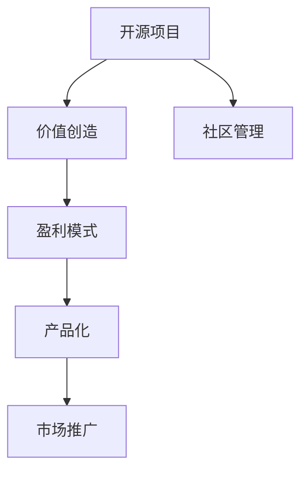

                 

# 从代码到现金：开源项目商业化策略

> 关键词：开源项目,商业化策略,盈利模式,产品化,市场推广,营销技巧

## 1. 背景介绍

### 1.1 问题由来
开源项目，特别是软件和平台类项目，已经成为推动科技创新的重要力量。其开源本质和共享精神使得技术快速迭代、社区贡献、知识传播，在短短几年内就发展成为不可忽视的市场力量。然而，开源项目的商业模式，相比于商业闭源项目，仍处于探索阶段。如何有效利用开源项目的优势，将其商业化，成为了越来越多开发者和企业家关注的问题。

### 1.2 问题核心关键点
开源项目商业化，关键在于理解开源项目的本质，即其强调的共享、透明和协作精神，以及如何将其商业价值最大化。核心关键点在于：
- **价值创造**：识别和创造可商业化的价值，如API、插件、第三方应用、云服务等。
- **市场定位**：明确项目的目标用户和市场定位，如企业级市场、消费级市场等。
- **商业模式设计**：选择合适的商业模式，如订阅制、按需付费、广告收入等。
- **社区管理**：平衡商业化和社区贡献，确保社区的健康发展。
- **产品化**：将开源项目转化为具有市场竞争力的产品。

### 1.3 问题研究意义
开源项目的商业化，对于提升技术创新和应用，加速技术商业化，以及推动企业创新都具有重要意义：
- **创新加速**：开源社区的协同创新，可以快速迭代产品功能，提升技术成熟度。
- **成本降低**：开源技术共享降低了企业研发成本，加速市场进入。
- **市场竞争力**：开源项目可以积累大量的用户和市场资源，提升品牌价值。

## 2. 核心概念与联系

### 2.1 核心概念概述

为更好地理解开源项目商业化策略，本节将介绍几个密切相关的核心概念：

- **开源项目**：指利用开源许可证（如GPL、Apache、MIT等）授权的、源代码公开的软件或平台项目。其核心在于共享、透明和协作。
- **商业化策略**：指将开源项目中的价值转化为商业价值的过程，包括选择合适的盈利模式、市场推广等。
- **盈利模式**：指开源项目可以采用的商业模式，如订阅制、按需付费、广告收入等。
- **产品化**：指将开源项目转化为具有市场竞争力的产品，通过市场推广获取用户和市场认可。
- **市场推广**：指利用营销技巧，如社交媒体营销、内容营销、SEO等，提升开源项目的知名度和影响力。

这些核心概念之间的逻辑关系可以通过以下Mermaid流程图来展示：



这个流程图展示开源项目商业化策略的核心流程：

1. 开源项目通过共享和协作创造价值。
2. 识别并创造可商业化的价值，选择合适的盈利模式。
3. 将开源项目转化为具有市场竞争力的产品。
4. 通过市场推广获取用户和市场认可。
5. 同时，社区管理平衡商业化和社区贡献。

## 3. 核心算法原理 & 具体操作步骤
### 3.1 算法原理概述

开源项目的商业化策略，本质上是一种价值链管理过程，即识别和创造项目价值，将其转化为商业价值，并通过市场推广获取用户和收入的过程。其核心算法原理可以简单归纳为以下几个步骤：

1. **价值创造**：通过技术创新和社区贡献，识别和创造可商业化的价值。
2. **价值定价**：根据价值特性和市场定位，选择合适的定价策略。
3. **渠道拓展**：通过销售渠道和市场推广，将产品和服务推向用户。
4. **用户获取**：通过多种营销技巧，获取用户和市场份额。
5. **用户留存**：通过提供持续的价值和优质的客户服务，提升用户忠诚度和生命周期价值。

### 3.2 算法步骤详解

开源项目的商业化策略，通常可以按以下步骤详细操作：

**Step 1: 识别和创造价值**
- 分析开源项目的关键特性，识别出可商业化的价值点。
- 通过社区贡献和技术创新，不断提升项目价值。

**Step 2: 选择盈利模式**
- 根据项目特性和市场需求，选择合适的盈利模式。
- 常见的盈利模式包括：
  - 开源社区支持（Donation）
  - 企业订阅（Subscription）
  - 按需付费（Pay-Per-Use）
  - 广告收入（Ad Revenue）
  - 第三方应用和插件（Marketplace）

**Step 3: 产品化**
- 选择合适的技术栈和开发工具，将开源项目转化为产品。
- 设计和实现产品功能，满足市场需求。
- 对产品进行优化和测试，确保产品质量和性能。

**Step 4: 市场推广**
- 利用多种营销技巧，如SEO、社交媒体营销、内容营销等，提升产品知名度。
- 通过参加行业展会、技术论坛等，扩大产品影响力。
- 建立线上线下渠道，便于用户获取和购买产品。

**Step 5: 用户获取和留存**
- 通过用户反馈和市场调查，优化产品功能和用户体验。
- 建立用户社区，提供用户支持和互动平台。
- 定期推出新功能和优惠活动，提升用户粘性。

### 3.3 算法优缺点

开源项目商业化策略的优势在于：
1. **快速迭代**：社区贡献和开源特性使得技术迭代快速。
2. **成本低廉**：开源项目初期开发成本较低。
3. **市场认可**：开源项目往往积累大量用户和社区支持。

其缺点在于：
1. **商业风险**：开源项目的商业模式可能不如闭源项目稳定。
2. **社区管理**：平衡商业化和社区贡献可能面临挑战。
3. **法律风险**：开源许可证和商业化策略需要谨慎处理。

### 3.4 算法应用领域

开源项目的商业化策略，在软件、平台、服务等多个领域都有广泛应用，例如：

- **云服务平台**：如OpenStack、Kubernetes等，通过提供基础设施即服务（IaaS）和平台即服务（PaaS），实现盈利。
- **开源软件**：如Linux Kernel、MySQL等，通过企业订阅和开源社区支持实现收入。
- **协作工具**：如JIRA、Confluence等，通过提供第三方应用市场和订阅服务获取收入。
- **开发框架**：如Django、React等，通过提供社区支持和按需付费模式获取收入。

这些领域中的开源项目，通过不同的商业模式和市场策略，实现了商业化转型，成为市场中的重要玩家。

## 4. 数学模型和公式 & 详细讲解  
### 4.1 数学模型构建

本节将使用数学语言对开源项目商业化策略进行更加严格的刻画。

设开源项目价值为 $V$，市场需求为 $D$，用户获取成本为 $C$，用户生命周期价值为 $L$。则商业化过程可表示为以下优化问题：

$$
\mathop{\arg\min}_{C, V} \left( \frac{C}{D} + \frac{V}{L} \right)
$$

其中 $\frac{C}{D}$ 表示每获取一个用户所需成本，$\frac{V}{L}$ 表示每用户产生的价值。优化目标最小化综合成本，即在满足用户需求的基础上，最大化用户生命周期价值。

### 4.2 公式推导过程

以下我们以开源社区支持（Donation）模式为例，推导捐赠收入的数学模型。

设社区用户数量为 $N$，每个用户平均捐赠金额为 $P$，则社区收入 $I$ 为：

$$
I = NP
$$

若社区用户数为 $N$，则获取这些用户所需的成本 $C$ 可以表示为：

$$
C = \frac{N}{k}
$$

其中 $k$ 表示获取一个用户的平均成本。

根据价值最大化原则，最优的捐赠收入模型应满足：

$$
\frac{I}{C} = \frac{NP}{\frac{N}{k}} = kP = V
$$

即最优的社区收入 $I$ 与用户获取成本 $C$ 的比值等于用户生命周期价值 $V$。

### 4.3 案例分析与讲解

一个成功的开源项目，如GitLab，其商业化策略值得分析。GitLab通过提供企业订阅、云服务、开源社区支持三种商业模式，实现了多渠道盈利。以下是其主要步骤：

**Step 1: 价值创造**
GitLab通过持续的技术创新和社区贡献，实现了软件功能的快速迭代，提供了强大的代码管理和开发工具。

**Step 2: 选择盈利模式**
GitLab选择企业订阅模式为主，提供企业级功能如CI/CD、DevOps、安全扫描等，通过高端功能的订阅获取高价值用户。

**Step 3: 产品化**
GitLab基于开源代码，开发了自有的企业级平台，支持多个语言和框架，并提供易用的用户界面。

**Step 4: 市场推广**
GitLab通过SEO优化、社交媒体营销、内容营销等方式提升品牌知名度。同时参加行业展会和技术论坛，推广开源项目和企业级产品。

**Step 5: 用户获取和留存**
GitLab通过用户社区、文档和教程、技术支持等方式，不断提升用户体验和粘性。定期推出新功能和改进，增强用户满意度和忠诚度。

## 5. 项目实践：代码实例和详细解释说明
### 5.1 开发环境搭建

在进行开源项目商业化策略开发前，我们需要准备好开发环境。以下是使用Python进行Flask开发的Web应用环境配置流程：

1. 安装Anaconda：从官网下载并安装Anaconda，用于创建独立的Python环境。

2. 创建并激活虚拟环境：
```bash
conda create -n flask-env python=3.8 
conda activate flask-env
```

3. 安装Flask：从官网下载并安装Flask：
```bash
pip install flask
```

4. 安装Flask-RESTful：
```bash
pip install flask-restful
```

5. 安装Flask-SQLAlchemy：
```bash
pip install flask-sqlalchemy
```

6. 安装Flask-WTF：
```bash
pip install flask-wtf
```

完成上述步骤后，即可在`flask-env`环境中开始开发。

### 5.2 源代码详细实现

下面是一个简单的开源项目商业化策略Web应用的代码实现：

```python
from flask import Flask, render_template, request, redirect, url_for
from flask_restful import Resource, Api
from flask_sqlalchemy import SQLAlchemy
from flask_wtf import FlaskForm
from wtforms import StringField, SubmitField
from wtforms.validators import DataRequired

app = Flask(__name__)
app.config['SQLALCHEMY_DATABASE_URI'] = 'sqlite:///project.db'
app.config['SECRET_KEY'] = 'mysecretkey'

db = SQLAlchemy(app)
api = Api(app)

class User(db.Model):
    id = db.Column(db.Integer, primary_key=True)
    name = db.Column(db.String(80), nullable=False)
    email = db.Column(db.String(120), unique=True, nullable=False)
    subscription = db.Column(db.Boolean, default=False)

class UserForm(FlaskForm):
    name = StringField('Name', validators=[DataRequired()])
    email = StringField('Email', validators=[DataRequired()])
    submit = SubmitField('Submit')

@app.route('/')
def index():
    return render_template('index.html')

@app.route('/subscribe', methods=['GET', 'POST'])
def subscribe():
    form = UserForm(request.form)
    if form.validate_on_submit():
        user = User(name=form.name.data, email=form.email.data, subscription=True)
        db.session.add(user)
        db.session.commit()
        return redirect(url_for('index'))
    return render_template('subscribe.html', form=form)

if __name__ == '__main__':
    app.run(debug=True)
```

### 5.3 代码解读与分析

让我们再详细解读一下关键代码的实现细节：

**User模型**：
- 定义了用户的基本信息，包括姓名、邮箱和订阅状态。
- 通过SQLAlchemy框架与数据库交互，实现数据的增删改查。

**UserForm表单**：
- 使用Flask-WTF库，创建表单组件。
- 表单包含姓名、邮箱两个必填字段，以及一个提交按钮。
- 使用WTForms验证器，确保表单数据的正确性。

**index视图函数**：
- 渲染首页模板，提供用户订阅入口。
- 在网页中嵌入表单，让用户填写信息。

**subscribe视图函数**：
- 处理表单提交请求，创建新用户。
- 若表单验证通过，将新用户信息保存到数据库中，并跳转到首页。
- 若表单验证失败，重新渲染表单页面。

**Flask框架**：
- 使用Flask框架，提供Web应用的路由和视图功能。
- 利用Flask-SQLAlchemy与SQLite数据库交互，实现数据持久化。
- 使用Flask-WTF创建表单，提供用户交互界面。

这个简单的Web应用示例展示了如何通过Flask框架实现一个开源项目的商业化策略。通过设置用户订阅功能，用户可以通过提交表单，成为付费订阅用户，从而实现开源项目的商业化收入。

## 6. 实际应用场景
### 6.1 软件开发平台

开源软件开发平台，如GitLab、GitHub，通过提供代码管理和协作工具，积累大量开发者用户。这些平台通过企业订阅、云服务、开源社区支持三种商业模式，实现了多元化的盈利。

在技术实现上，可以设计一个企业订阅功能，允许企业通过购买高级权限，享受更多的开发功能和管理工具。同时，通过云服务提供云端开发环境，满足企业对高可靠、高扩展性的需求。

### 6.2 数据库管理系统

开源数据库管理系统，如PostgreSQL、MySQL，通过提供免费和开源版本，吸引大量企业和开发者用户。这些数据库管理系统通过企业订阅、云服务、开源社区支持三种商业模式，实现了多元化的盈利。

在技术实现上，可以设计一个企业订阅功能，允许企业通过购买高级权限，享受更多的高级功能和优化建议。同时，通过云服务提供数据库托管和备份服务，满足企业对高可靠、高扩展性的需求。

### 6.3 协作工具

开源协作工具，如JIRA、Confluence，通过提供强大的项目管理和文档协作功能，吸引大量企业和开发者用户。这些协作工具通过企业订阅、云服务、开源社区支持三种商业模式，实现了多元化的盈利。

在技术实现上，可以设计一个企业订阅功能，允许企业通过购买高级权限，享受更多的高级功能和优化建议。同时，通过云服务提供协作平台的托管和备份服务，满足企业对高可靠、高扩展性的需求。

### 6.4 未来应用展望

随着开源项目的不断发展，其商业化策略也将不断演进。未来可能出现更多新的商业化方向：

1. **跨领域应用**：开源项目不仅局限于技术领域，还可能拓展到教育、医疗、金融等多个领域，提供定制化的解决方案。

2. **生态系统建设**：通过开源项目，构建起完整的生态系统，如组件、工具、服务等，形成更强大的用户群体和市场影响力。

3. **智能应用**：利用人工智能和机器学习技术，提升开源项目的智能化水平，实现更精准的用户服务和更高效的产品运营。

4. **多平台集成**：将开源项目整合到更多平台和设备上，提供多设备、多场景的解决方案。

5. **开源和商业并存**：在开源项目中引入商业化模块，形成开源和商业并存的生态，满足不同用户需求。

## 7. 工具和资源推荐
### 7.1 学习资源推荐

为了帮助开发者系统掌握开源项目商业化策略的理论基础和实践技巧，这里推荐一些优质的学习资源：

1. **《开源项目的商业化之路》系列博文**：由开源项目专家撰写，深入浅出地介绍了开源项目如何识别和创造可商业化的价值，选择合适的盈利模式，实现商业化转型。

2. **《Flask Web开发实战》书籍**：Flask官方文档，详细介绍了Flask框架的使用和实战案例，适合Flask开发的学习和实践。

3. **《开源社区管理与运营》书籍**：介绍开源社区的构建、管理和运营，如何平衡商业化和社区贡献。

4. **《开源项目盈利模式》白皮书**：详细分析了开源项目可采用的多种盈利模式及其优缺点，提供了详细的案例分析。

5. **GitHub Learning Lab**：GitHub提供的免费在线课程，介绍如何使用GitHub进行开源项目的管理和维护，提升开发技能。

通过这些资源的学习实践，相信你一定能够快速掌握开源项目商业化的精髓，并用于解决实际的商业问题。

### 7.2 开发工具推荐

高效的开发离不开优秀的工具支持。以下是几款用于开源项目商业化开发的常用工具：

1. **GitHub**：GitHub提供强大的版本控制、协作和社区功能，适合开源项目的管理和维护。

2. **JIRA**：JIRA提供强大的项目管理功能，支持任务跟踪、问题管理和工作流程自动化，适合企业级应用。

3. **Confluence**：Confluence提供强大的文档协作和知识管理功能，适合团队协作和知识沉淀。

4. **Flask**：Flask提供灵活的Web开发框架，支持快速迭代和原型开发。

5. **PostgreSQL**：PostgreSQL提供强大的关系型数据库功能，支持复杂查询和事务处理。

6. **MySQL**：MySQL提供易用的关系型数据库功能，支持高可靠和高扩展性。

合理利用这些工具，可以显著提升开源项目商业化的开发效率，加快创新迭代的步伐。

### 7.3 相关论文推荐

开源项目商业化技术的发展源于学界的持续研究。以下是几篇奠基性的相关论文，推荐阅读：

1. **《开源项目的商业化之路》**：详细介绍了开源项目如何识别和创造可商业化的价值，选择合适的盈利模式，实现商业化转型。

2. **《开源社区的治理与运营》**：分析了开源社区的构建、管理和运营，如何平衡商业化和社区贡献。

3. **《开源项目盈利模式》**：详细分析了开源项目可采用的多种盈利模式及其优缺点，提供了详细的案例分析。

这些论文代表了大语言模型微调技术的发展脉络。通过学习这些前沿成果，可以帮助研究者把握学科前进方向，激发更多的创新灵感。

## 8. 总结：未来发展趋势与挑战
### 8.1 总结

本文对开源项目商业化策略进行了全面系统的介绍。首先阐述了开源项目的本质，即其强调的共享、透明和协作精神，明确了商业化在提升技术创新和应用、加速技术商业化方面的独特价值。其次，从原理到实践，详细讲解了开源项目商业化策略的数学模型和关键步骤，给出了开源项目商业化策略的完整代码实例。同时，本文还广泛探讨了开源项目在软件开发平台、数据库管理系统、协作工具等多个行业领域的应用前景，展示了开源项目商业化策略的巨大潜力。

通过本文的系统梳理，可以看到，开源项目的商业化策略在提升技术创新和应用、加速技术商业化方面具有重要意义。开源项目的商业化，对于技术创新、市场竞争、企业转型都具有重要价值。未来，伴随开源项目和商业化策略的不断演进，相信开源项目将在更广阔的应用领域绽放异彩，深刻影响人类的生产生活方式。

### 8.2 未来发展趋势

展望未来，开源项目的商业化策略将呈现以下几个发展趋势：

1. **跨领域应用**：开源项目不仅局限于技术领域，还可能拓展到教育、医疗、金融等多个领域，提供定制化的解决方案。

2. **生态系统建设**：通过开源项目，构建起完整的生态系统，如组件、工具、服务等，形成更强大的用户群体和市场影响力。

3. **智能应用**：利用人工智能和机器学习技术，提升开源项目的智能化水平，实现更精准的用户服务和更高效的产品运营。

4. **多平台集成**：将开源项目整合到更多平台和设备上，提供多设备、多场景的解决方案。

5. **开源和商业并存**：在开源项目中引入商业化模块，形成开源和商业并存的生态，满足不同用户需求。

以上趋势凸显了开源项目商业化策略的广阔前景。这些方向的探索发展，必将进一步提升开源项目的商业价值和技术应用范围，为构建智能化的未来社会铺平道路。

### 8.3 面临的挑战

尽管开源项目的商业化策略已经取得了显著进展，但在迈向更加智能化、普适化应用的过程中，它仍面临诸多挑战：

1. **社区管理**：平衡商业化和社区贡献，确保社区的健康发展，需要更多努力。

2. **法律风险**：开源许可证和商业化策略需要谨慎处理，避免法律纠纷。

3. **用户获取**：获取新用户和提高用户粘性，需要更多营销和产品优化。

4. **技术支持**：提供持续的技术支持和客户服务，提升用户满意度和忠诚度，需要更多资源和投入。

5. **市场竞争**：开源项目面临来自闭源项目的竞争，需要更多创新和差异化策略。

6. **技术迭代**：开源项目需要不断迭代和技术更新，以保持市场竞争力。

这些挑战需要开源项目开发者和社区成员共同努力，通过技术创新、市场推广和社区管理，不断提升开源项目的商业价值和技术应用范围。

### 8.4 研究展望

面向未来，开源项目的商业化策略还需要从以下几个方向进行深入研究：

1. **社区驱动的商业化**：如何通过社区贡献和协同创新，提升开源项目的商业价值。

2. **多渠道盈利模式**：探索更多元化的盈利模式，满足不同用户的需求。

3. **智能化开源项目**：利用人工智能和机器学习技术，提升开源项目的智能化水平，实现更精准的用户服务和更高效的产品运营。

4. **跨领域开源项目**：拓展开源项目的应用领域，提供跨领域的解决方案。

5. **开源和商业并存**：在开源项目中引入商业化模块，形成开源和商业并存的生态，满足不同用户需求。

这些方向的研究和实践，必将引领开源项目商业化策略迈向更高的台阶，为构建智能化的未来社会提供更多创新和应用支持。总之，开源项目商业化策略需要在技术创新、市场推广和社区管理等各个环节进行全面优化，方能真正实现开源项目的商业价值和技术应用范围。

## 9. 附录：常见问题与解答
----------------------------------------------------------------

**Q1: 开源项目如何平衡商业化和社区贡献？**

A: 开源项目需要平衡商业化和社区贡献，可以采取以下策略：
1. 设立社区理事会，定期召开社区会议，听取社区成员的意见和建议。
2. 设立社区贡献计划，提供奖励和激励措施，鼓励社区成员积极贡献代码和资源。
3. 引入开源和商业并存的生态，形成互补和协同效应。

**Q2: 开源项目如何选择盈利模式？**

A: 开源项目可以选择以下盈利模式：
1. 开源社区支持（Donation）：用户自愿捐赠支持开源项目。
2. 企业订阅（Subscription）：企业通过购买高级权限，享受更多的开发功能和管理工具。
3. 按需付费（Pay-Per-Use）：用户按使用量付费，如API调用、云服务使用等。
4. 广告收入（Ad Revenue）：在开源平台上提供广告服务，获得广告收入。
5. 第三方应用和插件（Marketplace）：提供第三方应用和插件，满足更多用户需求。

**Q3: 开源项目如何进行用户获取和留存？**

A: 开源项目可以通过以下方式进行用户获取和留存：
1. 建立用户社区，提供用户支持和互动平台，提升用户体验和粘性。
2. 定期推出新功能和优惠活动，增强用户满意度和忠诚度。
3. 利用社交媒体营销、内容营销、SEO等营销技巧，提升产品知名度。

**Q4: 开源项目如何进行市场推广？**

A: 开源项目可以通过以下方式进行市场推广：
1. 利用SEO优化，提升产品搜索引擎排名，吸引更多用户。
2. 参加行业展会和技术论坛，推广开源项目和企业级产品。
3. 利用社交媒体营销、内容营销等方式提升产品知名度和影响力。

**Q5: 开源项目如何进行社区管理？**

A: 开源项目可以通过以下方式进行社区管理：
1. 设立社区理事会，定期召开社区会议，听取社区成员的意见和建议。
2. 设立社区贡献计划，提供奖励和激励措施，鼓励社区成员积极贡献代码和资源。
3. 引入开源和商业并存的生态，形成互补和协同效应。

这些建议和策略，可以帮助开源项目开发者在商业化和社区贡献之间找到平衡，提升开源项目的商业价值和技术应用范围。

