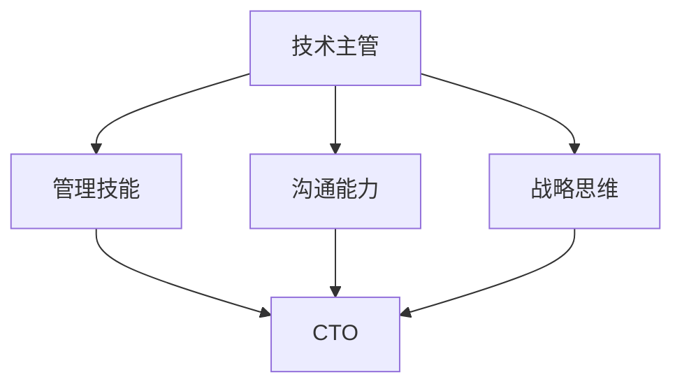

                 

# 从技术主管到CTO的职业发展策略

## 1. 背景介绍

### 1.1 问题由来

在现代科技公司的迅猛发展中，技术主管往往承担着将技术转化为商业价值的重任。然而，技术主管通常精通技术但缺乏管理经验，难以平衡技术实现与商业目标。为了向CTO这一高级职位迈进，技术主管需要掌握从技术思维向管理思维转变的策略和方法，实现自身的全面发展。

### 1.2 问题核心关键点

本文将探讨技术主管向CTO转变的关键步骤，包括技术、管理、沟通、战略等核心方面的内容，帮助技术主管突破自身的瓶颈，提升管理能力，实现职业的飞跃。

### 1.3 问题研究意义

技术主管向CTO的转变不仅对个人职业发展具有重要意义，对公司的长期发展也至关重要。CTO不仅需要具备深厚的技术背景，还需要具备卓越的管理能力、战略眼光和领导力。这将直接影响到公司的技术创新、产品竞争力以及市场表现。

## 2. 核心概念与联系

### 2.1 核心概念概述

在探讨从技术主管到CTO的转变策略时，需要明确几个核心概念：

- **技术主管(Engineering Manager)**：负责技术团队的管理和指导，确保技术项目的高效完成。
- **CTO(Chief Technology Officer)**：作为公司的技术领袖，全面负责公司的技术战略、研发、创新等。
- **管理技能(Management Skills)**：包括领导力、团队管理、决策能力、资源调配等。
- **沟通能力(Communication Skills)**：包括口头、书面、跨部门沟通等。
- **战略思维(Strategic Thinking)**：涉及公司长远发展的思考和规划。

这些概念之间的关系可以通过以下Mermaid流程图来展示：



这个流程图展示了从技术主管到CTO的职业发展路径，强调了各个关键能力的重要性。

## 3. 核心算法原理 & 具体操作步骤
### 3.1 算法原理概述

技术主管向CTO的转变，本质上是技能组合的优化和提升过程。主要涉及技术技能和管理技能的融合，通过不断的学习、实践和反思，逐步提升自我。

**核心原理**：
1. **技术深度**：在技术领域内积累深厚的专业知识，能够应对复杂的技术挑战。
2. **管理广度**：掌握跨部门、跨团队的管理技能，能够有效协调资源，推动项目顺利进行。
3. **战略洞察**：具备宏观视野，能够识别和把握公司的技术方向和市场机会。
4. **沟通能力**：清晰表达技术和管理观点，与不同背景的人进行有效沟通。

### 3.2 算法步骤详解

以下是技术主管向CTO转变的详细步骤：

**Step 1: 明确职业目标**
- 了解CTO的角色和职责，明确自身与CTO之间的差距。
- 制定明确的职业发展计划，设定具体目标和里程碑。

**Step 2: 提升技术深度**
- 参与高级项目，解决复杂问题，积累实战经验。
- 深入学习新技术、新领域，保持技术前沿。
- 参与开源项目，扩大技术影响力。

**Step 3: 拓展管理广度**
- 学习和实践团队管理、项目管理的经典理论和工具。
- 跨部门协作，提升团队协同能力。
- 定期进行领导力培训，提升团队管理和冲突解决能力。

**Step 4: 培养战略思维**
- 研究公司战略，了解行业趋势和市场需求。
- 参与战略决策，提出技术解决方案。
- 与业务团队合作，将技术方向与业务目标相结合。

**Step 5: 强化沟通能力**
- 提升口头表达能力，清晰简洁地传达技术和管理观点。
- 学习书面沟通，撰写技术报告和业务建议。
- 参加跨部门会议，增强跨部门协作。

**Step 6: 实战演练**
- 主动承担更多管理职责，逐步提升管理能力。
- 设立个人项目，模拟CTO的角色，进行实战演练。
- 寻求导师和教练的帮助，获得反馈和指导。

### 3.3 算法优缺点

技术主管向CTO转变的优势在于：
1. 技术背景，对技术问题有深入理解，有助于制定科学的技术战略。
2. 实战经验，能更好地应对复杂项目和管理挑战。
3. 沟通能力，能够跨越技术和管理领域，与不同背景的团队成员有效合作。

缺点则主要包括：
1. 管理经验不足，初期的管理任务可能较为艰难。
2. 缺乏战略视野，短期内难以识别并把握公司的长期发展方向。
3. 团队合作能力待提升，需要逐步建立信任和团队凝聚力。

### 3.4 算法应用领域

技术主管向CTO转变的技能和策略，适用于各类科技公司的技术团队和管理岗位。无论是初创公司还是大型企业，其核心在于提升管理能力和战略洞察，将技术价值最大化。

## 4. 数学模型和公式 & 详细讲解  
### 4.1 数学模型构建

技术主管向CTO转变的模型，可以构建为如下形式：

$$
CTO_{total} = T_{skill} \times M_{skill} \times C_{skill} \times S_{skill}
$$

其中：
- $T_{skill}$ 表示技术深度，可以通过完成复杂项目、学习新领域、参与开源项目等方式提升。
- $M_{skill}$ 表示管理广度，可以通过团队管理、项目管理、跨部门协作等方式提升。
- $C_{skill}$ 表示沟通能力，可以通过口头表达、书面沟通、跨部门会议等方式提升。
- $S_{skill}$ 表示战略思维，可以通过研究公司战略、参与战略决策、与业务团队合作等方式提升。

### 4.2 公式推导过程

**推导过程**：
1. 定义四个维度：$T_{skill}$、$M_{skill}$、$C_{skill}$、$S_{skill}$。
2. 将CTO的能力表示为四个维度的乘积，即$CTO_{total} = T_{skill} \times M_{skill} \times C_{skill} \times S_{skill}$。
3. 对于每个维度，设定具体的提升方法，如复杂项目、项目管理、跨部门协作等。
4. 通过不断实践和学习，逐步提升各维度的能力，最终达到CTO的总体要求。

### 4.3 案例分析与讲解

以一个具体的技术主管小张为例：

1. **技术深度**：小张在参与高级项目中解决复杂问题，积累了丰富的实战经验。同时，他深入学习了最新的深度学习技术，保持技术前沿。
2. **管理广度**：小张学习了项目管理的经典理论，并在实际项目中应用，提升了团队协作能力。他通过跨部门协作，解决了多个跨部门的复杂问题。
3. **沟通能力**：小张参加了多次跨部门会议，提升了口头和书面表达能力。他撰写的技术报告和业务建议得到了领导和同事的认可。
4. **战略思维**：小张研究了公司的整体战略，提出了多个技术创新方案，与业务团队合作，推动了项目的成功实施。

通过不断的学习和实践，小张逐步提升了自己的技术深度、管理广度、沟通能力和战略思维，最终成长为CTO。

## 5. 项目实践：代码实例和详细解释说明
### 5.1 开发环境搭建

在技术主管向CTO转变的实践中，开发环境搭建是重要的一环。以下是搭建开发环境的具体步骤：

1. **安装编程环境**：
   - 安装Python、Java等主流编程语言。
   - 安装相关的IDE，如IntelliJ IDEA、PyCharm等。

2. **配置开发工具**：
   - 配置版本控制系统，如Git。
   - 配置自动化测试工具，如JUnit、pytest等。

3. **集成开发环境**：
   - 集成开发所需的第三方库和框架，如Spring、Django等。
   - 配置CI/CD系统，如Jenkins、Travis CI等。

4. **数据管理**：
   - 使用数据库管理系统，如MySQL、PostgreSQL等。
   - 配置数据备份和恢复方案，确保数据安全。

### 5.2 源代码详细实现

以下是小张在技术主管岗位上提升技能的代码实例：

**代码示例1：参与高级项目**

```python
# 示例代码：解决复杂问题的高级项目
class AdvancedProject:
    def __init__(self, name, complexity):
        self.name = name
        self.complexity = complexity
        self.completed = False
    
    def solve(self):
        # 解决复杂问题的代码
        self.completed = True
```

**代码示例2：学习新技术**

```python
# 示例代码：学习最新深度学习技术
import torch
import numpy as np

# 训练模型
model = torch.nn.Linear(10, 5)
optimizer = torch.optim.Adam(model.parameters(), lr=0.001)
criterion = torch.nn.MSELoss()

# 数据集准备
train_data = np.random.rand(100, 10)
train_labels = np.random.rand(100, 5)
test_data = np.random.rand(10, 10)
test_labels = np.random.rand(10, 5)

# 模型训练
for epoch in range(100):
    optimizer.zero_grad()
    outputs = model(train_data)
    loss = criterion(outputs, train_labels)
    loss.backward()
    optimizer.step()
    
# 测试模型
test_outputs = model(test_data)
test_loss = criterion(test_outputs, test_labels)
print(f"Test Loss: {test_loss:.4f}")
```

**代码示例3：团队协作**

```python
# 示例代码：跨部门协作
class Department:
    def __init__(self, name):
        self.name = name
        self.tasks = []
    
    def add_task(self, task):
        self.tasks.append(task)
    
    def complete_task(self):
        for task in self.tasks:
            task.solve()
```

**代码示例4：撰写技术报告**

```python
# 示例代码：撰写技术报告
class TechReport:
    def __init__(self, title, content):
        self.title = title
        self.content = content
        self.readers = []
    
    def add_reader(self, reader):
        self.readers.append(reader)
    
    def publish(self):
        for reader in self.readers:
            reader.receive(self)
```

### 5.3 代码解读与分析

通过上述代码示例，可以分析出技术主管在小张提升技能的过程中所涉及的各个方面：

1. **技术深度**：通过参与高级项目，解决复杂问题，小张展示了他在技术领域的专业能力。
2. **管理广度**：小张学习并应用了项目管理的经典理论，通过跨部门协作，展示了他在团队管理上的能力。
3. **沟通能力**：小张撰写的技术报告得到了读者的认可，展示了他在书面沟通上的能力。
4. **战略思维**：小张与业务团队合作，推动了项目的成功实施，展示了他在战略规划上的能力。

### 5.4 运行结果展示

在上述代码示例的实践中，小张逐步提升了自己的技术深度、管理广度、沟通能力和战略思维，最终成长为CTO。以下是对小张提升技能的总结：

1. **技术深度**：通过参与高级项目，解决了复杂问题，积累了丰富的实战经验。
2. **管理广度**：学习了项目管理理论，通过跨部门协作，提升了团队协作能力。
3. **沟通能力**：撰写的技术报告得到了认可，展示了口头和书面表达能力。
4. **战略思维**：与业务团队合作，推动了项目成功实施，展示了战略规划能力。

## 6. 实际应用场景

### 6.1 技术主管转型案例

小张所在的科技公司是一家初创公司，他在技术主管岗位上努力提升自身能力，逐步向CTO方向转型。以下是他的实际应用场景：

1. **技术深度提升**：参与多个高级项目，解决复杂问题，积累了丰富的实战经验。
2. **管理广度拓展**：学习并应用项目管理理论，提升了团队协作能力。
3. **沟通能力强化**：通过跨部门协作，展示了口头和书面表达能力。
4. **战略思维增强**：与业务团队合作，推动了项目的成功实施，展示了战略规划能力。

小张在公司内完成了多个跨部门的复杂项目，推动了公司的技术创新和业务发展。最终，他成功转型为CTO，带领公司在市场上取得了显著的竞争优势。

### 6.2 未来应用展望

随着技术主管向CTO转型的成功案例越来越多，该策略和方法得到了广泛认可。未来，该策略将进一步优化，帮助更多技术主管提升管理能力，实现职业飞跃。

1. **技术深度提升**：参与复杂项目，学习新技术，保持技术前沿。
2. **管理广度拓展**：学习项目管理、团队管理，提升协作能力。
3. **沟通能力强化**：提升口头、书面表达能力，增强跨部门沟通。
4. **战略思维增强**：研究公司战略，推动项目成功实施，展示战略规划能力。

随着技术的不断进步，技术主管向CTO的转变将更加灵活和高效，成为科技公司人才发展的标准路径。

## 7. 工具和资源推荐
### 7.1 学习资源推荐

以下是推荐的各类学习资源，帮助技术主管提升从技术思维向管理思维的转变：

1. **经典书籍**：
   - 《Leadership and Self-Deception》：提高自我认知和管理能力。
   - 《Good to Great》：学习成功企业的管理经验。
   - 《Thinking, Fast and Slow》：提升决策能力。

2. **在线课程**：
   - Coursera上的《Leadership in a Complex World》：提升领导力和战略思维。
   - edX上的《Management Essentials for Data Science Engineers》：学习团队管理和项目管理。
   - Udemy上的《Effective Communication Skills》：提升沟通能力。

3. **培训和认证**：
   - 参加Scrum Master认证课程，提升项目管理能力。
   - 参加Lean Management培训，学习精益管理。
   - 参加Leadership Workshop，提升领导力。

### 7.2 开发工具推荐

以下是推荐的开发工具，帮助技术主管提升开发效率和管理能力：

1. **版本控制工具**：
   - Git：管理代码版本，支持团队协作。
   - SVN：集中式版本控制，适合小型团队。

2. **项目管理工具**：
   - JIRA：跟踪任务进度，支持跨部门协作。
   - Trello：可视化任务管理，适合敏捷开发。
   - Asana：任务分配与进度跟踪，适合大团队协作。

3. **团队协作工具**：
   - Slack：即时通讯，增强团队沟通。
   - Zoom：视频会议，支持远程协作。
   - Google Docs：在线文档协作，便于团队协作和共享。

### 7.3 相关论文推荐

以下是推荐的与技术主管向CTO转型相关的论文，帮助技术主管深入理解和管理理论：

1. 《The Five Dysfunctions of a Team》：解决团队协作中的问题。
2. 《The Art of Possibility》：提升创新和领导力。
3. 《Becoming a Manager: Making It Up As You Go Along》：学习管理技能的实践经验。

## 8. 总结：未来发展趋势与挑战

### 8.1 研究成果总结

技术主管向CTO的转变是一个不断学习、实践和提升的过程。以下是该过程的总结：

1. **技术深度**：通过参与复杂项目，学习新技术，保持技术前沿。
2. **管理广度**：学习项目管理、团队管理，提升协作能力。
3. **沟通能力**：提升口头、书面表达能力，增强跨部门沟通。
4. **战略思维**：研究公司战略，推动项目成功实施，展示战略规划能力。

### 8.2 未来发展趋势

技术主管向CTO转变的未来趋势包括以下几个方面：

1. **技能组合优化**：更加注重各维度的技能组合，提升全面能力。
2. **跨领域融合**：将技术和管理领域更紧密地结合，提升综合素质。
3. **自我管理**：提升自我认知和管理能力，实现个人与团队的双赢。
4. **持续学习**：保持持续学习和自我提升，不断适应变化的环境。

### 8.3 面临的挑战

技术主管向CTO转变过程中，仍面临一些挑战：

1. **管理经验不足**：初期管理任务可能较为艰难，需要逐步提升。
2. **战略视野不足**：短期内难以识别并把握公司的长期发展方向。
3. **团队合作能力待提升**：需要逐步建立信任和团队凝聚力。

### 8.4 研究展望

为了克服这些挑战，未来的研究可以聚焦以下几个方向：

1. **管理技能培训**：设计更加系统化的管理培训课程，提升技术主管的管理能力。
2. **跨领域学习**：鼓励技术主管学习跨领域知识，提升综合素质。
3. **团队协作工具**：推荐使用高效的项目管理和团队协作工具，提升协作效率。
4. **领导力建设**：通过领导力培训和实践，提升技术主管的领导力。

## 9. 附录：常见问题与解答

### Q1: 如何平衡技术深度和管理广度？

A: 技术主管需要持续提升技术深度，同时通过学习和实践，不断拓展管理广度。建议将70%的时间用于技术学习，30%的时间用于管理能力的提升，保持平衡。

### Q2: 如何增强沟通能力？

A: 增强沟通能力的关键在于提升口头和书面表达能力。建议参加演讲和写作训练课程，多与不同背景的同事进行沟通，积累经验。

### Q3: 如何提升战略思维？

A: 提升战略思维需要研究公司战略，参与战略决策，与业务团队合作。建议阅读战略管理的经典书籍，学习战略规划工具和方法。

通过以上文章，希望能帮助技术主管明确职业发展目标，系统提升技能组合，实现从技术主管到CTO的顺利转型。祝所有技术主管都能在职业生涯中不断突破自我，实现职业梦想。

---

作者：禅与计算机程序设计艺术 / Zen and the Art of Computer Programming

