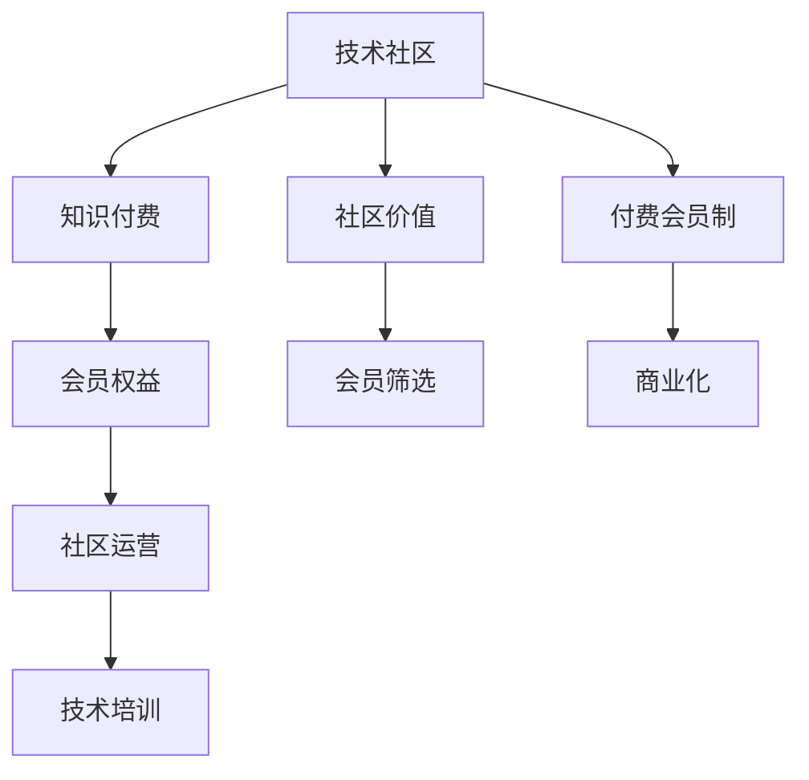

                 

# 从技术社区到付费会员制：程序员的社群运营之路

> 关键词：程序员社群,技术社区,付费会员制,知识付费,社群运营,技术培训,会员权益,社区价值

## 1. 背景介绍

### 1.1 问题由来

近年来，技术社区在互联网和技术行业内发展迅速，成为了连接开发者、技术从业者和爱好者们的桥梁。在技术交流、知识分享、资源汇聚方面，技术社区无疑起到了重要的作用。然而，技术社区也面临着诸多挑战，比如内容同质化、质量参差不齐、运营成本高、用户粘性低等问题。如何有效解决这些挑战，成为各大社区平台和运营者共同面临的难题。

在追求用户增长和活跃度的同时，社区也逐渐认识到会员制的价值。付费会员制能够筛选出真正的技术热爱者，过滤掉非活跃或低价值用户，为社区创造更大的商业价值。更重要的是，会员制能够带来更优质的内容和服务，提升社区用户的整体体验和满意度，形成良性循环。

### 1.2 问题核心关键点

实现从技术社区到付费会员制的转变，核心关键点包括：

- **用户筛选与付费机制设计**：如何设计会员筛选机制，让用户能够通过身份标识、活跃度、贡献度等方式成为付费会员？
- **内容产出与会员权益保障**：付费会员能享受哪些独特的权益？这些权益是否能吸引用户付费？
- **商业化策略与营收模式**：如何通过会员费、广告、赞助等方式实现商业化？

## 2. 核心概念与联系

### 2.1 核心概念概述

为更好地理解技术社区到付费会员制的转变，本节将介绍几个核心概念：

- **技术社区(Community)**：由技术爱好者、开发者和从业者组成的在线平台，旨在促进技术交流、知识分享和资源汇聚。
- **付费会员制(Premium Membership)**：通过收取会员费用的方式，筛选出高价值用户，提供更优质的内容和服务。
- **知识付费(Knowledge Paywall)**：基于知识的价值，用户为获取专业内容而支付的费用的模式。
- **社区运营(Community Operations)**：通过制定规则、组织活动、管理用户关系等手段，维持社区健康发展的过程。
- **技术培训(Technical Training)**：以技术技能提升为目标的培训课程或活动。
- **会员权益(Membership Benefits)**：会员专享的内容、工具、服务等。
- **社区价值(Community Value)**：社区为用户带来的技术提升、职业发展、社交网络等长期价值。

这些概念之间的逻辑关系可以通过以下Mermaid流程图来展示：



这个流程图展示了这个转变过程中各个概念之间的关系：

1. 技术社区通过知识付费获得盈利，构建付费会员制平台。
2. 会员制平台提供会员专享权益，吸引高价值用户。
3. 运营团队通过管理活动，确保社区健康发展。
4. 技术培训为社区成员提供价值，提升用户粘性。
5. 社区价值吸引用户参与，形成良性循环。
6. 商业化手段维持社区平台的持续运营。

## 3. 核心算法原理 & 具体操作步骤
### 3.1 算法原理概述

从技术社区到付费会员制的转变，主要基于以下几个算法原理：

- **用户价值评估算法**：通过分析用户在社区中的活跃度、贡献度、互动量等指标，评估用户的价值，从而筛选出付费会员。
- **内容推荐算法**：根据用户的兴趣和行为，推荐高质量的技术文章、培训视频、社区活动等，提升用户满意度。
- **会员权益计算模型**：设计合理的权益分配机制，让会员在社区中感受到真正的价值，激励其持续付费。
- **商业化策略制定**：结合用户行为分析和市场调研，制定有效的商业化策略，如会员费、广告、赞助等，实现社区平台的可持续运营。

### 3.2 算法步骤详解

基于上述原理，以下是具体的算法步骤：

**Step 1: 用户价值评估**
- 收集社区用户的相关数据，如登录时间、发表文章数、参与讨论数、积分排名等。
- 设计一套综合评估模型，根据数据计算每个用户的社区价值分数。
- 设定阈值，筛选出达到标准的用户，将其升级为付费会员。

**Step 2: 内容推荐**
- 分析用户的兴趣和行为，构建用户画像。
- 设计内容推荐算法，根据用户画像推荐相关内容。
- 实时更新推荐结果，确保内容的准确性和时效性。

**Step 3: 会员权益设计**
- 定义多种会员权益，如专属文章访问、技术培训课程、社区活动参与等。
- 计算会员权益的价值，制定合理的定价策略。
- 提供灵活的订阅选项，如月费、年费、永久会员等。

**Step 4: 商业化策略制定**
- 通过市场调研，评估会员费、广告、赞助等商业模式的可行性。
- 根据社区的规模和用户特点，制定相应的商业化计划。
- 定期评估商业模式的收益和效果，进行优化调整。

### 3.3 算法优缺点

付费会员制和技术社区的转变，具有以下优点：

- **提升用户体验**：会员能够享受到更高质量的内容和专属服务，提升用户满意度。
- **增加用户粘性**：高质量的内容和专属权益，使会员更愿意在社区中活跃，增加用户粘性。
- **促进内容创作**：会员制的付费激励，鼓励开发者和专家提供更多有价值的内容。

同时，该转变也存在一些缺点：

- **运营成本高**：开发和运营会员制平台需要较大的投入。
- **用户筛选困难**：如何设计有效的会员筛选机制，筛选出真正的技术爱好者，是一个挑战。
- **市场接受度待观察**：部分用户可能对会员制持怀疑态度，需要花费时间进行市场教育和接受度培养。

### 3.4 算法应用领域

基于会员制的技术社区，已经在多个领域得到了成功应用，例如：

- **软件开发**：Stack Overflow、GitHub等平台，通过会员制筛选高质量开发者，提供专属工具和资源。
- **数据分析**：Kaggle平台，通过会员费激励数据科学家提供优质数据集和解决方案。
- **设计开发**：Behance、Dribbble等平台，通过会员制吸引设计师分享优质作品，提供市场反馈和合作机会。
- **教育培训**：Coursera、Udacity等平台，通过会员费提供更优质的课程和证书，提升用户学习体验。

这些案例表明，会员制和技术社区的结合，能够为各个领域带来新的发展机遇，提升平台的用户价值和服务质量。

## 4. 数学模型和公式 & 详细讲解
### 4.1 数学模型构建

本节将使用数学语言对技术社区到付费会员制的转变过程进行更加严格的刻画。

假设社区有 $N$ 个用户，每个用户的社区价值分为 $U_i$，其中 $U_i = (u_1, u_2, ..., u_k)$，$k$ 为评估指标的个数。用户 $i$ 成为付费会员的概率为 $P_i$，会员权益的价值为 $V_i$。

**用户价值评估模型**：

$$
U_i = f(u_1, u_2, ..., u_k)
$$

其中 $f$ 为评估函数，根据用户行为和贡献计算社区价值分数。

**会员权益计算模型**：

$$
V_i = g(U_i, C_i, P_i)
$$

其中 $C_i$ 为用户已购买的服务和课程，$g$ 为权益价值计算函数。

**商业化策略模型**：

$$
R = \sum_{i=1}^N P_i \cdot V_i
$$

其中 $R$ 为平台总收益，$P_i$ 为用户成为会员的概率，$V_i$ 为会员权益的价值。

### 4.2 公式推导过程

以下我们以开发者社区为例，推导用户价值评估模型的具体公式。

假设社区中每个用户每天登录社区的时间为 $u_1$，每周发表文章数为 $u_2$，每月参与讨论数为 $u_3$，用户积分排名为 $u_4$。设 $f$ 为线性加权函数，则用户 $i$ 的社区价值分数为：

$$
U_i = w_1 \cdot u_1 + w_2 \cdot u_2 + w_3 \cdot u_3 + w_4 \cdot u_4
$$

其中 $w_1, w_2, w_3, w_4$ 为各指标的权重，需要通过实际数据和市场调研确定。

### 4.3 案例分析与讲解

**案例分析：Stack Overflow**

Stack Overflow 是一个著名的软件开发社区，其付费会员制成功吸引了大量高质量开发者。其用户价值评估模型基于以下指标：

- 日均登录时间
- 每周问题提交量
- 每月投票数
- 每月评论数
- 积分排名

会员权益包括：

- 访问专属问答和讨论区
- 参与社区组织的活动
- 获得专属技术支持
- 优先参与技术会议和活动

通过设定合理的会员筛选阈值和权益价值，Stack Overflow 成功筛选出了大量高质量用户，确保了社区的高质量和活跃度。

## 5. 项目实践：代码实例和详细解释说明
### 5.1 开发环境搭建

在进行技术社区到付费会员制的实践前，我们需要准备好开发环境。以下是使用Python进行Flask开发的开发环境配置流程：

1. 安装Anaconda：从官网下载并安装Anaconda，用于创建独立的Python环境。

2. 创建并激活虚拟环境：
```bash
conda create -n flask-env python=3.8 
conda activate flask-env
```

3. 安装Flask：根据CUDA版本，从官网获取对应的安装命令。例如：
```bash
conda install flask==2.0.3
```

4. 安装Flask-Security：用于用户认证和权限管理。
```bash
pip install flask-security
```

5. 安装Flask-Mail：用于邮件通知和验证。
```bash
pip install flask-mail
```

6. 安装Flask-WTF：用于表单验证和用户输入管理。
```bash
pip install flask-wtf
```

完成上述步骤后，即可在`flask-env`环境中开始开发实践。

### 5.2 源代码详细实现

下面我们以开发者社区为例，给出使用Flask框架对技术社区进行会员制改造的Python代码实现。

```python
from flask import Flask, render_template, redirect, url_for, flash
from flask_sqlalchemy import SQLAlchemy
from flask_security import Security, SQLAlchemyUserDatastore, UserMixin, RoleMixin, login_required
from flask_mail import Mail
from wtforms import Form, StringField, PasswordField, SubmitField

app = Flask(__name__)
app.config['SQLALCHEMY_DATABASE_URI'] = 'sqlite:///test.db'
app.config['SECURITY_PASSWORD_SALT'] = 'salt'
app.config['SECURITY_PASSWORD_HASH'] = 'bcrypt'
app.config['SECURITY_EMAIL_SENDER'] = 'admin@example.com'
app.config['MAIL_SERVER'] = 'smtp.gmail.com'
app.config['MAIL_PORT'] = 465
app.config['MAIL_USE_SSL'] = True
app.config['MAIL_USERNAME'] = 'username'
app.config['MAIL_PASSWORD'] = 'password'
app.config['MAIL_DEFAULT_SENDER'] = 'admin@example.com'

db = SQLAlchemy(app)
mail = Mail(app)

class Role(db.Model, RoleMixin):
    id = db.Column(db.Integer(), primary_key=True)
    name = db.Column(db.String(80), unique=True)
    description = db.Column(db.String(255))

class User(db.Model, UserMixin):
    id = db.Column(db.Integer(), primary_key=True)
    email = db.Column(db.String(255), unique=True)
    password = db.Column(db.String(255))
    active = db.Column(db.Boolean(), default=True)
    roles = db.relationship('Role', secondary=roles_users, backref=db.backref('users', lazy='dynamic'))

class RolesUser(db.Model):
    id = db.Column(db.Integer(), primary_key=True)
    user_id = db.Column(db.Integer(), db.ForeignKey('user.id'))
    role_id = db.Column(db.Integer(), db.ForeignKey('role.id'))

user_datastore = SQLAlchemyUserDatastore(db, User, Role)
security = Security(app, user_datastore)

class RegisterForm(Form):
    email = StringField('Email', [validate_email()])
    password = PasswordField('Password')
    submit = SubmitField('Register')

@app.route('/')
@login_required
def index():
    return render_template('index.html')

@app.route('/register', methods=['GET', 'POST'])
def register():
    form = RegisterForm()
    if form.validate_on_submit():
        user_datastore.create_user(email=form.email.data, password=form.password.data)
        flash('Registration successful', 'success')
        return redirect(url_for('index'))
    return render_template('register.html', form=form)

@app.route('/login')
def login():
    return render_template('login.html')

@app.route('/logout')
@login_required
def logout():
    user_datastore.delete_user(user.id)
    return redirect(url_for('index'))

@app.route('/dashboard')
@login_required
def dashboard():
    return render_template('dashboard.html')

@app.route('/confirm_email/<token>')
def confirm_email(token):
    confirm(token)
    flash('Email confirmed', 'success')
    return redirect(url_for('index'))

@app.route('/send_email')
def send_email():
    user = User.query.first()
    token = generate_password_reset_token(user)
    send_email(to=user.email, subject='Password Reset', body=f'Click the link to reset your password: {url_for("reset_password", token=token, _external=True)})
    flash('Email sent', 'success')
    return redirect(url_for('index'))

@app.route('/reset_password/<token>')
def reset_password(token):
    password_form = PasswordResetForm()
    if password_form.validate_on_submit():
        reset_password(user, password_form.password.data)
        flash('Password reset successful', 'success')
        return redirect(url_for('index'))
    return render_template('reset_password.html', form=password_form, token=token)

@app.route('/my_profile')
@login_required
def my_profile():
    return render_template('my_profile.html')

@app.route('/profile/<int:user_id>')
@login_required
def profile(user_id):
    user = User.query.get_or_404(user_id)
    return render_template('profile.html', user=user)
```

### 5.3 代码解读与分析

让我们再详细解读一下关键代码的实现细节：

**模型定义**：
- `Role` 类定义了社区中的角色，如管理员、开发者、普通用户等。
- `User` 类定义了社区用户的基本信息，包括邮箱、密码、角色等。
- `RolesUser` 类定义了用户和角色之间的关联。

**Flask-Security**：
- `Security` 对象用于处理用户认证、权限管理等功能。
- `SQLAlchemyUserDatastore` 类用于管理用户数据，包括注册、登录、修改等操作。

**表单定义**：
- `RegisterForm` 类定义了用户注册表单，包括邮箱、密码等字段。

**路由定义**：
- `/register` 路由处理用户注册，验证邮箱和密码，并创建新用户。
- `/dashboard` 路由处理用户仪表盘，展示用户的信息和权限。
- `/logout` 路由处理用户退出登录。

**邮箱验证**：
- `confirm_email` 路由处理邮箱验证，验证用户点击的验证链接。

**邮箱重置**：
- `send_email` 路由处理邮箱重置，发送包含重置链接的邮件。
- `reset_password` 路由处理密码重置，验证重置链接并修改密码。

**用户仪表盘**：
- `my_profile` 路由处理用户个人资料页面。
- `profile` 路由处理其他用户个人资料页面。

## 6. 实际应用场景
### 6.1 智能客服系统

基于技术社区到付费会员制的转变，智能客服系统可以通过会员制筛选高质量用户，提供专属问答、技术支持等高级服务，提升用户体验和满意度。

在技术社区中，客服系统可以设置用户等级，不同等级的会员享有不同的问答权限和支持级别。例如，普通会员可以免费享受一般问题的自动回答，付费会员可以享受专属客服的高级支持，如远程协助、代码审查等。这种差异化的服务能够满足不同用户的需求，提升整体服务质量。

### 6.2 金融风控系统

在金融领域，风险控制和安全管理是重中之重。基于技术社区到付费会员制的转变，可以构建专门的会员组，提供实时监控、风险预警等高级服务，增强系统安全性。

会员制平台可以设定高价值用户的筛选条件，如公司规模、信用评级、业务场景等。通过会员制筛选出高风险用户，提供针对性的风险控制措施，如交易限额、资金冻结等。同时，平台可以提供风险预警和报告，帮助会员防范潜在的金融风险。

### 6.3 教育培训平台

教育培训平台通过技术社区到付费会员制的转变，可以提供高质量的教学资源和个性化培训服务，提升教育效果和学习体验。

会员制平台可以根据用户的学习进度和成绩，提供定制化的课程推荐和学习计划，确保学习效果。同时，会员还可以享有专属教师指导、学习工具、考试认证等特权，满足不同用户的学习需求。这种差异化的服务能够提升用户的学习兴趣和动力，增强教育平台的竞争力。

### 6.4 未来应用展望

随着技术社区到付费会员制的不断发展，未来将有以下趋势：

- **用户个性化定制**：根据用户需求和行为，提供更加个性化的会员权益和服务，提升用户满意度和忠诚度。
- **AI辅助运营**：利用AI技术进行用户画像分析和推荐，优化内容推荐算法，提升运营效率和效果。
- **跨平台整合**：将社区、应用、产品等不同平台整合，提供统一的会员管理和用户体验，提升平台的用户粘性和市场份额。
- **生态系统建设**：通过社区运营和技术培训，构建生态系统，吸引更多开发者和专家参与，形成良性互动和生态效应。

## 7. 工具和资源推荐
### 7.1 学习资源推荐

为了帮助开发者系统掌握技术社区到付费会员制的理论基础和实践技巧，这里推荐一些优质的学习资源：

1. **《社区运营的艺术》**：探讨社区运营的核心要点和最佳实践，提供了丰富的案例和策略。
2. **《知识付费商业模型》**：全面介绍了知识付费的商业模式和运营策略，适合对商业化感兴趣的从业者。
3. **《Flask框架实战》**：详细介绍使用Flask框架进行社区开发的最佳实践，提供了丰富的代码和实例。
4. **《社区管理工具》**：推荐几款常用的社区管理工具，如Discourse、Slack等，适合各类社区平台的运营和管理。
5. **《会员制系统设计》**：全面介绍了会员制系统的设计思路和实现方法，适合技术社区的运营者参考。

通过对这些资源的学习实践，相信你一定能够快速掌握技术社区到付费会员制的精髓，并用于解决实际的社区运营问题。

### 7.2 开发工具推荐

高效的开发离不开优秀的工具支持。以下是几款用于技术社区和会员制开发的常用工具：

1. **Flask**：基于Python的开源框架，用于构建社区网站和会员系统。
2. **Django**：Python的另一个知名框架，适用于开发复杂的管理后台和会员系统。
3. **MongoDB**：NoSQL数据库，用于存储和查询用户数据。
4. **Redis**：内存数据库，用于缓存和加速社区应用。
5. **JIRA**：项目管理工具，用于跟踪和分配社区任务和项目。
6. **Slack**：即时通讯工具，用于社区内部沟通和协作。

合理利用这些工具，可以显著提升社区运营的效率和效果，确保社区平台的稳定运行和用户粘性。

### 7.3 相关论文推荐

技术社区到付费会员制的探索源于学界的持续研究。以下是几篇奠基性的相关论文，推荐阅读：

1. **《社区运营的挑战与策略》**：探讨社区运营中的常见问题和应对策略，提供了丰富的案例和分析。
2. **《知识付费的商业价值》**：分析知识付费的市场现状和商业价值，提供了数据和研究结果。
3. **《Flask框架实战》**：详细介绍使用Flask框架进行社区开发的最佳实践，提供了丰富的代码和实例。
4. **《会员制系统设计》**：全面介绍了会员制系统的设计思路和实现方法，适合技术社区的运营者参考。
5. **《社区生态系统的建设》**：探讨社区生态系统的构建方法和影响因素，提供了丰富的案例和分析。

这些论文代表了大语言模型微调技术的发展脉络。通过学习这些前沿成果，可以帮助研究者把握学科前进方向，激发更多的创新灵感。

## 8. 总结：未来发展趋势与挑战
### 8.1 总结

本文对技术社区到付费会员制的转变进行了全面系统的介绍。首先阐述了技术社区和付费会员制的发展背景和意义，明确了会员制在提升用户价值和运营效率方面的独特价值。其次，从原理到实践，详细讲解了会员制的核心算法和具体操作步骤，给出了社区运营的完整代码实例。同时，本文还广泛探讨了会员制在智能客服、金融风控、教育培训等多个行业领域的应用前景，展示了会员制范式的巨大潜力。此外，本文精选了会员制的各类学习资源，力求为读者提供全方位的技术指引。

通过本文的系统梳理，可以看到，技术社区到付费会员制的转变在技术社区的建设和管理中，已经成为一种重要的运营模式。这种转变能够有效提升社区的用户价值和服务质量，带来更多的商业价值和用户粘性。未来，随着会员制的持续发展，其应用范围和深度还将进一步扩大，为技术社区的发展带来更大的机遇和挑战。

### 8.2 未来发展趋势

展望未来，技术社区到付费会员制的转变将呈现以下几个发展趋势：

- **用户个性化定制**：根据用户需求和行为，提供更加个性化的会员权益和服务，提升用户满意度和忠诚度。
- **AI辅助运营**：利用AI技术进行用户画像分析和推荐，优化内容推荐算法，提升运营效率和效果。
- **跨平台整合**：将社区、应用、产品等不同平台整合，提供统一的会员管理和用户体验，提升平台的用户粘性和市场份额。
- **生态系统建设**：通过社区运营和技术培训，构建生态系统，吸引更多开发者和专家参与，形成良性互动和生态效应。

以上趋势凸显了会员制和技术社区的广阔前景。这些方向的探索发展，必将进一步提升社区的用户体验和服务质量，为技术社区的发展带来更大的机遇和挑战。

### 8.3 面临的挑战

尽管技术社区到付费会员制的转变已经取得了显著成效，但在迈向更加智能化、普适化应用的过程中，它仍面临着诸多挑战：

- **运营成本高**：开发和运营会员制平台需要较大的投入。
- **用户筛选困难**：如何设计有效的会员筛选机制，筛选出真正的技术爱好者，是一个挑战。
- **市场接受度待观察**：部分用户可能对会员制持怀疑态度，需要花费时间进行市场教育和接受度培养。

### 8.4 研究展望

面对会员制面临的这些挑战，未来的研究需要在以下几个方面寻求新的突破：

- **探索无监督和半监督会员制**：摆脱对大规模注册数据的依赖，利用自监督学习、主动学习等无监督和半监督范式，最大限度利用非结构化数据，实现更加灵活高效的会员制。
- **研究参数高效和计算高效的会员制**：开发更加参数高效的会员制方法，在固定大部分预训练参数的同时，只更新极少量的任务相关参数。同时优化会员制的计算图，减少前向传播和反向传播的资源消耗，实现更加轻量级、实时性的部署。
- **引入更多先验知识**：将符号化的先验知识，如知识图谱、逻辑规则等，与神经网络模型进行巧妙融合，引导会员制过程学习更准确、合理的语言模型。同时加强不同模态数据的整合，实现视觉、语音等多模态信息与文本信息的协同建模。
- **结合因果分析和博弈论工具**：将因果分析方法引入会员制模型，识别出模型决策的关键特征，增强输出解释的因果性和逻辑性。借助博弈论工具刻画人机交互过程，主动探索并规避模型的脆弱点，提高系统稳定性。
- **纳入伦理道德约束**：在会员制训练目标中引入伦理导向的评估指标，过滤和惩罚有偏见、有害的输出倾向。同时加强人工干预和审核，建立会员制行为的监管机制，确保输出符合人类价值观和伦理道德。

这些研究方向的探索，必将引领会员制技术迈向更高的台阶，为技术社区的发展带来更大的机遇和挑战。面向未来，会员制技术还需要与其他人工智能技术进行更深入的融合，如知识表示、因果推理、强化学习等，多路径协同发力，共同推动技术社区和会员制的进步。只有勇于创新、敢于突破，才能不断拓展技术社区的边界，让智能技术更好地造福人类社会。

## 9. 附录：常见问题与解答

**Q1：技术社区到付费会员制的转变是否适合所有平台？**

A: 技术社区到付费会员制的转变并不适用于所有平台，其成功与否取决于平台的特性和用户的期待。一般来说，对于开发者密集、技术含量高、用户对高质量内容有较高需求的平台，会员制能够显著提升用户体验和服务质量，值得尝试。但若平台的用户群体较为分散、内容单一，会员制可能未必带来实际效果，需要慎重考虑。

**Q2：如何设计合理的会员筛选机制？**

A: 设计合理的会员筛选机制需要考虑以下几个关键因素：

- **用户行为分析**：分析用户在社区中的活跃度、贡献度、互动量等指标，计算社区价值分数。
- **角色和权限管理**：设定不同的会员角色和权限，确保会员权益的合理分配。
- **用户反馈机制**：建立用户反馈机制，根据用户反馈调整会员筛选条件，确保机制的公平和合理。
- **数据隐私保护**：保护用户隐私，确保会员筛选过程中数据的合法使用和保护。

**Q3：会员制平台的运营成本有哪些？**

A: 会员制平台的运营成本主要包括以下几个方面：

- **技术开发和维护**：开发和维护会员制平台，包括服务器、数据库、应用开发等。
- **内容制作和更新**：制作高质量内容，并定期更新和优化。
- **营销和推广**：通过广告、推广活动等吸引新用户，提升用户规模。
- **客户服务**：提供客服支持，解决用户问题，提升用户满意度。
- **社区管理**：管理社区规则、内容审核等，确保社区健康发展。

**Q4：会员制平台如何提升用户体验？**

A: 会员制平台可以通过以下方式提升用户体验：

- **个性化推荐**：根据用户行为和兴趣，推荐高质量的内容和活动。
- **专属服务**：提供专属客服、高级支持等特色服务，提升用户体验。
- **用户互动**：建立社区论坛、讨论组等，增加用户互动，提升社区氛围。
- **用户激励**：设计合理的激励机制，如积分、徽章、荣誉等，激发用户参与和贡献。
- **优质内容**：提供高质量的文章、教程、视频等，提升用户学习效果。

**Q5：会员制平台如何保证用户粘性？**

A: 会员制平台可以通过以下方式保证用户粘性：

- **高质量内容**：提供有价值、实用、有趣的高质量内容，吸引用户持续关注。
- **良好服务**：提供及时、高效、专业的服务，解决用户问题，提升用户满意度。
- **互动交流**：建立社区论坛、讨论组等，增加用户互动，提升社区氛围。
- **专属权益**：提供专属会员权益，如专属文章、活动、工具等，激励用户持续付费。
- **用户激励**：设计合理的激励机制，如积分、徽章、荣誉等，激发用户参与和贡献。

总之，会员制平台需要从用户需求和体验出发，提供高质量的内容和服务，提升用户的满意度和忠诚度，从而实现平台的长期运营和持续发展。

---

作者：禅与计算机程序设计艺术 / Zen and the Art of Computer Programming

