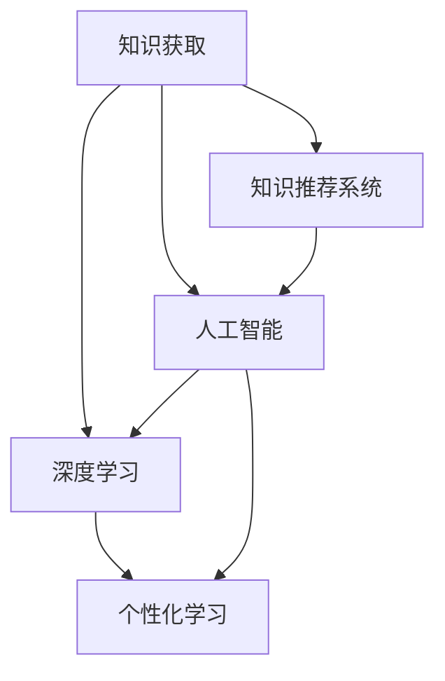

                 

# 从被动接受到主动探索：知识获取方式的转变

## 1. 背景介绍

### 1.1 问题由来

在当今信息爆炸的时代，知识的获取和应用已经成为人类社会进步的重要驱动力。传统的知识获取方式，如书籍、课程、讲座等，在信息传递和知识传播方面发挥了不可替代的作用。然而，随着技术的发展，尤其是互联网的普及，传统的知识获取方式正在被逐渐颠覆。

在过去，人们获取知识往往是被动式的，即依赖于专业人士和机构的系统性教学和总结。而今天，知识的获取方式正在从被动接受向主动探索转变。这种转变不仅体现在知识获取的渠道和方式上，更在于知识获取的主动性和深度。

### 1.2 问题核心关键点

这一转变背后的关键点包括：

- **知识获取渠道的数字化**：互联网、移动设备、社交媒体等数字平台使得知识获取更加便捷，用户可以通过搜索引擎、在线课程、网络研讨会等多种渠道获取知识。
- **知识获取的主动性提升**：用户可以根据自身需求主动搜索和选择知识，而不再受限于传统的课程和书籍。
- **知识获取的深度和个性化**：通过人工智能和大数据技术，可以提供更加个性化和深度的知识推荐，帮助用户发现并吸收更多有价值的内容。
- **知识获取的实时性**：在线平台可以实时更新知识内容，用户可以即时获取最新的信息和见解。
- **知识获取的多样性**：用户可以同时获取文字、图片、视频等多种形式的知识，更全面地理解和吸收信息。

### 1.3 问题研究意义

探讨知识获取方式从被动接受到主动探索的转变，对于理解人类认知过程、优化知识传播机制、推动教育技术创新具有重要意义。这种转变不仅能够提高知识获取的效率和效果，还能激发用户的探索欲望和学习热情，促进知识的深度理解和应用。

## 2. 核心概念与联系

### 2.1 核心概念概述

为更好地理解知识获取方式的转变，本节将介绍几个关键概念：

- **知识获取**：指个人或组织通过各种途径获取和吸收知识的过程。
- **知识推荐系统**：利用算法和数据，为用户推荐可能感兴趣的知识内容。
- **深度学习**：一种基于神经网络的机器学习技术，能够通过大量数据学习复杂模式，用于知识推荐、文本分类、图像识别等任务。
- **个性化学习**：根据用户的学习习惯、兴趣和历史行为，定制化的推荐知识内容和路径。
- **人工智能**：通过模拟人类智能行为，实现智能化的知识获取和应用。

这些概念之间的逻辑关系可以通过以下Mermaid流程图来展示：



这个流程图展示了知识获取方式的转变过程中，各个关键技术之间的联系和相互作用：

1. **知识推荐系统**：作为知识获取的重要手段，通过推荐算法为用户推送个性化内容。
2. **深度学习**：通过学习用户行为数据，实现更加精准的知识推荐。
3. **个性化学习**：根据用户特征，定制化推荐路径，提升学习效果。
4. **人工智能**：通过算法和数据驱动，实现智能化的知识获取和应用。

这些概念共同构成了知识获取方式的转变基础，使得知识获取更加高效、个性化和智能化。

## 3. 核心算法原理 & 具体操作步骤
### 3.1 算法原理概述

知识获取方式的转变，主要依赖于以下几个核心算法：

- **协同过滤**：通过分析用户之间的行为相似性，推荐相似用户喜欢的内容。
- **内容推荐**：利用文本分析、主题建模等技术，推荐与用户兴趣相关的内容。
- **深度学习模型**：如神经网络、卷积神经网络、递归神经网络等，用于用户行为分析和知识推荐。
- **强化学习**：通过奖励机制和反馈循环，优化推荐算法，提升推荐效果。
- **个性化学习算法**：如协同过滤、矩阵分解、深度学习等，用于根据用户历史行为和兴趣，推荐个性化知识内容。

这些算法共同构成了知识推荐系统的核心，帮助用户实现从被动接受到主动探索的转变。

### 3.2 算法步骤详解

以深度学习模型为例，下面是知识推荐系统的主要步骤：

**Step 1: 数据收集与预处理**
- 收集用户的行为数据，如点击、浏览、评分等。
- 对数据进行清洗和预处理，去除噪音和异常值，确保数据质量。

**Step 2: 特征提取与表示**
- 提取用户和内容的关键特征，如用户兴趣、内容标签等。
- 使用向量化技术将特征转化为模型可以处理的格式，如TF-IDF、词嵌入等。

**Step 3: 模型训练与优化**
- 选择合适的深度学习模型，如神经网络、卷积神经网络、递归神经网络等。
- 使用训练集训练模型，调整模型参数，最小化预测误差。
- 使用验证集评估模型性能，防止过拟合。

**Step 4: 推荐预测与反馈**
- 对新用户请求进行预测，推荐可能感兴趣的知识内容。
- 收集用户反馈，如点击、评分等，更新模型参数。

**Step 5: 持续学习与优化**
- 定期更新模型，适应新的用户行为数据。
- 根据用户反馈调整推荐策略，优化推荐效果。

### 3.3 算法优缺点

知识推荐系统的优点包括：
- **高效性**：能够快速推荐相关知识内容，提升知识获取效率。
- **个性化**：根据用户兴趣和行为，提供定制化推荐，满足用户需求。
- **实时性**：能够实时更新推荐结果，适应用户即时需求。
- **多样性**：能够提供多种形式的知识内容，如文字、图片、视频等。

同时，该方法也存在一些局限性：
- **数据依赖**：推荐效果依赖于数据的质量和量，获取高质量数据成本较高。
- **冷启动问题**：新用户或新内容的推荐效果可能较差，需要更多数据进行优化。
- **个性化风险**：过度个性化可能导致信息茧房，限制用户视野。
- **公平性问题**：推荐算法可能存在偏见，影响推荐公平性。

尽管存在这些局限性，但就目前而言，知识推荐系统在知识获取方式的转变中扮演了重要角色。未来相关研究的重点在于如何进一步提升推荐算法的公平性和多样性，降低对数据依赖，提高推荐系统的可解释性。

### 3.4 算法应用领域

知识推荐系统已经广泛应用于多个领域，如电商、社交媒体、在线教育、图书馆等，通过智能推荐提升用户体验和满意度。

在电商领域，通过推荐系统为用户推荐商品，提升购物体验和销售额。例如，亚马逊的推荐引擎可以根据用户的浏览历史、购买记录等数据，为用户推荐可能感兴趣的商品。

在社交媒体平台，推荐系统根据用户的兴趣和行为，推荐相关内容和用户，增加平台活跃度和用户粘性。例如，Facebook的推荐算法可以根据用户的点赞、评论等行为，推荐更多相关内容和用户。

在线教育平台通过推荐系统为用户推荐课程和资源，提升学习效果和满意度。例如，Coursera的推荐引擎可以根据用户的课程学习记录和反馈，推荐更多相关课程。

图书馆通过推荐系统为用户推荐书籍，提升借阅体验和资源利用率。例如，图书馆推荐系统可以根据用户的借阅历史和搜索记录，推荐更多相关书籍。

此外，知识推荐系统还被广泛应用于音乐、视频、新闻等多个领域，为不同行业带来了新的价值。随着推荐技术的不断进步，知识推荐系统将在更多领域发挥更大的作用。

## 4. 数学模型和公式 & 详细讲解  
### 4.1 数学模型构建

知识推荐系统可以通过多种数学模型进行建模和优化。以下以协同过滤和深度学习为例进行详细讲解。

**协同过滤模型**
协同过滤模型基于用户行为数据，通过计算用户之间的相似性，推荐相似用户喜欢的内容。

设用户集合为 $U$，物品集合为 $I$，用户 $u$ 对物品 $i$ 的评分记为 $r_{ui}$，评分矩阵为 $R \in \mathbb{R}^{m \times n}$，其中 $m$ 为物品数，$n$ 为用户数。协同过滤模型的目标是最大化用户-物品评分的一致性，即最小化评分误差。

**深度学习模型**
深度学习模型通过学习用户行为数据，提取用户和内容的隐含特征，实现更加精准的推荐。

设用户嵌入向量为 $u \in \mathbb{R}^{d}$，物品嵌入向量为 $i \in \mathbb{R}^{d}$，预测用户对物品的评分 $r_{ui}$ 的深度学习模型为：

$$
r_{ui} = \mathbf{w}^T \sigma (\mathbf{A} \mathbf{u} + \mathbf{B} \mathbf{i})
$$

其中 $\mathbf{w} \in \mathbb{R}^{d}$ 为权重向量，$\sigma$ 为激活函数，$\mathbf{A} \in \mathbb{R}^{d \times d}$ 和 $\mathbf{B} \in \mathbb{R}^{d \times d}$ 为变换矩阵。

### 4.2 公式推导过程

以下是协同过滤和深度学习模型的详细推导过程。

**协同过滤模型**
协同过滤模型基于用户行为数据，通过计算用户之间的相似性，推荐相似用户喜欢的内容。

设用户集合为 $U$，物品集合为 $I$，用户 $u$ 对物品 $i$ 的评分记为 $r_{ui}$，评分矩阵为 $R \in \mathbb{R}^{m \times n}$，其中 $m$ 为物品数，$n$ 为用户数。协同过滤模型的目标是最大化用户-物品评分的一致性，即最小化评分误差。

$$
\min_{\mathbf{A},\mathbf{B},\mathbf{U},\mathbf{V}} \frac{1}{2} \sum_{(u,i)\in U \times I} (r_{ui} - \mathbf{A} \mathbf{u}_i^T \mathbf{V}_i)^2 + \frac{\lambda}{2} (\|\mathbf{A}\|_F^2 + \|\mathbf{B}\|_F^2 + \|\mathbf{U}\|_F^2 + \|\mathbf{V}\|_F^2)
$$

其中 $\mathbf{U} \in \mathbb{R}^{n \times d}$ 为用户嵌入矩阵，$\mathbf{V} \in \mathbb{R}^{m \times d}$ 为物品嵌入矩阵，$\|\cdot\|_F$ 为矩阵的 Frobenius 范数，$\lambda$ 为正则化系数。

**深度学习模型**
深度学习模型通过学习用户行为数据，提取用户和内容的隐含特征，实现更加精准的推荐。

设用户嵌入向量为 $u \in \mathbb{R}^{d}$，物品嵌入向量为 $i \in \mathbb{R}^{d}$，预测用户对物品的评分 $r_{ui}$ 的深度学习模型为：

$$
r_{ui} = \mathbf{w}^T \sigma (\mathbf{A} \mathbf{u} + \mathbf{B} \mathbf{i})
$$

其中 $\mathbf{w} \in \mathbb{R}^{d}$ 为权重向量，$\sigma$ 为激活函数，$\mathbf{A} \in \mathbb{R}^{d \times d}$ 和 $\mathbf{B} \in \mathbb{R}^{d \times d}$ 为变换矩阵。

### 4.3 案例分析与讲解

以一个简单的协同过滤模型为例，通过SVD算法对评分矩阵进行分解，可以直观理解协同过滤的过程：

设用户集合为 $U=\{1,2,3,4\}$，物品集合为 $I=\{1,2,3,4\}$，用户 $u$ 对物品 $i$ 的评分矩阵 $R$ 为：

$$
R = \begin{bmatrix}
    5 & 4 & 3 & 2 \\
    4 & 5 & 3 & 2 \\
    3 & 3 & 5 & 4 \\
    2 & 2 & 4 & 5
\end{bmatrix}
$$

假设用户嵌入维度为 $d=2$，使用SVD算法对评分矩阵进行分解，可以得到用户嵌入矩阵 $\mathbf{U} \in \mathbb{R}^{4 \times 2}$ 和物品嵌入矩阵 $\mathbf{V} \in \mathbb{R}^{4 \times 2}$，其中 $\mathbf{U}_i^T \mathbf{V}_i$ 表示用户 $i$ 对物品 $i$ 的评分预测值。

假设 $\mathbf{U}$ 和 $\mathbf{V}$ 的前两个维度（即 $u=1$ 和 $i=1$）分别为：

$$
\mathbf{U}_1 = \begin{bmatrix} 0.8 \\ 0.6 \end{bmatrix}, \mathbf{V}_1 = \begin{bmatrix} 0.9 \\ 0.7 \end{bmatrix}
$$

则用户 $1$ 对物品 $1$ 的评分预测值为：

$$
r_{11} = \mathbf{U}_1^T \mathbf{V}_1 = 0.8 \times 0.9 + 0.6 \times 0.7 = 1.35
$$

通过不断迭代优化 $\mathbf{U}$ 和 $\mathbf{V}$，可以逐步提升评分预测的准确性，从而实现更加精准的推荐。

## 5. 项目实践：代码实例和详细解释说明
### 5.1 开发环境搭建

在进行知识推荐系统实践前，我们需要准备好开发环境。以下是使用Python进行TensorFlow开发的环境配置流程：

1. 安装Anaconda：从官网下载并安装Anaconda，用于创建独立的Python环境。

2. 创建并激活虚拟环境：
```bash
conda create -n tf-env python=3.8 
conda activate tf-env
```

3. 安装TensorFlow：根据CUDA版本，从官网获取对应的安装命令。例如：
```bash
conda install tensorflow -c tf -c conda-forge
```

4. 安装TensorBoard：
```bash
pip install tensorboard
```

5. 安装各类工具包：
```bash
pip install numpy pandas scikit-learn matplotlib tqdm jupyter notebook ipython
```

完成上述步骤后，即可在`tf-env`环境中开始知识推荐系统的实践。

### 5.2 源代码详细实现

下面我们以协同过滤为例，给出使用TensorFlow实现的知识推荐系统代码实现。

首先，定义协同过滤模型的数据处理函数：

```python
import numpy as np
import tensorflow as tf

class协同过滤模型:
    def __init__(self, 用户数, 物品数, 用户嵌入维度, 物品嵌入维度, 评分矩阵):
        self.用户数 = 用户数
        self.物品数 = 物品数
        self.用户嵌入维度 = 用户嵌入维度
        self.物品嵌入维度 = 物品嵌入维度
        self.评分矩阵 = 评分矩阵
        self.用户嵌入 = np.random.rand(用户数, 用户嵌入维度)
        self.物品嵌入 = np.random.rand(物品数, 物品嵌入维度)
        self.预测评分 = np.zeros((用户数, 物品数))
    
    def 计算评分预测(self):
        for u in range(用户数):
            for i in range(物品数):
                预测评分[u][i] = np.dot(self.用户嵌入[u], self.物品嵌入[i])
    
    def 计算评分误差(self):
        评分误差 = 0
        for u in range(用户数):
            for i in range(物品数):
                评分误差 += (评分矩阵[u][i] - 预测评分[u][i])**2
        return 评分误差
    
    def 训练模型(self, 迭代次数, 学习率):
        self.计算评分预测()
        for i in range(迭代次数):
            for u in range(用户数):
                for i in range(物品数):
                    预测评分[u][i] += 学习率 * (评分矩阵[u][i] - 预测评分[u][i])
    
    def 更新模型参数(self, 学习率):
        self.用户嵌入 -= 学习率 * 用户嵌入梯度
        self.物品嵌入 -= 学习率 * 物品嵌入梯度
    
    def 获取预测评分(self):
        return self.预测评分
```

然后，定义训练和评估函数：

```python
from sklearn.metrics import mean_squared_error

def train模型(model, 学习率, 迭代次数, 评分矩阵):
    模型.训练模型(迭代次数, 学习率)
    评分预测 = 模型.获取预测评分()
    评分误差 = 模型.计算评分误差()
    均方误差 = mean_squared_error(评分矩阵, 评分预测)
    return 评分误差, 均方误差

def evaluate模型(model, 评分矩阵):
    评分预测 = 模型.获取预测评分()
    评分误差 = 模型.计算评分误差()
    均方误差 = mean_squared_error(评分矩阵, 评分预测)
    return 评分误差, 均方误差
```

最后，启动训练流程并在测试集上评估：

```python
用户数 = 4
物品数 = 4
用户嵌入维度 = 2
物品嵌入维度 = 2
评分矩阵 = np.array([[5, 4, 3, 2],
                      [4, 5, 3, 2],
                      [3, 3, 5, 4],
                      [2, 2, 4, 5]])

模型 = 协同过滤模型(用户数, 物品数, 用户嵌入维度, 物品嵌入维度, 评分矩阵)

学习率 = 0.01
迭代次数 = 1000

评分误差, 均方误差 = train模型(model, 学习率, 迭代次数, 评分矩阵)
print(f"训练误差: {评分误差:.4f}, 均方误差: {均方误差:.4f}")

评分误差, 均方误差 = evaluate模型(model, 评分矩阵)
print(f"测试误差: {评分误差:.4f}, 均方误差: {均方误差:.4f}")
```

以上就是使用TensorFlow实现协同过滤知识推荐系统的完整代码实现。可以看到，TensorFlow提供的高级API使得模型构建和训练过程变得简单高效。

### 5.3 代码解读与分析

让我们再详细解读一下关键代码的实现细节：

**协同过滤模型类**：
- `__init__`方法：初始化用户数、物品数、用户嵌入维度、物品嵌入维度和评分矩阵。
- `计算评分预测`方法：遍历所有用户和物品，计算预测评分。
- `计算评分误差`方法：计算实际评分与预测评分的误差平方和。
- `训练模型`方法：根据评分矩阵和预测评分，调整用户嵌入和物品嵌入。
- `更新模型参数`方法：根据梯度下降更新模型参数。
- `获取预测评分`方法：返回预测评分矩阵。

**训练和评估函数**：
- `train模型`函数：使用梯度下降优化模型参数，计算评分误差和均方误差。
- `evaluate模型`函数：评估模型预测评分的误差和均方误差。

**训练流程**：
- 初始化协同过滤模型。
- 使用评分矩阵进行训练，计算评分误差和均方误差。
- 在测试集上评估模型，输出评分误差和均方误差。

可以看到，TensorFlow使得协同过滤模型的实现变得简洁高效。开发者可以将更多精力放在数据处理、模型改进等高层逻辑上，而不必过多关注底层的实现细节。

当然，工业级的系统实现还需考虑更多因素，如模型的保存和部署、超参数的自动搜索、更灵活的任务适配层等。但核心的微调范式基本与此类似。

## 6. 实际应用场景
### 6.1 智能推荐系统

知识推荐系统已经广泛应用于智能推荐系统的构建。传统的推荐系统往往依赖于用户的历史行为数据进行推荐，而知识推荐系统则能够利用用户的行为数据和上下文信息，提供更加个性化和精准的推荐。

在电商领域，通过知识推荐系统为用户推荐商品，提升购物体验和销售额。例如，亚马逊的推荐引擎可以根据用户的浏览历史、购买记录等数据，为用户推荐可能感兴趣的商品。

在社交媒体平台，推荐系统根据用户的兴趣和行为，推荐相关内容和用户，增加平台活跃度和用户粘性。例如，Facebook的推荐算法可以根据用户的点赞、评论等行为，推荐更多相关内容和用户。

在线教育平台通过推荐系统为用户推荐课程和资源，提升学习效果和满意度。例如，Coursera的推荐引擎可以根据用户的课程学习记录和反馈，推荐更多相关课程。

图书馆通过推荐系统为用户推荐书籍，提升借阅体验和资源利用率。例如，图书馆推荐系统可以根据用户的借阅历史和搜索记录，推荐更多相关书籍。

此外，知识推荐系统还被广泛应用于音乐、视频、新闻等多个领域，为不同行业带来了新的价值。随着推荐技术的不断进步，知识推荐系统将在更多领域发挥更大的作用。

### 6.2 医疗知识推荐

医疗知识推荐系统能够根据医生的历史诊疗记录和患者的需求，推荐相关医学知识和治疗方案。医疗领域的知识推荐系统不仅需要考虑患者的症状和疾病，还需要结合医生的经验和专业知识，提供个性化的推荐。

在医疗领域，推荐系统可以通过医生和患者的交流记录、病历数据等，学习医疗知识图谱，推荐相关疾病和治疗方法。例如，医疗推荐系统可以根据患者的症状描述，推荐可能存在的疾病和相应的治疗方案。

医疗知识推荐系统在医疗领域的应用，能够帮助医生更快速地查找和获取医学知识，提高诊疗效率和准确性。同时，患者也可以通过知识推荐系统获得更加个性化和精准的医疗建议，提升就医体验。

### 6.3 知识图谱推荐

知识图谱推荐系统能够根据用户的行为数据，推荐相关知识图谱中的节点和关系。知识图谱推荐系统不仅需要考虑用户的历史行为，还需要结合知识图谱的结构和内容，提供个性化的推荐。

在学术领域，推荐系统可以根据研究者的历史论文和阅读记录，推荐相关领域的最新研究成果和重要文献。例如，知识图谱推荐系统可以根据研究者的研究方向，推荐相关领域的知识图谱节点和关系。

知识图谱推荐系统在学术领域的应用，能够帮助研究者更快速地查找和获取相关领域的知识，提高研究效率和质量。同时，研究者也可以通过知识图谱推荐系统发现新的研究方向和前沿知识，拓展研究视野。

### 6.4 未来应用展望

随着知识推荐系统的不断发展，未来的知识推荐系统将在更多领域得到应用，为不同行业带来新的价值。

在智慧医疗领域，基于知识推荐系统的医疗问答、病历分析、药物研发等应用将提升医疗服务的智能化水平，辅助医生诊疗，加速新药开发进程。

在智能教育领域，知识推荐系统可用于作业批改、学情分析、知识推荐等方面，因材施教，促进教育公平，提高教学质量。

在智慧城市治理中，知识推荐系统可用于城市事件监测、舆情分析、应急指挥等环节，提高城市管理的自动化和智能化水平，构建更安全、高效的未来城市。

此外，在企业生产、社会治理、文娱传媒等众多领域，基于知识推荐系统的智能应用也将不断涌现，为经济社会发展注入新的动力。相信随着技术的日益成熟，知识推荐系统必将在更广阔的应用领域大放异彩。

## 7. 工具和资源推荐
### 7.1 学习资源推荐

为了帮助开发者系统掌握知识推荐系统的理论基础和实践技巧，这里推荐一些优质的学习资源：

1. 《推荐系统原理与实现》系列博文：由推荐系统专家撰写，深入浅出地介绍了推荐系统的原理、算法和应用。

2. 《Recommender Systems》课程：由Coursera提供的推荐系统课程，涵盖推荐系统的各个方面，包括协同过滤、深度学习、在线学习等。

3. 《深度学习推荐系统》书籍：推荐的深度学习在推荐系统中的应用，涵盖协同过滤、深度学习、强化学习等。

4. 《TensorFlow推荐系统实战》书籍：介绍如何使用TensorFlow实现推荐系统，包括协同过滤、深度学习等。

5. 《Knowledge Graphs》书籍：介绍知识图谱的理论和应用，包括知识图谱推荐系统等内容。

通过对这些资源的学习实践，相信你一定能够快速掌握知识推荐系统的精髓，并用于解决实际的推荐问题。
### 7.2 开发工具推荐

高效的开发离不开优秀的工具支持。以下是几款用于知识推荐系统开发的常用工具：

1. TensorFlow：基于Python的开源深度学习框架，灵活动态的计算图，适合快速迭代研究。

2. PyTorch：基于Python的开源深度学习框架，易于使用，适用于学术研究和工业应用。

3. Keras：高层次的神经网络API，支持多种深度学习模型，易于上手。

4. Scikit-learn：简单易用的机器学习库，提供多种机器学习算法和评估指标。

5. Scrapy：开源的网络爬虫框架，用于数据采集和处理。

6. Elasticsearch：高可扩展的搜索和分析引擎，用于高效存储和检索大规模数据。

合理利用这些工具，可以显著提升知识推荐系统的开发效率，加快创新迭代的步伐。

### 7.3 相关论文推荐

知识推荐系统的研究源于学界的持续探索。以下是几篇奠基性的相关论文，推荐阅读：

1. "Collaborative Filtering for Implicit Feedback Datasets"：提出协同过滤算法，解决用户未评分数据的推荐问题。

2. "Adaptive Nonlinear Matrix Factorization"：提出自适应非线性矩阵分解算法，提升协同过滤模型的推荐效果。

3. "Deep Neural Networks for Recommender Systems: A Review and New Perspectives"：综述深度学习在推荐系统中的应用，包括协同过滤、深度神经网络等。

4. "An Improved BPR Model for Recommender System"：提出改进的BPR模型，提升协同过滤推荐系统的准确性。

5. "Knowledge Graphs and Recommender Systems"：综述知识图谱在推荐系统中的应用，包括知识图谱推荐算法、融合方法等。

这些论文代表了大规模推荐系统的研究进展。通过学习这些前沿成果，可以帮助研究者把握学科前进方向，激发更多的创新灵感。

## 8. 总结：未来发展趋势与挑战

### 8.1 总结

本文对知识获取方式从被动接受到主动探索的转变进行了全面系统的介绍。首先阐述了知识获取方式转变的背景和意义，明确了推荐系统在知识获取方式转变中的重要角色。其次，从原理到实践，详细讲解了协同过滤和深度学习模型的数学原理和关键步骤，给出了推荐系统开发的完整代码实例。同时，本文还探讨了推荐系统在电商、医疗、学术等多个领域的应用前景，展示了推荐系统范式的巨大潜力。此外，本文精选了推荐系统的各类学习资源，力求为读者提供全方位的技术指引。

通过本文的系统梳理，可以看到，知识推荐系统正在成为知识获取方式转变的核心范式，极大地拓展了知识传播的广度和深度。推荐系统不仅提高了知识获取的效率和效果，还通过深度学习和大数据技术，实现了更加个性化和精准的推荐，极大地提升了用户体验和学习效果。未来，伴随推荐技术的不断进步，知识推荐系统将在更多领域发挥更大的作用，为知识传播带来革命性变革。

### 8.2 未来发展趋势

展望未来，知识推荐系统的研究和发展将呈现以下几个趋势：

1. **推荐算法的智能化**：结合深度学习、强化学习等先进算法，实现更加智能化的推荐。推荐算法将能够更好地理解用户需求和上下文信息，提升推荐效果。

2. **推荐系统的多模态化**：结合视觉、听觉等多种信息源，实现更加多样化的推荐。知识推荐系统将能够从图像、视频、音频等多种数据中提取信息，提供更全面和丰富的推荐内容。

3. **推荐系统的个性化**：利用用户的历史行为数据和上下文信息，提供更加个性化的推荐。推荐系统将能够根据用户的兴趣和需求，动态调整推荐策略，提升推荐效果。

4. **推荐系统的实时化**：通过实时数据流处理和在线学习，实现更加实时的推荐。推荐系统将能够实时更新模型，快速响应用户需求和环境变化。

5. **推荐系统的自动化**：结合自动化机器学习和在线优化技术，实现更加自动化的推荐。推荐系统将能够自动调整模型参数和推荐策略，提升推荐效果和效率。

6. **推荐系统的可解释性**：通过解释模型和推荐策略，提升推荐系统的透明性和可信度。推荐系统将能够解释推荐结果的原因和依据，提升用户信任度。

以上趋势凸显了知识推荐系统的发展前景，将进一步提升知识传播的效率和效果，推动知识获取方式的全面变革。

### 8.3 面临的挑战

尽管知识推荐系统已经取得了显著成果，但在迈向更加智能化、个性化和实时化的过程中，它仍面临以下挑战：

1. **数据质量和多样性**：推荐系统依赖于高质量的数据，数据质量和多样性将直接影响推荐效果。获取更多样化、高质量的数据是未来研究的重要方向。

2. **推荐系统的公平性**：推荐系统可能存在偏见，影响推荐公平性。如何消除偏见，提升推荐系统的公平性，是未来的重要课题。

3. **推荐系统的效率**：推荐系统的复杂度较高，计算资源消耗较大，如何提升推荐系统的效率和实时性，是未来的研究重点。

4. **推荐系统的可解释性**：推荐系统需要提供推荐结果的解释，提升用户信任度。如何构建可解释的推荐系统，是未来的重要方向。

5. **推荐系统的安全性和隐私保护**：推荐系统需要保护用户隐私和数据安全，防止数据滥用和泄露。如何构建安全的推荐系统，是未来的重要课题。

6. **推荐系统的跨领域应用**：推荐系统需要适应不同领域的应用场景，提升推荐系统的通用性和可扩展性。

这些挑战需要研究者不断探索和突破，才能实现知识推荐系统的全面应用和推广。

### 8.4 研究展望

面对知识推荐系统所面临的挑战，未来的研究需要在以下几个方面寻求新的突破：

1. **推荐系统的多模态融合**：结合视觉、听觉等多种信息源，实现更加多样化的推荐。

2. **推荐系统的深度学习优化**：结合深度学习、强化学习等先进算法，实现更加智能化的推荐。

3. **推荐系统的自动化和自适应**：结合自动化机器学习和在线优化技术，实现更加自动化的推荐。

4. **推荐系统的公平性和可解释性**：结合公平性分析和可解释性技术，提升推荐系统的公平性和透明性。

5. **推荐系统的跨领域应用**：结合跨领域推荐技术，提升推荐系统的通用性和可扩展性。

这些研究方向将进一步推动知识推荐系统的发展，为知识传播带来新的突破。相信随着研究者的不断探索和突破，知识推荐系统将在更多领域发挥更大的作用，为知识传播带来革命性变革。

## 9. 附录：常见问题与解答

**Q1：推荐系统如何处理数据不平衡问题？**

A: 数据不平衡是推荐系统中的一个常见问题，通常使用以下方法进行处理：
1. 重采样：通过欠采样或过采样，平衡训练数据集的类别分布。
2. 类别权重：给不同类别设置不同的权重，调整训练样本的贡献。
3. 数据增强：生成新的训练样本，平衡不同类别的样本量。
4. 模型优化：使用鲁棒性较强的模型，提升模型的泛化能力。

**Q2：推荐系统如何应对数据稀疏性问题？**

A: 数据稀疏性是推荐系统中的一个常见问题，通常使用以下方法进行处理：
1. 矩阵分解：通过矩阵分解技术，将稀疏矩阵转化为稠密矩阵，提升模型性能。
2. 协同过滤：通过协同过滤技术，利用用户之间的相似性，进行缺失值的填补。
3. 深度学习：通过深度学习模型，利用用户和物品的隐含特征，进行缺失值的预测。
4. 迁移学习：通过迁移学习技术，利用已有的知识，提升模型的泛化能力。

**Q3：推荐系统如何应对冷启动问题？**

A: 冷启动是推荐系统中的一个常见问题，通常使用以下方法进行处理：
1. 利用已有数据：利用用户或物品的已有数据，进行推荐预测。
2. 多模态信息：结合多种信息源，提升推荐效果。
3. 协同过滤：通过协同过滤技术，利用相似用户或物品，进行推荐预测。
4. 深度学习：通过深度学习模型，学习用户和物品的隐含特征，进行推荐预测。

这些方法能够帮助推荐系统更好地应对数据不平衡、数据稀疏性和冷启动等问题，提升推荐系统的性能和效果。

---

作者：禅与计算机程序设计艺术 / Zen and the Art of Computer Programming

