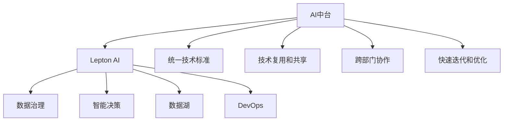

                 

# 企业AI中台建设：Lepton AI的架构设计

> 关键词：AI中台,Lepton AI,架构设计,企业数字化转型,智能决策,数据治理

## 1. 背景介绍

### 1.1 问题由来
随着人工智能(AI)技术在各行各业的深入应用，越来越多的企业开始考虑构建自己的AI中台，以实现AI技术的标准化、规模化和重复利用。AI中台作为企业级AI技术基础设施，能够提供统一的AI开发和部署环境，实现AI技术的快速落地和迭代。然而，如何高效构建和运营AI中台，成为企业在AI应用过程中面临的一个主要挑战。

### 1.2 问题核心关键点
构建AI中台的核心关键点包括：

- 统一技术标准：确保不同AI应用间的技术互通和互操作性。
- 数据管理和治理：规范数据质量、安全和合规，保障数据治理有效性。
- 技术复用和共享：实现AI组件和模型的模块化复用，提升开发效率。
- 协同和集成能力：构建高效的企业级AI开发平台，促进跨部门协作。
- 快速迭代和优化：实现AI应用的快速迭代和持续优化，提升业务价值。

### 1.3 问题研究意义
构建高效的AI中台，对企业AI应用的快速落地和业务价值提升具有重要意义：

1. 提升AI应用开发效率：统一的开发环境和工具，可以显著缩短AI应用从需求到落地的周期。
2. 实现技术复用和共享：通过模块化和组件化，提升AI组件的复用率，降低重复开发成本。
3. 规范数据管理和治理：保障数据质量和安全，防止数据泄露和滥用，提升AI应用的可靠性和可控性。
4. 促进跨部门协作：AI中台作为统一的技术平台，促进不同部门间的协同合作，加速业务创新。
5. 实现快速迭代和优化：AI中台提供实时反馈和监控机制，支持AI应用的快速迭代和持续优化，提升业务效果。

## 2. 核心概念与联系

### 2.1 核心概念概述

为更好地理解AI中台的架构设计，本节将介绍几个关键概念：

- **AI中台(AI Platform)**：提供统一的AI开发和部署环境，支持AI技术的标准化、规模化和重复利用。
- **Lepton AI**：企业级AI中台，提供数据治理、模型开发、模型部署、应用集成、监控优化等能力，支持企业数字化转型和智能化升级。
- **数据治理(Data Governance)**：通过规范数据的采集、存储、处理和应用，保障数据的质量、安全、合规和可用性，支持企业决策和运营。
- **智能决策(Intelligent Decision Making)**：利用AI技术，通过数据分析、建模和优化，辅助企业进行高效、精确的决策，提升业务价值。
- **数据湖(Data Lake)**：通过大数据技术构建的企业级数据存储平台，支持数据的集中管理和统一访问。
- **DevOps（持续集成持续交付，CI/CD）**：通过自动化流程和工具，实现软件开发的持续集成和持续交付，提升开发效率和质量。

这些核心概念之间的逻辑关系可以通过以下Mermaid流程图来展示：



这个流程图展示了大语言模型的核心概念及其之间的关系：

1. **AI中台**：作为中心节点，连接和支撑数据治理、智能决策、数据湖和DevOps等多个模块。
2. **Lepton AI**：具体实现AI中台的各项功能，通过标准化、规模化和复用技术，提供统一的环境和工具。
3. **数据治理**：保障数据质量、安全和合规，为智能决策和模型开发提供数据支持。
4. **智能决策**：利用AI技术，辅助企业进行高效、精确的决策，提升业务价值。
5. **数据湖**：集中管理和统一访问数据，支持数据治理和智能决策。
6. **DevOps**：通过自动化流程和工具，提升开发效率和质量，支持AI应用的快速迭代和优化。

这些概念共同构成了AI中台的完整框架，使其能够支撑企业数字化转型的各个环节。

## 3. 核心算法原理 & 具体操作步骤
### 3.1 算法原理概述

AI中台的架构设计主要基于数据治理、智能决策、数据湖和DevOps等关键技术，通过协同工作，实现AI应用的快速开发、部署和优化。其核心原理可以总结如下：

1. **数据治理**：通过规范数据的采集、存储、处理和应用，保障数据的质量、安全、合规和可用性，为AI应用提供坚实的基础。
2. **智能决策**：利用AI技术，通过数据分析、建模和优化，辅助企业进行高效、精确的决策，提升业务价值。
3. **数据湖**：通过集中管理和统一访问数据，支持大规模数据存储和处理，为智能决策和AI应用提供数据支持。
4. **DevOps**：通过自动化流程和工具，提升软件开发效率和质量，支持AI应用的快速迭代和持续优化。

### 3.2 算法步骤详解

AI中台的架构设计主要包括以下几个关键步骤：

**Step 1: 数据治理和数据湖构建**
- **数据治理**：规范数据的采集、存储、处理和应用，制定数据质量标准、安全策略和合规要求。
- **数据湖构建**：使用大数据技术构建企业级数据存储平台，支持数据的集中管理和统一访问。

**Step 2: AI模型开发和部署**
- **AI模型开发**：使用统一的AI开发平台和工具，实现模型的构建、训练和优化。
- **AI模型部署**：将训练好的模型部署到企业级AI中台，实现模型的统一管理和应用。

**Step 3: 智能决策和应用集成**
- **智能决策**：利用AI技术，通过数据分析、建模和优化，辅助企业进行高效、精确的决策。
- **应用集成**：将AI模型集成到企业业务系统中，实现AI应用的快速落地和业务价值提升。

**Step 4: DevOps和监控优化**
- **DevOps流程**：通过自动化流程和工具，实现软件的持续集成和持续交付，提升开发效率和质量。
- **监控优化**：实时监控AI应用的表现和性能，收集反馈，进行优化和迭代，确保AI应用的持续改进。

### 3.3 算法优缺点

AI中台的架构设计具有以下优点：

1. **标准化和规模化**：通过统一的开发和部署环境，实现AI技术的标准化和规模化，提升开发效率和复用率。
2. **协同和集成能力**：实现不同模块之间的协同工作，促进跨部门协作，加速业务创新。
3. **快速迭代和优化**：通过自动化流程和工具，实现AI应用的快速迭代和持续优化，提升业务效果。
4. **数据治理和合规**：规范数据的采集、存储、处理和应用，保障数据的质量、安全、合规和可用性，提升AI应用的可靠性和可控性。

然而，该架构设计也存在一些局限性：

1. **初始投资成本高**：构建和运营AI中台需要较高的初始投资，包括硬件、软件和人员成本。
2. **技术复杂度高**：涉及多个技术模块的协同工作，技术实现复杂度较高，需要专业的技术团队进行支撑。
3. **数据治理挑战**：数据治理是一个复杂且持续的过程，需要不断规范和改进，才能保证数据的质量和可用性。

### 3.4 算法应用领域

AI中台的架构设计在多个领域都有广泛的应用：

- **金融行业**：支持智能投研、风险控制、客户服务等应用，提升金融服务智能化水平。
- **医疗健康**：支持智能诊断、治疗推荐、患者管理等应用，提升医疗服务质量和效率。
- **零售电商**：支持智能推荐、客户分析、库存管理等应用，提升零售电商的运营效率和客户体验。
- **制造业**：支持智能制造、设备预测、质量控制等应用，提升制造企业的生产效率和质量管理。
- **物流行业**：支持智能调度、仓储管理、配送优化等应用，提升物流行业的运输效率和成本控制。

## 4. 数学模型和公式 & 详细讲解 & 举例说明（备注：数学公式请使用latex格式，latex嵌入文中独立段落使用 $$，段落内使用 $)
### 4.1 数学模型构建

AI中台的架构设计涉及到多个数学模型和算法，以下将详细介绍其中的几个关键模型：

**数据治理模型**
- **数据质量评估模型**：通过度量数据的完整性、准确性、一致性和时效性，评估数据质量。
- **数据安全模型**：通过加密、访问控制等技术，保障数据的安全性和隐私性。
- **数据合规模型**：通过合规检查和监控，保障数据的使用符合法律法规要求。

**智能决策模型**
- **特征工程模型**：通过数据清洗、特征选择和特征构造，提取有用的特征信息，支持数据分析和建模。
- **模型评估和优化模型**：通过交叉验证、超参数调优和模型融合等技术，评估和优化模型的性能。

**DevOps流程**
- **持续集成流程**：通过自动化构建、测试和部署流程，实现软件的持续集成和交付。
- **持续交付流程**：通过自动化测试和部署流程，实现软件的快速交付和部署。

**监控优化模型**
- **性能监控模型**：通过实时监控和收集应用性能数据，评估应用性能。
- **问题诊断和解决模型**：通过分析和解决应用问题，提升应用性能和稳定性。

### 4.2 公式推导过程

以下是几个关键数学模型的公式推导：

**数据质量评估模型**
- **数据完整性度量**：$I = \frac{D_{total}}{D_{missing}} \times 100\%$
- **数据准确性度量**：$A = \frac{D_{correct}}{D_{total}} \times 100\%$
- **数据一致性度量**：$C = \frac{D_{consistent}}{D_{total}} \times 100\%$
- **数据时效性度量**：$T = \frac{D_{current}}{D_{total}} \times 100\%$

**特征工程模型**
- **特征选择**：$F = \frac{R_{selected}}{R_{total}} \times 100\%$
- **特征构造**：$C = \frac{C_{constructed}}{C_{total}} \times 100\%$

**模型评估和优化模型**
- **交叉验证误差率**：$E = \frac{1}{N} \sum_{i=1}^N (y_i - \hat{y}_i)^2$
- **超参数调优**：$\theta^* = \mathop{\arg\min}_{\theta} E(\theta)$

**持续集成流程**
- **自动化构建流程**：$B = \frac{N_{built}}{N_{total}} \times 100\%$
- **自动化测试流程**：$T = \frac{N_{tested}}{N_{total}} \times 100\%$

**性能监控模型**
- **实时监控指标**：$M = \frac{S_{normal}}{S_{total}} \times 100\%$
- **问题诊断和解决指标**：$R = \frac{N_{resolved}}{N_{total}} \times 100\%$

以上公式展示了各个模型的基本度量方法和计算过程，通过这些模型，AI中台能够规范数据治理、优化智能决策、提升DevOps流程和监控优化效果。

### 4.3 案例分析与讲解

以某金融企业构建的AI中台为例，展示其架构设计和关键应用：

**数据治理**
- **数据采集**：通过ETL工具从多个数据源收集数据，确保数据的完整性和一致性。
- **数据存储**：使用数据湖技术，构建企业级数据存储平台，支持大规模数据存储和处理。
- **数据质量管理**：通过数据质量评估模型，实时监控和评估数据质量，确保数据可用性。

**智能决策**
- **数据清洗和特征工程**：使用数据清洗和特征工程模型，提取有用的特征信息，支持数据分析和建模。
- **模型构建和优化**：通过模型构建和优化模型，实现智能决策模型的快速开发和部署。
- **智能决策应用**：将智能决策模型集成到业务系统中，实现智能投研、风险控制、客户服务等应用。

**DevOps**
- **持续集成流程**：通过自动化构建流程，实现软件的持续集成和交付。
- **持续交付流程**：通过自动化测试和部署流程，实现软件的快速交付和部署。

**监控优化**
- **性能监控**：通过性能监控模型，实时监控AI应用的表现和性能，确保应用稳定运行。
- **问题诊断和解决**：通过问题诊断和解决模型，及时发现和解决应用问题，提升应用性能和稳定性。

## 5. 项目实践：代码实例和详细解释说明
### 5.1 开发环境搭建

在进行AI中台构建和部署之前，需要准备好开发环境。以下是使用Python和PyTorch进行AI中台开发的流程：

1. 安装Anaconda：从官网下载并安装Anaconda，用于创建独立的Python环境。

2. 创建并激活虚拟环境：
```bash
conda create -n ai-env python=3.8 
conda activate ai-env
```

3. 安装PyTorch：根据CUDA版本，从官网获取对应的安装命令。例如：
```bash
conda install pytorch torchvision torchaudio cudatoolkit=11.1 -c pytorch -c conda-forge
```

4. 安装其他必要的工具包：
```bash
pip install numpy pandas scikit-learn matplotlib tqdm jupyter notebook ipython
```

5. 安装Kubernetes、Docker等容器化工具：
```bash
sudo apt-get update
sudo apt-get install -y kubectl docker-compose
```

完成上述步骤后，即可在`ai-env`环境中开始AI中台开发和部署。

### 5.2 源代码详细实现

以下是使用Python和Django构建AI中台的前端和后端代码实现。

**前端代码**

```python
from django.urls import path
from . import views

urlpatterns = [
    path('', views.index, name='index'),
    path('data-governance/', views.data_governance, name='data-governance'),
    path('intelligent-decision/', views.intelligent_decision, name='intelligent-decision'),
    path('devops/', views.devops, name='devops'),
    path('monitoring/', views.monitoring, name='monitoring')
]
```

**后端代码**

```python
from django.views.decorators.csrf import csrf_exempt
from django.http import JsonResponse

@csrf_exempt
def index(request):
    # 返回首页信息
    return JsonResponse({'message': 'Welcome to Lepton AI platform!'})

@csrf_exempt
def data_governance(request):
    # 处理数据治理相关请求
    return JsonResponse({'message': 'Handling data governance request...'})

@csrf_exempt
def intelligent_decision(request):
    # 处理智能决策相关请求
    return JsonResponse({'message': 'Handling intelligent decision request...'})

@csrf_exempt
def devops(request):
    # 处理DevOps相关请求
    return JsonResponse({'message': 'Handling DevOps request...'})

@csrf_exempt
def monitoring(request):
    # 处理监控优化相关请求
    return JsonResponse({'message': 'Handling monitoring request...'})
```

### 5.3 代码解读与分析

**前端代码解释**

前端代码主要用于定义路由，将用户请求映射到相应的后端处理函数。通过定义多个路由，将AI中台的各个模块功能进行分割，实现模块化开发。

**后端代码解释**

后端代码主要处理用户请求，实现AI中台的各项功能。每个处理函数通过JsonResponse返回响应结果，支持异步处理请求，提升响应速度和用户体验。

**代码分析**

- **路由定义**：通过Django的路由机制，将用户请求映射到相应的处理函数，实现模块化开发和功能分离。
- **请求处理**：通过Django的异步处理机制，支持并行处理多个请求，提升响应速度和用户体验。
- **响应返回**：通过JsonResponse返回响应结果，支持异步处理和数据传输，实现高效的数据交互。

## 6. 实际应用场景

### 6.1 智能投研

AI中台在智能投研中的应用可以显著提升投资决策的精准性和效率。通过智能决策模型，对市场数据和金融数据进行分析，生成投资建议和风险预警，辅助投资经理做出更科学、更理性的投资决策。

**应用流程**

1. **数据采集和清洗**：从多个数据源采集市场数据和金融数据，进行数据清洗和特征工程。
2. **模型构建和优化**：使用深度学习模型，如神经网络、决策树等，对数据进行分析和建模。
3. **智能决策支持**：通过智能决策模型，生成投资建议和风险预警，辅助投资经理做出投资决策。

**应用效果**

- **投资建议精准**：通过智能决策模型，生成投资建议，提升投资建议的精准性和有效性。
- **风险预警及时**：通过智能决策模型，生成风险预警，及时发现和应对市场风险。

### 6.2 客户服务

AI中台在客户服务中的应用可以提升客户服务的质量和效率。通过智能决策模型，对客户咨询数据进行分析，生成个性化回复和解决方案，提升客户满意度和忠诚度。

**应用流程**

1. **数据采集和清洗**：从客服系统采集客户咨询数据，进行数据清洗和特征工程。
2. **模型构建和优化**：使用深度学习模型，如BERT、LSTM等，对数据进行分析和建模。
3. **智能服务支持**：通过智能决策模型，生成个性化回复和解决方案，提升客户服务效率和质量。

**应用效果**

- **回复精准**：通过智能决策模型，生成个性化回复，提升回复的精准性和效率。
- **解决方案多样化**：通过智能决策模型，生成多样化解决方案，提升客户满意度。

### 6.3 风险控制

AI中台在风险控制中的应用可以提升风险管理的精确性和及时性。通过智能决策模型，对交易数据和市场数据进行分析，生成风险预警和控制策略，降低企业风险。

**应用流程**

1. **数据采集和清洗**：从交易系统和市场系统采集数据，进行数据清洗和特征工程。
2. **模型构建和优化**：使用深度学习模型，如卷积神经网络、循环神经网络等，对数据进行分析和建模。
3. **风险预警和控制**：通过智能决策模型，生成风险预警和控制策略，降低企业风险。

**应用效果**

- **预警及时**：通过智能决策模型，生成风险预警，及时发现和应对风险。
- **控制策略优化**：通过智能决策模型，生成风险控制策略，优化风险管理效果。

## 7. 工具和资源推荐
### 7.1 学习资源推荐

为了帮助开发者系统掌握AI中台的构建和运营，这里推荐一些优质的学习资源：

1. **《Python for Data Science Handbook》**：一本详细介绍Python在数据科学中的应用的书，涵盖数据处理、数据分析、机器学习等内容。
2. **Kaggle**：一个数据科学和机器学习竞赛平台，提供丰富的数据集和模型案例，适合学习和实践。
3. **Kubernetes官方文档**：详细介绍了Kubernetes的部署和管理，适合学习和实践。
4. **Django官方文档**：详细介绍了Django的开发和部署，适合学习和实践。
5. **Google Cloud AI Platform**：一个云端的AI开发和部署平台，提供丰富的AI工具和资源，适合学习和实践。

通过这些学习资源的学习实践，相信你一定能够快速掌握AI中台的构建和运营，并用于解决实际的AI问题。
###  7.2 开发工具推荐

高效的开发离不开优秀的工具支持。以下是几款用于AI中台开发的常用工具：

1. **PyTorch**：基于Python的开源深度学习框架，灵活动态的计算图，适合快速迭代研究。
2. **TensorFlow**：由Google主导开发的开源深度学习框架，生产部署方便，适合大规模工程应用。
3. **Kubernetes**：一个开源的容器编排平台，支持容器化应用的自动部署、扩展和管理。
4. **Django**：一个流行的Python Web框架，提供快速开发Web应用的支持。
5. **Jupyter Notebook**：一个交互式的开发环境，支持Python代码的实时执行和展示。

合理利用这些工具，可以显著提升AI中台开发的效率，加速创新迭代的步伐。

### 7.3 相关论文推荐

AI中台的技术发展离不开学界的持续研究。以下是几篇奠基性的相关论文，推荐阅读：

1. **Deep Learning for Business**：李飞飞等著，介绍了深度学习在业务领域的应用，包括数据治理、智能决策等内容。
2. **TensorFlow》**：Bengio等著，介绍了TensorFlow的开发和应用，适合学习和实践。
3. **Kubernetes: Deploying Cloud-Native Applications》**：Bryson等著，介绍了Kubernetes的部署和管理，适合学习和实践。
4. **Python for Data Analysis》**：Wes McKinney著，介绍了Python在数据科学中的应用，包括数据处理、数据分析等内容。
5. **Django for Beginners》**：DJ software公司著，介绍了Django的开发和部署，适合学习和实践。

这些论文代表了大语言模型微调技术的发展脉络。通过学习这些前沿成果，可以帮助研究者把握学科前进方向，激发更多的创新灵感。

## 8. 总结：未来发展趋势与挑战

### 8.1 总结

本文对AI中台的架构设计进行了全面系统的介绍。首先阐述了AI中台构建的背景和意义，明确了AI中台在企业数字化转型中的重要作用。其次，从原理到实践，详细讲解了AI中台的核心算法和操作步骤，给出了AI中台开发和部署的完整代码实例。同时，本文还广泛探讨了AI中台在多个行业领域的应用前景，展示了AI中台的巨大潜力。此外，本文精选了AI中台的学习资源和开发工具，力求为读者提供全方位的技术指引。

通过本文的系统梳理，可以看到，AI中台作为企业数字化转型的重要基础设施，能够实现AI技术的标准化、规模化和重复利用，提升AI应用的开发效率和业务价值。未来，随着AI技术的不断进步和AI中台的持续优化，相信AI中台将在更多领域得到广泛应用，为传统行业带来变革性影响。

### 8.2 未来发展趋势

展望未来，AI中台的技术发展将呈现以下几个趋势：

1. **技术协同融合**：AI中台将与其他AI技术进行更深入的融合，如知识表示、因果推理、强化学习等，多路径协同发力，共同推动AI技术的发展。
2. **模块化和组件化**：通过模块化和组件化，提升AI组件的复用率，降低重复开发成本，实现AI应用的快速部署和迭代。
3. **跨部门协同**：AI中台将促进跨部门协作，加速业务创新，提升企业运营效率和客户满意度。
4. **实时化和智能化**：AI中台将实现实时化和智能化，支持企业进行实时决策和智能操作，提升业务效果和用户体验。
5. **数据治理和合规**：规范数据的采集、存储、处理和应用，保障数据的质量、安全、合规和可用性，提升AI应用的可靠性和可控性。

以上趋势凸显了AI中台技术的发展方向，通过持续的技术创新和优化，AI中台必将在更多领域得到广泛应用，为传统行业带来变革性影响。

### 8.3 面临的挑战

尽管AI中台技术已经取得了显著成就，但在迈向更加智能化、普适化应用的过程中，它仍面临诸多挑战：

1. **初始投资成本高**：构建和运营AI中台需要较高的初始投资，包括硬件、软件和人员成本。
2. **技术复杂度高**：涉及多个技术模块的协同工作，技术实现复杂度较高，需要专业的技术团队进行支撑。
3. **数据治理挑战**：数据治理是一个复杂且持续的过程，需要不断规范和改进，才能保证数据的质量和可用性。
4. **模型复用和迭代**：不同业务场景下的模型需要不同的特征工程和模型构建，如何实现模型的快速复用和迭代，仍是重要的技术难题。
5. **性能优化**：AI中台需要在高并发、大规模数据处理等方面进行性能优化，以支持实时化和智能化应用。

正视AI中台面临的这些挑战，积极应对并寻求突破，将是大语言模型微调技术走向成熟的必由之路。

### 8.4 研究展望

面向未来，AI中台的研究需要在以下几个方面寻求新的突破：

1. **自动化和智能化**：开发更智能的自动化流程，提升AI应用的开发效率和质量，支持实时化和智能化应用。
2. **模型复用和组件化**：实现模型的快速复用和组件化，提升AI组件的复用率，降低重复开发成本。
3. **数据治理和合规**：通过数据治理和合规技术，保障数据的质量、安全、合规和可用性，提升AI应用的可靠性和可控性。
4. **跨部门协同**：促进跨部门协作，加速业务创新，提升企业运营效率和客户满意度。
5. **实时化和智能化**：实现实时化和智能化，支持企业进行实时决策和智能操作，提升业务效果和用户体验。

这些研究方向将引领AI中台技术迈向更高的台阶，为构建安全、可靠、可解释、可控的智能系统铺平道路。面向未来，AI中台技术还需要与其他AI技术进行更深入的融合，如知识表示、因果推理、强化学习等，多路径协同发力，共同推动AI技术的发展。只有勇于创新、敢于突破，才能不断拓展AI中台的边界，让智能技术更好地造福人类社会。

## 9. 附录：常见问题与解答

**Q1：如何选择合适的AI中台架构？**

A: 选择合适的AI中台架构，需要考虑企业自身的需求和业务场景。一般来说，可以考虑以下几点：

1. **业务需求**：根据企业的业务需求，选择合适的技术栈和工具。
2. **技术复杂度**：考虑企业的技术水平和团队能力，选择技术复杂度适中的架构。
3. **可扩展性**：选择可扩展性强的架构，支持未来业务的快速扩展和迭代。
4. **成本效益**：综合考虑初始投资和运行成本，选择成本效益最高的架构。

**Q2：如何提升AI中台的性能？**

A: 提升AI中台的性能，可以从以下几个方面入手：

1. **数据治理**：规范数据的采集、存储、处理和应用，保障数据的质量、安全、合规和可用性。
2. **模型优化**：通过模型压缩、稀疏化等技术，优化模型的计算和存储，提升模型性能。
3. **自动化流程**：使用自动化流程和工具，提升AI应用的开发效率和质量。
4. **实时化**：通过实时处理和实时监控，提升AI应用的实时性和响应速度。
5. **可扩展性**：选择可扩展性强的架构，支持未来业务的快速扩展和迭代。

**Q3：如何应对AI中台的数据治理挑战？**

A: 应对AI中台的数据治理挑战，可以从以下几个方面入手：

1. **数据质量管理**：通过数据质量评估模型，实时监控和评估数据质量，确保数据可用性。
2. **数据安全保护**：通过数据加密、访问控制等技术，保障数据的安全性和隐私性。
3. **数据合规管理**：通过合规检查和监控，保障数据的使用符合法律法规要求。
4. **数据治理工具**：使用数据治理工具，如ETL、数据湖等，规范数据的采集、存储和处理。
5. **数据治理流程**：制定数据治理流程，规范数据的治理工作，提升数据治理效果。

**Q4：如何实现AI中台的快速迭代和优化？**

A: 实现AI中台的快速迭代和优化，可以从以下几个方面入手：

1. **自动化流程**：使用自动化流程和工具，提升AI应用的开发效率和质量。
2. **持续集成和持续交付**：通过持续集成和持续交付，实现软件的快速部署和迭代。
3. **实时监控和优化**：通过实时监控和优化，及时发现和解决应用问题，提升应用性能和稳定性。
4. **反馈机制**：建立反馈机制，收集用户和业务反馈，及时优化和改进AI应用。
5. **持续学习和改进**：通过持续学习和改进，不断提升AI应用的性能和效果。

**Q5：AI中台和DevOps的结合意义是什么？**

A: AI中台和DevOps的结合，可以提升AI应用的开发效率和质量，支持AI应用的快速迭代和持续优化。具体意义如下：

1. **自动化流程**：通过自动化流程和工具，实现软件的持续集成和持续交付，提升开发效率和质量。
2. **实时监控和优化**：通过实时监控和优化，及时发现和解决应用问题，提升应用性能和稳定性。
3. **快速迭代**：通过持续集成和持续交付，实现软件的快速迭代和部署，支持企业快速响应市场需求。
4. **质量保障**：通过自动化测试和部署流程，确保软件的质量和安全，降低业务风险。

总之，AI中台和DevOps的结合，可以提升AI应用的开发效率和质量，支持AI应用的快速迭代和持续优化，为企业数字化转型提供强有力的技术支撑。

---

作者：禅与计算机程序设计艺术 / Zen and the Art of Computer Programming

