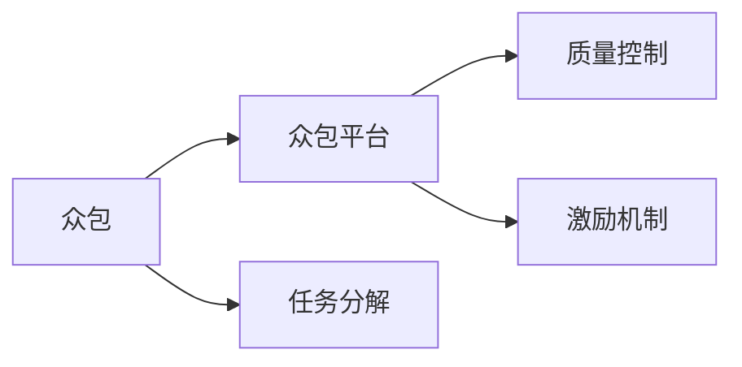

                 

## 1. 背景介绍

在当今科技日新月异、复杂多变的时代背景下，解决科技难题已成为推动社会进步和经济发展的重要驱动力。然而，许多科技难题涉及跨学科、跨领域的知识与技能，单个团队或个人难以独自应对。众包（Crowdsourcing）应运而生，通过集结全球众人的智慧，汇聚多方力量攻克科技难题。

### 1.1 问题由来

科技难题往往具有高度的复杂性和不确定性，且通常涉及众多学科和领域的交叉知识。单个研究团队或企业难以在短时间内整合所有必要资源。例如，基因编辑技术CRISPR的突破，就离不开跨领域专家的协作和数年不懈的努力。因此，众包成为一种有效的解决策略，通过调动全社会的智慧和资源，提升创新速度和效果。

### 1.2 问题核心关键点

众包的核心在于将问题分解为多个子任务，通过广泛收集具有相关知识和技能的志愿者来合作解决问题。这种分散化、多层次的协作模式，能够快速整合资源，实现集体智慧的最大化。

**核心概念：**
1. **任务分解**：将大问题分解为多个小问题或子任务。
2. **众包平台**：提供平台让志愿者发布任务、接收反馈和完成工作。
3. **众包市场**：形成专业化的众包平台，优化任务分配和费用支付。
4. **质量控制**：通过评估和反馈机制确保任务完成的准确性和效率。

这些关键点构成了众包的本质，使其成为现代科技难题解决的重要方法。

## 2. 核心概念与联系

### 2.1 核心概念概述

为了更好地理解众包的工作原理和优势，本节将介绍几个密切相关的核心概念：

- **众包（Crowdsourcing）**：通过互联网平台将任务分配给全球的志愿者，通过集体的智慧和努力，快速解决问题。
- **众包平台（Crowdsourcing Platform）**：提供在线服务的网站或应用程序，提供任务发布、跟踪和反馈的功能。
- **任务分解（Task Decomposition）**：将复杂问题拆解为多个子任务，以便更有效地分配和解决。
- **质量控制（Quality Control）**：通过评估机制确保众包结果的准确性和可靠性。
- **激励机制（Incentive Mechanism）**：通过物质或精神奖励，激励志愿者高效完成任务。

这些概念通过合纵连横，形成了一个有效的众包机制。以下是一个简化的Mermaid流程图，展示了这些概念之间的联系：



这个流程图展示了众包平台如何作为众包的核心组件，通过任务分解、质量控制和激励机制，确保众包过程的高效和准确。

## 3. 核心算法原理 & 具体操作步骤

### 3.1 算法原理概述

众包的核心算法原理可概括为以下几个步骤：

1. **任务发布**：将问题转化为可执行的任务，并在众包平台上发布。
2. **任务分解**：将任务进一步拆解为多个子任务，以提高效率和质量。
3. **任务分配**：将任务分配给具有相关知识和技能的志愿者。
4. **完成任务**：志愿者根据要求完成子任务。
5. **质量评估**：通过评估机制确认任务完成的质量，确保结果的可靠性。
6. **结果反馈**：将结果反馈给发布者，以供进一步分析或决策。

这些步骤构成了一个循环，确保众包过程的持续改进和优化。

### 3.2 算法步骤详解

以下将详细说明每个步骤的具体操作：

**Step 1: 任务发布**
- **问题定义**：明确问题描述和需求，确保任务清晰明确。
- **创建任务**：在众包平台上创建任务，设定任务的目标、期限、预期结果等。

**Step 2: 任务分解**
- **子任务划分**：将大问题拆解为多个小任务，如问题定义、数据收集、模型构建等。
- **任务描述**：为每个子任务提供详细说明和要求。

**Step 3: 任务分配**
- **筛选志愿者**：通过筛选机制，选择具有相关知识和技能的志愿者。
- **任务分配**：将任务分配给合适的志愿者，并设定完成期限和报酬。

**Step 4: 完成任务**
- **任务执行**：志愿者根据任务说明和要求，完成各自的任务。
- **提交结果**：将结果提交到众包平台，供评估和反馈。

**Step 5: 质量评估**
- **初步评估**：初步评估志愿者提交的结果，判断是否符合要求。
- **细化评估**：通过详细评估，确认结果的准确性和可靠性。

**Step 6: 结果反馈**
- **反馈机制**：建立反馈机制，收集志愿者和评估者的意见，用于改进和优化。
- **最终结果**：整合所有结果，得出最终解决方案。

### 3.3 算法优缺点

众包具有以下优点：
1. **成本低廉**：利用志愿者的专业知识，减少人力和资金成本。
2. **灵活高效**：任务可以迅速分配给多个志愿者，提高处理速度。
3. **多样性**：参与者来自全球各地，涵盖广泛的专业知识和技能。
4. **激励机制**：通过奖励机制，激发志愿者的积极性和创造力。

同时，众包也存在一些缺点：
1. **质量控制难度大**：评估和筛选工作复杂，难以保证所有任务的高质量完成。
2. **隐私和安全问题**：数据和任务内容可能涉及敏感信息，保护隐私和数据安全成为挑战。
3. **协调难度高**：众多志愿者和任务，难以实现有效的协调和管理。
4. **文化和语言障碍**：不同文化背景和语言习惯的参与者，可能影响任务的准确性和一致性。

尽管存在这些局限，但就目前而言，众包方法已成为解决科技难题的重要手段。未来相关研究的重点在于如何进一步优化众包流程，提升任务完成的效率和质量。

### 3.4 算法应用领域

众包技术已经广泛应用于科技创新的多个领域，以下是几个典型的应用场景：

- **软件开发**：通过众包平台，收集开源代码和补丁，快速推进软件更新和改进。
- **医学研究**：利用众包平台收集病例数据和分析结果，加速药物研发和新疗法探索。
- **环境科学**：收集全球环境数据，进行气候变化和生态系统分析。
- **公共政策**：通过众包平台收集民意和建议，制定更加科学的公共政策。
- **文化艺术**：众包平台用于艺术创作、文学创作和历史研究，激发创新灵感。

除了上述这些领域外，众包技术还在教育、商业、社会科学等多个领域得到了广泛应用，为科技创新的持续发展提供了强有力的支持。

## 4. 数学模型和公式 & 详细讲解 & 举例说明

### 4.1 数学模型构建

在本节中，我们将构建一个简单的数学模型来描述众包过程。设 $T$ 为任务集合，$W$ 为志愿者集合，$I$ 为任务分配的初始化信息，$S$ 为任务执行结果。

模型目标是通过优化分配策略，最大化任务完成的质量和效率。设 $f(T, W, I)$ 为任务完成的质量和效率的函数，目标函数为：

$$
\max_{W} f(T, W, I)
$$

约束条件包括：
- 任务分配的可行性约束：每个任务只能被分配给一个志愿者。
- 质量评估的可靠性约束：每个任务至少被一个志愿者完成，并经过多次评估确认。

### 4.2 公式推导过程

以下我们推导任务完成质量和效率的函数 $f(T, W, I)$。

假设每个任务的质量和效率可以用一个数值 $q_i$ 来表示，$q_i$ 的取值范围为 $[0, 1]$，其中 $0$ 表示最差质量，$1$ 表示最优质量。志愿者的能力和经验可以用一个数值 $w_j$ 来表示，$w_j$ 的取值范围也为 $[0, 1]$。设 $q_{ij}$ 表示志愿者 $j$ 完成第 $i$ 个任务的实际质量，则 $q_{ij}$ 可以表示为 $q_i$ 和 $w_j$ 的函数：

$$
q_{ij} = q_i f(w_j)
$$

其中 $f$ 为一个平滑的单调递增函数，用于描述志愿者能力对任务完成质量的影响。任务完成的效率可以用一个数值 $e_i$ 来表示，$e_i$ 的取值范围为 $[0, 1]$。假设志愿者 $j$ 完成第 $i$ 个任务的时间为 $t_{ij}$，则 $e_i$ 可以表示为：

$$
e_i = e_i \min_{j \in W} t_{ij}
$$

其中 $e_i$ 为一个单调递增函数，用于描述志愿者完成任务的速度。任务的总质量和总效率可以分别表示为：

$$
Q = \sum_{i \in T} q_i, \quad E = \sum_{i \in T} e_i
$$

众包过程的目标是最大化任务完成的质量和效率，因此目标函数为：

$$
\max_{W} f(T, W, I) = Q + \lambda E
$$

其中 $\lambda$ 为任务完成效率的权重，可以根据实际需求进行调整。

### 4.3 案例分析与讲解

为了更好地理解众包过程的数学模型，以下通过一个具体的案例进行详细分析。

**案例背景**：某企业需要开发一款新产品，涉及软件、硬件和市场分析等多个任务。企业希望通过众包平台，快速集结全球志愿者的智慧，解决技术难题。

**任务发布**：企业将产品开发任务发布到众包平台上，详细描述需求、目标和期限，设定任务质量标准和报酬。

**任务分解**：将任务分解为多个子任务，如需求分析、市场调研、软件编码、硬件设计等。

**任务分配**：根据志愿者的专业背景和历史表现，选择适合的志愿者，并将任务分配给他们。

**完成任务**：志愿者根据任务说明和要求，完成各自的任务。

**质量评估**：通过初步评估和细化评估，确认任务完成的质量和效率，确保结果的可靠性。

**结果反馈**：企业收集所有志愿者的反馈，整合结果，得出最终解决方案。

假设任务 $i$ 的质量和效率分别为 $q_i$ 和 $e_i$，志愿者的能力为 $w_j$，则任务完成的质量和效率函数可以表示为：

$$
f(T, W, I) = \sum_{i \in T} q_i f(w_j) + \lambda \sum_{i \in T} e_i
$$

通过优化 $f(T, W, I)$，可以找到最优的任务分配策略，使得总质量和总效率最大化。

## 5. 项目实践：代码实例和详细解释说明

### 5.1 开发环境搭建

在进行众包项目实践前，我们需要准备好开发环境。以下是使用Python进行Flask开发的环境配置流程：

1. 安装Anaconda：从官网下载并安装Anaconda，用于创建独立的Python环境。

2. 创建并激活虚拟环境：
```bash
conda create -n crowdsourcing-env python=3.8 
conda activate crowdsourcing-env
```

3. 安装Flask：
```bash
pip install Flask
```

4. 安装其他相关工具包：
```bash
pip install numpy pandas flask-restful
```

完成上述步骤后，即可在`crowdsourcing-env`环境中开始项目实践。

### 5.2 源代码详细实现

以下是一个简单的众包平台实现示例，包含任务发布、任务分解、任务分配、任务执行、任务评估和结果反馈等关键功能。

**任务发布**

```python
from flask import Flask, request, jsonify

app = Flask(__name__)

@app.route('/tasks', methods=['POST'])
def add_task():
    task = request.get_json()
    # 发布任务，保存任务信息到数据库
    return jsonify({'message': 'Task added successfully'}), 201
```

**任务分解**

```python
@app.route('/tasks/<task_id>/decompose', methods=['POST'])
def decompose_task(task_id):
    task = get_task(task_id)
    # 将大任务拆解为多个子任务
    return jsonify({'message': 'Task decomposed successfully'})
```

**任务分配**

```python
@app.route('/tasks/<task_id>/assign', methods=['POST'])
def assign_task(task_id):
    task = get_task(task_id)
    volunteer = request.get_json()['volunteer']
    # 分配任务给志愿者，更新任务状态
    return jsonify({'message': 'Task assigned successfully'})
```

**任务执行**

```python
@app.route('/tasks/<task_id>/complete', methods=['POST'])
def complete_task(task_id):
    task = get_task(task_id)
    # 志愿者完成任务，提交结果
    return jsonify({'message': 'Task completed successfully'})
```

**任务评估**

```python
@app.route('/tasks/<task_id>/review', methods=['POST'])
def review_task(task_id):
    task = get_task(task_id)
    volunteer = request.get_json()['volunteer']
    # 志愿者提交任务结果，评估任务质量
    return jsonify({'message': 'Task reviewed successfully'})
```

**结果反馈**

```python
@app.route('/tasks/<task_id>/feedback', methods=['POST'])
def feedback_task(task_id):
    task = get_task(task_id)
    volunteer = request.get_json()['volunteer']
    # 收集志愿者和评估者反馈，整合结果
    return jsonify({'message': 'Task feedback collected successfully'})
```

**启动服务**

```bash
flask run
```

以上就是一个简单的Flask实现示例，包含了众包平台的基本功能。开发者可以根据实际需求进行扩展和优化。

### 5.3 代码解读与分析

让我们再详细解读一下关键代码的实现细节：

**Flask应用**：
- 使用Flask框架创建Web应用，提供RESTful API接口。
- 通过路由函数处理请求，实现任务发布、任务分解、任务分配、任务执行、任务评估和结果反馈等功能。

**任务管理**：
- 通过数据库存储任务信息，使用SQLite或MySQL等关系型数据库。
- 使用ORM框架如SQLAlchemy，简化数据库操作。
- 提供API接口，支持任务信息的管理、查询和更新。

**任务分解**：
- 根据任务规模和复杂度，拆解为多个子任务。
- 对子任务进行详细描述和要求，确保志愿者能够理解任务。

**任务分配**：
- 根据志愿者的专业背景和历史表现，选择适合的志愿者。
- 将任务分配给志愿者，并设定完成期限和报酬。

**任务执行**：
- 志愿者根据任务说明和要求，完成各自的任务。
- 提交任务结果到众包平台，供评估和反馈。

**任务评估**：
- 通过初步评估和细化评估，确认任务完成的质量和效率，确保结果的可靠性。
- 提供API接口，支持任务结果的评估和确认。

**结果反馈**：
- 收集志愿者和评估者的反馈，整合结果。
- 提供API接口，支持结果的收集和整合。

**实际部署**：
- 使用Docker容器化应用，便于部署和管理。
- 使用Kubernetes等容器编排工具，实现自动化部署和扩展。
- 使用云平台如AWS、Google Cloud等，提供弹性计算和存储资源。

完成上述步骤后，即可在实际的众包平台上运行项目，进行任务发布、任务分解、任务分配、任务执行、任务评估和结果反馈等操作。

## 6. 实际应用场景

### 6.1 智能制造

智能制造是制造业未来的重要方向，涉及机器学习、自动化、数据分析等多个领域。通过众包平台，可以集结全球志愿者的智慧，快速解决智能制造中的各种技术难题。

例如，某智能制造企业需要在生产线上部署自动化系统，涉及机器视觉、传感器和数据处理等多个任务。企业可以通过众包平台，发布任务需求，选择志愿者进行技术攻关。志愿者通过任务分配和执行，完成各自的子任务，并提交结果。企业通过质量评估和反馈，整合结果，得出最终解决方案，推进自动化系统的部署和优化。

### 6.2 健康医疗

健康医疗是科技创新的重要领域，涉及基因测序、药物研发、医疗诊断等多个方面。通过众包平台，可以收集全球志愿者的专业知识和经验，解决健康医疗中的各种难题。

例如，某医药公司需要在短时间内完成新药的临床试验，涉及数据分析、实验设计和数据分析等多个任务。公司可以通过众包平台，发布任务需求，选择志愿者进行技术攻关。志愿者通过任务分配和执行，完成各自的子任务，并提交结果。公司通过质量评估和反馈，整合结果，得出最终解决方案，推进新药的开发和上市。

### 6.3 环境保护

环境保护是全球关注的重大问题，涉及生态学、气候科学、环境工程等多个领域。通过众包平台，可以集结全球志愿者的智慧，解决环境保护中的各种难题。

例如，某环保组织需要在全球范围内收集环境数据，进行气候变化和生态系统分析。组织可以通过众包平台，发布任务需求，选择志愿者进行数据收集和分析。志愿者通过任务分配和执行，完成各自的数据收集任务，并提交结果。组织通过质量评估和反馈，整合结果，得出全球环境变化的趋势和风险，制定环境保护策略。

### 6.4 未来应用展望

随着科技创新的不断推进，众包技术将在更多领域得到应用，为社会发展和进步提供新的动力。

在智慧城市建设中，通过众包平台，可以集结全球志愿者的智慧，解决城市管理中的各种难题。在科技创新中，通过众包平台，可以快速集结全球志愿者的智慧，解决科技难题，加速技术突破。在社会治理中，通过众包平台，可以收集全球志愿者的智慧和经验，提升社会治理的科学性和效率。

## 7. 工具和资源推荐

### 7.1 学习资源推荐

为了帮助开发者系统掌握众包技术的基本概念和实践方法，这里推荐一些优质的学习资源：

1. 《众包革命：开启集体智慧的新模式》：这本书详细介绍了众包技术的基本原理、应用案例和未来发展方向。
2. 《Crowdsourcing：参与式创新》：这本书探讨了众包技术的创新应用，提出了众包在企业、政府和社会的广泛应用。
3. 《Crowdsourcing in Data Science: Data Collection at Scale》：这本书介绍了如何使用众包平台进行大规模数据收集，并结合数据科学进行分析和应用。
4. 《Crowdsourcing on OpenAI》：这是OpenAI的官方博客，介绍了如何使用众包平台解决科技难题，分享了多个成功的案例。
5. Coursera上的《Crowdsourcing and Crowdfunding》课程：这是斯坦福大学开设的众包技术课程，涵盖了众包的基本原理和应用案例。

通过对这些资源的学习实践，相信你一定能够系统掌握众包技术的基本概念和实践方法，并将其应用于实际项目中。

### 7.2 开发工具推荐

高效的开发离不开优秀的工具支持。以下是几款用于众包开发的常用工具：

1. Flask：Python编写的Web框架，简单易用，适合快速开发API接口。
2. RESTful API：通过RESTful API接口，实现任务发布、任务分解、任务分配、任务执行、任务评估和结果反馈等功能。
3. MySQL/PostgreSQL：关系型数据库，支持众包任务和志愿者信息的管理和查询。
4. Docker：容器化应用，便于部署和管理。
5. Kubernetes：容器编排工具，实现弹性计算和扩展。
6. AWS/GCP：云平台，提供弹性计算和存储资源。

合理利用这些工具，可以显著提升众包开发和部署的效率，加快创新迭代的步伐。

### 7.3 相关论文推荐

众包技术的发展源于学界的持续研究。以下是几篇奠基性的相关论文，推荐阅读：

1. The Economic Value of Open Innovation in Technology: Pie in the Sky?（MIT Press Journals）：探讨了众包技术的经济价值，分析了众包在科技创新中的应用。
2. Crowdsourcing: A New Model for Scientific Collaboration（MIT Press Journals）：探讨了众包技术在科学协作中的应用，提出了众包平台的设计和优化方法。
3. Crowdsourcing Web-Based Tutoring Systems: Results of a Pilot Study（ACM Transactions on Education Technology）：探讨了众包技术在教育中的应用，提出了基于众包的教学系统设计。
4. Crowdsourcing Software Quality: An Empirical Analysis of the Developer Contribution（IEEE Transactions on Software Engineering）：探讨了众包技术在软件开发中的应用，分析了开发者贡献的效率和质量。
5. Crowdsourcing in Drug Discovery: A Systematic Review（BMC Medical Informatics and Decision Making）：探讨了众包技术在药物研发中的应用，分析了众包平台的设计和优化方法。

这些论文代表了大众包技术的发展脉络。通过学习这些前沿成果，可以帮助研究者把握学科前进方向，激发更多的创新灵感。

## 8. 总结：未来发展趋势与挑战

### 8.1 总结

本文对众包技术的基本概念和实践方法进行了全面系统的介绍。首先阐述了众包技术在解决科技难题中的重要作用，明确了众包在集结全球智慧和资源方面的独特优势。其次，从原理到实践，详细讲解了众包技术的基本流程和关键步骤，给出了具体的项目实践代码示例。同时，本文还广泛探讨了众包技术在智能制造、健康医疗、环境保护等多个行业领域的应用前景，展示了众包技术的广阔应用空间。

通过本文的系统梳理，可以看到，众包技术已经成为解决科技难题的重要手段。这种分散化、多层次的协作模式，能够快速整合资源，实现集体智慧的最大化，为科技创新提供了强有力的支持。未来，伴随众包技术的不断发展，相信将在更多领域得到广泛应用，推动社会发展和科技进步。

### 8.2 未来发展趋势

展望未来，众包技术将呈现以下几个发展趋势：

1. **平台化运营**：随着众包平台功能的完善，众包市场将进一步细化和专业化，平台化的运营模式将成为主流。
2. **智能化升级**：通过引入人工智能技术，优化任务分配和评估机制，提升众包效率和质量。
3. **跨领域融合**：众包技术与大数据、物联网、区块链等技术的融合，将进一步拓展其应用范围和能力。
4. **社区化发展**：众包平台将构建更加社区化的氛围，鼓励志愿者之间的交流和协作，形成生态化的协作网络。
5. **标准化建设**：制定众包平台的标准和规范，确保任务分配和结果评估的公平性和可靠性。

这些趋势凸显了众包技术的未来发展方向，将进一步提升众包系统的效率和效果，推动众包技术在更多领域的广泛应用。

### 8.3 面临的挑战

尽管众包技术已经取得了显著的成果，但在迈向更加智能化、普适化应用的过程中，它仍面临诸多挑战：

1. **数据隐私和安全**：众包平台涉及大量敏感数据，数据隐私和安全成为重要问题。如何保护数据隐私，避免数据泄露，将是未来的重要研究方向。
2. **任务协调和管理**：众多志愿者和任务，难以实现有效的协调和管理，任务分配和结果评估的公平性和可靠性仍需提升。
3. **技术壁垒和门槛**：众包平台需要较高的技术水平和专业背景，普通用户难以快速上手。如何降低技术门槛，提升用户体验，是未来的重要课题。
4. **质量控制和优化**：众包任务的完成质量受多种因素影响，难以完全保证。如何通过技术手段，优化任务分配和评估机制，提升任务完成质量，将是未来的研究方向。

尽管存在这些挑战，但通过学界和产业界的共同努力，未来的众包技术必将不断突破，解决更多的科技难题。

### 8.4 研究展望

面对众包技术面临的诸多挑战，未来的研究需要在以下几个方面寻求新的突破：

1. **智能化和自动化**：引入人工智能技术，优化任务分配和评估机制，提升众包效率和质量。
2. **数据隐私和安全**：采用隐私保护技术，保护数据隐私和安全，提升平台信任度。
3. **社区化和生态化**：构建更加社区化的众包平台，鼓励志愿者之间的交流和协作，形成生态化的协作网络。
4. **标准化和规范**：制定众包平台的标准和规范，确保任务分配和结果评估的公平性和可靠性。
5. **多模态融合**：将众包技术与大数据、物联网、区块链等技术进行融合，拓展其应用范围和能力。

这些研究方向的探索，必将引领众包技术迈向更高的台阶，为解决更多的科技难题提供强有力的支持。

## 9. 附录：常见问题与解答

**Q1：众包和开源有什么区别？**

A: 众包和开源都是通过集结多方智慧和资源来实现技术创新，但两者在协作方式和应用场景上有所不同。众包强调任务分解和志愿者参与，而开源则强调代码共享和社区协作。众包适用于解决具体的问题，而开源适用于构建软件系统。

**Q2：众包平台如何管理质量？**

A: 众包平台通过设置质量评估机制和激励机制来管理质量。评估机制包括初步评估和细化评估，确保任务完成的准确性和可靠性。激励机制通过物质或精神奖励，激励志愿者高效完成任务。平台还通过社区反馈和公开评价，提升任务完成的质量和透明度。

**Q3：众包平台如何保障数据隐私？**

A: 众包平台通过数据匿名化、加密传输和存储等方式，保障数据隐私。具体措施包括：
- 数据匿名化：对用户数据进行去标识化处理，保护用户隐私。
- 加密传输：采用SSL加密技术，确保数据传输的安全性。
- 加密存储：采用加密算法，保护数据存储的安全性。
- 访问控制：通过权限控制和审计日志，确保数据访问的合法性。

**Q4：众包平台如何确保公平性？**

A: 众包平台通过设置公平的任务分配和结果评估机制，确保公平性。具体措施包括：
- 随机分配任务：通过随机分配任务，避免任务分配的偏见。
- 多种评估方式：采用多种评估方式，确保评估的全面性和公正性。
- 公开评价：公开评价结果，确保任务完成的透明性和可信度。

**Q5：众包平台如何提升用户体验？**

A: 众包平台通过简化任务流程和优化用户界面，提升用户体验。具体措施包括：
- 简化任务流程：优化任务发布、任务分配、任务执行和任务反馈等环节，减少用户操作复杂度。
- 优化用户界面：设计简洁、易用的用户界面，提升用户操作体验。
- 提供技术支持：提供技术支持和指导，帮助用户快速上手使用平台。

这些措施将有助于提升众包平台的用户体验，促进众包技术在更多领域的广泛应用。

---

作者：禅与计算机程序设计艺术 / Zen and the Art of Computer Programming

