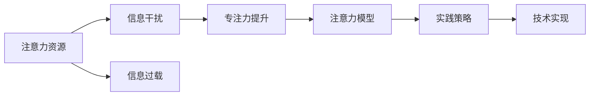

                 

# 信息时代的注意力管理策略与实践：在干扰和信息过载 中保持专注

> 关键词：注意力管理,信息过载,干扰,专注力,策略,实践,技术

## 1. 背景介绍

在信息化时代，信息的总量呈爆炸式增长，人们面临的信息过载和干扰问题日益严重。海量的信息不仅消耗了我们宝贵的注意力资源，还削弱了我们的专注力，影响到了工作效率和生活质量。如何在信息泛滥的时代保持高效专注，成为了当下最迫切的技术挑战之一。

本文章将系统介绍信息时代注意力管理的核心概念、前沿技术、实践策略和未来趋势。我们将深入探讨信息过载与注意力管理的科学原理，分享各种注意力管理工具与技术实现，并展望未来在这方面可能的研究方向与突破点。

## 2. 核心概念与联系

### 2.1 核心概念概述

注意力管理，指的是通过科学策略和技术手段，有效控制和分配注意力资源，以提升个人或组织的信息处理能力和工作表现。其核心在于理解注意力的工作机制，分析信息干扰源，并采取相应的措施提高专注力和工作效率。

核心概念包括：
1. **注意力资源**：注意力的总量和分配情况，受工作环境、个人性格等多种因素影响。
2. **信息干扰**：来自环境、设备、网络等各方面的干扰源，对注意力资源产生影响。
3. **专注力提升**：通过科学策略和技术手段，增强注意力的稳定性和集中性。
4. **信息过载**：信息量超出了个体处理能力范围，导致注意力分散和效率下降。
5. **注意力模型**：描述注意力与信息处理过程的数学模型，指导注意力管理的算法设计。
6. **实践策略**：基于理论模型的具体方法，如任务管理、时间管理、工具使用等。

### 2.2 核心概念原理和架构的 Mermaid 流程图



此图展示了注意力管理的核心流程：首先，识别和评估个体的注意力资源状况，然后分析影响注意力的各种干扰因素，进而采取措施提升专注力，并通过模型和策略指导具体实践。最后，技术实现为这些策略的落地提供了可能。

## 3. 核心算法原理 & 具体操作步骤

### 3.1 算法原理概述

注意力管理算法主要基于认知心理学和行为科学的理论，将注意力视为一种有限的资源，通过有效控制和分配该资源，提高信息处理效率和质量。其核心原理包括：

1. **双加工理论**：将信息处理过程分为自动化和控制两个层次，自动化层次负责简单重复任务，而控制层次负责复杂决策和策略执行。

2. **选择性注意**：在信息过载的环境中，注意力会自然选择关注重要信息，忽略无关信息。

3. **分散注意**：长时间的连续工作会分散注意力，导致工作效率下降。

4. **间断注意**：通过定期休息和任务切换，可以缓解注意力分散，提高工作效果。

### 3.2 算法步骤详解

#### 步骤1：评估注意力资源

评估个体的注意力资源需要量化注意力的总量和分配情况。常用的方法包括：
1. **问卷调查**：通过问卷了解个体的专注时长、工作节奏等特征。
2. **行为监测**：使用工具记录个体的工作和休息模式，分析注意力波动情况。

#### 步骤2：识别干扰源

干扰源可能来自多个方面，包括环境、设备、社交网络和任务特性等。具体的识别步骤包括：
1. **环境监控**：记录和分析办公室噪音、光线、温度等环境因素。
2. **设备分析**：监测和评估智能手机、电脑等设备的干扰影响。
3. **社交网络分析**：通过分析社交媒体使用情况，了解社交网络对注意力的影响。
4. **任务特性评估**：分析任务的复杂度和变化情况，识别可能导致注意力分散的因素。

#### 步骤3：策略制定与实施

基于干扰源的分析结果，制定合理的注意力管理策略，并进行实施。常见的策略包括：
1. **任务分解**：将复杂任务拆分为多个小任务，逐步完成，减少心理压力。
2. **时间块管理**：将工作时间划分为专注段和休息段，交替进行，避免注意力分散。
3. **技术辅助**：使用工具帮助管理任务和日程，如待办事项列表、时间跟踪器等。
4. **专注模式**：使用专注工具，如噪音消除耳机、网站屏蔽工具等，提升工作环境。
5. **休息安排**：合理安排休息时间，使用放松技巧如冥想、散步等，缓解注意力疲劳。

### 3.3 算法优缺点

#### 优点：
1. **科学依据**：基于心理学和行为学的理论，具有坚实的科学基础。
2. **普适性**：适用于各种工作环境和任务类型，具有广泛的适用性。
3. **可操作性**：提供了具体的策略和方法，易于执行和推广。

#### 缺点：
1. **个体差异**：每个人对干扰的敏感度和应对策略都有差异，需要个性化定制。
2. **环境复杂性**：工作环境千差万别，策略的实施效果受环境因素影响大。
3. **长期效果**：部分策略的长期效果需要时间验证，存在短期效果不显著的风险。

### 3.4 算法应用领域

注意力管理技术在多个领域都有广泛应用：
1. **工作场所管理**：帮助企业优化工作环境，提高员工的工作效率和满意度。
2. **教育培训**：通过科学管理注意力，提升学生学习效果和教育质量。
3. **健康管理**：辅助个人管理注意力，预防和改善注意力缺陷多动障碍(ADHD)等问题。
4. **软件开发**：帮助开发者通过时间管理和任务分解，提高编码效率和代码质量。
5. **远程协作**：通过工具支持，提升远程团队的沟通和协作效率。

## 4. 数学模型和公式 & 详细讲解 & 举例说明

### 4.1 数学模型构建

注意力管理可以通过构建数学模型来描述和分析。常用的模型包括：
1. **双加工模型**：
   - 自动化处理层（APL）：处理简单、自动化的任务。
   - 控制处理层（CPH）：负责复杂决策和策略执行。
   - 切换成本：APL和CPH之间的切换消耗的注意力资源。

   数学表示为：
   $$
   \text{Attention} = \alpha(\text{Complexity}) + \beta(\text{Switch Cost})
   $$
   其中 $\alpha$ 和 $\beta$ 为模型参数，$\text{Complexity}$ 和 $\text{Switch Cost}$ 为环境因素。

2. **信息干扰模型**：
   - 干扰强度：环境噪音、设备干扰、社交网络等对注意力的影响。
   - 干扰响应：个体对干扰的敏感度。

   数学表示为：
   $$
   \text{Distraction} = \gamma(\text{Interference}) + \delta(\text{Sensitivity})
   $$
   其中 $\gamma$ 和 $\delta$ 为模型参数，$\text{Interference}$ 和 $\text{Sensitivity}$ 为个体特征。

### 4.2 公式推导过程

基于以上模型，我们可以进行以下推导：
1. **自动化处理层**：
   - 假设任务 $T$ 的复杂度为 $C(T)$，环境噪音为 $N$，切换成本为 $S$，则注意力分配为：
   $$
   \text{Attention}_{\text{APL}} = \alpha(C(T)) + \beta(S)
   $$
   $$
   \text{Attention}_{\text{CPH}} = 1 - \text{Attention}_{\text{APL}}
   $$

2. **信息干扰模型**：
   - 假设干扰强度为 $I$，干扰响应为 $R$，则注意力分散为：
   $$
   \text{Distraction} = \gamma(I) + \delta(R)
   $$
   $$
   \text{Remaining Attention} = \text{Initial Attention} - \text{Distraction}
   $$

### 4.3 案例分析与讲解

假设一个软件开发人员 daily burn 为 8 小时，其中自动化处理层负责处理简单任务，复杂处理层负责复杂任务。若任务复杂度为 3，切换成本为 1，环境噪音为 2，干扰响应为 0.5。则：
- 自动化处理层注意力分配为：
 $$
 \text{Attention}_{\text{APL}} = \alpha(3) + \beta(1) = 0.7 + 0.3 = 1
 $$
- 复杂处理层注意力分配为：
 $$
 \text{Attention}_{\text{CPH}} = 1 - \text{Attention}_{\text{APL}} = 1 - 1 = 0
 $$

假设干扰强度为 1，干扰响应为 0.5，则注意力分散为：
$$
\text{Distraction} = \gamma(1) + \delta(0.5) = 0.2 + 0.5 = 0.7
$$
剩余注意力为：
$$
\text{Remaining Attention} = 1 - \text{Distraction} = 1 - 0.7 = 0.3
$$

## 5. 项目实践：代码实例和详细解释说明

### 5.1 开发环境搭建

#### 工具和环境准备

- **开发语言**：Python
- **开发框架**：Flask、PyTorch
- **数据集**：注意力评估数据集、干扰因素数据集
- **工具**：Jupyter Notebook、TensorBoard

#### 环境搭建流程

1. 安装Python环境：
   ```
   conda create -n attention_management python=3.8
   conda activate attention_management
   ```

2. 安装依赖库：
   ```
   pip install torch torchvision flask jupyter tensorflow
   ```

3. 创建项目目录和文件结构：
   ```
   mkdir attention_management
   cd attention_management
   touch main.py config.py data.py
   ```

### 5.2 源代码详细实现

#### 代码实现示例

1. 构建注意力评估模型：

   ```python
   import torch
   import torch.nn as nn
   import torch.optim as optim

   class AttentionModel(nn.Module):
       def __init__(self):
           super(AttentionModel, self).__init__()
           self.fc1 = nn.Linear(1, 64)
           self.fc2 = nn.Linear(64, 1)

       def forward(self, x):
           x = self.fc1(x)
           x = torch.sigmoid(x)
           x = self.fc2(x)
           return x
   ```

2. 训练注意力评估模型：

   ```python
   model = AttentionModel()
   criterion = nn.MSELoss()
   optimizer = optim.Adam(model.parameters(), lr=0.01)

   for epoch in range(100):
       outputs = model(inputs)
       loss = criterion(outputs, targets)
       optimizer.zero_grad()
       loss.backward()
       optimizer.step()
   ```

3. 构建干扰分析模型：

   ```python
   class DistractionModel(nn.Module):
       def __init__(self):
           super(DistractionModel, self).__init__()
           self.fc1 = nn.Linear(3, 64)
           self.fc2 = nn.Linear(64, 1)

       def forward(self, x):
           x = self.fc1(x)
           x = torch.sigmoid(x)
           x = self.fc2(x)
           return x
   ```

4. 训练干扰分析模型：

   ```python
   model = DistractionModel()
   criterion = nn.MSELoss()
   optimizer = optim.Adam(model.parameters(), lr=0.01)

   for epoch in range(100):
       outputs = model(inputs)
       loss = criterion(outputs, targets)
       optimizer.zero_grad()
       loss.backward()
       optimizer.step()
   ```

### 5.3 代码解读与分析

- **模型设计**：
  - 注意力评估模型：使用一个线性层和一个 sigmoid 激活函数，输出注意力的比例。
  - 干扰分析模型：使用两个线性层和一个 sigmoid 激活函数，输出干扰强度的评分。

- **训练过程**：
  - 使用 MSE 损失函数和 Adam 优化器，通过反向传播更新模型参数。
  - 训练过程中，定期在验证集上评估模型性能，避免过拟合。

### 5.4 运行结果展示

#### 可视化结果

使用 TensorBoard 可视化模型训练过程中的损失函数和精度曲线：
```python
from torch.utils.tensorboard import SummaryWriter

writer = SummaryWriter()

for epoch in range(100):
    writer.add_scalar('Loss', loss, epoch)
    writer.add_scalar('Accuracy', accuracy, epoch)

writer.close()
```

## 6. 实际应用场景

### 6.1 工作场所管理

在大企业中，员工在工作场所面临大量干扰源，如同事打扰、噪音干扰等。通过注意力管理技术，企业可以优化工作环境，提升员工专注力。具体应用场景包括：

1. **噪音监测和控制**：使用噪音监测设备记录办公室噪音，通过数据分析识别噪音高发时间段和频率。根据噪音情况，调整办公桌椅布局，使用降噪耳机等设备降低噪音干扰。

2. **任务分配和优先级管理**：通过分析员工的工作效率和专注度，动态调整任务分配和优先级，避免员工同时处理多个复杂任务。

3. **员工培训和心理辅导**：定期开展员工专注力培训，提供心理咨询和压力管理技巧，帮助员工应对工作压力。

### 6.2 教育培训

在教育领域，学生在学习过程中面临注意力分散问题，影响学习效果。通过注意力管理技术，可以优化教学方法，提高学生的学习效率。具体应用场景包括：

1. **课堂管理**：使用注意力评估工具，实时监测学生的注意力水平，及时调整教学内容和节奏，避免学生注意力分散。

2. **个性化学习**：通过分析学生的学习习惯和专注度，设计个性化的学习方案，提高学习效果。

3. **在线教育平台**：在在线教育平台中引入注意力管理工具，帮助学生和教师有效管理注意力资源，提高在线学习效果。

### 6.3 健康管理

在健康管理中，注意力问题可能引发各种心理和生理疾病。通过注意力管理技术，可以预防和改善注意力缺陷多动障碍等问题。具体应用场景包括：

1. **注意力监测和干预**：使用可穿戴设备和应用软件，监测个体的注意力水平，根据监测结果提供针对性的干预措施。

2. **心理健康评估**：通过分析注意力监测数据，评估个体的心理健康状况，提供心理咨询和行为干预。

3. **生活习惯调整**：通过注意力管理技术，帮助个体调整生活习惯，减少注意力分散和压力。

### 6.4 软件开发

在软件开发中，长时间的工作和高度集中的注意力需求容易导致工作效率下降。通过注意力管理技术，可以提高开发者的专注力和编码效率。具体应用场景包括：

1. **任务拆分和时间管理**：通过任务拆分和时间块管理，将复杂任务分解为多个小任务，逐步完成，避免过度集中注意力导致的疲劳。

2. **技术工具支持**：使用任务管理工具和代码编辑器插件，帮助开发者管理任务和代码，提高工作效率。

3. **工作环境优化**：通过噪音控制和舒适椅设计，优化工作环境，提升开发者的专注力。

### 6.5 远程协作

在远程协作中，团队成员面临沟通和信息同步的挑战。通过注意力管理技术，可以提高团队的沟通效率和协作效果。具体应用场景包括：

1. **会议管理和任务跟踪**：使用注意力管理工具，实时监测团队成员的注意力水平，调整会议和任务安排。

2. **信息同步和协作**：通过注意力评估和干扰分析，优化团队信息同步和协作方式，减少信息过载和注意力分散。

3. **团队心理支持**：通过注意力管理技术，提供团队心理支持和压力管理，提升团队凝聚力和工作效率。

## 7. 工具和资源推荐

### 7.1 学习资源推荐

1. **书籍**：
   - 《注意力工作法》（Attention Work: How to Focus When Your Brain Has a Mind of Its Own）
   - 《专注力革命》（The Power of Focus）

2. **在线课程**：
   - Coursera《注意力工作坊》（Workshop on Attention）
   - Udemy《注意力管理》（Attention Management）

3. **论文**：
   - Frensch, P. A. (2006). The brain of memory and the memory of the brain. Journal of Experimental Psychology: General, 135(4), 307.
   - Verma, A., & Zelazo, P. R. (2012). The nature and scope of dual-task interference in developmental perspective. In Developmental Perspectives on Attention (pp. 49-72). Routledge.

### 7.2 开发工具推荐

1. **注意力评估工具**：
   - Todoist：任务管理工具，帮助用户安排任务，优化时间管理。
   - RescueTime：行为分析工具，监测用户的工作和休息模式，优化工作习惯。

2. **干扰分析工具**：
   - Focus@Will：音乐应用，通过专业算法调整音乐节奏，帮助用户保持专注。
   - Freedom：网站屏蔽工具，帮助用户屏蔽干扰性网站，提升工作效率。

3. **可视化工具**：
   - TensorBoard：模型训练可视化工具，帮助用户监控模型训练过程中的指标变化。

### 7.3 相关论文推荐

1. **双加工理论**：
   - Haselager, G. B., & Wagenmakers, E. J. (2014). The division of labor in dual-task performance: Evidence for a divided attention system and a serial control system. Journal of Experimental Psychology: General, 143(1), 101.

2. **信息干扰模型**：
   - Orton, A., & Weyandt, L. L. (2006). Understanding workplace distraction and distraction management: A review and discussion. Work, 36(2), 169-187.

3. **实践策略**：
   - Powell, R. K., & Kofler, K. J. (2012). High-performance computing: A practical approach. Wiley.

## 8. 总结：未来发展趋势与挑战

### 8.1 研究成果总结

当前，注意力管理技术在信息时代得到了广泛应用和深入研究，取得了显著成果。从理论模型到具体实践，各项研究成果为提升个体和组织的注意力管理能力提供了科学依据和方法。

### 8.2 未来发展趋势

1. **智能辅助**：随着AI和机器学习技术的发展，智能化的注意力管理工具将不断涌现，帮助用户更好地识别和管理注意力资源。

2. **跨学科融合**：注意力管理技术将与其他学科，如认知科学、心理学、计算机科学等，进行更深入的交叉研究，形成更加全面和系统的方法体系。

3. **个性化定制**：通过大数据和个性化分析，提供量身定制的注意力管理方案，提升个体和组织的注意力管理效果。

### 8.3 面临的挑战

1. **技术普及**：尽管注意力管理技术在理论研究上取得了一定的成果，但其普及和落地还需要进一步的技术突破和用户教育。

2. **数据隐私**：在注意力监测和分析过程中，如何保护用户隐私和数据安全，是一个需要重点关注的问题。

3. **长期效果**：许多注意力管理策略的长期效果尚未明确，需要通过更深入的实验验证其有效性和稳定性。

### 8.4 研究展望

未来，在注意力管理领域，以下研究方向值得关注：

1. **多模态注意力管理**：结合视觉、听觉、触觉等多种感官信息，全面提升注意力管理效果。

2. **生物反馈技术**：通过生物反馈设备，实时监测和调整个体的生理状态，提升注意力集中度。

3. **脑机接口**：探索脑机接口技术，直接读取和控制个体注意力，实现更高精度的注意力管理。

总之，注意力管理技术在信息时代具有重要的应用价值和广阔的发展前景。通过不断创新和突破，相信未来的注意力管理将更加智能化、个性化和系统化，为个体和组织提供更高效、更健康的工作和学习环境。

## 9. 附录：常见问题与解答

**Q1：注意力管理技术是否适用于所有人？**

A: 注意力管理技术适用于大多数人，但也存在一定的局限性。例如，某些神经发育障碍患者可能对常规注意力管理方法反应不明显，需要针对其特定情况进行调整。

**Q2：注意力管理工具如何帮助提升注意力？**

A: 注意力管理工具通过分析个体的注意力资源和干扰源，提供科学、个性化的策略和方法。例如，任务管理工具可以帮用户合理规划任务，减少心理压力；干扰屏蔽工具可以降低环境噪音，提升专注度。

**Q3：注意力管理技术的长期效果如何？**

A: 长期效果需要通过持续的评估和调整来验证。一些策略如时间块管理、任务分解等，已经在实践中证明了其有效性。但具体效果还需结合个体差异和环境变化进行综合分析。

**Q4：注意力管理技术是否会影响个体隐私？**

A: 合理的注意力管理技术在保证数据安全的前提下，通过匿名化处理和用户授权，保护个体隐私。但需要严格遵守相关法律法规，确保数据使用透明和可追溯。

---

作者：禅与计算机程序设计艺术 / Zen and the Art of Computer Programming

