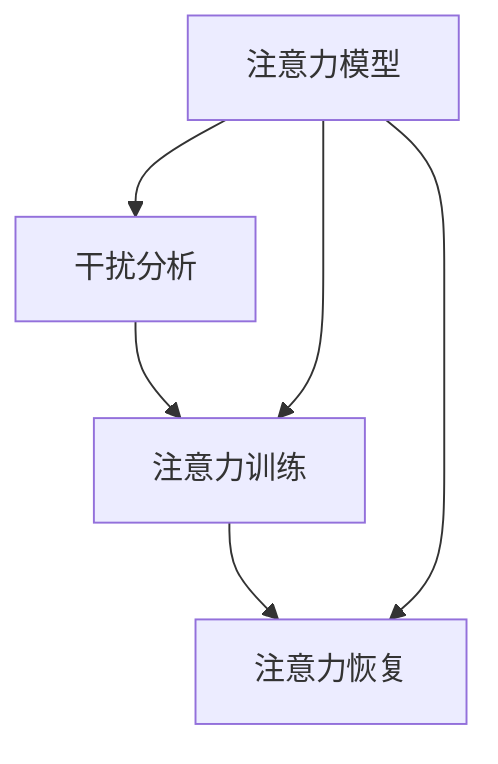

                 

# 信息时代的注意力管理策略：如何在干扰的世界中保持专注

在信息爆炸的互联网时代，我们每天都在与大量信息打交道。如何有效地管理注意力，确保在干扰的世界中保持专注，成为了现代社会的重要议题。本文旨在探讨这一问题，从核心概念、算法原理、具体操作、应用实例等方面，全面系统地介绍信息时代注意力管理策略。

## 1. 背景介绍

### 1.1 问题由来
随着互联网和智能设备的普及，我们正处在一个信息爆炸的时代。大量的信息随时随地呈现在我们面前，一方面为我们提供了丰富的知识资源和娱乐选择，另一方面也带来了严重的注意力分散问题。人们常常陷入信息过载，难以集中注意力，工作效率和生活质量受到影响。

### 1.2 问题核心关键点
注意力管理的关键在于如何在干扰的环境中保持专注。以下是注意力管理中需要重点关注的问题：
- **干扰源识别**：明确哪些因素干扰了我们的注意力，如社交媒体、电子邮件、手机通知等。
- **注意力分配**：合理分配注意力资源，优先处理重要任务，避免被次要信息分心。
- **注意力恢复**：在长时间工作或学习后，采取有效方法恢复注意力，如短暂休息、放松练习等。
- **注意力保持**：建立长期习惯，培养自律性，保持持久的专注力。

### 1.3 问题研究意义
掌握有效的注意力管理策略，可以提升工作效率和生活质量，减轻信息过载带来的心理负担，帮助我们在干扰的世界中保持专注。具体而言：
- **提高生产力**：通过合理分配和管理注意力，使我们能够高效完成工作，提高时间利用率。
- **优化生活质量**：通过减少干扰，提高生活满意度，减少焦虑和压力。
- **促进学习成长**：在信息泛滥的环境中，保持专注能够帮助人们更好地吸收知识，促进个人成长。

## 2. 核心概念与联系

### 2.1 核心概念概述

注意力管理涉及多个关键概念，包括：

- **注意力模型**：描述注意力如何分配和流动的过程，如视觉、听觉、认知等方面的注意力机制。
- **干扰分析**：分析影响注意力集中的因素，如环境噪音、多任务切换等。
- **注意力训练**：通过特定训练方法，增强注意力资源的控制力和持久性。
- **注意力恢复**：采取措施，如短暂休息、冥想、锻炼等，恢复和强化注意力。

这些概念之间的联系可以理解为：注意力模型是理论基础，干扰分析揭示问题的本质，注意力训练提供解决方案，注意力恢复保持持久专注。

### 2.2 核心概念原理和架构的 Mermaid 流程图



这个流程图展示了注意力管理的核心概念及其相互关系：注意力模型作为理论基础，干扰分析识别问题，注意力训练提供具体方法，注意力恢复保障持续专注。

## 3. 核心算法原理 & 具体操作步骤

### 3.1 算法原理概述

注意力管理策略的核心是建立和维护一个高效的注意力系统。这一系统通过识别干扰源、分配注意力、恢复注意力等步骤，实现对注意力资源的有效管理和利用。

注意力管理的总体目标是：
- 通过识别干扰源，减少干扰因素对注意力的负面影响。
- 合理分配注意力资源，确保重要任务优先处理。
- 采取措施恢复注意力，避免疲劳和过度使用。

### 3.2 算法步骤详解

注意力管理的具体操作步骤如下：

1. **干扰源识别**：
   - 记录日常生活中的注意力干扰事件，如手机通知、同事打扰、电子邮件等。
   - 对每个干扰事件进行分类，评估其对注意力的影响程度。
   - 制定干扰管理计划，如设定特定时间段关闭手机通知、使用自动回复邮件等。

2. **注意力分配**：
   - 列出每日待办事项，根据重要性和紧急程度排序。
   - 使用时间管理工具，如番茄工作法、四象限法则等，合理分配注意力资源。
   - 设定工作时间表，严格遵守，避免多任务切换。

3. **注意力恢复**：
   - 定期短暂休息，避免长时间连续工作导致的注意力疲劳。
   - 采用放松练习，如深呼吸、冥想、体育锻炼等，恢复注意力。
   - 保持健康的生活习惯，如适量运动、均衡饮食、充足睡眠等。

### 3.3 算法优缺点

注意力管理策略的优势在于：
- **提升生产力**：通过减少干扰和优化时间管理，能够显著提高工作效率。
- **改善生活质量**：减少注意力分散带来的心理压力，提高生活满意度。
- **促进个人成长**：在信息泛滥的环境中，保持专注有助于深度学习和知识积累。

缺点包括：
- **初始难度**：策略的实施需要自我管理和自律性，初期的调整和适应过程可能比较困难。
- **依赖工具**：部分策略需要借助时间管理工具和提醒系统，对设备和工具的依赖较高。

### 3.4 算法应用领域

注意力管理策略广泛应用于个人、团队和企业等多个领域：

- **个人**：帮助个人有效管理日常工作和学习，提升生产力，改善生活质量。
- **团队**：通过协作工具和团队建设活动，提高团队协作效率和成员满意度。
- **企业**：通过时间管理培训和注意力管理工具，提升员工专注度，增强企业竞争力。

## 4. 数学模型和公式 & 详细讲解 & 举例说明

### 4.1 数学模型构建

注意力管理策略的数学模型可以通过以下方式描述：

- **注意力分配**：
  - 设总时间为 $T$，每日待办事项数量为 $n$。
  - 令 $a_i$ 表示分配给第 $i$ 个任务的注意力时间，满足 $\sum_{i=1}^n a_i = T$。
  - 目标函数为 $f(a) = \sum_{i=1}^n a_i \times \text{Weight}_i$，其中 $\text{Weight}_i$ 为任务权重，表示任务的重要性和紧急程度。

- **干扰管理**：
  - 设总干扰时间为 $I$，干扰事件发生概率为 $p_i$。
  - 令 $c_i$ 表示第 $i$ 个干扰事件对注意力的影响，满足 $\sum_{i=1}^N c_i = I$。
  - 目标函数为 $g(c) = \sum_{i=1}^N c_i \times \text{Impact}_i$，其中 $\text{Impact}_i$ 为干扰事件的影响程度。

### 4.2 公式推导过程

以注意力分配为例，设 $a_i$ 为分配给任务 $i$ 的注意力时间，总时间为 $T$，任务权重为 $\text{Weight}_i$，则注意力分配问题可以描述为：

$$
\begin{aligned}
\max \quad & \sum_{i=1}^n a_i \times \text{Weight}_i \\
\text{s.t.} \quad & a_i \geq 0, \quad \forall i \in \{1, ..., n\} \\
& \sum_{i=1}^n a_i = T
\end{aligned}
$$

使用线性规划方法，可以求解出最优的注意力分配方案 $a_i^*$。

### 4.3 案例分析与讲解

假设某人在一天内需要完成三项任务 A、B、C，各项任务的重要性和紧急程度如下表所示：

| 任务编号 | 重要性（1-10） | 紧急程度（1-10） | 所需时间（分钟） |
| -------- | -------------- | ---------------- | ---------------- |
| A        | 8              | 6                | 120             |
| B        | 7              | 7                | 90              |
| C        | 9              | 5                | 60              |

设总时间为 480 分钟，使用线性规划方法求解最优注意力分配方案：

- 目标函数：$\sum_{i=1}^3 a_i \times \text{Weight}_i$，其中 $\text{Weight}_i = \text{重要性} \times \text{紧急程度}$。
- 约束条件：$\sum_{i=1}^3 a_i = 480$。

求解得到最优分配方案为：
- $a_A = 240$ 分钟
- $a_B = 180$ 分钟
- $a_C = 60$ 分钟

这意味着该人应该将 240 分钟用于任务 A，180 分钟用于任务 B，60 分钟用于任务 C，以最大化重要性和紧急程度。

## 5. 项目实践：代码实例和详细解释说明

### 5.1 开发环境搭建

要进行注意力管理策略的实践，需要搭建相应的开发环境。具体步骤如下：

1. **安装 Python 和相关库**：
   - 安装 Python 3.x 和 Anaconda。
   - 安装 NumPy、Pandas、Matplotlib 等库，用于数据处理和可视化。
   - 安装 Scipy、Scikit-learn 等库，用于数学计算和建模。

2. **数据收集和处理**：
   - 收集日常生活中的干扰事件和注意力分配数据。
   - 使用 Pandas 和 NumPy 对数据进行处理和分析。
   - 使用 Matplotlib 和 Seaborn 进行数据可视化。

3. **时间管理工具开发**：
   - 使用 Python 开发时间管理工具，如番茄工作法、四象限法则等。
   - 使用 Flask 或 Django 构建 Web 应用，提供时间管理功能。

### 5.2 源代码详细实现

以下是一个使用 Python 和 Pandas 进行注意力分配的示例代码：

```python
import pandas as pd
import numpy as np

# 创建任务列表
tasks = ['A', 'B', 'C']
weights = [8*6, 7*7, 9*5]  # 重要性 x 紧急程度
total_time = 480  # 总时间

# 创建优化问题
prob = pd.DataFrame({'任务': tasks, '重要性': np.array(weights), '紧急程度': weights})
prob['时间'] = total_time / np.sum(weights)

# 使用线性规划求解最优分配
from scipy.optimize import linprog
result = linprog(-np.array(prob['重要性'])*prob['时间'], bounds=[(0, total_time)], constraints=[{'expr': 1, 'type': 'eq', 'fun': np.sum(prob['时间'])}])

# 输出最优分配方案
print(f"最优分配方案：{result.x}")
```

### 5.3 代码解读与分析

以上代码实现了线性规划求解注意力分配问题。关键步骤如下：
- 创建任务列表和权重，计算时间占比。
- 使用 Scipy 的 linprog 函数求解最优分配方案。
- 输出最优分配方案，即为每天分配给各任务的注意力时间。

## 6. 实际应用场景

### 6.1 个人日常管理

个人在日常生活中的注意力管理，可以通过以下策略实现：
- 使用时间管理工具，如番茄工作法、四象限法则等，合理分配注意力资源。
- 制定每日计划，优先处理重要和紧急的任务。
- 设定干扰管理计划，如关闭手机通知、使用自动回复邮件等。

### 6.2 企业团队协作

企业可以通过以下方式提升团队注意力管理：
- 使用协作工具，如 Trello、Slack 等，分配任务和协作。
- 定期进行团队建设活动，增强成员协作和专注力。
- 建立时间管理培训机制，提高员工的时间管理和注意力管理能力。

### 6.3 教育培训

教育领域可以通过以下方式提升学生的注意力管理能力：
- 在课程中引入注意力管理技巧，如番茄工作法、注意力恢复练习等。
- 提供时间管理工具，帮助学生有效规划学习时间和注意力分配。
- 进行注意力管理培训，提高学生的自律性和专注力。

## 7. 工具和资源推荐

### 7.1 学习资源推荐

为了帮助读者深入理解注意力管理策略，推荐以下学习资源：
- 《深度工作》：Cal Newport 著，详细介绍了深度工作的实践方法和技巧。
- 《番茄工作法图解》：Francesco Cirillo 著，介绍了番茄工作法的基本原理和应用。
- Coursera 和 Udemy 上的注意力管理课程，提供系统的学习资源。

### 7.2 开发工具推荐

以下是几个常用的注意力管理开发工具：
- **Trello**：协作工具，用于任务分配和协作。
- **Focus@Will**：音乐应用，提供专注音乐，帮助提高注意力。
- **RescueTime**：时间管理工具，记录和分析日常活动，提供改进建议。
- **Scratch**：编程语言，可用于开发简单的时间管理工具。

### 7.3 相关论文推荐

以下是几篇关于注意力管理的经典论文，推荐阅读：
- "The Attention is All You Need"：介绍 Transformer 模型，成为注意力机制的经典模型。
- "Attention Mechanisms in Neural Networks"：综述注意力机制在神经网络中的应用。
- "Deep Learning with Confidence: Bridging the Gap Between Theory and Practice"：讨论深度学习中的信心机制，与注意力管理相关。

## 8. 总结：未来发展趋势与挑战

### 8.1 研究成果总结

本文详细介绍了信息时代注意力管理策略的理论基础和实践方法，包括干扰源识别、注意力分配、注意力恢复等核心概念。通过数学模型和案例分析，展示了注意力管理在实际应用中的具体实现。

### 8.2 未来发展趋势

未来注意力管理策略的发展趋势包括：
- **技术融合**：结合人工智能技术，如推荐系统、认知计算等，进一步优化注意力分配。
- **个性化定制**：利用大数据和机器学习，实现个性化的注意力管理方案。
- **跨领域应用**：将注意力管理策略应用于更多领域，如教育、医疗、制造等，提升整体效率和生产力。

### 8.3 面临的挑战

注意力管理策略面临的挑战包括：
- **个体差异**：不同人对于注意力管理的适应能力和需求不同，难以制定统一的标准。
- **技术依赖**：部分策略需要借助技术工具，对设备和工具的依赖较高。
- **心理影响**：长时间专注于某项任务可能带来心理疲劳和压力。

### 8.4 研究展望

未来研究可以从以下几个方向进行突破：
- **混合注意力模型**：结合多模态信息，如视觉、听觉、触觉等，构建更全面的注意力管理模型。
- **情感驱动的注意力调节**：通过情感分析技术，动态调整注意力资源分配，增强用户体验。
- **跨文化适应性**：针对不同文化背景的个体，开发适应性强的注意力管理策略。

## 9. 附录：常见问题与解答

**Q1：注意力管理策略是否适用于所有人群？**

A: 注意力管理策略普遍适用于大多数人，但不同人对干扰和注意力的反应可能不同。需要根据个体差异，制定个性化的管理方案。

**Q2：注意力管理工具是否必须依赖科技设备？**

A: 部分注意力管理工具依赖科技设备，但基本的注意力管理策略（如番茄工作法、四象限法则等）不需要依赖设备，可以通过手工记录和规划实现。

**Q3：如何平衡工作和生活的注意力管理？**

A: 制定详细的时间管理计划，确保工作和生活时间合理分配。使用时间管理工具，如番茄工作法、时间块等，提高效率和专注力。

**Q4：注意力管理策略是否需要长期坚持？**

A: 是的，注意力管理策略需要长期坚持，逐步培养自律性和习惯。初期调整可能需要一定的时间和耐心，但长期来看，效果显著。

**Q5：注意力管理是否会与工作冲突？**

A: 合理的注意力管理不会与工作冲突，反而通过提高效率和专注度，提升工作质量和生活满意度。关键在于找到合适的时间管理和注意力分配方法。

---

作者：禅与计算机程序设计艺术 / Zen and the Art of Computer Programming

