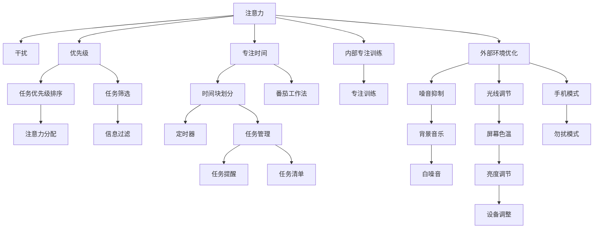

                 

# 信息时代的注意力管理：如何在干扰中保持高效

## 1. 背景介绍

### 1.1 问题由来
随着信息时代的到来，海量的数据和信息流不断冲击我们的注意力系统。无论是社交媒体、新闻推送、电子邮件还是在线会议，每一个设备、每一次点击、每一次输入，都在争夺我们的时间。注意力作为一种有限的认知资源，一旦分散，便难以集中。面对各种干扰，如何保持高效成为现代信息工作者亟需解决的问题。

### 1.2 问题核心关键点
注意力管理，即在信息泛滥的环境中，通过技术手段合理分配和管理我们的注意力，避免干扰，提高工作和学习的效率。核心点包括：
- 任务优先级排序
- 专注时间管理
- 外部环境优化
- 内部专注训练

### 1.3 问题研究意义
注意力管理技术对于提升个人工作效率、减少信息过载带来的压力、提高生活质量具有重要意义：

1. 提升工作效率：通过合理分配注意力资源，实现任务优先级排序，帮助用户集中精力于关键任务，提升整体效率。
2. 减轻信息过载：通过任务筛选、环境优化等手段，帮助用户识别和过滤无用信息，减轻信息过载带来的认知负担。
3. 提高生活质量：合理管理注意力，有助于用户在工作、学习、生活之间找到平衡，保持身心健康。
4. 促进生产力工具的发展：相关技术的发展将推动一系列新工具、新产品的涌现，进一步提高生产力和用户体验。

## 2. 核心概念与联系

### 2.1 核心概念概述

注意力管理涉及多个关键概念，如下：

- **注意力**：认知心理学的概念，指人脑对特定信息或刺激的聚焦和集中。
- **干扰**：外部或内部因素对注意力的分流和破坏，如通知弹窗、同事打扰等。
- **优先级**：基于任务的重要性和紧急性，对任务进行排序，决定注意力分配。
- **专注时间**：一定时间内，不受到任何干扰，集中精力于当前任务的时间段。
- **工具**：通过技术手段，如应用、插件、软件等，辅助进行注意力管理。

这些概念之间通过相互影响、相互制约构成一个系统的注意力管理框架。

### 2.2 核心概念原理和架构的 Mermaid 流程图



这个流程图展示了注意力管理的关键环节，从识别干扰、任务优先级排序、专注时间管理、内部专注训练到外部环境优化，逐步构建起一个全面的注意力管理系统。

## 3. 核心算法原理 & 具体操作步骤

### 3.1 算法原理概述
注意力管理的核心算法原理基于以下几个方面：

1. **任务优先级排序**：根据任务的紧急性和重要性，使用基于优先级的任务管理方法，如Eisenhower矩阵、ABC分析等，决定注意力的分配顺序。
2. **专注时间管理**：利用番茄工作法、Pomodoro技术等，通过定时器将时间划分为专注段和休息段，确保专注时间不被干扰。
3. **干扰识别与过滤**：通过信息过滤技术，识别并屏蔽干扰性通知、邮件等，减少信息流对注意力的影响。
4. **内部专注训练**：通过冥想、专注力训练等方法，提升用户的内在专注能力，减少外界干扰的负面影响。
5. **外部环境优化**：调整工作环境，减少噪音、光线、设备干扰，提高工作效率。

### 3.2 算法步骤详解

**Step 1: 任务优先级排序**

1. 评估所有待办任务，根据任务的紧急性和重要性，使用Eisenhower矩阵进行分类。将任务分为四类：紧急且重要、重要不紧急、紧急不重要、不紧急不重要。
2. 对于紧急且重要的任务，立即执行。对于重要不紧急的任务，安排在专注时间段内完成。
3. 对于紧急但不重要的任务，优先级排序后可将其处理。
4. 对于不紧急且不重要的任务，考虑是否推迟或放弃。

**Step 2: 专注时间管理**

1. 使用番茄工作法，将时间划分为25分钟的专注时间和5分钟的休息时间。
2. 专注时间段内，关闭所有非必要的通知和应用，专注于当前任务。
3. 休息时间段内，可以做一些伸展、喝水的活动，缓解疲劳，为下一个专注时间段做好准备。

**Step 3: 干扰识别与过滤**

1. 开启勿扰模式，屏蔽手机、邮件、消息通知等干扰源。
2. 使用信息过滤工具，如邮件客户端的垃圾邮件过滤、社交媒体的静音模式等，减少无用信息对注意力的干扰。
3. 设定固定的工作时间，避免非工作时间受到不必要的打扰。

**Step 4: 内部专注训练**

1. 每天设定10-20分钟的冥想时间，专注于呼吸或某个对象，提升专注力和内在的平静感。
2. 使用专注力训练应用，如Headspace、Focus@Will等，通过引导式训练提高专注度。
3. 定期进行专注力测试，了解自身专注力的变化，根据测试结果调整训练策略。

**Step 5: 外部环境优化**

1. 调整屏幕亮度、色温，减少对眼睛的疲劳。
2. 使用噪音抑制耳机或白噪音背景，营造安静的工作环境。
3. 保持办公桌的整洁，减少视觉干扰。
4. 设定专门的工作区和休息区，减少设备干扰。

### 3.3 算法优缺点

注意力管理算法具有以下优点：

1. 提升工作效率：通过优先级排序和专注时间管理，能显著提升用户的工作效率。
2. 减轻信息过载：通过干扰识别与过滤，减少无用信息对注意力的消耗。
3. 提升生活质量：通过内部专注训练和外部环境优化，提升生活质量和身心健康。

同时，该算法也存在一定的局限性：

1. 对技术依赖性高：过度依赖技术工具，可能降低用户的自我管理能力。
2. 个性化需求复杂：不同用户的需求不同，难以通过统一的算法实现全面覆盖。
3. 学习曲线陡峭：部分工具的使用需要一定的学习成本，对新用户可能不够友好。

### 3.4 算法应用领域

注意力管理技术已经在多个领域得到广泛应用：

1. **工作和学习**：办公室、图书馆、教室等场景，通过专注时间管理、任务优先级排序等方法，提高工作和学习效率。
2. **项目管理**：项目管理工具如Trello、Asana等，利用优先级排序和时间管理，帮助项目团队高效协作。
3. **健康和健身**：通过专注力训练和冥想，提升身心健康，减少压力和焦虑。
4. **产品设计**：用户体验设计和产品迭代过程中，通过用户注意力分析，优化产品功能和使用体验。
5. **远程办公**：通过技术工具优化远程办公环境，提升远程协作的效率和质量。

## 4. 数学模型和公式 & 详细讲解

### 4.1 数学模型构建

注意力管理的数学模型可以描述为：

$$
A = f(I, P, T, E)
$$

其中：
- $A$：注意力资源
- $I$：干扰因素
- $P$：优先级
- $T$：专注时间
- $E$：外部环境

### 4.2 公式推导过程

- **任务优先级排序**：使用Eisenhower矩阵，将任务按照紧急性和重要性进行分类。假设共有$N$个任务，优先级矩阵为$P=[p_{ij}]_{N\times N}$，其中$p_{ij}$表示任务$i$相对于任务$j$的优先级。优先级排序可以表示为：

$$
\text{优先级排序} = \text{Eisenhower矩阵排序}(P)
$$

- **专注时间管理**：使用番茄工作法，将时间划分为专注段和休息段。假设专注时间为$T_d$，休息时间为$T_r$，则总时间$T$可以表示为：

$$
T = k(T_d + T_r)
$$

其中$k$为番茄周期数。

- **干扰识别与过滤**：使用信息过滤工具，设干扰因子$I=[I_i]_{N\times N}$，其中$I_i$表示任务$i$的干扰程度。干扰过滤可以表示为：

$$
\text{干扰过滤} = \text{信息过滤}(I)
$$

- **内部专注训练**：使用专注力训练算法，设专注力提升因子$E=[E_i]_{N\times N}$，其中$E_i$表示任务$i$的专注力提升程度。专注训练可以表示为：

$$
\text{专注训练} = \text{专注力训练算法}(E)
$$

- **外部环境优化**：使用环境优化算法，设环境优化因子$P=[P_i]_{N\times N}$，其中$P_i$表示任务$i$的环境优化程度。外部优化可以表示为：

$$
\text{外部优化} = \text{环境优化算法}(P)
$$

### 4.3 案例分析与讲解

假设有一个工作日的任务管理，任务优先级排序使用Eisenhower矩阵，优先级矩阵为：

$$
P = \begin{bmatrix}
1 & 0 & 0 & 0 \\
0 & 1 & 0 & 0 \\
0 & 1 & 1 & 0 \\
0 & 0 & 0 & 1
\end{bmatrix}
$$

其中，任务1为紧急且重要，任务2为重要不紧急，任务3为紧急但不重要，任务4为不紧急且不重要。

使用番茄工作法，将时间划分为专注段和休息段，设定番茄周期数为4，专注时间为25分钟，休息时间为5分钟。

在专注时间段内，使用信息过滤工具，屏蔽通知、邮件等干扰，设干扰因子$I$为：

$$
I = \begin{bmatrix}
0.1 & 0.2 & 0.3 & 0.5 \\
0.2 & 0.1 & 0.3 & 0.5 \\
0.3 & 0.2 & 0.1 & 0.5 \\
0.5 & 0.5 & 0.5 & 0.1
\end{bmatrix}
$$

在专注时间段结束后，使用专注力训练算法，设专注力提升因子$E$为：

$$
E = \begin{bmatrix}
0.1 & 0.2 & 0.3 & 0.5 \\
0.2 & 0.1 & 0.3 & 0.5 \\
0.3 & 0.2 & 0.1 & 0.5 \\
0.5 & 0.5 & 0.5 & 0.1
\end{bmatrix}
$$

在优化外部环境时，使用环境优化算法，设环境优化因子$P$为：

$$
P = \begin{bmatrix}
0.8 & 0.7 & 0.6 & 0.5 \\
0.7 & 0.8 & 0.6 & 0.5 \\
0.6 & 0.7 & 0.8 & 0.5 \\
0.5 & 0.5 & 0.5 & 0.8
\end{bmatrix}
$$

将这些因子代入注意力计算公式：

$$
A = f(I, P, T, E) = \text{Eisenhower矩阵排序}(P) \times \text{番茄工作法}(T) \times \text{信息过滤}(I) \times \text{专注力训练算法}(E) \times \text{环境优化算法}(P)
$$

最终计算得到注意力资源$A$。

## 5. 项目实践：代码实例和详细解释说明

### 5.1 开发环境搭建

1. 安装Python：在Windows、MacOS、Linux系统上安装Python 3.x版本。
2. 安装PyTorch：使用pip安装PyTorch，具体命令为：
```bash
pip install torch torchvision torchaudio
```

3. 安装TensorFlow：使用pip安装TensorFlow，具体命令为：
```bash
pip install tensorflow
```

4. 安装相关依赖：使用pip安装Flask、Matplotlib等常用依赖。
```bash
pip install Flask Matplotlib
```

完成环境搭建后，即可进行注意力管理系统的开发。

### 5.2 源代码详细实现

以下是一个简单的Python代码实现，用于番茄工作法的时间管理：

```python
import time

class PomodoroTimer:
    def __init__(self, duration=25, break_duration=5):
        self.duration = duration
        self.break_duration = break_duration
        self.timer = None

    def start(self):
        self.timer = time.time()
        print(f"开始专注时间：{self.duration}分钟")

    def pause(self):
        time.sleep(self.duration)
        print(f"休息时间：{self.break_duration}分钟")
        time.sleep(self.break_duration)

    def reset(self):
        self.timer = None

# 使用示例
timer = PomodoroTimer()
timer.start()
time.sleep(timer.duration * 60)
timer.pause()
```

### 5.3 代码解读与分析

- `PomodoroTimer`类：用于番茄工作法的时间管理，包含专注时间和休息时间。
- `start`方法：开始专注时间计时。
- `pause`方法：暂停计时，进入休息时间。
- `reset`方法：重置计时器。

使用上述代码，可以在每个专注时间段内关闭不必要的通知和应用，专注于当前任务。通过循环调用`start`和`pause`方法，实现持续的时间管理。

### 5.4 运行结果展示

运行上述代码，可以输出番茄工作法的计时器信息，帮助用户合理安排专注和休息时间。

```bash
开始专注时间：25分钟
25分钟
休息时间：5分钟
5分钟
```

## 6. 实际应用场景

### 6.1 智能办公

在智能办公场景中，基于注意力管理的技术可以显著提升办公效率。例如，使用智能办公系统，将会议安排、邮件提醒、任务管理等功能集成在一起，通过任务优先级排序和专注时间管理，帮助员工高效完成任务。

### 6.2 远程工作

远程工作环境下，通过技术手段优化工作环境，减少干扰，提高工作效率。例如，使用协作工具如Trello、Slack等，结合番茄工作法和信息过滤，帮助远程团队高效协作。

### 6.3 在线学习

在线学习平台可以使用注意力管理技术，帮助学生合理安排学习时间和任务，提升学习效率。例如，使用番茄工作法、专注力训练等方法，帮助学生集中精力学习。

### 6.4 未来应用展望

未来，随着技术的发展，注意力管理将更加智能化、个性化。通过AI技术，可以实时分析用户注意力分布，提供个性化的任务优先级排序和专注时间管理方案。

## 7. 工具和资源推荐

### 7.1 学习资源推荐

1. 《深度工作：如何有效利用你的时间》：作者Cal Newport，介绍深度工作理念和方法。
2. 《番茄工作法图解》：作者Francesco Cirillo，详细介绍番茄工作法的原理和实践。
3. Coursera《注意力管理》课程：由多伦多大学开设，系统介绍注意力管理的相关知识。
4. Udacity《时间管理》课程：涵盖时间管理、专注力训练等实用技巧。

### 7.2 开发工具推荐

1. Visual Studio Code：轻量级、功能强大的代码编辑器，支持插件扩展。
2. Trello：项目管理工具，结合任务优先级排序和专注时间管理。
3. Focus@Will：专注力训练应用，提供背景音乐和引导式训练。
4. Google Calendar：时间管理工具，支持番茄工作法和时间块划分。
5. Forest：专注力应用，通过种植虚拟树木帮助用户保持专注。

### 7.3 相关论文推荐

1. Cal Newport，《Deep Work: Rules for Focused Success in a Distracted World》：介绍深度工作理念和方法，探讨注意力管理的实践。
2. Francesco Cirillo，《The Pomodoro Technique: The Acclaimed Time-Management System That Has Transformed How We Work》：详细介绍番茄工作法的原理和实践。
3. David Allen，《Getting Things Done: The Art of Stress-Free Productivity》：介绍GTD方法，帮助用户管理任务和注意力。

## 8. 总结：未来发展趋势与挑战

### 8.1 研究成果总结

本文详细介绍了信息时代的注意力管理技术，包括任务优先级排序、专注时间管理、干扰识别与过滤、内部专注训练和外部环境优化等方法。通过实践案例和数学模型，展示了注意力管理技术的实用性和可行性。

### 8.2 未来发展趋势

未来，注意力管理技术将更加智能化、个性化：

1. 智能化分析：利用AI技术，实时分析用户注意力分布，提供个性化的任务优先级排序和专注时间管理方案。
2. 大数据驱动：通过大数据分析，优化注意力管理策略，提升整体工作效率。
3. 跨平台集成：将注意力管理技术集成到各种应用和设备中，实现无缝切换和统一管理。

### 8.3 面临的挑战

尽管注意力管理技术具有诸多优势，但仍面临以下挑战：

1. 对技术依赖性高：过度依赖技术工具，可能降低用户的自我管理能力。
2. 个性化需求复杂：不同用户的需求不同，难以通过统一的算法实现全面覆盖。
3. 学习曲线陡峭：部分工具的使用需要一定的学习成本，对新用户可能不够友好。

### 8.4 研究展望

未来的研究需要在以下几个方面寻求新的突破：

1. 提高智能化水平：利用AI技术，提升注意力管理的个性化和智能化。
2. 降低技术依赖：通过设计更人性化的界面和交互方式，减少对技术的依赖。
3. 引入多模态数据：结合视觉、听觉等数据，提升注意力管理的准确性和实效性。
4. 跨领域应用：将注意力管理技术应用于更多领域，如医疗、教育等，提升工作效率和生产力。

总之，未来的注意力管理技术需要结合技术、心理学、社会学等多方面知识，不断优化和改进，才能更好地服务于现代社会，提高生产力和生活质量。

## 9. 附录：常见问题与解答

**Q1：注意力管理技术是否适用于所有工作场景？**

A: 注意力管理技术适用于大多数工作场景，特别是需要高专注度的任务。但对于一些需要频繁与人互动的工作，如客服、教师等，可能需要结合其他技术手段，如协作工具、沟通工具等，才能更好地管理注意力。

**Q2：注意力管理技术是否会降低用户的工作效率？**

A: 在合理使用的情况下，注意力管理技术可以显著提升用户的工作效率。但过度依赖技术工具，可能会降低用户的自我管理能力。因此，需要根据自身情况，适度使用技术手段。

**Q3：注意力管理技术是否会降低用户的自我管理能力？**

A: 过度依赖技术工具，可能会降低用户的自我管理能力。但通过合理的技术手段，可以提升注意力管理的效果，帮助用户更好地管理时间和任务。

**Q4：注意力管理技术是否会降低用户的幸福感和生活质量？**

A: 合理的注意力管理可以提升用户的幸福感和生活质量。但过度管理注意力，可能会增加用户的心理负担。因此，需要找到平衡点，适度使用注意力管理技术。

**Q5：注意力管理技术是否会降低用户的创新能力？**

A: 适当的注意力管理可以提升用户的专注力，帮助用户更好地进行深度思考和创新。但过度管理注意力，可能会限制用户的创造力和灵活性。因此，需要根据具体需求，灵活运用注意力管理技术。

---

作者：禅与计算机程序设计艺术 / Zen and the Art of Computer Programming

