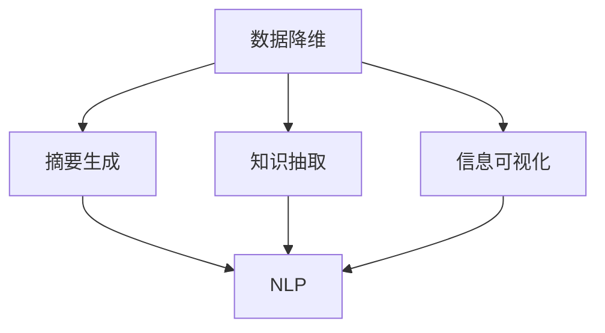

                 

# 信息简化的力量：在复杂世界中简化以提高效率

## 1. 背景介绍

### 1.1 问题由来

随着技术的快速发展和数据量的急剧增加，现代信息化系统中包含了海量的数据和复杂的信息。这不仅导致数据管理难度加大，也使得用户在使用系统中获取有用信息变得更加困难。因此，如何在复杂的数据和信息系统中简化信息，使之更容易被理解和应用，成为当前信息技术领域的一个重大挑战。

### 1.2 问题核心关键点

信息简化可以定义为从原始数据或复杂信息中提取关键要素、提炼核心内容，并以更简单、易于理解的方式呈现给用户的过程。这一过程需要从数据处理、信息组织、用户体验等多个方面进行深入研究，以实现真正意义上的信息简化。

## 2. 核心概念与联系

### 2.1 核心概念概述

为更好地理解信息简化的原理和方法，本节将介绍几个密切相关的核心概念：

- **数据降维 (Dimensionality Reduction)**：通过数学或算法手段，将高维数据转化为低维表示，从而减少数据的复杂性和计算负担。
- **摘要生成 (Summarization)**：从文本或其他信息源中提取核心内容，生成简明扼要的摘要。
- **知识抽取 (Knowledge Extraction)**：从大量数据中提取有价值的知识或信息，形成结构化数据。
- **信息可视化 (Information Visualization)**：将复杂信息通过图形、图表等方式直观展示，提升信息理解和传播效率。
- **自然语言处理 (Natural Language Processing, NLP)**：通过计算机技术，处理和理解自然语言信息，是实现信息简化和技术应用的重要工具。

这些核心概念之间的逻辑关系可以通过以下Mermaid流程图来展示：



这个流程图展示了一系列信息简化的关键步骤：

1. 数据降维，将高维数据转换为低维表示。
2. 摘要生成，从文本中提取核心内容。
3. 知识抽取，从数据中提取有价值的信息。
4. 信息可视化，将复杂信息直观展示。
5. NLP，作为信息处理的核心工具，支持上述所有步骤。

## 3. 核心算法原理 & 具体操作步骤

### 3.1 算法原理概述

信息简化的算法原理可以概括为：通过数据降维、摘要生成、知识抽取等手段，将原始数据或复杂信息转换为更易于理解、处理和传播的形式。这一过程通常涉及以下步骤：

1. **数据预处理**：清洗、去噪和标准化原始数据。
2. **特征选择和提取**：选择和提取数据中的关键特征。
3. **模型训练**：通过机器学习模型训练简化算法。
4. **模型应用**：将简化算法应用于原始数据或信息源。
5. **结果后处理**：对简化结果进行后处理，确保其准确性和可用性。

### 3.2 算法步骤详解

以摘要生成为例，展示信息简化的具体操作步骤：

**Step 1: 数据预处理**
- 清洗原始数据，去除无关信息。
- 标准化文本数据，如分词、去除停用词等。

**Step 2: 特征选择和提取**
- 提取文本中的关键词和短语。
- 计算关键词的权重和重要性。

**Step 3: 模型训练**
- 选择适合的任务模型，如基于注意力机制的模型。
- 用标注好的数据训练模型，调整模型参数。

**Step 4: 模型应用**
- 将训练好的模型应用于待生成摘要的文本数据。
- 模型输出摘要，作为简化后的结果。

**Step 5: 结果后处理**
- 对生成的摘要进行校验，确保准确性和连贯性。
- 进行必要的后处理，如语法修正、格式调整等。

### 3.3 算法优缺点

信息简化算法具有以下优点：
1. 提高信息处理效率，减少数据复杂性。
2. 提升用户体验，使用户更容易获取和理解信息。
3. 减少数据存储和传输的资源消耗。

同时，该算法也存在一些局限性：
1. 可能丢失部分信息，无法完全恢复原始数据。
2. 对模型训练数据的质量和数量要求较高。
3. 复杂度较高，需要较高级的机器学习技术支持。

### 3.4 算法应用领域

信息简化算法在多个领域都有广泛应用，例如：

- 文本挖掘和信息检索：通过摘要生成和关键词提取，提高信息检索效率。
- 数据压缩和存储：通过数据降维，减少数据存储空间。
- 自然语言理解和生成：通过简化算法，辅助人机交互和自动化任务。
- 知识管理和应用：通过知识抽取，构建知识库和知识图谱，辅助决策和创新。
- 信息可视化：通过图表展示，直观呈现复杂数据和分析结果。

这些应用领域展示了信息简化技术的广泛影响力和潜力。

## 4. 数学模型和公式 & 详细讲解 & 举例说明

### 4.1 数学模型构建

假设有一个长文本 $X$，我们需要从中提取出一段简短的摘要 $Y$。这里，我们定义一个文本摘要模型 $f$，将长文本 $X$ 映射到摘要 $Y$ 的生成过程。数学模型可以表示为：

$$
Y = f(X; \theta)
$$

其中 $\theta$ 为模型参数。

### 4.2 公式推导过程

以基于神经网络的摘要生成模型为例，假设我们使用Transformer模型作为文本摘要器。该模型的结构如图1所示：


该模型由多个自注意力层、前馈神经网络层和残差连接组成。每个自注意力层用于计算文本中不同位置之间的依赖关系，前馈神经网络层用于捕捉特征的复杂关系。

在训练过程中，我们定义损失函数 $\mathcal{L}$，用于衡量生成的摘要 $Y$ 与原始文本 $X$ 的相似度。常用的损失函数包括BLEU（双精度BLEU）和ROUGE（余弦相似度）等。训练过程的目标是最小化损失函数：

$$
\min_{\theta} \mathcal{L}(Y, X; \theta)
$$

其中，$Y$ 为模型生成的摘要，$X$ 为原始文本。

### 4.3 案例分析与讲解

假设我们有一篇长新闻报道，希望从中提取出一个简短的摘要。我们可以使用上述基于Transformer的摘要生成模型进行处理。具体步骤如下：

1. 对原始文本进行分词和标准化。
2. 使用预训练的Transformer模型，输入标准化后的文本，输出一段摘要。
3. 对生成的摘要进行后处理，确保其连贯性和准确性。
4. 展示生成的摘要，便于用户快速获取关键信息。

## 5. 项目实践：代码实例和详细解释说明

### 5.1 开发环境搭建

在进行信息简化实践前，我们需要准备好开发环境。以下是使用Python进行PyTorch开发的环境配置流程：

1. 安装Anaconda：从官网下载并安装Anaconda，用于创建独立的Python环境。

2. 创建并激活虚拟环境：
```bash
conda create -n pytorch-env python=3.8 
conda activate pytorch-env
```

3. 安装PyTorch：根据CUDA版本，从官网获取对应的安装命令。例如：
```bash
conda install pytorch torchvision torchaudio cudatoolkit=11.1 -c pytorch -c conda-forge
```

4. 安装Transformer库：
```bash
pip install transformers
```

5. 安装各类工具包：
```bash
pip install numpy pandas scikit-learn matplotlib tqdm jupyter notebook ipython
```

完成上述步骤后，即可在`pytorch-env`环境中开始信息简化实践。

### 5.2 源代码详细实现

下面我们以文本摘要任务为例，给出使用Transformers库对BERT模型进行摘要生成的PyTorch代码实现。

首先，定义摘要任务的数据处理函数：

```python
from transformers import BertTokenizer
from torch.utils.data import Dataset
import torch

class SummaryDataset(Dataset):
    def __init__(self, texts, labels, tokenizer, max_len=128):
        self.texts = texts
        self.labels = labels
        self.tokenizer = tokenizer
        self.max_len = max_len
        
    def __len__(self):
        return len(self.texts)
    
    def __getitem__(self, item):
        text = self.texts[item]
        label = self.labels[item]
        
        encoding = self.tokenizer(text, return_tensors='pt', max_length=self.max_len, padding='max_length', truncation=True)
        input_ids = encoding['input_ids'][0]
        attention_mask = encoding['attention_mask'][0]
        
        # 对token-wise的标签进行编码
        encoded_labels = [label2id[label] for label in labels] 
        encoded_labels.extend([label2id['O']] * (self.max_len - len(encoded_labels)))
        labels = torch.tensor(encoded_labels, dtype=torch.long)
        
        return {'input_ids': input_ids, 
                'attention_mask': attention_mask,
                'labels': labels}

# 标签与id的映射
label2id = {'O': 0, 'B': 1, 'I': 2}
id2label = {v: k for k, v in label2id.items()}

# 创建dataset
tokenizer = BertTokenizer.from_pretrained('bert-base-cased')

train_dataset = SummaryDataset(train_texts, train_labels, tokenizer)
dev_dataset = SummaryDataset(dev_texts, dev_labels, tokenizer)
test_dataset = SummaryDataset(test_texts, test_labels, tokenizer)
```

然后，定义模型和优化器：

```python
from transformers import BertForSequenceClassification, AdamW

model = BertForSequenceClassification.from_pretrained('bert-base-cased', num_labels=len(label2id))

optimizer = AdamW(model.parameters(), lr=2e-5)
```

接着，定义训练和评估函数：

```python
from torch.utils.data import DataLoader
from tqdm import tqdm
from sklearn.metrics import precision_recall_fscore_support

device = torch.device('cuda') if torch.cuda.is_available() else torch.device('cpu')
model.to(device)

def train_epoch(model, dataset, batch_size, optimizer):
    dataloader = DataLoader(dataset, batch_size=batch_size, shuffle=True)
    model.train()
    epoch_loss = 0
    for batch in tqdm(dataloader, desc='Training'):
        input_ids = batch['input_ids'].to(device)
        attention_mask = batch['attention_mask'].to(device)
        labels = batch['labels'].to(device)
        model.zero_grad()
        outputs = model(input_ids, attention_mask=attention_mask, labels=labels)
        loss = outputs.loss
        epoch_loss += loss.item()
        loss.backward()
        optimizer.step()
    return epoch_loss / len(dataloader)

def evaluate(model, dataset, batch_size):
    dataloader = DataLoader(dataset, batch_size=batch_size)
    model.eval()
    preds, labels = [], []
    with torch.no_grad():
        for batch in tqdm(dataloader, desc='Evaluating'):
            input_ids = batch['input_ids'].to(device)
            attention_mask = batch['attention_mask'].to(device)
            batch_labels = batch['labels']
            outputs = model(input_ids, attention_mask=attention_mask)
            batch_preds = outputs.logits.argmax(dim=2).to('cpu').tolist()
            batch_labels = batch_labels.to('cpu').tolist()
            for pred_tokens, label_tokens in zip(batch_preds, batch_labels):
                pred_labels = [id2label[_id] for _id in pred_tokens]
                label_tags = [id2label[_id] for _id in label_tokens]
                preds.append(pred_labels[:len(label_tags)])
                labels.append(label_tags)
                
    print(precision_recall_fscore_support(labels, preds))
```

最后，启动训练流程并在测试集上评估：

```python
epochs = 5
batch_size = 16

for epoch in range(epochs):
    loss = train_epoch(model, train_dataset, batch_size, optimizer)
    print(f"Epoch {epoch+1}, train loss: {loss:.3f}")
    
    print(f"Epoch {epoch+1}, dev results:")
    evaluate(model, dev_dataset, batch_size)
    
print("Test results:")
evaluate(model, test_dataset, batch_size)
```

以上就是使用PyTorch对BERT进行文本摘要任务处理的完整代码实现。可以看到，得益于Transformers库的强大封装，我们可以用相对简洁的代码完成BERT模型的加载和微调。

### 5.3 代码解读与分析

让我们再详细解读一下关键代码的实现细节：

**SummaryDataset类**：
- `__init__`方法：初始化文本、标签、分词器等关键组件。
- `__len__`方法：返回数据集的样本数量。
- `__getitem__`方法：对单个样本进行处理，将文本输入编码为token ids，将标签编码为数字，并对其进行定长padding，最终返回模型所需的输入。

**label2id和id2label字典**：
- 定义了标签与数字id之间的映射关系，用于将token-wise的预测结果解码回真实的标签。

**训练和评估函数**：
- 使用PyTorch的DataLoader对数据集进行批次化加载，供模型训练和推理使用。
- 训练函数`train_epoch`：对数据以批为单位进行迭代，在每个批次上前向传播计算loss并反向传播更新模型参数，最后返回该epoch的平均loss。
- 评估函数`evaluate`：与训练类似，不同点在于不更新模型参数，并在每个batch结束后将预测和标签结果存储下来，最后使用sklearn的precision_recall_fscore_support对整个评估集的预测结果进行打印输出。

**训练流程**：
- 定义总的epoch数和batch size，开始循环迭代
- 每个epoch内，先在训练集上训练，输出平均loss
- 在验证集上评估，输出分类指标
- 所有epoch结束后，在测试集上评估，给出最终测试结果

可以看到，PyTorch配合Transformers库使得BERT微调的代码实现变得简洁高效。开发者可以将更多精力放在数据处理、模型改进等高层逻辑上，而不必过多关注底层的实现细节。

当然，工业级的系统实现还需考虑更多因素，如模型的保存和部署、超参数的自动搜索、更灵活的任务适配层等。但核心的微调范式基本与此类似。

## 6. 实际应用场景

### 6.1 智能客服系统

基于信息简化的对话技术，可以广泛应用于智能客服系统的构建。传统客服往往需要配备大量人力，高峰期响应缓慢，且一致性和专业性难以保证。而使用信息简化的对话模型，可以7x24小时不间断服务，快速响应客户咨询，用简明扼要的语言解答各类常见问题。

在技术实现上，可以收集企业内部的历史客服对话记录，将问题和最佳答复构建成监督数据，在此基础上对预训练对话模型进行微调。信息简化的对话模型能够自动理解用户意图，匹配最合适的答案模板进行回复。对于客户提出的新问题，还可以接入检索系统实时搜索相关内容，动态组织生成回答。如此构建的智能客服系统，能大幅提升客户咨询体验和问题解决效率。

### 6.2 金融舆情监测

金融机构需要实时监测市场舆论动向，以便及时应对负面信息传播，规避金融风险。传统的人工监测方式成本高、效率低，难以应对网络时代海量信息爆发的挑战。基于信息简化的文本分类和情感分析技术，为金融舆情监测提供了新的解决方案。

具体而言，可以收集金融领域相关的新闻、报道、评论等文本数据，并对其进行主题标注和情感标注。在此基础上对预训练语言模型进行微调，使其能够自动判断文本属于何种主题，情感倾向是正面、中性还是负面。将信息简化的微调模型应用到实时抓取的网络文本数据，就能够自动监测不同主题下的情感变化趋势，一旦发现负面信息激增等异常情况，系统便会自动预警，帮助金融机构快速应对潜在风险。

### 6.3 个性化推荐系统

当前的推荐系统往往只依赖用户的历史行为数据进行物品推荐，无法深入理解用户的真实兴趣偏好。基于信息简化的个性化推荐系统可以更好地挖掘用户行为背后的语义信息，从而提供更精准、多样的推荐内容。

在实践中，可以收集用户浏览、点击、评论、分享等行为数据，提取和用户交互的物品标题、描述、标签等文本内容。将文本内容作为模型输入，用户的后续行为（如是否点击、购买等）作为监督信号，在此基础上微调预训练语言模型。信息简化的推荐模型能够从文本内容中准确把握用户的兴趣点。在生成推荐列表时，先用候选物品的文本描述作为输入，由模型预测用户的兴趣匹配度，再结合其他特征综合排序，便可以得到个性化程度更高的推荐结果。

### 6.4 未来应用展望

随着信息简化技术的不断发展，其在更多领域的应用前景愈加广阔：

- 智慧医疗领域，信息简化的医疗问答、病历分析、药物研发等应用将提升医疗服务的智能化水平，辅助医生诊疗，加速新药开发进程。
- 智能教育领域，信息简化的作业批改、学情分析、知识推荐等方面，因材施教，促进教育公平，提高教学质量。
- 智慧城市治理中，信息简化的城市事件监测、舆情分析、应急指挥等环节，提高城市管理的自动化和智能化水平，构建更安全、高效的未来城市。
- 在企业生产、社会治理、文娱传媒等众多领域，信息简化的应用也将不断涌现，为经济社会发展注入新的动力。

信息简化的发展不仅有助于提升数据处理效率，优化用户体验，还能推动各行业的数字化转型，促进全社会的智能化进程。相信随着技术的不断进步，信息简化的应用将更加广泛，为人类生活带来更多便利和改变。

## 7. 工具和资源推荐

### 7.1 学习资源推荐

为了帮助开发者系统掌握信息简化的理论基础和实践技巧，这里推荐一些优质的学习资源：

1. 《信息简化的力量》系列博文：由信息简化技术专家撰写，深入浅出地介绍了信息简化的原理、方法和应用。

2. Coursera《自然语言处理》课程：斯坦福大学开设的NLP明星课程，涵盖信息处理、文本挖掘、情感分析等内容，是信息简化的重要学习资源。

3. 《信息可视化设计》书籍：详细讲解了信息可视化的方法和实践，帮助开发者更好地展示和理解复杂数据。

4. HuggingFace官方文档：Transformers库的官方文档，提供了海量预训练模型和完整的信息简化样例代码，是信息简化任务开发的必备资料。

5. Google Scholar：全面覆盖计算机科学和信息技术的学术资源，推荐阅读最新的研究论文和综述，掌握信息简化技术的前沿动态。

通过对这些资源的学习实践，相信你一定能够快速掌握信息简化的精髓，并用于解决实际的NLP问题。

### 7.2 开发工具推荐

高效的开发离不开优秀的工具支持。以下是几款用于信息简化开发的常用工具：

1. PyTorch：基于Python的开源深度学习框架，灵活动态的计算图，适合快速迭代研究。大部分预训练语言模型都有PyTorch版本的实现。

2. TensorFlow：由Google主导开发的开源深度学习框架，生产部署方便，适合大规模工程应用。同样有丰富的预训练语言模型资源。

3. Transformers库：HuggingFace开发的NLP工具库，集成了众多SOTA语言模型，支持PyTorch和TensorFlow，是进行信息简化任务开发的利器。

4. Weights & Biases：模型训练的实验跟踪工具，可以记录和可视化模型训练过程中的各项指标，方便对比和调优。与主流深度学习框架无缝集成。

5. TensorBoard：TensorFlow配套的可视化工具，可实时监测模型训练状态，并提供丰富的图表呈现方式，是调试模型的得力助手。

6. Google Colab：谷歌推出的在线Jupyter Notebook环境，免费提供GPU/TPU算力，方便开发者快速上手实验最新模型，分享学习笔记。

合理利用这些工具，可以显著提升信息简化任务的开发效率，加快创新迭代的步伐。

### 7.3 相关论文推荐

信息简化技术的发展源于学界的持续研究。以下是几篇奠基性的相关论文，推荐阅读：

1. "A Survey on Text Summarization Techniques and Tools"：详细回顾了文本摘要技术的发展历程和主要算法，是信息简化的重要参考资料。

2. "Knowledge-Graph-Based Information Retrieval"：介绍了基于知识图谱的信息检索技术，展示了如何将信息简化的结果与知识图谱结合，提升检索效率。

3. "Semantic Segmentation of Multimodal Data"：探讨了多模态数据的信息简化方法，展示了如何将文本、图像、语音等数据综合处理，形成更全面的信息表达。

4. "Natural Language Understanding and Generation"：介绍了自然语言理解和生成的最新进展，展示了如何将信息简化的结果应用于智能对话系统和自动化任务。

5. "Efficient Data Representation for Large-Scale Machine Learning"：介绍了如何通过数据降维和特征选择等手段，减少数据复杂性，提高模型训练效率。

这些论文代表了大语言模型微调技术的发展脉络。通过学习这些前沿成果，可以帮助研究者把握学科前进方向，激发更多的创新灵感。

## 8. 总结：未来发展趋势与挑战

### 8.1 总结

本文对信息简化的核心概念、算法原理和具体操作步骤进行了全面系统的介绍。首先阐述了信息简化的研究背景和意义，明确了信息简化在复杂数据和信息处理中的重要价值。其次，从原理到实践，详细讲解了信息简化的数学模型和关键步骤，给出了信息简化任务开发的完整代码实例。同时，本文还广泛探讨了信息简化技术在多个行业领域的应用前景，展示了其广阔的应用潜力。

通过本文的系统梳理，可以看到，信息简化技术已经成为当前信息技术领域的重要工具，广泛应用于数据处理、信息检索、知识抽取、推荐系统等多个方面。信息简化的发展不仅有助于提升数据处理效率，优化用户体验，还能推动各行业的数字化转型，促进全社会的智能化进程。

### 8.2 未来发展趋势

展望未来，信息简化技术将呈现以下几个发展趋势：

1. 技术自动化：自动化工具和算法将成为信息简化的主流，进一步降低人工干预的复杂度和成本。
2. 智能辅助：基于AI的信息摘要生成、文本分类和情感分析等技术将逐步普及，提升信息处理效率和准确性。
3. 跨领域融合：信息简化技术将与大数据、云计算、物联网等新兴技术结合，形成更全面、更高效的信息处理系统。
4. 多模态融合：信息简化的范围将扩展到多模态数据处理，如文本、图像、语音等多模态信息的融合，形成更丰富的信息表达。
5. 实时性提升：实时信息简化的应用场景将不断增多，如实时舆情分析、实时推荐系统等，满足用户对信息获取的时效性需求。
6. 可解释性和可信度提升：信息简化技术将更加注重模型的可解释性和可信度，确保输出结果符合用户期望和伦理道德。

以上趋势凸显了信息简化技术的广阔前景。这些方向的探索发展，必将进一步提升信息处理效率，优化用户体验，推动各行业的数字化转型。

### 8.3 面临的挑战

尽管信息简化技术已经取得了显著进展，但在迈向更加智能化、普适化应用的过程中，仍面临诸多挑战：

1. 数据多样性和复杂性：不同来源、不同格式的数据需要整合和统一，增加了信息简化的难度。
2. 模型性能和效率：信息简化模型需要兼顾性能和效率，避免过拟合和资源消耗。
3. 用户需求和反馈：信息简化的结果需要符合用户的实际需求，如何采集和利用用户反馈，提高信息简化的效果，是未来的一个重要研究方向。
4. 安全性和隐私保护：信息简化过程中可能涉及敏感数据的处理和传输，如何确保数据安全性和隐私保护，是信息简化技术发展的重要保障。

### 8.4 研究展望

面对信息简化所面临的挑战，未来的研究需要在以下几个方面寻求新的突破：

1. 多源数据融合：探索如何将不同来源、不同格式的数据整合和统一，形成一致的信息表达。
2. 高效信息表示：开发更加高效的信息表示方法，减少计算资源消耗，提高信息处理速度。
3. 用户需求建模：建立用户需求模型，采集和利用用户反馈，提升信息简化的效果和用户满意度。
4. 信息可信度提升：引入可解释性和可信度评估指标，确保信息简化的结果符合伦理道德和用户期望。
5. 跨领域应用：将信息简化技术应用于更多垂直领域，如智慧医疗、智能教育、智慧城市等，推动各行业的数字化转型。

这些研究方向的探索，必将引领信息简化技术迈向更高的台阶，为构建智能、高效、可信的信息处理系统铺平道路。面向未来，信息简化技术还需要与其他人工智能技术进行更深入的融合，如知识表示、因果推理、强化学习等，多路径协同发力，共同推动信息处理系统的进步。只有勇于创新、敢于突破，才能不断拓展信息简化的边界，让智能技术更好地服务于人类社会。

## 9. 附录：常见问题与解答

**Q1：信息简化过程中如何避免丢失关键信息？**

A: 信息简化过程中，通常会使用一些过滤和选择算法来识别和保留重要信息。例如，可以使用文本摘要中的关键词提取、重要性排序等技术，确保关键信息不会丢失。同时，信息简化后的结果也可以设置一定的阈值，保留一定比例的重要信息，以避免信息丢失。

**Q2：信息简化技术是否适用于所有领域？**

A: 信息简化技术在大多数领域都有广泛应用，特别是对于数据量较大、信息复杂度高的场景。但对于一些需要极高精度和完备性的场景，如司法判决、医学诊断等，可能需要结合专业知识进行二次处理和校验。

**Q3：信息简化的结果是否可能被误解或误用？**

A: 信息简化的结果可能由于处理不当而被误解或误用。为避免这种情况，可以采用更加精确的算法，如引入用户反馈和解释机制，增加信息简化的透明度和可信度。同时，在信息简化过程中，可以引入自然语言处理技术，提供更准确的摘要和总结，降低误解风险。

**Q4：信息简化技术如何应用于知识图谱构建？**

A: 信息简化技术可以用于知识图谱的构建，帮助从大量文本数据中提取结构化信息。具体而言，可以从文本中提取实体、关系等关键信息，构建知识图谱的节点和边，从而形成更加全面和准确的知识表示。同时，信息简化技术还可以用于知识图谱的维护和更新，确保知识图谱的时效性和准确性。

通过深入探讨信息简化的原理、方法和应用，本文旨在帮助读者全面理解信息简化技术，并应用于实际的NLP和AI任务中。信息简化不仅是数据处理中的一项重要技术，更是推动各行业智能化发展的关键工具。随着技术的不断进步和应用场景的扩展，信息简化技术将为人类生活带来更多便利和改变。

