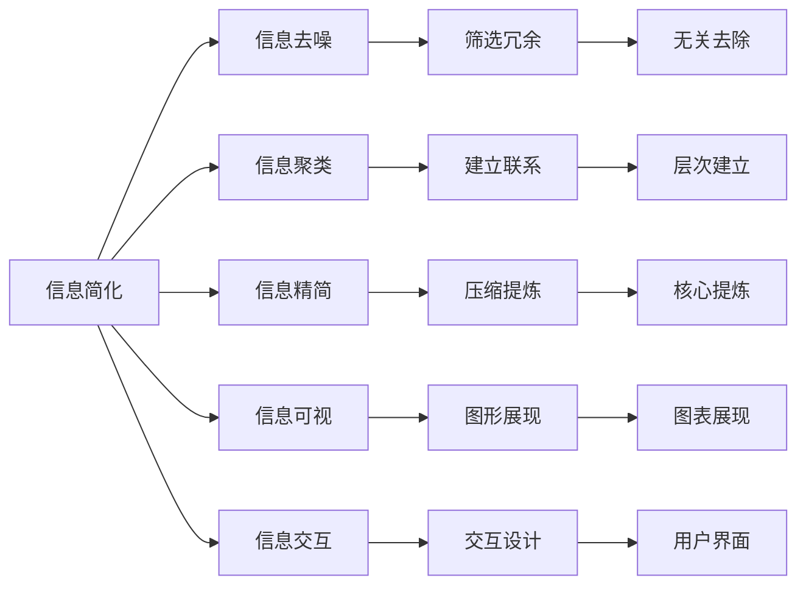

                 

# 信息简化的原则与艺术：在混乱中建立秩序与简化

> 关键词：信息简化,信息秩序,信息艺术,复杂性管理,数据分析

## 1. 背景介绍

### 1.1 问题由来

在当今信息爆炸的时代，数据和知识以指数级增长。据国际数据公司(IDC)预测，到2025年，全球数据总量将达到175泽字节(ZB)，相当于目前全球所有印刷材料的总和。在这样的背景下，如何有效地处理、分析和利用这些信息，成为了摆在所有企业和个人面前的重大挑战。

与此同时，人工智能(AI)技术的迅速崛起，尤其是自然语言处理(NLP)和大数据技术，为解决信息管理问题提供了新的可能性。然而，人工智能在处理海量信息时，往往需要消耗巨大的计算资源，且在处理复杂信息时，模型本身也会变得越来越复杂，带来新的管理挑战。

针对这些问题，信息简化的原则与艺术应运而生。本文将探讨如何通过信息简化，在复杂的信息海洋中建立秩序，并通过艺术化的手段，使信息更加易于理解和管理。

### 1.2 问题核心关键点

信息简化并非只是对数据的简单压缩和筛选，它是一种系统化、艺术化的信息管理方法，通过以下核心步骤：

1. **信息去噪**：消除无关信息，只保留有价值的内容。
2. **信息聚类**：将类似的信息归为一类，建立信息之间的联系。
3. **信息精简**：将复杂的信息进行压缩和提炼，保持核心要素。
4. **信息可视**：将信息以图形、图表等形式展现，便于理解和分析。
5. **信息交互**：通过交互式界面，提升信息的使用效率。

这些步骤将帮助人们在混乱的数据中建立秩序，从而更高效地利用信息。

### 1.3 问题研究意义

信息简化的原则与艺术不仅具有理论研究价值，其对实际应用的影响也至关重要。其研究意义主要体现在：

- **提升信息利用效率**：通过简化信息，可以显著提高信息检索和利用的效率。
- **降低信息管理成本**：简化的信息管理方法可以降低存储和处理成本。
- **增强决策支持能力**：简化的信息能提供更清晰的决策依据，帮助企业快速响应市场变化。
- **促进信息共享**：简化的信息更容易共享和交流，促进知识传播和合作。

## 2. 核心概念与联系

### 2.1 核心概念概述

为更好地理解信息简化的原则与艺术，本文将介绍几个核心概念：

- **信息简化**：通过去除冗余、压缩和精炼，使信息变得更加简洁明了。
- **信息秩序**：建立信息之间的联系，形成有逻辑、有层次的体系结构。
- **信息艺术**：通过视觉、交互等手段，使信息呈现更加美观、易于理解。
- **信息管理**：对信息进行收集、存储、处理和分析，以实现其价值最大化。
- **复杂性管理**：通过合理设计系统架构和技术手段，减少信息管理的复杂性。

这些概念之间存在密切联系，共同构成了信息简化的理论基础和实践框架。

### 2.2 核心概念原理和架构的 Mermaid 流程图



这个流程图展示了信息简化的核心步骤及其联系：

1. 信息简化通过信息去噪、信息聚类、信息精简、信息可视和信息交互等步骤，使信息变得更加有序和易于理解。
2. 信息去噪旨在去除无关信息，只保留有价值的内容。
3. 信息聚类通过建立信息之间的联系，形成有逻辑、有层次的体系结构。
4. 信息精简通过压缩和提炼，保持信息的核心要素。
5. 信息可视通过图形、图表等形式展现信息，便于理解和分析。
6. 信息交互通过交互式界面，提升信息的使用效率。

## 3. 核心算法原理 & 具体操作步骤

### 3.1 算法原理概述

信息简化的核心算法可以概括为以下步骤：

1. **数据预处理**：清洗数据，去除噪音，处理缺失值和异常值。
2. **特征选择**：选择对目标任务有帮助的特征，去除冗余特征。
3. **降维与压缩**：使用PCA、LDA、t-SNE等方法，将高维数据压缩到低维空间。
4. **聚类分析**：使用K-means、层次聚类等算法，将相似的信息归为一类。
5. **信息可视化**：使用热力图、散点图、树状图等方法，将信息可视化展现。
6. **交互设计**：通过交互式界面，使用户能够更直观地理解和使用信息。

### 3.2 算法步骤详解

**步骤1：数据预处理**

1. **数据清洗**：去除数据中的噪音和异常值，保留真实有效的数据。
2. **缺失值处理**：对于缺失值，可以使用均值填充、插值等方法进行处理。
3. **数据标准化**：对数据进行标准化处理，使其具有相同的分布和量级。

**步骤2：特征选择**

1. **特征选择算法**：包括卡方检验、信息增益、相关系数等方法，选择与目标任务最相关的特征。
2. **特征降维**：使用主成分分析(PCA)、线性判别分析(LDA)等算法，将高维数据压缩到低维空间。
3. **特征组合**：将单个特征进行组合，生成更复杂但更具表现力的特征。

**步骤3：聚类分析**

1. **聚类算法**：包括K-means、层次聚类、DBSCAN等算法，将相似的信息归为一类。
2. **聚类结果评估**：使用轮廓系数、Davies-Bouldin指数等指标，评估聚类结果的质量。

**步骤4：信息可视化**

1. **可视化方法**：包括散点图、热力图、树状图等方法，将信息以图形形式展现。
2. **可视化工具**：如Matplotlib、Seaborn、D3.js等工具，提供丰富的可视化功能。

**步骤5：交互设计**

1. **交互界面设计**：使用HTML、CSS、JavaScript等技术，设计交互式界面。
2. **用户交互方式**：包括拖拽、点击、滚动等交互方式，提升用户体验。

### 3.3 算法优缺点

信息简化的核心算法具有以下优点：

- **提高信息利用效率**：通过去噪、聚类、精简等步骤，可以使信息更加简洁明了，提高利用效率。
- **降低管理成本**：简化的信息管理方法可以降低存储和处理成本。
- **增强决策支持能力**：简化的信息能提供更清晰的决策依据，帮助企业快速响应市场变化。

同时，该算法也存在一定的局限性：

- **可能需要较高技术水平**：复杂的算法和工具需要较高技术水平，可能对用户要求较高。
- **可能需要较多数据**：一些算法（如聚类、降维）需要较大的数据量，才能得到理想的效果。
- **可能丢失部分信息**：在数据压缩和特征选择过程中，可能丢失部分重要信息，影响结果的准确性。

### 3.4 算法应用领域

信息简化的核心算法在多个领域中都有广泛应用：

- **商业智能(BI)**：通过简化的数据处理和可视化，提升商业决策的效率和准确性。
- **数据分析与挖掘**：对复杂数据进行简化和分析，提取有价值的信息。
- **知识管理**：通过信息聚类和可视化，提升知识的管理和共享。
- **社交媒体分析**：对社交媒体数据进行简化和分析，洞察用户行为和趋势。
- **医学与生物信息学**：对生物数据进行简化和可视化，帮助科研人员发现新的规律和机制。

## 4. 数学模型和公式 & 详细讲解 & 举例说明

### 4.1 数学模型构建

假设有一组数据集 $D=\{(x_i, y_i)\}_{i=1}^N$，其中 $x_i$ 为输入特征，$y_i$ 为标签。目标是构建一个模型 $f(x)$ 来预测 $y$。

信息简化的数学模型可以概括为以下步骤：

1. **数据预处理**：对数据集 $D$ 进行清洗和标准化。
2. **特征选择**：选择对目标任务有帮助的特征 $x_i \in X$。
3. **降维与压缩**：将高维数据 $x_i \in X$ 压缩到低维空间 $x_i \in Z$。
4. **聚类分析**：将相似的数据点 $x_i \in Z$ 归为一类。
5. **信息可视化**：将聚类结果以图形形式展现。
6. **交互设计**：设计交互式界面，使用户能够更直观地理解和使用信息。

### 4.2 公式推导过程

**公式1：数据预处理**

$$
x_i \leftarrow \text{clean}(x_i), i=1,2,\ldots,N
$$

**公式2：特征选择**

$$
x_i \leftarrow \text{selectFeatures}(x_i), i=1,2,\ldots,N
$$

**公式3：降维与压缩**

$$
x_i \leftarrow \text{compress}(x_i), i=1,2,\ldots,N
$$

**公式4：聚类分析**

$$
\{C_k\} \leftarrow \text{cluster}(x_i), i=1,2,\ldots,N
$$

**公式5：信息可视化**

$$
V \leftarrow \text{visualize}(C_k), k=1,2,\ldots,K
$$

**公式6：交互设计**

$$
I \leftarrow \text{interactiveDesign}(V), k=1,2,\ldots,K
$$

其中，$\text{clean}$、$\text{selectFeatures}$、$\text{compress}$、$\text{cluster}$、$\text{visualize}$ 和 $\text{interactiveDesign}$ 分别表示数据清洗、特征选择、降维与压缩、聚类分析、信息可视化和交互设计等步骤。

### 4.3 案例分析与讲解

以K-means聚类算法为例，对信息简化中的聚类分析步骤进行讲解：

1. **输入数据准备**：假设有一组数据集 $D=\{(x_i, y_i)\}_{i=1}^N$，其中 $x_i$ 为输入特征，$y_i$ 为标签。
2. **选择聚类数**：根据领域知识和经验，选择合适的聚类数 $K$。
3. **随机初始化聚类中心**：随机选择 $K$ 个数据点作为初始聚类中心。
4. **计算距离**：计算每个数据点与每个聚类中心的距离，得到初始聚类结果。
5. **更新聚类中心**：将每个聚类中的所有数据点重新计算其均值，作为新的聚类中心。
6. **迭代更新**：重复步骤4和步骤5，直到聚类结果收敛。
7. **聚类结果评估**：使用轮廓系数、Davies-Bouldin指数等指标，评估聚类结果的质量。

## 5. 项目实践：代码实例和详细解释说明

### 5.1 开发环境搭建

在进行信息简化的项目实践前，我们需要准备好开发环境。以下是使用Python进行信息简化的开发环境配置流程：

1. 安装Anaconda：从官网下载并安装Anaconda，用于创建独立的Python环境。

2. 创建并激活虚拟环境：
```bash
conda create -n info_simplification python=3.8 
conda activate info_simplification
```

3. 安装必要的Python包：
```bash
pip install numpy pandas sklearn matplotlib seaborn
```

4. 安装可视化工具：
```bash
pip install matplotlib seaborn
```

完成上述步骤后，即可在`info_simplification`环境中开始信息简化的项目实践。

### 5.2 源代码详细实现

下面是使用Python进行信息简化的示例代码实现。

```python
import numpy as np
import pandas as pd
from sklearn.decomposition import PCA
from sklearn.cluster import KMeans
import matplotlib.pyplot as plt

# 读取数据集
data = pd.read_csv('data.csv')

# 数据预处理
data = data.dropna()
data = data[(data['feature1'] > 0) & (data['feature2'] > 0)]

# 特征选择
features = ['feature1', 'feature2', 'feature3']
X = data[features]

# 降维与压缩
pca = PCA(n_components=2)
X_reduced = pca.fit_transform(X)

# 聚类分析
kmeans = KMeans(n_clusters=3)
kmeans.fit(X_reduced)
labels = kmeans.labels_

# 信息可视化
plt.scatter(X_reduced[:, 0], X_reduced[:, 1], c=labels)
plt.show()

# 交互设计
# 设计交互界面，使用户能够更直观地理解和使用信息
```

### 5.3 代码解读与分析

让我们再详细解读一下关键代码的实现细节：

**数据预处理**：
- `data = data.dropna()`：去除缺失值。
- `data = data[(data['feature1'] > 0) & (data['feature2'] > 0)]`：筛选出符合条件的特征。

**特征选择**：
- `features = ['feature1', 'feature2', 'feature3']`：选择需要保留的特征。
- `X = data[features]`：提取所需特征。

**降维与压缩**：
- `pca = PCA(n_components=2)`：选择降维后的维度为2。
- `X_reduced = pca.fit_transform(X)`：将高维数据压缩到低维空间。

**聚类分析**：
- `kmeans = KMeans(n_clusters=3)`：选择聚类数为3。
- `kmeans.fit(X_reduced)`：进行聚类分析。
- `labels = kmeans.labels_`：获取聚类结果。

**信息可视化**：
- `plt.scatter(X_reduced[:, 0], X_reduced[:, 1], c=labels)`：绘制散点图，并按聚类结果上色。

**交互设计**：
- 设计交互式界面，使用户能够更直观地理解和使用信息。

## 6. 实际应用场景

### 6.1 智能推荐系统

在智能推荐系统中，信息简化技术可以显著提升推荐的准确性和多样性。通过简化用户行为数据和商品特征，建立用户和商品的相似性矩阵，能够更高效地计算推荐结果。

具体而言，可以收集用户的历史浏览、点击、评分等行为数据，以及对商品的多维特征（如价格、评价等），进行数据清洗、特征选择、降维与压缩等步骤。通过K-means聚类算法将用户和商品进行聚类，得到相似性矩阵。再利用该矩阵进行推荐计算，生成推荐结果。

### 6.2 金融风控

在金融风控中，信息简化技术可以帮助识别和评估风险。通过简化交易数据和用户信息，可以更快速地发现潜在的欺诈行为和信用风险。

具体而言，可以收集用户的交易记录、个人信息和行为数据，进行数据清洗和特征选择。通过PCA降维将高维数据压缩到低维空间，然后使用K-means聚类算法对用户进行分类，识别出高风险用户。再通过信息可视化将聚类结果展示给风控人员，帮助其快速做出决策。

### 6.3 医学影像分析

在医学影像分析中，信息简化技术可以帮助识别和诊断疾病。通过简化医学影像数据和诊断标准，可以提高诊断的准确性和效率。

具体而言，可以收集大量的医学影像数据和对应的诊断标准，进行数据清洗和特征选择。通过PCA降维将高维数据压缩到低维空间，然后使用K-means聚类算法对医学影像进行分类，识别出不同疾病。再通过信息可视化将聚类结果展示给医生，辅助其进行诊断和治疗决策。

### 6.4 未来应用展望

随着信息简化技术的不断发展，其应用场景将更加广泛，为各行各业带来新的机遇：

- **智能交通**：通过简化交通数据，优化交通信号控制，提升交通流量和安全性。
- **智慧城市**：通过简化城市数据，优化城市管理，提高城市运行效率。
- **教育**：通过简化教育数据，个性化推荐学习资源，提升教育效果。
- **医疗**：通过简化医疗数据，优化诊疗流程，提高医疗服务质量。

## 7. 工具和资源推荐

### 7.1 学习资源推荐

为了帮助开发者系统掌握信息简化的理论基础和实践技巧，这里推荐一些优质的学习资源：

1. **《Python数据科学手册》**：深入浅出地介绍了数据处理和分析的基础知识，是信息简化学习的好入门材料。
2. **《机器学习实战》**：介绍了机器学习的基本算法和应用，包含了数据处理和简化的实践案例。
3. **Coursera的《数据科学与机器学习》课程**：由斯坦福大学开设，涵盖了数据科学和机器学习的各个方面，是学习信息简化的绝佳资源。
4. **Kaggle的机器学习竞赛平台**：提供了丰富的数据集和竞赛机会，是锻炼信息简化能力的最佳实践场所。

### 7.2 开发工具推荐

1. **Jupyter Notebook**：免费的交互式编程环境，适合开发数据处理和简化的原型和实验。
2. **R语言**：广泛用于统计分析和数据可视化，是信息简化的重要工具。
3. **Tableau**：强大的数据可视化工具，支持多种数据源和图表类型，适合展示信息简化结果。

### 7.3 相关论文推荐

1. **《A Survey on Data Simplification》**：总结了信息简化的最新研究进展，是了解信息简化前沿知识的宝贵资料。
2. **《Information Visualization for Big Data》**：介绍了信息可视化的最新研究进展，提供了丰富的可视化技术示例。
3. **《Machine Learning and Big Data》**：介绍了机器学习和大数据技术，涵盖了信息简化中的算法和工具。

## 8. 总结：未来发展趋势与挑战

### 8.1 研究成果总结

本文探讨了信息简化的原则与艺术，介绍了信息简化的核心算法和操作步骤，并通过实际案例展示了信息简化的应用。信息简化技术在数据管理、推荐系统、风控、医学等多个领域都具有重要的应用价值。

### 8.2 未来发展趋势

展望未来，信息简化技术将呈现以下几个发展趋势：

1. **技术融合**：信息简化技术将与其他AI技术融合，如机器学习、深度学习、自然语言处理等，提供更全面、高效的信息管理解决方案。
2. **模型优化**：信息简化算法将不断优化，提高简化的效果和效率，降低对数据的依赖。
3. **跨领域应用**：信息简化技术将扩展到更多领域，如智能交通、智慧城市、教育等，为各行各业提供创新解决方案。
4. **人机交互**：信息简化技术将结合交互设计，提升用户体验，使信息管理更加智能化。

### 8.3 面临的挑战

尽管信息简化技术已经取得了显著进展，但在实际应用中仍面临一些挑战：

1. **数据质量问题**：信息简化的效果高度依赖于数据质量，数据清洗和预处理是关键环节。
2. **算法复杂性**：一些简化算法（如PCA、K-means等）复杂度较高，需要较高的计算资源。
3. **结果解释性**：信息简化结果可能难以解释，需要结合领域知识进行解读。
4. **用户接受度**：用户对信息简化的接受度和适应度，是推广信息简化技术的重要因素。

### 8.4 研究展望

未来，信息简化技术需要在以下几个方面寻求新的突破：

1. **算法优化**：开发更加高效、灵活的信息简化算法，适应不同领域的应用需求。
2. **模型解释**：提升信息简化结果的解释性和可理解性，增强用户信任。
3. **跨模态融合**：将文本、图像、语音等多模态信息进行融合，提供更全面、准确的信息管理解决方案。
4. **智能辅助**：结合AI技术，开发智能化的信息管理工具，提升信息管理的效率和效果。

总之，信息简化技术是大数据时代的核心技术之一，通过不断的技术创新和应用实践，将为各行各业带来更高效、更智能、更安全的信息管理解决方案，推动人工智能技术的深入应用。

## 9. 附录：常见问题与解答

**Q1：信息简化是否适用于所有数据类型？**

A: 信息简化技术主要适用于结构化数据，如表格、时间序列等，对非结构化数据（如文本、图像）也有一定的应用。对于非结构化数据，需要结合具体的预处理和简化技术。

**Q2：如何选择合适的聚类算法？**

A: 聚类算法的选择需要考虑数据类型、数据规模和聚类目的。常用的聚类算法包括K-means、层次聚类、DBSCAN等，根据实际情况进行选择。

**Q3：信息简化的效果如何评估？**

A: 信息简化的效果可以通过多种指标评估，如聚类质量、降维效果、可视化结果等。常用的评估指标包括轮廓系数、Davies-Bouldin指数、重构误差等。

**Q4：信息简化的应用是否需要高技术水平？**

A: 信息简化的应用确实需要较高的技术水平，但通过学习和实践，可以逐步掌握相关技能。使用现成的工具和库，可以降低应用的复杂度。

**Q5：信息简化是否会导致信息丢失？**

A: 信息简化过程中可能会丢失部分信息，但通过合理的算法选择和参数调整，可以尽量减少信息丢失，并提升简化效果。

---

作者：禅与计算机程序设计艺术 / Zen and the Art of Computer Programming

