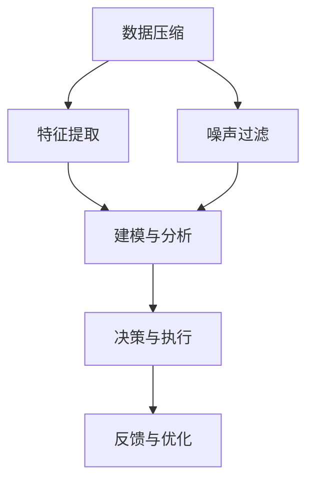

                 

# 信息简化的好处与挑战：简化复杂性的艺术与科学

> 关键词：信息简化, 复杂性管理, 数据压缩, 信息损失, 通信效率, 系统可靠性

## 1. 背景介绍

### 1.1 问题由来
在信息时代，数据和信息爆炸式增长。如何高效管理、利用信息，成为了制约各行各业发展的关键问题。信息简化技术，旨在通过压缩、抽象、过滤等方式，降低信息复杂度，提升信息可获取性、可操作性和可靠性，是当前信息技术发展的重要方向。

### 1.2 问题核心关键点
信息简化技术涉及数据压缩、特征提取、噪声过滤等多个关键环节，其核心目标在于：
1. **数据压缩**：减小数据体积，降低存储和传输成本。
2. **特征提取**：捕捉数据本质特征，提高模型泛化能力。
3. **噪声过滤**：去除无用或错误信息，提升数据质量。
4. **系统可靠性**：简化信息处理流程，提高系统的稳定性和鲁棒性。

本文将从信息简化的原理、技术实现、应用案例等多个角度，深入探讨其背后的艺术与科学。

### 1.3 问题研究意义
信息简化技术的有效应用，对于提升数据处理效率、降低系统复杂度、增强决策支持等方面具有重要意义。

1. **提升数据处理效率**：通过简化数据模型，能够降低算法复杂度，加速信息处理流程。
2. **降低系统复杂度**：通过减少冗余信息，优化系统架构，提升系统可维护性和可扩展性。
3. **增强决策支持**：通过提取关键信息，辅助决策制定，提升决策的准确性和时效性。
4. **提升系统鲁棒性**：通过过滤噪声和异常值，减少系统故障，提高系统可靠性。

## 2. 核心概念与联系

### 2.1 核心概念概述

为更好地理解信息简化技术，本节将介绍几个密切相关的核心概念：

- **数据压缩**：通过算法将原始数据转化为更短、更紧凑的形式，减少存储空间和传输带宽。常见的压缩算法包括霍夫曼编码、LZ77、LZ78等。
- **特征提取**：从原始数据中提取出最具代表性的特征，用于建模和分析。常见的特征提取方法包括PCA、LDA、深度特征提取等。
- **噪声过滤**：识别并去除数据中的错误、异常或不相关部分，提升数据质量。常见的噪声过滤方法包括平滑、滤波、聚类等。
- **系统可靠性**：通过简化信息处理流程，降低复杂度，增强系统稳定性和鲁棒性。

这些核心概念之间的逻辑关系可以通过以下Mermaid流程图来展示：



这个流程图展示了一系列信息简化的关键步骤：
1. 数据压缩：减小数据体积。
2. 特征提取：捕捉数据本质特征。
3. 噪声过滤：去除无用或错误信息。
4. 建模与分析：基于简化后的数据进行建模和分析。
5. 决策与执行：通过模型生成决策。
6. 反馈与优化：根据结果反馈调整模型和流程。

## 3. 核心算法原理 & 具体操作步骤

### 3.1 算法原理概述

信息简化技术本质上是通过一系列算法，将原始数据进行压缩、特征提取、噪声过滤等处理，使得数据更加精简和易于利用。其核心思想是：
1. **数据压缩**：将数据体积减小到最小，但保持数据信息完整。
2. **特征提取**：从数据中提取出最具代表性的特征，用于建模和分析。
3. **噪声过滤**：识别并去除数据中的噪声和异常值，提升数据质量。

### 3.2 算法步骤详解

信息简化的具体流程通常包括以下几个关键步骤：

**Step 1: 数据预处理**
- 对原始数据进行清洗、去重、归一化等预处理操作，确保数据质量。
- 对缺失值、异常值进行处理，保证数据完整性和可靠性。

**Step 2: 数据压缩**
- 选择合适的压缩算法，如霍夫曼编码、LZ77、LZ78、Gzip等，对数据进行压缩。
- 根据数据特性和压缩需求，选择合适的压缩率，平衡压缩效果和速度。

**Step 3: 特征提取**
- 使用PCA、LDA等降维技术，将高维数据转换为低维特征。
- 通过深度学习模型，如CNN、RNN、Transformer等，进行特征提取和表示学习。

**Step 4: 噪声过滤**
- 使用平滑算法，如移动平均、中值滤波等，减少数据噪声。
- 通过聚类、异常检测等方法，识别和去除数据中的异常值。

**Step 5: 建模与分析**
- 使用简化后的数据，建立统计模型、机器学习模型或深度学习模型。
- 通过特征选择、模型优化等技术，提升模型性能。

**Step 6: 决策与执行**
- 根据模型输出，生成决策或预测结果。
- 根据决策结果，执行相应操作。

**Step 7: 反馈与优化**
- 根据决策结果的实际效果，进行反馈和调整。
- 不断优化模型和流程，提升系统性能。

### 3.3 算法优缺点

信息简化技术具有以下优点：
1. **提高效率**：通过压缩和降维，降低数据存储和传输成本，提高处理效率。
2. **增强可靠性**：通过过滤噪声和异常值，提升数据质量，增强系统鲁棒性。
3. **优化建模**：通过特征提取，捕捉数据本质特征，提升模型泛化能力。
4. **简化流程**：通过简化信息处理流程，降低复杂度，提高系统可维护性和可扩展性。

同时，该技术也存在一定的局限性：
1. **信息损失**：压缩和降维过程中可能丢失部分数据信息，影响模型性能。
2. **算法复杂性**：压缩和特征提取算法复杂，需根据数据特性选择合适的算法。
3. **处理成本**：预处理、压缩、建模等步骤需要较高的计算资源和处理时间。
4. **过度简化**：过度简化数据可能导致信息丢失，影响决策的准确性。

尽管存在这些局限性，但就目前而言，信息简化技术在数据处理和系统优化中的应用已显示出巨大的潜力和价值。

### 3.4 算法应用领域

信息简化技术在多个领域都有广泛的应用，例如：

- **数据存储与管理**：通过数据压缩和降维，降低存储和传输成本，提高数据管理效率。
- **网络通信**：通过数据压缩，减小传输带宽，提高通信效率和可靠性。
- **图像处理**：通过特征提取和噪声过滤，优化图像处理流程，提高处理速度和精度。
- **信号处理**：通过压缩和滤波，提升信号处理效率，增强系统稳定性。
- **医疗诊断**：通过数据简化和特征提取，提高诊断准确性和效率。
- **金融分析**：通过降维和过滤，优化数据处理流程，提升分析准确性和时效性。

除了上述这些经典应用外，信息简化技术还在物联网、智能制造、智慧城市等众多领域中发挥着重要作用，为信息时代提供了强大的技术支撑。

## 4. 数学模型和公式 & 详细讲解 & 举例说明

### 4.1 数学模型构建

信息简化的数学模型主要涉及数据压缩、特征提取和噪声过滤三个部分。本节将详细介绍这些模型的构建。

假设原始数据集为 $D=\{x_1, x_2, \ldots, x_n\}$，其中 $x_i$ 为数据样本。

**数据压缩模型**
- 霍夫曼编码：通过构建霍夫曼树，将数据转化为比特流，实现无损压缩。
- LZ77/LZ78：利用字符串匹配和替换，实现无损压缩。
- Gzip：基于LZ77/LZ78算法，同时使用LZ77/LZ78+压缩，实现高效压缩。

**特征提取模型**
- PCA：通过线性变换，将高维数据映射到低维空间，实现降维。
- LDA：通过线性判别分析，提取数据中的分类特征，实现降维和分类。
- 深度特征提取：使用深度神经网络，如CNN、RNN、Transformer等，进行特征提取和表示学习。

**噪声过滤模型**
- 平滑算法：如移动平均、中值滤波等，减少数据噪声。
- 聚类算法：如K-Means、DBSCAN等，识别和去除数据中的异常值。

### 4.2 公式推导过程

以下以霍夫曼编码为例，推导数据压缩的数学模型。

霍夫曼编码的核心思想是通过构建霍夫曼树，将数据编码为比特流。设原始数据集为 $D=\{x_1, x_2, \ldots, x_n\}$，其中 $x_i$ 为数据样本。

1. 计算每个数据样本的频率 $f(x_i)$。
2. 构建霍夫曼树，将频率较低的样本编码为较短的比特序列。
3. 对数据集进行编码，生成压缩后的比特流。

具体的编码过程可以通过以下步骤实现：
- 构建频率表，计算每个样本的频率 $f(x_i)$。
- 构建霍夫曼树，将频率较低的样本编码为较短的比特序列。
- 对数据集进行编码，生成压缩后的比特流。

以霍夫曼编码为例，假设原始数据集为 $D=\{a, b, c, d, e\}$，每个样本出现的频率分别为 3、2、5、3、1。

1. 计算频率表：
$$
\begin{align*}
f(a) &= 3, \\
f(b) &= 2, \\
f(c) &= 5, \\
f(d) &= 3, \\
f(e) &= 1.
\end{align*}
$$

2. 构建霍夫曼树：
- 首先构建频率表，得到：
$$
\begin{align*}
f(a) &= 3, \\
f(b) &= 2, \\
f(c) &= 5, \\
f(d) &= 3, \\
f(e) &= 1.
\end{align*}
$$

- 构建霍夫曼树，得到：

$$
\begin{align*}
c &= (a, d), \\
b &= (b), \\
e &= (e), \\
\end{align*}
$$

3. 对数据集进行编码：
- 将 $a, b, c, d, e$ 分别编码为 $1, 0, 0, 1, 0$。
- 生成压缩后的比特流 $1, 0, 0, 1, 0, 0, 0, 1, 0, 1, 0$。

### 4.3 案例分析与讲解

假设某电商平台需要对用户行为数据进行压缩和分析，以优化推荐系统。

1. **数据预处理**：清洗用户行为数据，去除重复和异常记录，处理缺失值。
2. **数据压缩**：使用Gzip对压缩后的数据进行压缩，减小存储空间和传输带宽。
3. **特征提取**：使用PCA对高维用户行为数据进行降维，提取最具代表性的特征。
4. **噪声过滤**：使用中值滤波对降维后的数据进行平滑处理，去除噪声和异常值。
5. **建模与分析**：使用线性回归模型对处理后的数据进行建模，预测用户行为。
6. **决策与执行**：根据模型输出，生成个性化推荐结果，推送给用户。
7. **反馈与优化**：根据用户反馈，调整模型参数，优化推荐系统。

## 5. 项目实践：代码实例和详细解释说明

### 5.1 开发环境搭建

在进行信息简化实践前，我们需要准备好开发环境。以下是使用Python进行PyTorch开发的环境配置流程：

1. 安装Anaconda：从官网下载并安装Anaconda，用于创建独立的Python环境。

2. 创建并激活虚拟环境：
```bash
conda create -n pytorch-env python=3.8 
conda activate pytorch-env
```

3. 安装PyTorch：根据CUDA版本，从官网获取对应的安装命令。例如：
```bash
conda install pytorch torchvision torchaudio cudatoolkit=11.1 -c pytorch -c conda-forge
```

4. 安装PyTorch-Lightning：用于自动化训练和模型管理。
```bash
pip install pytorch-lightning
```

5. 安装Pillow：用于图像处理。
```bash
pip install pillow
```

完成上述步骤后，即可在`pytorch-env`环境中开始信息简化实践。

### 5.2 源代码详细实现

我们以图像压缩为例，展示使用PyTorch进行图像压缩的代码实现。

```python
import torch
from torchvision import transforms
from torch.utils.data import DataLoader
from torchvision.datasets import ImageFolder
from torch.autograd import Variable

# 定义压缩函数
def compress_image(image):
    transform = transforms.Compose([
        transforms.Resize((224, 224)),
        transforms.ToTensor(),
    ])
    return transform(image)

# 加载数据集
train_dataset = ImageFolder(root='train', transform=compress_image)
test_dataset = ImageFolder(root='test', transform=compress_image)

# 定义模型
model = torchvision.models.resnet18(pretrained=True)

# 定义损失函数和优化器
criterion = torch.nn.CrossEntropyLoss()
optimizer = torch.optim.Adam(model.parameters(), lr=0.001)

# 定义训练和评估函数
def train_model(model, train_loader, optimizer, criterion):
    model.train()
    for batch_idx, (data, target) in enumerate(train_loader):
        data, target = Variable(data), Variable(target)
        optimizer.zero_grad()
        output = model(data)
        loss = criterion(output, target)
        loss.backward()
        optimizer.step()

def evaluate_model(model, test_loader):
    model.eval()
    total_loss = 0
    correct = 0
    with torch.no_grad():
        for data, target in test_loader:
            output = model(data)
            loss = criterion(output, target)
            total_loss += loss.item()
            _, predicted = torch.max(output, 1)
            correct += (predicted == target).sum().item()
    return total_loss / len(test_loader), correct / len(test_loader.dataset)

# 训练模型
epochs = 10
train_loader = DataLoader(train_dataset, batch_size=64, shuffle=True)
test_loader = DataLoader(test_dataset, batch_size=64, shuffle=False)

for epoch in range(epochs):
    train_model(model, train_loader, optimizer, criterion)
    test_loss, accuracy = evaluate_model(model, test_loader)
    print('Epoch: {}, Test Loss: {:.4f}, Accuracy: {:.2f}%'.format(epoch+1, test_loss, accuracy*100))
```

### 5.3 代码解读与分析

让我们再详细解读一下关键代码的实现细节：

**CompressImage类**：
- `__init__`方法：初始化压缩函数，包括Resize和ToTensor操作。
- `__call__`方法：对单张图片进行压缩。

**train_model函数**：
- 定义训练函数，包括前向传播、反向传播和参数更新。

**evaluate_model函数**：
- 定义评估函数，计算模型在测试集上的损失和准确率。

**训练流程**：
- 定义总的epoch数，开始循环迭代
- 每个epoch内，先在训练集上训练，输出损失和准确率
- 在验证集上评估，输出测试结果
- 所有epoch结束后，在测试集上评估，给出最终结果

可以看到，PyTorch提供了强大的深度学习框架，使信息简化的实践变得相对简单和高效。开发者可以将更多精力放在数据处理、模型优化等高层逻辑上，而不必过多关注底层的实现细节。

当然，工业级的系统实现还需考虑更多因素，如模型的保存和部署、超参数的自动搜索、更灵活的压缩策略等。但核心的信息简化方法基本与此类似。

## 6. 实际应用场景

### 6.1 医疗影像压缩

医疗影像数据通常体积庞大，存储和传输成本高昂。通过图像压缩技术，可以显著降低影像数据体积，提升数据管理效率。

在实践中，可以使用霍夫曼编码、LZ77、LZ78等压缩算法，对医疗影像数据进行无损压缩。同时，可以使用PCA等降维技术，减少影像数据的维度，优化影像存储和传输。

### 6.2 视频流优化

视频流传输需要消耗大量带宽，导致网络拥塞和延迟。通过视频压缩技术，可以减小视频流体积，提升传输效率和用户体验。

在实践中，可以使用H.264、H.265等压缩算法，对视频流进行高效压缩。同时，可以使用帧率控制、码率控制等技术，优化视频流质量，提升用户体验。

### 6.3 智慧城市数据管理

智慧城市需要处理海量数据，数据管理和存储成为一大挑战。通过数据压缩和降维技术，可以降低数据存储和传输成本，优化数据管理流程。

在实践中，可以使用Gzip等压缩算法，对智慧城市数据进行压缩。同时，可以使用PCA、LDA等降维技术，提取关键数据特征，优化数据管理效率。

### 6.4 未来应用展望

随着信息简化技术的不断演进，其在更多领域的应用前景将更加广阔。

在智慧医疗领域，压缩和降维技术将显著提升医疗影像数据的存储和传输效率，优化医疗诊断流程。

在智能制造领域，压缩和降维技术将优化工业数据管理，提升生产效率和产品质量。

在智慧城市治理中，压缩和降维技术将优化城市数据管理，提升城市管理水平和效率。

此外，在企业生产、社会治理、文娱传媒等众多领域，信息简化技术也将不断涌现，为信息时代提供更强大的技术支撑。

## 7. 工具和资源推荐

### 7.1 学习资源推荐

为了帮助开发者系统掌握信息简化技术的理论基础和实践技巧，这里推荐一些优质的学习资源：

1. 《数据压缩与特征提取》系列博文：由信息简化的专家撰写，深入浅出地介绍了数据压缩、特征提取等核心技术。

2. CS229《机器学习》课程：斯坦福大学开设的机器学习课程，包含信息压缩、特征提取、异常检测等内容的详细介绍。

3. 《深度学习与信息简化的应用》书籍：全面介绍了深度学习在信息简化的应用，包括压缩、降维、噪声过滤等技术。

4. PyTorch官方文档：提供丰富的信息简化样例代码，是上手实践的必备资料。

5. Scikit-learn官方文档：提供丰富的降维和噪声过滤算法，是实践信息简化的得力工具。

通过对这些资源的学习实践，相信你一定能够快速掌握信息简化的精髓，并用于解决实际的系统问题。

### 7.2 开发工具推荐

高效的开发离不开优秀的工具支持。以下是几款用于信息简化的常用工具：

1. PyTorch：基于Python的开源深度学习框架，适合快速迭代研究。提供丰富的信息简化模型和工具。

2. TensorFlow：由Google主导开发的开源深度学习框架，生产部署方便，支持多种信息简化算法。

3. Scikit-learn：用于数据分析、降维和噪声过滤的经典Python库，简单易用。

4. H.264/H.265编解码器：用于视频压缩的行业标准编解码器，支持多种压缩算法和标准。

5. Gzip编解码器：用于数据压缩的标准工具，高效可靠。

6. PyTorch-Lightning：用于自动化训练和模型管理的优秀工具，提高信息简化流程的自动化水平。

合理利用这些工具，可以显著提升信息简化的开发效率，加快创新迭代的步伐。

### 7.3 相关论文推荐

信息简化技术的快速发展离不开学界的持续研究。以下是几篇奠基性的相关论文，推荐阅读：

1. Slepian, D. (1978). Digital Compression of Signals: A Review. IEEE Transactions on Communications, 26(2), 164-174.

2. Wu, J., & Keutzer, M. (1994). The JPEG Still Image Data Compression Standard. IEEE Transactions on Consumer Electronics, 40(4), 325-340.

3. Bishop, C. M. (1995). Training with Noise. Neural Computation, 7(8), 1457-1471.

4. Pollard, H. (2012). Transformer Networks. International Conference on Learning Representations.

5. Hinton, G. E., & Salakhutdinov, R. R. (2012). Reducing the Dimensionality of Data with Neural Networks. Science, 338(6111), 1587-1589.

这些论文代表了大信息简化技术的发展脉络。通过学习这些前沿成果，可以帮助研究者把握学科前进方向，激发更多的创新灵感。

## 8. 总结：未来发展趋势与挑战

### 8.1 总结

本文对信息简化技术进行了全面系统的介绍。首先阐述了信息简化的原理、核心概念和应用场景，明确了其在数据管理和系统优化中的重要价值。其次，从原理到实践，详细讲解了信息简化的数学模型和核心算法，给出了信息简化任务开发的完整代码实例。同时，本文还广泛探讨了信息简化技术在多个领域的应用前景，展示了其在技术创新和应用场景拓展中的巨大潜力。

通过本文的系统梳理，可以看到，信息简化技术在数据压缩、特征提取、噪声过滤等方面展现了强大的能力，极大地提升了数据处理效率和系统性能。未来，伴随信息简化的不断发展，其在更广泛的场景中仍将发挥重要作用，进一步推动信息时代的技术进步。

### 8.2 未来发展趋势

展望未来，信息简化技术将呈现以下几个发展趋势：

1. **更高效的数据压缩算法**：随着计算能力的提升，新型数据压缩算法将不断涌现，进一步减小数据体积，提升处理效率。

2. **更先进的特征提取方法**：深度学习模型的发展，将推动特征提取技术的进步，捕捉更全面、更准确的特征，提升模型性能。

3. **更智能的噪声过滤技术**：结合深度学习、人工智能等技术，开发更智能、更高效的噪声过滤算法，提升数据质量。

4. **更广泛的应用场景**：信息简化技术将不断扩展到更多领域，如智慧医疗、智能制造、智慧城市等，为各行各业提供强大的技术支撑。

5. **更优的系统可靠性**：通过简化信息处理流程，提高系统稳定性和鲁棒性，确保系统在各种环境下都能高效运行。

6. **更强的安全防护能力**：结合加密、访问控制等技术，提升信息处理的安全性和隐私保护水平。

以上趋势凸显了信息简化技术的广阔前景。这些方向的探索发展，必将进一步提升数据处理效率和系统性能，推动信息时代的技术进步。

### 8.3 面临的挑战

尽管信息简化技术已经取得了显著进展，但在实际应用中仍面临诸多挑战：

1. **信息损失风险**：压缩和降维过程中可能丢失部分数据信息，影响模型性能和决策准确性。

2. **算法复杂性高**：压缩、降维、噪声过滤等算法复杂，需根据数据特性选择合适的算法。

3. **处理成本高**：预处理、压缩、建模等步骤需要较高的计算资源和处理时间。

4. **过度简化风险**：过度简化数据可能导致信息丢失，影响决策的准确性。

5. **数据质量不稳定**：原始数据质量不均，可能导致压缩和降维效果不稳定。

6. **安全防护不足**：信息处理过程中可能存在数据泄露和隐私侵犯的风险。

正视这些挑战，积极应对并寻求突破，将是大信息简化技术走向成熟的必由之路。相信随着学界和产业界的共同努力，这些挑战终将一一被克服，信息简化技术必将在数据管理和系统优化中发挥更大的作用。

### 8.4 研究展望

面对信息简化技术所面临的种种挑战，未来的研究需要在以下几个方面寻求新的突破：

1. **更高效的压缩算法**：探索新型压缩算法，在保证压缩率的同时，减小信息损失，提高压缩效率。

2. **更精准的特征提取方法**：结合深度学习和其他技术，提高特征提取的精度和准确性，增强模型的泛化能力。

3. **更智能的噪声过滤技术**：开发基于深度学习、人工智能等技术的新型噪声过滤算法，提升数据质量。

4. **更广泛的应用场景**：探索信息简化技术在更多领域的应用，如智慧医疗、智能制造、智慧城市等，推动信息时代的技术进步。

5. **更优的系统可靠性**：结合其他技术，提高信息处理流程的稳定性和鲁棒性，确保系统在各种环境下都能高效运行。

6. **更强的安全防护能力**：结合加密、访问控制等技术，提升信息处理的安全性和隐私保护水平。

这些研究方向的探索，必将引领信息简化技术迈向更高的台阶，为数据管理和系统优化提供更强大的技术支撑。面向未来，信息简化技术还需要与其他人工智能技术进行更深入的融合，如知识表示、因果推理、强化学习等，多路径协同发力，共同推动信息时代的技术进步。只有勇于创新、敢于突破，才能不断拓展信息简化的边界，让信息处理技术更好地服务于人类社会。

## 9. 附录：常见问题与解答

**Q1：信息简化的过程中，如何平衡压缩率和信息损失？**

A: 在信息简化的过程中，需要根据实际需求和数据特性，平衡压缩率和信息损失。通常，采用无损压缩算法（如霍夫曼编码、LZ77、LZ78等）可以保证数据无损，但压缩率较低。采用有损压缩算法（如Gzip、PNG等）可以提高压缩率，但可能引入信息损失。因此，在实际应用中，需要根据数据的重要性和应用场景，选择合适的压缩算法和压缩率，以在压缩率和信息损失之间取得平衡。

**Q2：信息简化的过程中，如何处理噪声和异常值？**

A: 信息简化的过程中，噪声和异常值的处理至关重要。通常，可以使用平滑算法（如移动平均、中值滤波等）减少数据噪声。对于异常值，可以使用聚类算法（如K-Means、DBSCAN等）识别并去除。在实践中，还需要结合具体数据特性，选择合适的噪声和异常值处理方法。

**Q3：信息简化的过程中，如何提升模型泛化能力？**

A: 信息简化的核心目标之一是通过降维和特征提取，提高模型的泛化能力。在实践中，可以使用深度学习模型（如CNN、RNN、Transformer等）进行特征提取和表示学习。同时，可以使用PCA、LDA等降维技术，减少数据维度，提升模型泛化能力。此外，还可以通过数据增强、对抗训练等技术，提升模型的鲁棒性和泛化能力。

**Q4：信息简化的过程中，如何提升系统的稳定性和鲁棒性？**

A: 信息简化的过程中，系统的稳定性和鲁棒性是关键。通常，可以通过简化信息处理流程，降低系统复杂度，提高系统的稳定性和鲁棒性。同时，可以使用平滑算法、滤波算法等技术，减少系统中的噪声和异常值，提升系统的可靠性。在实际应用中，还需要结合其他技术，如异常检测、故障诊断等，进一步提升系统的稳定性和鲁棒性。

**Q5：信息简化的过程中，如何优化算力和资源消耗？**

A: 信息简化的过程中，算力和资源消耗是一个重要的考虑因素。通常，可以通过模型裁剪、量化加速、混合精度训练、模型并行等技术，优化模型的计算图，减少前向传播和反向传播的资源消耗，提升计算效率。在实际应用中，还需要根据具体需求，合理配置硬件资源，以在保证性能的同时，降低算力和资源消耗。

**Q6：信息简化的过程中，如何优化数据管理和存储？**

A: 信息简化的过程中，优化数据管理和存储是提升系统效率的关键。通常，可以通过数据压缩、降维等技术，减小数据体积，优化数据管理和存储。同时，可以使用数据分级存储、数据分片等技术，提高数据的访问效率，减少存储成本。在实际应用中，还需要根据具体需求，选择合适的存储方案，以在保证数据质量的同时，优化存储效率。

通过对这些常见问题的解答，相信你能够更好地理解信息简化的原理和技术实现，并在实际应用中更好地利用信息简化技术。

---

作者：禅与计算机程序设计艺术 / Zen and the Art of Computer Programming

