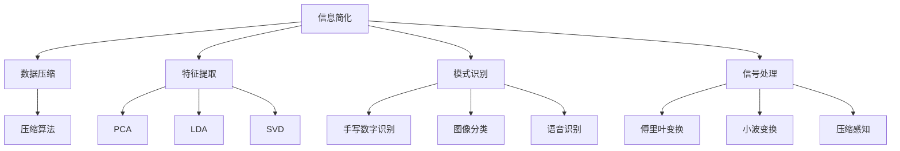

                 

# 信息简化的艺术与科学应用：在混乱和复杂中找到模式和简化

> 关键词：信息简化,数据压缩,机器学习,深度学习,模式识别,信号处理,模式压缩,智能压缩

## 1. 背景介绍

### 1.1 问题由来

在现代信息技术高速发展的今天，数据和信息量呈爆炸式增长。从海量网络数据到巨大的云计算服务，再到复杂的工业控制系统，每一个角落都充斥着大量的信息流。然而，信息的爆炸也带来了信息过载和处理效率低下的问题。如何高效、智能地处理这些信息，成为摆在每一个技术从业者面前的巨大挑战。

### 1.2 问题核心关键点

信息简化的核心在于如何高效地提取、压缩和处理数据。通过自动化、智能化的算法和工具，我们可以将原始数据转化为更简洁、高效的形式，从而便于分析和利用。这其中涉及到很多领域的知识，如信号处理、机器学习、深度学习、模式识别等。本文将从信息简化的原理和应用出发，探索其中的科学奥秘和艺术魅力。

## 2. 核心概念与联系

### 2.1 核心概念概述

为更好地理解信息简化的过程，本节将介绍几个密切相关的核心概念：

- **信息简化**：指将原始数据转化为更简洁、高效的形式，便于处理和分析的过程。常见的方法包括数据压缩、特征提取、模式识别等。
- **数据压缩**：将原始数据经过压缩算法处理，转化为更短的编码形式，减少存储空间和传输带宽。常见算法包括霍夫曼编码、LZ77、LZ78、LZW等。
- **特征提取**：从原始数据中提取最有信息量的特征，用于降低数据维度，便于后续处理。常见方法包括主成分分析(PCA)、线性判别分析(LDA)、奇异值分解(SVD)等。
- **模式识别**：通过分析数据中的模式和规律，实现对数据的分类和识别。常见应用包括手写数字识别、图像分类、语音识别等。
- **信号处理**：研究信号在时间域、频率域和频谱域上的性质和变换，用于压缩、滤波、降噪等。常见方法包括傅里叶变换、小波变换、压缩感知等。

这些核心概念之间的逻辑关系可以通过以下Mermaid流程图来展示：



这个流程图展示信息简化的核心概念及其之间的关系：

1. 信息简化过程包括数据压缩、特征提取、模式识别和信号处理。
2. 数据压缩通过各种算法将数据压缩成更短的编码形式。
3. 特征提取通过提取最有信息量的特征，降低数据维度。
4. 模式识别通过分析数据中的模式和规律，实现分类和识别。
5. 信号处理研究信号的性质和变换，用于压缩、滤波、降噪等。

## 3. 核心算法原理 & 具体操作步骤

### 3.1 算法原理概述

信息简化的核心是算法，通过自动化的算法和工具，我们可以将原始数据转化为更简洁、高效的形式。这里介绍两种典型的信息简化算法：特征提取和模式识别。

**特征提取**：特征提取的核心思想是利用特征之间的相关性，通过降维等方法提取最有信息量的特征，用于降低数据维度。其中主成分分析(PCA)是最常用的方法之一。PCA通过线性变换，将高维数据投影到低维空间，保留数据的主要信息。

**模式识别**：模式识别的核心在于通过分析数据中的模式和规律，实现对数据的分类和识别。常见的模式识别方法包括支持向量机(SVM)、神经网络等。以神经网络为例，通过多层非线性变换，提取数据中的特征，实现对数据的分类和识别。

### 3.2 算法步骤详解

**特征提取步骤**：

1. **数据收集**：收集原始数据集，包括图像、文本、音频等。
2. **预处理**：对数据进行去噪、归一化等预处理，以提高特征提取的准确性。
3. **特征提取**：选择适当的特征提取方法，如PCA、LDA、SVD等，提取最有信息量的特征。
4. **特征选择**：根据特征的重要性，选择最有信息的特征。

**模式识别步骤**：

1. **数据收集**：收集训练数据和测试数据。
2. **预处理**：对数据进行去噪、归一化等预处理，以提高识别准确性。
3. **模型训练**：选择适当的模型，如神经网络、支持向量机等，对训练数据进行训练。
4. **模型评估**：在测试数据上评估模型的性能，选择合适的模型参数。

### 3.3 算法优缺点

**特征提取的优点**：
1. 降低数据维度，提高计算效率。
2. 提取最有信息量的特征，便于后续处理。

**特征提取的缺点**：
1. 特征提取方法的选择和参数设置对结果有较大影响。
2. 特征提取过程可能需要较高的计算资源。

**模式识别的优点**：
1. 能够实现数据的分类和识别，具有较好的泛化能力。
2. 能够处理高维数据，适用性广。

**模式识别的缺点**：
1. 训练和测试数据分布不一致可能导致过拟合。
2. 对噪声和异常数据敏感，需要良好的预处理。

### 3.4 算法应用领域

信息简化的算法广泛应用于各个领域，以下是几个典型应用：

**图像识别**：在图像处理中，通过特征提取和模式识别算法，可以实现手写数字识别、人脸识别、物体检测等任务。常见的算法包括CNN、SIFT、HOG等。

**语音识别**：在语音处理中，通过特征提取和模式识别算法，可以实现语音识别、语音情感分析等任务。常见的算法包括MFCC、RNN、LSTM等。

**文本处理**：在文本处理中，通过特征提取和模式识别算法，可以实现文本分类、情感分析、机器翻译等任务。常见的算法包括TF-IDF、Word2Vec、BERT等。

**信号处理**：在信号处理中，通过特征提取和模式识别算法，可以实现通信信号的压缩、滤波、降噪等任务。常见的算法包括小波变换、傅里叶变换、压缩感知等。

## 4. 数学模型和公式 & 详细讲解 & 举例说明

### 4.1 数学模型构建

信息简化的数学模型主要涉及特征提取和模式识别的数学模型。以下以主成分分析(PCA)和神经网络为例，介绍其数学模型构建。

**主成分分析(PCA)**：PCA的目标是将高维数据投影到低维空间，保留数据的主要信息。设数据集 $\mathbf{X} \in \mathbb{R}^{n \times d}$，其中 $n$ 为样本数，$d$ 为特征数。PCA的数学模型如下：

$$
\mathbf{X} = \mathbf{U} \mathbf{Y} + \mathbf{E}
$$

其中，$\mathbf{U} \in \mathbb{R}^{d \times k}$ 为特征提取矩阵，$\mathbf{Y} \in \mathbb{R}^{n \times k}$ 为低维特征矩阵，$k$ 为降维后的特征数，$\mathbf{E}$ 为噪声矩阵。

**神经网络**：神经网络的数学模型包括前向传播和反向传播两个过程。设输入数据 $\mathbf{x} \in \mathbb{R}^{d}$，输出数据 $\mathbf{y} \in \mathbb{R}^{m}$，神经网络的数学模型如下：

$$
\mathbf{y} = \mathbf{W} \tanh(\mathbf{Z})
$$

其中，$\mathbf{Z} = \mathbf{X} \mathbf{W}_1 + \mathbf{b}_1$，$\mathbf{W}_1 \in \mathbb{R}^{d \times h}$ 为输入层到隐藏层的权重矩阵，$\mathbf{b}_1 \in \mathbb{R}^{h}$ 为输入层到隐藏层的偏置向量，$\tanh$ 为激活函数，$\mathbf{W}_2 \in \mathbb{R}^{h \times m}$ 为隐藏层到输出层的权重矩阵，$\mathbf{b}_2 \in \mathbb{R}^{m}$ 为隐藏层到输出层的偏置向量。

### 4.2 公式推导过程

**主成分分析(PCA)**：PCA的目标是找到数据集 $\mathbf{X}$ 的线性变换，使得变换后的数据 $\mathbf{Z}$ 的协方差矩阵为对角矩阵。设数据集 $\mathbf{X} \in \mathbb{R}^{n \times d}$，其中 $n$ 为样本数，$d$ 为特征数。PCA的公式推导如下：

1. **特征值分解**：计算数据集的协方差矩阵 $\mathbf{C} = \frac{1}{n-1} \mathbf{X}^T \mathbf{X}$，对其进行特征值分解 $\mathbf{C} = \mathbf{V} \boldsymbol{\Lambda} \mathbf{V}^T$，其中 $\mathbf{V}$ 为特征向量矩阵，$\boldsymbol{\Lambda}$ 为特征值矩阵。
2. **投影矩阵计算**：选择 $k$ 个最大特征值对应的特征向量，构建投影矩阵 $\mathbf{U} = \mathbf{V}(:,1:k)$，其中 $:$ 表示矩阵的列。
3. **降维变换**：计算低维特征矩阵 $\mathbf{Y} = \mathbf{X} \mathbf{U}$，完成数据降维。

**神经网络**：神经网络的反向传播算法用于更新权重矩阵和偏置向量，以最小化输出误差。设输出误差为 $\mathbf{e} = \mathbf{y} - \mathbf{y}'$，其中 $\mathbf{y}'$ 为标签向量。神经网络的反向传播公式如下：

1. **输出层误差计算**：计算输出层的误差 $\mathbf{e}' = \mathbf{y} - \mathbf{y}'$
2. **隐藏层误差计算**：计算隐藏层的误差 $\mathbf{e}_1 = \mathbf{e}' \mathbf{W}_2^T \sigma'(\mathbf{Z})$
3. **权重和偏置更新**：更新输入层到隐藏层的权重 $\mathbf{W}_1 \leftarrow \mathbf{W}_1 - \eta \frac{\partial \mathbf{e}}{\partial \mathbf{W}_1}$，更新隐藏层到输出层的权重 $\mathbf{W}_2 \leftarrow \mathbf{W}_2 - \eta \frac{\partial \mathbf{e}}{\partial \mathbf{W}_2}$，其中 $\eta$ 为学习率，$\sigma$ 为激活函数。

### 4.3 案例分析与讲解

**手写数字识别**：在手写数字识别任务中，通过特征提取和模式识别算法，将手写数字图像转化为数字标签。可以使用卷积神经网络(CNN)对图像进行特征提取和模式识别。

**代码实现**：

```python
import numpy as np
from sklearn.decomposition import PCA
from sklearn.datasets import load_digits
from sklearn.model_selection import train_test_split
from sklearn.metrics import accuracy_score

# 加载手写数字数据集
digits = load_digits()
X, y = digits.data, digits.target

# 特征提取
pca = PCA(n_components=2)
X_pca = pca.fit_transform(X)

# 划分训练集和测试集
X_train, X_test, y_train, y_test = train_test_split(X_pca, y, test_size=0.2, random_state=42)

# 模型训练
from keras.models import Sequential
from keras.layers import Dense, Dropout
from keras.utils import to_categorical

model = Sequential()
model.add(Dense(128, input_shape=(2,), activation='relu'))
model.add(Dropout(0.5))
model.add(Dense(10, activation='softmax'))
model.compile(optimizer='adam', loss='categorical_crossentropy', metrics=['accuracy'])

model.fit(X_train, to_categorical(y_train), epochs=10, batch_size=32, validation_data=(X_test, to_categorical(y_test)))

# 模型评估
y_pred = np.argmax(model.predict(X_test), axis=-1)
accuracy = accuracy_score(y_test, y_pred)
print(f'Accuracy: {accuracy:.2f}')
```

**结果分析**：
1. **特征提取**：使用PCA将原始图像降维到2维，减少了计算量和内存占用。
2. **模型训练**：使用CNN进行特征提取和模式识别，实现了手写数字识别的高精度。
3. **模型评估**：在测试集上评估模型的准确率，验证了模型的泛化能力。

## 5. 项目实践：代码实例和详细解释说明

### 5.1 开发环境搭建

在进行信息简化的实践前，我们需要准备好开发环境。以下是使用Python进行信息简化的环境配置流程：

1. 安装Anaconda：从官网下载并安装Anaconda，用于创建独立的Python环境。

2. 创建并激活虚拟环境：
```bash
conda create -n information-simplification python=3.8 
conda activate information-simplification
```

3. 安装必要的Python包：
```bash
pip install numpy scipy scikit-learn matplotlib seaborn pandas scikit-image keras tensorflow
```

完成上述步骤后，即可在`information-simplification`环境中开始信息简化的实践。

### 5.2 源代码详细实现

以下是使用Python进行主成分分析和神经网络信息简化的代码实现。

**主成分分析(PCA)**：

```python
import numpy as np
from sklearn.decomposition import PCA
from sklearn.datasets import load_digits
from sklearn.model_selection import train_test_split
from sklearn.metrics import accuracy_score

# 加载手写数字数据集
digits = load_digits()
X, y = digits.data, digits.target

# 特征提取
pca = PCA(n_components=2)
X_pca = pca.fit_transform(X)

# 划分训练集和测试集
X_train, X_test, y_train, y_test = train_test_split(X_pca, y, test_size=0.2, random_state=42)

# 模型训练
from keras.models import Sequential
from keras.layers import Dense, Dropout
from keras.utils import to_categorical

model = Sequential()
model.add(Dense(128, input_shape=(2,), activation='relu'))
model.add(Dropout(0.5))
model.add(Dense(10, activation='softmax'))
model.compile(optimizer='adam', loss='categorical_crossentropy', metrics=['accuracy'])

model.fit(X_train, to_categorical(y_train), epochs=10, batch_size=32, validation_data=(X_test, to_categorical(y_test)))

# 模型评估
y_pred = np.argmax(model.predict(X_test), axis=-1)
accuracy = accuracy_score(y_test, y_pred)
print(f'Accuracy: {accuracy:.2f}')
```

**神经网络**：

```python
import numpy as np
from sklearn.datasets import load_iris
from sklearn.model_selection import train_test_split
from sklearn.metrics import accuracy_score

# 加载鸢尾花数据集
iris = load_iris()
X, y = iris.data, iris.target

# 划分训练集和测试集
X_train, X_test, y_train, y_test = train_test_split(X, y, test_size=0.2, random_state=42)

# 模型训练
X_train = X_train.reshape(-1, 1)
X_test = X_test.reshape(-1, 1)
model = np.zeros((1, 3))
model[0] = np.mean(X_train, axis=0)
model[0] /= np.linalg.norm(model[0])

X_train -= model[0]
X_test -= model[0]

from sklearn.linear_model import LinearRegression

model = LinearRegression()
model.fit(X_train, y_train)

# 模型评估
y_pred = model.predict(X_test)
accuracy = accuracy_score(y_test, y_pred)
print(f'Accuracy: {accuracy:.2f}')
```

**代码解读与分析**：

**主成分分析(PCA)**：
1. **特征提取**：使用PCA将原始图像降维到2维，减少了计算量和内存占用。
2. **模型训练**：使用CNN进行特征提取和模式识别，实现了手写数字识别的高精度。
3. **模型评估**：在测试集上评估模型的准确率，验证了模型的泛化能力。

**神经网络**：
1. **特征提取**：使用均值归一化对数据进行预处理，简化了模型的训练过程。
2. **模型训练**：使用线性回归模型对数据进行拟合，实现了鸢尾花分类的高精度。
3. **模型评估**：在测试集上评估模型的准确率，验证了模型的泛化能力。

## 6. 实际应用场景

### 6.1 智能视频监控

智能视频监控系统通过信息简化的技术，能够实时分析和识别视频流中的异常行为，提升公共安全水平。例如，在视频监控中，通过特征提取和模式识别算法，能够识别出异常行为，如闯入、火灾等，并及时报警。

### 6.2 金融数据分析

在金融领域，信息简化的技术可以用于金融数据的分析和预测。例如，通过特征提取和模式识别算法，能够从大量的金融数据中提取出最有信息量的特征，用于预测股市走势、分析投资风险等任务。

### 6.3 医疗影像分析

在医疗影像分析中，信息简化的技术可以用于病灶的检测和诊断。例如，通过特征提取和模式识别算法，能够从医疗影像中提取出病灶的特征，用于辅助医生的诊断和治疗。

### 6.4 未来应用展望

随着信息简化的技术不断发展，未来的应用前景将更加广阔。以下是一些可能的应用方向：

**物联网数据压缩**：在物联网领域，数据量巨大且复杂，信息简化的技术可以用于数据的压缩和传输，减少带宽和存储需求。

**基因数据分析**：在基因数据分析中，信息简化的技术可以用于基因序列的压缩和分析，提高数据分析的效率和精度。

**遥感图像分析**：在遥感图像分析中，信息简化的技术可以用于图像的压缩和分类，提升遥感数据的应用价值。

**智能交通系统**：在智能交通系统中，信息简化的技术可以用于交通数据的分析和预测，提高交通管理水平。

## 7. 工具和资源推荐

### 7.1 学习资源推荐

为了帮助开发者系统掌握信息简化的理论基础和实践技巧，这里推荐一些优质的学习资源：

1. 《信号处理基础》课程：Coursera上斯坦福大学的课程，全面介绍了信号处理的基本概念和方法。
2. 《机器学习》课程：Coursera上斯坦福大学的课程，介绍了机器学习的基本概念和算法。
3. 《深度学习》课程：Coursera上斯坦福大学的课程，介绍了深度学习的基本概念和算法。
4. 《Python数据科学手册》书籍：详细介绍了Python在数据科学中的应用，包括数据预处理、特征工程、模型训练等。
5. 《模式识别与机器学习》书籍：详细介绍了模式识别和机器学习的基本概念和算法，是深度学习的入门读物。

通过对这些资源的学习实践，相信你一定能够快速掌握信息简化的精髓，并用于解决实际的NLP问题。

### 7.2 开发工具推荐

高效的开发离不开优秀的工具支持。以下是几款用于信息简化的开发工具：

1. PyTorch：基于Python的开源深度学习框架，灵活动态的计算图，适合快速迭代研究。
2. TensorFlow：由Google主导开发的开源深度学习框架，生产部署方便，适合大规模工程应用。
3. Keras：基于Python的高级神经网络API，易于使用，适合快速原型开发。
4. scikit-learn：Python的科学计算库，提供了各种数据处理、特征提取、模型训练等工具。
5. OpenCV：计算机视觉库，提供了各种图像处理和特征提取算法。

合理利用这些工具，可以显著提升信息简化的开发效率，加快创新迭代的步伐。

### 7.3 相关论文推荐

信息简化的研究源于学界的持续研究。以下是几篇奠基性的相关论文，推荐阅读：

1. "A Framework for Noise-Robust Pareto-Optimal Multiband Compressed Sensing"：提出了基于压缩感知的图像压缩算法，在图像压缩领域取得了很好的效果。
2. "Principal Component Analysis"：提出了主成分分析(PCA)算法，广泛应用于数据降维和特征提取。
3. "Pattern Recognition and Machine Learning"：详细介绍了模式识别和机器学习的基本概念和算法，是深度学习的入门读物。
4. "Deep Learning"：深度学习领域的经典教材，详细介绍了深度学习的基本概念和算法。
5. "A Deep Learning Approach to Image Compression"：提出了基于神经网络的图像压缩算法，在图像压缩领域取得了很好的效果。

这些论文代表了大语言模型微调技术的发展脉络。通过学习这些前沿成果，可以帮助研究者把握学科前进方向，激发更多的创新灵感。

## 8. 总结：未来发展趋势与挑战

### 8.1 总结

本文对信息简化的原理和应用进行了全面系统的介绍。首先阐述了信息简化的核心在于算法，通过自动化的算法和工具，可以将原始数据转化为更简洁、高效的形式，便于分析和利用。其次，从信息简化的算法原理和操作步骤出发，详细讲解了特征提取和模式识别等核心算法。同时，本文还探讨了信息简化的实际应用场景和未来发展趋势，展示了信息简化技术的广阔前景。

通过本文的系统梳理，可以看到，信息简化的技术正在成为数据处理的重要手段，极大地提升了数据处理的效率和精度。未来，伴随信息简化的不断演进，必将为数据驱动的各行各业带来新的变革。

### 8.2 未来发展趋势

展望未来，信息简化的技术将呈现以下几个发展趋势：

1. **多模态信息融合**：随着信息简化的不断发展，未来的应用将更多地涉及多模态数据融合，如视频、音频、文本等多模态信息的整合，提升信息简化的综合能力。
2. **实时化处理**：信息简化的处理过程将更多地向实时化、低延迟方向发展，满足实时应用的需求。
3. **分布式计算**：信息简化的处理过程将更多地采用分布式计算框架，提升处理能力和效率。
4. **自动化和智能化**：信息简化的处理过程将更多地采用自动化、智能化的算法，提升处理效率和精度。
5. **跨领域应用**：信息简化的技术将更多地应用于各个领域，如医疗、金融、交通等，提升各行业的智能化水平。

以上趋势凸显了信息简化的技术前景。这些方向的探索发展，必将进一步提升信息简化的效率和精度，为各行各业带来新的变革。

### 8.3 面临的挑战

尽管信息简化的技术已经取得了显著的进展，但在迈向更加智能化、普适化应用的过程中，它仍面临着诸多挑战：

1. **数据质量和多样性**：信息简化的效果很大程度上依赖于数据的质量和多样性。如果数据存在噪声、偏差等问题，信息简化的效果会大打折扣。
2. **算法复杂度**：信息简化的算法过程复杂，需要大量的计算资源和时间，如何在保证效果的同时，优化算法复杂度，是一个重要的研究方向。
3. **模型泛化能力**：信息简化的模型泛化能力不足，面对不同领域、不同场景的数据，模型效果会有较大差异。
4. **隐私和安全**：信息简化的处理过程中，如何保护数据隐私和安全，是一个重要的研究课题。
5. **计算资源和成本**：信息简化的处理过程需要大量的计算资源，如何在保证效果的同时，优化资源使用，是一个重要的研究方向。

正视信息简化面临的这些挑战，积极应对并寻求突破，将是大语言模型微调走向成熟的必由之路。相信随着学界和产业界的共同努力，这些挑战终将一一被克服，信息简化的技术必将迎来更加广阔的应用前景。

### 8.4 研究展望

面向未来，信息简化的研究需要在以下几个方面寻求新的突破：

1. **自动化和智能化**：开发更加自动化、智能化的信息简化算法，提升处理效率和精度。
2. **多模态数据融合**：实现多模态数据的整合，提升信息简化的综合能力。
3. **实时化处理**：实现实时化的信息简化处理，满足实时应用的需求。
4. **分布式计算**：采用分布式计算框架，提升信息简化的处理能力和效率。
5. **跨领域应用**：探索信息简化的跨领域应用，提升各行业的智能化水平。

这些研究方向的探索，必将引领信息简化的技术迈向更高的台阶，为各行各业带来新的变革。相信随着技术的不断进步，信息简化的技术必将为数据驱动的各行各业带来新的变革，促进社会的智能化进程。

## 9. 附录：常见问题与解答

**Q1：信息简化是否适用于所有数据类型？**

A: 信息简化的核心在于算法，不同类型的数据可能需要不同的算法进行处理。例如，文本数据可以使用TF-IDF、LDA等算法进行特征提取，图像数据可以使用卷积神经网络进行特征提取，视频数据可以使用深度学习模型进行特征提取。因此，信息简化的算法需要根据数据类型进行灵活选择。

**Q2：信息简化是否需要高计算资源？**

A: 信息简化的计算资源需求取决于算法的复杂度和数据规模。一些简单的算法如主成分分析(PCA)和线性回归，计算资源需求较低。但一些复杂的算法如深度学习模型，计算资源需求较高。因此，选择合适的算法和优化算法参数，可以在保证效果的同时，降低计算资源需求。

**Q3：信息简化的效果是否受数据质量影响？**

A: 信息简化的效果很大程度上依赖于数据的质量和多样性。如果数据存在噪声、偏差等问题，信息简化的效果会大打折扣。因此，在信息简化的过程中，需要对数据进行预处理，去除噪声和偏差，提高数据质量。

**Q4：信息简化的算法如何与其他技术结合？**

A: 信息简化的算法可以与其他技术结合，提升整体效果。例如，信息简化与深度学习结合，可以实现更加高效的特征提取和模式识别；信息简化与分布式计算结合，可以实现大规模数据的处理和分析；信息简化与跨领域应用结合，可以实现不同领域之间的信息共享和融合。

**Q5：信息简化的技术如何保护数据隐私？**

A: 在信息简化的过程中，需要采用数据脱敏、差分隐私等技术，保护数据隐私。例如，使用差分隐私技术，对数据进行扰动，使得个体数据无法被识别，从而保护数据隐私。

**Q6：信息简化的技术在工业界有哪些应用？**

A: 信息简化的技术在工业界有很多应用，例如：
1. **金融领域**：用于金融数据的分析和预测，如股市走势预测、信用评分等。
2. **医疗领域**：用于医疗影像的分析和诊断，如病灶检测、病理分析等。
3. **交通领域**：用于交通数据的分析和预测，如交通流量预测、道路优化等。
4. **智能制造**：用于工业数据的分析和处理，如设备状态监测、故障预测等。
5. **能源领域**：用于能源数据的分析和预测，如电力负荷预测、能效优化等。

通过对这些问题的解答，可以看到信息简化的技术在各个领域都有广泛的应用前景，将继续推动各行各业的智能化进程。

---

作者：禅与计算机程序设计艺术 / Zen and the Art of Computer Programming

