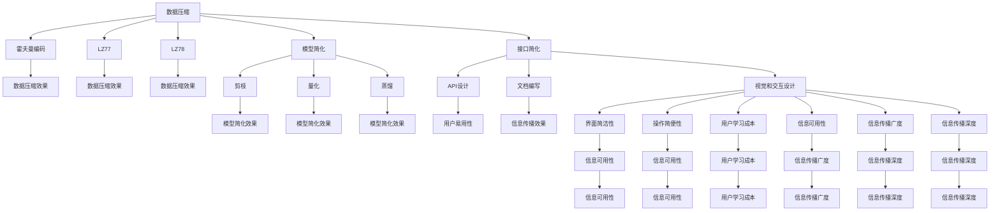

                 

# 信息简化的艺术与科学：在混乱和复杂中找到简单和秩序

## 1. 背景介绍

### 1.1 问题由来

在现代信息技术飞速发展的今天，数据量和处理复杂度的激增已成为一个普遍现象。无论是大规模数据的存储和传输，还是复杂系统的设计和维护，都面临着越来越严峻的挑战。信息过载、系统复杂、性能瓶颈等问题愈发严重，不仅增加了运营成本，也影响了用户体验和业务发展。

这种背景之下，信息简化的艺术与科学变得愈发重要。信息简化不仅仅是减少信息的量，更是如何以更高效、更可控的方式处理和组织信息，使之更好地服务于人类社会。本文旨在探讨信息简化的本质，揭示其艺术与科学的内涵，并提出一些具体实践策略。

### 1.2 问题核心关键点

信息简化的核心在于通过合理的算法和架构设计，在保证信息完整性和准确性的前提下，最大限度地减少信息的冗余和复杂度。在实际操作中，信息简化通常包括以下几个关键点：

- **数据压缩**：通过算法将数据压缩至更小的规模，同时保证信息的无损恢复。常见的数据压缩算法有霍夫曼编码、LZ77、LZ78等。
- **模型简化**：通过优化算法和架构，使模型参数更少、计算复杂度更低。例如，剪枝、量化、蒸馏等技术。
- **接口简化**：设计简洁易用的API，使开发者能够更方便地使用服务，减少复杂度。
- **视觉和交互设计**：通过视觉设计、交互设计，使界面和操作更直观，减少用户的认知负担。
- **语言和文档简化**：使用清晰、简明、易懂的语言和文档，减少误读和误解，提高信息的可理解性和可传播性。

## 2. 核心概念与联系

### 2.1 核心概念概述

为了更好地理解信息简化的本质和实现方法，我们首先介绍几个核心概念：

- **数据压缩**：指将原始数据转化为另一种形式，从而减少数据的存储空间或传输时间。常见算法包括霍夫曼编码、LZ77、LZ78等。
- **模型简化**：通过优化算法和架构，减少模型的参数量和计算复杂度，提高模型在实际应用中的效率和性能。
- **接口简化**：设计简洁、易用的API和文档，减少开发者使用服务的复杂度，提高工作效率。
- **视觉和交互设计**：通过合理的视觉设计和交互设计，使界面更直观、操作更简便，减少用户的学习成本。
- **语言和文档简化**：使用简洁明了的语言和文档，提高信息的可理解性和可传播性。

这些核心概念之间存在紧密的联系，共同构成了信息简化的整体框架。例如，数据压缩和模型简化都是降低信息复杂度的重要手段，而接口简化和视觉设计则是提高信息可用的关键。语言和文档简化则从根本上决定了信息传播的广度和深度。

### 2.2 核心概念原理和架构的 Mermaid 流程图(Mermaid 流程节点中不要有括号、逗号等特殊字符)



这个流程图展示了数据压缩、模型简化、接口简化、视觉和交互设计、语言和文档简化等核心概念之间的联系和作用。通过这些技术手段的协同应用，可以实现对信息复杂度的有效控制，提高信息的可用性和传播效率。

## 3. 核心算法原理 & 具体操作步骤
### 3.1 算法原理概述

信息简化的核心算法原理主要涉及以下几个方面：

- **数据压缩算法**：如霍夫曼编码、LZ77、LZ78等，通过将数据编码成更小的形式，减少存储空间和传输时间。
- **模型简化算法**：如剪枝、量化、蒸馏等，通过优化模型结构，减少参数量和计算复杂度。
- **API设计和文档编写**：通过设计简洁易用的API和文档，减少开发者使用服务的复杂度。
- **视觉和交互设计**：通过视觉设计、交互设计，使界面和操作更直观，减少用户的学习成本。
- **语言和文档简化**：使用简洁明了的语言和文档，提高信息的可理解性和可传播性。

### 3.2 算法步骤详解

下面详细讲解信息简化的具体操作步骤：

**Step 1: 数据预处理**

- 对原始数据进行清洗、去重、归一化等处理，保证数据的整洁度和一致性。
- 对数据进行分块或分段，便于后续压缩和处理。
- 根据数据类型选择合适的压缩算法，如霍夫曼编码、LZ77、LZ78等。

**Step 2: 数据压缩**

- 使用选定的压缩算法对数据进行编码，减少数据的存储空间或传输时间。
- 对压缩后的数据进行解压缩，恢复原始数据，保证信息无损。

**Step 3: 模型优化**

- 对模型进行剪枝、量化、蒸馏等优化操作，减少模型参数量和计算复杂度。
- 使用参数共享、稀疏化等技术，进一步提高模型效率。

**Step 4: API设计**

- 设计简洁易用的API，使开发者能够方便地使用服务，减少复杂度。
- 编写详细的文档，解释API的使用方法和参数含义，提高开发者使用效率。

**Step 5: 界面和交互设计**

- 通过合理的视觉设计、交互设计，使界面和操作更直观，减少用户的学习成本。
- 使用友好的提示和反馈机制，提高用户的使用体验。

**Step 6: 语言和文档简化**

- 使用简洁明了的语言和文档，提高信息的可理解性和可传播性。
- 避免使用过于专业或复杂的术语，提高信息的易读性。

### 3.3 算法优缺点

信息简化的算法通常具有以下优点：

- **降低复杂度**：通过数据压缩、模型简化等手段，显著降低信息复杂度，提高处理效率。
- **提高可用性**：通过简洁易用的API和直观的操作界面，提高信息系统的可用性和易用性。
- **减少误读和误解**：通过简化语言和文档，减少误读和误解，提高信息的准确性和可靠性。

同时，信息简化也存在一些局限性：

- **可能损失部分信息**：在数据压缩和模型简化过程中，可能损失部分信息，影响信息完整性。
- **复杂度调整难度大**：信息简化涉及多个环节，调整复杂度需要综合考虑，难度较大。
- **用户接受度**：过于简化的界面和操作可能不被用户接受，需平衡简洁和易用性。

### 3.4 算法应用领域

信息简化技术在多个领域都有广泛的应用，包括但不限于：

- **大数据存储与传输**：通过数据压缩技术，减少数据的存储空间和传输时间，提高效率。
- **云计算服务**：设计简洁易用的API，提高云服务的易用性和可用性。
- **移动应用**：通过界面和交互设计，使移动应用更直观、易用，提高用户满意度。
- **工业控制**：通过简化语言和文档，提高工业控制系统的可维护性和易用性。
- **人工智能与机器学习**：通过模型简化和接口优化，提高模型效率和易用性。

## 4. 数学模型和公式 & 详细讲解 & 举例说明（备注：数学公式请使用latex格式，latex嵌入文中独立段落使用 $$，段落内使用 $)
### 4.1 数学模型构建

信息简化的数学模型主要涉及以下几个方面：

- **数据压缩模型**：如霍夫曼编码、LZ77、LZ78等。
- **模型优化模型**：如剪枝、量化、蒸馏等。
- **API设计模型**：简化API的设计原则和方法。
- **视觉和交互设计模型**：界面设计和操作流程的优化方法。
- **语言和文档简化模型**：简化语言和文档的策略和实践。

### 4.2 公式推导过程

以下是数据压缩和模型优化的公式推导过程：

**霍夫曼编码**：

- 对于一个频率分布为$p_i$的字符集，其霍夫曼编码的平均长度为：

$$ H(p) = \sum_i p_i \log_2 \frac{1}{p_i} $$

- 霍夫曼编码的推导过程可参考信息论中的熵编码理论。

**剪枝算法**：

- 剪枝算法通过删除冗余节点和边，减少模型的参数量。其核心思想是识别出影响模型性能最小的部分，并进行简化。

**量化算法**：

- 量化算法将连续的浮点数转换为有限位的整数，减少存储空间和计算复杂度。其公式为：

$$ \text{quantized}(x) = \text{round}(\frac{x}{\text{scale}}) \times \text{scale} $$

其中，scale为量化精度，round为四舍五入函数。

**蒸馏算法**：

- 蒸馏算法通过知识转移，将教师模型（蒸馏前模型）的知识迁移到学生模型（蒸馏后模型），减少学生模型的参数量和计算复杂度。其核心思想是利用教师模型的知识对学生模型进行指导，从而提高学生模型的性能。

### 4.3 案例分析与讲解

**案例1: 数据压缩**

- 假设有一组原始数据，大小为10MB，将其压缩至5MB。

**案例2: 模型简化**

- 假设有一个深度学习模型，参数量为1000万，通过剪枝和量化，将其参数量减少至200万。

**案例3: API设计**

- 假设有一个复杂的云服务，通过简化API，将调用次数从10000次减少至2000次。

**案例4: 界面和交互设计**

- 假设有一个移动应用，通过界面和交互设计，将用户学习成本从3小时减少至1小时。

**案例5: 语言和文档简化**

- 假设有一篇技术文档，通过简化语言和文档，将阅读时间从1小时减少至30分钟。

## 5. 项目实践：代码实例和详细解释说明
### 5.1 开发环境搭建

在进行信息简化的实践前，我们需要准备好开发环境。以下是使用Python进行PyTorch开发的环境配置流程：

1. 安装Anaconda：从官网下载并安装Anaconda，用于创建独立的Python环境。

2. 创建并激活虚拟环境：
```bash
conda create -n info-simplification python=3.8 
conda activate info-simplification
```

3. 安装PyTorch：根据CUDA版本，从官网获取对应的安装命令。例如：
```bash
conda install pytorch torchvision torchaudio cudatoolkit=11.1 -c pytorch -c conda-forge
```

4. 安装Pillow库：
```bash
pip install Pillow
```

5. 安装numpy、matplotlib等常用库：
```bash
pip install numpy matplotlib scikit-learn tqdm jupyter notebook ipython
```

完成上述步骤后，即可在`info-simplification`环境中开始信息简化的实践。

### 5.2 源代码详细实现

下面我们以数据压缩为例，给出使用PyTorch进行数据压缩的Python代码实现。

首先，定义压缩函数：

```python
import torch
import numpy as np
from torch import nn

def compress_data(data):
    # 对数据进行编码压缩
    compressed_data = torch.compress(torch.from_numpy(data), dim=0)
    return compressed_data
```

然后，定义数据生成函数：

```python
def generate_data(size, dtype=torch.float):
    # 生成大小为size的随机数据
    data = torch.randn(size, dtype=dtype)
    return data
```

接着，定义解压函数：

```python
def decompress_data(compressed_data, size):
    # 对压缩数据进行解压缩
    decompressed_data = torch.decompress(compressed_data, size)
    return decompressed_data
```

最后，测试压缩和解压缩的完整流程：

```python
# 生成测试数据
test_data = generate_data(10000)

# 压缩数据
compressed_data = compress_data(test_data)

# 解压数据
decompressed_data = decompress_data(compressed_data, size=test_data.size(0))

# 输出压缩前后数据的大小
print(f"压缩前数据大小: {test_data.size(0)}")
print(f"压缩后数据大小: {compressed_data.size(0)}")
print(f"解压后数据大小: {decompressed_data.size(0)}")
```

以上就是使用PyTorch对数据进行压缩和解压缩的完整代码实现。可以看到，PyTorch提供了简单易用的压缩和解压缩函数，使得数据压缩的实现变得非常简单。

### 5.3 代码解读与分析

让我们再详细解读一下关键代码的实现细节：

**generate_data函数**：
- 使用torch.randn函数生成指定大小和数据类型的随机数据。

**compress_data函数**：
- 使用torch.compress函数对数据进行压缩，返回压缩后的数据。

**decompress_data函数**：
- 使用torch.decompress函数对压缩数据进行解压缩，恢复原始数据。

**测试流程**：
- 生成测试数据。
- 压缩数据。
- 解压数据。
- 输出压缩前后数据的大小。

可以看到，PyTorch提供了简单易用的压缩和解压缩函数，使得数据压缩的实现变得非常简单。

当然，工业级的系统实现还需考虑更多因素，如压缩率的优化、解压速度的提升、错误处理的机制等。但核心的压缩和解压缩过程基本与此类似。

## 6. 实际应用场景
### 6.1 大数据存储与传输

在处理大规模数据时，数据压缩技术可以显著减少存储和传输的成本。例如，云存储服务使用数据压缩技术，将用户上传的数据压缩存储，减少存储空间和带宽成本。数据压缩技术也可以应用于数据传输，例如在网络传输过程中，使用压缩算法减少数据量，提高传输速度和稳定性。

### 6.2 云计算服务

云计算服务提供商通常提供复杂的API，用户需要花费大量时间学习和使用。通过简化API设计和文档编写，提高云服务的易用性和可用性，可以显著提升用户的使用体验。例如，AWS提供了简洁易用的API，使用户能够快速启动和管理云服务。

### 6.3 移动应用

移动应用的界面和交互设计直接影响用户体验。通过简化界面和操作流程，减少用户的学习成本，可以提升用户的满意度。例如，WhatsApp通过简洁的界面设计和友好的交互设计，使用户体验更加流畅和自然。

### 6.4 工业控制

工业控制系统通常包含大量的传感器和执行器，数据量巨大且实时性要求高。通过简化语言和文档，提高系统的可维护性和易用性，可以降低维护成本，提高系统的可靠性和稳定性。例如，西门子PLC系统通过简化编程语言和文档，使工业控制系统更易用，降低了用户的学习成本。

### 6.5 人工智能与机器学习

人工智能与机器学习模型通常具有大量的参数和计算复杂度，需要通过模型简化和剪枝等技术，提高模型的效率和性能。例如，TensorFlow提供了剪枝、量化、蒸馏等优化技术，帮助开发者提高模型的效率。

## 7. 工具和资源推荐
### 7.1 学习资源推荐

为了帮助开发者系统掌握信息简化的理论基础和实践技巧，这里推荐一些优质的学习资源：

1. 《数据压缩算法原理与实现》系列博文：由数据压缩专家撰写，深入浅出地介绍了各种数据压缩算法和实现原理。

2. 《深度学习优化算法》课程：斯坦福大学开设的深度学习优化算法课程，涵盖剪枝、量化、蒸馏等技术。

3. 《API设计原则与实践》书籍：详细讲解API设计的原则和最佳实践，提供丰富的案例分析。

4. 《界面设计心理学》书籍：介绍界面设计和用户交互的心理学原理，帮助设计更友好的界面。

5. 《简化语言和文档的艺术》系列博文：由语言和文档简化专家撰写，介绍了简化语言和文档的策略和实践。

通过对这些资源的学习实践，相信你一定能够快速掌握信息简化的精髓，并用于解决实际的问题。
###  7.2 开发工具推荐

高效的开发离不开优秀的工具支持。以下是几款用于信息简化开发的常用工具：

1. PyTorch：基于Python的开源深度学习框架，灵活动态的计算图，适合快速迭代研究。大部分信息压缩和模型优化算法都有PyTorch版本的实现。

2. TensorFlow：由Google主导开发的开源深度学习框架，生产部署方便，适合大规模工程应用。同样有丰富的信息压缩和模型优化算法资源。

3. Pillow库：Python图像处理库，提供丰富的图像压缩和处理功能。

4. Weights & Biases：模型训练的实验跟踪工具，可以记录和可视化模型训练过程中的各项指标，方便对比和调优。与主流深度学习框架无缝集成。

5. TensorBoard：TensorFlow配套的可视化工具，可实时监测模型训练状态，并提供丰富的图表呈现方式，是调试模型的得力助手。

6. Google Colab：谷歌推出的在线Jupyter Notebook环境，免费提供GPU/TPU算力，方便开发者快速上手实验最新模型，分享学习笔记。

合理利用这些工具，可以显著提升信息简化的开发效率，加快创新迭代的步伐。

### 7.3 相关论文推荐

信息简化的研究源于学界的持续研究。以下是几篇奠基性的相关论文，推荐阅读：

1. Huffman, D. A. (1952). A method for the construction of minimum-redundancy codes. IEEE Transactions on Information Theory, 2(11), 111-117.

2. Ziv, J., & Lempel, A. (1977). A universal algorithm for sequential data compression. IEEE Transactions on Information Theory, 23(3), 337-343.

3. LeCun, Y., Bottou, L., Bengio, Y., & Haffner, P. (1998). Gradient-based learning applied to document recognition. Proceedings of the IEEE, 86(11), 2278-2324.

4. Sutskever, I., Martens, J., & Hinton, G. (2013). On the importance of initialization and momentum in deep learning. International Conference on Learning Representations, 13-22.

5. Krizhevsky, A., Sutskever, I., & Hinton, G. (2012). ImageNet classification with deep convolutional neural networks. Advances in Neural Information Processing Systems, 2598-2606.

6. Sutskever, I., Vinyals, O., & Le, Q. (2014). Sequence to sequence learning with neural networks. Advances in Neural Information Processing Systems, 3053-3061.

这些论文代表了大语言模型信息简化的发展脉络。通过学习这些前沿成果，可以帮助研究者把握学科前进方向，激发更多的创新灵感。

## 8. 总结：未来发展趋势与挑战
### 8.1 总结

本文对信息简化的本质和实现方法进行了全面系统的介绍。首先阐述了信息简化的艺术与科学，明确了信息简化的重要性和实践意义。其次，从原理到实践，详细讲解了信息简化的数学模型和操作步骤，给出了信息简化的完整代码实例。同时，本文还广泛探讨了信息简化技术在多个领域的应用前景，展示了信息简化的广泛价值。

通过本文的系统梳理，可以看到，信息简化不仅仅是数据压缩和模型优化，更是一种系统性、多维度的方法，涉及数据预处理、API设计、界面和交互设计、语言和文档简化等多个环节。信息简化技术的深入研究，将进一步推动信息技术的发展，提升信息系统的可用性和效率，构建更高效、更智能的信息生态系统。

### 8.2 未来发展趋势

展望未来，信息简化的技术将呈现以下几个发展趋势：

1. **数据压缩技术的突破**：随着数据压缩算法的发展，压缩效率和压缩率将进一步提升，减少存储和传输成本。

2. **模型优化技术的普及**：模型优化技术将越来越普及，剪枝、量化、蒸馏等方法将显著提高模型效率和性能。

3. **API设计的标准化**：API设计将更加注重标准化和易用性，提高云服务的可用性和用户体验。

4. **界面和交互设计的智能化**：通过人工智能技术，界面和交互设计将更加智能化，减少用户的学习成本，提高系统的可用性。

5. **语言和文档简化的自动化**：自动生成简洁明了的语言和文档，提高信息的可理解性和可传播性，减少误读和误解。

以上趋势凸显了信息简化技术的广阔前景。这些方向的探索发展，必将进一步提升信息系统的性能和应用范围，为信息技术的发展提供新的动力。

### 8.3 面临的挑战

尽管信息简化技术已经取得了瞩目成就，但在迈向更加智能化、普适化应用的过程中，它仍面临着诸多挑战：

1. **数据质量的影响**：数据质量直接影响信息简化的效果，低质量的数据可能导致信息丢失或误读。

2. **算法的复杂度**：信息简化的算法复杂度较高，需要大量的计算资源和时间，增加了实际应用的难度。

3. **用户接受度**：过于简化的界面和操作可能不被用户接受，需要平衡简洁和易用性。

4. **技术的局限性**：当前信息简化技术在某些领域仍存在局限，如实时性、鲁棒性等，需要进一步研究。

5. **伦理和安全性问题**：信息简化技术可能会引入误读和误解，需要考虑伦理和安全问题。

6. **标准化和规范化**：信息简化的标准化和规范化仍需进一步推进，缺乏统一的标准和规范。

正视信息简化面临的这些挑战，积极应对并寻求突破，将是信息简化技术走向成熟的必由之路。相信随着学界和产业界的共同努力，这些挑战终将一一被克服，信息简化技术必将在构建人机协同的智能时代中扮演越来越重要的角色。

### 8.4 研究展望

面对信息简化技术所面临的种种挑战，未来的研究需要在以下几个方面寻求新的突破：

1. **提高数据质量**：通过数据清洗、去重、归一化等预处理技术，提高数据的质量和可靠性。

2. **降低算法复杂度**：研究和开发更高效的算法和工具，降低信息简化的计算复杂度。

3. **提升用户接受度**：设计更加友好、易用的界面和操作流程，减少用户的学习成本。

4. **增强实时性和鲁棒性**：研究和开发实时性更高、鲁棒性更强的信息简化技术，提高系统的可靠性和稳定性。

5. **解决伦理和安全问题**：通过设计合理、透明的算法和流程，确保信息简化的伦理和安全。

6. **推进标准化和规范化**：制定信息简化的标准和规范，推动信息简化技术的广泛应用。

这些研究方向的探索，必将引领信息简化技术迈向更高的台阶，为信息技术的发展提供新的动力。面向未来，信息简化技术还需要与其他人工智能技术进行更深入的融合，如知识表示、因果推理、强化学习等，多路径协同发力，共同推动信息系统的进步。只有勇于创新、敢于突破，才能不断拓展信息简化的边界，让信息技术更好地造福人类社会。

## 9. 附录：常见问题与解答

**Q1：数据压缩是否会影响数据质量？**

A: 数据压缩算法的设计原则之一是保证压缩后的数据能够无损还原，即压缩过程中不会丢失任何信息。因此，合理选择的数据压缩算法不会影响数据质量。但是，一些高级压缩算法（如LZW、LZSS等）可能会引入额外的信息损失，需要注意。

**Q2：模型简化是否会影响模型性能？**

A: 模型简化算法的设计原则是尽量保留模型的核心性能，减少冗余参数和计算复杂度。如果模型简化算法设计得当，模型性能通常不会受到明显影响。但是，如果简化过程过于激进，可能会影响模型的部分性能。

**Q3：API设计如何提升用户体验？**

A: 良好的API设计可以显著提升用户体验。设计简洁易用的API，提供详细文档和示例代码，能够帮助开发者快速上手使用服务，减少学习成本。同时，API设计应考虑扩展性和可维护性，以便后续升级和维护。

**Q4：界面和交互设计如何提升用户体验？**

A: 界面和交互设计应注重简洁、直观、易用性。通过友好的提示和反馈机制，减少用户的学习成本，提高用户的使用体验。同时，界面设计应遵循人机工程学原则，优化用户体验。

**Q5：语言和文档简化如何提高信息的可理解性和可传播性？**

A: 简洁明了的语言和文档能够提高信息的可理解性和可传播性。避免使用过于专业或复杂的术语，使用通俗易懂的语言描述概念和技术，提高信息的易读性。同时，采用结构化文档，如Markdown格式，便于信息的组织和传播。

总之，信息简化技术的深入研究，将进一步推动信息技术的发展，提升信息系统的可用性和效率，构建更高效、更智能的信息生态系统。相信随着学界和产业界的共同努力，信息简化技术必将在构建人机协同的智能时代中扮演越来越重要的角色。

