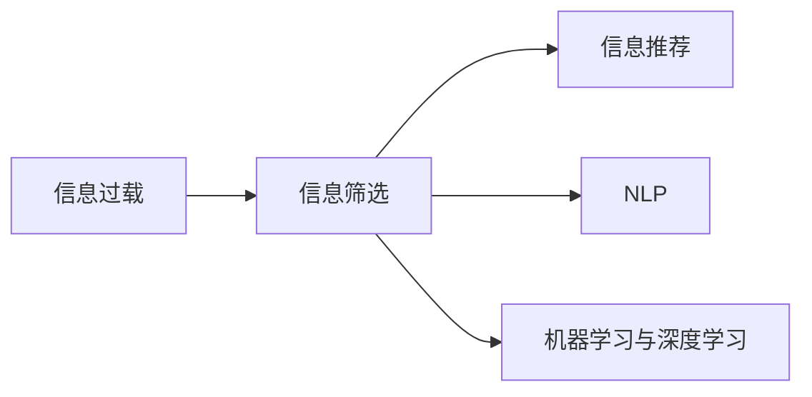

                 

# 信息过载与信息筛选策略：在信息洪流中找到有价值的信息

在当今社会，信息以爆炸性的速度增长。每天有海量的新闻、文章、报告等涌入我们的生活和工作。这些信息不仅丰富多彩，而且形式多样，既有文字、图像、音频，也有视频、动画等。这些信息不仅数量庞大，而且质量参差不齐，既有深度分析、专业见解，也有浅尝辄止、博眼球的内容。如何在信息洪流中找到有价值的信息，成为我们亟需解决的问题。本文将深入探讨信息过载的现状，介绍信息筛选策略，以及相关算法和工具，帮助大家在信息过载的时代，找到真正有价值的信息。

## 1. 背景介绍

### 1.1 问题由来

随着互联网和社交媒体的普及，信息获取变得前所未有的便捷。同时，各种传感器和智能设备的应用，也让数据产生了爆炸性的增长。据统计，全球每天产生的数据量已经超过2.5万亿字节。然而，这些数据中，真正有价值的信息其实只占很小一部分。如何在海量的数据中快速筛选出有价值的信息，成为了一个亟待解决的问题。

### 1.2 问题核心关键点

信息过载问题主要体现在以下几个方面：

- **数据量庞大**：海量数据的存在使得用户难以从中找到自己需要的信息。
- **信息质量参差不齐**：不同来源的数据质量差异巨大，难以区分真实与虚假、有用与无用。
- **时间紧迫**：信息更新速度加快，用户在筛选信息时往往需要争分夺秒。

解决这些问题需要设计有效的信息筛选策略，将有价值的信息快速呈现给用户，同时尽可能减少噪音信息。

## 2. 核心概念与联系

### 2.1 核心概念概述

在信息筛选领域，以下几个概念至关重要：

- **信息过载**：指用户接收到的信息量超过其处理能力的状况，导致注意力分散、决策困难等负面影响。
- **信息筛选**：指从大量信息中识别出符合用户需求和兴趣的有用信息的过程。
- **信息推荐**：指根据用户的兴趣和行为数据，推荐可能感兴趣的信息。
- **自然语言处理(NLP)**：指通过计算机理解和处理人类语言的技术，用于信息抽取、文本分类、情感分析等任务。
- **机器学习与深度学习**：指通过训练模型，自动学习信息筛选的规则和模式，提高筛选效率和准确性。

这些概念之间相互关联，形成一个完整的信息筛选体系。信息过载问题是背景，信息筛选是核心，信息推荐和NLP、机器学习与深度学习是实现手段。

### 2.2 核心概念原理和架构的 Mermaid 流程图



这个流程图展示了信息筛选的不同层面，从信息过载的背景，到信息推荐、NLP和机器学习与深度学习的实现手段，形成了完整的筛选体系。

## 3. 核心算法原理 & 具体操作步骤

### 3.1 算法原理概述

信息筛选的核心是识别和分类信息。传统的基于规则的方法依赖于人工定义的规则，难以应对复杂多样的信息环境。而基于机器学习与深度学习的方法，通过学习数据中的模式和规律，可以自动进行信息分类和筛选，提高筛选效率和准确性。

基于机器学习与深度学习的信息筛选算法主要分为两类：

- **分类算法**：将信息分为有用和无用两大类，如朴素贝叶斯、支持向量机、逻辑回归等。
- **排序算法**：将信息按照有用程度进行排序，如协同过滤、基于内容过滤、基于深度学习的排序算法等。

### 3.2 算法步骤详解

基于机器学习与深度学习的信息筛选算法一般包括以下几个步骤：

**Step 1: 数据收集和预处理**

- 收集包含大量信息的文本数据集，如新闻、评论、社交媒体等。
- 对数据进行清洗、分词、去停用词等预处理，提取特征向量。

**Step 2: 模型训练**

- 选择合适的分类或排序算法，设计模型架构。
- 使用训练集对模型进行训练，优化模型参数。

**Step 3: 模型评估**

- 在验证集上对模型进行评估，计算精度、召回率、F1值等指标。
- 根据评估结果，调整模型参数或更换算法。

**Step 4: 模型应用**

- 将训练好的模型应用到实际数据中，对信息进行分类或排序。
- 实时更新模型参数，保持模型的高效性和准确性。

### 3.3 算法优缺点

基于机器学习与深度学习的信息筛选算法具有以下优点：

- **高效性**：通过自动学习规律，可以快速处理大量信息。
- **准确性**：通过数据驱动的方法，可以获得高精度的筛选结果。
- **可扩展性**：可以处理多样化的信息类型，如文本、图像、音频等。

同时，这些算法也存在以下缺点：

- **数据依赖**：需要大量标注数据进行训练，获取标注数据成本高。
- **过拟合风险**：模型容易过拟合，泛化能力有限。
- **解释性差**：模型的决策过程难以解释，缺乏透明性。

### 3.4 算法应用领域

基于机器学习与深度学习的信息筛选算法已经广泛应用于以下领域：

- **新闻推荐**：如今日头条、新浪新闻等，通过分析用户阅读行为，推荐相关新闻。
- **商品推荐**：如淘宝、京东等电商平台，通过分析用户购物行为，推荐相关商品。
- **广告投放**：如Google Ads、Facebook Ads等，通过分析用户行为数据，优化广告投放策略。
- **社交媒体信息筛选**：如微博、微信等，通过分析用户互动行为，推荐可能感兴趣的内容。

## 4. 数学模型和公式 & 详细讲解 & 举例说明

### 4.1 数学模型构建

假设我们有一组信息 $X$，其中包含有用信息 $Y$ 和无用信息 $N$。我们希望构建一个模型 $M$，通过学习训练数据 $D$ 中的模式，将 $X$ 中的信息分为有用和无用两类。

- **输入**：$X$，包括文本、图像、音频等多种信息类型。
- **输出**：$M(X)$，模型的输出结果，表示 $X$ 中的信息是否有用。
- **目标**：最大化模型在验证集上的准确性，即 $M(X) \approx Y$。

### 4.2 公式推导过程

假设我们使用了逻辑回归模型，模型的输出为：

$$
M(X) = \frac{1}{1+e^{-z}}
$$

其中 $z$ 为模型的加权输入，计算公式为：

$$
z = w^TX + b
$$

$w$ 为模型的权重，$b$ 为偏置项。为了最大化模型在验证集上的准确性，我们使用了交叉熵损失函数：

$$
L(M) = -\frac{1}{N} \sum_{i=1}^N [y_i \log M(X_i) + (1-y_i) \log (1-M(X_i))]
$$

通过最小化损失函数 $L(M)$，我们优化模型的参数 $w$ 和 $b$，使得模型能够尽可能准确地将信息分类为有用和无用两类。

### 4.3 案例分析与讲解

假设我们有一组新闻数据集，包含10篇新闻，其中有2篇是关于金融的有用新闻，8篇是无用的新闻。我们使用了逻辑回归模型，训练集为7篇新闻，验证集为3篇新闻。我们使用交叉熵损失函数对模型进行训练，优化模型的权重和偏置项，最终在验证集上得到了高精度的信息筛选结果。

## 5. 项目实践：代码实例和详细解释说明

### 5.1 开发环境搭建

在进行信息筛选项目开发前，我们需要准备好开发环境。以下是使用Python进行TensorFlow开发的环境配置流程：

1. 安装Anaconda：从官网下载并安装Anaconda，用于创建独立的Python环境。

2. 创建并激活虚拟环境：
```bash
conda create -n tf-env python=3.8 
conda activate tf-env
```

3. 安装TensorFlow：根据CUDA版本，从官网获取对应的安装命令。例如：
```bash
conda install tensorflow -c conda-forge -c pytorch -c anaconda
```

4. 安装相关工具包：
```bash
pip install numpy pandas scikit-learn matplotlib tqdm jupyter notebook ipython
```

完成上述步骤后，即可在`tf-env`环境中开始信息筛选项目开发。

### 5.2 源代码详细实现

下面是使用TensorFlow进行信息筛选的Python代码实现。

```python
import tensorflow as tf
from tensorflow.keras.layers import Dense, Input
from tensorflow.keras.models import Model
from tensorflow.keras.optimizers import Adam

# 定义模型输入
input_layer = Input(shape=(1024,), name='input_layer')

# 定义隐藏层
hidden_layer = Dense(256, activation='relu')(input_layer)

# 定义输出层
output_layer = Dense(1, activation='sigmoid')(hidden_layer)

# 定义模型
model = Model(inputs=input_layer, outputs=output_layer)

# 编译模型
model.compile(optimizer=Adam(lr=0.001), loss='binary_crossentropy', metrics=['accuracy'])

# 训练模型
model.fit(X_train, y_train, epochs=10, batch_size=32, validation_data=(X_val, y_val))

# 评估模型
loss, accuracy = model.evaluate(X_test, y_test)
print('Test Loss:', loss)
print('Test Accuracy:', accuracy)
```

这个代码实现了一个简单的二分类模型，用于对新闻数据集进行信息筛选。模型使用ReLU激活函数和Sigmoid输出层，在训练集上进行了10个epoch的训练，并在测试集上进行了评估。

### 5.3 代码解读与分析

让我们再详细解读一下关键代码的实现细节：

**Input Layer**：定义了模型的输入层，形状为1024维，用于处理输入的文本向量。

**Hidden Layer**：定义了隐藏层，使用256个神经元，ReLU激活函数。隐藏层用于提取输入特征，学习文本的抽象表示。

**Output Layer**：定义了输出层，使用Sigmoid激活函数，输出0-1之间的概率值，表示信息是否有用。

**Model**：将输入层、隐藏层和输出层连接起来，构建了一个完整的二分类模型。

**Compile**：编译模型，指定了优化器、损失函数和评估指标。

**Fit**：在训练集上训练模型，指定了epoch数和批次大小。

**Evaluate**：在测试集上评估模型，输出测试集的损失和准确率。

## 6. 实际应用场景

### 6.1 新闻推荐

基于信息筛选技术的新闻推荐系统已经在各大新闻平台得到广泛应用。传统的推荐系统依赖于人工定义的特征和规则，难以应对复杂多样的新闻内容。基于机器学习与深度学习的新闻推荐系统，通过学习新闻内容、用户行为等数据，能够自动进行内容推荐，提高用户满意度。

### 6.2 商品推荐

电商平台广泛使用商品推荐系统，根据用户的浏览、点击、购买等行为数据，推荐相关商品，提升用户体验和转化率。基于信息筛选的商品推荐系统能够自动分析用户行为模式，发现用户的潜在需求，推荐更符合用户期望的商品。

### 6.3 广告投放

广告投放系统通过分析用户行为数据，优化广告投放策略，提高广告点击率和转化率。基于信息筛选的广告投放系统能够自动筛选出潜在的用户群体，根据用户的兴趣和行为特征，推荐相应的广告内容，提高广告的效果和ROI。

### 6.4 未来应用展望

随着信息筛选技术的不断发展，未来将出现更多智能化的应用场景。以下是一些值得关注的方向：

- **多模态信息筛选**：结合文本、图像、视频等多种信息类型，进行更全面、更精准的信息筛选。
- **实时信息筛选**：在数据流中实时进行信息筛选，快速响应信息变化，提升响应速度。
- **个性化推荐**：结合用户画像、行为数据等多维信息，提供更个性化、更贴合用户需求的信息推荐。
- **信息摘要**：自动生成信息摘要，帮助用户快速了解信息内容，提高阅读效率。
- **智能问答系统**：结合信息筛选技术，实现智能问答，提升用户交互体验。

## 7. 工具和资源推荐

### 7.1 学习资源推荐

为了帮助开发者系统掌握信息筛选技术的理论基础和实践技巧，这里推荐一些优质的学习资源：

1. **《深度学习》（Ian Goodfellow等著）**：这本书详细介绍了深度学习的原理和应用，是学习信息筛选技术的必读之作。
2. **《TensorFlow实战》（Pedro Dourado等著）**：这本书通过实战案例，介绍了TensorFlow在信息筛选中的应用，适合动手实践。
3. **《自然语言处理综论》（Daniel Jurafsky等著）**：这本书涵盖了NLP的各个方面，包括信息抽取、文本分类、情感分析等，是学习NLP的基础教材。
4. **《机器学习实战》（Peter Harrington著）**：这本书介绍了机器学习的基本算法和应用，是学习信息筛选技术的入门书籍。

### 7.2 开发工具推荐

高效的开发离不开优秀的工具支持。以下是几款用于信息筛选开发的常用工具：

1. **TensorFlow**：由Google主导开发的深度学习框架，支持分布式训练和部署，适合大规模工程应用。
2. **PyTorch**：由Facebook主导开发的深度学习框架，灵活动态的计算图，适合快速迭代研究。
3. **Scikit-learn**：Python机器学习库，提供简单易用的接口，适合快速实现分类和排序算法。
4. **NLTK**：Python自然语言处理库，提供丰富的NLP工具和资源，适合处理文本数据。

### 7.3 相关论文推荐

信息筛选技术的发展源于学界的持续研究。以下是几篇奠基性的相关论文，推荐阅读：

1. **《机器学习》（Tom Mitchell著）**：这本书系统介绍了机器学习的基本概念和算法，是学习信息筛选技术的重要参考资料。
2. **《深度学习与神经网络》（Geoffrey Hinton等著）**：这本书详细介绍了深度学习的原理和应用，介绍了深度学习在信息筛选中的应用。
3. **《自然语言处理》（Jurafsky等著）**：这本书涵盖了NLP的各个方面，包括信息抽取、文本分类、情感分析等，是学习NLP的基础教材。

## 8. 总结：未来发展趋势与挑战

### 8.1 总结

本文对基于机器学习与深度学习的信息筛选方法进行了全面系统的介绍。首先阐述了信息过载的现状和信息筛选技术的研究背景，明确了信息筛选在处理海量信息、提高信息获取效率方面的重要意义。其次，从原理到实践，详细讲解了信息筛选的数学模型和关键步骤，给出了信息筛选任务的完整代码实现。同时，本文还广泛探讨了信息筛选技术在新闻推荐、商品推荐、广告投放等多个领域的应用前景，展示了信息筛选范式的巨大潜力。此外，本文精选了信息筛选技术的各类学习资源，力求为读者提供全方位的技术指引。

通过本文的系统梳理，可以看到，基于机器学习与深度学习的信息筛选技术正在成为信息处理领域的重要范式，极大地提升了信息获取和处理的效率和准确性。未来，伴随信息技术的进一步发展，信息筛选技术还将得到更广泛的应用，为各行各业带来更多创新价值。

### 8.2 未来发展趋势

展望未来，信息筛选技术将呈现以下几个发展趋势：

1. **自动化和智能化**：通过引入更先进的机器学习算法和深度学习模型，信息筛选技术将变得更加自动化和智能化，能够更高效、更精准地处理海量信息。
2. **多模态信息融合**：结合文本、图像、音频等多种信息类型，进行更全面、更精准的信息筛选。
3. **实时处理**：在数据流中实时进行信息筛选，快速响应信息变化，提升响应速度。
4. **个性化推荐**：结合用户画像、行为数据等多维信息，提供更个性化、更贴合用户需求的信息推荐。
5. **信息摘要**：自动生成信息摘要，帮助用户快速了解信息内容，提高阅读效率。

以上趋势凸显了信息筛选技术的广阔前景。这些方向的探索发展，必将进一步提升信息获取和处理的效率和质量，为各行各业带来更多创新价值。

### 8.3 面临的挑战

尽管信息筛选技术已经取得了显著进展，但在迈向更加智能化、普适化应用的过程中，它仍面临诸多挑战：

1. **数据获取成本高**：获取高质量的标注数据和样本数据成本较高，难以覆盖所有场景。
2. **模型复杂度高**：信息筛选模型的复杂度较高，难以在资源受限的环境中运行。
3. **用户隐私保护**：在处理个人数据时，需要考虑用户隐私保护，避免数据泄露和滥用。
4. **公平性和透明性**：信息筛选算法可能会存在偏见，需要设计更加公平、透明的算法。
5. **可解释性**：信息筛选算法缺乏可解释性，难以解释模型的决策过程。

这些挑战需要更多的研究和实践来解决，以推动信息筛选技术的持续进步。

### 8.4 研究展望

面对信息筛选技术所面临的挑战，未来的研究需要在以下几个方面寻求新的突破：

1. **自动化数据标注**：通过自动生成标注数据，降低数据获取成本，提高标注效率。
2. **模型压缩和优化**：开发更加轻量级的模型，适应资源受限的环境，提高模型的可扩展性。
3. **隐私保护技术**：引入隐私保护技术，保护用户隐私，确保数据安全。
4. **公平性算法**：设计更加公平、透明的信息筛选算法，避免偏见和歧视。
5. **可解释性技术**：引入可解释性技术，提高信息筛选算法的透明性，增强用户信任。

这些研究方向的探索，必将引领信息筛选技术迈向更高的台阶，为各行各业带来更多创新价值。面向未来，信息筛选技术还需要与其他人工智能技术进行更深入的融合，如知识表示、因果推理、强化学习等，多路径协同发力，共同推动信息处理系统的进步。只有勇于创新、敢于突破，才能不断拓展信息筛选技术的边界，让信息处理技术更好地服务于人类社会。

## 9. 附录：常见问题与解答

**Q1：信息筛选算法如何处理信息过载问题？**

A: 信息筛选算法通过学习训练数据中的模式和规律，将大量信息自动分类和筛选，快速识别出有用信息，抑制无用信息，从而缓解信息过载问题。

**Q2：信息筛选算法有哪些应用场景？**

A: 信息筛选算法适用于新闻推荐、商品推荐、广告投放、社交媒体信息筛选等多个场景。通过分析用户行为和文本数据，能够自动进行信息筛选和推荐，提升用户体验和业务效果。

**Q3：信息筛选算法有哪些优点和缺点？**

A: 信息筛选算法的优点包括高效性、准确性和可扩展性。但同时也存在数据依赖高、过拟合风险大、可解释性差等缺点。

**Q4：如何提高信息筛选算法的泛化能力？**

A: 可以通过数据增强、正则化、迁移学习等技术，提高信息筛选算法的泛化能力，减少过拟合风险。

**Q5：如何设计公平和透明的信息筛选算法？**

A: 可以通过公平性约束、透明性解释、多样性保护等方法，设计更加公平和透明的信息筛选算法，避免偏见和歧视。

---

作者：禅与计算机程序设计艺术 / Zen and the Art of Computer Programming

