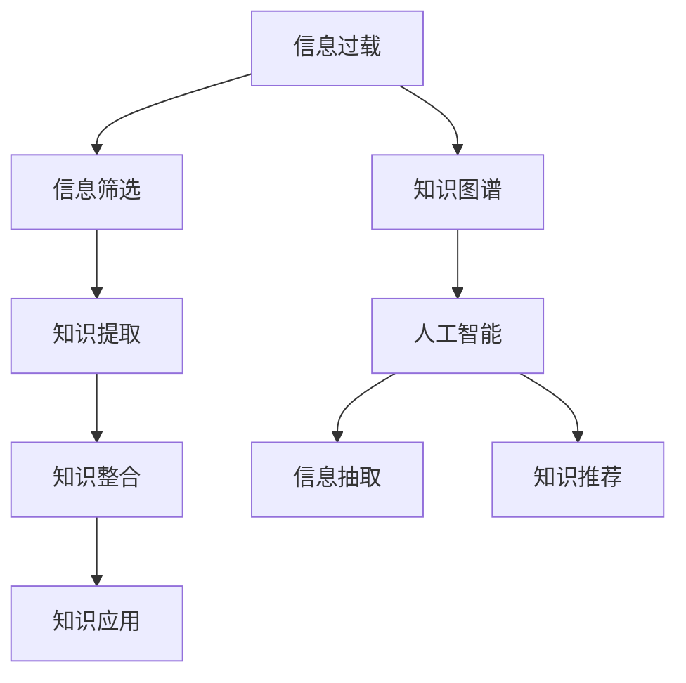

                 

# 信息过载与知识工作：如何在信息洪流中保持生产力

## 1. 背景介绍

### 1.1 问题由来
在互联网时代，信息爆炸成为我们工作生活中普遍面临的问题。信息过载不仅导致决策困难，也耗费了大量时间和精力。无论是企业内部的知识管理，还是日常工作的信息处理，都迫切需要解决这一难题。信息过载问题的核心在于，我们如何从海量信息中提取出有价值的知识，并将其转化为推动个人和组织高效工作的动力。

### 1.2 问题核心关键点
解决信息过载的根本在于构建有效的知识工作机制，将信息转化为知识，并利用知识提升生产力。核心在于以下几个方面：

1. **信息筛选**：在海量信息中找到有价值的内容。
2. **知识提取**：从信息中提取精华，形成结构化知识。
3. **知识整合**：将分散的知识整合为系统化的知识体系。
4. **知识应用**：将知识应用于实际工作中，提高决策效率和工作质量。

## 2. 核心概念与联系

### 2.1 核心概念概述

为更好地理解如何在信息洪流中保持生产力，本节将介绍几个密切相关的核心概念：

- **信息过载**：指在特定时间内信息量超过个人处理能力，导致注意力分散、决策困难的问题。
- **知识工作**：指通过学习、整合、应用知识，提升个人和组织的工作效率和质量的过程。
- **知识管理**：通过系统化的策略和技术手段，管理和利用组织内的知识资产。
- **知识图谱**：用于表示实体间关系的网络图，辅助知识推理和整合。
- **人工智能**：通过算法自动化提取和处理知识，辅助人类进行高效的信息处理和决策。
- **信息抽取**：从非结构化数据中自动提取关键信息，辅助知识提取。
- **知识推荐**：基于用户历史行为和偏好，推荐有价值的信息和知识。

这些核心概念之间的逻辑关系可以通过以下Mermaid流程图来展示：



这个流程图展示了几组核心概念之间的关系：

1. 信息过载通过信息筛选减少干扰，从而更好地提取知识。
2. 知识提取后需进行知识整合，形成系统化的知识体系。
3. 知识应用将知识转化为实际工作中的工具，提升生产力。
4. 知识图谱和人工智能辅助信息筛选、知识提取和整合，提升知识工作的效率和质量。
5. 信息抽取和知识推荐则帮助自动化信息处理，降低人工干预。

## 3. 核心算法原理 & 具体操作步骤

### 3.1 算法原理概述

解决信息过载和提升知识工作的方法，本质上是一个信息处理和知识管理的过程。其核心思想是：通过构建有效的信息筛选、知识提取、整合和应用机制，将海量信息转化为有价值的知识，辅助决策和执行。

具体而言，可以概括为以下几个步骤：

1. **信息收集与筛选**：收集相关的信息源，通过算法自动筛选出有价值的信息。
2. **知识抽取与表示**：从筛选出的信息中抽取关键知识，并以结构化的方式表示出来。
3. **知识整合与存储**：将抽取的知识进行整合，形成系统化的知识库。
4. **知识应用与迭代**：将知识应用于实际工作中，并根据反馈不断优化知识库和应用机制。

### 3.2 算法步骤详解

下面详细讲解上述步骤的具体操作：

**Step 1: 信息收集与筛选**
- 收集各种信息源，包括文档、网页、邮件、社交媒体等。
- 使用爬虫、API等手段获取信息。
- 通过信息过滤算法筛选出与特定任务相关的信息。

**Step 2: 知识抽取与表示**
- 对筛选出的信息进行自然语言处理(NLP)，提取实体、关系、事件等关键知识。
- 使用知识图谱技术将提取的知识表示为图形结构，辅助后续的推理和整合。
- 将抽取的知识以结构化的方式表示，如本体、表格、数据库等。

**Step 3: 知识整合与存储**
- 将抽取的知识整合到知识库中，形成系统化的知识体系。
- 使用数据库、文档管理系统等工具，存储和组织知识库。
- 定期更新和维护知识库，确保知识的时效性和准确性。

**Step 4: 知识应用与迭代**
- 将知识应用于实际工作中，如决策支持、自动化执行等。
- 根据应用反馈，不断优化知识库和信息筛选、抽取算法。
- 结合人工智能技术，自动化知识应用和迭代过程，提升效率和效果。

### 3.3 算法优缺点

信息过载和知识工作的方法具有以下优点：

1. **提高决策质量**：通过结构化知识辅助决策，减少主观性和随机性。
2. **提升工作效率**：自动化信息处理和知识应用，节省了大量时间和精力。
3. **增强创新能力**：整合不同来源的知识，形成全新的洞见和解决方案。
4. **减少认知负荷**：自动化处理大部分信息，减轻大脑负担。

同时，该方法也存在一定的局限性：

1. **对信息源依赖**：信息筛选和抽取依赖于信息源的质量和结构。
2. **知识整合复杂**：知识图谱和整合技术需要较高的技术门槛和数据准备。
3. **适应性有限**：方法对特定领域和任务的效果可能有限。
4. **数据隐私问题**：处理敏感数据时需要考虑隐私保护和合规问题。
5. **技术门槛较高**：需要具备较强的技术能力进行开发和维护。

尽管存在这些局限性，但就目前而言，信息过载和知识工作的方法仍然是一种高效的信息处理和知识管理手段。未来相关研究的重点在于如何进一步提升方法的适应性和技术门槛，同时兼顾隐私保护和合规性等因素。

### 3.4 算法应用领域

信息过载和知识工作的方法在多个领域都有广泛的应用，例如：

- **企业知识管理**：构建企业知识库，辅助决策和执行，提升组织效率。
- **个人知识管理**：通过笔记、标签、目录等方式，管理个人学习、工作中的知识。
- **智能助手**：结合人工智能技术，构建能够自动筛选信息、推荐知识的智能助手。
- **在线教育**：利用结构化知识库和推荐系统，提供个性化学习资源和建议。
- **市场分析**：从海量市场数据中提取关键信息，辅助企业进行市场研究和决策。
- **健康管理**：结合知识图谱和人工智能，提供个性化的健康建议和医疗指导。

除了上述这些领域，信息过载和知识工作的方法还将继续拓展到更多场景中，如社交媒体分析、智能客服、智能交通等，为各行各业带来智能化的信息处理和决策支持。

## 4. 数学模型和公式 & 详细讲解 & 举例说明

### 4.1 数学模型构建

本节将使用数学语言对信息过载和知识工作的流程进行更加严格的刻画。

设信息源为 $S$，知识提取函数为 $E$，知识整合函数为 $M$，知识应用函数为 $A$。则信息过载和知识工作过程可以表示为：

$$
K = M(E(S))
$$

其中 $K$ 表示最终提取和整合的知识，$E$ 和 $M$ 分别为信息筛选和知识整合的函数。

### 4.2 公式推导过程

以下我们以企业知识管理为例，推导知识提取和整合的数学公式。

**信息筛选**：

设信息源 $S=\{s_1, s_2, ..., s_n\}$，信息筛选函数 $E$ 能够筛选出与特定主题 $T$ 相关的信息 $S_T=\{s_i \mid E(s_i) \cap T \neq \emptyset\}$。

**知识提取**：

设知识提取函数 $E$ 能够从筛选出的信息中提取实体 $E_i$，关系 $R_{ij}$，事件 $E_i$，等知识。则知识提取过程可以表示为：

$$
E(S_T) = \{E_i, R_{ij}, E_i, ... \}
$$

**知识整合**：

知识整合函数 $M$ 可以将提取的知识 $E(S_T)$ 整合成系统化的知识库 $K$。知识库可以表示为一个图 $G=(V, E)$，其中 $V$ 为节点，$E$ 为边。节点 $V$ 表示知识元素，边 $E$ 表示实体间的关系。

**知识应用**：

知识应用函数 $A$ 可以将知识库 $K$ 应用于实际工作中，如决策支持、自动化执行等。知识应用过程可以表示为：

$$
A(K) = \{a_1, a_2, ..., a_m\}
$$

其中 $a_i$ 为知识库在实际应用中的输出。

### 4.3 案例分析与讲解

以下是一个企业知识管理系统的实际案例：

**企业背景**：一家大型跨国公司，业务涉及金融、制造、研发等多个领域。公司内部信息分散在各个部门和系统中，需要构建统一的知识管理体系，辅助决策和执行。

**信息收集**：通过爬虫和API获取公司内部文档、邮件、客户反馈等信息源，构建全面的信息库。

**信息筛选**：使用自然语言处理技术，筛选出与各业务部门相关的信息，去除无关的噪声信息。

**知识提取**：对筛选出的信息进行实体识别、关系抽取，构建知识图谱，辅助后续的推理和整合。

**知识整合**：将抽取的知识整合到知识库中，形成系统化的知识体系。使用数据库和文档管理系统进行存储和组织。

**知识应用**：将知识库应用于实际工作中，如客户分析、市场研究、项目管理等。使用AI技术自动生成报告和分析结果，提升决策效率。

通过上述流程，企业能够构建统一的知识管理体系，辅助决策和执行，显著提升组织效率和创新能力。

## 5. 项目实践：代码实例和详细解释说明

### 5.1 开发环境搭建

在进行信息过载和知识工作实践前，我们需要准备好开发环境。以下是使用Python进行信息过载和知识管理开发的常见环境配置流程：

1. 安装Anaconda：从官网下载并安装Anaconda，用于创建独立的Python环境。

2. 创建并激活虚拟环境：
```bash
conda create -n knowledge-env python=3.8 
conda activate knowledge-env
```

3. 安装PyTorch：基于Python的开源深度学习框架，适合处理结构化数据。

4. 安装Pandas：数据处理和分析库，方便数据整理和操作。

5. 安装Scikit-learn：机器学习库，辅助知识提取和整合。

6. 安装Numpy：数学计算库，辅助向量、矩阵等数据结构处理。

完成上述步骤后，即可在`knowledge-env`环境中开始实践。

### 5.2 源代码详细实现

这里我们以企业知识管理为例，给出使用Python进行信息过载和知识管理的代码实现。

**代码1：信息收集与筛选**

```python
import requests
from bs4 import BeautifulSoup

# 获取公司内网所有文档信息
def get_documents(url):
    response = requests.get(url)
    soup = BeautifulSoup(response.content, 'html.parser')
    documents = []
    for link in soup.find_all('a'):
        if link.get('href').endswith('.pdf'):
            documents.append(link.get('href'))
    return documents

# 筛选出与特定业务部门相关的文档
def filter_documents(documents, department):
    filtered_documents = []
    for doc in documents:
        if department in doc:
            filtered_documents.append(doc)
    return filtered_documents
```

**代码2：知识抽取与表示**

```python
from transformers import pipeline
from spacy import load

# 构建实体识别和关系抽取模型
nlp = load('en_core_web_sm')
tokenizer = nlp.tokenizer
model = pipeline('ner', model='dbmdz/bert-large-cased-finetuned-conll03-english', tokenizer=tokenizer)

# 抽取文档中的实体和关系
def extract_entities(documents):
    extracted_entities = []
    for doc in documents:
        doc_text = doc
        doc_entities = model(doc_text)
        extracted_entities.append(doc_entities)
    return extracted_entities
```

**代码3：知识整合与存储**

```python
from py2neo import Graph, Node, Relationship

# 构建知识图谱
graph = Graph('http://localhost:7474/db/data/', user='neo', password='password')
graph.create(Node('Company', name='Company'))
graph.create(Node('Department', name='Finance'))
graph.create(Node('Department', name='Manufacturing'))
graph.create(Node('Department', name='Research'))

# 整合抽取的知识到知识图谱
def integrate_knowledge(documents):
    graph.clear()
    for doc in documents:
        doc_entities = doc_entities
        for entity in doc_entities:
            if entity['entity'] == 'B-PER':
                graph.create(Node('Person', name=entity['text']))
                graph.create(Relationship('Company', 'EMPLOYEE', 'Person'))
            elif entity['entity'] == 'B-LOC':
                graph.create(Node('Location', name=entity['text']))
                graph.create(Relationship('Company', 'LOCATED_IN', 'Location'))
            elif entity['entity'] == 'B-ORG':
                graph.create(Node('Organization', name=entity['text']))
                graph.create(Relationship('Company', 'OWNED_BY', 'Organization'))
```

**代码4：知识应用与迭代**

```python
import networkx as nx

# 将知识图谱转换为网络图
def convert_graph_to_networkx(graph):
    G = nx.DiGraph()
    for node in graph.nodes():
        G.add_node(node)
    for relationship in graph.relationships():
        G.add_edge(relationship[0], relationship[1], label=relationship.type)
    return G

# 分析知识图谱
def analyze_knowledge(graph):
    G = convert_graph_to_networkx(graph)
    clusters = nx.cluster.algorithms.betweenness_centrality(G)
    return clusters
```

### 5.3 代码解读与分析

让我们再详细解读一下关键代码的实现细节：

**代码1：信息收集与筛选**

- `get_documents`函数：通过爬虫获取公司内网所有文档链接，并筛选出PDF文档。
- `filter_documents`函数：根据特定部门筛选出相关文档，去除了噪声信息。

**代码2：知识抽取与表示**

- 使用Hugging Face的Transformers库，加载预训练的BERT模型，进行实体识别和关系抽取。
- `extract_entities`函数：对文档进行实体抽取，得到实体列表。

**代码3：知识整合与存储**

- 使用Py2Neo库，构建知识图谱，将抽取的实体和关系表示为图结构。
- `integrate_knowledge`函数：将抽取的知识整合到知识图谱中，形成系统化的知识体系。

**代码4：知识应用与迭代**

- 使用NetworkX库，将知识图谱转换为网络图，进行图谱分析。
- `convert_graph_to_networkx`函数：将知识图谱转换为网络图。
- `analyze_knowledge`函数：计算网络图中的中心性，分析知识图谱的关联性。

这些代码片段展示了从信息收集、筛选、抽取、整合到应用的全流程，帮助读者理解信息过载和知识工作的实际应用。

## 6. 实际应用场景

### 6.1 企业知识管理

基于信息过载和知识工作的方法，企业可以构建统一的知识管理体系，辅助决策和执行，显著提升组织效率和创新能力。具体应用包括：

- **文档管理**：构建文档管理系统，自动分类和归档文档。
- **知识库构建**：将企业内部的知识进行结构化存储，形成系统化的知识库。
- **决策支持**：通过知识库中的知识，辅助决策过程，提升决策质量和速度。
- **信息检索**：构建信息检索系统，快速定位所需信息，提升信息获取效率。

### 6.2 智能客服

智能客服系统通过自动化信息处理和知识应用，提升客户服务质量和效率。具体应用包括：

- **信息抽取**：自动抽取客户咨询中的关键信息，进行问题分类和理解。
- **知识检索**：根据客户咨询内容，快速检索知识库中的相关知识，辅助客服回复。
- **智能推荐**：基于客户历史行为和偏好，推荐合适的解决方案，提升客户满意度。
- **多渠道融合**：整合语音、文本、图像等多种信息来源，构建统一的客户服务系统。

### 6.3 在线教育

在线教育平台通过信息过载和知识工作的方法，提供个性化的学习资源和建议，提升学习效果。具体应用包括：

- **学习路径推荐**：根据学生的学习历史和行为，推荐合适的学习路径和资源。
- **知识图谱构建**：构建学科知识图谱，辅助课程设计和教学。
- **智能辅导**：利用知识图谱和自然语言处理技术，提供智能辅导和答疑服务。
- **学习分析**：分析学生的学习行为和成果，提供个性化的学习建议和改进方案。

### 6.4 未来应用展望

随着信息过载和知识工作方法的发展，其在更多领域的应用前景将更加广阔。

在智慧医疗领域，结合知识图谱和人工智能，辅助医生进行疾病诊断和个性化治疗，提升医疗服务质量和效率。

在智能交通领域，通过信息过载和知识工作，优化交通管理，提升交通运行效率和安全性。

在智慧城市治理中，结合信息过载和知识工作，构建智能城市管理平台，提升城市治理水平和居民生活质量。

此外，在智能制造、智能农业、智能家居等更多领域，信息过载和知识工作的方法也将带来显著的智能化提升。

## 7. 工具和资源推荐

### 7.1 学习资源推荐

为了帮助开发者系统掌握信息过载和知识工作的方法，这里推荐一些优质的学习资源：

1. **自然语言处理与知识工程**：多门经典课程和书籍，涵盖NLP和知识工程的原理和实践，适合入门和进阶学习。
2. **知识图谱与语义网络**：相关论文和书籍，介绍知识图谱的构建和应用，辅助知识推理和整合。
3. **机器学习与深度学习**：大量开源资源和教程，涵盖机器学习和深度学习的基础知识和实战案例，助力知识提取和整合。
4. **信息抽取与实体识别**：相关工具库和教程，辅助自动提取文档中的关键信息，构建知识图谱。

通过对这些资源的学习实践，相信你一定能够快速掌握信息过载和知识工作的精髓，并用于解决实际的NLP问题。

### 7.2 开发工具推荐

高效的开发离不开优秀的工具支持。以下是几款用于信息过载和知识管理工作开发的常用工具：

1. **Anaconda**：用于创建和管理Python环境，方便安装和管理开发所需的库和依赖。
2. **PyTorch**：基于Python的开源深度学习框架，适合处理结构化数据。
3. **Pandas**：数据处理和分析库，方便数据整理和操作。
4. **Scikit-learn**：机器学习库，辅助知识提取和整合。
5. **NetworkX**：图形处理库，方便知识图谱的构建和分析。
6. **Py2Neo**：图形数据库库，辅助知识图谱的存储和管理。

合理利用这些工具，可以显著提升信息过载和知识工作的开发效率，加快创新迭代的步伐。

### 7.3 相关论文推荐

信息过载和知识工作的方法源于学界的持续研究。以下是几篇奠基性的相关论文，推荐阅读：

1. **Knowledge Extraction, Analysis, and Visualization in Multimedia Environments**：介绍了知识提取、分析和可视化的基本方法和技术。
2. **Knowledge Graphs in Healthcare**：探讨了知识图谱在医疗领域的应用，辅助疾病诊断和治疗。
3. **Deep Learning for Text Understanding**：介绍了基于深度学习的文本理解技术，为信息过载和知识工作提供了新的工具。
4. **Semantic Web and the Knowledge Graph**：介绍了语义网和知识图谱的概念和技术，辅助知识推理和整合。
5. **Natural Language Processing (NLP) with PyTorch and Transformers**：介绍了使用PyTorch和Transformers库进行NLP任务开发的实践方法。

这些论文代表了大语言模型微调技术的发展脉络。通过学习这些前沿成果，可以帮助研究者把握学科前进方向，激发更多的创新灵感。

## 8. 总结：未来发展趋势与挑战

### 8.1 总结

本文对信息过载和知识工作的核心概念进行了全面系统的介绍。首先阐述了信息过载问题的背景和解决方法，明确了知识工作在提高个人和组织生产力中的重要性。其次，从原理到实践，详细讲解了信息过载和知识工作流程的数学模型和关键步骤，给出了信息过载和知识工作的代码实例。同时，本文还广泛探讨了信息过载和知识工作方法在企业知识管理、智能客服、在线教育等多个领域的应用前景，展示了信息过载和知识工作方法的巨大潜力。此外，本文精选了信息过载和知识工作的各类学习资源，力求为读者提供全方位的技术指引。

通过本文的系统梳理，可以看到，信息过载和知识工作方法在现代信息社会中扮演着越来越重要的角色。这些方法的广泛应用，极大地提升了个人和组织的决策效率和执行质量，推动了信息技术的深入发展。未来，伴随信息技术的不断进步，信息过载和知识工作方法将持续演进，在更多领域带来深远影响。

### 8.2 未来发展趋势

展望未来，信息过载和知识工作方法将呈现以下几个发展趋势：

1. **自动化程度提高**：信息筛选和抽取技术将更加自动化和智能化，减少人工干预。
2. **知识图谱普及**：知识图谱和图形处理技术将更广泛应用，辅助知识推理和整合。
3. **多模态融合**：结合文本、图像、语音等多种模态信息，构建更加全面的知识体系。
4. **AI驱动决策**：利用AI技术辅助决策过程，提升决策质量和效率。
5. **知识网络扩展**：构建全球化的知识网络，分享和传播知识，加速知识创新。
6. **隐私保护加强**：在知识应用过程中，加强隐私保护和合规性，确保知识共享的安全性。

以上趋势凸显了信息过载和知识工作方法的广阔前景。这些方向的探索发展，必将进一步提升信息处理和知识管理的效率和质量，为构建智能化的信息社会奠定坚实基础。

### 8.3 面临的挑战

尽管信息过载和知识工作方法已经取得了显著成效，但在迈向更加智能化、普适化应用的过程中，仍面临诸多挑战：

1. **数据质量问题**：信息源的质量直接影响信息筛选和知识抽取的效果。如何获取高质量、结构化的信息源，是一个长期的问题。
2. **知识整合复杂**：知识图谱和整合技术需要较高的技术门槛和数据准备，目前仍然存在一定的应用瓶颈。
3. **技术门槛较高**：信息过载和知识工作方法的技术门槛较高，需要具备较强的技术能力进行开发和维护。
4. **知识孤岛现象**：不同部门和系统之间的知识难以整合，形成知识孤岛，影响知识共享和应用。
5. **隐私保护问题**：在知识应用过程中，如何保护用户隐私和数据安全，是一个重要的伦理和法律问题。

正视这些挑战，积极应对并寻求突破，将是大语言模型微调走向成熟的必由之路。相信随着学界和产业界的共同努力，这些挑战终将一一被克服，信息过载和知识工作方法必将在构建智能化的信息社会中扮演越来越重要的角色。

### 8.4 未来突破

面对信息过载和知识工作所面临的种种挑战，未来的研究需要在以下几个方面寻求新的突破：

1. **信息采集与处理自动化**：开发更加自动化和智能化的信息采集和处理技术，提升信息获取和处理的效率。
2. **知识图谱技术创新**：研究新型知识图谱构建和应用技术，提升知识推理和整合的效率和准确性。
3. **多模态知识融合**：结合多种信息源和数据类型，构建更加全面的知识体系，提升知识应用的效果。
4. **AI辅助决策**：利用AI技术辅助决策过程，提升决策质量和效率。
5. **隐私保护技术**：研究隐私保护和数据安全技术，确保信息过载和知识工作过程中的数据安全。
6. **知识共享平台**：构建知识共享平台，促进知识的跨部门、跨系统共享，减少知识孤岛现象。

这些研究方向的探索，必将引领信息过载和知识工作方法迈向更高的台阶，为构建智能化的信息社会提供新的技术路径。面向未来，信息过载和知识工作方法还需要与其他人工智能技术进行更深入的融合，如知识表示、因果推理、强化学习等，多路径协同发力，共同推动信息技术和知识管理的进步。只有勇于创新、敢于突破，才能不断拓展信息过载和知识工作方法的边界，让信息处理和知识管理技术更好地造福人类社会。

## 9. 附录：常见问题与解答

**Q1：信息过载和知识工作是否适用于所有应用场景？**

A: 信息过载和知识工作方法适用于各种需要处理大量信息、辅助决策和执行的场景，如企业知识管理、智能客服、在线教育等。但对于一些特殊领域，如实时性要求极高、安全性要求极高的场景，可能需要结合其他技术手段进行优化。

**Q2：如何优化信息过载和知识工作的开发效率？**

A: 优化信息过载和知识工作开发效率的关键在于选择合适的工具和算法。例如，使用PyTorch和Transformers库，可以显著提升模型开发和训练的效率。同时，合理利用数据预处理技术、模型压缩技术等，也能有效提升代码运行效率。

**Q3：如何提升信息过载和知识工作的应用效果？**

A: 提升信息过载和知识工作的应用效果，需要从多个方面进行优化：
1. 选择高质量的信息源，保证信息筛选和抽取的准确性。
2. 构建高效的知识图谱，辅助知识推理和整合。
3. 结合AI技术，提升决策支持和自动化执行的效果。
4. 定期更新和维护知识库，确保知识的实时性和准确性。
5. 结合用户反馈，不断优化算法和模型，提升知识应用的精准性。

这些方法需要结合具体场景进行灵活应用，才能实现最佳效果。

**Q4：信息过载和知识工作在落地应用中需要注意哪些问题？**

A: 在信息过载和知识工作的落地应用中，需要注意以下几个问题：
1. 数据隐私和安全问题，确保数据处理过程中的合规性和安全性。
2. 用户界面和交互体验，提升系统的易用性和用户满意度。
3. 系统的扩展性和维护性，确保系统能够支持大规模的数据处理和知识应用。
4. 算法和模型的可解释性，提升系统的透明度和可信度。

只有在技术、用户、安全等多个方面进行全面优化，才能真正实现信息过载和知识工作的落地应用。

---

作者：禅与计算机程序设计艺术 / Zen and the Art of Computer Programming

