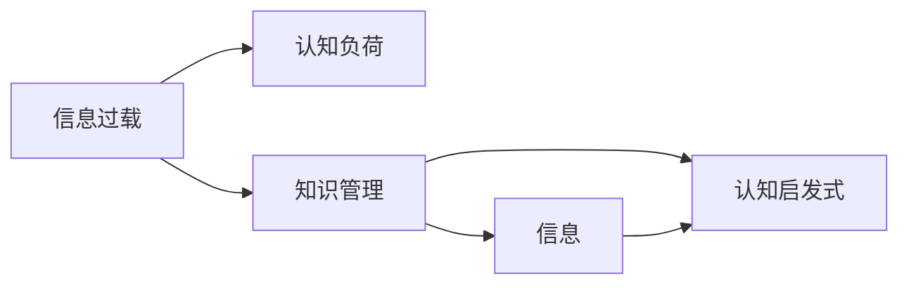

                 

# 信息过载与知识管理策略与实践：管理和组织信息

## 1. 背景介绍

随着互联网和信息技术的发展，人类社会已步入信息爆炸的时代。无论是在科学研究、商业决策、日常生活，还是在社会管理中，都面临着前所未有的信息量。然而，信息并非都是知识。过量的信息不仅没有为人们提供帮助，反而成为了一种负担，导致了信息过载（Information Overload）的问题。

信息过载不仅影响个体认知和决策能力，更对企业和组织的运营效率构成了挑战。解决这一问题，需要有效的知识管理策略和实践。本博客将深入探讨信息过载问题，阐述知识管理的基本概念，介绍有效的知识管理策略与实践，并分享相关的开发工具和资源。

## 2. 核心概念与联系

### 2.1 核心概念概述

为更好地理解信息过载和知识管理，本节将介绍几个密切相关的核心概念：

- **信息过载（Information Overload）**：当人们面对的信息量超过其处理能力时，所引发的认知负担和压力。
- **知识管理（Knowledge Management）**：通过计划、捕捉、整理、存储、检索、共享和应用知识，支持组织目标的实现。
- **信息与知识的关系**：信息是知识的基础，但信息经过加工、组织和整合，才能转化为知识，进而指导行动和决策。
- **认知负荷（Cognitive Load）**：个体在处理信息时所面临的心理负担，影响认知能力和工作效率。
- **认知启发式（Cognitive Heuristics）**：在信息过载的情况下，个体为简化决策过程而采取的快速思考策略。

这些概念之间的逻辑关系可以通过以下Mermaid流程图来展示：



这个流程图展示了我們如何通过知识管理来缓解信息过载问题，以及认知负荷和认知启发式在其中的作用。

## 3. 核心算法原理 & 具体操作步骤
### 3.1 算法原理概述

知识管理旨在通过系统化的方法和工具，帮助个体和组织有效地管理和利用知识。其核心算法原理包括以下几个方面：

1. **知识捕获**：从环境中获取原始信息，通过感知、记录和存储，转化为结构化的知识。
2. **知识组织**：对知识进行分类、整理和关联，形成有序、可检索的知识结构。
3. **知识存储**：将知识以数据库、文档、专家系统等形式，长期保存并便于访问。
4. **知识检索**：提供查询工具，快速定位和获取所需知识。
5. **知识共享**：通过知识库、论坛、会议等渠道，促进知识的交流与传播。
6. **知识应用**：将知识应用于决策、创新、运营等具体场景，提升效率和效果。

知识管理的算法步骤大致分为以下几个关键环节：

- **数据采集**：从各类信息源（如网页、文档、邮件、社交媒体等）中提取信息。
- **数据清洗**：去除噪音和冗余信息，确保数据的质量和完整性。
- **知识抽取**：通过自然语言处理（NLP）、数据挖掘等技术，提取关键知识元素（如实体、关系、主题等）。
- **知识表示**：将抽取出的知识元素转换为机器可理解和处理的结构形式，如概念图、本体、语义网络等。
- **知识存储**：采用数据库、分布式存储、知识图谱等技术，进行长期存储和索引。
- **知识检索**：构建索引和搜索算法，支持快速检索和响应查询。
- **知识可视化**：使用图表、地图、仪表盘等工具，直观展示知识结构。
- **知识应用**：将知识应用于业务流程、决策支持、问题解决等场景。

### 3.2 算法步骤详解

#### 3.2.1 数据采集

数据采集是知识管理的第一步，通过爬虫、API接口等方式从互联网获取信息。以Web爬虫为例，其核心流程包括：

1. **目标确定**：明确需要采集的数据源和内容。
2. **爬虫设计**：编写或使用现成的爬虫框架，如BeautifulSoup、Scrapy等。
3. **数据抓取**：通过HTTP请求获取网页内容，解析HTML标记。
4. **数据存储**：将抓取到的数据存储到本地或数据库中，便于后续处理。

#### 3.2.2 数据清洗

数据清洗包括去除无关信息、修正错误数据、填补缺失值等步骤。以文本清洗为例，常见方法包括：

- **去重去噪**：使用正则表达式或字符串匹配，去除重复和无关内容。
- **错误纠正**：使用拼写检查、命名实体识别等技术，纠正数据错误。
- **格式统一**：将不同来源的数据格式统一，如日期、单位、货币等。
- **缺失填补**：使用均值、中位数、插值等方法，填补缺失数据。

#### 3.2.3 知识抽取

知识抽取是从文本中提取出有价值的信息，如实体、关系、主题等。常见的知识抽取方法包括：

- **规则抽取**：定义特定的规则和模式，自动识别关键信息。
- **基于统计的方法**：使用机器学习算法，训练模型自动识别信息。
- **自然语言处理（NLP）**：利用分词、词性标注、句法分析等技术，理解文本内容。
- **实体识别**：识别出人名、地名、组织名等实体，构建实体关系图。
- **关系抽取**：从文本中抽取实体之间的语义关系，形成知识图谱。

#### 3.2.4 知识表示

知识表示是将抽取的知识元素转换为机器可理解和处理的结构形式，常用的方法包括：

- **概念图**：使用图形化工具表示概念及其关系，支持可视化浏览。
- **本体（Ontology）**：定义实体和属性的语义模型，支持形式化推理。
- **语义网络**：构建知识节点及其关联的语义网络，支持深度搜索。
- **知识图谱**：集成多个数据源的知识，形成大规模知识库。

#### 3.2.5 知识存储

知识存储是将知识以结构化或非结构化的形式保存，便于后续检索和应用。常见的知识存储方法包括：

- **关系型数据库**：如MySQL、PostgreSQL等，适合存储结构化数据。
- **非关系型数据库**：如MongoDB、Redis等，适合存储半结构化或非结构化数据。
- **文档数据库**：如Elasticsearch、Solr等，适合存储文本数据。
- **图形数据库**：如Neo4j、ArangoDB等，适合存储图形数据。
- **云存储**：如AWS S3、Google Cloud Storage等，适合大规模数据存储和分发。

#### 3.2.6 知识检索

知识检索提供快速定位和获取所需知识的方法，常用的技术包括：

- **文本检索**：使用倒排索引、向量空间模型等技术，支持关键词查询。
- **语义检索**：利用自然语言处理技术，支持语义查询和推理。
- **交互式检索**：提供用户界面，支持交互式查询和反馈。
- **智能推荐**：根据用户行为和兴趣，推荐相关知识。

#### 3.2.7 知识可视化

知识可视化通过图表、地图、仪表盘等工具，直观展示知识结构和关系。常用的可视化工具包括：

- **数据可视化**：如Tableau、Power BI等，支持动态图表展示。
- **地理信息系统（GIS）**：如ArcGIS、QGIS等，支持地理数据的可视化。
- **网络图**：如Gephi、Cytoscape等，支持图形网络的展示。

#### 3.2.8 知识应用

知识应用是将知识应用于业务流程、决策支持、问题解决等具体场景，常用的方法包括：

- **决策支持系统（DSS）**：提供辅助决策的工具和方法，支持复杂决策。
- **商业智能（BI）**：利用数据分析和可视化技术，支持业务洞察和决策。
- **问题解决**：通过知识图谱和推理机制，快速解决问题。
- **自动化流程**：使用机器学习和人工智能技术，自动化业务流程。

### 3.3 算法优缺点

知识管理具有以下优点：

1. **提升效率**：通过系统化管理知识，减少信息过载对认知负荷的影响，提升工作效率。
2. **支持决策**：利用结构化知识，辅助决策过程，减少偏见和错误。
3. **促进创新**：共享知识，推动团队协作和创新。
4. **支持培训**：利用知识库进行培训和知识传递。

但知识管理也存在一些缺点：

1. **成本高**：系统搭建和维护需要投入大量资源。
2. **技术复杂**：涉及多种技术和工具，需要专业知识和技能。
3. **数据质量**：数据采集和清洗的准确性和完整性直接影响知识质量。
4. **知识更新**：知识库需要持续更新，保持最新。
5. **使用习惯**：用户需要适应新的工具和流程，存在学习成本。

尽管存在这些局限性，但知识管理仍然是解决信息过载问题的重要手段。未来的发展方向在于提高自动化和智能化水平，降低技术门槛，提升数据质量和应用效果。

### 3.4 算法应用领域

知识管理技术已经在多个领域得到了广泛应用，具体包括：

- **企业知识管理（EKM）**：企业内部知识的管理和应用，提升组织绩效和创新能力。
- **医学知识管理**：医疗机构的知识共享和应用，提高诊疗效率和质量。
- **教育知识管理**：教育机构的知识资源管理和应用，支持教学和学习。
- **政府知识管理**：政府部门的知识管理和应用，提升公共服务和治理水平。
- **科研知识管理**：科研机构的知识管理和应用，加速科学发现和技术创新。
- **图书馆知识管理**：图书馆的知识资源管理和应用，支持读者需求。

这些领域的应用展示了知识管理技术的广泛影响和巨大潜力。随着技术的不断进步，知识管理将渗透到更多领域，为人类社会带来深远的变化。

## 4. 数学模型和公式 & 详细讲解  
### 4.1 数学模型构建

知识管理的数学模型主要涉及信息检索、语义建模和知识推理等领域。本节将通过数学语言对知识管理的核心问题进行描述。

**信息检索**：

假设有一个文本集合 $D$，包含 $n$ 个文档，每个文档 $d_i$ 由 $m$ 个词语组成，表示为 $d_i = \{w_1, w_2, \ldots, w_m\}$。设查询 $q$ 包含 $k$ 个关键词，表示为 $q = \{t_1, t_2, \ldots, t_k\}$。信息检索的目标是找到与查询 $q$ 最匹配的文档集合 $R$，使得 $R$ 中的文档内容与 $q$ 最相关。

数学模型可以表示为：

$$
\begin{aligned}
&\min_{R} \sum_{d_i \in R} f(d_i, q) \\
&\text{s.t.} \sum_{d_i \in R} 1 \leq C
\end{aligned}
$$

其中 $f(d_i, q)$ 是文档 $d_i$ 与查询 $q$ 的相关性函数，$C$ 是检索结果数量上限。

**语义建模**：

语义建模旨在将知识元素转换为机器可理解的形式，常用的模型包括向量空间模型（VSM）和语义网络模型。假设有一个知识图谱 $G$，包含 $n$ 个节点和 $m$ 条边。节点表示知识实体，边表示实体之间的关系。语义建模的目标是学习节点的向量表示 $\vec{v}_i$，使得相似的节点在向量空间中距离较近。

数学模型可以表示为：

$$
\min_{\vec{v}_i} \sum_{i=1}^n \sum_{j=1}^n \mathcal{L}(\vec{v}_i, \vec{v}_j) + \lambda \sum_{i=1}^n ||\vec{v}_i||^2
$$

其中 $\mathcal{L}$ 是损失函数，$\lambda$ 是正则化系数，$||\cdot||$ 是向量范数。

**知识推理**：

知识推理旨在通过已有的知识，推导出新的结论或解答问题。假设有一个知识图谱 $G$，包含 $n$ 个节点和 $m$ 条边。节点表示知识实体，边表示实体之间的关系。知识推理的目标是从已知事实 $F$ 推导出新事实 $G'$。

数学模型可以表示为：

$$
G' = \text{Reason}(F, G)
$$

其中 $\text{Reason}$ 是推理算法，如规则推理、逻辑推理、概率推理等。

### 4.2 公式推导过程

以下我们以向量空间模型为例，推导信息检索的数学模型。

假设有一个文本集合 $D$，包含 $n$ 个文档，每个文档 $d_i$ 由 $m$ 个词语组成，表示为 $d_i = \{w_1, w_2, \ldots, w_m\}$。设查询 $q$ 包含 $k$ 个关键词，表示为 $q = \{t_1, t_2, \ldots, t_k\}$。假设每个词语 $w$ 和关键词 $t$ 分别用 $d$ 维向量表示，即 $\vec{w} \in \mathbb{R}^d$，$\vec{t} \in \mathbb{R}^d$。

向量空间模型将查询和文档表示为向量，计算它们之间的相似度，选择相似度最高的文档作为检索结果。具体步骤如下：

1. 对每个文档 $d_i$，计算其向量的余弦相似度：
$$
\cos(\vec{d}_i, \vec{q}) = \frac{\vec{d}_i \cdot \vec{q}}{\|\vec{d}_i\| \|\vec{q}\|}
$$

2. 对每个文档 $d_i$，计算其与查询的相似度得分：
$$
s(d_i) = \cos(\vec{d}_i, \vec{q})
$$

3. 选择得分最高的前 $C$ 个文档作为检索结果：
$$
R = \{d_i | s(d_i) > s(d_{i+1}) \text{ and } i < C\}
$$

通过向量空间模型，可以将查询和文档表示为向量，并计算它们之间的相似度，实现信息检索。

## 5. 项目实践：代码实例和详细解释说明
### 5.1 开发环境搭建

在进行知识管理实践前，我们需要准备好开发环境。以下是使用Python进行Elasticsearch开发的开发环境配置流程：

1. 安装Anaconda：从官网下载并安装Anaconda，用于创建独立的Python环境。

2. 创建并激活虚拟环境：
```bash
conda create -n elasticsearch-env python=3.8 
conda activate elasticsearch-env
```

3. 安装Elasticsearch：
```bash
conda install elasticsearch
```

4. 安装相关工具包：
```bash
pip install numpy pandas scikit-learn elasticsearch-dsl
```

完成上述步骤后，即可在`elasticsearch-env`环境中开始知识管理实践。

### 5.2 源代码详细实现

下面我们以构建知识图谱为例，给出使用Elasticsearch进行知识管理的PyTorch代码实现。

首先，定义知识图谱的数据结构：

```python
from elasticsearch_dsl import Document, Index, Field, SearchableField

class KnowledgeGraphDocument(Document):
    name = SearchableField(ascii=True, fields={'name': 'keyword'})
    description = SearchableField(ascii=True)
    relevant_documents = SearchableField(ascii=True)

    class Meta:
        index_name = 'knowledge_graph'
        settings = {
            'number_of_shards': 1,
            'number_of_replicas': 1
        }
```

然后，定义文档的添加和查询函数：

```python
from elasticsearch import Elasticsearch
from elasticsearch_dsl import Q

es = Elasticsearch([{'host': 'localhost', 'port': 9200}])

def add_document(index, doc_type, doc):
    doc = KnowledgeGraphDocument(index=index, **doc)
    doc.save()

def search_documents(query, fields=None, filters=None):
    if not fields:
        fields = ['name', 'description', 'relevant_documents']
    if not filters:
        filters = {}
    return es.search(index='knowledge_graph', body=Q("query_string", query=query, fields=fields, filter=filters))

def query_documents(query, fields=None, filters=None):
    result = search_documents(query, fields, filters)
    return result.hits.hits
```

接着，使用Elasticsearch进行知识图谱的构建：

```python
# 添加实体节点
add_document('knowledge_graph', 'person', {'name': 'John Smith', 'description': 'A software engineer'})
add_document('knowledge_graph', 'company', {'name': 'Google', 'description': 'A technology company'})
add_document('knowledge_graph', 'location', {'name': 'California', 'description': 'A US state'})

# 添加关系
add_document('knowledge_graph', 'relation', {'name': 'works_for', 'description': 'An employment relationship', 'relevant_documents': ['person', 'company']})
add_document('knowledge_graph', 'location_of', {'name': 'is_located_in', 'description': 'A geographic location', 'relevant_documents': ['company', 'location']})

# 查询节点关系
query_documents("John Smith works_for Google")
query_documents("Google is_located_in California")
```

以上就是使用Elasticsearch进行知识图谱构建的完整代码实现。可以看到，Elasticsearch提供了丰富的API和DSL，使得知识图谱的构建和查询变得简单高效。

### 5.3 代码解读与分析

让我们再详细解读一下关键代码的实现细节：

**KnowledgeGraphDocument类**：
- `__init__`方法：初始化知识图谱的各个属性。
- `name`、`description`、`relevant_documents`字段：定义知识图谱中实体的名称、描述和关联文档。

**add_document函数**：
- 将知识图谱的实体和关系添加到Elasticsearch中，通过指定索引和文档类型进行保存。

**search_documents和query_documents函数**：
- 使用Elasticsearch的DSL进行查询，返回符合条件的文档列表。
- `query_string`查询方式：支持自然语言查询，通过`fields`参数指定查询字段，`filter`参数指定过滤条件。

**query_documents函数**：
- 查询知识图谱中的节点关系，返回符合条件的文档列表。

这些函数虽然简单，但展示了Elasticsearch在知识图谱构建和查询中的强大能力。Elasticsearch提供了丰富的API和DSL，使得知识管理变得简单易用。

当然，工业级的系统实现还需考虑更多因素，如多节点集群部署、数据同步、安全认证等。但核心的知识管理框架基本与此类似。

## 6. 实际应用场景
### 6.1 智能客服系统

智能客服系统利用知识管理技术，通过构建知识库和语义理解，实现自动响应客户咨询，提升客服效率和客户满意度。具体应用场景包括：

1. **知识库构建**：收集历史客服记录、FAQ、操作手册等，构建知识库。
2. **语义理解**：使用自然语言处理技术，理解客户提出的问题。
3. **知识检索**：根据问题，从知识库中检索相关信息。
4. **智能回复**：根据检索结果，生成自动回复。
5. **知识更新**：不断更新知识库，保持信息的时效性。

智能客服系统通过知识管理技术，能够快速响应客户咨询，提供准确、一致的服务，显著提升客服效率和客户满意度。

### 6.2 金融舆情监测

金融舆情监测系统利用知识管理技术，通过构建金融知识库和情感分析，实时监测市场舆情，预警风险。具体应用场景包括：

1. **知识库构建**：收集金融领域的法律法规、公司财报、新闻报道等，构建金融知识库。
2. **情感分析**：使用自然语言处理技术，分析舆情文本的情感倾向。
3. **知识检索**：根据舆情文本，从知识库中检索相关知识。
4. **风险预警**：根据舆情分析结果，触发风险预警。
5. **舆情跟踪**：持续跟踪舆情变化，及时调整预警策略。

金融舆情监测系统通过知识管理技术，能够实时监测市场舆情，预警潜在风险，支持金融机构及时应对，降低金融风险。

### 6.3 个性化推荐系统

个性化推荐系统利用知识管理技术，通过构建用户知识库和行为分析，实现精准推荐。具体应用场景包括：

1. **用户知识库构建**：收集用户浏览、点击、评论等行为数据，构建用户知识库。
2. **行为分析**：使用自然语言处理技术，分析用户行为数据。
3. **知识检索**：根据用户行为，从知识库中检索相关知识。
4. **推荐生成**：根据检索结果，生成个性化推荐。
5. **推荐更新**：根据用户反馈，持续更新推荐算法。

个性化推荐系统通过知识管理技术，能够根据用户行为，提供精准、多样化的推荐内容，提升用户体验和满意度。

### 6.4 未来应用展望

随着知识管理技术的不断发展，未来将有以下趋势：

1. **自动化知识管理**：利用机器学习和人工智能技术，自动构建和更新知识库，降低人工干预。
2. **语义理解深化**：通过深度学习技术，提高自然语言处理能力，更好地理解用户意图。
3. **知识融合**：将多种数据源的知识进行整合，形成更加全面、准确的知识库。
4. **智能决策**：利用知识推理和数据分析，支持复杂决策和问题解决。
5. **跨领域应用**：知识管理技术将在更多领域得到应用，推动各行各业的智能化转型。

以上趋势凸显了知识管理技术的广阔前景。这些方向的探索发展，将为知识管理带来新的突破，进一步提升信息处理的效率和效果。

## 7. 工具和资源推荐
### 7.1 学习资源推荐

为了帮助开发者系统掌握知识管理技术，这里推荐一些优质的学习资源：

1. **《信息检索基础》（Introduction to Information Retrieval）**：Christopher Manning等人所著，详细介绍了信息检索的基本概念和算法。
2. **《自然语言处理综论》（Speech and Language Processing）**：Daniel Jurafsky和James H. Martin所著，涵盖了NLP领域的众多主题。
3. **《数据科学导论》（Introduction to Data Science）**：Geron所著，介绍了数据科学的基本概念和工具。
4. **《Elasticsearch官方文档》**：Elasticsearch的官方文档，提供了详细的API和DSL说明。
5. **Coursera和edX上的相关课程**：如CS235（信息检索）、CS267（自然语言处理）等。

通过对这些资源的学习实践，相信你一定能够快速掌握知识管理技术的精髓，并用于解决实际问题。
###  7.2 开发工具推荐

高效的开发离不开优秀的工具支持。以下是几款用于知识管理开发的常用工具：

1. **Elasticsearch**：高性能的全文搜索和分析引擎，支持分布式部署和海量数据处理。
2. **Solr**：Apache基金会开源的全文搜索平台，支持自然语言处理和复杂查询。
3. **TensorFlow**：基于数据流图的机器学习框架，支持大规模分布式训练。
4. **PyTorch**：灵活易用的深度学习框架，支持动态图和静态图。
5. **Flair**：基于PyTorch的自然语言处理库，支持丰富的NLP任务。

合理利用这些工具，可以显著提升知识管理开发的效率，加快创新迭代的步伐。

### 7.3 相关论文推荐

知识管理技术的发展源于学界的持续研究。以下是几篇奠基性的相关论文，推荐阅读：

1. **《知识管理的结构基础》（The Structural Foundations of Knowledge Management）**：Vincent L. Davenport等人所著，介绍了知识管理的基本框架和模型。
2. **《知识管理：框架和实践》（Knowledge Management: Concepts and Cases）**：D mic Davenport等人所著，提供了知识管理的理论基础和实践案例。
3. **《知识管理与企业绩效的关系》（Knowledge Management and Performance: A Framework）**：D mic Davenport等人所著，分析了知识管理与企业绩效的关系。
4. **《智能信息检索系统》（Semantic Information Retrieval）**：Lucien castro等人所著，介绍了智能信息检索的基本概念和算法。
5. **《自然语言处理综述》（Survey of Natural Language Processing）**：Arindam Banerjee等人所著，详细介绍了NLP领域的众多主题。

这些论文代表了大数据管理技术的进展，为知识管理提供了理论支持和实践指导。

## 8. 总结：未来发展趋势与挑战
### 8.1 研究成果总结

本文对信息过载和知识管理的基本概念、核心算法和具体操作步骤进行了深入探讨。通过分析信息过载问题，阐述了知识管理的重要性和应用场景，展示了知识管理的基本模型和实现技术，并提供了实际案例和代码实现。

### 8.2 未来发展趋势

展望未来，知识管理技术将呈现以下几个发展趋势：

1. **自动化和智能化**：利用机器学习和人工智能技术，自动化知识管理流程，提升效率和效果。
2. **跨领域应用**：知识管理技术将在更多领域得到应用，推动各行各业的智能化转型。
3. **语义理解和知识推理**：通过深度学习技术，提高自然语言处理能力，更好地理解用户意图和推导知识。
4. **多模态知识融合**：将文本、图像、语音等数据进行融合，构建更加全面、准确的知识库。
5. **跨平台集成**：知识管理技术将在不同平台和系统之间实现无缝集成，支持协同工作和智能决策。

这些趋势展示了知识管理技术的广阔前景。未来的发展方向在于提高自动化和智能化水平，降低技术门槛，提升数据质量和应用效果。

### 8.3 面临的挑战

尽管知识管理技术已经取得了显著进展，但在实施过程中仍面临一些挑战：

1. **数据质量和完整性**：数据采集和清洗的准确性和完整性直接影响知识库的质量。
2. **技术复杂性**：知识管理涉及多种技术和工具，需要专业知识和技能。
3. **系统维护**：知识管理系统的搭建和维护需要持续投入资源。
4. **用户接受度**：用户需要适应新的工具和流程，存在学习成本。
5. **隐私和安全**：知识管理涉及敏感数据，需要保障数据隐私和安全。

尽管存在这些挑战，但知识管理仍是解决信息过载问题的重要手段。未来的研究需要在这些方向上寻求新的突破，推动知识管理技术的持续发展和应用。

### 8.4 研究展望

面向未来，知识管理技术需要在以下几个方向上取得新的突破：

1. **知识自动抽取**：利用自然语言处理和深度学习技术，自动从文本中抽取知识元素。
2. **知识图谱构建**：构建大规模知识图谱，支持深度搜索和推理。
3. **知识推理机制**：引入因果推理和逻辑推理机制，增强知识推理能力。
4. **跨模态知识融合**：将文本、图像、语音等多模态数据进行融合，构建更加全面、准确的知识库。
5. **智能决策系统**：利用知识管理技术，构建智能决策支持系统，支持复杂决策和问题解决。

这些研究方向展示了知识管理技术的未来发展方向。这些领域的探索和发展，必将推动知识管理技术的不断进步，为人类社会带来深远的变化。

## 9. 附录：常见问题与解答

**Q1：信息过载问题的解决方法有哪些？**

A: 信息过载问题的解决方法包括：
1. **优先级管理**：根据任务重要性和紧急程度，分配优先级，集中处理重要事项。
2. **时间管理**：合理规划时间，使用番茄工作法、四象限法则等时间管理技巧。
3. **自动化工具**：使用邮件过滤、任务管理工具，自动化处理重复性任务。
4. **知识管理**：通过构建知识库和语义理解，快速定位和获取所需知识，减少信息过载对认知负荷的影响。

**Q2：如何构建高效的知识图谱？**

A: 构建高效的知识图谱需要考虑以下几个关键步骤：
1. **数据采集**：收集高质量的数据源，如企业文档、科研论文、新闻报道等。
2. **数据清洗**：去除噪音和冗余信息，确保数据的质量和完整性。
3. **知识抽取**：利用自然语言处理和深度学习技术，抽取关键知识元素，如实体、关系、主题等。
4. **知识表示**：将抽取的知识元素转换为机器可理解的形式，如概念图、本体、语义网络等。
5. **知识存储**：采用分布式存储和索引技术，进行长期存储和快速检索。
6. **知识检索**：构建索引和搜索算法，支持快速检索和响应查询。
7. **知识应用**：将知识应用于决策支持、问题解决等具体场景。

**Q3：如何提升知识管理系统的用户体验？**

A: 提升知识管理系统的用户体验需要考虑以下几个关键方面：
1. **界面设计**：设计简洁、直观的用户界面，支持快速浏览和查询。
2. **搜索优化**：优化搜索算法，提高检索速度和准确性。
3. **智能推荐**：利用推荐算法，提供个性化的知识推荐。
4. **实时更新**：保持知识库的时效性，及时更新和补充新知识。
5. **用户反馈**：收集用户反馈，不断改进系统功能和用户体验。

这些方法有助于提升知识管理系统的易用性和用户满意度，使知识管理技术更好地服务于业务需求。

---

作者：禅与计算机程序设计艺术 / Zen and the Art of Computer Programming

