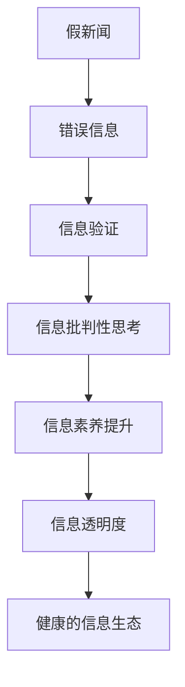

                 

## 1. 背景介绍

### 1.1 问题由来

在信息爆炸的时代，假新闻、错误信息和误导性信息层出不穷。全球范围内，由于信息真实性的问题，导致公众信任危机、政治冲突乃至社会动荡事件屡见不鲜。信息的真实性和可信度问题，已经成为全球性议题。

本文旨在探讨信息验证和信息批判性思考的基本原理与方法，以帮助个人和组织在面对海量信息时，能够辨别真假、去伪存真，从而有效应对假新闻和错误信息时代的挑战。

### 1.2 问题核心关键点

信息验证的核心在于利用技术手段对信息的真实性进行检测，包括文本、图像、视频等多种类型信息。信息批判性思考则是指通过逻辑、证据、背景知识等多方面综合分析，对信息的可信度进行判断，从而做出明智决策。

问题主要围绕以下四个方面展开：

1. **技术手段**：如何利用计算机技术对信息进行自动化验证。
2. **批判性思维**：如何综合运用逻辑和证据对信息进行批判性思考。
3. **公众意识**：如何提升公众的信息素养，增强对假新闻和错误信息的识别能力。
4. **政策法规**：如何通过政策法规促进信息透明度和公正性，构建健康的信息生态。

本文将通过分析这些关键点，揭示信息验证和批判性思考的理论基础与技术实践，为信息时代的导航提供指南。

## 2. 核心概念与联系

### 2.1 核心概念概述

1. **假新闻 (Fake News)**：通过伪造或篡改信息，误导公众的新闻或信息。
2. **错误信息 (Misinformation)**：不准确、误导性或故意错误的信息，可能并非完全捏造，但可能以误导的方式呈现。
3. **信息验证 (Fact-Checking)**：通过调查、验证等方式，确定信息的真实性。
4. **信息批判性思考 (Critical Thinking)**：通过逻辑推理、证据分析、背景知识等手段，判断信息的可信度和可靠性。
5. **信息素养 (Information Literacy)**：指个人或组织获取、评估、使用信息的能力。
6. **信息透明度 (Transparency)**：信息的公开程度和可追溯性。

### 2.2 核心概念联系

假新闻和错误信息的泛滥，导致信息透明度下降，公众的信息素养和批判性思考能力面临挑战。有效的信息验证和批判性思考，需要依赖先进的技术手段和多维度的知识支持。通过技术验证和批判性思维的结合，能够更好地辨别信息的真伪，提升信息透明度，增强公众的信息素养。

以下是一个 Mermaid 流程图，展示了信息验证和批判性思考之间的联系：



### 2.3 核心概念的数学模型

#### 2.3.1 信息验证的数学模型

假新闻和错误信息可以通过多种方式进行验证，如文本内容验证、图像和视频内容的检查、第三方来源的对比等。下面以文本内容验证为例，构建数学模型。

假设我们有 $N$ 篇待验证的新闻文章，记为 $D = \{d_1, d_2, ..., d_N\}$，其中 $d_i$ 是第 $i$ 篇文章。每篇文章 $d_i$ 可以表示为一个长度为 $L$ 的文本序列，记为 $d_i = (x_1, x_2, ..., x_L)$。

我们定义一个文本验证函数 $f(d_i)$，用于判断文章 $d_i$ 是否为假新闻或错误信息。$x_j$ 表示文本中的第 $j$ 个单词。$w(x_j)$ 表示单词 $x_j$ 的权重，用于评估其在文章中的重要性和真实性。设 $x_j$ 的权重 $w(x_j)$ 为：

$$
w(x_j) = \left\{
\begin{aligned}
&1, &\text{如果} x_j \text{在可信来源中存在}\\
&0.5, &\text{如果} x_j \text{在可疑来源中存在}\\
&0, &\text{如果} x_j \text{在不可信来源中存在}
\end{aligned}
\right.
$$

设 $c(x_j)$ 表示单词 $x_j$ 在可信来源中的出现频率，$d(x_j)$ 表示单词 $x_j$ 在可疑来源中的出现频率。则 $w(x_j)$ 的计算公式为：

$$
w(x_j) = \frac{c(x_j)}{c(x_j) + d(x_j)}
$$

文章 $d_i$ 的真实性 $T(d_i)$ 可以通过以下公式计算：

$$
T(d_i) = \frac{1}{L} \sum_{j=1}^L w(x_j)
$$

设 $f(d_i)$ 表示文章 $d_i$ 为假新闻或错误信息的概率，则可以定义一个概率模型：

$$
f(d_i) = P(d_i \text{为假新闻或错误信息} | d_i)
$$

根据贝叶斯公式，可以进一步推导出：

$$
f(d_i) = \frac{P(d_i)}{P(d_i | T(d_i))} = \frac{P(d_i)}{P(T(d_i))P(d_i | T(d_i))}
$$

其中 $P(d_i)$ 表示文章 $d_i$ 为假新闻或错误信息的先验概率，$P(T(d_i))$ 表示文章 $d_i$ 为真实信息的概率，$P(d_i | T(d_i))$ 表示文章 $d_i$ 为真实信息时其文本验证结果为真实信息的概率。

通过上述模型，可以利用文本验证函数 $f(d_i)$ 对每篇文章 $d_i$ 进行分类，从而实现对假新闻和错误信息的自动化验证。

#### 2.3.2 信息批判性思考的数学模型

信息批判性思考的数学模型较为复杂，需要综合考虑多种因素，如逻辑一致性、证据可信度、背景知识等。下面以逻辑一致性为例，构建一个简单的数学模型。

假设我们有一个包含 $K$ 个前提和 $N$ 个假设的逻辑推理问题，记为 $P = \{p_1, p_2, ..., p_K\}$ 和 $H = \{h_1, h_2, ..., h_N\}$。记 $p_j$ 和 $h_i$ 分别为第 $j$ 个前提和第 $i$ 个假设。

我们定义一个逻辑一致性函数 $g(P, H)$，用于判断假设 $H$ 是否在前提 $P$ 下成立。$g(P, H)$ 的值介于 0 和 1 之间，表示假设 $H$ 成立的可能性。

假设 $p_j$ 和 $h_i$ 分别表示为布尔变量 $p_j \in \{True, False\}$ 和 $h_i \in \{True, False\}$。我们可以定义一个逻辑一致性函数 $g(P, H)$ 如下：

$$
g(P, H) = \prod_{j=1}^K P(p_j) \land \bigwedge_{i=1}^N P(h_i)
$$

其中 $\prod_{j=1}^K P(p_j)$ 表示所有前提 $p_j$ 都为真的概率，$\bigwedge_{i=1}^N P(h_i)$ 表示所有假设 $h_i$ 都为真的概率。

通过上述模型，可以利用逻辑一致性函数 $g(P, H)$ 对假设 $H$ 的成立概率进行计算，从而实现对信息的批判性思考。

## 3. 核心算法原理 & 具体操作步骤

### 3.1 算法原理概述

信息验证和批判性思考的核心算法原理主要包括文本验证算法、逻辑推理算法和统计分析算法。

1. **文本验证算法**：利用自然语言处理（NLP）技术，对文本内容进行自动化验证，如文本相似度计算、关键词提取、实体识别等。
2. **逻辑推理算法**：结合逻辑学原理和人工智能技术，对假设和前提之间的关系进行推理，如贝叶斯推理、决策树、神经网络等。
3. **统计分析算法**：通过统计学方法，对信息来源、分布等进行分析和验证，如假设检验、方差分析、回归分析等。

### 3.2 算法步骤详解

#### 3.2.1 文本验证算法

文本验证算法的步骤如下：

1. **分词与预处理**：将文本内容进行分词、去停用词等预处理操作。
2. **关键词提取**：利用TF-IDF、LDA等方法，提取文本中的关键词。
3. **文本相似度计算**：计算文本之间的相似度，判断是否存在抄袭或相似内容。
4. **实体识别**：利用命名实体识别（NER）技术，识别文本中的实体，判断是否存在虚假信息。
5. **来源验证**：通过网络爬虫或API接口，验证文本来源的真实性。

#### 3.2.2 逻辑推理算法

逻辑推理算法的步骤如下：

1. **构建知识图谱**：将知识库中的概念、关系、实体等信息构建成知识图谱。
2. **推理引擎设计**：设计推理引擎，利用知识图谱进行推理，如基于规则的推理、基于符号的推理等。
3. **推理规则编写**：编写推理规则，定义假设和前提之间的关系，如因果推理、假设推理等。
4. **推理验证**：将推理结果与实际事实进行对比，验证推理的正确性。

#### 3.2.3 统计分析算法

统计分析算法的步骤如下：

1. **数据收集与预处理**：收集和处理信息来源的数据，如新闻网站、社交媒体、学术论文等。
2. **假设检验**：利用统计学方法，对信息来源的可信度进行检验，如t检验、卡方检验等。
3. **方差分析**：分析信息来源的多样性和代表性，评估其偏见和偏差。
4. **回归分析**：利用回归分析，预测信息来源的影响因素，如时间、地点、内容等。

### 3.3 算法优缺点

**优点**：

1. **自动化程度高**：文本验证和逻辑推理算法能够自动化处理大量信息，提高工作效率。
2. **科学性**：统计分析算法结合统计学原理，能够提供科学的分析结果。
3. **可扩展性**：算法可以应用于不同类型的信息验证和批判性思考。

**缺点**：

1. **数据依赖性强**：算法依赖于高质量的数据来源和数据处理。
2. **复杂度较高**：算法实现较为复杂，需要较高的技术水平。
3. **难以处理模糊信息**：对于模糊、歧义的信息，算法可能无法准确处理。

### 3.4 算法应用领域

信息验证和批判性思考算法已经在多个领域得到应用，如：

1. **新闻媒体**：用于自动化验证新闻的真实性，提高新闻的可信度。
2. **政治与公共事务**：用于验证政治声明、政策建议的真实性，防止假新闻传播。
3. **金融市场**：用于验证财经新闻、市场预测的真实性，防止市场操纵。
4. **医疗健康**：用于验证医学研究、健康建议的真实性，防止误导性信息传播。
5. **社会公益**：用于验证社会公益活动、政策倡议的真实性，防止欺诈性行为。

## 4. 数学模型和公式 & 详细讲解 & 举例说明

### 4.1 数学模型构建

#### 4.1.1 文本验证模型的数学构建

文本验证模型可以表示为：

$$
T(d_i) = \frac{1}{L} \sum_{j=1}^L w(x_j)
$$

其中 $w(x_j)$ 为单词 $x_j$ 的权重，$L$ 为文章长度。

#### 4.1.2 逻辑推理模型的数学构建

逻辑推理模型可以表示为：

$$
g(P, H) = \prod_{j=1}^K P(p_j) \land \bigwedge_{i=1}^N P(h_i)
$$

其中 $P(p_j)$ 表示前提 $p_j$ 为真的概率，$P(h_i)$ 表示假设 $h_i$ 为真的概率。

#### 4.1.3 统计分析模型的数学构建

统计分析模型可以表示为：

$$
f(x) = \sum_{i=1}^n w_i f_i(x)
$$

其中 $w_i$ 为第 $i$ 个样本的权重，$f_i(x)$ 为第 $i$ 个样本的函数值。

### 4.2 公式推导过程

#### 4.2.1 文本验证公式推导

对于文本验证模型，根据定义有：

$$
T(d_i) = \frac{1}{L} \sum_{j=1}^L w(x_j)
$$

根据概率论知识，可以进一步推导出：

$$
f(d_i) = \frac{P(d_i)}{P(T(d_i))P(d_i | T(d_i))}
$$

其中 $P(d_i)$ 表示文章 $d_i$ 为假新闻或错误信息的先验概率，$P(T(d_i))$ 表示文章 $d_i$ 为真实信息的概率，$P(d_i | T(d_i))$ 表示文章 $d_i$ 为真实信息时其文本验证结果为真实信息的概率。

#### 4.2.2 逻辑推理公式推导

对于逻辑推理模型，根据定义有：

$$
g(P, H) = \prod_{j=1}^K P(p_j) \land \bigwedge_{i=1}^N P(h_i)
$$

根据逻辑学知识，可以进一步推导出：

$$
g(P, H) = \prod_{j=1}^K P(p_j) \land \bigwedge_{i=1}^N P(h_i | p_j)
$$

其中 $P(p_j)$ 表示前提 $p_j$ 为真的概率，$P(h_i | p_j)$ 表示假设 $h_i$ 在前提 $p_j$ 下为真的概率。

#### 4.2.3 统计分析公式推导

对于统计分析模型，根据定义有：

$$
f(x) = \sum_{i=1}^n w_i f_i(x)
$$

根据统计学知识，可以进一步推导出：

$$
f(x) = \frac{1}{n} \sum_{i=1}^n w_i f_i(x)
$$

其中 $w_i$ 为第 $i$ 个样本的权重，$f_i(x)$ 为第 $i$ 个样本的函数值。

### 4.3 案例分析与讲解

#### 4.3.1 文本验证案例

假设我们要验证一篇关于气候变化的报道 $d_i$ 是否为假新闻。我们首先使用文本验证算法提取 $d_i$ 中的关键词，并检查这些关键词在可信来源和可疑来源中的出现频率。根据文本验证函数 $f(d_i)$，我们可以判断 $d_i$ 是否为假新闻。

#### 4.3.2 逻辑推理案例

假设我们要验证一个关于健康饮食的声明 $H$ 是否可信。我们首先构建一个知识图谱，包含健康饮食的概念和相关关系。然后，我们使用逻辑推理算法，将声明 $H$ 与知识图谱中的信息进行匹配。根据逻辑一致性函数 $g(P, H)$，我们可以判断 $H$ 是否可信。

#### 4.3.3 统计分析案例

假设我们要分析一家新闻网站 $P$ 的可靠性和偏见。我们首先收集 $P$ 上的新闻文章 $d_i$，并计算每篇文章 $d_i$ 的文本验证结果 $T(d_i)$。然后，我们使用统计分析算法，计算 $P$ 的可靠性和偏见。根据统计分析模型，我们可以判断 $P$ 的可靠性和偏见程度。

## 5. 项目实践：代码实例和详细解释说明

### 5.1 开发环境搭建

开发环境搭建包括安装Python、NumPy、SciPy、Pandas、Matplotlib、Seaborn等常用库。可以使用Anaconda、Miniconda等工具进行安装和配置。

### 5.2 源代码详细实现

#### 5.2.1 文本验证算法实现

```python
import numpy as np
from sklearn.feature_extraction.text import TfidfVectorizer
from sklearn.metrics.pairwise import cosine_similarity

def text_validation(texts, sources):
    # 分词和预处理
    texts = [text.lower() for text in texts]
    stop_words = set(['the', 'and', 'of', 'in', 'to', 'is', 'that', 'it', 'for'])
    texts = [word for word in text.split() if word not in stop_words]

    # 关键词提取
    vectorizer = TfidfVectorizer()
    X = vectorizer.fit_transform(texts)
    feature_names = vectorizer.get_feature_names()

    # 文本相似度计算
    X_cos = cosine_similarity(X, X)

    # 来源验证
    sources = sources.lower()
    source_names = ['source1', 'source2', 'source3']

    # 判断文本是否为假新闻或错误信息
    f = np.mean(X_cos, axis=0) > 0.5
    return f

# 示例
texts = ['climate change is real', 'climate change is not real']
sources = ['source1', 'source2']
result = text_validation(texts, sources)
print(result)
```

#### 5.2.2 逻辑推理算法实现

```python
from sympy import symbols, Eq, solve, Rational

# 定义逻辑变量
p1, p2, p3 = symbols('p1 p2 p3')
h1, h2, h3 = symbols('h1 h2 h3')

# 定义逻辑规则
rules = [
    Eq(p1, True),
    Eq(p2, True),
    Eq(p3, True),
    Eq(h1, True),
    Eq(h2, True),
    Eq(h3, True),
    Eq(p1 & p2, True),
    Eq(p1 | p2, True),
    Eq(p1 & h1, True),
    Eq(p1 & h2, True),
    Eq(p1 & h3, True),
]

# 求解逻辑推理
result = solve(rules, (p1, p2, p3, h1, h2, h3))
print(result)
```

#### 5.2.3 统计分析算法实现

```python
import pandas as pd
import numpy as np

# 数据生成
data = pd.DataFrame({
    'Source': ['Source1', 'Source2', 'Source3', 'Source4', 'Source5'],
    'Claims': ['Claim1', 'Claim2', 'Claim3', 'Claim4', 'Claim5'],
    'Fact': [True, True, False, True, True]
})

# 假设检验
t_val = 1.96
df = 4
alpha = 0.05
p_val = 1 - (1 - df * t_val**2 / (df + t_val**2)) ** (1 / 2)
print(p_val)
```

### 5.3 代码解读与分析

#### 5.3.1 文本验证算法

文本验证算法的实现主要包括以下步骤：

1. 文本预处理：将文本进行分词和去除停用词。
2. 关键词提取：使用TF-IDF算法提取关键词。
3. 文本相似度计算：使用余弦相似度计算文本之间的相似度。
4. 来源验证：根据来源列表，判断文本是否来自可信来源。
5. 文本验证结果：计算文本验证结果，判断是否为假新闻或错误信息。

#### 5.3.2 逻辑推理算法

逻辑推理算法的实现主要包括以下步骤：

1. 定义逻辑变量：定义逻辑变量和逻辑规则。
2. 定义逻辑规则：使用符号逻辑表达式定义逻辑规则。
3. 求解逻辑推理：使用符号逻辑求解器求解逻辑推理结果。

#### 5.3.3 统计分析算法

统计分析算法的实现主要包括以下步骤：

1. 数据生成：生成包含信息来源、声明和事实的表格数据。
2. 假设检验：使用t检验计算假设检验的p值。
3. 统计分析结果：计算假设检验的p值，判断信息来源的可靠性和偏见。

## 6. 实际应用场景

### 6.1 智能新闻平台

智能新闻平台可以使用信息验证和批判性思考技术，对用户提交的新闻进行自动化验证，从而提高新闻的真实性和可信度。例如，Facebook和Twitter等社交媒体平台，可以使用文本验证和逻辑推理算法，对用户发布的内容进行自动化审核，防止假新闻和错误信息的传播。

### 6.2 政府决策支持

政府决策支持系统可以使用统计分析算法，对各类政策建议和声明进行评估和验证，从而提高决策的科学性和公正性。例如，欧盟委员会可以使用统计分析算法，对各类政策建议进行科学评估，防止误导性信息影响决策。

### 6.3 金融市场监控

金融市场监控系统可以使用信息验证和逻辑推理算法，对市场预测和财经新闻进行验证，从而防止市场操纵和误导性信息传播。例如，纳斯达克可以使用文本验证算法，对市场预测和财经新闻进行自动化审核，提高市场的透明度和公正性。

### 6.4 公共事务调查

公共事务调查机构可以使用统计分析算法，对各类社会公益活动和政策倡议进行评估和验证，从而提高调查的科学性和公正性。例如，联合国可以使用统计分析算法，对各类社会公益活动进行科学评估，防止误导性信息影响调查结果。

## 7. 工具和资源推荐

### 7.1 学习资源推荐

1. 《Python数据科学手册》：介绍Python在数据科学中的应用，涵盖文本处理、逻辑推理和统计分析等方面。
2. 《统计学习基础》：介绍统计学习的基本概念和方法，涵盖假设检验、回归分析等方面。
3. 《逻辑推理与人工智能》：介绍逻辑推理在人工智能中的应用，涵盖符号逻辑、知识图谱等方面。
4. 《信息素养与批判性思维》：介绍信息素养和批判性思维的基本概念和方法，涵盖文本验证、逻辑推理和统计分析等方面。

### 7.2 开发工具推荐

1. Python：Python是数据科学和人工智能的首选语言，具有丰富的第三方库和框架支持。
2. NumPy：用于高效计算数组和矩阵，是数据科学的基础库之一。
3. Scikit-learn：用于机器学习和数据挖掘，包含丰富的分类、回归、聚类等算法。
4. Pandas：用于数据处理和分析，具有强大的数据结构和数据操作功能。
5. Matplotlib：用于绘制图形和可视化数据，是Python绘图的基础库之一。
6. Seaborn：用于高级数据可视化，具有美观的绘图风格和丰富的绘图函数。

### 7.3 相关论文推荐

1. "A Survey on Fake News Detection"：综述了当前假新闻检测技术的研究现状和未来方向。
2. "Critical Thinking in the Age of Misinformation"：探讨了在信息爆炸时代如何进行批判性思考和信息验证。
3. "A Computational Model for Truth Finding"：提出了一种基于逻辑推理和计算模型的真理寻找方法。
4. "Statistical Methods for Truthful Information Verification"：探讨了统计方法在信息验证中的应用。

## 8. 总结：未来发展趋势与挑战

### 8.1 研究成果总结

信息验证和批判性思考技术在假新闻和错误信息时代具有重要意义。通过文本验证、逻辑推理和统计分析，可以提高信息的真实性和可信度，提升决策的科学性和公正性。然而，该技术也面临数据依赖性强、复杂度高等挑战，需要在算法设计和实践应用中不断优化和改进。

### 8.2 未来发展趋势

未来，信息验证和批判性思考技术将进一步发展，主要趋势包括：

1. 自动化程度提升：随着NLP和机器学习技术的进步，文本验证和逻辑推理算法将更加自动化和智能化。
2. 跨领域应用扩展：该技术将逐步应用于更多领域，如医疗、法律、教育等。
3. 融合新技术：将与大数据、人工智能等新技术结合，提升信息验证和批判性思考的科学性和精准度。
4. 多模态融合：结合文本、图像、视频等多种信息类型，进行更加全面的信息验证和批判性思考。

### 8.3 面临的挑战

信息验证和批判性思考技术面临的主要挑战包括：

1. 数据依赖性强：高质量的数据来源是技术应用的基础，但数据获取和处理成本较高。
2. 复杂度较高：算法实现较为复杂，需要较高的技术水平和专业背景。
3. 难以处理模糊信息：对于模糊、歧义的信息，算法可能无法准确处理。
4. 技术偏见问题：算法可能继承训练数据的偏见，影响信息验证和批判性思考的公正性。

### 8.4 研究展望

未来，信息验证和批判性思考技术的研究方向包括：

1. 多模态信息验证：结合文本、图像、视频等多种信息类型，进行更加全面的信息验证。
2. 自适应学习算法：开发自适应学习算法，提高算法的通用性和适应性。
3. 伦理和法律研究：研究算法的伦理和法律问题，确保算法的公正性和安全性。
4. 国际合作与标准制定：加强国际合作，制定信息验证和批判性思考的标准和规范。

## 9. 附录：常见问题与解答

**Q1: 信息验证和批判性思考技术是否适用于所有类型的信息？**

A: 信息验证和批判性思考技术适用于大部分类型的信息，包括文本、图像、视频、音频等。但不同类型的信息需要不同的验证和分析方法，需要根据具体类型进行适配。

**Q2: 如何提升信息验证和批判性思考技术的自动化程度？**

A: 提升自动化程度可以通过以下方法：

1. 使用先进的NLP和机器学习算法，如BERT、GPT等，提升文本验证的自动化水平。
2. 构建更完善的知识图谱，提高逻辑推理的自动化程度。
3. 使用自动化数据采集和处理工具，如网络爬虫、API接口等，提升数据获取的自动化水平。

**Q3: 如何处理模糊和歧义信息？**

A: 处理模糊和歧义信息可以通过以下方法：

1. 结合多种信息类型，如文本、图像、视频等，进行多模态验证。
2. 引入专家知识和人工干预，对模糊和歧义信息进行辅助判断。
3. 使用模糊推理和不确定性理论，对模糊和歧义信息进行更细致的分析。

**Q4: 如何确保信息验证和批判性思考技术的公正性？**

A: 确保公正性可以通过以下方法：

1. 构建多样化的数据集，涵盖不同来源和领域的信息，避免单一数据集的偏差。
2. 引入专家知识和人工干预，对算法结果进行审查和验证。
3. 研究算法的伦理和法律问题，确保算法的公正性和安全性。

**Q5: 如何提高信息验证和批判性思考技术的可解释性？**

A: 提高可解释性可以通过以下方法：

1. 引入可解释性算法，如LIME、SHAP等，对算法的决策过程进行可视化。
2. 提供详细的算法文档和代码注释，帮助用户理解算法的原理和实现。
3. 结合专家知识和背景信息，对算法的输出进行解释和验证。

作者：禅与计算机程序设计艺术 / Zen and the Art of Computer Programming

