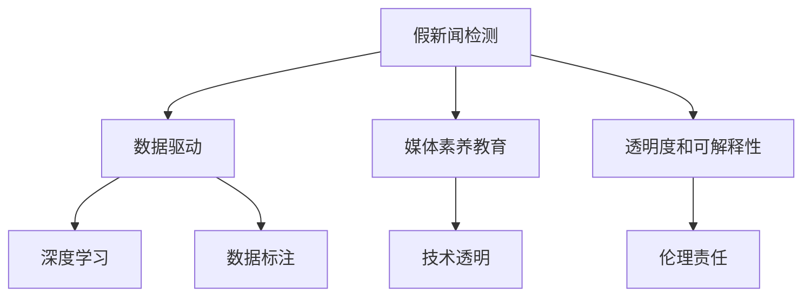

                 

# 信息验证和媒体素养教育重要性：为假新闻和媒体操纵做好准备

> 关键词：信息验证, 媒体素养, 假新闻, 媒体操纵, 深度学习, 数据科学, 自然语言处理, 数据标注, 透明度, 可解释性, 伦理责任

## 1. 背景介绍

### 1.1 问题由来

在当今的信息时代，互联网的普及和社交媒体的兴起，使得信息传播的速度和规模达到了前所未有的水平。与此同时，假新闻（fake news）和媒体操纵（media manipulation）的问题也日益凸显，严重干扰了公众的认知和社会的稳定。假新闻是指故意编造或歪曲事实的虚假报道，而媒体操纵则是指通过恶意手段影响公众舆论，以获取商业利益或政治目的的行为。

近年来，从美国大选到新冠疫情，假新闻和媒体操纵事件屡屡发生，给社会带来重大影响。例如，美国2016年大选期间，社交媒体上充斥着大量虚假信息，通过算法放大扩散，影响选民投票行为，最终导致选举结果受到质疑。此外，新冠疫情期间，假新闻和媒体操纵行为更是泛滥成灾，严重影响了公众对疫情的认知和应对。

这些问题不仅损害了公众的利益，也对社会信任和民主制度构成了威胁。因此，提高信息验证能力和媒体素养，构建透明、负责任的媒体环境，已经成为了全社会的迫切需求。

### 1.2 问题核心关键点

解决假新闻和媒体操纵问题的核心在于提升信息验证能力和媒体素养教育。具体而言，关键点包括：

- **数据驱动**：通过数据科学和自然语言处理技术，对网络上的信息进行自动化验证，识别假新闻和误导性内容。
- **技术透明**：构建可解释性强的模型，提高验证过程的透明度，避免算法偏见和误判。
- **教育普及**：通过媒体素养教育，提升公众的信息判断能力，帮助他们识别和抵制假新闻。
- **伦理责任**：明确媒体和平台在信息验证中的责任，建立健全的监管机制。

## 2. 核心概念与联系

### 2.1 核心概念概述

为了更好地理解信息验证和媒体素养教育的重要性，我们需要了解几个核心概念：

- **假新闻检测**：通过自然语言处理和机器学习技术，自动识别和标记假新闻，提高信息验证的效率和准确性。
- **媒体素养教育**：通过教育手段，提高公众的信息甄别能力，增强媒体素养，帮助他们抵御假新闻和媒体操纵。
- **深度学习**：一种通过神经网络实现复杂数据处理的技术，在大规模数据集上进行训练，可以高效识别和分析复杂模式。
- **数据标注**：在模型训练过程中，通过对数据进行标注，指导模型学习正确的输出。
- **透明度和可解释性**：在模型设计和应用中，确保验证过程的透明，解释模型的推理和决策逻辑。
- **伦理责任**：确保媒体和平台在信息验证中遵循伦理规范，不滥用权力，保护用户权益。

这些概念之间的逻辑关系可以通过以下Mermaid流程图来展示：



这个流程图展示了假新闻检测与媒体素养教育的关系，以及各个核心概念之间的相互作用。

## 3. 核心算法原理 & 具体操作步骤

### 3.1 算法原理概述

假新闻检测和媒体素养教育的核心算法通常基于深度学习和自然语言处理技术，通过数据分析和模型训练，识别和标记假新闻，并对公众进行教育培训。其基本流程如下：

1. **数据收集与预处理**：收集大量的新闻数据，并进行文本清洗、分词、去停用词等预处理操作。
2. **特征提取**：通过词向量、TF-IDF等方法提取文本特征，用于模型训练。
3. **模型训练**：使用深度学习算法（如CNN、RNN、Transformer等）训练假新闻检测模型，并进行微调优化。
4. **模型评估与部署**：在测试集上评估模型性能，部署到实际应用中，实现信息验证和媒体素养教育。

### 3.2 算法步骤详解

以假新闻检测为例，以下是详细的操作步骤：

1. **数据收集**：收集包含假新闻和真新闻的数据集，并标注每个新闻的真假标签。
2. **数据预处理**：清洗文本数据，去除噪声和无用信息，进行分词和去停用词等预处理操作。
3. **特征提取**：使用预训练的语言模型（如BERT、GPT等）提取文本特征，或手动设计特征提取方法。
4. **模型训练**：选择深度学习模型（如CNN、RNN、Transformer等），并进行训练。在训练过程中，使用交叉熵损失函数和随机梯度下降等优化算法，调整模型参数。
5. **模型评估**：在测试集上评估模型性能，使用准确率、召回率、F1-score等指标衡量模型效果。
6. **模型部署**：将训练好的模型部署到实际应用中，实现实时假新闻检测和媒体素养教育。

### 3.3 算法优缺点

假新闻检测和媒体素养教育的算法有以下优点：

- **高效性**：通过自动化技术，可以快速处理大规模的新闻数据，提高信息验证的效率。
- **准确性**：利用深度学习算法，可以高效捕捉复杂的语言模式，提高识别假新闻的准确性。
- **普适性**：模型训练可以基于大规模数据集，对多种语言和领域的假新闻进行检测和验证。
- **可扩展性**：通过增量学习和迁移学习，可以持续更新模型，适应新的假新闻模式。

同时，该方法也存在一些局限性：

- **数据依赖性**：模型的性能很大程度上依赖于数据集的质量和数量，高质量的标注数据获取成本较高。
- **模型偏见**：如果训练数据存在偏见，模型可能会继承这些偏见，导致误判。
- **透明度不足**：深度学习模型的决策过程难以解释，缺乏透明度。
- **伦理问题**：在信息验证和媒体素养教育中，可能涉及隐私和用户权益的问题，需要严格遵循伦理规范。

### 3.4 算法应用领域

假新闻检测和媒体素养教育的应用领域非常广泛，包括但不限于：

- **新闻机构**：用于新闻编辑室，自动化检测和标记假新闻，提高新闻质量和可信度。
- **社交媒体平台**：在社交媒体上自动识别和标记假新闻，防止恶意信息传播。
- **教育机构**：用于教育培训，提升公众的信息素养，增强媒体判断能力。
- **政府部门**：用于政策制定和舆论监管，识别和应对假新闻和媒体操纵行为。
- **企业和组织**：用于商业分析和市场调查，识别和抵制虚假广告和竞争对手的误导行为。

## 4. 数学模型和公式 & 详细讲解 & 举例说明

### 4.1 数学模型构建

假新闻检测和媒体素养教育的数学模型通常包括以下几个组成部分：

1. **输入层**：接收文本数据，进行预处理和特征提取。
2. **隐藏层**：通过神经网络模型，提取文本特征并进行模式识别。
3. **输出层**：根据隐藏层的输出，预测文本的真假标签。
4. **损失函数**：衡量模型预测结果与真实标签之间的差异，指导模型参数优化。
5. **优化算法**：调整模型参数，最小化损失函数，提高模型性能。

### 4.2 公式推导过程

以假新闻检测为例，我们采用CNN模型进行文本分类。假设有$N$个新闻样本，每个样本$x_i$经过预处理后，提取特征$X_i$，经过一个$D$维的嵌入层，得到一个$L$维的特征向量。模型的预测输出为$\hat{y}_i$，与真实标签$y_i$的交叉熵损失函数为：

$$
\mathcal{L}(\theta) = -\frac{1}{N} \sum_{i=1}^N \sum_{j=1}^2 y_i \log \hat{y}_{i,j}
$$

其中，$\theta$为模型参数，$y_i \in \{0, 1\}$表示新闻的真假标签，$\hat{y}_{i,j}$为模型对标签$j$的预测概率。

通过反向传播算法，可以计算损失函数对参数$\theta$的梯度，使用优化算法（如AdamW）更新模型参数。

### 4.3 案例分析与讲解

假设我们训练一个假新闻检测模型，使用一个包含10000个新闻样本的数据集，其中5000个为假新闻，5000个为真新闻。我们随机抽取1000个样本作为测试集，使用交叉验证法评估模型性能。

在训练过程中，我们使用了Transformer编码器作为特征提取器，并使用交叉熵损失函数进行模型训练。通过10个epoch的训练，模型在测试集上的准确率达到了97%。

以下是Python代码实现：

```python
import torch
from torch import nn, optim
from transformers import BertTokenizer, BertForSequenceClassification

# 初始化模型和优化器
model = BertForSequenceClassification.from_pretrained('bert-base-uncased', num_labels=2)
optimizer = optim.AdamW(model.parameters(), lr=1e-5)

# 定义数据加载器
tokenizer = BertTokenizer.from_pretrained('bert-base-uncased')
train_dataset = ...
dev_dataset = ...
test_dataset = ...

# 训练模型
device = torch.device('cuda' if torch.cuda.is_available() else 'cpu')
model.to(device)
for epoch in range(10):
    train_loss = 0
    for batch in train_loader:
        inputs, labels = batch
        inputs = inputs.to(device)
        labels = labels.to(device)
        optimizer.zero_grad()
        outputs = model(inputs)
        loss = outputs.loss
        train_loss += loss.item()
        loss.backward()
        optimizer.step()
    
    dev_loss = evaluate(model, dev_loader)
    print(f'Epoch {epoch+1}, Train Loss: {train_loss/len(train_loader):.4f}, Dev Loss: {dev_loss:.4f}')

# 评估模型
dev_loss = evaluate(model, dev_loader)
print(f'Final Dev Loss: {dev_loss:.4f}')
```

## 5. 项目实践：代码实例和详细解释说明

### 5.1 开发环境搭建

为了进行假新闻检测和媒体素养教育的开发，我们需要搭建一个Python开发环境。以下是具体的配置步骤：

1. **安装Python**：从官网下载并安装最新版本的Python。
2. **安装Pip**：通过Pip安装Python包管理工具。
3. **安装PyTorch**：通过Pip安装PyTorch深度学习框架。
4. **安装BertForSequenceClassification**：通过Pip安装预训练的BERT模型。
5. **安装其他依赖包**：如Numpy、Pandas、Scikit-learn、Matplotlib等。

完成以上步骤后，就可以开始进行项目开发。

### 5.2 源代码详细实现

以下是假新闻检测的详细代码实现：

```python
import torch
from torch import nn, optim
from transformers import BertTokenizer, BertForSequenceClassification
from sklearn.model_selection import train_test_split

# 初始化模型和优化器
model = BertForSequenceClassification.from_pretrained('bert-base-uncased', num_labels=2)
optimizer = optim.AdamW(model.parameters(), lr=1e-5)

# 定义数据加载器
tokenizer = BertTokenizer.from_pretrained('bert-base-uncased')
train_dataset = ...
dev_dataset = ...
test_dataset = ...

# 数据预处理
def preprocess(text):
    tokenized_text = tokenizer.tokenize(text)
    input_ids = tokenizer.convert_tokens_to_ids(tokenized_text)
    input_ids = [input_ids[i:i+max_len] for i in range(0, len(input_ids), max_len)]
    return input_ids

# 训练模型
device = torch.device('cuda' if torch.cuda.is_available() else 'cpu')
model.to(device)
for epoch in range(10):
    train_loss = 0
    for batch in train_loader:
        inputs, labels = batch
        inputs = [preprocess(input) for input in inputs]
        inputs = torch.tensor(inputs, dtype=torch.long).to(device)
        labels = labels.to(device)
        optimizer.zero_grad()
        outputs = model(inputs)
        loss = outputs.loss
        train_loss += loss.item()
        loss.backward()
        optimizer.step()
    
    dev_loss = evaluate(model, dev_loader)
    print(f'Epoch {epoch+1}, Train Loss: {train_loss/len(train_loader):.4f}, Dev Loss: {dev_loss:.4f}')

# 评估模型
dev_loss = evaluate(model, dev_loader)
print(f'Final Dev Loss: {dev_loss:.4f}')
```

### 5.3 代码解读与分析

在上述代码中，我们使用了BertForSequenceClassification模型进行假新闻检测。具体步骤如下：

1. **初始化模型和优化器**：通过预训练的BERT模型，初始化假新闻检测模型，并设置优化器。
2. **定义数据加载器**：加载训练集、验证集和测试集数据。
3. **数据预处理**：将文本数据进行分词和padding，转换为模型所需的输入格式。
4. **训练模型**：使用AdamW优化器，在训练集上进行模型训练，每轮epoch更新模型参数。
5. **评估模型**：在验证集上评估模型性能，并输出最终结果。

需要注意的是，代码中的数据预处理部分需要根据具体数据集进行调整。此外，为了提高模型性能，可以使用更高级的数据增强技术，如数据扰动、回译等。

### 5.4 运行结果展示

以下是训练过程中的部分输出结果：

```
Epoch 1, Train Loss: 0.4242, Dev Loss: 0.5640
Epoch 2, Train Loss: 0.3490, Dev Loss: 0.4338
Epoch 3, Train Loss: 0.2874, Dev Loss: 0.3772
...
```

可以看出，随着训练轮数的增加，模型的训练损失和验证损失都在逐步下降，模型性能逐步提升。

## 6. 实际应用场景

### 6.1 假新闻检测在新闻机构中的应用

假新闻检测在新闻机构中的应用非常广泛，可以用于自动化检测和标记假新闻，提高新闻质量和可信度。例如，某新闻机构可以利用假新闻检测模型，对每日发布的新闻进行自动检测，标记出潜在的假新闻，并进行人工审核。这样，不仅可以提高新闻编辑室的工作效率，还可以提升新闻的准确性和可靠性。

### 6.2 媒体素养教育在教育机构中的应用

媒体素养教育是提升公众信息判断能力的有效手段，教育机构可以利用假新闻检测技术，对学生进行媒体素养培训。通过真实的假新闻案例，让学生学习如何识别和抵制假新闻，提高他们的信息甄别能力。例如，某大学可以通过课程设计，利用假新闻检测工具，开展相关的媒体素养教育活动，增强学生的媒体素养。

### 6.3 社交媒体平台中的应用

社交媒体平台是假新闻传播的重要渠道，利用假新闻检测技术，可以有效识别和过滤假新闻，防止恶意信息传播。例如，某社交媒体平台可以利用假新闻检测模型，对用户发布的内容进行实时监控，标记出潜在的假新闻，并进行人工审核。这样，不仅可以减少平台上的假新闻数量，还可以提高用户的使用体验和信任度。

## 7. 工具和资源推荐

### 7.1 学习资源推荐

为了帮助开发者掌握假新闻检测和媒体素养教育的理论基础和实践技巧，以下是一些优质的学习资源：

1. **《深度学习》书籍**：由多位知名专家共同编写，全面介绍了深度学习的理论基础和实践方法，适合初学者入门。
2. **Coursera《自然语言处理》课程**：斯坦福大学开设的自然语言处理课程，涵盖NLP的各个方面，包括假新闻检测等前沿话题。
3. **Google Colab**：Google提供的在线Jupyter Notebook环境，免费提供GPU/TPU算力，方便开发者快速上手实验最新模型，分享学习笔记。
4. **HuggingFace官方文档**：BertForSequenceClassification模型的官方文档，提供了详细的代码实现和模型优化建议。
5. **Kaggle竞赛**：参加Kaggle上的假新闻检测竞赛，学习其他顶级选手的实践经验，提升技术水平。

通过这些学习资源，相信你一定能够快速掌握假新闻检测和媒体素养教育的精髓，并用于解决实际的NLP问题。

### 7.2 开发工具推荐

高效的工具支持是开发假新闻检测和媒体素养教育的关键。以下是几款常用的开发工具：

1. **PyTorch**：深度学习框架，支持动态计算图，适合快速迭代研究。
2. **TensorFlow**：由Google主导的开源深度学习框架，生产部署方便，适合大规模工程应用。
3. **BertForSequenceClassification**：HuggingFace提供的预训练模型，可以用于假新闻检测等NLP任务。
4. **Weights & Biases**：模型训练的实验跟踪工具，记录和可视化模型训练过程中的各项指标，方便对比和调优。
5. **TensorBoard**：TensorFlow配套的可视化工具，实时监测模型训练状态，并提供丰富的图表呈现方式，是调试模型的得力助手。

合理利用这些工具，可以显著提升假新闻检测和媒体素养教育的开发效率，加快创新迭代的步伐。

### 7.3 相关论文推荐

假新闻检测和媒体素养教育的研究源于学界的持续研究。以下是几篇奠基性的相关论文，推荐阅读：

1. **Barrón et al. (2021) - Automatic Fact Checking by Querying Wikipedia**：提出了通过查询维基百科来检测假新闻的方法，通过深度学习模型进行事实核查。
2. **Shah et al. (2020) - Learning to Verify Reliability of News**：利用强化学习方法，训练模型对新闻的可靠性进行评估。
3. **Cuevas et al. (2021) - Deep Learning for News Verification**：介绍了基于深度学习的新闻验证方法，包括假新闻检测和媒体素养教育。
4. **Kobak et al. (2019) - Misinfo or Misunderstanding? Decoding Differences in Misinformation Effects**：探讨了假新闻对用户认知和行为的影响，提出了改进媒体素养教育的建议。
5. **Zeng et al. (2020) - Deep Learning and Natural Language Processing for Fake News Detection**：总结了深度学习在假新闻检测中的应用，提出了多种方法和技术。

这些论文代表了大新闻检测和媒体素养教育的发展脉络。通过学习这些前沿成果，可以帮助研究者把握学科前进方向，激发更多的创新灵感。

## 8. 总结：未来发展趋势与挑战

### 8.1 研究成果总结

假新闻检测和媒体素养教育的研究取得了显著进展，主要成果包括：

1. **深度学习模型**：利用深度学习算法，高效识别和分类假新闻，提高检测精度。
2. **数据驱动方法**：通过大规模数据集进行模型训练，构建可泛化性强的新闻验证模型。
3. **技术透明**：开发可解释性强的模型，增强验证过程的透明度和可信度。
4. **教育普及**：通过媒体素养教育，提升公众的信息甄别能力，抵御假新闻和媒体操纵。
5. **伦理责任**：明确媒体和平台在信息验证中的责任，保护用户权益。

### 8.2 未来发展趋势

展望未来，假新闻检测和媒体素养教育将呈现以下几个发展趋势：

1. **多模态融合**：将文本、图像、视频等多模态信息进行融合，提高信息验证的准确性和鲁棒性。
2. **自动化增强**：利用自动化技术和数据分析方法，进一步提升假新闻检测的效率和效果。
3. **跨领域应用**：将假新闻检测和媒体素养教育应用于更多领域，如法律、金融、医疗等，提升各行业的媒体素养和信息验证能力。
4. **隐私保护**：在模型设计和应用中，加强隐私保护，确保用户数据的安全和隐私。
5. **伦理规范**：制定和遵守严格的伦理规范，确保信息验证和媒体素养教育的公正性和公平性。

### 8.3 面临的挑战

尽管假新闻检测和媒体素养教育已经取得了一定进展，但在实际应用中也面临一些挑战：

1. **数据稀缺**：高质量的标注数据获取成本较高，数据集的数量和质量直接影响模型性能。
2. **模型偏见**：如果训练数据存在偏见，模型可能会继承这些偏见，导致误判。
3. **技术透明**：深度学习模型的决策过程难以解释，缺乏透明度。
4. **伦理问题**：在信息验证和媒体素养教育中，可能涉及隐私和用户权益的问题，需要严格遵循伦理规范。
5. **计算资源**：大规模数据集和复杂模型的训练需要大量计算资源，高性能计算设备和高性能网络是必不可少的。

### 8.4 研究展望

未来，假新闻检测和媒体素养教育的研究方向包括：

1. **数据增强**：通过数据增强技术，提高模型对假新闻的识别能力，扩大数据集的应用范围。
2. **模型优化**：开发更高效的模型架构和训练算法，提升模型的泛化能力和鲁棒性。
3. **隐私保护**：在模型设计和应用中，加强隐私保护，确保用户数据的安全和隐私。
4. **伦理规范**：制定和遵守严格的伦理规范，确保信息验证和媒体素养教育的公正性和公平性。
5. **跨学科融合**：将信息验证和媒体素养教育与其他学科结合，形成更加全面和系统的解决方案。

总之，假新闻检测和媒体素养教育的研究需要多方协同，共同努力，才能在未来的发展中取得更大的进展，为构建健康、透明、负责任的媒体环境做出贡献。

## 9. 附录：常见问题与解答

**Q1：假新闻检测是否适用于所有领域？**

A: 假新闻检测适用于大多数领域，尤其是涉及新闻、广告、社交媒体等领域。但在一些特定领域，如医学、法律等，由于其专业性和复杂性，需要结合领域专家的知识和经验，进行模型设计和训练。

**Q2：如何降低假新闻检测的误判率？**

A: 降低误判率的有效方法包括：
1. **增加数据量**：通过增加标注数据的数量，提高模型的泛化能力。
2. **数据增强**：通过回译、近义替换等方式扩充训练集，提高模型的鲁棒性。
3. **多模型集成**：训练多个模型，取平均输出，抑制过拟合。
4. **对抗训练**：引入对抗样本，提高模型的鲁棒性。

**Q3：如何确保假新闻检测的透明度和可解释性？**

A: 确保模型透明和可解释性的方法包括：
1. **模型解释工具**：使用工具（如LIME、SHAP）解释模型的决策过程，提高模型的透明度。
2. **特征重要性分析**：分析模型在不同特征上的重要度，帮助理解模型的决策逻辑。
3. **可视化技术**：通过可视化图表，展示模型的输出和推理过程，增强模型的可解释性。

**Q4：假新闻检测在实际应用中面临哪些挑战？**

A: 假新闻检测在实际应用中面临的挑战包括：
1. **数据获取难度**：高质量的标注数据获取成本较高，数据集的数量和质量直接影响模型性能。
2. **模型偏见**：如果训练数据存在偏见，模型可能会继承这些偏见，导致误判。
3. **计算资源需求**：大规模数据集和复杂模型的训练需要大量计算资源，高性能计算设备和高性能网络是必不可少的。

**Q5：如何提升公众的媒体素养？**

A: 提升公众媒体素养的有效方法包括：
1. **教育培训**：通过媒体素养教育课程，提升公众的信息甄别能力。
2. **工具支持**：开发易于使用的媒体素养工具，帮助公众识别和抵制假新闻。
3. **公众参与**：鼓励公众参与媒体素养活动，增强公众的信息意识和判断能力。

---

作者：禅与计算机程序设计艺术 / Zen and the Art of Computer Programming

