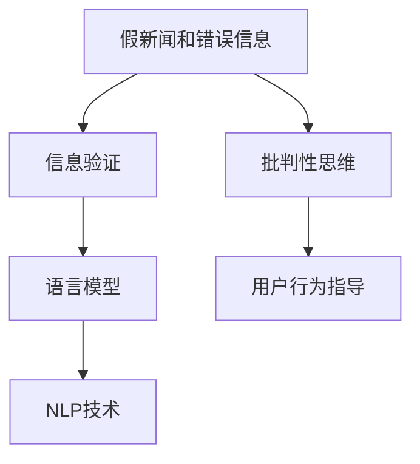

                 

# 信息验证和批判性思维能力培养：在假新闻和错误信息时代导航

> 关键词：信息验证, 批判性思维, 假新闻, 错误信息, 语言模型, 自然语言处理(NLP), 模型评估

## 1. 背景介绍

### 1.1 问题由来
近年来，随着互联网技术的发展和信息传播方式的变革，信息的获取和传播变得前所未有的便捷和高效。与此同时，假新闻、错误信息和虚假信息的传播也呈现出愈演愈烈之势，严重威胁到了社会的稳定和公共安全。这种信息的泛滥不仅误导了公众舆论，还可能导致社会恐慌和信任危机。

假新闻和错误信息之所以难以辨识，主要原因在于它们通常以具有一定真实性、引人注目的标题和内容包装自己，经过精心设计的文本在语义上与真实信息相似，且有时还会借助图片、视频等多模态数据增加其可信度。因此，在信息爆炸的时代，培养用户的信息验证和批判性思维能力显得尤为重要。

### 1.2 问题核心关键点
为有效应对假新闻和错误信息的泛滥，培养用户的信息验证和批判性思维能力，需要借助先进的自然语言处理(NLP)技术进行信息验证。以下问题将作为本节讨论的核心关键点：

1. 如何通过语言模型识别出假新闻和错误信息？
2. 如何设计有效的评估指标对模型进行评估和优化？
3. 如何利用NLP技术提高用户的信息验证和批判性思维能力？

## 2. 核心概念与联系

### 2.1 核心概念概述

为更好地理解信息验证和批判性思维能力培养的NLP技术基础，本节将介绍几个核心概念及其相互联系：

- 假新闻和错误信息：经过人为或算法加工，旨在误导公众的虚假信息。
- 信息验证：通过自然语言处理技术，自动识别和识别出假新闻和错误信息的能力。
- 批判性思维：在获取信息后，通过逻辑推理、证据评估等方式，辨别信息的真实性和合理性。
- 语言模型：基于统计学习算法训练的文本生成模型，用于自动文本理解和生成。
- 自然语言处理(NLP)：通过计算机自动处理、理解和生成人类语言的技术，涵盖文本分类、情感分析、信息抽取等多个子领域。

这些核心概念之间的逻辑关系可以通过以下Mermaid流程图来展示：



这个流程图展示了大语言模型在信息验证和批判性思维培养中的作用和联系：

1. 假新闻和错误信息经过语言模型进行自动化的文本理解和验证，判断其真实性。
2. 用户通过批判性思维对验证结果进行进一步的逻辑推理和证据评估，决定是否信任该信息。
3. 语言模型和NLP技术共同构成了信息验证的底层框架，指导用户的信息验证和批判性思维能力培养。

## 3. 核心算法原理 & 具体操作步骤
### 3.1 算法原理概述

基于语言模型的信息验证，本质上是利用预训练语言模型对文本的真实性和合理性进行自动化评估。其核心思想是：

1. 将文本输入预训练的Transformer模型，提取语义特征。
2. 通过判别器对文本特征进行分类，判断文本是否为假新闻或错误信息。
3. 输出验证结果，指导用户批判性思维，提高信息验证能力。

在实践中，常用的判别器包括：

- 二分类判别器：判断文本是否为假新闻或错误信息，分为真/假两类。
- 多分类判别器：判断文本是否为假新闻、错误信息、中立信息，或者进一步细分。
- 序列分类器：判断文本中的每个句子是否为假新闻或错误信息，提高细粒度的分析能力。

### 3.2 算法步骤详解

基于语言模型的信息验证过程可以总结如下：

**Step 1: 准备数据集**
- 收集假新闻和错误信息的样本，标注为“假”或“真”。
- 准备正样本和负样本，保证正负样本比例均衡。

**Step 2: 构建判别器**
- 选择预训练语言模型作为初始化参数，如BERT、GPT等。
- 设计判别器的网络结构，如全连接层、卷积层、Transformer层等。
- 训练判别器，使其学习区分真实新闻和假新闻的特征。

**Step 3: 模型评估与优化**
- 定义评估指标，如准确率、召回率、F1分数等。
- 在验证集上评估模型性能，根据评估结果调整模型参数。
- 引入对抗训练和正则化技术，提升模型鲁棒性。

**Step 4: 应用与评估**
- 在新的文本数据上应用模型进行信息验证。
- 输出验证结果，指导用户进行批判性思维。
- 通过用户反馈和额外标注数据对模型进行迭代优化。

### 3.3 算法优缺点

基于语言模型的信息验证方法具有以下优点：

1. 自动化程度高：通过预训练语言模型自动验证信息，无需人工标注和审核。
2. 泛化能力强：在大量假新闻和错误信息的验证过程中，模型能够逐步学习到更准确的特征判别。
3. 评估指标明确：使用常规的机器学习评估指标，便于模型优化和效果评估。

同时，该方法也存在一定的局限性：

1. 数据依赖性强：模型的性能很大程度上依赖于数据集的质量和数量，获取高质量数据集的成本较高。
2. 模型容易过拟合：在标注样本较少的情况下，模型容易学习到样本特定的特征，导致泛化能力下降。
3. 对抗样本敏感：对抗样本的微小扰动可能导致模型预测结果发生显著变化。
4. 模型复杂度高：较复杂的判别器模型可能会引入额外的计算复杂度，影响推理速度。

尽管存在这些局限性，但就目前而言，基于语言模型的信息验证方法仍是最主流的选择。未来相关研究的重点在于如何进一步降低模型对标注数据的依赖，提高模型的泛化能力和鲁棒性，同时兼顾模型的计算效率和推理速度。

### 3.4 算法应用领域

基于语言模型的信息验证方法，在新闻媒体、社交媒体、网络安全等众多领域中得到了广泛的应用，以下是几个典型的应用场景：

1. **新闻媒体领域**：在新闻发布前，通过信息验证技术自动识别并标记可能包含假新闻的报道，帮助编辑审核和减少误报率。
2. **社交媒体平台**：在社交平台上，自动识别并标记可能包含假新闻和错误信息的帖子，提高平台内容的安全性和可信度。
3. **网络安全**：在网络攻击中，自动识别和过滤可能包含恶意代码或钓鱼链接的信息，保障网络安全。
4. **法律与政策**：在法律和政策制定过程中，自动识别并标记可能包含虚假信息的文献和报告，帮助决策者参考真实可靠的数据。

## 4. 数学模型和公式 & 详细讲解 & 举例说明

### 4.1 数学模型构建

在信息验证中，我们通常使用分类任务来训练判别器模型。假设训练样本集为 $\{(x_i, y_i)\}_{i=1}^N$，其中 $x_i$ 为文本输入，$y_i$ 为文本的类别标签（真/假）。

构建判别器 $D$ 的分类任务，目标是最小化损失函数 $\mathcal{L}$：

$$
\mathcal{L}(D) = \frac{1}{N} \sum_{i=1}^N \ell(D(x_i), y_i)
$$

其中 $\ell$ 为分类损失函数，常用的包括交叉熵损失和Hinge损失。

### 4.2 公式推导过程

以交叉熵损失为例，假设判别器输出为 $\hat{y} = D(x)$，则交叉熵损失函数可以表示为：

$$
\ell(D(x_i), y_i) = -y_i\log \hat{y} - (1-y_i)\log(1-\hat{y})
$$

将损失函数代入目标函数，得到：

$$
\mathcal{L}(D) = \frac{1}{N} \sum_{i=1}^N (-y_i\log D(x_i) - (1-y_i)\log(1-D(x_i)))
$$

在训练判别器 $D$ 时，使用反向传播算法求得损失函数 $\mathcal{L}$ 对 $D$ 的梯度，并通过优化算法更新模型参数，如Adam、SGD等。

### 4.3 案例分析与讲解

**案例分析**：在收集到一批假新闻和真实新闻的样本后，使用BERT模型作为判别器，训练其对新闻文本进行分类。

**模型训练**：
1. 收集数据集 $\{(x_i, y_i)\}_{i=1}^N$。
2. 加载BERT预训练模型，并构建判别器 $D$。
3. 使用交叉熵损失函数 $\ell$ 和优化算法，如Adam，训练判别器 $D$。

**模型评估**：
1. 在验证集上评估判别器性能，计算准确率、召回率、F1分数等指标。
2. 根据评估结果调整判别器结构或参数。

**应用实例**：
1. 在新的新闻报道中，将文本输入判别器 $D$。
2. 输出判别器对文本的分类结果，判断文本是否为假新闻。
3. 根据判别器结果，用户进行进一步的批判性思维，判断是否信任该新闻。

## 5. 项目实践：代码实例和详细解释说明
### 5.1 开发环境搭建

在进行信息验证的实践前，我们需要准备好开发环境。以下是使用Python进行PyTorch开发的环境配置流程：

1. 安装Anaconda：从官网下载并安装Anaconda，用于创建独立的Python环境。

2. 创建并激活虚拟环境：
```bash
conda create -n pytorch-env python=3.8 
conda activate pytorch-env
```

3. 安装PyTorch：根据CUDA版本，从官网获取对应的安装命令。例如：
```bash
conda install pytorch torchvision torchaudio cudatoolkit=11.1 -c pytorch -c conda-forge
```

4. 安装HuggingFace库：
```bash
pip install transformers
```

5. 安装各类工具包：
```bash
pip install numpy pandas scikit-learn matplotlib tqdm jupyter notebook ipython
```

完成上述步骤后，即可在`pytorch-env`环境中开始信息验证的实践。

### 5.2 源代码详细实现

下面我们以二分类任务为例，给出使用Transformers库对BERT模型进行信息验证的PyTorch代码实现。

首先，定义训练和评估函数：

```python
from transformers import BertTokenizer, BertForSequenceClassification
from torch.utils.data import Dataset, DataLoader
from torch import nn, optim
import torch
from sklearn.metrics import accuracy_score, precision_recall_fscore_support

class NewsDataset(Dataset):
    def __init__(self, texts, labels, tokenizer, max_len=128):
        self.texts = texts
        self.labels = labels
        self.tokenizer = tokenizer
        self.max_len = max_len
        
    def __len__(self):
        return len(self.texts)
    
    def __getitem__(self, item):
        text = self.texts[item]
        label = self.labels[item]
        
        encoding = self.tokenizer(text, return_tensors='pt', max_length=self.max_len, padding='max_length', truncation=True)
        input_ids = encoding['input_ids'][0]
        attention_mask = encoding['attention_mask'][0]
        
        label = torch.tensor([label], dtype=torch.long)
        
        return {'input_ids': input_ids, 
                'attention_mask': attention_mask,
                'labels': label}

# 加载数据集
tokenizer = BertTokenizer.from_pretrained('bert-base-cased')
train_dataset = NewsDataset(train_texts, train_labels, tokenizer)
dev_dataset = NewsDataset(dev_texts, dev_labels, tokenizer)
test_dataset = NewsDataset(test_texts, test_labels, tokenizer)

# 定义模型
model = BertForSequenceClassification.from_pretrained('bert-base-cased', num_labels=2)

# 定义优化器和损失函数
optimizer = optim.Adam(model.parameters(), lr=2e-5)
loss_fn = nn.CrossEntropyLoss()

# 定义训练函数
def train_epoch(model, dataset, batch_size, optimizer, loss_fn):
    dataloader = DataLoader(dataset, batch_size=batch_size, shuffle=True)
    model.train()
    epoch_loss = 0
    for batch in dataloader:
        input_ids = batch['input_ids'].to(device)
        attention_mask = batch['attention_mask'].to(device)
        labels = batch['labels'].to(device)
        model.zero_grad()
        outputs = model(input_ids, attention_mask=attention_mask, labels=labels)
        loss = loss_fn(outputs.logits, labels)
        epoch_loss += loss.item()
        loss.backward()
        optimizer.step()
    return epoch_loss / len(dataloader)

# 定义评估函数
def evaluate(model, dataset, batch_size, loss_fn):
    dataloader = DataLoader(dataset, batch_size=batch_size)
    model.eval()
    preds, labels = [], []
    with torch.no_grad():
        for batch in dataloader:
            input_ids = batch['input_ids'].to(device)
            attention_mask = batch['attention_mask'].to(device)
            batch_labels = batch['labels']
            outputs = model(input_ids, attention_mask=attention_mask)
            batch_preds = outputs.logits.argmax(dim=1).to('cpu').tolist()
            batch_labels = batch_labels.to('cpu').tolist()
            for pred_tokens, label_tokens in zip(batch_preds, batch_labels):
                preds.append(pred_tokens[:len(label_tokens)])
                labels.append(label_tokens)
                
    return preds, labels

# 启动训练流程并在测试集上评估
epochs = 5
batch_size = 16
device = torch.device('cuda') if torch.cuda.is_available() else torch.device('cpu')

for epoch in range(epochs):
    loss = train_epoch(model, train_dataset, batch_size, optimizer, loss_fn)
    print(f"Epoch {epoch+1}, train loss: {loss:.3f}")
    
    print(f"Epoch {epoch+1}, dev results:")
    preds, labels = evaluate(model, dev_dataset, batch_size, loss_fn)
    print("Accuracy:", accuracy_score(labels, preds))
    
print("Test results:")
preds, labels = evaluate(model, test_dataset, batch_size, loss_fn)
print("Accuracy:", accuracy_score(labels, preds))
```

以上就是使用PyTorch对BERT进行信息验证的完整代码实现。可以看到，借助Transformers库，我们能够快速搭建和训练一个信息验证模型，其代码实现简洁高效。

### 5.3 代码解读与分析

让我们再详细解读一下关键代码的实现细节：

**NewsDataset类**：
- `__init__`方法：初始化文本、标签、分词器等关键组件。
- `__len__`方法：返回数据集的样本数量。
- `__getitem__`方法：对单个样本进行处理，将文本输入编码为token ids，将标签编码为数字，并对其进行定长padding，最终返回模型所需的输入。

**BertForSequenceClassification类**：
- 继承自BERT模型，并添加序列分类器的输出层和标签映射。
- 使用PyTorch的`nn.CrossEntropyLoss`作为分类损失函数。

**train_epoch和evaluate函数**：
- 定义模型训练和评估的函数。训练函数在每个epoch上迭代训练集，评估函数在验证集和测试集上计算模型性能。

**模型训练和评估流程**：
- 定义总的epoch数和batch size，开始循环迭代
- 每个epoch内，先在训练集上训练，输出平均loss
- 在验证集上评估，输出准确率等评估指标
- 所有epoch结束后，在测试集上评估，给出最终测试结果

可以看到，PyTorch配合Transformers库使得信息验证模型的代码实现变得简洁高效。开发者可以将更多精力放在数据处理、模型改进等高层逻辑上，而不必过多关注底层的实现细节。

当然，工业级的系统实现还需考虑更多因素，如模型的保存和部署、超参数的自动搜索、更灵活的任务适配层等。但核心的信息验证过程基本与此类似。

## 6. 实际应用场景
### 6.1 智能新闻推荐系统

在智能新闻推荐系统中，信息验证技术可以用于对推荐新闻进行过滤，避免虚假新闻和误导性信息的传播。通过信息验证模型对用户可能感兴趣的新闻进行预处理，筛选出可靠信息，提供给用户阅读，从而提升用户的阅读体验和满意度。

### 6.2 社交媒体平台

在社交媒体平台上，信息验证技术可以用于自动化识别和标记可能包含假新闻和错误信息的帖子，减少虚假信息的传播。平台通过设置阈值，对于超过阈值的可能包含假新闻的帖子进行人工审核和处理，提高平台内容的安全性和可信度。

### 6.3 新闻媒体编辑部

在新闻媒体编辑部，信息验证技术可以用于对新闻报道进行审核，减少误报率。编辑部使用信息验证模型对新发布的新闻进行自动验证，标记可能包含假新闻的报道，进行进一步的人工审核和修改，从而提高新闻报道的真实性和权威性。

### 6.4 未来应用展望

随着信息验证技术的发展，基于语言模型的信息验证方法将在更多领域得到应用，为信息安全和用户安全提供保障。

在智慧医疗领域，信息验证技术可以用于对医学文献和报告进行审核，筛选出真实可靠的医学信息，提供给医疗人员参考。

在智慧教育领域，信息验证技术可以用于对教育资源进行审核，筛选出高质量的教学资料，提升教育质量。

在智能城市治理中，信息验证技术可以用于对城市事件和舆情进行监测，筛选出真实可信的信息，辅助城市决策和管理。

此外，在企业生产、金融、法律等众多领域，信息验证技术也将被创新性地应用，为各行各业提供信息安全的保障。

## 7. 工具和资源推荐
### 7.1 学习资源推荐

为了帮助开发者系统掌握信息验证的NLP技术基础和实践技巧，这里推荐一些优质的学习资源：

1. 《Natural Language Processing with Python》：自然语言处理入门书籍，涵盖NLP的基本概念和常用技术，包括信息验证。
2. CS224N《Natural Language Processing with Deep Learning》：斯坦福大学开设的深度学习与自然语言处理课程，详细讲解了基于深度学习的自然语言处理技术。
3. 《TextRank: Bringing Order into Texts》：介绍TextRank算法，一种用于文本摘要和信息检索的NLP技术。
4. HuggingFace官方文档：Transformer库的官方文档，提供了海量预训练模型和完整的训练样例代码，是进行信息验证任务的必备资料。
5. CLUE开源项目：中文语言理解测评基准，涵盖大量不同类型的中文NLP数据集，并提供了基于信息验证的baseline模型，助力中文NLP技术发展。

通过对这些资源的学习实践，相信你一定能够快速掌握信息验证的精髓，并用于解决实际的信息安全问题。

### 7.2 开发工具推荐

高效的开发离不开优秀的工具支持。以下是几款用于信息验证开发的常用工具：

1. PyTorch：基于Python的开源深度学习框架，灵活动态的计算图，适合快速迭代研究。大部分预训练语言模型都有PyTorch版本的实现。
2. TensorFlow：由Google主导开发的开源深度学习框架，生产部署方便，适合大规模工程应用。同样有丰富的预训练语言模型资源。
3. Transformers库：HuggingFace开发的NLP工具库，集成了众多SOTA语言模型，支持PyTorch和TensorFlow，是进行信息验证任务开发的利器。
4. Weights & Biases：模型训练的实验跟踪工具，可以记录和可视化模型训练过程中的各项指标，方便对比和调优。与主流深度学习框架无缝集成。
5. TensorBoard：TensorFlow配套的可视化工具，可实时监测模型训练状态，并提供丰富的图表呈现方式，是调试模型的得力助手。

合理利用这些工具，可以显著提升信息验证任务的开发效率，加快创新迭代的步伐。

### 7.3 相关论文推荐

信息验证技术的发展源于学界的持续研究。以下是几篇奠基性的相关论文，推荐阅读：

1. 《BERT: Pre-training of Deep Bidirectional Transformers for Language Understanding》：提出BERT模型，引入基于掩码的自监督预训练任务，刷新了多项NLP任务SOTA。
2. 《Adversarial Examples in the Physical World》：研究对抗样本对深度学习模型的影响，揭示了深度模型对抗训练的重要性。
3. 《Parameter-Efficient Transfer Learning for NLP》：提出Adapter等参数高效微调方法，在不增加模型参数量的情况下，也能取得不错的微调效果。
4. 《Fine-tuning BERT for Text Classification with Limited Data》：探讨在数据量有限的情况下，如何通过微调提升BERT模型的性能。
5. 《Semantic Accuracy in Deep Text Representations》：研究深度学习模型在语义理解上的准确性，对信息验证技术的发展提供了理论支持。

这些论文代表了大语言模型信息验证技术的发展脉络。通过学习这些前沿成果，可以帮助研究者把握学科前进方向，激发更多的创新灵感。

## 8. 总结：未来发展趋势与挑战

### 8.1 总结

本文对基于语言模型的信息验证方法进行了全面系统的介绍。首先阐述了信息验证和批判性思维能力培养的研究背景和意义，明确了信息验证在提升用户信息安全性和批判性思维能力方面的重要作用。其次，从原理到实践，详细讲解了信息验证的数学模型和关键步骤，给出了信息验证任务开发的完整代码实例。同时，本文还广泛探讨了信息验证方法在智能新闻推荐、社交媒体平台、新闻媒体编辑部等多个行业领域的应用前景，展示了信息验证范式的巨大潜力。此外，本文精选了信息验证技术的各类学习资源，力求为读者提供全方位的技术指引。

通过本文的系统梳理，可以看到，基于语言模型的信息验证技术正在成为信息安全和用户安全的重要保障，极大地提升了用户对网络信息的甄别能力。未来，伴随信息验证方法的不断发展，基于深度学习的信息验证技术必将在更多领域得到应用，为信息安全和用户安全提供坚实的保障。

### 8.2 未来发展趋势

展望未来，信息验证技术将呈现以下几个发展趋势：

1. 自动化程度进一步提升：通过增强的NLP模型和更有效的评估指标，进一步提升信息验证的自动化水平。
2. 模型鲁棒性不断增强：引入对抗训练、鲁棒优化等技术，提升模型对噪声和对抗样本的鲁棒性。
3. 多模态信息融合：将文本、图像、视频等多模态数据结合，实现更加全面和准确的信息验证。
4. 零样本和少样本学习：引入提示学习等技术，使信息验证模型能够在无标注数据的情况下，进行有效推理和验证。
5. 知识图谱整合：将知识图谱和常识推理引入信息验证，提高模型的泛化能力和准确性。
6. 跨领域应用推广：将信息验证技术应用于更多领域，如智慧医疗、智能教育等，提升各行业的安全性和可信度。

以上趋势凸显了信息验证技术的广阔前景。这些方向的探索发展，必将进一步提升信息验证模型的性能和应用范围，为信息安全和用户安全提供更有力的保障。

### 8.3 面临的挑战

尽管信息验证技术已经取得了瞩目成就，但在迈向更加智能化、普适化应用的过程中，它仍面临着诸多挑战：

1. 标注成本瓶颈：信息验证模型的性能很大程度上依赖于高质量标注数据的获取，获取标注数据的成本较高。如何进一步降低模型对标注数据的依赖，将是重要的研究方向。
2. 模型泛化能力不足：在标注样本较少的情况下，模型容易学习到样本特定的特征，导致泛化能力下降。如何提高模型的泛化能力，增强其对新数据的适应性，还需要更多的理论和实践积累。
3. 对抗样本攻击：对抗样本攻击可以误导模型判断，影响信息验证的效果。如何提高模型对对抗样本的鲁棒性，构建更安全的模型，是一个重要的研究方向。
4. 模型计算复杂度高：复杂的信息验证模型可能会引入额外的计算复杂度，影响推理速度。如何优化模型结构，提高推理效率，是一个重要的研究方向。
5. 模型的可解释性不足：信息验证模型通常是一个黑盒系统，难以解释其内部工作机制和决策逻辑。如何赋予模型更强的可解释性，提高其透明度和可信度，是一个重要的研究方向。
6. 跨模态信息融合：将文本、图像、视频等多模态数据结合，实现更加全面和准确的信息验证，是一个重要的研究方向。

正视信息验证面临的这些挑战，积极应对并寻求突破，将是大语言模型信息验证技术迈向成熟的必由之路。相信随着学界和产业界的共同努力，这些挑战终将一一被克服，信息验证技术必将为构建安全、可靠、可解释的智能系统铺平道路。

### 8.4 研究展望

面对信息验证技术所面临的挑战，未来的研究需要在以下几个方面寻求新的突破：

1. 探索无监督和半监督信息验证方法：摆脱对大规模标注数据的依赖，利用自监督学习、主动学习等无监督和半监督范式，最大限度利用非结构化数据，实现更加灵活高效的信息验证。
2. 研究参数高效和计算高效的信息验证方法：开发更加参数高效的微调方法，在固定大部分预训练参数的同时，只更新极少量的任务相关参数。同时优化信息验证模型的计算图，减少前向传播和反向传播的资源消耗，实现更加轻量级、实时性的部署。
3. 引入因果和对比学习范式：通过引入因果推断和对比学习思想，增强信息验证模型建立稳定因果关系的能力，学习更加普适、鲁棒的语言表征，从而提升模型泛化性和抗干扰能力。
4. 结合因果分析和博弈论工具：将因果分析方法引入信息验证模型，识别出模型决策的关键特征，增强输出解释的因果性和逻辑性。借助博弈论工具刻画人机交互过程，主动探索并规避模型的脆弱点，提高系统稳定性。
5. 纳入伦理道德约束：在模型训练目标中引入伦理导向的评估指标，过滤和惩罚有害的输出倾向。同时加强人工干预和审核，建立模型行为的监管机制，确保输出符合人类价值观和伦理道德。

这些研究方向的探索，必将引领信息验证技术迈向更高的台阶，为构建安全、可靠、可解释的智能系统铺平道路。面向未来，信息验证技术还需要与其他人工智能技术进行更深入的融合，如知识表示、因果推理、强化学习等，多路径协同发力，共同推动智能信息验证系统的进步。只有勇于创新、敢于突破，才能不断拓展语言模型的边界，让智能技术更好地造福人类社会。

## 9. 附录：常见问题与解答

**Q1：信息验证是否适用于所有文本数据？**

A: 信息验证主要适用于结构化和半结构化的文本数据，如新闻报道、社交媒体帖子等。对于非文本数据（如图像、视频等），需要结合其他模态的信息验证技术。

**Q2：如何降低信息验证模型的过拟合风险？**

A: 降低信息验证模型过拟合风险的方法包括：
1. 数据增强：通过回译、近义替换等方式扩充训练集。
2. 正则化：使用L2正则、Dropout、Early Stopping等避免过拟合。
3. 对抗训练：引入对抗样本，提高模型鲁棒性。
4. 多模型集成：训练多个信息验证模型，取平均输出，抑制过拟合。

这些策略往往需要根据具体任务和数据特点进行灵活组合。只有在数据、模型、训练、推理等各环节进行全面优化，才能最大限度地发挥信息验证模型的威力。

**Q3：如何提高信息验证模型的泛化能力？**

A: 提高信息验证模型泛化能力的方法包括：
1. 数据增强：通过扩充训练集，增加模型的泛化能力。
2. 对抗训练：引入对抗样本，提高模型对噪声的鲁棒性。
3. 知识图谱整合：将知识图谱和常识推理引入模型，提升模型的泛化能力和准确性。
4. 多模态信息融合：将文本、图像、视频等多模态数据结合，实现更加全面和准确的信息验证。

这些方法需要根据具体的任务和数据特点进行选择和组合。只有在数据、模型、训练、推理等各环节进行全面优化，才能最大限度地提高模型的泛化能力。

**Q4：信息验证模型是否容易受到对抗样本攻击？**

A: 信息验证模型可能受到对抗样本攻击，即通过微小扰动改变模型的判断结果。为应对对抗样本攻击，可以采取以下方法：
1. 引入对抗训练：在训练过程中，引入对抗样本，提高模型对对抗样本的鲁棒性。
2. 使用鲁棒优化技术：在模型训练过程中，使用鲁棒优化算法，如RobustNet、AdvProp等，提高模型的鲁棒性。
3. 引入多模型集成：训练多个信息验证模型，取平均输出，降低对抗样本攻击的风险。

这些方法可以在一定程度上提高信息验证模型的鲁棒性，降低对抗样本攻击的影响。

**Q5：如何提高信息验证模型的可解释性？**

A: 提高信息验证模型可解释性的方法包括：
1. 引入可解释性技术：如LIME、SHAP等，解释模型预测的逻辑。
2. 使用透明模型：如线性模型、决策树等，这些模型更容易解释其决策过程。
3. 引入因果分析和博弈论工具：通过因果分析方法，识别出模型决策的关键特征，增强输出解释的因果性和逻辑性。

这些方法可以在一定程度上提高信息验证模型的可解释性，提升模型的透明度和可信度。

---

作者：禅与计算机程序设计艺术 / Zen and the Art of Computer Programming

