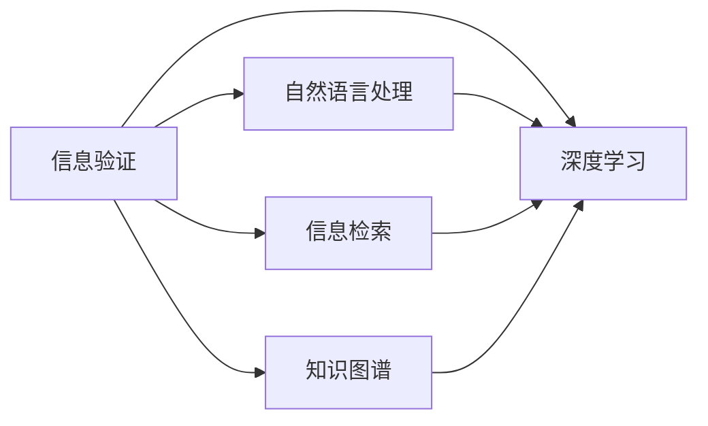

                 

# 信息验证和批判性思维能力：在假新闻、错误信息和媒体操纵的时代导航

> 关键词：信息验证、批判性思维、假新闻、错误信息、媒体操纵、深度学习、自然语言处理、信息检索、知识图谱、数据科学

## 1. 背景介绍

### 1.1 问题由来

在21世纪这个信息爆炸的时代，每天都会产生海量的文本数据。无论是社交媒体、新闻网站、博客还是其他在线平台，都能找到大量未经核实的消息和观点。这些信息有时是错误或虚假的，有时可能被有意扭曲或操控以误导公众。因此，在处理和消费这些信息时，我们需要具备辨别真伪和批判性思考的能力。

特别是在假新闻、错误信息和媒体操纵日益泛滥的今天，信息验证和批判性思维能力显得尤为重要。数字媒体和社交媒体的普及不仅提供了丰富多样的信息来源，也带来了信息的真伪难辨和舆论操控风险。而深度学习、自然语言处理和信息检索等技术，则为信息验证提供了有力的工具。

### 1.2 问题核心关键点

信息验证的核心目标是从海量文本数据中，辨识出真实和可信的信息。而批判性思维则涉及分析、评估和构建论据，以支持或反驳某些观点或主张。在现代信息社会中，这两项能力显得尤为关键。

1. **信息验证**：利用数据科学、机器学习和自然语言处理技术，从大量文本数据中识别出可信和可信度较低的信息。
2. **批判性思维**：通过逻辑推理、证据评估和统计分析，对各种信息和观点进行深入分析和批判性思考。

信息验证和批判性思维在假新闻、错误信息和媒体操纵检测中具有重要应用。例如，可以用于：
- 识别和筛选假新闻和误导性信息。
- 分析新闻报道的来源和可信度。
- 揭示信息背后可能存在的操纵和偏见。

### 1.3 问题研究意义

研究信息验证和批判性思维能力，对于构建一个健康、透明和负责任的信息生态系统具有重要意义。它可以帮助个体和组织：
- 避免误导性信息的传播和影响。
- 提升信息获取和消费的质量。
- 培养公众的信息素养和批判性思维。
- 加强对媒体操纵和虚假信息的防范。

在假新闻和错误信息盛行的时代，信息验证和批判性思维能力成为了公共决策、商业活动、学术研究等领域不可或缺的保障。

## 2. 核心概念与联系

### 2.1 核心概念概述

为了更好地理解信息验证和批判性思维能力，本节将介绍几个关键概念：

- **信息验证**：利用技术和数据科学方法，从大量文本数据中识别和筛选真实、可信的信息。
- **批判性思维**：通过逻辑推理、证据评估和统计分析，对信息和观点进行深入分析和批判性思考。
- **深度学习**：一种通过多层次神经网络进行数据学习的技术，能够从文本数据中提取高级特征。
- **自然语言处理**：研究计算机如何理解、处理和生成人类语言的技术。
- **信息检索**：从大规模文本库中获取相关信息的自动化技术。
- **知识图谱**：构建和查询基于实体的关系网络，以支持更复杂的信息检索和关联推理。

这些核心概念之间的逻辑关系可以通过以下Mermaid流程图来展示：



这个流程图展示了大规模文本信息验证的基本技术路径：

1. 信息验证利用深度学习、自然语言处理和信息检索技术。
2. 深度学习用于从文本数据中提取高级特征。
3. 自然语言处理用于处理和理解文本数据。
4. 信息检索用于在大规模文本库中搜索相关文档。
5. 知识图谱用于关联和查询实体信息，支持复杂信息推理。

这些概念共同构成了信息验证和批判性思维的核心技术框架，为其提供了坚实的理论基础和实现手段。

## 3. 核心算法原理 & 具体操作步骤
### 3.1 算法原理概述

信息验证和批判性思维的核心算法包括深度学习模型、自然语言处理技术、信息检索算法和知识图谱构建。

- **深度学习模型**：用于从文本数据中提取高级语义特征。
- **自然语言处理**：包括文本清洗、分词、命名实体识别、依存句法分析等，用于文本数据预处理和结构化。
- **信息检索算法**：用于在大规模文本库中搜索相关文档，识别可信来源。
- **知识图谱构建**：通过实体关系抽取，构建知识图谱以支持复杂信息推理。

这些技术在信息验证和批判性思维中发挥着重要作用：

- **深度学习模型**：通过学习大量文本数据，可以提取丰富的语义信息，识别出可能含有误导或虚假信息的内容。
- **自然语言处理**：帮助理解和处理文本，提供更准确的文本分析结果。
- **信息检索算法**：通过高效检索相关文档，可以快速找到可信的信息来源。
- **知识图谱构建**：通过关联和查询实体信息，支持更复杂的信息推理和验证。

### 3.2 算法步骤详解

信息验证和批判性思维的具体步骤包括以下几个关键步骤：

**Step 1: 数据收集和预处理**
- 从社交媒体、新闻网站、论坛等在线平台收集大量文本数据。
- 对数据进行清洗、分词、命名实体识别等自然语言处理步骤。

**Step 2: 特征提取和深度学习模型训练**
- 使用深度学习模型（如BERT、GPT等）从文本数据中提取高级语义特征。
- 在标注数据集上进行模型训练，使用交叉熵损失等优化算法，调整模型参数。

**Step 3: 信息检索和可信度评估**
- 使用信息检索算法（如向量空间模型、TF-IDF等）检索与待验证信息相关的文档。
- 评估这些文档的可信度，如来源可信度、作者可信度、引用次数等。

**Step 4: 批判性思维分析**
- 使用自然语言处理技术进行文本分析和依存句法分析，提取关键论据和逻辑关系。
- 利用统计分析和逻辑推理，对各种信息和观点进行深入分析和批判性思考。

**Step 5: 结果展示和报告**
- 将信息验证和批判性分析结果汇总，形成报告或可视化图表。
- 提出改进建议，帮助识别和修正假新闻和误导性信息。

### 3.3 算法优缺点

信息验证和批判性思维的算法具有以下优点：

- **高效性**：深度学习模型和大规模信息检索算法可以快速处理大量文本数据，实现高效的验证过程。
- **准确性**：通过多个技术和方法的组合，可以显著提高信息验证的准确性。
- **可扩展性**：算法可以轻松应用于不同类型的文本数据和任务。

同时，该方法也存在一定的局限性：

- **数据依赖**：信息验证的效果很大程度上依赖于数据质量和标注数据的数量。
- **解释性不足**：深度学习模型的内部机制复杂，难以解释其决策过程。
- **技术门槛**：需要一定的技术背景和工具，对一般用户可能门槛较高。

### 3.4 算法应用领域

信息验证和批判性思维的算法在多个领域都有重要应用：

- **新闻媒体**：自动检测假新闻和误导性信息，提高新闻媒体的公信力和透明度。
- **学术研究**：验证研究文献的真实性和可信度，辅助学术研究。
- **商业智能**：分析客户评价和市场反馈，提升产品和服务质量。
- **法律应用**：验证法律文件和证据的真实性，支持司法决策。

这些应用展示了信息验证和批判性思维的广泛影响力和实际价值。

## 4. 数学模型和公式 & 详细讲解 & 举例说明
### 4.1 数学模型构建

为了更准确地描述信息验证和批判性思维的数学模型，我们引入几个基本的概念和符号：

- 设文本数据集为 $D = \{(x_i, y_i)\}_{i=1}^N$，其中 $x_i$ 为输入文本，$y_i$ 为标签（0表示虚假信息，1表示真实信息）。
- 设深度学习模型为 $f: \mathcal{X} \rightarrow [0, 1]$，其中 $\mathcal{X}$ 为输入文本空间。
- 设信息检索结果为 $r: \mathcal{D} \rightarrow [0, 1]$，其中 $\mathcal{D}$ 为文档集合。
- 设可信度评估函数为 $g: \mathcal{D} \rightarrow [0, 1]$。

### 4.2 公式推导过程

**深度学习模型训练**：

假设深度学习模型 $f$ 在训练集 $D$ 上的损失函数为 $\ell(f, D) = \frac{1}{N} \sum_{i=1}^N L(y_i, f(x_i))$，其中 $L$ 为交叉熵损失函数，$L(y_i, f(x_i)) = -y_i \log f(x_i) - (1-y_i) \log (1-f(x_i))$。

最小化损失函数得到模型参数 $\theta$：

$$
\theta^* = \mathop{\arg\min}_{\theta} \ell(f_{\theta}, D)
$$

**信息检索和可信度评估**：

信息检索结果 $r$ 与模型预测结果 $f(x)$ 的关联度可以使用余弦相似度来衡量：

$$
r = \frac{\sum_{d \in \mathcal{D}} \cos(\theta, d)}{\sum_{d \in \mathcal{D}} \cos(\theta, d)}
$$

其中 $\theta$ 为文本向量，$d$ 为文档向量。

可信度评估函数 $g$ 可以基于文档的来源可信度、作者可信度和引用次数等因素构建：

$$
g(d) = \alpha_1 C(d) + \alpha_2 A(d) + \alpha_3 R(d)
$$

其中 $C(d)$、$A(d)$ 和 $R(d)$ 分别表示文档的来源可信度、作者可信度和引用次数，$\alpha_1$、$\alpha_2$ 和 $\alpha_3$ 为权重系数。

**批判性思维分析**：

批判性思维分析可以通过逻辑推理和统计分析实现。假设输入文本 $x$ 包含论点 $a$ 和证据 $b$，可信度评估函数为 $g$，则：

$$
\text{批判性得分} = \frac{g(a)}{g(b)}
$$

### 4.3 案例分析与讲解

以假新闻检测为例，假设有一个新闻报道 $x$，需要验证其真实性。

1. **数据收集和预处理**：
   - 从新闻网站和社交媒体收集相关文本数据。
   - 对文本进行清洗、分词、命名实体识别等步骤。

2. **特征提取和深度学习模型训练**：
   - 使用BERT模型从文本数据中提取语义特征。
   - 在标注数据集上进行模型训练，调整模型参数。

3. **信息检索和可信度评估**：
   - 使用向量空间模型检索与报道相关的文档。
   - 评估这些文档的来源可信度、作者可信度和引用次数，得到可信度评分 $g(d)$。

4. **批判性思维分析**：
   - 对报道的论点和证据进行依存句法分析，提取关键论据。
   - 利用逻辑推理和统计分析，评估报道的合理性和可信度。

5. **结果展示和报告**：
   - 将信息验证和批判性分析结果汇总，形成报告。
   - 提出改进建议，帮助识别和修正假新闻。

## 5. 项目实践：代码实例和详细解释说明
### 5.1 开发环境搭建

在进行信息验证和批判性思维的实践前，我们需要准备好开发环境。以下是使用Python进行深度学习和自然语言处理环境配置的流程：

1. 安装Anaconda：从官网下载并安装Anaconda，用于创建独立的Python环境。

2. 创建并激活虚拟环境：
```bash
conda create -n nlp-env python=3.8 
conda activate nlp-env
```

3. 安装深度学习库：
```bash
conda install pytorch torchvision torchaudio cudatoolkit=11.1 -c pytorch -c conda-forge
```

4. 安装自然语言处理库：
```bash
pip install nltk spacy transformers
```

5. 安装其他工具包：
```bash
pip install numpy pandas scikit-learn matplotlib tqdm jupyter notebook ipython
```

完成上述步骤后，即可在`nlp-env`环境中开始实践。

### 5.2 源代码详细实现

这里以使用BERT模型进行假新闻检测为例，给出深度学习模型的代码实现。

首先，定义模型和优化器：

```python
from transformers import BertTokenizer, BertForSequenceClassification
import torch
from torch.utils.data import DataLoader
from torch import nn

device = torch.device("cuda" if torch.cuda.is_available() else "cpu")

tokenizer = BertTokenizer.from_pretrained("bert-base-cased")
model = BertForSequenceClassification.from_pretrained("bert-base-cased", num_labels=2)
optimizer = torch.optim.Adam(model.parameters(), lr=1e-5)

criterion = nn.BCEWithLogitsLoss()
```

接着，定义数据集和数据处理函数：

```python
class NewsDataset(Dataset):
    def __init__(self, texts, labels):
        self.texts = texts
        self.labels = labels
        self.tokenizer = tokenizer
    
    def __len__(self):
        return len(self.texts)
    
    def __getitem__(self, idx):
        text = self.texts[idx]
        label = self.labels[idx]
        encoding = self.tokenizer(text, return_tensors="pt", padding=True, truncation=True, max_length=256)
        return {"input_ids": encoding["input_ids"], "attention_mask": encoding["attention_mask"], "labels": torch.tensor([label], dtype=torch.float)}
    
# 加载数据
train_dataset = NewsDataset(train_texts, train_labels)
val_dataset = NewsDataset(val_texts, val_labels)
test_dataset = NewsDataset(test_texts, test_labels)
```

然后，定义训练和评估函数：

```python
def train_epoch(model, train_loader, optimizer, criterion, device):
    model.train()
    total_loss = 0
    for batch in train_loader:
        input_ids = batch["input_ids"].to(device)
        attention_mask = batch["attention_mask"].to(device)
        labels = batch["labels"].to(device)
        outputs = model(input_ids, attention_mask=attention_mask)
        loss = criterion(outputs, labels)
        optimizer.zero_grad()
        loss.backward()
        optimizer.step()
        total_loss += loss.item()
    return total_loss / len(train_loader)

def evaluate(model, val_loader, criterion, device):
    model.eval()
    total_loss = 0
    total_correct = 0
    with torch.no_grad():
        for batch in val_loader:
            input_ids = batch["input_ids"].to(device)
            attention_mask = batch["attention_mask"].to(device)
            labels = batch["labels"].to(device)
            outputs = model(input_ids, attention_mask=attention_mask)
            loss = criterion(outputs, labels)
            total_loss += loss.item()
            total_correct += (torch.argmax(outputs, dim=1) == labels).sum().item()
    return total_loss / len(val_loader), total_correct / len(val_dataset)
```

最后，启动训练流程并在测试集上评估：

```python
epochs = 5
batch_size = 16

for epoch in range(epochs):
    train_loss = train_epoch(model, train_loader, optimizer, criterion, device)
    print(f"Epoch {epoch+1}, train loss: {train_loss:.3f}")
    
    val_loss, val_correct = evaluate(model, val_loader, criterion, device)
    print(f"Epoch {epoch+1}, val loss: {val_loss:.3f}, val acc: {val_correct:.3f}")
    
print("Test results:")
test_loss, test_correct = evaluate(model, test_loader, criterion, device)
print(f"Test loss: {test_loss:.3f}, test acc: {test_correct:.3f}")
```

以上就是使用BERT模型进行假新闻检测的完整代码实现。可以看到，通过使用Transformers库，可以较为简洁地搭建深度学习模型并进行训练。

### 5.3 代码解读与分析

让我们再详细解读一下关键代码的实现细节：

**NewsDataset类**：
- `__init__`方法：初始化文本和标签。
- `__len__`方法：返回数据集的样本数量。
- `__getitem__`方法：对单个样本进行处理，将文本输入编码为token ids，添加掩码，并返回模型所需的输入。

**模型定义**：
- 使用BERT模型，设置两分类问题，二元交叉熵损失函数。
- 使用Adam优化器，设置学习率。

**数据处理函数**：
- 定义数据集，使用BertTokenizer进行文本编码。
- 加载训练集、验证集和测试集数据。

**训练和评估函数**：
- 定义训练循环，每个epoch迭代一次训练数据集，计算损失并更新模型参数。
- 定义评估函数，在验证集上计算损失和准确率。
- 在测试集上计算最终损失和准确率。

**训练流程**：
- 定义总的epoch数和batch size，开始循环迭代。
- 每个epoch内，先在训练集上训练，输出平均loss和acc。
- 在验证集上评估，输出val loss和val acc。
- 所有epoch结束后，在测试集上评估，给出最终测试结果。

可以看出，PyTorch配合Transformers库使得深度学习模型的训练过程变得简洁高效。开发者可以将更多精力放在数据处理、模型改进等高层逻辑上，而不必过多关注底层的实现细节。

当然，工业级的系统实现还需考虑更多因素，如模型的保存和部署、超参数的自动搜索、更灵活的任务适配层等。但核心的信息验证和批判性思维计算过程基本与此类似。

## 6. 实际应用场景
### 6.1 新闻媒体

在新闻媒体中，假新闻和误导性信息的检测至关重要。假新闻检测系统可以帮助新闻媒体筛选出可能含有虚假信息的内容，提高媒体的公信力和透明度。

在技术实现上，可以收集媒体平台的历史报道和相关新闻，将新闻和事实进行标注，构建标注数据集。使用BERT等深度学习模型进行训练，获得假新闻检测模型。对新的新闻报道，输入到模型中进行预测，识别出可能含有虚假信息的内容，进行标记或屏蔽。

### 6.2 学术研究

学术研究中，验证研究论文的真实性和可信度非常关键。假研究会误导学术界，阻碍科学进步。通过使用深度学习模型和自然语言处理技术，可以自动检测研究文献的真实性，提升学术研究的可信度。

具体而言，可以收集学术数据库中的论文，将论文和事实进行标注，构建标注数据集。使用BERT等深度学习模型进行训练，获得假研究检测模型。对新的研究论文，输入到模型中进行预测，识别出可能含有虚假信息的内容，进行标记或筛选。

### 6.3 商业智能

在商业智能中，客户评价和市场反馈的验证非常关键。假评论和误导性信息会对企业品牌和产品声誉造成严重损害。通过使用深度学习模型和自然语言处理技术，可以自动检测客户评价和市场反馈的真实性，提升商业决策的准确性。

具体而言，可以收集电商平台上的客户评论和市场反馈，将评论和事实进行标注，构建标注数据集。使用BERT等深度学习模型进行训练，获得假评论检测模型。对新的客户评价和市场反馈，输入到模型中进行预测，识别出可能含有虚假信息的内容，进行标记或屏蔽。

### 6.4 法律应用

在法律应用中，验证法律文件和证据的真实性非常关键。假证据会导致司法误判，影响社会公正。通过使用深度学习模型和自然语言处理技术，可以自动检测法律文件和证据的真实性，保障司法公正。

具体而言，可以收集法律数据库中的文件和证据，将文件和事实进行标注，构建标注数据集。使用BERT等深度学习模型进行训练，获得假证据检测模型。对新的法律文件和证据，输入到模型中进行预测，识别出可能含有虚假信息的内容，进行标记或筛选。

### 6.5 未来应用展望

随着深度学习和大数据技术的发展，信息验证和批判性思维能力将进一步提升。未来可能出现以下趋势：

1. **多模态融合**：结合文本、图像、语音等多种模态数据，实现更全面、准确的信息验证。
2. **实时验证**：利用在线文本数据流，实现实时、动态的信息验证和分析。
3. **个性化验证**：根据用户的历史行为和兴趣，提供个性化的信息验证和批判性分析。
4. **跨语言验证**：实现跨语言的文本分析和信息验证，支持多语言环境下的信息检索和分析。
5. **零样本学习**：利用预训练模型和知识图谱，实现对新领域和新任务的快速适应。

这些趋势将进一步拓展信息验证和批判性思维的应用边界，提升其在各行各业的落地能力。

## 7. 工具和资源推荐
### 7.1 学习资源推荐

为了帮助开发者系统掌握信息验证和批判性思维能力的理论基础和实践技巧，这里推荐一些优质的学习资源：

1. **《自然语言处理入门》（NLP入门必读）**：介绍自然语言处理的基本概念和核心技术，适合初学者入门。

2. **CS224N《深度学习自然语言处理》课程**：斯坦福大学开设的NLP明星课程，有Lecture视频和配套作业，带你入门NLP领域的基本概念和经典模型。

3. **《深度学习与NLP实战》**：实战性强，结合实际案例，讲解深度学习在NLP中的应用。

4. **NLP101**：提供NLP相关论文、代码和教程，是NLP技术学习的优质资源。

5. **Python自然语言处理（NLTK）**：Python自然语言处理库，提供丰富的NLP工具和数据集，支持多种文本处理任务。

6. **Transformers官方文档**：提供了丰富的预训练模型和样例代码，是进行NLP任务开发的必备资料。

通过这些资源的学习实践，相信你一定能够快速掌握信息验证和批判性思维能力的精髓，并用于解决实际的NLP问题。

### 7.2 开发工具推荐

高效的信息验证和批判性思维能力的开发离不开优秀的工具支持。以下是几款用于信息验证和批判性思维能力开发的常用工具：

1. **PyTorch**：基于Python的开源深度学习框架，灵活动态的计算图，适合快速迭代研究。

2. **TensorFlow**：由Google主导开发的开源深度学习框架，生产部署方便，适合大规模工程应用。

3. **Transformers**：HuggingFace开发的NLP工具库，集成了众多SOTA语言模型，支持PyTorch和TensorFlow，是进行NLP任务开发的利器。

4. **Weights & Biases**：模型训练的实验跟踪工具，可以记录和可视化模型训练过程中的各项指标，方便对比和调优。

5. **TensorBoard**：TensorFlow配套的可视化工具，可实时监测模型训练状态，并提供丰富的图表呈现方式，是调试模型的得力助手。

6. **Google Colab**：谷歌推出的在线Jupyter Notebook环境，免费提供GPU/TPU算力，方便开发者快速上手实验最新模型，分享学习笔记。

合理利用这些工具，可以显著提升信息验证和批判性思维能力开发的效率，加快创新迭代的步伐。

### 7.3 相关论文推荐

信息验证和批判性思维能力的研究源于学界的持续研究。以下是几篇奠基性的相关论文，推荐阅读：

1. **Attention is All You Need**：提出了Transformer结构，开启了NLP领域的预训练大模型时代。

2. **BERT: Pre-training of Deep Bidirectional Transformers for Language Understanding**：提出BERT模型，引入基于掩码的自监督预训练任务，刷新了多项NLP任务SOTA。

3. **Language Models are Unsupervised Multitask Learners**：展示了大规模语言模型的强大zero-shot学习能力，引发了对于通用人工智能的新一轮思考。

4. **Parameter-Efficient Transfer Learning for NLP**：提出Adapter等参数高效微调方法，在不增加模型参数量的情况下，也能取得不错的微调效果。

5. **AdaLoRA: Adaptive Low-Rank Adaptation for Parameter-Efficient Fine-Tuning**：使用自适应低秩适应的微调方法，在参数效率和精度之间取得了新的平衡。

这些论文代表了大语言模型微调技术的发展脉络。通过学习这些前沿成果，可以帮助研究者把握学科前进方向，激发更多的创新灵感。

## 8. 总结：未来发展趋势与挑战

### 8.1 总结

本文对信息验证和批判性思维能力的核心技术进行了全面系统的介绍。首先阐述了信息验证和批判性思维能力的研究背景和意义，明确了在假新闻、错误信息和媒体操纵时代的重要性。其次，从原理到实践，详细讲解了深度学习模型、自然语言处理技术和信息检索算法的应用过程，给出了代码实例和详细解释说明。同时，本文还探讨了信息验证和批判性思维能力在多个行业领域的应用场景，展示了其广泛的影响力和实际价值。

通过本文的系统梳理，可以看到，信息验证和批判性思维能力正成为现代信息社会的重要工具，通过深度学习、自然语言处理和信息检索技术，我们可以更高效地从海量文本数据中辨识出真实和可信的信息，从而提升信息的透明度和可信度。

### 8.2 未来发展趋势

展望未来，信息验证和批判性思维能力将呈现以下几个发展趋势：

1. **深度学习模型的优化**：随着模型规模和训练数据的增加，深度学习模型的表现将进一步提升，能够更准确地识别出虚假信息。
2. **跨模态融合**：结合文本、图像、语音等多种模态数据，实现更全面、准确的信息验证和分析。
3. **实时验证**：利用在线文本数据流，实现实时、动态的信息验证和分析。
4. **个性化验证**：根据用户的历史行为和兴趣，提供个性化的信息验证和批判性分析。
5. **零样本学习**：利用预训练模型和知识图谱，实现对新领域和新任务的快速适应。
6. **跨语言验证**：实现跨语言的文本分析和信息验证，支持多语言环境下的信息检索和分析。

这些趋势将进一步拓展信息验证和批判性思维能力的实际应用，提升其在各行各业的落地能力。

### 8.3 面临的挑战

尽管信息验证和批判性思维能力的研究取得了不少进展，但在实际应用中也面临着诸多挑战：

1. **数据质量和标注成本**：信息验证的效果很大程度上依赖于数据质量和标注数据的数量，获取高质量标注数据的成本较高。
2. **模型复杂度和解释性**：深度学习模型的内部机制复杂，难以解释其决策过程，对模型的可解释性有较高要求。
3. **技术门槛和用户友好性**：信息验证和批判性思维能力的技术门槛较高，对一般用户可能门槛较高。
4. **跨领域适应性**：不同的行业和领域具有不同的信息特点，需要针对性地设计信息验证和批判性思维模型。

这些挑战需要我们持续探索和解决，才能进一步提升信息验证和批判性思维能力的实际应用价值。

### 8.4 研究展望

未来的研究需要在以下几个方面寻求新的突破：

1. **无监督学习和半监督学习**：探索无监督学习和半监督学习方法，减少对标注数据的依赖，提升模型的泛化能力。
2. **多模态融合**：结合文本、图像、语音等多种模态数据，实现更全面、准确的信息验证和分析。
3. **跨领域适应性**：开发跨领域的通用模型，提升模型在不同行业和领域的适应性。
4. **知识图谱融合**：将知识图谱与信息验证和批判性思维能力相结合，提升模型的推理能力和泛化能力。
5. **实时验证**：利用在线文本数据流，实现实时、动态的信息验证和分析。

这些研究方向将进一步拓展信息验证和批判性思维能力的实际应用，提升其在各行各业的落地能力。

## 9. 附录：常见问题与解答

**Q1: 信息验证和批判性思维能力是如何工作的？**

A: 信息验证和批判性思维能力的工作流程包括以下几个关键步骤：

1. **数据收集和预处理**：收集海量文本数据，并进行清洗、分词、命名实体识别等自然语言处理步骤。
2. **特征提取和深度学习模型训练**：使用深度学习模型（如BERT、GPT等）从文本数据中提取高级语义特征。
3. **信息检索和可信度评估**：使用信息检索算法（如向量空间模型、TF-IDF等）检索与待验证信息相关的文档，并评估这些文档的可信度。
4. **批判性思维分析**：对输入文本的论点和证据进行依存句法分析，提取关键论据，利用逻辑推理和统计分析进行深入分析。

通过这些步骤，信息验证和批判性思维能力能够从海量文本数据中辨识出真实和可信的信息，并对信息进行批判性思考，提供准确的分析和建议。

**Q2: 信息验证和批判性思维能力如何应用在实际场景中？**

A: 信息验证和批判性思维能力在多个实际场景中都有重要应用，包括：

1. **新闻媒体**：自动检测假新闻和误导性信息，提高媒体的公信力和透明度。
2. **学术研究**：验证研究论文的真实性和可信度，提升学术研究的可信度。
3. **商业智能**：检测客户评价和市场反馈的真实性，提升商业决策的准确性。
4. **法律应用**：验证法律文件和证据的真实性，保障司法公正。

这些应用展示了信息验证和批判性思维能力的广泛影响力和实际价值。

**Q3: 如何提升信息验证和批判性思维能力的精度？**

A: 提升信息验证和批判性思维能力的精度可以从以下几个方面进行：

1. **数据质量**：收集高质量的标注数据，确保标注数据的质量和多样性。
2. **模型优化**：使用先进深度学习模型和优化算法，提升模型的表现。
3. **多模态融合**：结合文本、图像、语音等多种模态数据，实现更全面、准确的信息验证。
4. **实时验证**：利用在线文本数据流，实现实时、动态的信息验证。
5. **知识图谱融合**：将知识图谱与信息验证和批判性思维能力相结合，提升模型的推理能力和泛化能力。

通过这些方法，可以显著提升信息验证和批判性思维能力的精度和可靠性。

**Q4: 信息验证和批判性思维能力的主要技术难点有哪些？**

A: 信息验证和批判性思维能力的主要技术难点包括：

1. **数据依赖**：信息验证的效果很大程度上依赖于数据质量和标注数据的数量，获取高质量标注数据的成本较高。
2. **模型复杂度和解释性**：深度学习模型的内部机制复杂，难以解释其决策过程，对模型的可解释性有较高要求。
3. **技术门槛和用户友好性**：信息验证和批判性思维能力的技术门槛较高，对一般用户可能门槛较高。
4. **跨领域适应性**：不同的行业和领域具有不同的信息特点，需要针对性地设计信息验证和批判性思维模型。

这些挑战需要我们持续探索和解决，才能进一步提升信息验证和批判性思维能力的实际应用价值。

**Q5: 信息验证和批判性思维能力的主要应用领域有哪些？**

A: 信息验证和批判性思维能力的主要应用领域包括：

1. **新闻媒体**：自动检测假新闻和误导性信息，提高媒体的公信力和透明度。
2. **学术研究**：验证研究论文的真实性和可信度，提升学术研究的可信度。
3. **商业智能**：检测客户评价和市场反馈的真实性，提升商业决策的准确性。
4. **法律应用**：验证法律文件和证据的真实性，保障司法公正。
5. **医疗健康**：验证医疗信息的真实性和可信度，提升医疗服务的质量。
6. **金融市场**：检测金融信息的真实性和可信度，保障金融市场的稳定。

这些应用展示了信息验证和批判性思维能力的广泛影响力和实际价值。

---

作者：禅与计算机程序设计艺术 / Zen and the Art of Computer Programming

