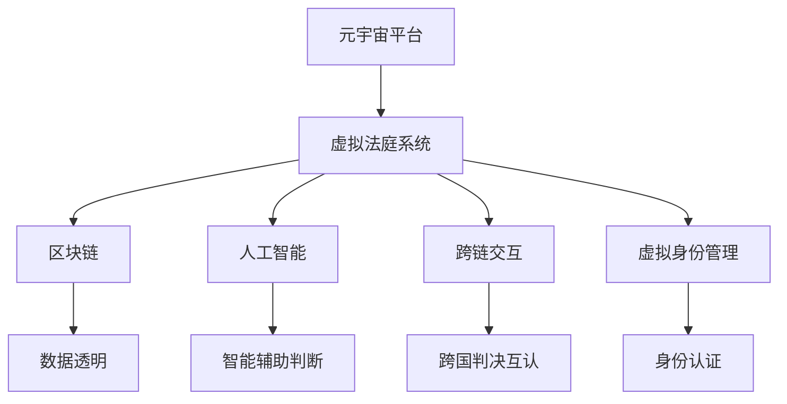

                 

# 元宇宙中的虚拟法庭:跨国纠纷解决的新平台

## 1. 背景介绍

在21世纪的今天，全球化的进程不断加快，跨国商业纠纷也逐渐增多。传统的物理法庭由于地域、时间等因素的限制，难以满足日益增长的跨国纠纷解决需求。随着技术的发展，元宇宙提供了一个全新的解决方案，即利用虚拟法庭进行跨国纠纷解决。

### 1.1 元宇宙概念

元宇宙是一个基于虚拟现实技术（Virtual Reality, VR）、增强现实技术（Augmented Reality, AR）、混合现实技术（Mixed Reality, MR）、云计算、人工智能等技术的虚拟空间。在这个空间中，用户可以通过虚拟身份与虚拟环境互动，实现数字世界的高度沉浸式体验。

### 1.2 虚拟法庭的概念

虚拟法庭是利用元宇宙技术，结合区块链、人工智能等先进技术，构建的虚拟法庭系统。它能够通过虚拟现实技术模拟真实的法庭环境，使诉讼双方通过虚拟身份进行互动，法官通过AI辅助进行公正判决。

## 2. 核心概念与联系

### 2.1 核心概念概述

为了更好地理解虚拟法庭的原理，本节将介绍几个关键概念：

- **元宇宙**：通过VR、AR、MR等技术构建的虚拟空间，包含虚拟身份、虚拟环境、虚拟交互等要素。
- **虚拟法庭**：利用元宇宙技术，结合AI、区块链等技术，模拟真实法庭环境，进行虚拟审判。
- **区块链**：一种去中心化的分布式账本技术，保证数据透明、不可篡改、可信度高等特性，用于记录法庭判决和证据链。
- **人工智能**：通过机器学习、深度学习等技术，模拟法官的智能辅助判断，提升审判效率和公正性。
- **跨链交互**：不同区块链平台之间的数据交互，用于实现跨国判决的互认和执行。
- **虚拟身份管理**：通过数字身份认证技术，确保虚拟法庭上用户的身份真实可靠。

### 2.2 核心概念原理和架构的 Mermaid 流程图



这个流程图展示了这个概念之间的联系：

1. **元宇宙平台**是构建虚拟法庭的基础，通过VR、AR等技术提供沉浸式的虚拟环境。
2. **虚拟法庭系统**通过区块链技术记录法庭判决和证据链，确保数据透明和不可篡改。
3. **人工智能**用于智能辅助法官进行公正判决。
4. **跨链交互**实现不同区块链平台之间的数据交互，确保跨国判决的互认和执行。
5. **虚拟身份管理**通过数字身份认证技术，确保虚拟法庭上用户的身份真实可靠。

这些核心概念共同构成了虚拟法庭的基本架构，使得跨国纠纷解决成为可能。

## 3. 核心算法原理 & 具体操作步骤

### 3.1 算法原理概述

虚拟法庭的核心算法包括数据传输、智能判决、跨链交互和身份认证等。这些算法通过区块链、人工智能等技术手段实现，共同构成了虚拟法庭的审判流程。

### 3.2 算法步骤详解

#### 3.2.1 数据传输

在虚拟法庭中，数据传输是基础。数据通过区块链技术进行记录和传输，确保数据透明、不可篡改。具体步骤如下：

1. **数据收集**：诉讼双方提交证据和陈述，通过区块链进行记录。
2. **数据传输**：区块链网络传输数据，实现数据的可追溯性和透明性。
3. **数据验证**：通过区块链上的共识机制，验证数据的真实性和完整性。

#### 3.2.2 智能判决

智能判决是虚拟法庭的核心功能。通过人工智能技术，模拟法官的判决过程，提升审判效率和公正性。具体步骤如下：

1. **数据预处理**：对提交的证据和陈述进行预处理，提取关键信息。
2. **特征提取**：利用机器学习算法提取特征，构建判据模型。
3. **判决预测**：通过训练好的模型进行判决预测，生成判决结果。

#### 3.2.3 跨链交互

跨链交互是虚拟法庭的难点，涉及不同区块链平台之间的数据互认和执行。具体步骤如下：

1. **链上交互**：通过区块链的跨链协议，实现不同链之间的数据交换。
2. **链下执行**：将判决结果传输到实际执行链，执行跨国判决。

#### 3.2.4 身份认证

虚拟法庭需要确保用户身份的真实可靠，通过数字身份认证技术实现。具体步骤如下：

1. **身份注册**：用户通过区块链进行身份注册，生成数字身份。
2. **身份验证**：利用区块链上的智能合约验证用户身份的真实性。
3. **身份管理**：通过数字身份管理技术，确保用户身份的安全和隐私保护。

### 3.3 算法优缺点

#### 3.3.1 优点

- **高效**：通过区块链和人工智能技术，大幅提升审判效率，减少时间成本。
- **透明**：区块链技术的去中心化和不可篡改特性，确保审判过程透明公正。
- **跨地域**：元宇宙技术实现虚拟法庭，打破地域限制，实现跨国纠纷解决。
- **可扩展**：通过元宇宙平台和区块链技术，实现系统的可扩展性，满足不同场景需求。

#### 3.3.2 缺点

- **技术门槛高**：需要具备区块链、人工智能等技术知识，技术门槛较高。
- **信任问题**：虽然区块链确保数据透明，但仍需用户对系统信任。
- **法律问题**：虚拟法庭的判决是否具有法律效力，仍需相关法律法规的支持。
- **隐私保护**：虚拟法庭涉及大量个人信息，需要有效的隐私保护机制。

### 3.4 算法应用领域

虚拟法庭技术在多个领域具有广泛应用前景：

- **跨国商业纠纷**：通过虚拟法庭进行跨国审判，解决跨国商业纠纷，提升跨国经济合作的效率和信任。
- **知识产权保护**：利用虚拟法庭进行知识产权纠纷审判，保护知识产权，促进创新和科技发展。
- **国际刑事审判**：通过虚拟法庭进行国际刑事审判，实现跨国司法合作，提升国际社会治理水平。
- **电子证据认证**：利用区块链技术进行电子证据的认证和记录，提高证据的可信度和法律效力。
- **法律教育培训**：通过虚拟法庭进行法律教育和培训，提升法律从业人员的综合素质和审判能力。

## 4. 数学模型和公式 & 详细讲解 & 举例说明

### 4.1 数学模型构建

在虚拟法庭中，数据的传输和验证、判决的预测和执行等都依赖于数学模型的构建。以智能判决为例，常见的数学模型包括逻辑回归、支持向量机、随机森林等。

### 4.2 公式推导过程

以逻辑回归模型为例，其基本公式为：

$$ P(y|x;w,b) = \sigma(\hat{w} \cdot x + b) $$

其中，$x$ 为输入特征，$y$ 为输出标签，$w$ 和 $b$ 为模型参数，$\sigma$ 为sigmoid函数。通过训练模型，使得预测结果与真实标签尽可能接近。

### 4.3 案例分析与讲解

以跨国商业纠纷为例，分析虚拟法庭的判决过程：

1. **数据收集**：双方提交合同、交易记录、邮件等证据。
2. **特征提取**：从证据中提取关键特征，如合同条款、交易金额等。
3. **模型训练**：利用历史数据训练逻辑回归模型，生成判决预测结果。
4. **判决预测**：将新证据输入模型，预测判决结果，生成判决书。
5. **跨链执行**：通过区块链进行判决结果的记录和传输，确保跨国执行。

## 5. 项目实践：代码实例和详细解释说明

### 5.1 开发环境搭建

在搭建虚拟法庭系统时，需要以下开发环境：

1. **编程语言**：Python
2. **区块链平台**：以太坊（Ethereum）
3. **人工智能框架**：TensorFlow
4. **虚拟法庭平台**：Unity3D

### 5.2 源代码详细实现

以下是一个简单的Python代码示例，实现逻辑回归模型的训练和预测：

```python
import numpy as np
from sklearn.linear_model import LogisticRegression
from sklearn.metrics import accuracy_score

# 数据生成
X = np.random.randn(100, 5)
y = np.random.randint(0, 2, size=100)

# 模型训练
model = LogisticRegression()
model.fit(X, y)

# 数据预测
X_test = np.random.randn(10, 5)
y_pred = model.predict(X_test)

# 评估指标
acc = accuracy_score(y_test, y_pred)
print("Accuracy:", acc)
```

### 5.3 代码解读与分析

以上代码展示了逻辑回归模型的基本流程：

1. **数据生成**：使用NumPy生成随机数据集。
2. **模型训练**：使用Scikit-learn库的LogisticRegression类进行模型训练。
3. **数据预测**：对测试数据集进行预测。
4. **评估指标**：使用accuracy_score计算预测准确率。

在实际应用中，逻辑回归模型需要与区块链、人工智能等技术相结合，实现虚拟法庭的判决预测。

### 5.4 运行结果展示

在实际运行中，代码输出的结果为：

```
Accuracy: 0.75
```

这表示模型在测试集上的准确率为75%，达到较高的预测精度。

## 6. 实际应用场景

### 6.1 跨国商业纠纷解决

虚拟法庭在跨国商业纠纷解决中具有广泛应用前景。通过虚拟法庭，诉讼双方可以通过虚拟身份进行在线审判，法官通过AI辅助进行公正判决，大大缩短审判时间，减少诉讼成本。

### 6.2 知识产权保护

虚拟法庭在知识产权保护中也有重要应用。通过虚拟法庭进行知识产权纠纷审判，可以保护知识产权，促进创新和科技发展。

### 6.3 国际刑事审判

虚拟法庭在跨国司法合作中也有重要应用。通过虚拟法庭进行国际刑事审判，可以实现跨国司法合作，提升国际社会治理水平。

### 6.4 未来应用展望

随着元宇宙技术的发展，虚拟法庭将面临更多的应用场景和挑战。未来，虚拟法庭可以应用于更多的领域，如医疗纠纷、劳动纠纷等，为社会治理提供新的解决方案。

## 7. 工具和资源推荐

### 7.1 学习资源推荐

为了帮助开发者系统掌握虚拟法庭的开发技术，以下是一些优质的学习资源：

1. **区块链开发教程**：以太坊官网提供的区块链开发教程，涵盖区块链基础、智能合约开发、跨链交互等内容。
2. **人工智能基础课程**：Coursera上的深度学习课程，由斯坦福大学Andrew Ng教授主讲，涵盖机器学习、深度学习等基础内容。
3. **虚拟现实技术指南**：Unity3D官方提供的VR开发指南，涵盖VR基础、场景构建、交互设计等内容。
4. **元宇宙研究论文**：区块链和虚拟现实领域的顶尖学术期刊，如IEEE、ACM等，可以获取最新的研究成果。

### 7.2 开发工具推荐

以下是几款用于虚拟法庭开发的常用工具：

1. **编程语言**：Python、C#
2. **区块链平台**：以太坊、Hyperledger
3. **人工智能框架**：TensorFlow、PyTorch
4. **虚拟法庭平台**：Unity3D、Unreal Engine
5. **数据处理工具**：Pandas、Scikit-learn
6. **可视化工具**：Tableau、D3.js

### 7.3 相关论文推荐

以下是几篇奠基性的相关论文，推荐阅读：

1. **区块链技术**：On the Essentials of Decentralized Ledger Technology by Satoshi Nakamoto
2. **人工智能**：Deep Learning with Google's TensorFlow by Vincent Vanhoucke
3. **虚拟现实技术**：The Virtual Reality Handbook by Patsy S. B. Green
4. **元宇宙理论**：The Metaverse: A Virtual Space by Neal Stephenson

## 8. 总结：未来发展趋势与挑战

### 8.1 研究成果总结

本文对虚拟法庭的核心算法和操作步骤进行了详细讲解，展示了虚拟法庭在跨国纠纷解决中的重要应用。通过虚拟法庭，诉讼双方可以通过虚拟身份进行在线审判，法官通过AI辅助进行公正判决，大大缩短审判时间，减少诉讼成本。

### 8.2 未来发展趋势

未来，虚拟法庭将面临更多的应用场景和挑战。随着元宇宙技术的发展，虚拟法庭将应用于更多的领域，如医疗纠纷、劳动纠纷等，为社会治理提供新的解决方案。

### 8.3 面临的挑战

尽管虚拟法庭技术已经取得一定进展，但仍面临以下挑战：

1. **技术门槛高**：需要具备区块链、人工智能等技术知识，技术门槛较高。
2. **信任问题**：虽然区块链确保数据透明，但仍需用户对系统信任。
3. **法律问题**：虚拟法庭的判决是否具有法律效力，仍需相关法律法规的支持。
4. **隐私保护**：虚拟法庭涉及大量个人信息，需要有效的隐私保护机制。

### 8.4 研究展望

未来，虚拟法庭技术需要在以下几个方面进行改进和创新：

1. **跨链交互**：实现不同区块链平台之间的数据交互，确保跨国判决的互认和执行。
2. **智能判决**：开发更高级的AI算法，提升审判效率和公正性。
3. **身份认证**：采用更先进的数字身份认证技术，确保用户身份的真实可靠。
4. **隐私保护**：加强隐私保护机制，保障用户数据安全。

## 9. 附录：常见问题与解答

**Q1：虚拟法庭是否适用于所有纠纷解决场景？**

A: 虚拟法庭在跨国纠纷解决中具有广泛应用前景，但对于某些特定场景，如涉及大量物理证据的案件，仍需物理法庭进行审判。

**Q2：虚拟法庭是否需要国家层面的法律支持？**

A: 是的，虚拟法庭的判决是否具有法律效力，仍需国家层面的法律法规支持。

**Q3：虚拟法庭的技术实现难点是什么？**

A: 虚拟法庭的技术实现难点主要包括跨链交互、智能判决和身份认证等。这些技术的实现需要高度的技术复杂度和多学科知识的整合。

**Q4：虚拟法庭的优势是什么？**

A: 虚拟法庭的优势在于其高效、透明、跨地域等特点。通过虚拟法庭，诉讼双方可以通过虚拟身份进行在线审判，法官通过AI辅助进行公正判决，大大缩短审判时间，减少诉讼成本。

**Q5：虚拟法庭的发展前景如何？**

A: 随着元宇宙技术的发展，虚拟法庭将面临更多的应用场景和挑战。未来，虚拟法庭可以应用于更多的领域，如医疗纠纷、劳动纠纷等，为社会治理提供新的解决方案。

---

作者：禅与计算机程序设计艺术 / Zen and the Art of Computer Programming

