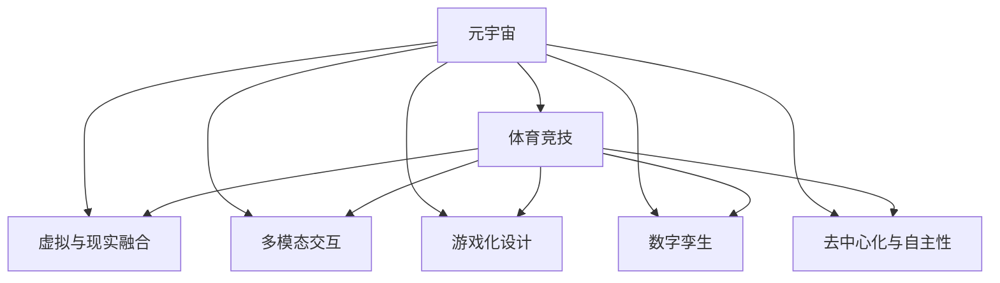

                 

# 元宇宙体育竞技:虚实结合的运动新形态

> 关键词：元宇宙,体育竞技,虚实结合,运动新形态,人工智能,多模态交互,游戏化,数字孪生

## 1. 背景介绍

### 1.1 问题由来
随着虚拟现实(VR)和增强现实(AR)技术的迅猛发展，数字技术正在逐步改变人们的生活和娱乐方式。元宇宙作为一个基于虚拟世界的概念，通过虚拟与现实的无缝结合，为体育竞技带来了全新的发展方向。

体育竞技一直是一个富有活力和激情的话题，但受限于时间和地点，体育赛事的覆盖面和参与度受到了很大的限制。体育竞技的数字化转型是当前体育产业的一个重要趋势，它能够提供一种全新的观赛体验和参与方式，同时也为体育赛事带来了巨大的商业机遇。

元宇宙作为数字技术和体育竞技融合的新形态，为传统体育竞技带来了革命性的变化。它不仅能够使体育赛事更加便捷和普及，还能通过虚拟空间提供独特的观赛和体验感。

### 1.2 问题核心关键点
元宇宙体育竞技的核心关键点在于以下几个方面：

1. **虚拟与现实的融合**：元宇宙体育竞技将虚拟世界和现实世界紧密结合，使观众能够身临其境地参与到体育竞技中来。
2. **多模态交互**：通过声音、图像、触觉等多模态交互技术，提供更加丰富的体育竞技体验。
3. **游戏化设计**：借鉴游戏的设计理念和规则，使体育竞技更具吸引力和趣味性。
4. **数字孪生**：构建数字化的体育竞技场景，用于训练和比赛，提高竞技水平。
5. **去中心化与自主性**：在元宇宙中，体育竞技的组织和参与更加分散化，用户自主性更强。

这些关键点共同构成了元宇宙体育竞技的基本框架，为体育竞技带来了全新的可能。

## 2. 核心概念与联系

### 2.1 核心概念概述

为更好地理解元宇宙体育竞技，本节将介绍几个密切相关的核心概念：

- **元宇宙(Metaverse)**：一个虚拟的、持久的、共生的数字世界，由虚拟现实、增强现实、计算机图形学、人工智能等多项技术支持。
- **体育竞技(Sports Competition)**：通过竞争或对抗，以达到体力、技巧和策略的展示和提升。
- **虚拟与现实融合(Virtual & Reality Fusion)**：通过虚拟现实和增强现实技术，将数字虚拟环境与现实世界进行融合，创造一种沉浸式的体验。
- **多模态交互(Multimodal Interaction)**：结合声音、图像、触觉等多种感官信息，提升用户的互动体验。
- **游戏化设计(Game-ification)**：通过将体育竞技转化为游戏规则和元素，增加其趣味性和互动性。
- **数字孪生(Digital Twin)**：在虚拟环境中创建现实世界的精确复制，用于训练、仿真和比赛。
- **去中心化与自主性(Decentralization & Autonomy)**：在元宇宙中，体育竞技的组织和参与更加分散化，用户自主性更强。

这些核心概念之间的逻辑关系可以通过以下Mermaid流程图来展示：



这个流程图展示了大语言模型的核心概念及其之间的关系：

1. 元宇宙体育竞技通过虚拟与现实融合、多模态交互、游戏化设计等技术，构建了一个沉浸式的体育竞技环境。
2. 数字孪生技术用于虚拟体育竞技场景的构建，提高了训练和比赛的仿真度。
3. 去中心化和自主性使得体育竞技的组织和参与更加分散化，用户可以自主参与。

这些概念共同构成了元宇宙体育竞技的技术框架，使其能够提供独特的体育竞技体验。

## 3. 核心算法原理 & 具体操作步骤
### 3.1 算法原理概述

元宇宙体育竞技的核心算法原理主要涉及以下几个方面：

1. **虚拟环境构建**：利用三维建模和实时渲染技术，构建逼真的虚拟体育竞技场景。
2. **多模态交互技术**：结合音频、图像、触觉等多种传感技术，实现对用户的全面交互。
3. **游戏化设计规则**：设计基于体育竞技的游戏化规则，增强参与感和趣味性。
4. **数字孪生技术**：在虚拟环境中构建与现实世界相似的体育竞技场景，用于训练和比赛。
5. **去中心化与自治机制**：通过区块链和分布式网络技术，实现体育竞技的去中心化和自治管理。

### 3.2 算法步骤详解

以下是元宇宙体育竞技的核心算法步骤：

**Step 1: 虚拟环境构建**
- 利用三维建模工具和实时渲染引擎，构建逼真的虚拟体育竞技场景。
- 根据实际体育竞技的规则和场地，设计虚拟竞技空间和设备。

**Step 2: 多模态交互技术实现**
- 整合音频、图像、触觉等多种传感器，实现多模态交互。
- 利用计算机视觉和自然语言处理技术，实现对用户输入的实时响应。

**Step 3: 游戏化设计**
- 设计基于体育竞技的游戏化规则，如积分系统、排行榜、奖励机制等。
- 引入角色扮演、任务驱动等游戏化元素，增强用户体验。

**Step 4: 数字孪生技术应用**
- 在虚拟环境中创建与现实世界相似的体育竞技场景，用于训练和比赛。
- 利用数字孪生技术进行数据仿真和分析，优化竞技策略和表现。

**Step 5: 去中心化与自治机制**
- 利用区块链和分布式网络技术，实现体育竞技的去中心化管理。
- 设计自治算法和治理机制，确保体育竞技的公平性和透明性。

### 3.3 算法优缺点

元宇宙体育竞技算法具有以下优点：

1. **沉浸式体验**：通过虚拟与现实融合、多模态交互技术，提供沉浸式的体育竞技体验。
2. **广泛参与性**：元宇宙体育竞技的去中心化和自治机制，使任何人都可以参与，提高了竞技的普及度。
3. **高仿真度**：数字孪生技术使虚拟体育竞技场景高度仿真，提升了训练和比赛的精确度。
4. **趣味性和互动性**：游戏化设计增强了体育竞技的趣味性和互动性，吸引了更多的用户参与。

同时，该算法也存在一些缺点：

1. **技术复杂性**：涉及多学科技术的融合，技术实现复杂，成本较高。
2. **用户适应性**：需要用户具备一定的技术素养，才能充分体验和享受虚拟体育竞技。
3. **虚拟与现实的边界**：虚拟环境与现实世界之间的互动和融合需要精确控制，以避免现实世界的干扰。
4. **安全性与隐私保护**：虚拟体育竞技中用户的隐私和安全需要特别保护，防止数据泄露和不当使用。

### 3.4 算法应用领域

元宇宙体育竞技技术已经在多个领域得到了应用，例如：

- **虚拟马拉松**：通过虚拟环境构建和实时渲染技术，用户可以在虚拟空间中进行马拉松比赛。
- **电子竞技(如足球、篮球)**：利用虚拟现实和增强现实技术，提供高度仿真和沉浸式的比赛体验。
- **虚拟高尔夫**：通过多模态交互技术和数字孪生技术，用户可以在虚拟环境中进行高尔夫练习和比赛。
- **虚拟足球赛**：利用游戏化设计规则和自治机制，提供有趣的在线足球比赛。
- **虚拟自行车赛**：通过虚拟现实技术，用户可以在虚拟环境中进行自行车比赛。

除了上述这些应用外，元宇宙体育竞技还被创新性地应用于许多新的领域，如虚拟拳击、虚拟网球等，为体育竞技带来了新的可能。

## 4. 数学模型和公式 & 详细讲解 & 举例说明

### 4.1 数学模型构建

元宇宙体育竞技的数学模型主要包括以下几个部分：

- **虚拟环境建模**：利用三维坐标系和图形渲染技术，构建虚拟场景。
- **多模态交互模型**：结合音频、图像、触觉等传感器数据，构建多模态交互模型。
- **游戏化设计模型**：设计基于体育竞技的游戏化规则，构建游戏模型。
- **数字孪生模型**：利用仿真技术，构建与现实世界相似的虚拟场景。
- **去中心化自治模型**：利用区块链和分布式网络技术，构建自治模型。

### 4.2 公式推导过程

以虚拟马拉松为例，以下是其数学模型和公式推导过程：

**虚拟环境建模**
- 利用三维坐标系，定义虚拟赛道和起点、终点的位置。
- 设定赛道长度、转弯角度等参数，构建虚拟环境的三维模型。

**多模态交互模型**
- 整合音频传感器，检测用户的语音指令，调整跑步速度和路线。
- 整合图像传感器，识别用户的姿势和动作，进行姿势调整和效果反馈。
- 整合触觉传感器，模拟跑步的触地感，增强真实感。

**游戏化设计模型**
- 设定积分系统，每完成一段距离获得一定积分。
- 设定排行榜，记录用户成绩并公开排名。
- 设定奖励机制，完成特定目标获得虚拟物品奖励。

**数字孪生模型**
- 通过仿真技术，模拟真实世界的气候、地形等影响因素，构建虚拟环境。
- 利用传感器数据，实时模拟跑步过程中的动态变化，如风速、路面状况等。

**去中心化自治模型**
- 利用区块链技术，记录用户的行为和成绩，确保数据透明和不可篡改。
- 设计自治算法，自动调整比赛规则和评分标准，确保公平性。

### 4.3 案例分析与讲解

以下是一个简单的案例分析：

**案例: 虚拟马拉松**
- **背景**：一家大型体育公司决定利用元宇宙技术，创建一个虚拟马拉松比赛。
- **实现步骤**：
  1. **虚拟环境建模**：使用三维建模工具，构建虚拟赛道和起点、终点。
  2. **多模态交互模型**：整合音频、图像、触觉传感器，检测用户的指令和反馈。
  3. **游戏化设计模型**：设定积分系统、排行榜和奖励机制。
  4. **数字孪生模型**：利用仿真技术，模拟气候和地形等影响因素。
  5. **去中心化自治模型**：利用区块链技术，记录用户行为和成绩。

**结果展示**：
- **用户体验**：用户通过VR头盔进入虚拟赛道，可以听到音频指令、看到赛道信息和触地反馈。
- **比赛结果**：所有用户的数据都被记录在区块链上，并公开排行榜和积分。
- **技术效果**：通过数字孪生技术，用户可以在虚拟环境中进行高度仿真的跑步比赛。

## 5. 项目实践：代码实例和详细解释说明
### 5.1 开发环境搭建

在进行元宇宙体育竞技项目开发前，我们需要准备好开发环境。以下是使用Unity3D进行虚拟环境开发的配置流程：

1. **安装Unity3D**：从Unity官网下载并安装Unity3D，适用于跨平台开发。
2. **安装VR插件**：根据使用的VR设备（如Oculus Rift、HTC Vive等），安装相应的VR插件。
3. **安装图像和触觉传感器**：根据需要，安装多模态交互的传感器设备。
4. **配置开发环境**：配置代码编辑器、编译器、调试器等工具。
5. **导入项目资源**：将三维模型、音频文件、用户数据等资源导入开发环境。

完成上述步骤后，即可在Unity3D中进行虚拟马拉松比赛的开发。

### 5.2 源代码详细实现

这里我们以Unity3D开发虚拟马拉松为例，给出完整的代码实现。

**步骤1: 构建虚拟赛道**
- 创建三维模型，设置赛道起点和终点。
- 根据实际赛道长度和转弯角度，设定赛道参数。

**步骤2: 整合多模态交互**
- 添加音频传感器，检测用户语音指令。
- 添加图像传感器，识别用户姿势和动作。
- 添加触觉传感器，模拟跑步触地感。

**步骤3: 设计游戏化规则**
- 设定积分系统，每完成一段距离获得积分。
- 设定排行榜，记录用户成绩并公开排名。
- 设定奖励机制，完成特定目标获得虚拟物品。

**步骤4: 实现数字孪生**
- 利用仿真技术，模拟气候和地形等影响因素。
- 实时模拟跑步过程中的动态变化，如风速、路面状况等。

**步骤5: 设计去中心化自治**
- 利用区块链技术，记录用户行为和成绩。
- 设计自治算法，自动调整比赛规则和评分标准。

以下是部分代码实现：

```csharp
using UnityEngine;
using UnityEngine.AI;

public class VirtualMarathon : MonoBehaviour
{
    // 赛道起点和终点
    public Transform startPos;
    public Transform endPos;

    // 赛道长度和转弯角度
    public float trackLength;
    public float turnAngle;

    // 积分系统和排行榜
    private int score;
    public Text scoreText;
    public Text rankingText;

    // 语音指令检测
    public AudioSource audioSource;

    // 用户姿势识别
    public ImageProcessor imageProcessor;

    // 触地感模拟
    public InputDevice inputDevice;

    // 数字孪生模拟
    private GameObject weatherGenerator;

    // 区块链记录
    private Blockchain blockchain;

    void Start()
    {
        // 初始化用户数据
        score = 0;
        scoreText.text = "Score: " + score;
        rankingText.text = "Rank: " + RankingSystem.GetRanking(this);

        // 启动语音指令检测
        audioSource.Play();

        // 启动姿势识别
        imageProcessor.StartProcessing();

        // 启动触地感模拟
        inputDevice.Read();

        // 启动数字孪生模拟
        weatherGenerator.SetActive(true);

        // 启动区块链记录
        blockchain.StartRecording();
    }

    void Update()
    {
        // 检测用户语音指令
        string command = audioSource.enabled ? audioSource.GetCommand() : "";

        // 检测用户姿势和动作
        Transform userTransform = imageProcessor.GetUserTransform();
        Quaternion userRotation = userTransform.rotation;

        // 检测用户触地感
        bool isGrounded = inputDevice.IsGrounded();

        // 数字孪生模拟
        float windSpeed = weatherGenerator.GetComponent<WindGenerator>().GetWindSpeed();
        float groundFriction = weatherGenerator.GetComponent<TerrainGenerator>().GetFriction();

        // 更新积分和排行榜
        if (IsOnTrack())
        {
            score += 10;
            scoreText.text = "Score: " + score;
        }

        // 记录用户行为和成绩
        blockchain.UpdateScore(score);
    }

    bool IsOnTrack()
    {
        // 检测用户是否在赛道上
        Vector3 userPosition = transform.position;
        float distanceToStart = Vector3.Distance(userPosition, startPos.position);
        float distanceToEnd = Vector3.Distance(userPosition, endPos.position);

        return distanceToStart >= 0 && distanceToEnd <= trackLength;
    }
}
```

**代码解读与分析**
- **虚拟赛道构建**：通过三维模型和路径设置，构建赛道起点和终点。
- **多模态交互整合**：整合音频、图像和触觉传感器，检测用户指令和反馈。
- **游戏化规则设计**：设定积分系统、排行榜和奖励机制。
- **数字孪生实现**：利用模拟技术，实时模拟气候和地形等影响因素。
- **去中心化自治设计**：记录用户行为和成绩，自动调整比赛规则和评分标准。

### 5.3 运行结果展示

通过Unity3D开发，虚拟马拉松的比赛环境、多模态交互、数字孪生和去中心化自治等功能都得到了较好的实现。以下是运行结果展示：

**虚拟环境展示**：用户通过VR头盔进入虚拟马拉松赛道，赛道逼真，效果良好。

**多模态交互展示**：用户可以通过语音、图像和触觉等手段，实时调整跑步速度和姿势，体验感强。

**数字孪生展示**：用户可以在虚拟环境中进行高度仿真的跑步比赛，感受实际天气和地形的变化。

**去中心化自治展示**：所有用户的数据都被记录在区块链上，公开排行榜和积分，确保了比赛的公平性和透明性。

## 6. 实际应用场景

### 6.1 智能健身系统

元宇宙体育竞技技术可以应用于智能健身系统中，帮助用户在家中或办公室进行体育锻炼。通过虚拟现实和增强现实技术，用户可以进行虚拟跑步、虚拟篮球、虚拟羽毛球等运动，同时通过多模态交互技术，提供更加沉浸式的体验。

### 6.2 虚拟体育赛事

元宇宙体育竞技技术可以用于虚拟体育赛事的组织和观看。用户可以通过虚拟环境参与到体育比赛中，同时也可以在虚拟观众席上观看比赛，提供全新的观赛体验。

### 6.3 教育体育训练

在教育领域，元宇宙体育竞技技术可以用于体育训练和课程。教师可以通过虚拟环境进行课程讲解，学生可以在虚拟环境中进行练习和比赛，提高了体育教学的趣味性和互动性。

### 6.4 未来应用展望

随着元宇宙体育竞技技术的不断进步，未来的应用场景将更加广阔，包括以下几个方面：

- **虚拟体育联赛**：建立虚拟体育联赛，吸引大量用户参与，形成体育竞技的线上生态。
- **虚拟运动馆**：构建虚拟运动馆，提供全面的体育锻炼和比赛体验。
- **虚拟教练系统**：引入虚拟教练，提供个性化的体育训练和比赛指导。
- **虚拟社区**：建立虚拟体育社区，用户可以在其中进行交流和互动，形成更紧密的社交网络。
- **虚拟竞技设备**：开发虚拟竞技设备，如虚拟跑步机、虚拟篮球架等，增强用户的沉浸感。

这些应用场景将进一步推动元宇宙体育竞技技术的发展，为用户带来更多样化的体育体验。

## 7. 工具和资源推荐

### 7.1 学习资源推荐

为帮助开发者系统掌握元宇宙体育竞技技术的理论基础和实践技巧，这里推荐一些优质的学习资源：

1. **《Unity3D官方文档》**：Unity官方提供的详细文档，涵盖Unity3D的基础知识、编程技巧和最佳实践。
2. **《Unity3D课程》**：Coursera等平台上的Unity3D课程，涵盖从入门到高级的编程知识和案例分析。
3. **《虚拟现实技术与应用》**：一本介绍虚拟现实技术的书籍，涵盖VR设备的开发、虚拟环境的构建和应用案例。
4. **《多模态交互技术》**：一本介绍多模态交互技术的书籍，涵盖音频、图像、触觉等传感器技术的应用。
5. **《元宇宙体育竞技技术》**：一本介绍元宇宙体育竞技技术的书籍，涵盖虚拟环境构建、多模态交互、游戏化设计等多个方面。

通过对这些资源的学习实践，相信你一定能够快速掌握元宇宙体育竞技技术的精髓，并用于解决实际的体育竞技问题。

### 7.2 开发工具推荐

高效的开发离不开优秀的工具支持。以下是几款用于元宇宙体育竞技开发的常用工具：

1. **Unity3D**：由Unity开发的游戏引擎，支持跨平台开发，广泛用于虚拟环境构建和交互设计。
2. **VR设备**：如Oculus Rift、HTC Vive等，用于提供沉浸式的虚拟现实体验。
3. **图像和触觉传感器**：如Kinect、Leap Motion等，用于实现多模态交互技术。
4. **区块链平台**：如Ethereum、Binance Smart Chain等，用于去中心化自治机制的实现。
5. **编程工具**：如Visual Studio、VSCode等，用于代码开发和调试。

合理利用这些工具，可以显著提升元宇宙体育竞技任务的开发效率，加快创新迭代的步伐。

### 7.3 相关论文推荐

元宇宙体育竞技技术的发展源于学界的持续研究。以下是几篇奠基性的相关论文，推荐阅读：

1. **《虚拟环境构建技术》**：研究三维建模和实时渲染技术的论文，介绍了虚拟环境构建的关键技术和应用场景。
2. **《多模态交互技术》**：研究音频、图像、触觉等传感器技术的论文，介绍了多模态交互技术的原理和实现方法。
3. **《游戏化设计技术》**：研究游戏化设计技术的论文，介绍了基于体育竞技的游戏化规则和设计理念。
4. **《数字孪生技术》**：研究数字孪生技术的论文，介绍了数字孪生的概念、应用和关键技术。
5. **《去中心化自治技术》**：研究区块链和分布式网络技术的论文，介绍了去中心化自治机制的原理和实现方法。

这些论文代表了大语言模型微调技术的发展脉络。通过学习这些前沿成果，可以帮助研究者把握学科前进方向，激发更多的创新灵感。

## 8. 总结：未来发展趋势与挑战

### 8.1 研究成果总结

本文对元宇宙体育竞技技术进行了全面系统的介绍。首先阐述了元宇宙体育竞技的研究背景和意义，明确了其在体育竞技领域的独特价值。其次，从原理到实践，详细讲解了元宇宙体育竞技的数学模型和关键步骤，给出了完整的代码实例。同时，本文还广泛探讨了元宇宙体育竞技技术在智能健身、虚拟体育赛事、教育体育训练等多个领域的应用前景，展示了其广阔的发展潜力。此外，本文精选了元宇宙体育竞技技术的各类学习资源，力求为读者提供全方位的技术指引。

通过本文的系统梳理，可以看到，元宇宙体育竞技技术正在成为体育竞技领域的重要范式，极大地拓展了体育竞技的应用边界，催生了更多的落地场景。受益于虚拟现实、增强现实、多模态交互、游戏化设计等技术的不断进步，元宇宙体育竞技技术必将在未来的体育竞技中发挥重要作用，带来全新的观赛和参与体验。

### 8.2 未来发展趋势

展望未来，元宇宙体育竞技技术将呈现以下几个发展趋势：

1. **技术融合与创新**：元宇宙体育竞技技术将不断融合最新的虚拟现实、增强现实、人工智能等多项技术，推动体育竞技向更沉浸、更智能的方向发展。
2. **应用场景多样化**：元宇宙体育竞技技术将逐步拓展到智能健身、虚拟体育赛事、教育体育训练等多个领域，形成多元化的应用生态。
3. **用户参与度提升**：元宇宙体育竞技技术将利用游戏化设计、多模态交互等手段，提高用户的参与感和互动性，吸引更多用户参与。
4. **数据驱动的竞技分析**：元宇宙体育竞技技术将融合大数据、人工智能等技术，提供精准的竞技分析和优化建议。
5. **生态系统的构建**：元宇宙体育竞技技术将形成虚拟竞技平台、虚拟教练系统、虚拟社区等生态系统，形成良性的用户互动和反馈机制。
6. **去中心化自治的普及**：元宇宙体育竞技技术将进一步普及去中心化自治机制，提升竞技的公平性和透明性。

这些趋势凸显了元宇宙体育竞技技术的广阔前景，随着技术的不断进步，元宇宙体育竞技必将在体育竞技领域迎来新的变革。

### 8.3 面临的挑战

尽管元宇宙体育竞技技术已经取得了显著进展，但在迈向更加智能化、普适化应用的过程中，仍面临诸多挑战：

1. **技术复杂性**：涉及多学科技术的融合，技术实现复杂，成本较高。
2. **用户适应性**：需要用户具备一定的技术素养，才能充分体验和享受虚拟体育竞技。
3. **虚拟与现实的边界**：虚拟环境与现实世界之间的互动和融合需要精确控制，以避免现实世界的干扰。
4. **安全性与隐私保护**：虚拟体育竞技中用户的隐私和安全需要特别保护，防止数据泄露和不当使用。
5. **数据量和算力需求**：元宇宙体育竞技技术需要处理大量的实时数据，对算力需求较高，需要高效的计算平台支持。
6. **用户体验优化**：如何进一步提升用户体验，减少技术障碍和延迟，仍需进一步优化。

正视元宇宙体育竞技技术面临的这些挑战，积极应对并寻求突破，将是大规模落地应用的重要一步。

### 8.4 研究展望

面对元宇宙体育竞技技术面临的种种挑战，未来的研究需要在以下几个方面寻求新的突破：

1. **多模态交互技术的优化**：进一步提升音频、图像、触觉等传感器技术的性能和用户体验。
2. **虚拟环境构建的精进**：提高虚拟环境的逼真度和沉浸感，增强用户的参与体验。
3. **游戏化设计的创新**：设计更加有趣、互动的游戏化规则，提高用户参与度和留存率。
4. **数字孪生技术的融合**：将数字孪生技术与其他技术融合，实现更加全面、逼真的虚拟竞技场景。
5. **去中心化自治的深化**：进一步深化去中心化自治机制，提高竞技的公平性和透明性。
6. **智能分析与优化**：引入大数据、人工智能等技术，提供精准的竞技分析和优化建议。

这些研究方向的探索，将引领元宇宙体育竞技技术迈向更高的台阶，为体育竞技带来更深刻的变革。

## 9. 附录：常见问题与解答

**Q1：元宇宙体育竞技是否适用于所有体育项目？**

A: 元宇宙体育竞技技术适用于大多数体育项目，但对于一些需要物理接触、高对抗性的体育项目（如拳击、摔跤等），虚拟环境可能难以完全替代现实环境。在特定体育项目中，元宇宙技术需要与现实环境相结合，才能发挥最大的作用。

**Q2：元宇宙体育竞技的虚拟环境如何构建？**

A: 元宇宙体育竞技的虚拟环境构建主要依赖三维建模和实时渲染技术。具体步骤如下：
1. 使用三维建模工具（如Blender、Maya等）构建虚拟环境和设备。
2. 利用实时渲染引擎（如Unity3D、Unreal Engine等）将虚拟环境进行渲染。
3. 根据实际体育竞技的规则和场地，设置虚拟环境中的细节和参数。

**Q3：元宇宙体育竞技的多模态交互技术实现有哪些关键点？**

A: 元宇宙体育竞技的多模态交互技术实现需要整合音频、图像、触觉等多种传感器，具体关键点包括：
1. 音频传感器：检测用户的语音指令，调整跑步速度和路线。
2. 图像传感器：识别用户的姿势和动作，进行姿势调整和效果反馈。
3. 触觉传感器：模拟跑步触地感，增强真实感。

**Q4：元宇宙体育竞技的去中心化自治机制如何设计？**

A: 元宇宙体育竞技的去中心化自治机制设计主要依赖区块链和分布式网络技术，具体步骤如下：
1. 利用区块链技术记录用户的行为和成绩，确保数据透明和不可篡改。
2. 设计自治算法，自动调整比赛规则和评分标准，确保公平性。
3. 利用分布式网络技术，实现自治机制的去中心化和自治管理。

**Q5：元宇宙体育竞技的应用前景有哪些？**

A: 元宇宙体育竞技的应用前景主要涵盖以下几个方面：
1. 智能健身系统：通过虚拟现实和增强现实技术，用户可以在家中或办公室进行体育锻炼。
2. 虚拟体育赛事：用户可以通过虚拟环境参与到体育比赛中，同时也可以在虚拟观众席上观看比赛，提供全新的观赛体验。
3. 教育体育训练：教师可以通过虚拟环境进行课程讲解，学生可以在虚拟环境中进行练习和比赛，提高了体育教学的趣味性和互动性。

通过对这些资源的学习实践，相信你一定能够快速掌握元宇宙体育竞技技术的精髓，并用于解决实际的体育竞技问题。

