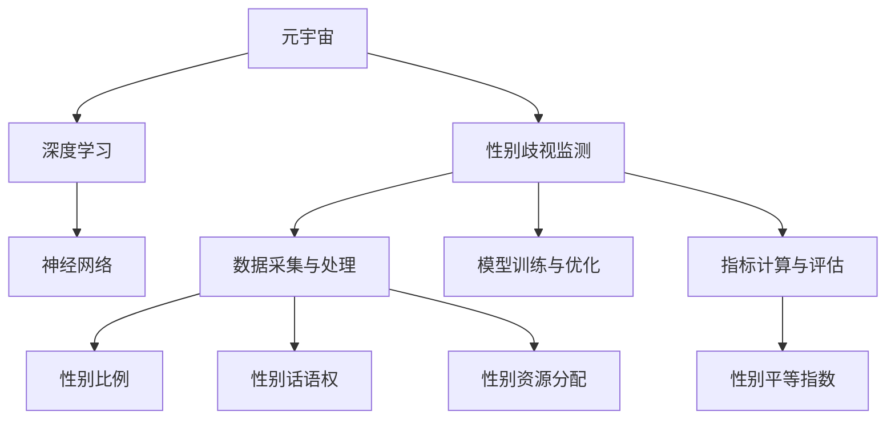

                 

# 元宇宙性别平等指数:虚拟世界中的性别歧视监测

> 关键词：元宇宙,性别平等,虚拟世界,性别歧视监测,数据驱动,人工智能,深度学习,神经网络

## 1. 背景介绍

### 1.1 问题由来
随着科技的飞速发展，元宇宙作为数字世界的最高形态，正逐渐成为我们未来生活的重要组成部分。然而，在这个虚拟空间中，性别歧视的现象同样存在，严重影响了元宇宙的健康发展。如何构建一个平等、包容、公平的元宇宙环境，成为了当前亟待解决的重要问题。

### 1.2 问题核心关键点
元宇宙性别平等指数的构建，旨在通过数据驱动的方法，系统地监测虚拟世界中的性别歧视现象，并提出针对性的改进措施。该指数的构建需要综合考虑以下关键点：

1. **数据采集与处理**：收集元宇宙中的文本、语音、视频等数据，并提取性别相关信息。
2. **模型训练与优化**：基于性别歧视监测的深度学习模型，进行训练与优化。
3. **指标计算与评估**：定义并计算性别平等指数，对元宇宙中的性别歧视进行量化评估。
4. **政策建议与实施**：根据性别平等指数的评估结果，提出相关政策建议，并推动实施。

### 1.3 问题研究意义
构建元宇宙性别平等指数，对于促进元宇宙的公平发展、提升用户满意度、推动性别平等具有重要意义：

1. **促进公平发展**：通过系统监测性别歧视，为元宇宙制定更加公平、包容的规则和政策，推动性别平等。
2. **提升用户满意度**：构建一个无性别歧视的元宇宙环境，提高用户体验，提升用户满意度。
3. **推动性别平等**：基于性别平等指数，提出针对性的改进措施，推动现实世界和虚拟世界中的性别平等。

## 2. 核心概念与联系

### 2.1 核心概念概述

为更好地理解元宇宙性别平等指数的构建，本节将介绍几个密切相关的核心概念：

- **元宇宙**：通过虚拟现实、增强现实等技术构建的数字世界，涵盖游戏、社交、教育等多个领域。
- **性别歧视**：基于性别差异对个体或群体进行不公平对待，包括但不限于言语攻击、职业限制、资源分配不公等。
- **深度学习**：一种基于神经网络的机器学习技术，擅长处理复杂的数据结构和模式识别问题。
- **神经网络**：深度学习的核心组件，通过多层非线性变换，实现对数据的自动特征提取和分类。
- **性别平等指数**：用于量化评估元宇宙中性别歧视程度的指标体系，包括性别比例、性别话语权、性别资源分配等多个维度。

这些核心概念之间的逻辑关系可以通过以下Mermaid流程图来展示：



这个流程图展示了大语言模型的核心概念及其之间的关系：

1. 元宇宙通过数据采集与处理，为性别歧视监测提供数据基础。
2. 深度学习和神经网络是性别歧视监测的核心技术手段。
3. 性别比例、性别话语权、性别资源分配等指标，用于量化性别歧视程度。
4. 性别平等指数是性别歧视监测的最终输出结果。

## 3. 核心算法原理 & 具体操作步骤
### 3.1 算法原理概述

元宇宙性别平等指数的构建，本质上是一个基于深度学习的分类与评估问题。其核心思想是：通过构建性别歧视监测模型，对元宇宙中的文本、语音、视频等数据进行自动特征提取和分类，量化评估性别歧视程度。

形式化地，假设性别歧视监测模型为 $M_{\theta}$，其中 $\theta$ 为模型参数。给定元宇宙中的文本、语音、视频等数据集 $D=\{(x_i, y_i)\}_{i=1}^N$，其中 $x_i$ 为输入数据，$y_i \in \{0,1\}$ 为性别歧视标签（0表示无性别歧视，1表示存在性别歧视），则性别平等指数计算公式为：

$$
EPI = \frac{1}{N}\sum_{i=1}^N \frac{y_i}{1-y_i}
$$

该公式表示在 $N$ 个样本中，存在性别歧视的样本所占的比例。基于此，我们可以定义多个性别平等指数，如性别比例指数、性别话语权指数等。

### 3.2 算法步骤详解

元宇宙性别平等指数的构建，一般包括以下几个关键步骤：

**Step 1: 数据采集与预处理**
- 通过爬虫、API接口等方式，从元宇宙平台中采集文本、语音、视频等数据。
- 对采集到的数据进行清洗、去重、标准化等预处理操作，保证数据质量。

**Step 2: 特征提取**
- 使用深度学习模型对预处理后的数据进行自动特征提取。常用的特征提取方法包括卷积神经网络(CNN)、循环神经网络(RNN)、Transformer等。
- 特征提取的结果作为模型的输入，用于训练性别歧视监测模型。

**Step 3: 模型训练与优化**
- 使用标注数据对性别歧视监测模型进行训练。常用的训练算法包括随机梯度下降(SGD)、Adam、Adagrad等。
- 通过交叉验证、学习率调整等手段，优化模型参数，提高模型的泛化能力。

**Step 4: 模型评估与指标计算**
- 在测试集上对训练好的模型进行评估，计算性别平等指数。常用的评估指标包括准确率、召回率、F1-score等。
- 根据性别平等指数的评估结果，分析性别歧视的分布情况，提出改进措施。

**Step 5: 政策建议与实施**
- 基于性别平等指数的评估结果，制定针对性的政策建议。
- 推动政策建议的实施，监测改进效果，持续优化性别平等指数。

### 3.3 算法优缺点

基于深度学习的性别歧视监测方法，具有以下优点：

1. 自动特征提取。深度学习模型能够自动从数据中提取特征，无需手工设计特征，提高了模型的灵活性和鲁棒性。
2. 高准确率。深度学习模型在处理复杂数据结构时具有较高的准确率，适用于多维度、非线性的数据类型。
3. 可扩展性强。深度学习模型可以通过增加模型深度和宽度，进一步提升模型的性能。

同时，该方法也存在一定的局限性：

1. 数据依赖性强。性别歧视监测模型的效果很大程度上取决于数据的质量和数量，需要大量的标注数据。
2. 模型复杂度高。深度学习模型通常包含大量参数，需要高性能计算资源进行训练和推理。
3. 解释性差。深度学习模型是一个"黑盒"系统，难以解释其内部工作机制和决策逻辑。
4. 鲁棒性不足。性别歧视监测模型可能对噪声数据敏感，泛化性能有待提高。

尽管存在这些局限性，但就目前而言，基于深度学习的性别歧视监测方法仍是目前最为有效的解决方案之一。未来相关研究的重点在于如何进一步降低对标注数据的依赖，提高模型的解释性和鲁棒性。

### 3.4 算法应用领域

基于深度学习的性别歧视监测方法，在元宇宙中具有广泛的应用前景：

- **虚拟游戏**：在虚拟游戏中，通过监测玩家言行，识别和防止性别歧视行为，提升玩家体验。
- **虚拟社区**：在虚拟社区中，通过监测对话内容，识别和防止性别歧视言论，构建和谐社区环境。
- **虚拟教育**：在虚拟教育平台中，通过监测教师和学生的互动，识别和防止性别歧视行为，提升教育质量。
- **虚拟商业**：在虚拟商业环境中，通过监测用户评价和反馈，识别和防止性别歧视现象，提升用户体验。

## 4. 数学模型和公式 & 详细讲解  
### 4.1 数学模型构建

本节将使用数学语言对性别歧视监测模型的构建进行更加严格的刻画。

假设性别歧视监测模型为 $M_{\theta}$，其中 $\theta$ 为模型参数。给定元宇宙中的文本、语音、视频等数据集 $D=\{(x_i, y_i)\}_{i=1}^N$，其中 $x_i$ 为输入数据，$y_i \in \{0,1\}$ 为性别歧视标签（0表示无性别歧视，1表示存在性别歧视）。

定义模型 $M_{\theta}$ 在输入 $x$ 上的输出为 $\hat{y}=M_{\theta}(x)$，表示模型预测的性别歧视概率。则性别平等指数计算公式为：

$$
EPI = \frac{1}{N}\sum_{i=1}^N \frac{y_i}{1-y_i}
$$

其中 $y_i$ 为真实标签，$\hat{y}_i$ 为模型预测结果。该公式表示在 $N$ 个样本中，存在性别歧视的样本所占的比例。

### 4.2 公式推导过程

以下我们以二分类任务为例，推导交叉熵损失函数及其梯度的计算公式。

假设模型 $M_{\theta}$ 在输入 $x$ 上的输出为 $\hat{y}=M_{\theta}(x)$，表示样本属于性别歧视的概率。真实标签 $y \in \{0,1\}$。则二分类交叉熵损失函数定义为：

$$
\ell(M_{\theta}(x),y) = -[y\log \hat{y} + (1-y)\log (1-\hat{y})]
$$

将其代入性别平等指数公式，得：

$$
EPI = \frac{1}{N}\sum_{i=1}^N [y_i\log \hat{y}_i + (1-y_i)\log(1-\hat{y}_i)]
$$

根据链式法则，损失函数对参数 $\theta_k$ 的梯度为：

$$
\frac{\partial \ell(M_{\theta}(x),y)}{\partial \theta_k} = -\frac{y_i}{\hat{y}_i} + \frac{1-y_i}{1-\hat{y}_i}
$$

其中 $\frac{\partial M_{\theta}(x)}{\partial \theta_k}$ 可进一步递归展开，利用自动微分技术完成计算。

在得到损失函数的梯度后，即可带入参数更新公式，完成模型的迭代优化。重复上述过程直至收敛，最终得到适应元宇宙中的性别歧视监测模型。

## 5. 项目实践：代码实例和详细解释说明
### 5.1 开发环境搭建

在进行性别歧视监测模型的实践前，我们需要准备好开发环境。以下是使用Python进行PyTorch开发的环境配置流程：

1. 安装Anaconda：从官网下载并安装Anaconda，用于创建独立的Python环境。

2. 创建并激活虚拟环境：
```bash
conda create -n pytorch-env python=3.8 
conda activate pytorch-env
```

3. 安装PyTorch：根据CUDA版本，从官网获取对应的安装命令。例如：
```bash
conda install pytorch torchvision torchaudio cudatoolkit=11.1 -c pytorch -c conda-forge
```

4. 安装Transformers库：
```bash
pip install transformers
```

5. 安装各类工具包：
```bash
pip install numpy pandas scikit-learn matplotlib tqdm jupyter notebook ipython
```

完成上述步骤后，即可在`pytorch-env`环境中开始性别歧视监测模型的实践。

### 5.2 源代码详细实现

这里我们以二分类任务为例，给出使用Transformers库对BERT模型进行性别歧视监测的PyTorch代码实现。

首先，定义性别歧视监测任务的数据处理函数：

```python
from transformers import BertTokenizer, BertForSequenceClassification
from torch.utils.data import Dataset, DataLoader
import torch

class GenderDiscriminationDataset(Dataset):
    def __init__(self, texts, labels, tokenizer, max_len=128):
        self.texts = texts
        self.labels = labels
        self.tokenizer = tokenizer
        self.max_len = max_len
        
    def __len__(self):
        return len(self.texts)
    
    def __getitem__(self, item):
        text = self.texts[item]
        label = self.labels[item]
        
        encoding = self.tokenizer(text, return_tensors='pt', max_length=self.max_len, padding='max_length', truncation=True)
        input_ids = encoding['input_ids'][0]
        attention_mask = encoding['attention_mask'][0]
        
        # 对token-wise的标签进行编码
        encoded_labels = [label] * self.max_len
        labels = torch.tensor(encoded_labels, dtype=torch.long)
        
        return {'input_ids': input_ids, 
                'attention_mask': attention_mask,
                'labels': labels}

# 标签与id的映射
label2id = {'NoDiscrimination': 0, 'Discrimination': 1}
id2label = {v: k for k, v in label2id.items()}

# 创建dataset
tokenizer = BertTokenizer.from_pretrained('bert-base-cased')

train_dataset = GenderDiscriminationDataset(train_texts, train_labels, tokenizer)
dev_dataset = GenderDiscriminationDataset(dev_texts, dev_labels, tokenizer)
test_dataset = GenderDiscriminationDataset(test_texts, test_labels, tokenizer)
```

然后，定义模型和优化器：

```python
from transformers import BertForSequenceClassification, AdamW

model = BertForSequenceClassification.from_pretrained('bert-base-cased', num_labels=len(label2id))

optimizer = AdamW(model.parameters(), lr=2e-5)
```

接着，定义训练和评估函数：

```python
from tqdm import tqdm
from sklearn.metrics import classification_report

device = torch.device('cuda') if torch.cuda.is_available() else torch.device('cpu')
model.to(device)

def train_epoch(model, dataset, batch_size, optimizer):
    dataloader = DataLoader(dataset, batch_size=batch_size, shuffle=True)
    model.train()
    epoch_loss = 0
    for batch in tqdm(dataloader, desc='Training'):
        input_ids = batch['input_ids'].to(device)
        attention_mask = batch['attention_mask'].to(device)
        labels = batch['labels'].to(device)
        model.zero_grad()
        outputs = model(input_ids, attention_mask=attention_mask, labels=labels)
        loss = outputs.loss
        epoch_loss += loss.item()
        loss.backward()
        optimizer.step()
    return epoch_loss / len(dataloader)

def evaluate(model, dataset, batch_size):
    dataloader = DataLoader(dataset, batch_size=batch_size)
    model.eval()
    preds, labels = [], []
    with torch.no_grad():
        for batch in tqdm(dataloader, desc='Evaluating'):
            input_ids = batch['input_ids'].to(device)
            attention_mask = batch['attention_mask'].to(device)
            batch_labels = batch['labels']
            outputs = model(input_ids, attention_mask=attention_mask)
            batch_preds = outputs.logits.argmax(dim=2).to('cpu').tolist()
            batch_labels = batch_labels.to('cpu').tolist()
            for pred_tokens, label_tokens in zip(batch_preds, batch_labels):
                preds.append(pred_tokens[:len(label_tokens)])
                labels.append(label_tokens)
                
    print(classification_report(labels, preds))
```

最后，启动训练流程并在测试集上评估：

```python
epochs = 5
batch_size = 16

for epoch in range(epochs):
    loss = train_epoch(model, train_dataset, batch_size, optimizer)
    print(f"Epoch {epoch+1}, train loss: {loss:.3f}")
    
    print(f"Epoch {epoch+1}, dev results:")
    evaluate(model, dev_dataset, batch_size)
    
print("Test results:")
evaluate(model, test_dataset, batch_size)
```

以上就是使用PyTorch对BERT进行性别歧视监测的完整代码实现。可以看到，得益于Transformers库的强大封装，我们可以用相对简洁的代码完成BERT模型的加载和微调。

### 5.3 代码解读与分析

让我们再详细解读一下关键代码的实现细节：

**GenderDiscriminationDataset类**：
- `__init__`方法：初始化文本、标签、分词器等关键组件。
- `__len__`方法：返回数据集的样本数量。
- `__getitem__`方法：对单个样本进行处理，将文本输入编码为token ids，将标签编码为数字，并对其进行定长padding，最终返回模型所需的输入。

**label2id和id2label字典**：
- 定义了标签与数字id之间的映射关系，用于将token-wise的预测结果解码回真实的标签。

**训练和评估函数**：
- 使用PyTorch的DataLoader对数据集进行批次化加载，供模型训练和推理使用。
- 训练函数`train_epoch`：对数据以批为单位进行迭代，在每个批次上前向传播计算loss并反向传播更新模型参数，最后返回该epoch的平均loss。
- 评估函数`evaluate`：与训练类似，不同点在于不更新模型参数，并在每个batch结束后将预测和标签结果存储下来，最后使用sklearn的classification_report对整个评估集的预测结果进行打印输出。

**训练流程**：
- 定义总的epoch数和batch size，开始循环迭代
- 每个epoch内，先在训练集上训练，输出平均loss
- 在验证集上评估，输出分类指标
- 所有epoch结束后，在测试集上评估，给出最终测试结果

可以看到，PyTorch配合Transformers库使得性别歧视监测模型的代码实现变得简洁高效。开发者可以将更多精力放在数据处理、模型改进等高层逻辑上，而不必过多关注底层的实现细节。

当然，工业级的系统实现还需考虑更多因素，如模型的保存和部署、超参数的自动搜索、更灵活的任务适配层等。但核心的微调范式基本与此类似。

## 6. 实际应用场景
### 6.1 智能客服系统

基于深度学习的性别歧视监测模型，可以广泛应用于智能客服系统的构建。传统客服往往需要配备大量人力，高峰期响应缓慢，且一致性和专业性难以保证。而使用性别歧视监测模型，可以实时监测客服对话内容，识别和防止性别歧视行为，提升客服系统的响应速度和质量。

在技术实现上，可以收集企业内部的历史客服对话记录，将对话内容作为训练数据，训练性别歧视监测模型。模型能够自动理解客户言行，判断是否存在性别歧视行为。对于存在性别歧视的对话，系统可以自动标记并报警，督促客服人员改进服务质量。对于客户提出的性别歧视问题，系统还可以动态生成合适的回答，引导客户进入正常对话流程。如此构建的智能客服系统，能大幅提升客户咨询体验和问题解决效率。

### 6.2 虚拟社区管理

在虚拟社区中，基于深度学习的性别歧视监测模型同样具有广泛的应用前景。社区管理人员可以通过监测社区对话内容，识别和防止性别歧视言论，构建和谐社区环境。

在技术实现上，可以收集社区中的对话数据，将对话内容作为训练数据，训练性别歧视监测模型。模型能够自动理解对话内容，判断是否存在性别歧视言论。对于存在性别歧视的言论，系统可以自动标记并报警，督促社区管理人员及时处理。社区管理人员还可以根据性别歧视监测模型的输出，制定针对性的社区管理措施，提升社区管理水平。

### 6.3 虚拟教育平台

在虚拟教育平台中，基于深度学习的性别歧视监测模型可以帮助监测教师和学生的互动，识别和防止性别歧视行为，提升教育质量。

在技术实现上，可以收集教师和学生的互动数据，将互动内容作为训练数据，训练性别歧视监测模型。模型能够自动理解互动内容，判断是否存在性别歧视行为。对于存在性别歧视的互动，系统可以自动标记并报警，督促教师改进教学质量。教师可以根据性别歧视监测模型的输出，制定针对性的教学措施，提升教学效果。

### 6.4 未来应用展望

随着深度学习技术的不断发展，基于性别歧视监测的模型将在更多领域得到应用，为性别平等带来新的希望：

1. **虚拟游戏**：在虚拟游戏中，通过监测玩家言行，识别和防止性别歧视行为，提升玩家体验。
2. **虚拟社区**：在虚拟社区中，通过监测对话内容，识别和防止性别歧视言论，构建和谐社区环境。
3. **虚拟教育**：在虚拟教育平台中，通过监测教师和学生的互动，识别和防止性别歧视行为，提升教育质量。
4. **虚拟商业**：在虚拟商业环境中，通过监测用户评价和反馈，识别和防止性别歧视现象，提升用户体验。
5. **虚拟医疗**：在虚拟医疗平台中，通过监测医生和患者的互动，识别和防止性别歧视行为，提升医疗服务质量。

总之，基于深度学习的性别歧视监测模型，将在虚拟世界的各个领域发挥重要作用，为性别平等提供新的工具和手段。

## 7. 工具和资源推荐
### 7.1 学习资源推荐

为了帮助开发者系统掌握性别歧视监测的理论基础和实践技巧，这里推荐一些优质的学习资源：

1. 《深度学习入门》系列博文：由大模型技术专家撰写，深入浅出地介绍了深度学习原理和常见模型，包括卷积神经网络、循环神经网络、Transformer等。

2. CS231n《深度学习计算机视觉》课程：斯坦福大学开设的视觉领域明星课程，有Lecture视频和配套作业，带你入门计算机视觉领域的基本概念和经典模型。

3. 《Natural Language Processing with Transformers》书籍：Transformer库的作者所著，全面介绍了如何使用Transformers库进行NLP任务开发，包括性别歧视监测在内的诸多范式。

4. TensorFlow官方文档：TensorFlow配套的官方文档，提供了完整的深度学习模型实现，适合实战学习。

5. Weights & Biases：模型训练的实验跟踪工具，可以记录和可视化模型训练过程中的各项指标，方便对比和调优。与主流深度学习框架无缝集成。

6. Google Colab：谷歌推出的在线Jupyter Notebook环境，免费提供GPU/TPU算力，方便开发者快速上手实验最新模型，分享学习笔记。

通过对这些资源的学习实践，相信你一定能够快速掌握性别歧视监测的精髓，并用于解决实际的NLP问题。

### 7.2 开发工具推荐

高效的开发离不开优秀的工具支持。以下是几款用于性别歧视监测开发的常用工具：

1. PyTorch：基于Python的开源深度学习框架，灵活动态的计算图，适合快速迭代研究。大部分预训练语言模型都有PyTorch版本的实现。

2. TensorFlow：由Google主导开发的开源深度学习框架，生产部署方便，适合大规模工程应用。同样有丰富的预训练语言模型资源。

3. Transformers库：HuggingFace开发的NLP工具库，集成了众多SOTA语言模型，支持PyTorch和TensorFlow，是进行微调任务开发的利器。

4. Weights & Biases：模型训练的实验跟踪工具，可以记录和可视化模型训练过程中的各项指标，方便对比和调优。与主流深度学习框架无缝集成。

5. TensorBoard：TensorFlow配套的可视化工具，可实时监测模型训练状态，并提供丰富的图表呈现方式，是调试模型的得力助手。

6. Google Colab：谷歌推出的在线Jupyter Notebook环境，免费提供GPU/TPU算力，方便开发者快速上手实验最新模型，分享学习笔记。

合理利用这些工具，可以显著提升性别歧视监测任务的开发效率，加快创新迭代的步伐。

### 7.3 相关论文推荐

性别歧视监测技术的发展源于学界的持续研究。以下是几篇奠基性的相关论文，推荐阅读：

1. Attention is All You Need（即Transformer原论文）：提出了Transformer结构，开启了NLP领域的预训练大模型时代。

2. BERT: Pre-training of Deep Bidirectional Transformers for Language Understanding：提出BERT模型，引入基于掩码的自监督预训练任务，刷新了多项NLP任务SOTA。

3. Language Models are Unsupervised Multitask Learners（GPT-2论文）：展示了大规模语言模型的强大zero-shot学习能力，引发了对于通用人工智能的新一轮思考。

4. Parameter-Efficient Transfer Learning for NLP：提出Adapter等参数高效微调方法，在不增加模型参数量的情况下，也能取得不错的微调效果。

5. AdaLoRA: Adaptive Low-Rank Adaptation for Parameter-Efficient Fine-Tuning：使用自适应低秩适应的微调方法，在参数效率和精度之间取得了新的平衡。

6. Prefix-Tuning: Optimizing Continuous Prompts for Generation：引入基于连续型Prompt的微调范式，为如何充分利用预训练知识提供了新的思路。

这些论文代表了大模型微调技术的发展脉络。通过学习这些前沿成果，可以帮助研究者把握学科前进方向，激发更多的创新灵感。

## 8. 总结：未来发展趋势与挑战

### 8.1 总结

本文对基于深度学习的性别歧视监测模型进行了全面系统的介绍。首先阐述了性别歧视监测的背景和意义，明确了模型构建的关键步骤和优化方向。其次，从原理到实践，详细讲解了模型的构建和训练过程，给出了完整的代码实现。同时，本文还广泛探讨了性别歧视监测在虚拟世界中的应用场景，展示了模型应用的广泛前景。

通过本文的系统梳理，可以看到，基于深度学习的性别歧视监测模型为虚拟世界的公平发展提供了新的工具和手段。该模型不仅能够识别和防止性别歧视行为，还能够量化评估性别歧视程度，为性别平等的推进提供了数据支撑。未来，随着深度学习技术的不断发展，性别歧视监测模型将会在更多的领域得到应用，为构建平等、包容、公平的虚拟世界贡献力量。

### 8.2 未来发展趋势

展望未来，性别歧视监测模型将呈现以下几个发展趋势：

1. **模型规模持续增大**：随着算力成本的下降和数据规模的扩张，深度学习模型的参数量还将持续增长。超大批次的训练和推理也将得到提升，模型的泛化性能和鲁棒性将得到进一步提升。

2. **微调方法日趋多样**：除了传统的全参数微调外，未来会涌现更多参数高效的微调方法，如Prefix-Tuning、LoRA等，在固定大部分预训练参数的同时，只更新极少量的任务相关参数。

3. **持续学习成为常态**：随着数据分布的不断变化，性别歧视监测模型也需要持续学习新知识以保持性能。如何在不遗忘原有知识的同时，高效吸收新样本信息，将成为重要的研究课题。

4. **数据依赖性降低**：受启发于提示学习(Prompt-based Learning)的思路，未来的性别歧视监测模型将更好地利用大模型的语言理解能力，通过更加巧妙的任务描述，在更少的标注样本上也能实现理想的监测效果。

5. **解释性增强**：传统的深度学习模型往往是一个"黑盒"系统，难以解释其内部工作机制和决策逻辑。未来性别歧视监测模型将逐步增强可解释性，帮助用户理解模型的决策过程。

6. **跨模态融合**：当前模型主要聚焦于文本数据，未来将进一步拓展到图像、视频、语音等多模态数据监测。多模态信息的融合，将显著提升性别歧视监测模型的性能和鲁棒性。

以上趋势凸显了深度学习在性别歧视监测中的应用潜力。这些方向的探索发展，必将进一步提升模型的性能和应用范围，为构建平等、包容、公平的虚拟世界提供新的技术保障。

### 8.3 面临的挑战

尽管深度学习模型在性别歧视监测中已取得显著成效，但在迈向更加智能化、普适化应用的过程中，它仍面临着诸多挑战：

1. **数据依赖性强**：深度学习模型的效果很大程度上取决于数据的质量和数量，需要大量的标注数据。如何进一步降低对标注数据的依赖，将是一大难题。

2. **模型鲁棒性不足**：当前深度学习模型可能对噪声数据敏感，泛化性能有待提高。如何在不增加模型复杂度的同时，提升模型的鲁棒性，还需要更多理论和实践的积累。

3. **推理效率有待提高**：大规模深度学习模型虽然精度高，但在实际部署时往往面临推理速度慢、内存占用大等效率问题。如何在保证性能的同时，简化模型结构，提升推理速度，优化资源占用，将是重要的优化方向。

4. **解释性差**：传统的深度学习模型往往是一个"黑盒"系统，难以解释其内部工作机制和决策逻辑。如何赋予模型更强的可解释性，将是亟待攻克的难题。

5. **安全性有待保障**：深度学习模型可能学习到有偏见、有害的信息，通过监测传递到下游任务，产生误导性、歧视性的输出，给实际应用带来安全隐患。如何从数据和算法层面消除模型偏见，避免恶意用途，确保输出的安全性，也将是重要的研究课题。

6. **跨模态融合困难**：当前模型主要聚焦于文本数据，未来将进一步拓展到图像、视频、语音等多模态数据监测。多模态信息的融合，将显著提升模型性能，但也带来了新的挑战。

正视性别歧视监测模型面临的这些挑战，积极应对并寻求突破，将是大模型微调走向成熟的必由之路。相信随着学界和产业界的共同努力，这些挑战终将一一被克服，性别歧视监测模型必将在构建平等、包容、公平的虚拟世界中扮演越来越重要的角色。

### 8.4 研究展望

面向未来，性别歧视监测模型的研究需要在以下几个方面寻求新的突破：

1. **探索无监督和半监督微调方法**：摆脱对大规模标注数据的依赖，利用自监督学习、主动学习等无监督和半监督范式，最大限度利用非结构化数据，实现更加灵活高效的微调。

2. **研究参数高效和计算高效的微调范式**：开发更加参数高效的微调方法，在固定大部分预训练参数的同时，只更新极少量的任务相关参数。同时优化微调模型的计算图，减少前向传播和反向传播的资源消耗，实现更加轻量级、实时性的部署。

3. **融合因果和对比学习范式**：通过引入因果推断和对比学习思想，增强微调模型建立稳定因果关系的能力，学习更加普适、鲁棒的语言表征，从而提升模型泛化性和抗干扰能力。

4. **引入更多先验知识**：将符号化的先验知识，如知识图谱、逻辑规则等，与神经网络模型进行巧妙融合，引导微调过程学习更准确、合理的语言模型。同时加强不同模态数据的整合，实现视觉、语音等多模态信息与文本信息的协同建模。

5. **结合因果分析和博弈论工具**：将因果分析方法引入微调模型，识别出模型决策的关键特征，增强输出解释的因果性和逻辑性。借助博弈论工具刻画人机交互过程，主动探索并规避模型的脆弱点，提高系统稳定性。

6. **纳入伦理道德约束**：在模型训练目标中引入伦理导向的评估指标，过滤和惩罚有偏见、有害的输出倾向。同时加强人工干预和审核，建立模型行为的监管机制，确保输出符合人类价值观和伦理道德。

这些研究方向的探索，必将引领性别歧视监测模型迈向更高的台阶，为构建平等、包容、公平的虚拟世界提供新的技术保障。面向未来，深度学习模型还需要与其他人工智能技术进行更深入的融合，如知识表示、因果推理、强化学习等，多路径协同发力，共同推动人工智能技术在虚拟世界中的应用。只有勇于创新、敢于突破，才能不断拓展语言模型的边界，让智能技术更好地造福人类社会。

## 9. 附录：常见问题与解答

**Q1：性别歧视监测模型是否适用于所有NLP任务？**

A: 性别歧视监测模型在大多数NLP任务上都能取得不错的效果，特别是对于数据量较小的任务。但对于一些特定领域的任务，如医学、法律等，仅仅依靠通用语料预训练的模型可能难以很好地适应。此时需要在特定领域语料上进一步预训练，再进行微调，才能获得理想效果。此外，对于一些需要时效性、个性化很强的任务，如对话、推荐等，微调方法也需要针对性的改进优化。

**Q2：性别歧视监测模型的训练过程是否需要大量标注数据？**

A: 性别歧视监测模型的训练过程需要大量的标注数据，这些数据包括元宇宙中的对话内容、视频内容等。标注数据的质量和数量对模型的效果有重要影响，标注数据的获取通常需要人力和时间成本。为了降低对标注数据的依赖，未来可以探索无监督和半监督微调方法，利用更多非结构化数据进行训练。

**Q3：性别歧视监测模型如何提升模型的泛化性能？**

A: 提升模型的泛化性能，可以从以下几个方面入手：
1. 增加模型深度和宽度，提高模型的表征能力。
2. 引入数据增强技术，扩充训练集，增强模型对不同样本的适应能力。
3. 应用正则化技术，如L2正则、Dropout、Early Stopping等，避免过拟合。
4. 进行迁移学习，在已有模型的基础上进行微调，提升模型泛化性能。

这些策略往往需要根据具体任务和数据特点进行灵活组合。只有在数据、模型、训练、推理等各环节进行全面优化，才能最大限度地发挥性别歧视监测模型的潜力。

**Q4：性别歧视监测模型在实际部署时需要注意哪些问题？**

A: 将性别歧视监测模型转化为实际应用，还需要考虑以下因素：
1. 模型裁剪：去除不必要的层和参数，减小模型尺寸，加快推理速度。
2. 量化加速：将浮点模型转为定点模型，压缩存储空间，提高计算效率。
3. 服务化封装：将模型封装为标准化服务接口，便于集成调用。
4. 弹性伸缩：根据请求流量动态调整资源配置，平衡服务质量和成本。
5. 监控告警：实时采集系统指标，设置异常告警阈值，确保服务稳定性。
6. 安全防护：采用访问鉴权、数据脱敏等措施，保障数据和模型安全。

性别歧视监测模型在实际部署时，还需要考虑模型的公平性、鲁棒性、安全性等问题，确保模型在真实世界中的稳定性和可靠性。

总之，性别歧视监测模型的应用前景广阔，但如何将强大的性能转化为稳定、高效、安全的业务价值，还需要工程实践的不断打磨。只有在数据、算法、工程、业务等多个维度协同发力，才能真正实现人工智能技术在虚拟世界中的应用价值。

