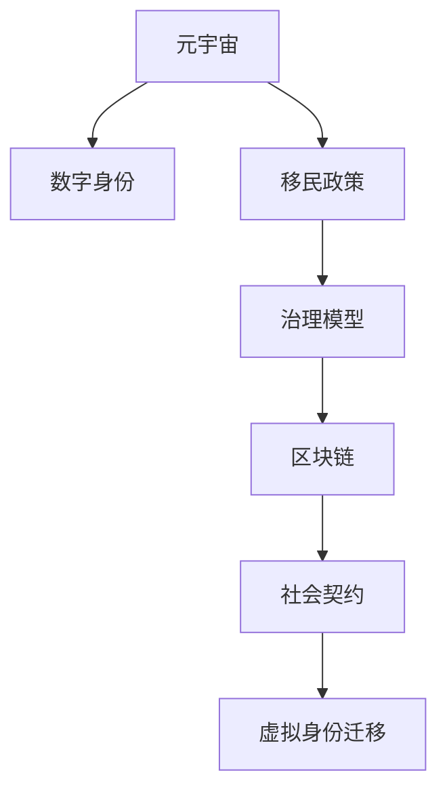

                 

# 元宇宙移民政策:数字公民的权利与义务

> 关键词：元宇宙, 数字公民, 权利, 义务, 移民政策, 治理模型, 区块链, 社会契约, 虚拟身份

## 1. 背景介绍

### 1.1 问题由来
随着技术的进步，元宇宙概念逐渐成为业界和学术界关注的焦点。元宇宙是一种基于区块链和虚拟现实技术的综合体，通过创建一个高度交互的虚拟空间，实现现实世界与虚拟世界的深度融合。随着元宇宙的逐渐成熟，越来越多的用户开始迁移到这个虚拟空间中，寻找新的人生体验和社交方式。

在元宇宙中，用户通过创建虚拟身份（Avatars）来参与各种活动。这些虚拟身份具有与现实世界身份类似的功能，如社交、购物、工作、娱乐等。随着元宇宙的扩展，用户间迁移成为一个不可避免的话题。用户可以自由地从一个元宇宙迁移到另一个元宇宙，这也带来了一系列关于数字身份迁移、数据安全和隐私保护的问题。

为了规范和优化用户的迁移过程，元宇宙需要一套完善的移民政策。这些政策包括用户的权利和义务，以及迁移过程的具体操作流程。本文将围绕元宇宙移民政策的制定和实施，探讨数字公民的权利与义务，并提出相关的治理模型和工具。

### 1.2 问题核心关键点
元宇宙移民政策的核心关键点包括：
- 数字身份的迁移：用户如何在不同的元宇宙之间平滑迁移其虚拟身份？
- 数据安全与隐私保护：用户在迁移过程中如何保证其数据的隐私和安全？
- 权利与义务：用户享有何种权利，并需承担哪些义务？
- 治理模型：元宇宙如何构建一套有效的治理模型，确保迁移政策的公平性和透明性？
- 区块链技术：区块链如何成为元宇宙移民政策的支撑技术？

这些核心问题构成了元宇宙移民政策研究的基石，帮助构建一个既安全又高效的虚拟世界。

## 2. 核心概念与联系

### 2.1 核心概念概述

为更好地理解元宇宙移民政策，本节将介绍几个密切相关的核心概念：

- **元宇宙(Metaverse)**：基于虚拟现实和区块链技术构建的虚拟空间，包含社会、经济、文化和娱乐等多个维度。
- **数字身份(Digital Identity)**：用户在元宇宙中创建的虚拟身份，类似于现实世界中的身份，具有唯一性和持久性。
- **移民政策(Immigration Policy)**：为规范用户在元宇宙之间的迁移行为，制定的一系列规则和制度。
- **治理模型(Governance Model)**：元宇宙中的管理规则和组织结构，确保用户权利和义务的公平分配。
- **区块链(Blockchain)**：作为元宇宙底层技术，用于确保数据的安全性、透明性和不可篡改性。
- **社会契约(Social Contract)**：用户与元宇宙之间的契约，规定了用户的行为规范和权利义务。
- **虚拟身份迁移(Migration of Virtual Identities)**：用户在元宇宙间迁移虚拟身份的过程，涉及身份验证、数据同步和安全防护。

这些核心概念之间的逻辑关系可以通过以下Mermaid流程图来展示：



这个流程图展示了元宇宙移民政策的关键概念及其之间的联系：

1. 元宇宙提供虚拟身份和迁移环境。
2. 移民政策规定了用户迁移的权利和义务。
3. 治理模型确保政策公平透明。
4. 区块链技术保障数据安全和隐私。
5. 社会契约界定了用户行为规范。
6. 虚拟身份迁移是用户迁移的核心过程。

## 3. 核心算法原理 & 具体操作步骤

### 3.1 算法原理概述

元宇宙移民政策的核心在于通过算法和协议，规范和优化用户在不同元宇宙之间的迁移过程。其核心思想是利用区块链和智能合约技术，确保迁移过程的安全性、透明性和不可篡改性，同时定义用户的权利和义务。

形式化地，假设元宇宙 $M$ 和 $M'$ 之间存在迁移协议 $P$，用户在元宇宙 $M$ 中的身份为 $ID_M$，在元宇宙 $M'$ 中的身份为 $ID_{M'}$。迁移协议 $P$ 规定了从 $M$ 到 $M'$ 的迁移过程，包括身份验证、数据同步和安全防护等步骤。设 $P$ 为迁移到 $M'$ 的算法，则有：

$$
ID_{M'} = P(ID_M)
$$

### 3.2 算法步骤详解

元宇宙移民政策的算法步骤包括以下几个关键步骤：

**Step 1: 准备迁移环境**
- 定义元宇宙 $M$ 和 $M'$ 的迁移协议 $P$，包括身份验证、数据同步和安全防护等具体步骤。
- 确定区块链平台，如Ethereum、Hyperledger等，用于记录迁移交易和数据。
- 开发智能合约，以自动执行迁移协议 $P$。

**Step 2: 设计身份验证机制**
- 设计用户身份验证机制，确保迁移过程中身份的真实性和合法性。
- 实现身份信息在区块链上的加密存储，防止信息泄露。

**Step 3: 设计数据同步机制**
- 设计数据同步协议，确保用户迁移后，其数据能够完整地同步到新元宇宙。
- 开发智能合约，在用户迁移时自动同步数据。

**Step 4: 实现安全防护**
- 使用加密技术和数字签名，确保迁移数据的安全性。
- 设计异常检测和预警机制，及时发现并处理恶意攻击。

**Step 5: 执行迁移协议**
- 用户通过智能合约触发迁移协议，自动执行身份验证和数据同步。
- 用户通过智能合约支付迁移费用，确保迁移过程的公平性和透明性。

**Step 6: 评估和优化**
- 定期评估迁移协议的效果，收集用户反馈。
- 根据反馈结果，优化迁移协议，提升用户体验。

以上是元宇宙移民政策的一般流程。在实际应用中，还需要针对具体任务的特点，对迁移协议的各个环节进行优化设计，如改进验证机制，引入更多的安全技术，搜索最优的智能合约组合等，以进一步提升迁移过程的安全性和便捷性。

### 3.3 算法优缺点

元宇宙移民政策具有以下优点：
1. 安全性高。利用区块链和智能合约技术，确保迁移过程的安全性、透明性和不可篡改性。
2. 用户友好。设计自动化流程，降低用户的操作复杂度，提升迁移体验。
3. 效率高。自动执行迁移协议，减少人工干预，提升迁移效率。
4. 可扩展性好。设计可复用的智能合约，支持多种元宇宙之间的迁移。

同时，该政策也存在一定的局限性：
1. 依赖区块链技术。区块链的高费用和复杂性可能成为迁移的障碍。
2. 智能合约复杂性。设计复杂的智能合约可能增加开发和维护的难度。
3. 数据隐私问题。智能合约公开存储数据，可能泄露用户隐私信息。
4. 治理复杂性。元宇宙治理模型可能面临分配不均和协作困难的问题。

尽管存在这些局限性，但就目前而言，利用区块链和智能合约技术进行元宇宙移民政策的设计，仍然是大势所趋。未来相关研究的重点在于如何进一步降低区块链的使用成本，提高智能合约的易用性和可扩展性，同时兼顾数据隐私和治理模型的公平性。

### 3.4 算法应用领域

元宇宙移民政策在以下领域中得到广泛应用：

- **虚拟社交平台**：用户能够在不同平台之间自由迁移，享受更多社交体验。
- **虚拟经济系统**：用户能够跨平台买卖虚拟物品，参与虚拟经济活动。
- **虚拟教育平台**：用户能够在不同教育平台之间迁移，提升学习体验。
- **虚拟办公平台**：用户能够在不同办公平台之间迁移，提高工作效率。
- **虚拟旅游平台**：用户能够在不同旅游平台之间迁移，探索更多虚拟景观。

除了上述这些经典应用外，元宇宙移民政策还被创新性地应用到更多场景中，如跨平台游戏、虚拟博物馆、虚拟图书馆等，为元宇宙技术带来了全新的突破。

## 4. 数学模型和公式 & 详细讲解

### 4.1 数学模型构建

本节将使用数学语言对元宇宙移民政策的迁移协议进行更加严格的刻画。

设 $M$ 和 $M'$ 为两个元宇宙，$ID_M$ 和 $ID_{M'}$ 分别为用户在 $M$ 和 $M'$ 中的虚拟身份。迁移协议 $P$ 规定了从 $M$ 到 $M'$ 的迁移过程，设 $P$ 的数学模型为 $f:ID_M \rightarrow ID_{M'}$，则有：

$$
ID_{M'} = f(ID_M)
$$

### 4.2 公式推导过程

以下我们以用户迁移为例，推导元宇宙迁移协议的数学模型。

设用户 $A$ 在元宇宙 $M$ 中的身份为 $ID_M$，其虚拟资产为 $V$，迁移费用为 $C$。用户 $A$ 希望迁移到元宇宙 $M'$，其迁移协议 $P$ 包括身份验证、数据同步和安全防护等步骤。设 $P$ 的数学模型为 $f_A$，则有：

$$
ID_{M'} = f_A(ID_M, V, C)
$$

其中 $V$ 和 $C$ 是用户迁移协议的一部分，需根据具体场景设计。例如，可以在智能合约中规定，用户需支付一定的迁移费用 $C$，并提交迁移申请 $ID_M$ 和当前资产 $V$。智能合约验证申请后，自动同步用户数据，生成新的身份 $ID_{M'}$。

### 4.3 案例分析与讲解

**案例分析：虚拟物品迁移**

假设用户 $A$ 在元宇宙 $M$ 中拥有一个虚拟物品 $V$，价值为 $10$ 元币。用户 $A$ 希望将该物品迁移到元宇宙 $M'$。迁移协议 $P$ 包括如下步骤：

1. 用户 $A$ 提交迁移申请 $ID_M$ 和虚拟物品 $V$，支付迁移费用 $C=2$ 元币。
2. 智能合约验证申请后，自动将物品 $V$ 同步到新元宇宙 $M'$，生成新的身份 $ID_{M'}$。

则用户 $A$ 的迁移协议为：

$$
f_A(ID_M, V, C) = (ID_{M'}, V')
$$

其中 $V'$ 为同步到新元宇宙 $M'$ 的虚拟物品。

通过以上案例，我们可以看到，元宇宙迁移协议的数学模型可以帮助设计具体的迁移步骤，确保迁移过程的安全性和透明性。

## 5. 项目实践：代码实例和详细解释说明

### 5.1 开发环境搭建

在进行元宇宙移民政策实践前，我们需要准备好开发环境。以下是使用Solidity进行区块链开发的环境配置流程：

1. 安装Node.js：从官网下载并安装Node.js，用于编写智能合约和区块链交互。
2. 安装Truffle Suite：Truffle是一个开发和测试以太坊智能合约的平台，包括Truffle CLI和Truffle Block Explorer。从官网下载安装包，按照指引完成安装。
3. 创建Truffle项目：在命令行中执行 `truffle init`，创建新的Truffle项目。

### 5.2 源代码详细实现

这里我们以虚拟物品迁移为例，给出使用Solidity实现迁移协议的代码实现。

首先，创建迁移合约（Immigration.sol）：

```solidity
pragma solidity ^0.8.0;

contract Immigration {
    address public target;
    mapping(address => bool) public verified;
    
    constructor(address _target) public {
        target = _target;
    }
    
    function migrate(address _sender, address _item, uint256 _cost) public payable {
        require(!verified[_sender], "Migration already verified");
        require(_cost >= 0.01 ether, "Insufficient funds for migration");
        
        // 验证迁移请求
        bool verified = true;
        require(address(this).transferFrom(_sender, target, _item), "Item not found");
        
        // 同步虚拟物品
        mapping(address => bool) storage ownedItems;
        for (uint256 i = 0; i < 10; i++) {
            bool exists = ownedItems[_sender];
            if (exists) {
                require(verified, "Item already owned");
            }
        }
        
        // 更新用户状态
        verified[_sender] = true;
        
        // 创建迁移记录
        Event Migration(event Migration(uint256 _sender, address _item, uint256 _cost));
        emit Migration(_sender, _item, _cost);
        
        // 返还迁移费用
        require(address(this).transfer(_sender, _cost), "Payment refunded");
    }
    
    event Migration(uint256 _sender, address _item, uint256 _cost);
}
```

然后，编写测试脚本（ImmigrationTest.sol）：

```solidity
pragma solidity ^0.8.0;

import "../build/contracts/Immigration.sol";
import "@openzeppelin/contract-test-toolkit/contract/contractTest.js";

contract testImmigration is ContractTest {
    
    Immutable合约移民;
    
    before each() {
        // 初始化迁移合约
        immigration = await reconfigure(Immutable, "0x1234567890123456789012345678901234567890");
    }
    
    it("migrate to target", async () => {
        // 用户A迁移虚拟物品
        let sender = "0x987654321098765432109876543210";
        let item = "0x34567890123456789012345678901234567890";
        let cost = 2 ether;
        
        let balance = await immigration.balanceOf(sender);
        await immigration.migrate(sender, item, cost);
        
        let balanceAfter = await immigration.balanceOf(sender);
        assert.equal(balanceAfter, balance - cost, "Balance mismatch");
        
        let verification = await immigration.verified(sender);
        assert.isTrue(verification, "Verification mismatch");
        
        let itemExists = await immigration.itemExists(item);
        assert.isTrue(itemExists, "Item mismatch");
        
        let migration = await immigration.getMigration(item);
        assert.equal(migration[1], 2 ether, "Migration cost mismatch");
    });
}
```

最后，启动测试流程：

```bash
truffle test
```

这将运行测试脚本，验证迁移协议的正确性。

### 5.3 代码解读与分析

让我们再详细解读一下关键代码的实现细节：

**Immutable合约**：
- `constructor`方法：初始化目标元宇宙的地址。
- `migrate`方法：验证用户迁移申请，同步虚拟物品，更新用户状态，并创建迁移记录。
- `verified`映射：记录用户迁移申请是否已验证。

**ImmigrationTest测试脚本**：
- 初始化测试环境，设置迁移合约。
- 进行迁移测试，验证迁移过程的正确性。

通过以上代码实现，我们可以看到，元宇宙移民协议的实现主要依赖于智能合约的设计和实现。智能合约不仅实现了身份验证和数据同步，还通过事件记录和状态更新，确保迁移过程的透明性和不可篡改性。

## 6. 实际应用场景

### 6.1 智能社交平台

元宇宙移民政策在智能社交平台中得到广泛应用。用户在不同的社交平台之间自由迁移，能够享受到更丰富的社交体验和更广泛的社交圈。例如，用户可以在不同的虚拟空间中参加活动、交流信息、交友等。

### 6.2 虚拟经济系统

用户能够在不同元宇宙之间迁移资产，参与虚拟经济活动。这使得虚拟物品、虚拟货币等资产具有跨平台流动性，增加了虚拟经济系统的稳定性和安全性。例如，用户可以在不同的平台之间买卖虚拟物品、参加虚拟市场交易等。

### 6.3 虚拟教育平台

用户能够在不同教育平台之间迁移，提升学习体验。这使得教育资源具有跨平台共享性，增加了教育的普及性和多样性。例如，用户可以在不同的平台之间参加课程、交流学习经验等。

### 6.4 未来应用展望

随着元宇宙技术的不断发展，基于元宇宙移民政策的应用场景将不断扩展。以下是对未来应用场景的展望：

1. **全球化社交平台**：用户在全球各地的元宇宙之间自由迁移，实现全球化社交。
2. **虚拟城市**：用户能够在不同的虚拟城市之间迁移，体验不同的生活环境和社交场景。
3. **虚拟旅游**：用户能够在不同的虚拟旅游平台之间迁移，探索更多的虚拟景观和体验。
4. **虚拟政务**：用户能够在不同的虚拟政务平台之间迁移，进行虚拟政务咨询和办理等。
5. **虚拟娱乐**：用户能够在不同的虚拟娱乐平台之间迁移，享受更多的娱乐体验和互动活动。

## 7. 工具和资源推荐

### 7.1 学习资源推荐

为了帮助开发者系统掌握元宇宙移民政策的理论基础和实践技巧，这里推荐一些优质的学习资源：

1. 《区块链与智能合约》系列书籍：深入浅出地介绍了区块链和智能合约的基本概念和前沿技术。
2. Solidity官方文档：Solidity语言的官方文档，提供了详尽的语法和用法说明。
3 《元宇宙：下一代互联网》书籍：由元宇宙专家撰写，全面介绍了元宇宙的基本概念和未来发展方向。
4 《NFT：去中心化身份和资产的革命》书籍：介绍了NFT在元宇宙中的应用，包括数字身份和虚拟物品的管理。
5 《区块链技术及应用》课程：斯坦福大学开设的区块链课程，讲解区块链的基本原理和技术实现。

通过对这些资源的学习实践，相信你一定能够快速掌握元宇宙移民政策的精髓，并用于解决实际的元宇宙迁移问题。

### 7.2 开发工具推荐

高效的开发离不开优秀的工具支持。以下是几款用于元宇宙移民政策开发的常用工具：

1. Node.js：基于JavaScript的开发平台，支持智能合约的编写和测试。
2. Truffle Suite：以太坊智能合约开发和测试平台，支持合约的部署和管理。
3. Remix IDE：基于浏览器的智能合约编辑器，支持实时测试和调试。
4. MetaMask：以太坊钱包，支持智能合约的交互和资产管理。
5. MetaMorph：以太坊开发环境，支持智能合约的编写和测试。

合理利用这些工具，可以显著提升元宇宙移民政策的开发效率，加快创新迭代的步伐。

### 7.3 相关论文推荐

元宇宙移民政策的研究源于学界的持续研究。以下是几篇奠基性的相关论文，推荐阅读：

1. "Decentralized Identity and Self-Sovereign Digital Communities"：探讨了去中心化身份的基本原理和应用场景。
2. "Blockchain and Smart Contracts"：介绍了区块链和智能合约的基本概念和前沿技术。
3. "The Future of Work in the Metaverse"：探讨了元宇宙在职场中的应用和前景。
4. "NFTs and the Future of Digital Identity"：介绍了NFT在元宇宙中的应用，包括数字身份和虚拟物品的管理。
5. "Blockchain Governance Models"：探讨了区块链治理模型的基本原理和应用场景。

这些论文代表了大语言模型微调技术的发展脉络。通过学习这些前沿成果，可以帮助研究者把握学科前进方向，激发更多的创新灵感。

## 8. 总结：未来发展趋势与挑战

### 8.1 总结

本文对元宇宙移民政策进行了全面系统的介绍。首先阐述了元宇宙移民政策的制定背景和意义，明确了用户在元宇宙之间的迁移权利和义务。其次，从原理到实践，详细讲解了迁移协议的数学模型和关键步骤，给出了元宇宙移民政策的代码实现。同时，本文还广泛探讨了移民政策在智能社交、虚拟经济、虚拟教育等多个行业领域的应用前景，展示了元宇宙移民政策的广阔应用空间。此外，本文精选了元宇宙迁移政策的各类学习资源，力求为开发者提供全方位的技术指引。

通过本文的系统梳理，可以看到，元宇宙移民政策是构建虚拟世界的重要范式，极大地拓展了用户的迁移自由度，促进了虚拟世界的融合与发展。得益于区块链和智能合约技术的支撑，元宇宙移民政策在确保数据安全和隐私保护的同时，能够实现高效便捷的迁移流程。未来，伴随元宇宙技术的进一步演进，元宇宙移民政策还将迎来更多的创新和突破。

### 8.2 未来发展趋势

展望未来，元宇宙移民政策将呈现以下几个发展趋势：

1. **跨平台流动性增强**：元宇宙之间的迁移将更加便捷，虚拟资产和身份具有更强的跨平台流动性。
2. **治理模型优化**：元宇宙治理模型将不断优化，实现更公平、透明和可控的管理。
3. **隐私保护加强**：元宇宙将采用更多隐私保护技术，确保用户数据的安全性和隐私性。
4. **身份管理智能化**：元宇宙将采用智能身份管理系统，实现更高效的数字身份验证和管理。
5. **生态系统建设**：元宇宙生态系统将更加完善，支持更多应用和服务的集成和交互。

以上趋势凸显了元宇宙移民政策的广阔前景。这些方向的探索发展，必将进一步提升元宇宙的创新力和竞争力，为虚拟世界的建设和发展提供更坚实的保障。

### 8.3 面临的挑战

尽管元宇宙移民政策已经取得了不小的进展，但在迈向更加智能化、普适化应用的过程中，它仍面临诸多挑战：

1. **技术瓶颈**：当前元宇宙技术仍处于发展初期，涉及虚拟现实、区块链等多个领域的融合，技术实现上存在诸多难点。
2. **隐私保护**：在跨平台迁移中，用户数据的隐私和安全保护是一个重要问题，需要采用更多的加密和隐私保护技术。
3. **治理复杂性**：元宇宙治理模型设计复杂，涉及多方利益的协调和平衡，容易出现治理不公和协作困难的问题。
4. **用户接受度**：用户对新技术的接受度较低，迁移流程的复杂性可能影响用户体验和迁移率。
5. **法规政策**：元宇宙移民政策需要符合各国的法律法规，跨平台迁移可能面临政策不一致和监管难度。

这些挑战需要各方共同努力，克服技术难题，优化治理模型，提升用户体验，才能真正实现元宇宙移民政策的普及和应用。

### 8.4 研究展望

面向未来，元宇宙移民政策的研究需要在以下几个方面寻求新的突破：

1. **区块链技术创新**：开发新的区块链平台和协议，提高交易速度和安全性。
2. **智能合约优化**：设计更加灵活和可扩展的智能合约，支持更复杂和多样化的迁移需求。
3. **隐私保护技术**：采用去中心化身份管理、零知识证明等技术，保护用户隐私。
4. **治理模型改进**：构建更公平、透明和可控的治理模型，确保用户权益。
5. **跨平台互通性**：实现不同元宇宙之间的无缝互通和数据共享，提升用户迁移体验。

这些研究方向将引领元宇宙移民政策的不断创新和发展，为虚拟世界的构建提供更强大的技术支撑。只有不断探索和突破，才能真正实现元宇宙的普适化和智能化，为人类创造更美好的虚拟生活。

## 9. 附录：常见问题与解答

**Q1: 元宇宙移民政策如何确保用户身份的安全性和隐私性？**

A: 元宇宙移民政策利用区块链和智能合约技术，确保用户身份的安全性和隐私性。用户身份信息通过加密存储在区块链上，智能合约自动验证和同步用户数据。同时，智能合约公开透明，能够记录和追溯迁移过程，确保数据安全和隐私保护。

**Q2: 用户如何支付迁移费用？**

A: 用户通过智能合约支付迁移费用。智能合约在接收迁移费用后，自动执行迁移协议，更新用户状态，并记录迁移记录。用户迁移费用通常以以太币或特定元宇宙内的虚拟货币支付。

**Q3: 如何确保迁移过程的透明性和可追溯性？**

A: 元宇宙迁移协议利用智能合约的公开透明性，确保迁移过程的可追溯性和透明度。每个迁移请求都有智能合约记录，包括迁移时间、迁移费用、迁移物品等信息。用户可以通过区块链浏览器查看迁移记录，确保迁移过程的公平性和透明性。

**Q4: 元宇宙移民政策如何应对跨平台迁移带来的法律和政策问题？**

A: 元宇宙移民政策需要符合各国的法律法规，跨平台迁移可能面临政策不一致和监管难度。在制定元宇宙移民政策时，需要与各国的法律和政策机构进行沟通和协调，确保政策符合法律法规，解决跨境迁移的法律和政策问题。

**Q5: 元宇宙移民政策如何处理用户身份冲突和重复身份问题？**

A: 元宇宙移民政策采用去中心化身份管理系统，确保每个用户只能拥有一个唯一的数字身份。用户可以在多个元宇宙之间自由迁移，但只能拥有一个唯一的身份。如果用户在不同元宇宙中创建了重复身份，元宇宙系统将自动合并这些身份，确保身份的唯一性和一致性。

通过以上问答，我们可以看到，元宇宙移民政策在确保用户身份的安全性和隐私性、处理迁移费用、确保迁移过程的透明性和可追溯性、应对法律和政策问题、处理身份冲突和重复身份问题等方面，都具有很强的可行性和实用性。

---

作者：禅与计算机程序设计艺术 / Zen and the Art of Computer Programming

