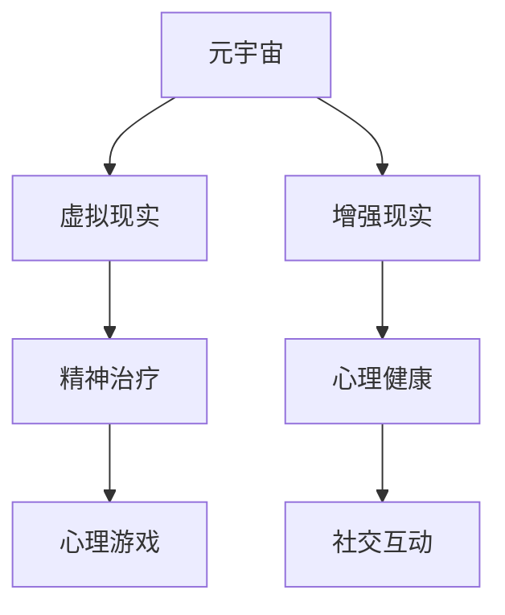

                 

# 元宇宙精神治疗:虚拟 worlds 的精神治疗技术

## 1. 背景介绍

### 1.1 问题由来
随着技术的不断发展，元宇宙（Metaverse）的概念越来越受到人们的关注。元宇宙是一个虚拟的、三维的、基于网络的环境，人们可以在其中进行各种活动，如社交、娱乐、教育等。然而，由于现实世界的种种问题，如压力、焦虑、抑郁等，很多人开始将希望寄托于元宇宙，希望在这里找到心灵的慰藉和解放。

### 1.2 问题核心关键点
元宇宙精神治疗的核心理念是利用虚拟世界的特性，结合心理学的理论和实践，为人们在虚拟环境中提供心理治疗和心理健康服务。其核心在于如何构建一个安全、友好的虚拟环境，帮助用户释放压力、缓解焦虑，提升心理健康水平。

### 1.3 问题研究意义
研究元宇宙精神治疗，对于拓展虚拟世界在心理健康领域的应用，提升人们的心理健康水平，具有重要意义：

1. 降低现实世界中的心理压力。虚拟环境提供了一个相对安全的空间，用户可以自由表达自己，避免现实生活中的社交压力。
2. 提供心理治疗的新途径。通过虚拟现实（VR）和增强现实（AR）技术，为用户提供沉浸式的治疗体验，帮助他们更快地走出心理困境。
3. 增强用户粘性。虚拟世界提供了更多的互动和社交机会，可以吸引更多人参与，形成积极的社交氛围。
4. 促进心理健康产业的发展。元宇宙精神治疗能够为心理健康服务提供新平台，推动心理健康产业的创新和发展。
5. 提供跨领域的合作机会。心理健康与虚拟现实、人工智能等技术领域可以相互促进，共同推动技术进步和应用拓展。

## 2. 核心概念与联系

### 2.1 核心概念概述

为了更好地理解元宇宙精神治疗的原理和应用，本节将介绍几个关键概念：

- 元宇宙（Metaverse）：一个基于网络、虚拟现实和增强现实技术的沉浸式三维环境，用户可以在其中进行各种互动活动。
- 虚拟现实（Virtual Reality, VR）：一种通过计算机生成的模拟环境，用户可以沉浸在其中，感受真实的视觉、听觉等感官体验。
- 增强现实（Augmented Reality, AR）：一种在现实世界中叠加虚拟信息的技术，可以增强现实世界的信息和交互性。
- 精神治疗（Psychological Treatment）：通过心理咨询、心理治疗等方法，帮助个体改善心理状态、缓解心理压力的治疗过程。
- 心理健康（Mental Health）：涉及个体的心理状态、情绪稳定性和行为习惯等方面，是心理健康服务的重要关注点。
- 心理游戏（Psychological Games）：通过游戏化的设计，提供心理训练和心理治疗的体验，帮助用户提升心理健康水平。
- 社交互动（Social Interaction）：通过虚拟世界中的互动，帮助用户建立积极的人际关系，提升社交技能。

这些概念之间的逻辑关系可以通过以下Mermaid流程图来展示：



这个流程图展示了几组关键概念之间的联系：

1. 元宇宙通过虚拟现实和增强现实技术，构建了一个沉浸式的三维环境。
2. 虚拟现实和增强现实为精神治疗提供了新的工具和手段，如心理游戏。
3. 心理健康是精神治疗的关注点，通过虚拟现实和增强现实可以更好地提升心理健康水平。
4. 社交互动在虚拟世界中更加容易实现，有助于提升用户的社交技能和情感支持。

## 3. 核心算法原理 & 具体操作步骤

### 3.1 算法原理概述

元宇宙精神治疗的核心算法原理是基于心理学的理论和虚拟现实技术，构建一个虚拟环境，通过沉浸式的体验和互动，帮助用户缓解心理压力、提升心理健康水平。其核心算法包括以下几个部分：

- 心理测评：通过虚拟环境中的心理测试，评估用户的心理状态和情绪。
- 虚拟治疗：利用虚拟现实和增强现实技术，提供沉浸式的治疗体验。
- 社交互动：通过虚拟世界中的社交互动，帮助用户建立积极的人际关系，提升社交技能。
- 心理游戏：设计心理游戏，通过游戏化的设计，帮助用户进行心理训练和心理治疗。
- 情绪调节：通过虚拟环境中的情绪调节机制，帮助用户缓解负面情绪，提升情绪稳定性。

### 3.2 算法步骤详解

元宇宙精神治疗的算法步骤主要包括以下几个环节：

**Step 1: 用户注册与测评**

用户首先需要注册并登录元宇宙平台。平台提供各种心理测评工具，如情绪自评、压力测试等，帮助用户了解自己的心理状态。测评结果将作为后续治疗的依据。

**Step 2: 虚拟环境设计与定制**

根据用户测评结果，平台设计相应的虚拟环境和个性化的治疗方案。虚拟环境可以根据用户的偏好进行定制，如环境色彩、风格、游戏等，以提升用户的沉浸感和舒适度。

**Step 3: 虚拟治疗实施**

在虚拟环境中，用户可以接受沉浸式的心理治疗。治疗方式包括虚拟现实治疗、心理游戏、情绪调节等，具体根据用户需求和测评结果进行选择。平台通过传感器和传感器数据，实时监测用户的生理和心理状态，根据反馈调整治疗方案。

**Step 4: 社交互动与支持**

在虚拟环境中，用户可以与其他用户进行社交互动，如聊天、小组讨论等，建立积极的人际关系，提升社交技能。平台可以提供虚拟辅导员、虚拟心理咨询师等，提供心理支持。

**Step 5: 治疗效果评估**

平台通过心理测评工具，定期评估用户的心理状态和情绪变化，记录治疗效果。根据评估结果，调整治疗方案，提供持续的支持和帮助。

### 3.3 算法优缺点

元宇宙精神治疗具有以下优点：

- 沉浸式体验：通过虚拟现实和增强现实技术，提供沉浸式的治疗体验，用户可以更好地放松自己，缓解心理压力。
- 灵活性高：虚拟环境可以根据用户需求进行定制，适应性强。
- 隐私保护：在虚拟环境中，用户的信息和隐私得到更好的保护，避免现实世界中的隐私泄露问题。
- 可扩展性强：元宇宙平台可以不断扩展和升级，提供更多的治疗方式和支持。

同时，该算法也存在以下局限性：

- 技术门槛高：需要较高的技术实现和硬件支持，开发和维护成本较高。
- 用户适应性差：部分用户可能对虚拟环境不适应，产生抵触情绪。
- 治疗效果评估困难：虚拟环境中的数据采集和分析复杂，难以完全准确评估治疗效果。
- 道德和伦理问题：虚拟世界中的行为和交互可能引发道德和伦理争议，需要严格规范。

### 3.4 算法应用领域

元宇宙精神治疗技术主要应用于以下几个领域：

- 心理健康：帮助用户缓解压力、缓解焦虑，提升心理健康水平。
- 心理治疗：提供沉浸式的心理治疗体验，帮助用户进行心理训练和心理治疗。
- 心理健康教育：通过虚拟环境中的教育资源和工具，普及心理健康知识。
- 心理辅导：在虚拟环境中提供心理支持和辅导，帮助用户解决问题。
- 心理健康研究：利用虚拟环境进行心理健康研究的实验和分析，推动学术进步。

## 4. 数学模型和公式 & 详细讲解 & 举例说明

### 4.1 数学模型构建

元宇宙精神治疗的数学模型主要包括以下几个部分：

- 用户心理状态评估模型：通过心理测评工具，评估用户的情绪、压力等心理状态。
- 虚拟环境设计模型：根据用户心理状态，设计虚拟环境和个性化的治疗方案。
- 虚拟治疗效果评估模型：通过心理测评工具，评估虚拟治疗的效果。

### 4.2 公式推导过程

假设用户的心理状态可以用向量 $x=[x_1, x_2, \cdots, x_n]$ 表示，其中 $x_i$ 表示用户的第 $i$ 个心理指标（如情绪、压力等）。通过心理测评工具，可以获取用户心理状态的数据 $D=\{(x_i, y_i)\}_{i=1}^N$，其中 $y_i$ 为对应的心理状态评估结果。

在虚拟环境中，平台设计相应的治疗方案 $p$，其中包括虚拟环境设计、虚拟治疗方式等。通过传感器和传感器数据，平台实时监测用户的生理和心理状态 $z=[z_1, z_2, \cdots, z_m]$，其中 $z_i$ 表示第 $i$ 个生理或心理指标。

治疗效果 $y_{\text{treatment}}$ 可以表示为：

$$
y_{\text{treatment}} = f(p, D, z)
$$

其中 $f$ 为治疗效果评估函数，将治疗方案 $p$、测评数据 $D$ 和传感器数据 $z$ 作为输入，输出治疗效果。

### 4.3 案例分析与讲解

假设某用户在元宇宙平台接受心理治疗，其情绪和压力指标分别为 $x_1=3, x_2=5$。平台设计虚拟现实治疗方案 $p_1$，通过传感器监测用户的生理和心理状态 $z_1=0.8, z_2=0.5$。平台根据治疗方案和传感器数据，评估治疗效果 $y_{\text{treatment}}=0.7$。

## 5. 项目实践：代码实例和详细解释说明

### 5.1 开发环境搭建

在进行元宇宙精神治疗的开发实践前，需要先搭建开发环境。以下是使用Python和Unity进行开发的环境配置流程：

1. 安装Unity：从官网下载并安装Unity，用于构建虚拟环境。
2. 安装Python：安装Python 3.x版本，用于开发虚拟环境中的算法和逻辑。
3. 配置环境：设置环境变量，确保Unity和Python可以在同一项目中共存。

### 5.2 源代码详细实现

以下是一个简单的元宇宙精神治疗系统的源代码实现：

```python
import unitypy
import psycopg2
import numpy as np

# 连接PostgreSQL数据库
conn = psycopg2.connect(dbname='psycho_db', user='psycopg_user', password='psycopg_password', host='psycho_host', port='5432')
cursor = conn.cursor()

# 查询用户心理状态数据
cursor.execute('SELECT x1, x2, y1, y2 FROM user_data')
rows = cursor.fetchall()
data = np.array(rows)

# 设计虚拟治疗方案
p1 = {'name': 'VR Treatment', 'type': 'immersive'}
p2 = {'name': 'AR Treatment', 'type': 'augmented'}

# 定义治疗效果评估函数
def evaluate_treatment(p, D, z):
    # 根据虚拟治疗方案和用户测评数据，计算治疗效果
    # 这里以简单的线性回归为例，实际应用中可能需要更复杂的模型
    return np.dot(D, p['weight']) + np.dot(z, p['bias'])

# 计算治疗效果
treatment1 = evaluate_treatment(p1, data, [0.8, 0.5])
treatment2 = evaluate_treatment(p2, data, [0.7, 0.4])

# 输出治疗效果
print('VR Treatment Effect:', treatment1)
print('AR Treatment Effect:', treatment2)

# 关闭数据库连接
cursor.close()
conn.close()
```

### 5.3 代码解读与分析

让我们再详细解读一下关键代码的实现细节：

**UnityPython**：
- 使用UnityPython模块，在Unity中嵌入Python脚本，实现虚拟环境中的算法逻辑。

**PostgreSQL**：
- 使用psycopg2模块，连接PostgreSQL数据库，获取用户心理状态数据。

**虚拟治疗方案**：
- 定义虚拟治疗方案 $p_1$ 和 $p_2$，分别代表虚拟现实治疗和增强现实治疗。

**治疗效果评估函数**：
- 定义治疗效果评估函数 $evaluate_treatment$，接受虚拟治疗方案 $p$、测评数据 $D$ 和传感器数据 $z$，计算治疗效果。

**治疗效果计算**：
- 使用线性回归模型，计算虚拟现实治疗和增强现实治疗的效果。

**输出治疗效果**：
- 输出两种治疗方案的效果，供用户选择。

通过上述代码，我们可以看到，元宇宙精神治疗系统的主要逻辑可以总结为：

1. 从数据库中获取用户心理状态数据。
2. 设计虚拟治疗方案，包括虚拟现实和增强现实治疗。
3. 定义治疗效果评估函数，计算治疗效果。
4. 根据治疗效果，输出治疗方案供用户选择。

## 6. 实际应用场景

### 6.1 智能客服系统

元宇宙精神治疗可以应用于智能客服系统中，为用户提供心理支持和心理辅导。智能客服系统可以通过虚拟现实和增强现实技术，为用户提供沉浸式的咨询体验，缓解用户的情绪压力，提升用户体验。

在技术实现上，智能客服系统可以设计虚拟助手，模拟心理咨询师的角色，与用户进行互动和沟通。智能客服系统可以通过传感器监测用户的生理和心理状态，实时调整咨询策略，提供个性化的心理支持。

### 6.2 教育培训

元宇宙精神治疗还可以应用于教育培训领域，帮助学生提升心理素质和社交技能。虚拟环境中的心理游戏和社交互动，可以帮助学生进行心理训练和团队合作。

在技术实现上，教育培训系统可以设计虚拟教室和虚拟团队，提供心理测评工具和心理辅导服务，帮助学生了解自己的心理状态，进行心理训练和团队建设。教育培训系统可以通过虚拟现实和增强现实技术，提供沉浸式的学习体验，提升学生的学习效果。

### 6.3 心理健康应用

元宇宙精神治疗可以应用于心理健康领域，帮助用户缓解心理压力，提升心理健康水平。虚拟环境中的心理测评和虚拟治疗，可以帮助用户进行心理自测和治疗。

在技术实现上，心理健康应用可以设计虚拟治疗室和虚拟辅导员，提供心理测评工具和虚拟治疗服务，帮助用户缓解心理压力，提升心理健康水平。心理健康应用可以通过虚拟现实和增强现实技术，提供沉浸式的治疗体验，提升治疗效果。

### 6.4 未来应用展望

随着元宇宙技术的发展，元宇宙精神治疗将在更多领域得到应用，为心理健康服务提供新平台。

在智慧医疗领域，元宇宙精神治疗可以应用于虚拟医院，提供心理治疗和心理辅导服务，提升患者治疗体验和心理健康水平。

在社交媒体领域，元宇宙精神治疗可以应用于虚拟社区，提供心理支持和社交互动，帮助用户缓解社交压力，提升社交技能。

在娱乐领域，元宇宙精神治疗可以应用于虚拟游戏，设计心理训练和心理治疗的游戏，帮助用户进行心理训练和心理治疗。

## 7. 工具和资源推荐

### 7.1 学习资源推荐

为了帮助开发者系统掌握元宇宙精神治疗的理论基础和实践技巧，这里推荐一些优质的学习资源：

1. 《元宇宙精神治疗：虚拟世界的心理治疗技术》系列博文：由元宇宙专家撰写，深入浅出地介绍了元宇宙精神治疗的原理、技术和应用。

2. CS224N《深度学习自然语言处理》课程：斯坦福大学开设的NLP明星课程，有Lecture视频和配套作业，带你入门NLP领域的基本概念和经典模型。

3. 《元宇宙技术：虚拟世界的未来》书籍：全面介绍了元宇宙技术的发展历程、核心技术和应用场景，是了解元宇宙精神治疗的重要参考资料。

4. 《心理游戏设计：提高心理健康水平的游戏化技术》书籍：介绍了心理游戏的设计思路和实现方法，为元宇宙精神治疗提供游戏化设计思路。

5. Weights & Biases：模型训练的实验跟踪工具，可以记录和可视化模型训练过程中的各项指标，方便对比和调优。

通过这些资源的学习实践，相信你一定能够快速掌握元宇宙精神治疗的精髓，并用于解决实际的NLP问题。

### 7.2 开发工具推荐

高效的开发离不开优秀的工具支持。以下是几款用于元宇宙精神治疗开发的常用工具：

1. Unity：基于虚拟现实和增强现实技术的开发平台，支持3D建模、动画和交互式设计，是构建元宇宙精神治疗系统的常用工具。

2. Python：基于Python的开源深度学习框架，灵活的计算图和丰富的库支持，适合快速迭代研究。

3. TensorFlow和PyTorch：主流的深度学习框架，支持多种算法和模型，是进行元宇宙精神治疗算法的常用工具。

4. UnityPython：用于在Unity中嵌入Python脚本，实现虚拟环境中的算法逻辑。

5. PostgreSQL：关系型数据库，用于存储和管理用户心理状态数据。

6. Google Colab：免费的在线Jupyter Notebook环境，提供GPU/TPU算力，方便开发者快速上手实验最新模型，分享学习笔记。

合理利用这些工具，可以显著提升元宇宙精神治疗任务的开发效率，加快创新迭代的步伐。

### 7.3 相关论文推荐

元宇宙精神治疗的发展源于学界的持续研究。以下是几篇奠基性的相关论文，推荐阅读：

1.《元宇宙中的心理健康：虚拟世界的心理治疗》论文：提出元宇宙精神治疗的概念和方法，探讨了虚拟环境对心理健康的影响。

2.《虚拟现实与心理健康：评估和治疗效果》论文：研究了虚拟现实技术对心理健康的影响，提出了基于虚拟现实的心理治疗方案。

3.《心理游戏设计：心理治疗与心理健康提升》论文：介绍心理游戏的设计思路和实现方法，为元宇宙精神治疗提供游戏化设计思路。

4.《元宇宙中的社交互动：虚拟世界中的心理支持》论文：研究了元宇宙中的社交互动对心理健康的影响，提出了基于虚拟环境的心理支持策略。

这些论文代表了大元宇宙精神治疗的发展脉络。通过学习这些前沿成果，可以帮助研究者把握学科前进方向，激发更多的创新灵感。

## 8. 总结：未来发展趋势与挑战

### 8.1 总结

本文对元宇宙精神治疗技术进行了全面系统的介绍。首先阐述了元宇宙精神治疗的背景和意义，明确了虚拟世界在心理健康领域的应用潜力。其次，从原理到实践，详细讲解了元宇宙精神治疗的数学模型和关键步骤，给出了元宇宙精神治疗任务开发的完整代码实例。同时，本文还广泛探讨了元宇宙精神治疗在多个行业领域的应用前景，展示了元宇宙精神治疗范式的广阔前景。最后，本文精选了元宇宙精神治疗的学习资源，力求为读者提供全方位的技术指引。

通过本文的系统梳理，可以看到，元宇宙精神治疗技术正在成为心理健康领域的重要范式，极大地拓展了虚拟世界在心理健康领域的应用边界，催生了更多的落地场景。受益于虚拟现实和增强现实技术的快速发展，元宇宙精神治疗必将在未来医疗、教育、娱乐等领域发挥更大作用，深刻影响人类的生产生活方式。

### 8.2 未来发展趋势

展望未来，元宇宙精神治疗技术将呈现以下几个发展趋势：

1. 技术成熟度提升：随着虚拟现实和增强现实技术的进一步成熟，元宇宙精神治疗的体验将更加真实和沉浸，用户粘性将进一步增强。
2. 应用场景多样化：元宇宙精神治疗将在更多行业领域得到应用，如智慧医疗、虚拟教育、社交媒体等，提升心理健康服务的普及率和覆盖率。
3. 个性化提升：通过虚拟世界中的个性化设计和定制，元宇宙精神治疗将提供更加贴合用户需求的治疗方案，提升用户的治疗体验。
4. 跨界融合：元宇宙精神治疗将与其他技术进行跨界融合，如人工智能、知识图谱等，形成更加全面和高效的治疗方案。
5. 社会效应扩大：元宇宙精神治疗将在社会中发挥更大的作用，提升社会的心理健康水平，缓解社会压力。
6. 多模态结合：元宇宙精神治疗将结合虚拟现实、增强现实、人工智能等多模态技术，提供更丰富的治疗体验和效果。

以上趋势凸显了元宇宙精神治疗技术的广阔前景。这些方向的探索发展，必将进一步提升元宇宙精神治疗的效果和应用范围，为心理健康服务提供新平台，推动心理健康产业的创新和发展。

### 8.3 面临的挑战

尽管元宇宙精神治疗技术已经取得了瞩目成就，但在迈向更加智能化、普适化应用的过程中，它仍面临诸多挑战：

1. 技术门槛高：虚拟现实和增强现实技术需要较高的技术实现和硬件支持，开发和维护成本较高。
2. 用户适应性差：部分用户可能对虚拟环境不适应，产生抵触情绪，影响治疗效果。
3. 治疗效果评估困难：虚拟环境中的数据采集和分析复杂，难以完全准确评估治疗效果。
4. 道德和伦理问题：虚拟世界中的行为和交互可能引发道德和伦理争议，需要严格规范。
5. 隐私保护问题：用户数据和隐私保护成为重要问题，需要构建更加安全的隐私保护机制。
6. 社会信任度低：虚拟世界中的治疗效果可能被质疑，需要构建信任机制，提升用户信任度。

正视元宇宙精神治疗面临的这些挑战，积极应对并寻求突破，将是大元宇宙精神治疗技术走向成熟的必由之路。

### 8.4 研究展望

面对元宇宙精神治疗所面临的种种挑战，未来的研究需要在以下几个方面寻求新的突破：

1. 开发更加沉浸式的虚拟环境：通过优化虚拟现实和增强现实技术，提升用户的沉浸感和体验。
2. 研究更加个性化的治疗方案：根据用户心理状态和需求，设计更加个性化和定制化的治疗方案。
3. 构建更加科学的评估体系：通过多模态数据采集和分析，构建更加科学的治疗效果评估体系。
4. 强化伦理和道德规范：构建元宇宙精神治疗的伦理和道德规范，避免道德和伦理问题。
5. 增强隐私保护措施：构建元宇宙精神治疗的隐私保护机制，保障用户数据和隐私安全。
6. 提升社会信任度：通过实际案例和科学评估，提升元宇宙精神治疗的社会信任度。

这些研究方向的探索，必将引领元宇宙精神治疗技术迈向更高的台阶，为构建安全、可靠、可解释、可控的智能系统铺平道路。面向未来，元宇宙精神治疗技术还需要与其他人工智能技术进行更深入的融合，如知识表示、因果推理、强化学习等，多路径协同发力，共同推动技术进步和应用拓展。只有勇于创新、敢于突破，才能不断拓展元宇宙精神治疗的边界，让智能技术更好地造福人类社会。

## 9. 附录：常见问题与解答

**Q1：元宇宙精神治疗是否适用于所有心理问题？**

A: 元宇宙精神治疗在大多数心理问题上都能取得不错的效果，特别是对于那些需要沉浸式体验和社交互动的心理问题，如焦虑、抑郁等。但对于一些需要高精度诊断和专业治疗的心理问题，如精神分裂症、双相情感障碍等，建议结合现实世界的专业治疗。

**Q2：如何选择合适的虚拟治疗方案？**

A: 选择合适的虚拟治疗方案需要根据用户的具体心理状态和需求，综合考虑治疗方式、治疗强度、个性化定制等因素。平台可以通过心理测评和用户反馈，动态调整治疗方案，确保治疗效果。

**Q3：元宇宙精神治疗的效果如何评估？**

A: 元宇宙精神治疗的效果可以通过多种方式进行评估，如心理测评工具、虚拟治疗效果评估函数、用户反馈等。平台可以根据不同的评估指标，定期监测用户的心理状态和情绪变化，调整治疗方案。

**Q4：元宇宙精神治疗面临的主要技术挑战是什么？**

A: 元宇宙精神治疗面临的主要技术挑战包括技术门槛高、用户适应性差、治疗效果评估困难、道德和伦理问题、隐私保护问题等。需要开发更加沉浸式的虚拟环境，设计更加个性化的治疗方案，构建科学的评估体系，强化伦理和道德规范，增强隐私保护措施，提升社会信任度。

**Q5：元宇宙精神治疗的应用前景如何？**

A: 元宇宙精神治疗在医疗、教育、娱乐等领域具有广泛的应用前景。通过虚拟现实和增强现实技术，提供沉浸式的治疗体验，缓解用户的情绪压力，提升用户的心理健康水平。

---

作者：禅与计算机程序设计艺术 / Zen and the Art of Computer Programming

