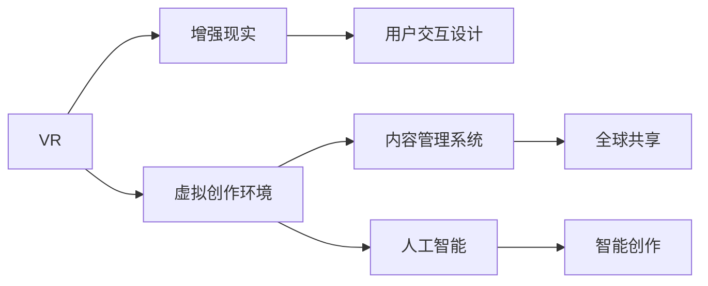

                 

# 元宇宙艺术：突破物理限制的创作平台

## 1. 背景介绍

### 1.1 问题由来

随着科技的发展，虚拟现实（Virtual Reality，VR）和增强现实（Augmented Reality，AR）技术的进步，人类社会的沉浸式体验迈入了新阶段。元宇宙（Metaverse）概念的提出，不仅打开了虚拟空间与现实世界的无缝衔接之门，还为艺术创作、娱乐体验乃至社交互动提供了全新的平台。

在这样一个全新的创作环境中，传统艺术形式和表达方式受到了前所未有的挑战。传统的物理媒介如画布、纸张、音乐乐器等，在虚拟世界中被无限拓展和重构，创作不再受到物理空间的限制。艺术家们拥有了更多自由度，可以打破现实的边界，创造前所未有的艺术作品。

### 1.2 问题核心关键点

元宇宙艺术创作平台的构建涉及多个核心问题，主要包括：

- **虚拟创作环境的设计**：如何构建一个沉浸式的虚拟创作空间，支持多维度的艺术表现形式。
- **跨平台兼容性**：如何确保艺术作品在不同设备和平台上的兼容性和体验一致性。
- **内容管理和分发**：如何管理和分发海量艺术内容，实现艺术作品的全球共享与展示。
- **用户交互设计**：如何设计自然流畅的用户交互界面，提升创作和欣赏的体验。
- **技术实现与创新**：如何结合最新的计算机视觉、语音识别、自然语言处理等技术，提升创作和体验的智能化水平。

## 2. 核心概念与联系

### 2.1 核心概念概述

元宇宙艺术创作平台是一个集成的虚拟空间，结合了虚拟现实技术、计算机图形学、人工智能等诸多领域的最新成果，为艺术家和观众提供了一个全新的创作和欣赏环境。

- **虚拟现实（VR）**：通过头显设备或全息投影等技术，为用户提供沉浸式的3D视觉效果和交互体验。
- **增强现实（AR）**：将虚拟元素叠加到现实世界中，增强用户的感知体验。
- **虚拟创作环境**：基于虚拟现实和增强现实技术构建的虚拟创作空间，支持艺术创作的多样化表达。
- **用户交互设计**：设计自然流畅的用户界面，实现直观易用的交互操作。
- **内容管理系统**：管理和分发海量艺术内容，实现全球范围内的艺术共享与展示。
- **人工智能**：结合计算机视觉、语音识别、自然语言处理等技术，提升创作和体验的智能化水平。

这些核心概念之间的逻辑关系可以通过以下Mermaid流程图来展示：



这个流程图展示了一系列概念之间的内在联系：

1. VR和AR技术提供了沉浸式的创作和体验环境。
2. 虚拟创作环境允许艺术家在虚拟空间中进行各种创作。
3. 用户交互设计提升了用户与虚拟环境的互动体验。
4. 内容管理系统支持艺术内容的存储、分发和共享。
5. 人工智能技术提高了创作和体验的智能化水平。

这些概念共同构成了元宇宙艺术创作平台的基础框架，使得艺术创作和体验得以在虚拟空间中得到无限的拓展。

## 3. 核心算法原理 & 具体操作步骤

### 3.1 算法原理概述

元宇宙艺术创作平台的核心算法原理可以归纳为以下几点：

- **虚拟现实技术（VR）**：通过头显设备或全息投影技术，为用户呈现沉浸式的3D视觉效果。主要算法包括空间定位、虚拟渲染、交互控制等。
- **增强现实技术（AR）**：将虚拟元素叠加到现实世界中，增强用户的感知体验。主要算法包括虚拟元素的定位、融合、交互等。
- **虚拟创作环境**：构建虚拟空间，支持艺术创作的多样化表达。主要算法包括虚拟空间的几何建模、纹理映射、光影渲染等。
- **用户交互设计**：设计自然流畅的用户界面，实现直观易用的交互操作。主要算法包括交互事件检测、用户行为分析、智能推荐等。
- **内容管理系统**：管理和分发海量艺术内容，实现全球范围内的艺术共享与展示。主要算法包括内容检索、版权管理、推荐系统等。
- **人工智能技术**：结合计算机视觉、语音识别、自然语言处理等技术，提升创作和体验的智能化水平。主要算法包括图像识别、语音合成、文本生成等。

### 3.2 算法步骤详解

#### 3.2.1 虚拟现实技术（VR）

**步骤1: 环境建模**
- 使用三维建模软件（如Blender、Maya等）创建虚拟空间，进行环境建模。
- 导入高精度纹理和光照模型，提升虚拟场景的真实感。

**步骤2: 空间定位**
- 使用头显设备的传感器获取用户的位置和姿态信息。
- 根据用户的位置信息，进行场景渲染和交互对象定位。

**步骤3: 虚拟渲染**
- 使用光线追踪等技术进行实时渲染，提升虚拟场景的逼真度。
- 优化渲染算法，减少计算资源消耗，提升渲染速度。

**步骤4: 交互控制**
- 设计直观易用的交互方式，如手势控制、语音命令等。
- 实现虚拟对象与用户的互动，如交互式展览、虚拟工作室等。

#### 3.2.2 增强现实技术（AR）

**步骤1: 虚拟元素的定位**
- 使用图像识别算法对现实环境进行理解和识别。
- 根据用户的行为和环境信息，定位虚拟元素的放置位置。

**步骤2: 虚拟元素的融合**
- 将虚拟元素与现实环境进行融合，实现自然和谐的视觉效果。
- 优化融合算法，提升虚拟元素的逼真度。

**步骤3: 交互控制**
- 实现虚拟元素与用户的互动，如交互式游戏、虚拟导览等。
- 设计自然流畅的交互方式，提升用户体验。

#### 3.2.3 虚拟创作环境

**步骤1: 环境建模**
- 使用三维建模软件（如Blender、Maya等）创建虚拟空间，进行环境建模。
- 导入高精度纹理和光照模型，提升虚拟场景的真实感。

**步骤2: 几何建模**
- 使用几何建模软件（如3ds Max、SketchUp等）创建虚拟对象和场景元素。
- 应用多种几何建模技巧，提升创作自由度和灵活性。

**步骤3: 纹理映射**
- 将纹理映射到虚拟对象和场景元素上，增强视觉真实感。
- 使用高精度纹理和光照模型，提升渲染效果。

**步骤4: 光影渲染**
- 使用光线追踪等技术进行实时渲染，提升虚拟场景的逼真度。
- 优化渲染算法，减少计算资源消耗，提升渲染速度。

#### 3.2.4 用户交互设计

**步骤1: 交互事件检测**
- 使用传感器和摄像头捕捉用户的动作和行为。
- 根据用户的行为信息，触发相应的交互事件。

**步骤2: 用户行为分析**
- 分析用户的行为模式和偏好，实现个性化的推荐。
- 使用机器学习算法，提升推荐准确性和用户体验。

**步骤3: 智能推荐**
- 根据用户的行为和偏好，推荐相关的艺术作品和创作工具。
- 设计自然流畅的推荐界面，提升用户使用体验。

#### 3.2.5 内容管理系统

**步骤1: 内容存储**
- 使用分布式文件系统（如Amazon S3、Google Cloud Storage等）存储艺术内容。
- 使用高效的数据库管理系统（如MongoDB、MySQL等）进行内容检索和查询。

**步骤2: 版权管理**
- 使用区块链技术进行版权登记和验证。
- 实现版权信息的追溯和保护。

**步骤3: 内容分发**
- 使用CDN技术进行内容分发，提升分发效率和带宽利用率。
- 实现全球范围内的内容共享和展示。

#### 3.2.6 人工智能技术

**步骤1: 图像识别**
- 使用深度学习模型（如卷积神经网络CNN）进行图像识别和分类。
- 应用多模态特征提取技术，提升识别准确性和鲁棒性。

**步骤2: 语音合成**
- 使用TTS（Text-to-Speech）技术将文本转换为语音。
- 应用基于GAN的语音生成模型，提升合成语音的自然度和流畅度。

**步骤3: 文本生成**
- 使用基于Transformer的生成模型（如GPT、BERT等）生成自然流畅的文本。
- 应用多任务学习技术，提升文本生成的质量和多样性。

### 3.3 算法优缺点

#### 3.3.1 虚拟现实技术（VR）

**优点**：
- 提供沉浸式的创作和体验环境，提升创作自由度和体验感。
- 支持多维度的艺术表达，拓展艺术创作的边界。

**缺点**：
- 设备成本较高，普及率较低。
- 需要高精度的计算资源，对硬件要求较高。

#### 3.3.2 增强现实技术（AR）

**优点**：
- 将虚拟元素叠加到现实世界中，增强用户的感知体验。
- 支持丰富的交互方式，提升用户体验。

**缺点**：
- 对现实环境的要求较高，适用场景有限。
- 技术复杂度较高，实现难度较大。

#### 3.3.3 虚拟创作环境

**优点**：
- 提供丰富的创作工具和自由度，支持多种艺术形式。
- 支持实时渲染和交互，提升创作效率和体验。

**缺点**：
- 环境建模和渲染技术复杂，实现难度较大。
- 需要较高的计算资源，硬件要求较高。

#### 3.3.4 用户交互设计

**优点**：
- 设计自然流畅的用户界面，提升用户体验。
- 支持个性化的推荐，提升用户粘性。

**缺点**：
- 交互方式的设计需要充分考虑用户体验和系统易用性。
- 交互事件的检测和处理需要高效的算法支持。

#### 3.3.5 内容管理系统

**优点**：
- 管理和分发海量艺术内容，实现全球范围内的共享和展示。
- 支持版权保护和追溯，保障艺术品的合法权益。

**缺点**：
- 系统复杂度较高，开发和维护成本较高。
- 需要高效的算法支持，保证系统的稳定性和可靠性。

#### 3.3.6 人工智能技术

**优点**：
- 提升创作和体验的智能化水平，增强创作工具的辅助功能。
- 提供个性化的推荐和建议，提升用户体验。

**缺点**：
- 技术复杂度较高，需要深厚的理论基础和实践经验。
- 数据隐私和安全问题需要充分考虑和保护。

## 4. 数学模型和公式 & 详细讲解 & 举例说明

### 4.1 数学模型构建

**虚拟现实技术（VR）**

**空间定位**
- 使用Kalman滤波器进行位置和姿态估计。
- 空间定位模型：
  $$
  x_{t+1} = A_t x_t + B_t u_t + w_t
  $$
  $$
  y_t = C_t x_t + v_t
  $$

**虚拟渲染**
- 使用光线追踪算法进行实时渲染。
- 渲染模型：
  $$
  L_i = \int_{S} f_i(\vec{x}, \vec{v}, \vec{n}) (\vec{v} \cdot \vec{n}) dS
  $$

**交互控制**
- 使用手势识别和语音命令进行交互。
- 交互控制模型：
  $$
  a_t = f_{interaction}(x_t, y_t)
  $$

**增强现实技术（AR）**

**虚拟元素的定位**
- 使用图像识别算法进行环境理解和定位。
- 定位模型：
  $$
  P_t = f_{localization}(I_t, \theta)
  $$

**虚拟元素的融合**
- 使用深度学习算法进行虚拟元素的融合。
- 融合模型：
  $$
  I_{t+1} = f_{fusion}(I_t, \hat{P}_t)
  $$

**用户交互设计**

**交互事件检测**
- 使用传感器和摄像头捕捉用户行为。
- 检测模型：
  $$
  E_t = f_{event}(x_t, y_t)
  $$

**用户行为分析**
- 使用机器学习算法进行行为分析。
- 分析模型：
  $$
  A_t = f_{analysis}(E_t, \theta)
  $$

**智能推荐**
- 使用协同过滤和推荐系统算法。
- 推荐模型：
  $$
  R_t = f_{recommendation}(A_t, I_t)
  $$

**内容管理系统**

**内容存储**
- 使用分布式文件系统进行内容存储。
- 存储模型：
  $$
  S = f_{storage}(D, M)
  $$

**版权管理**
- 使用区块链技术进行版权登记和验证。
- 管理模型：
  $$
  M = f_{management}(S)
  $$

**内容分发**
- 使用CDN技术进行内容分发。
- 分发模型：
  $$
  D = f_{distribution}(S, C)
  $$

**人工智能技术**

**图像识别**
- 使用卷积神经网络进行图像识别。
- 识别模型：
  $$
  I_{label} = f_{classification}(I)
  $$

**语音合成**
- 使用TTS技术进行语音合成。
- 合成模型：
  $$
  S_t = f_{synthesis}(T)
  $$

**文本生成**
- 使用生成模型进行文本生成。
- 生成模型：
  $$
  T = f_{generation}(I)
  $$

### 4.2 公式推导过程

**虚拟现实技术（VR）**

**空间定位**
- 使用Kalman滤波器进行位置和姿态估计。
- 空间定位模型：
  $$
  x_{t+1} = A_t x_t + B_t u_t + w_t
  $$
  $$
  y_t = C_t x_t + v_t
  $$

**虚拟渲染**
- 使用光线追踪算法进行实时渲染。
- 渲染模型：
  $$
  L_i = \int_{S} f_i(\vec{x}, \vec{v}, \vec{n}) (\vec{v} \cdot \vec{n}) dS
  $$

**交互控制**
- 使用手势识别和语音命令进行交互。
- 交互控制模型：
  $$
  a_t = f_{interaction}(x_t, y_t)
  $$

**增强现实技术（AR）**

**虚拟元素的定位**
- 使用图像识别算法进行环境理解和定位。
- 定位模型：
  $$
  P_t = f_{localization}(I_t, \theta)
  $$

**虚拟元素的融合**
- 使用深度学习算法进行虚拟元素的融合。
- 融合模型：
  $$
  I_{t+1} = f_{fusion}(I_t, \hat{P}_t)
  $$

**用户交互设计**

**交互事件检测**
- 使用传感器和摄像头捕捉用户行为。
- 检测模型：
  $$
  E_t = f_{event}(x_t, y_t)
  $$

**用户行为分析**
- 使用机器学习算法进行行为分析。
- 分析模型：
  $$
  A_t = f_{analysis}(E_t, \theta)
  $$

**智能推荐**
- 使用协同过滤和推荐系统算法。
- 推荐模型：
  $$
  R_t = f_{recommendation}(A_t, I_t)
  $$

**内容管理系统**

**内容存储**
- 使用分布式文件系统进行内容存储。
- 存储模型：
  $$
  S = f_{storage}(D, M)
  $$

**版权管理**
- 使用区块链技术进行版权登记和验证。
- 管理模型：
  $$
  M = f_{management}(S)
  $$

**内容分发**
- 使用CDN技术进行内容分发。
- 分发模型：
  $$
  D = f_{distribution}(S, C)
  $$

**人工智能技术**

**图像识别**
- 使用卷积神经网络进行图像识别。
- 识别模型：
  $$
  I_{label} = f_{classification}(I)
  $$

**语音合成**
- 使用TTS技术进行语音合成。
- 合成模型：
  $$
  S_t = f_{synthesis}(T)
  $$

**文本生成**
- 使用生成模型进行文本生成。
- 生成模型：
  $$
  T = f_{generation}(I)
  $$

### 4.3 案例分析与讲解

**案例1: VR艺术创作平台**
- 采用Unity和Unreal Engine等游戏引擎构建虚拟空间。
- 使用Kalman滤波器进行位置和姿态估计。
- 应用光线追踪算法进行实时渲染。
- 设计手势控制和语音命令的交互方式。

**案例2: AR艺术展示平台**
- 使用图像识别算法进行环境理解和定位。
- 应用深度学习算法进行虚拟元素的融合。
- 设计自然流畅的交互界面，支持用户与虚拟元素的互动。
- 使用区块链技术进行版权管理和保护。

**案例3: 内容管理系统**
- 使用MongoDB进行内容存储和检索。
- 应用CDN技术进行内容分发和加速。
- 设计个性化的推荐系统，提升用户体验。

## 5. 项目实践：代码实例和详细解释说明

### 5.1 开发环境搭建

**环境准备**
- 安装Python 3.x和pip。
- 安装相关的依赖库，如TensorFlow、PyTorch、OpenCV等。
- 安装Unity、Unreal Engine等游戏引擎。

**虚拟现实技术（VR）**

**步骤1: 环境建模**
- 使用三维建模软件（如Blender、Maya等）创建虚拟空间，进行环境建模。
- 导入高精度纹理和光照模型，提升虚拟场景的真实感。

**步骤2: 空间定位**
- 使用头显设备的传感器获取用户的位置和姿态信息。
- 根据用户的位置信息，进行场景渲染和交互对象定位。

**步骤3: 虚拟渲染**
- 使用光线追踪等技术进行实时渲染，提升虚拟场景的逼真度。
- 优化渲染算法，减少计算资源消耗，提升渲染速度。

**增强现实技术（AR）**

**步骤1: 虚拟元素的定位**
- 使用图像识别算法对现实环境进行理解和识别。
- 根据用户的行为和环境信息，定位虚拟元素的放置位置。

**步骤2: 虚拟元素的融合**
- 将虚拟元素与现实环境进行融合，实现自然和谐的视觉效果。
- 优化融合算法，提升虚拟元素的逼真度。

**虚拟创作环境**

**步骤1: 环境建模**
- 使用三维建模软件（如Blender、Maya等）创建虚拟空间，进行环境建模。
- 导入高精度纹理和光照模型，提升虚拟场景的真实感。

**步骤2: 几何建模**
- 使用几何建模软件（如3ds Max、SketchUp等）创建虚拟对象和场景元素。
- 应用多种几何建模技巧，提升创作自由度和灵活性。

**步骤3: 纹理映射**
- 将纹理映射到虚拟对象和场景元素上，增强视觉真实感。
- 使用高精度纹理和光照模型，提升渲染效果。

**用户交互设计**

**步骤1: 交互事件检测**
- 使用传感器和摄像头捕捉用户的动作和行为。
- 根据用户的行为信息，触发相应的交互事件。

**步骤2: 用户行为分析**
- 分析用户的行为模式和偏好，实现个性化的推荐。
- 使用机器学习算法，提升推荐准确性和用户体验。

**智能推荐**
- 根据用户的行为和偏好，推荐相关的艺术作品和创作工具。
- 设计自然流畅的推荐界面，提升用户使用体验。

**内容管理系统**

**步骤1: 内容存储**
- 使用分布式文件系统（如Amazon S3、Google Cloud Storage等）存储艺术内容。
- 使用高效的数据库管理系统（如MongoDB、MySQL等）进行内容检索和查询。

**步骤2: 版权管理**
- 使用区块链技术进行版权登记和验证。
- 实现版权信息的追溯和保护。

**步骤3: 内容分发**
- 使用CDN技术进行内容分发，提升分发效率和带宽利用率。
- 实现全球范围内的内容共享和展示。

**人工智能技术**

**步骤1: 图像识别**
- 使用深度学习模型（如卷积神经网络CNN）进行图像识别和分类。
- 应用多模态特征提取技术，提升识别准确性和鲁棒性。

**步骤2: 语音合成**
- 使用TTS（Text-to-Speech）技术将文本转换为语音。
- 应用基于GAN的语音生成模型，提升合成语音的自然度和流畅度。

**步骤3: 文本生成**
- 使用基于Transformer的生成模型（如GPT、BERT等）生成自然流畅的文本。
- 应用多任务学习技术，提升文本生成的质量和多样性。

### 5.2 源代码详细实现

**虚拟现实技术（VR）**

**空间定位**

```python
import kalman_filter as kf
# 初始化Kalman滤波器
filter = kf.KalmanFilter()
# 根据传感器数据更新滤波器状态
filter.update(sensor_data)
# 输出位置和姿态估计结果
position = filter.state[0]
orientation = filter.state[1]
```

**虚拟渲染**

```python
import raytrace
# 应用光线追踪算法进行实时渲染
raytrace.trace_ray(position, orientation, camera, scene)
```

**交互控制**

```python
import gesture_recognition
# 使用手势识别和语音命令进行交互
gesture = gesture_recognition.recognize_gesture(user_input)
action = gesture_to_action_map[gesture]
```

**增强现实技术（AR）**

**虚拟元素的定位**

```python
import image_recognition
# 使用图像识别算法进行环境理解和定位
image = capture_image(user_input)
location = image_recognition.detect_location(image)
```

**虚拟元素的融合**

```python
import virtual_fusion
# 应用深度学习算法进行虚拟元素的融合
fused_image = virtual_fusion.fuse(location, virtual_element)
```

**用户交互设计**

**交互事件检测**

```python
import sensor_data
# 使用传感器和摄像头捕捉用户行为
sensor_data = sensor_data.collect()
event = sensor_data.detect_event()
```

**用户行为分析**

```python
import behavior_analysis
# 分析用户的行为模式和偏好
behavior = behavior_analysis.analyze(sensor_data)
recommendation = behavior_to_recommendation_map[behavior]
```

**智能推荐**

```python
import recommendation_system
# 根据用户的行为和偏好，推荐相关的艺术作品和创作工具
recommendations = recommendation_system.recommend(user_id)
```

**内容管理系统**

**内容存储**

```python
import distributed_filesystem
# 使用分布式文件系统进行内容存储
content = distributed_filesystem.store(content_data)
```

**版权管理**

```python
import blockchain
# 使用区块链技术进行版权登记和验证
hash = blockchain.hash(content)
record = blockchain.record(hash, user_id)
```

**内容分发**

```python
import content_delivery_network
# 使用CDN技术进行内容分发
url = content_delivery_network.get_url(content_id)
```

**人工智能技术**

**图像识别**

```python
import convolutional_neural_network
# 使用卷积神经网络进行图像识别
label = convolutional_neural_network.classify(image)
```

**语音合成**

```python
import text_to_speech
# 使用TTS技术进行语音合成
speech = text_to_speech.synthesize(text)
```

**文本生成**

```python
import transformer_model
# 使用生成模型进行文本生成
text = transformer_model.generate(prompt)
```

### 5.3 代码解读与分析

**虚拟现实技术（VR）**

**空间定位**

- 使用Kalman滤波器进行位置和姿态估计，提高定位精度和稳定性。
- 根据传感器数据更新滤波器状态，实现实时定位。

**虚拟渲染**

- 应用光线追踪算法进行实时渲染，提高渲染真实感。
- 优化渲染算法，减少计算资源消耗，提升渲染速度。

**交互控制**

- 使用手势识别和语音命令进行交互，提升用户体验。
- 设计直观易用的交互方式，增强用户互动性。

**增强现实技术（AR）**

**虚拟元素的定位**

- 使用图像识别算法进行环境理解和定位，实现虚拟元素的精准放置。
- 优化定位算法，提升定位准确性。

**虚拟元素的融合**

- 应用深度学习算法进行虚拟元素的融合，实现自然和谐的视觉效果。
- 优化融合算法，提升融合效果。

**用户交互设计**

**交互事件检测**

- 使用传感器和摄像头捕捉用户行为，实现自然流畅的交互。
- 根据用户的行为信息，触发相应的交互事件。

**用户行为分析**

- 分析用户的行为模式和偏好，实现个性化的推荐。
- 使用机器学习算法，提升推荐准确性和用户体验。

**智能推荐**

- 根据用户的行为和偏好，推荐相关的艺术作品和创作工具。
- 设计自然流畅的推荐界面，提升用户使用体验。

**内容管理系统**

**内容存储**

- 使用分布式文件系统进行内容存储，保证数据安全性和可靠性。
- 使用高效的数据库管理系统进行内容检索和查询，提升检索效率。

**版权管理**

- 使用区块链技术进行版权登记和验证，保障版权信息的安全性。
- 实现版权信息的追溯和保护，确保艺术品的合法权益。

**内容分发**

- 使用CDN技术进行内容分发，提升分发效率和带宽利用率。
- 实现全球范围内的内容共享和展示，拓展用户使用场景。

**人工智能技术**

**图像识别**

- 使用卷积神经网络进行图像识别，提升识别准确性和鲁棒性。
- 应用多模态特征提取技术，提高识别效果。

**语音合成**

- 使用TTS技术进行语音合成，提升语音的自然度和流畅度。
- 应用基于GAN的语音生成模型，提高合成语音的逼真度。

**文本生成**

- 使用生成模型进行文本生成，提升文本的流畅度和多样性。
- 应用多任务学习技术，提高文本生成的质量和准确性。

## 6. 实际应用场景

### 6.1 智能艺术创作

**应用场景**

智能艺术创作平台，利用虚拟现实和增强现实技术，提供沉浸式的创作环境。艺术家可以通过VR头盔或AR眼镜，在虚拟空间中进行多维度的艺术创作。

**技术实现**

- 使用Unity或Unreal Engine等游戏引擎，构建虚拟空间。
- 应用Kalman滤波器进行空间定位和姿态估计。
- 使用光线追踪算法进行实时渲染，提升创作体验。
- 设计手势控制和语音命令的交互方式，实现自然流畅的操作。

**效果展示**

- 艺术家可以在虚拟空间中创作3D艺术作品，进行实时渲染和互动。
- 创作过程可以与实时反馈相结合，提升创作效果。

### 6.2 虚拟艺术展览

**应用场景**

虚拟艺术展览平台，利用增强现实技术，将虚拟艺术作品叠加到现实世界中，提升展览的沉浸式体验。

**技术实现**

- 使用图像识别算法，对现实环境进行理解和定位。
- 应用深度学习算法，进行虚拟元素的融合和渲染。
- 设计自然流畅的交互界面，实现用户与虚拟元素的互动。
- 使用区块链技术进行版权登记和验证，保障展览内容的安全性。

**效果展示**

- 观众可以通过AR眼镜，在现实世界中看到虚拟艺术作品。
- 通过互动方式，观众可以与虚拟作品进行互动，提升展览体验。

### 6.3 在线艺术课程

**应用场景**

在线艺术课程平台，利用虚拟现实和增强现实技术，提供沉浸式的学习体验。

**技术实现**

- 使用Unity或Unreal Engine等游戏引擎，构建虚拟空间。
- 应用Kalman滤波器进行空间定位和姿态估计。
- 使用光线追踪算法进行实时渲染，提升学习体验。
- 设计自然流畅的交互界面，实现用户与虚拟环境的互动。
- 使用分布式文件系统和CDN技术进行内容存储和分发。

**效果展示**

- 学生可以在虚拟空间中进行沉浸式学习，提升学习效果。
- 通过互动方式，学生可以与虚拟老师进行互动，提升学习体验。

### 6.4 未来应用展望

**未来趋势**

- 虚拟现实和增强现实技术的普及，将拓展元宇宙艺术创作和体验的边界。
- 5G和边缘计算技术的进步，将提升元宇宙艺术平台的数据传输和处理能力。
- 人工智能技术的不断进步，将增强元宇宙艺术创作和体验的智能化水平。

**未来挑战**

- 设备成本和技术门槛仍是制约元宇宙艺术发展的瓶颈。
- 数据隐私和安全问题需要充分考虑和解决。
- 技术标准的制定和推广，将是未来发展的关键。

## 7. 工具和资源推荐

### 7.1 学习资源推荐

**资源1: 《虚拟现实与增强现实技术》**

- 介绍虚拟现实和增强现实技术的原理和应用，适合初学者入门。
- 包含代码示例和实际案例，帮助你理解技术实现。

**资源2: 《虚拟创作环境设计与实现》**

- 讲解虚拟创作环境的设计和实现，适合有一定基础的读者。
- 结合Unity和Unreal Engine等工具，进行实例讲解。

**资源3: 《人工智能与艺术创作》**

- 结合人工智能技术，介绍艺术创作的智能化方法。
- 包含深度学习、自然语言处理等前沿技术的应用实例。

**资源4: 《内容管理系统设计与实现》**

- 讲解内容管理系统的设计和实现，适合有一定实践经验的读者。
- 结合MongoDB和CDN等技术，进行实例讲解。

### 7.2 开发工具推荐

**工具1: Unity**

- 游戏引擎，支持虚拟现实和增强现实开发，提供丰富的3D建模和渲染功能。
- 开源社区活跃，拥有丰富的资源和插件支持。

**工具2: Unreal Engine**

- 游戏引擎，支持虚拟现实和增强现实开发，提供强大的图形渲染和物理模拟功能。
- 提供高级渲染技术，支持大规模场景的实时渲染。

**工具3: TensorFlow**

- 深度学习框架，支持图像识别、语音合成、文本生成等任务。
- 提供丰富的模型库和工具，支持多种任务开发。

**工具4: PyTorch**

- 深度学习框架，支持自然语言处理、计算机视觉等任务。
- 提供动态计算图和丰富的模型库，支持高效开发和调试。

### 7.3 相关论文推荐

**论文1: 《虚拟现实与增强现实技术研究》**

- 探讨虚拟现实和增强现实技术的原理和应用，介绍虚拟创作环境的实现方法。

**论文2: 《基于深度学习的艺术创作研究》**

- 结合深度学习技术，介绍艺术创作的智能化方法，包含图像识别、语音合成、文本生成等。

**论文3: 《内容管理系统设计与实现》**

- 介绍内容管理系统的设计和实现，包含分布式文件系统、CDN等技术。

**论文4: 《虚拟艺术展览的实现与优化》**

- 探讨虚拟艺术展览的技术实现和优化，结合虚拟现实和增强现实技术。

## 8. 总结：未来发展趋势与挑战

### 8.1 研究成果总结

元宇宙艺术创作平台，结合虚拟现实和增强现实技术，为艺术创作和体验带来了全新的可能性。通过虚拟创作环境、内容管理系统和人工智能技术，提升了艺术创作和体验的智能化水平。未来，随着技术的不断进步，元宇宙艺术平台将更加普及和多样化，带来更多的创作和欣赏体验。

### 8.2 未来发展趋势

**趋势1: 虚拟现实和增强现实技术的普及**

- 随着设备成本的下降和技术的进步，虚拟现实和增强现实技术将更加普及，拓展元宇宙艺术创作和体验的边界。

**趋势2: 5G和边缘计算技术的进步**

- 5G和边缘计算技术的进步，将提升元宇宙艺术平台的数据传输和处理能力，支持更高效的创作和体验。

**趋势3: 人工智能技术的不断进步**

- 人工智能技术的不断进步，将增强元宇宙艺术创作和体验的智能化水平，提供更加个性化的推荐和建议。

**趋势4: 跨平台兼容性和无缝集成**

- 元宇宙艺术平台将支持多种设备和平台，实现跨平台兼容性和无缝集成，提升用户体验。

### 8.3 面临的挑战

**挑战1: 设备成本和技术门槛**

- 元宇宙艺术平台需要高性能的计算设备和软件支持，设备成本和技术门槛仍较高，制约平台的普及。

**挑战2: 数据隐私和安全问题**

- 元宇宙艺术平台涉及大量的用户数据和艺术内容，数据隐私和安全问题需要充分考虑和解决。

**挑战3: 技术标准的制定和推广**

- 技术标准的制定和推广，将是元宇宙艺术平台未来发展的关键，需要各方共同努力。

### 8.4 研究展望

**展望1: 多模态创作工具的开发**

- 结合图像、语音、文本等多模态数据，开发更加多样化的创作工具，提升创作自由度。

**展望2: 元宇宙艺术社区的建设**

- 构建元宇宙艺术社区，促进艺术家和观众的互动和交流，推动艺术创作和体验的繁荣发展。

**展望3: 跨学科的深度融合**

- 结合计算机视觉、自然语言处理、区块链等技术，推动元宇宙艺术平台的多学科融合，提升平台的技术水平和应用价值。

**展望4: 法律和伦理规范的完善**

- 制定元宇宙艺术平台的法律和伦理规范，保障用户权益和平台健康发展。

## 9. 附录：常见问题与解答

**Q1: 元宇宙艺术创作平台和传统艺术创作平台有什么不同？**

A: 元宇宙艺术创作平台，利用虚拟现实和增强现实技术，提供沉浸式的创作环境。传统艺术创作平台则基于传统的物理媒介，如画布、纸张等进行创作。元宇宙艺术创作平台打破了物理空间的限制，支持多维度的艺术表达和创作。

**Q2: 如何选择适合的虚拟现实和增强现实技术？**

A: 选择适合的虚拟现实和增强现实技术，需要考虑平台的目标用户群体和应用场景。Unity和Unreal Engine等游戏引擎，支持虚拟现实和增强现实开发，提供丰富的3D建模和渲染功能。TensorFlow和PyTorch等深度学习框架，支持图像识别、语音合成、文本生成等任务。

**Q3: 如何设计自然流畅的用户交互界面？**

A: 设计自然流畅的用户交互界面，需要充分考虑用户的习惯和心理需求。交互事件检测和行为分析，可以实现个性化的推荐和建议。智能推荐系统，提升用户体验。

**Q4: 内容管理系统如何实现高效的存储和分发？**

A: 使用分布式文件系统和CDN技术，可以实现高效的存储和分发。MongoDB和MySQL等高效的数据库管理系统，支持内容检索和查询。区块链技术，保障版权信息的安全性和可靠性。

**Q5: 人工智能技术在艺术创作中的应用有哪些？**

A: 人工智能技术在艺术创作中，可以用于图像识别、语音合成、文本生成等任务。卷积神经网络、Transformer模型等深度学习技术，可以提升创作工具的智能化水平。

---

作者：禅与计算机程序设计艺术 / Zen and the Art of Computer Programming

