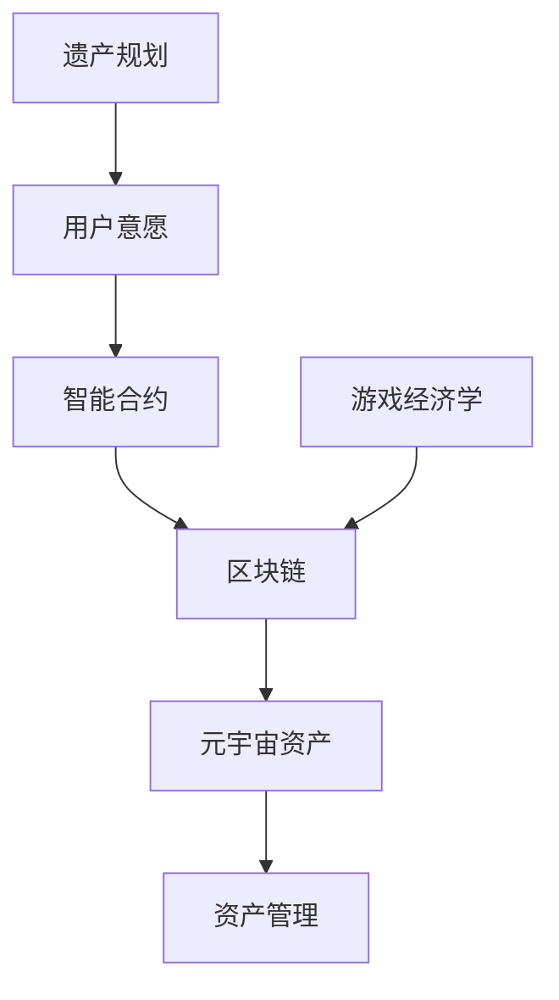

                 

# 元宇宙遗产规划师:虚拟资产传承的专业咨询服务

> 关键词：元宇宙, 虚拟资产, 遗产规划, 资产管理, 智能合约, NFT, 区块链, 游戏经济学

## 1. 背景介绍

在数字时代，人们的生活方式和价值观正在发生深刻变化。随着区块链、虚拟现实等技术的普及，一个全新的数字空间——元宇宙(Utopia)正逐渐浮现。元宇宙是一个平行于现实世界的虚拟空间，其中包含了各种虚拟资产，如NFT、虚拟土地、数字艺术品等。然而，这个新兴领域也面临着诸多挑战，尤其是虚拟资产的传承问题。

当前，大多数虚拟资产以智能合约的形式存储在区块链上，这给传统遗产规划带来了新的复杂性。传统的法律框架和工具难以直接应用于虚拟资产的管理和传承，亟需专业的咨询服务来解决这一问题。本文将深入探讨元宇宙中虚拟资产传承的关键问题，提出解决方案，为元宇宙遗产规划师提供指导。

## 2. 核心概念与联系

### 2.1 核心概念概述

元宇宙遗产规划涉及多个关键概念，包括：

- **元宇宙(Utopia)**：一个高度沉浸式、可互动的虚拟世界，包含大量虚拟资产和用户。
- **虚拟资产(NFTs)**：通过区块链技术验证的数字化资产，如虚拟土地、艺术品、游戏道具等。
- **遗产规划**：根据用户意愿，对遗产进行管理和传承的制度安排。
- **资产管理**：对虚拟资产进行存储、交易、分析和管理的系统工具。
- **智能合约**：一种自动执行、无需人工干预的合约，广泛应用于虚拟资产管理。
- **区块链**：一种分布式账本技术，保证数据的安全性和不可篡改性。
- **游戏经济学**：研究虚拟世界中的经济活动和规则。

这些概念通过智能合约和区块链技术联系在一起，形成一个复杂的虚拟资产生态系统。

### 2.2 核心概念原理和架构的 Mermaid 流程图



这个流程图展示了智能合约、区块链、元宇宙资产、资产管理、用户意愿、遗产规划和游戏经济学之间的关系。

## 3. 核心算法原理 & 具体操作步骤

### 3.1 算法原理概述

元宇宙遗产规划的核心算法原理是利用智能合约和区块链技术，实现对虚拟资产的自动管理和传承。其基本流程如下：

1. **智能合约编码**：根据用户意愿，编写智能合约，定义虚拟资产的管理和传承规则。
2. **区块链部署**：将智能合约部署到区块链网络，确保其可执行性和安全性。
3. **资产登记**：将虚拟资产登记到智能合约中，设定其所有权和管理规则。
4. **执行指令**：在用户或继承人触发指定条件时，智能合约自动执行资产传承、管理等操作。

### 3.2 算法步骤详解

#### 3.2.1 智能合约编码

智能合约的编码需要考虑以下几个方面：

- **权限控制**：定义虚拟资产的读写权限，确保只有授权用户才能进行相关操作。
- **条件触发**：设定资产传承的条件，如年龄、健康状态等。
- **执行逻辑**：定义资产传承、交易、分割等操作的执行逻辑。
- **记录存储**：确保所有操作都有记录，便于追溯和审计。

#### 3.2.2 区块链部署

区块链部署的步骤包括：

- **网络选择**：选择合适的区块链网络，如以太坊、Binance Smart Chain等。
- **合约测试**：在测试网络进行合约测试，确保其正常运行。
- **合约部署**：将测试通过的合约部署到主网络。
- **合约验证**：验证合约的正确性和安全性，确保其可执行。

#### 3.2.3 资产登记

资产登记的步骤包括：

- **资产验证**：验证虚拟资产的真实性和合法性。
- **合约调用**：调用智能合约，将资产登记到区块链上。
- **元数据记录**：记录资产的元数据，如创建时间、所有者信息等。

#### 3.2.4 执行指令

执行指令的步骤包括：

- **触发条件判断**：判断用户或继承人是否满足触发条件。
- **智能合约调用**：调用智能合约，执行资产传承、管理等操作。
- **结果记录**：记录操作结果，确保所有操作都有记录。

### 3.3 算法优缺点

#### 3.3.1 优点

1. **自动化**：智能合约自动执行传承和管理操作，减少了人工干预。
2. **安全性**：区块链保证了数据的安全性和不可篡改性，提高了资产管理的可信度。
3. **透明性**：所有操作都有记录，便于审计和追溯。
4. **灵活性**：可以根据用户意愿设定复杂的传承和管理规则。

#### 3.3.2 缺点

1. **技术门槛高**：需要编写和部署智能合约，对技术要求较高。
2. **复杂性**：处理复杂的传承和管理规则可能导致合约逻辑复杂。
3. **成本高**：部署和执行智能合约可能需要较高的费用。
4. **可扩展性**：大规模的元宇宙资产管理可能存在扩展性问题。

### 3.4 算法应用领域

元宇宙遗产规划技术可以应用于多个领域，包括但不限于：

- **个人资产管理**：个人虚拟资产的传承和管理。
- **企业资产管理**：企业虚拟资产的继承和分配。
- **游戏经济**：虚拟游戏中的资产管理。
- **数字艺术品收藏**：数字艺术品的传承和销售。
- **虚拟土地经营**：虚拟土地的管理和租赁。

## 4. 数学模型和公式 & 详细讲解 & 举例说明

### 4.1 数学模型构建

假设有一个虚拟资产A，其所有权为Alice，智能合约C将其管理。Alice设定了三个条件：若Alice年满60岁，且健康状态良好，则将资产A传承给Bob；若Alice去世，且Bob未继承，则将资产A传承给Charlie。

数学模型构建如下：

- **状态变量**：$S_t = (\text{Alice的年龄}, \text{Alice的健康状态}, \text{Bob已继承})$
- **转移条件**：$P_t \rightarrow P_{t+1}$ 的条件包括Alice的年龄、健康状态和Bob的继承状态。
- **转移规则**：$P_t \rightarrow P_{t+1}$ 的规则由智能合约C定义。

### 4.2 公式推导过程

智能合约C的逻辑如下：

- **条件判断**：判断Alice的年龄和健康状态是否满足条件。
- **状态转移**：根据条件，将状态从$P_t$转移到$P_{t+1}$。
- **执行操作**：执行对应的操作，如传承资产、更新记录等。

### 4.3 案例分析与讲解

假设Alice在55岁时健康状况良好，但未达到传承条件，智能合约C的状态如下：

- **当前状态**：$S_t = (55, \text{良好}, \text{未继承})$
- **下一个状态**：$S_{t+1} = (55+1, \text{良好}, \text{未继承})$

当Alice满60岁时，智能合约C检测到条件满足，执行传承操作：

- **当前状态**：$S_t = (60, \text{良好}, \text{未继承})$
- **下一个状态**：$S_{t+1} = (60+1, \text{良好}, \text{已继承})$

## 5. 项目实践：代码实例和详细解释说明

### 5.1 开发环境搭建

1. **安装Node.js**：
   ```bash
   brew install node
   ```

2. **安装Truffle**：
   ```bash
   npm install -g truffle
   ```

3. **安装Solidity编译器**：
   ```bash
   npm install -g solc
   ```

### 5.2 源代码详细实现

以下是智能合约的Solidity代码示例：

```solidity
pragma solidity ^0.8.0;

contract AssetManager {
    address public owner;
    address[] public beneficiaries;
    uint public age;
    bool public healthStatus;
    bool public isInherited;
    uint256 public assetId;
    
    event OwnerChanged(uint indexed _newOwner);
    event BeneficiaryAdded(address indexed _beneficiary);
    event BeneficiaryRemoved(address indexed _beneficiary);
    event AssetConveyed(uint indexed _beneficiary, uint256 _newAssetId);
    
    constructor(address[] memory _beneficiaries, uint256 _assetId) {
        beneficiaries = _beneficiaries;
        assetId = _assetId;
    }
    
    function addBeneficiary(address _beneficiary) public {
        require(!contains(beneficiaries, _beneficiary), "Beneficiary already exists.");
        beneficiaries.push(_beneficiary);
        emit BeneficiaryAdded(_beneficiary);
    }
    
    function removeBeneficiary(address _beneficiary) public {
        require(!contains(beneficiaries, _beneficiary), "Beneficiary does not exist.");
        beneficiaries.remove(_beneficiary);
        emit BeneficiaryRemoved(_beneficiary);
    }
    
    function setAgeAndHealthStatus(uint _age, bool _healthStatus) public {
        age = _age;
        healthStatus = _healthStatus;
    }
    
    function conveyAsset() public only(owner) {
        require(!isInherited, "Asset already conveyed.");
        require(age >= 60 && healthStatus, "Conditions not met.");
        uint newOwnerIndex = beneficiaryIndex(beneficiaries);
        address newOwner = beneficiary(newOwnerIndex);
        emit AssetConveyed(newOwner, assetId);
        isInherited = true;
    }
    
    function contains(address[] memory _array, address _element) private view returns(bool) {
        for (uint i = 0; i < _array.length; i++) {
            if (_array[i] == _element) {
                return true;
            }
        }
        return false;
    }
    
    function beneficiaryIndex(address[] memory _array) private view returns(uint) {
        require(_array.length > 0, "No beneficiaries.");
        require(isInherited, "Asset not conveyed.");
        for (uint i = 0; i < _array.length; i++) {
            if (_array[i] == msg.sender) {
                return i;
            }
        }
        return 0;
    }
}
```

### 5.3 代码解读与分析

**0x1 合约结构**：
- **构造函数**：初始化所有权者、受益人、资产ID等。
- **事件声明**：定义合约执行的事件。
- **函数声明**：包括添加受益人、移除受益人、设置年龄和健康状态、传承资产等。

**0x2 事件处理**：
- **addBeneficiary和removeBeneficiary**：添加和移除受益人，触发相应事件。
- **setAgeAndHealthStatus**：设置年龄和健康状态。
- **conveyAsset**：检测传承条件，执行传承操作，触发相应事件。

**0x3 辅助函数**：
- **contains和beneficiaryIndex**：辅助函数，用于判断元素是否存在，获取受益人索引。

### 5.4 运行结果展示

执行以下命令：

```bash
truffle develop
```

启动Truffle开发者环境，执行智能合约操作，查看结果。

## 6. 实际应用场景

### 6.1 个人资产管理

个人在元宇宙中拥有大量虚拟资产，如NFT艺术品、虚拟土地等。通过智能合约，个人可以设定传承规则，确保资产在特定条件下传承给指定受益人。例如，个人可以在其遗嘱中设定，若其去世且继承人未成年的情况下，将虚拟土地传承给监护人。

### 6.2 企业资产管理

企业可以在元宇宙中拥有虚拟资产，如虚拟工厂、虚拟设备等。通过智能合约，企业可以设定资产传承和管理规则，确保资产在特定条件下传承给指定受益人。例如，企业可以在其章程中设定，若CEO离职且未指定继承人，则将虚拟工厂传承给董事会指定的人员。

### 6.3 游戏经济

在游戏世界中，玩家拥有各种虚拟资产，如游戏装备、货币等。通过智能合约，玩家可以设定资产传承和管理规则，确保资产在特定条件下传承给指定受益人。例如，玩家可以在游戏内设定，若其角色死亡且未指定继承人，则将游戏装备传承给其好友。

### 6.4 数字艺术品收藏

数字艺术家在元宇宙中拥有大量数字艺术品。通过智能合约，艺术家可以设定艺术品传承和管理规则，确保艺术品在特定条件下传承给指定受益人。例如，艺术家可以在其合同中设定，若其去世且未指定继承人，则将数字艺术品传承给其指定的数字博物馆。

### 6.5 虚拟土地经营

虚拟土地是元宇宙中重要的资产类型，通过智能合约，土地所有者可以设定土地经营和管理规则，确保土地在特定条件下传承给指定受益人。例如，土地所有者可以在其租赁合同中设定，若其去世且未指定继承人，则将土地租赁权传承给其指定的继承人。

## 7. 工具和资源推荐

### 7.1 学习资源推荐

1. **《智能合约编程实战》**：
   - **简介**：本书系统介绍了Solidity编程语言和智能合约开发实战经验。
   - **推荐理由**：涵盖智能合约开发的各个方面，适合初学者和中级开发者。

2. **Truffle和Mist官方文档**：
   - **简介**：Truffle和Mist是流行的以太坊开发框架，提供完善的文档和教程。
   - **推荐理由**：适合学习和实践智能合约开发。

3. **Blockchain Basics with Solidity**：
   - **简介**：以太坊官方提供的Solidity入门课程，涵盖Solidity基础和智能合约开发。
   - **推荐理由**：适合初学者和中级开发者。

4. **Ethereum Yellow Paper**：
   - **简介**：以太坊白皮书，介绍了以太坊的技术细节和智能合约开发。
   - **推荐理由**：适合深入了解以太坊和智能合约。

### 7.2 开发工具推荐

1. **GitHub**：
   - **简介**：全球最大的代码托管平台，适合代码版本管理和共享。
   - **推荐理由**：适合存储和分享智能合约代码。

2. **Visual Studio Code**：
   - **简介**：微软推出的流行代码编辑器，支持Solidity开发。
   - **推荐理由**：界面友好，功能强大，适用于开发和调试。

3. **Remix IDE**：
   - **简介**：以太坊官方提供的开发环境，支持智能合约开发和调试。
   - **推荐理由**：与Truffle和Mist无缝集成，易于使用。

4. **Solidity IDE**：
   - **简介**：支持Solidity编程的集成开发环境，提供代码补全、语法高亮等功能。
   - **推荐理由**：适合智能合约开发和调试。

### 7.3 相关论文推荐

1. **"Solidity: A Language for Secure Smart Contracts and Decentralized Applications"**：
   - **作者**：Solidity团队。
   - **简介**：以太坊官方论文，介绍了Solidity语言的设计和实现。

2. **"On the Programming of Digital Economies: Legal Challenges and Opportunities"**：
   - **作者**：Laurence T. Canaan。
   - **简介**：探讨了元宇宙和数字经济中的法律挑战和机遇。

3. **"Smart Contracts in Blockchain: Theoretical Foundations and Challenges"**：
   - **作者**：Mario Juhasz。
   - **简介**：探讨了智能合约的理论基础和挑战。

## 8. 总结：未来发展趋势与挑战

### 8.1 研究成果总结

元宇宙遗产规划技术经过近年来的发展，已经取得了显著进展。通过智能合约和区块链技术，可以实现虚拟资产的自动化管理和传承。该技术在个人资产管理、企业资产管理、游戏经济、数字艺术品收藏、虚拟土地经营等领域具有广泛应用前景。

### 8.2 未来发展趋势

1. **技术成熟**：随着区块链和智能合约技术的不断进步，元宇宙遗产规划技术将更加成熟和可靠。
2. **用户体验提升**：未来的元宇宙遗产规划将更加注重用户体验，提供更加直观和易用的界面和工具。
3. **应用拓展**：未来将有更多元宇宙资产和应用场景引入遗产规划技术，如虚拟房地产、虚拟知识产权等。
4. **法律完善**：随着元宇宙的普及，相关法律体系也将逐步完善，为遗产规划提供更完善的保障。

### 8.3 面临的挑战

1. **技术复杂性**：智能合约和区块链技术复杂，需要开发者具备较高的技术水平。
2. **安全风险**：智能合约存在漏洞和攻击的风险，需要定期审计和维护。
3. **法律风险**：元宇宙资产的法律地位和保护措施尚未完全明确，可能存在法律风险。
4. **用户接受度**：用户对元宇宙遗产规划的接受度可能较低，需要更多教育和宣传。
5. **扩展性问题**：大规模元宇宙资产管理可能存在扩展性问题，需要优化技术架构。

### 8.4 研究展望

未来元宇宙遗产规划技术的研究方向包括：

1. **自动化合约设计**：开发智能合约生成工具，自动生成符合用户意愿的合约。
2. **安全性增强**：改进智能合约的安全性，减少漏洞和攻击的风险。
3. **法律合规性**：研究元宇宙资产的法律地位和保护措施，提供合规性解决方案。
4. **跨链交互**：实现不同区块链之间的资产转移和交互，提高兼容性。
5. **用户友好性**：提升元宇宙遗产规划的用户体验，提供更直观和易用的界面和工具。

## 9. 附录：常见问题与解答

**Q1：智能合约如何确保安全性和不可篡改性？**

A: 智能合约通常采用多种安全机制，如代码审计、多重签名、智能合约审计工具等，确保其安全性和不可篡改性。开发者需要进行严格的代码审计和测试，确保合约逻辑的正确性和安全性。

**Q2：智能合约中如何设定复杂的传承规则？**

A: 智能合约中的传承规则可以设定复杂的条件，如年龄、健康状态、特定事件等。开发者可以使用条件语句、函数调用等手段，实现复杂的传承逻辑。

**Q3：智能合约的执行效率如何？**

A: 智能合约的执行效率取决于其代码逻辑和区块链网络性能。开发者可以通过优化合约代码和部署策略，提升合约的执行效率。

**Q4：智能合约的扩展性如何？**

A: 智能合约的扩展性取决于其架构设计和编程语言特性。开发者需要考虑合约的可扩展性和兼容性，避免因扩展性问题导致的性能瓶颈。

**Q5：智能合约如何保护用户的隐私和权益？**

A: 智能合约可以设定隐私保护机制，如访问控制、数据加密等，保护用户的隐私和权益。开发者需要在合约设计中考虑隐私保护和权益保护问题。

**Q6：智能合约的维护和升级策略是什么？**

A: 智能合约的维护和升级需要严格的审计和验证过程，确保新版本的合约逻辑正确性和安全性。开发者可以使用多层审计、多轮测试等手段，确保合约的稳定性和可靠性。

---

作者：禅与计算机程序设计艺术 / Zen and the Art of Computer Programming

