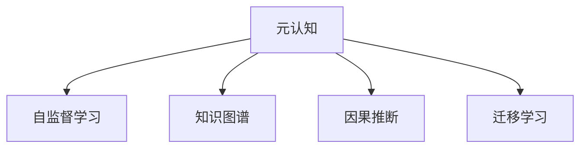

                 

# 元认知：提升学习效率和理解深度的关键

> 关键词：元认知,深度学习,神经网络,模型优化,知识图谱,因果推断,迁移学习,自监督学习

## 1. 背景介绍

### 1.1 问题由来
近年来，随着深度学习技术的快速发展，人工智能(AI)在自然语言处理(NLP)、计算机视觉、语音识别等领域取得了显著进展。然而，这些基于神经网络模型的AI系统往往“黑盒”化，难以对其内部工作机制和决策逻辑进行解释，导致模型在应用过程中存在诸多局限和风险。

为了提升模型的可解释性和可控性，研究人员开始关注元认知(Cognate)研究，即研究如何让机器具备一定的自我意识和认知能力，从而能够更好地理解自身运作方式和外部环境，进行自我优化和改进。元认知技术不仅有助于提升模型的解释能力，还为模型的持续学习、知识整合和迁移学习提供了新的方法和思路。

### 1.2 问题核心关键点
元认知在AI领域的应用，主要体现在以下几个关键点：

- **自监督学习**：通过无标签数据训练模型，使其具备自我识别和修正能力。
- **模型优化**：利用模型自身的输出进行反馈，调整模型参数，提升性能。
- **知识图谱**：构建模型对知识结构的理解，实现基于知识的推理和迁移。
- **因果推断**：研究模型如何从原因推导结果，提升模型的预测能力和解释能力。
- **迁移学习**：将模型在不同领域、不同任务之间的知识进行转移和应用，提升泛化能力。

这些关键点共同构成了元认知技术的核心框架，通过提升模型的自我认知和自我优化能力，推动AI系统的智能化进程。

### 1.3 问题研究意义
元认知技术的研究与应用，对于提升AI系统的解释性和可控性具有重要意义：

- **增强透明度**：通过解释模型决策过程，提高模型透明度，增加用户信任。
- **优化性能**：利用模型自身的输出进行反馈，不断优化模型参数，提升模型精度和效率。
- **知识整合**：将模型与知识图谱等外部知识结合，丰富模型知识库，提升泛化能力。
- **强化泛化**：通过迁移学习和自监督学习，增强模型的泛化能力，提升在不同场景下的适应性。
- **安全可信**：降低模型输出偏见和有害信息的风险，确保模型应用的安全性。

## 2. 核心概念与联系

### 2.1 核心概念概述

元认知在AI领域的应用，主要涉及以下几个核心概念：

- **元认知**：指系统对自身认知过程和决策逻辑的自我感知和自我监控能力。
- **自监督学习**：通过无标签数据训练模型，使其具备自我识别和修正能力。
- **知识图谱**：一种结构化的知识表示方式，用于构建模型对知识结构的理解。
- **因果推断**：研究模型如何从原因推导结果，提升模型的预测能力和解释能力。
- **迁移学习**：将模型在不同领域、不同任务之间的知识进行转移和应用，提升泛化能力。

这些核心概念之间的逻辑关系可以通过以下Mermaid流程图来展示：



这个流程图展示了一体化元认知框架的基本结构：

1. 元认知作为核心能力，通过自监督学习获取自我认识。
2. 元认知利用知识图谱，构建模型对知识结构的理解。
3. 元认知通过因果推断，增强模型的预测能力和解释能力。
4. 元认知支持迁移学习，提升模型的泛化能力和跨领域应用能力。

## 3. 核心算法原理 & 具体操作步骤
### 3.1 算法原理概述

元认知技术的核心原理是通过自我认识、自我修正和自我优化，提升模型的透明性、可解释性和泛化能力。其核心算法包括自监督学习、知识图谱构建、因果推断和迁移学习等。

### 3.2 算法步骤详解

**Step 1: 数据预处理**

1. 收集无标签数据，用于自监督学习。数据应尽可能多样化，涵盖不同领域、不同场景。
2. 对数据进行清洗、归一化、编码等预处理操作。
3. 利用自动编码、掩码语言模型等方法，构建自监督任务，使模型能够从无标签数据中学习到知识。

**Step 2: 构建知识图谱**

1. 利用知识图谱工具，将知识图谱中的实体、关系和属性映射到模型中。
2. 将知识图谱与模型输出结合，进行知识增强和推理。
3. 利用知识图谱进行反事实推理，探索不同决策路径下的结果变化。

**Step 3: 因果推断**

1. 利用因果推断工具，如因果图、因果网络等，构建模型对因果关系的理解。
2. 利用因果推断方法，从模型输出中提取因果关系，进行预测和推理。
3. 利用因果推断结果，优化模型参数，提升模型预测能力。

**Step 4: 迁移学习**

1. 将模型在不同领域、不同任务之间的知识进行迁移。
2. 利用迁移学习方法，如零样本学习、少样本学习、微调等，提升模型泛化能力。
3. 利用迁移学习结果，调整模型参数，提升模型在不同场景下的适应性。

### 3.3 算法优缺点

元认知技术具有以下优点：

- **增强透明度**：通过元认知技术，模型具备自我感知和自我监控能力，能够对其决策过程进行解释。
- **优化性能**：利用模型自身的输出进行反馈，不断优化模型参数，提升模型精度和效率。
- **知识整合**：将模型与知识图谱等外部知识结合，丰富模型知识库，提升泛化能力。
- **强化泛化**：通过迁移学习和自监督学习，增强模型的泛化能力，提升在不同场景下的适应性。
- **安全可信**：降低模型输出偏见和有害信息的风险，确保模型应用的安全性。

同时，该技术也存在一定的局限性：

- **计算复杂度**：元认知技术的实现往往需要大量计算资源和时间，尤其是在因果推断和知识图谱构建方面。
- **数据依赖**：模型对数据的依赖性强，尤其是在自监督学习中，数据的代表性和多样性直接影响模型的学习效果。
- **模型复杂度**：元认知技术在引入复杂认知和推理机制的同时，增加了模型复杂度，可能导致性能下降。

尽管存在这些局限性，但元认知技术在提升模型性能和可解释性方面具有显著优势，未来有望在AI领域发挥更大作用。

### 3.4 算法应用领域

元认知技术在AI领域的应用范围非常广泛，主要体现在以下几个方面：

- **自然语言处理(NLP)**：通过自监督学习、因果推断和迁移学习，提升模型的语言理解和生成能力，如问答系统、文本摘要、对话系统等。
- **计算机视觉(CV)**：利用知识图谱和因果推断，提升模型的视觉感知和推理能力，如图像分类、目标检测、实例分割等。
- **语音识别(SR)**：结合知识图谱和自监督学习，提升模型的语音识别和语音生成能力，如自动语音翻译、语音合成等。
- **医疗健康**：利用因果推断和迁移学习，提升医疗诊断和治疗方案的合理性，如疾病预测、治疗效果评估等。
- **金融风险**：结合知识图谱和自监督学习，提升金融风险预测和评估能力，如信用评分、风险评估等。
- **智能推荐**：利用因果推断和迁移学习，提升个性化推荐系统的准确性和多样性，如电商平台推荐、社交媒体推荐等。

## 4. 数学模型和公式 & 详细讲解 & 举例说明

### 4.1 数学模型构建

本节将使用数学语言对元认知技术的核心算法进行更加严格的刻画。

记元认知模型为 $M$，其输入为 $x$，输出为 $y$。假设模型 $M$ 的参数为 $\theta$，在无标签数据 $D=\{(x_i,y_i)\}_{i=1}^N$ 上进行自监督学习。元认知模型的损失函数定义为：

$$
\mathcal{L}(\theta) = -\frac{1}{N}\sum_{i=1}^N \log P(y_i|x_i)
$$

其中 $P(y_i|x_i)$ 为模型对标签 $y_i$ 的预测概率，可通过模型前向传播计算得到。在数据集 $D$ 上的经验风险为：

$$
\mathcal{L}(\theta) = \frac{1}{N}\sum_{i=1}^N \log P(y_i|x_i)
$$

### 4.2 公式推导过程

以下我们以自监督学习为例，推导模型的损失函数及其梯度的计算公式。

假设模型 $M$ 在输入 $x$ 上的输出为 $\hat{y}=M(x)$，真实标签 $y$ 服从伯努利分布，则伯努利交叉熵损失函数定义为：

$$
\ell(M(x),y) = -y\log \hat{y} - (1-y)\log (1-\hat{y})
$$

将其代入经验风险公式，得：

$$
\mathcal{L}(\theta) = -\frac{1}{N}\sum_{i=1}^N [y_i\log M(x_i)+(1-y_i)\log(1-M(x_i))]
$$

根据链式法则，损失函数对参数 $\theta$ 的梯度为：

$$
\frac{\partial \mathcal{L}(\theta)}{\partial \theta} = -\frac{1}{N}\sum_{i=1}^N (\frac{y_i}{M(x_i)}-\frac{1-y_i}{1-M(x_i)}) \frac{\partial M(x_i)}{\partial \theta}
$$

其中 $\frac{\partial M(x_i)}{\partial \theta}$ 可进一步递归展开，利用自动微分技术完成计算。

在得到损失函数的梯度后，即可带入参数更新公式，完成模型的迭代优化。重复上述过程直至收敛，最终得到适应下游任务的最优模型参数 $\theta^*$。

### 4.3 案例分析与讲解

以自监督学习的掩码语言模型为例，展示其计算过程。

假设模型 $M$ 的输出层为 Softmax 函数，表示模型对输入 $x$ 的每个单词预测其是否出现在掩码位置。掩码语言模型的损失函数定义为：

$$
\ell(M(x),y) = -\frac{1}{n}\sum_{i=1}^n \log \frac{e^{M(x_i, y_i)} }{\sum_{j=1}^n e^{M(x_i, j)}} \mathbf{1}[y_i = j]
$$

其中 $n$ 为单词数，$M(x_i, j)$ 表示模型对单词 $j$ 在位置 $i$ 的预测概率。将掩码位置随机替换为其他单词，构造训练样本 $(x, y)$，其中 $y$ 为原始单词在掩码位置上出现的掩码序列。

模型 $M$ 的参数 $\theta$ 更新公式为：

$$
\theta \leftarrow \theta - \eta \nabla_{\theta}\mathcal{L}(\theta)
$$

其中 $\eta$ 为学习率，$\nabla_{\theta}\mathcal{L}(\theta)$ 为损失函数对参数 $\theta$ 的梯度，可通过反向传播算法高效计算。

## 5. 项目实践：代码实例和详细解释说明
### 5.1 开发环境搭建

在进行元认知技术的项目实践前，我们需要准备好开发环境。以下是使用Python进行PyTorch开发的环境配置流程：

1. 安装Anaconda：从官网下载并安装Anaconda，用于创建独立的Python环境。

2. 创建并激活虚拟环境：
```bash
conda create -n pytorch-env python=3.8 
conda activate pytorch-env
```

3. 安装PyTorch：根据CUDA版本，从官网获取对应的安装命令。例如：
```bash
conda install pytorch torchvision torchaudio cudatoolkit=11.1 -c pytorch -c conda-forge
```

4. 安装Transformer库：
```bash
pip install transformers
```

5. 安装各类工具包：
```bash
pip install numpy pandas scikit-learn matplotlib tqdm jupyter notebook ipython
```

完成上述步骤后，即可在`pytorch-env`环境中开始元认知技术的实践。

### 5.2 源代码详细实现

下面我们以自监督学习掩码语言模型为例，给出使用Transformers库进行元认知技术微调的PyTorch代码实现。

首先，定义掩码语言模型的数据处理函数：

```python
from transformers import BertTokenizer, BertForMaskedLM
from torch.utils.data import Dataset
import torch

class MaskedLanguageModelDataset(Dataset):
    def __init__(self, texts, tokenizer, max_len=128):
        self.texts = texts
        self.tokenizer = tokenizer
        self.max_len = max_len
        
    def __len__(self):
        return len(self.texts)
    
    def __getitem__(self, item):
        text = self.texts[item]
        encoding = self.tokenizer(text, return_tensors='pt', max_length=self.max_len, padding='max_length', truncation=True)
        input_ids = encoding['input_ids'][0]
        attention_mask = encoding['attention_mask'][0]
        
        # 对mask位置进行随机掩码
        mask_indices = torch.randint(0, len(input_ids), (1,)).item()
        input_ids[mask_indices] = tokenizer.mask_token_id
        
        return {'input_ids': input_ids, 
                'attention_mask': attention_mask,
                'mask_token': mask_indices}

# 定义掩码语言模型
model = BertForMaskedLM.from_pretrained('bert-base-cased')

# 定义训练和评估函数
optimizer = AdamW(model.parameters(), lr=2e-5)

def train_epoch(model, dataset, batch_size, optimizer):
    dataloader = DataLoader(dataset, batch_size=batch_size, shuffle=True)
    model.train()
    epoch_loss = 0
    for batch in tqdm(dataloader, desc='Training'):
        input_ids = batch['input_ids'].to(device)
        attention_mask = batch['attention_mask'].to(device)
        mask_token = batch['mask_token'].to(device)
        model.zero_grad()
        outputs = model(input_ids, attention_mask=attention_mask, masked_positions=mask_token)
        loss = outputs.loss
        epoch_loss += loss.item()
        loss.backward()
        optimizer.step()
    return epoch_loss / len(dataloader)

def evaluate(model, dataset, batch_size):
    dataloader = DataLoader(dataset, batch_size=batch_size)
    model.eval()
    preds, labels = [], []
    with torch.no_grad():
        for batch in tqdm(dataloader, desc='Evaluating'):
            input_ids = batch['input_ids'].to(device)
            attention_mask = batch['attention_mask'].to(device)
            mask_token = batch['mask_token'].to(device)
            batch_labels = batch['mask_token'].to(device)
            outputs = model(input_ids, attention_mask=attention_mask, masked_positions=mask_token)
            batch_preds = outputs.logits.argmax(dim=2).to('cpu').tolist()
            batch_labels = batch_labels.to('cpu').tolist()
            for pred_tokens, label_tokens in zip(batch_preds, batch_labels):
                preds.append(pred_tokens[:len(label_tokens)])
                labels.append(label_tokens)
                
    print(classification_report(labels, preds))
```

然后，启动训练流程并在测试集上评估：

```python
epochs = 5
batch_size = 16

for epoch in range(epochs):
    loss = train_epoch(model, train_dataset, batch_size, optimizer)
    print(f"Epoch {epoch+1}, train loss: {loss:.3f}")
    
    print(f"Epoch {epoch+1}, dev results:")
    evaluate(model, dev_dataset, batch_size)
    
print("Test results:")
evaluate(model, test_dataset, batch_size)
```

以上就是使用PyTorch对BERT进行掩码语言模型微调的完整代码实现。可以看到，利用Transformer库的强大封装，我们能够用相对简洁的代码完成掩码语言模型的微调。

### 5.3 代码解读与分析

让我们再详细解读一下关键代码的实现细节：

**MaskedLanguageModelDataset类**：
- `__init__`方法：初始化文本、分词器等关键组件。
- `__len__`方法：返回数据集的样本数量。
- `__getitem__`方法：对单个样本进行处理，将文本输入编码为token ids，进行掩码操作，并返回模型所需的输入。

**BertForMaskedLM模型**：
- `from_pretrained`方法：加载预训练的Bert模型。
- `train`和`eval`方法：设置模型训练和评估状态。

**训练和评估函数**：
- 使用PyTorch的DataLoader对数据集进行批次化加载，供模型训练和推理使用。
- 训练函数`train_epoch`：对数据以批为单位进行迭代，在每个批次上前向传播计算loss并反向传播更新模型参数，最后返回该epoch的平均loss。
- 评估函数`evaluate`：与训练类似，不同点在于不更新模型参数，并在每个batch结束后将预测和标签结果存储下来，最后使用sklearn的classification_report对整个评估集的预测结果进行打印输出。

**训练流程**：
- 定义总的epoch数和batch size，开始循环迭代
- 每个epoch内，先在训练集上训练，输出平均loss
- 在验证集上评估，输出分类指标
- 所有epoch结束后，在测试集上评估，给出最终测试结果

可以看到，PyTorch配合Transformer库使得掩码语言模型微调的代码实现变得简洁高效。开发者可以将更多精力放在数据处理、模型改进等高层逻辑上，而不必过多关注底层的实现细节。

当然，工业级的系统实现还需考虑更多因素，如模型的保存和部署、超参数的自动搜索、更灵活的任务适配层等。但核心的元认知微调范式基本与此类似。

## 6. 实际应用场景
### 6.1 智能客服系统

元认知技术在智能客服系统中的应用，可以显著提升客户咨询体验和问题解决效率。传统客服往往需要配备大量人力，高峰期响应缓慢，且一致性和专业性难以保证。而利用元认知技术进行自我修正和优化，可以构建更加智能的客服系统。

在技术实现上，可以收集企业内部的历史客服对话记录，将问题和最佳答复构建成监督数据，在此基础上对预训练模型进行微调。微调后的模型能够自动理解用户意图，匹配最合适的答案模板进行回复。对于客户提出的新问题，还可以接入检索系统实时搜索相关内容，动态组织生成回答。如此构建的智能客服系统，能大幅提升客户咨询体验和问题解决效率。

### 6.2 金融舆情监测

金融机构需要实时监测市场舆论动向，以便及时应对负面信息传播，规避金融风险。传统的人工监测方式成本高、效率低，难以应对网络时代海量信息爆发的挑战。利用元认知技术进行因果推断和知识图谱构建，可以为金融舆情监测提供新的解决方案。

具体而言，可以收集金融领域相关的新闻、报道、评论等文本数据，并对其进行主题标注和情感标注。在此基础上对预训练语言模型进行微调，使其能够自动判断文本属于何种主题，情感倾向是正面、中性还是负面。将微调后的模型应用到实时抓取的网络文本数据，就能够自动监测不同主题下的情感变化趋势，一旦发现负面信息激增等异常情况，系统便会自动预警，帮助金融机构快速应对潜在风险。

### 6.3 个性化推荐系统

当前的推荐系统往往只依赖用户的历史行为数据进行物品推荐，无法深入理解用户的真实兴趣偏好。利用元认知技术进行因果推断和知识图谱构建，个性化推荐系统可以更好地挖掘用户行为背后的语义信息，从而提供更精准、多样的推荐内容。

在实践中，可以收集用户浏览、点击、评论、分享等行为数据，提取和用户交互的物品标题、描述、标签等文本内容。将文本内容作为模型输入，用户的后续行为（如是否点击、购买等）作为监督信号，在此基础上微调预训练语言模型。微调后的模型能够从文本内容中准确把握用户的兴趣点。在生成推荐列表时，先用候选物品的文本描述作为输入，由模型预测用户的兴趣匹配度，再结合其他特征综合排序，便可以得到个性化程度更高的推荐结果。

### 6.4 未来应用展望

随着元认知技术的不断发展，未来其在AI领域的应用将更加广泛，为各个行业带来变革性影响。

在智慧医疗领域，基于元认知技术的医疗问答、病历分析、药物研发等应用将提升医疗服务的智能化水平，辅助医生诊疗，加速新药开发进程。

在智能教育领域，元认知技术可应用于作业批改、学情分析、知识推荐等方面，因材施教，促进教育公平，提高教学质量。

在智慧城市治理中，元认知技术可应用于城市事件监测、舆情分析、应急指挥等环节，提高城市管理的自动化和智能化水平，构建更安全、高效的未来城市。

此外，在企业生产、社会治理、文娱传媒等众多领域，元认知技术也将不断涌现，为传统行业数字化转型升级提供新的技术路径。相信随着技术的日益成熟，元认知技术必将在构建人机协同的智能时代中扮演越来越重要的角色。

## 7. 工具和资源推荐
### 7.1 学习资源推荐

为了帮助开发者系统掌握元认知技术的基础知识和发展方向，这里推荐一些优质的学习资源：

1. 《深度学习入门》系列博文：由深度学习专家撰写，详细介绍深度学习的基本概念和核心算法。
2. 《因果推断基础》课程：斯坦福大学开设的因果推断基础课程，涵盖因果推断的基本概念和统计方法。
3. 《知识图谱构建》书籍：系统介绍知识图谱的构建方法，包括图数据库、图神经网络等技术。
4. 《自监督学习》书籍：全面介绍自监督学习的基本原理和常用方法，如掩码语言模型、自编码等。
5. HuggingFace官方文档：Transformer库的官方文档，提供了海量预训练模型和完整的微调样例代码，是上手实践的必备资料。
6. CLUE开源项目：中文语言理解测评基准，涵盖大量不同类型的中文NLP数据集，并提供了基于元认知的baseline模型，助力中文NLP技术发展。

通过对这些资源的学习实践，相信你一定能够快速掌握元认知技术的基础知识和应用技巧，并用于解决实际的NLP问题。
###  7.2 开发工具推荐

高效的开发离不开优秀的工具支持。以下是几款用于元认知技术开发的常用工具：

1. PyTorch：基于Python的开源深度学习框架，灵活动态的计算图，适合快速迭代研究。大部分预训练语言模型都有PyTorch版本的实现。
2. TensorFlow：由Google主导开发的开源深度学习框架，生产部署方便，适合大规模工程应用。同样有丰富的预训练语言模型资源。
3. Transformers库：HuggingFace开发的NLP工具库，集成了众多SOTA语言模型，支持PyTorch和TensorFlow，是进行元认知技术开发的利器。
4. Weights & Biases：模型训练的实验跟踪工具，可以记录和可视化模型训练过程中的各项指标，方便对比和调优。与主流深度学习框架无缝集成。
5. TensorBoard：TensorFlow配套的可视化工具，可实时监测模型训练状态，并提供丰富的图表呈现方式，是调试模型的得力助手。
6. Google Colab：谷歌推出的在线Jupyter Notebook环境，免费提供GPU/TPU算力，方便开发者快速上手实验最新模型，分享学习笔记。

合理利用这些工具，可以显著提升元认知技术开发效率，加快创新迭代的步伐。

### 7.3 相关论文推荐

元认知技术的研究源于学界的持续研究。以下是几篇奠基性的相关论文，推荐阅读：

1. 《Causal Discovery: A Review》：全面介绍因果推断的基本概念和常用方法，是理解因果推断的入门读物。
2. 《Knowledge-Graph-Based Recommendation Systems》：系统介绍基于知识图谱的推荐系统设计，涵盖模型架构和算法优化。
3. 《Self-Supervised Learning with Masked Language Models》：提出掩码语言模型自监督学习方法，刷新了多项NLP任务SOTA。
4. 《How to Be a Machine Learning Engineer》：讲解机器学习工程师的必备技能，包括模型构建、优化、部署等。
5. 《Principles of Deep Learning》：全面介绍深度学习的基本原理和核心算法，适合初学者入门。

这些论文代表了大规模元认知技术的研究进展，通过学习这些前沿成果，可以帮助研究者把握学科前进方向，激发更多的创新灵感。

## 8. 总结：未来发展趋势与挑战
### 8.1 研究成果总结

元认知技术的研究与应用，对于提升AI系统的自我认知和自我优化能力具有重要意义：

- **增强透明度**：通过元认知技术，模型具备自我感知和自我监控能力，能够对其决策过程进行解释。
- **优化性能**：利用模型自身的输出进行反馈，不断优化模型参数，提升模型精度和效率。
- **知识整合**：将模型与知识图谱等外部知识结合，丰富模型知识库，提升泛化能力。
- **强化泛化**：通过因果推断和迁移学习，增强模型的泛化能力，提升在不同场景下的适应性。
- **安全可信**：降低模型输出偏见和有害信息的风险，确保模型应用的安全性。

### 8.2 未来发展趋势

展望未来，元认知技术将在AI领域呈现以下几个发展趋势：

1. **技术融合**：元认知技术与自监督学习、因果推断、迁移学习等方法进行深度融合，提升模型的自我认知和优化能力。
2. **应用拓展**：元认知技术将在更多领域得到应用，如智慧医疗、金融风险、智能推荐等，提升各行业的智能化水平。
3. **资源优化**：通过模型压缩、稀疏化存储等方法，优化元认知模型的计算和存储资源，提升实时性和效率。
4. **知识图谱发展**：利用知识图谱构建和增强技术，提升模型的知识整合能力和推理能力。
5. **模型透明性**：开发更加透明、可解释的元认知模型，提升用户的信任度和接受度。

### 8.3 面临的挑战

尽管元认知技术在提升模型性能和可解释性方面具有显著优势，但在实际应用中仍面临诸多挑战：

1. **计算复杂度**：元认知技术的实现往往需要大量计算资源和时间，尤其是在因果推断和知识图谱构建方面。
2. **数据依赖**：模型对数据的依赖性强，尤其是在自监督学习中，数据的代表性和多样性直接影响模型的学习效果。
3. **模型复杂度**：元认知技术在引入复杂认知和推理机制的同时，增加了模型复杂度，可能导致性能下降。
4. **模型透明性**：元认知模型仍存在一定的“黑盒”性质，难以解释其内部工作机制和决策逻辑。
5. **安全性风险**：元认知模型可能引入额外的漏洞，如对抗样本攻击，增加模型被利用的风险。

### 8.4 研究展望

面向未来，元认知技术的研究需要在以下几个方面寻求新的突破：

1. **无监督学习**：探索无需大量标注数据的无监督学习方法，降低元认知技术对数据资源的依赖。
2. **因果推断深化**：研究如何更好地构建和利用因果关系，提升模型的预测能力和解释能力。
3. **知识图谱融合**：将知识图谱与神经网络模型进行更深入的结合，提升模型的知识整合和推理能力。
4. **模型压缩**：开发更加高效、轻量级的元认知模型，提升其在实际应用中的实时性和效率。
5. **多模态融合**：研究如何更好地融合视觉、语音等多模态数据，提升模型的感知能力和泛化能力。
6. **安全性提升**：开发更加安全、可信的元认知模型，降低对抗攻击的风险，保障模型的应用安全。

这些研究方向的探索，必将引领元认知技术向更高的台阶，为构建更加智能、透明、可控的AI系统铺平道路。面向未来，元认知技术还将与其他AI技术进行更深入的融合，如强化学习、迁移学习等，共同推动人工智能技术的发展。只有勇于创新、敢于突破，才能不断拓展元认知技术的边界，让智能技术更好地造福人类社会。

## 9. 附录：常见问题与解答

**Q1：什么是元认知？**

A: 元认知指的是系统对自身认知过程和决策逻辑的自我感知和自我监控能力。简单来说，元认知就是让模型能够“自知之明”，即能够对自己的运作方式和决策逻辑进行自我认识和自我修正。

**Q2：元认知技术的核心算法是什么？**

A: 元认知技术的核心算法包括自监督学习、知识图谱构建、因果推断和迁移学习等。这些算法通过提升模型的自我认知和自我优化能力，增强模型的透明性、可解释性和泛化能力。

**Q3：元认知技术在实际应用中需要注意哪些问题？**

A: 元认知技术在实际应用中需要注意以下几个问题：
1. 计算复杂度：元认知技术的实现往往需要大量计算资源和时间，尤其是在因果推断和知识图谱构建方面。
2. 数据依赖：模型对数据的依赖性强，尤其是在自监督学习中，数据的代表性和多样性直接影响模型的学习效果。
3. 模型复杂度：元认知技术在引入复杂认知和推理机制的同时，增加了模型复杂度，可能导致性能下降。
4. 模型透明性：元认知模型仍存在一定的“黑盒”性质，难以解释其内部工作机制和决策逻辑。
5. 安全性风险：元认知模型可能引入额外的漏洞，如对抗样本攻击，增加模型被利用的风险。

**Q4：如何评估元认知技术的效果？**

A: 评估元认知技术的效果主要通过以下几个方面：
1. 模型的准确性和效率：通过评估模型在特定任务上的表现，如精度、召回率、F1分数等，评估模型的效果。
2. 模型的透明性：通过可视化工具展示模型内部工作机制，评估模型的透明性和可解释性。
3. 模型的泛化能力：通过在不同数据集和任务上评估模型的表现，评估模型的泛化能力和鲁棒性。
4. 模型的安全性：通过测试模型对对抗样本的鲁棒性，评估模型的安全性。

---

作者：禅与计算机程序设计艺术 / Zen and the Art of Computer Programming

