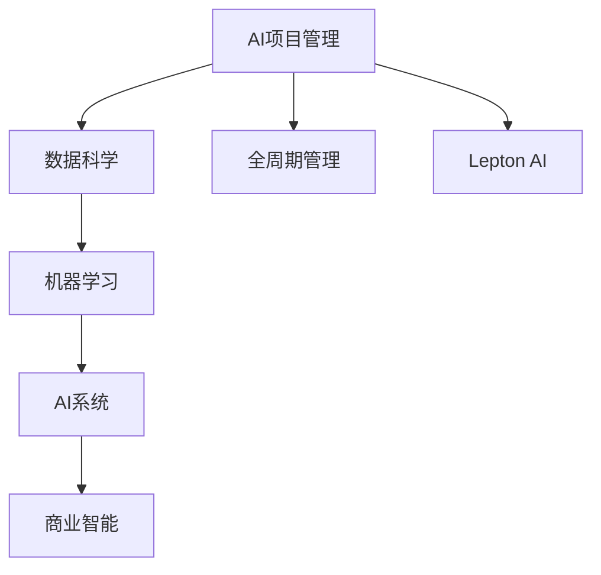

                 

# 全周期AI项目管理：Lepton AI的服务体系

> 关键词：AI项目管理, 全周期管理, Lepton AI, 数据科学, 机器学习, AI系统, 商业智能(BI)

## 1. 背景介绍

### 1.1 问题由来

近年来，随着人工智能技术的快速发展，AI项目管理和决策成为了企业的核心竞争力之一。AI项目往往涉及复杂的数据处理、模型构建、算法优化等多个环节，这些环节相互依赖、交叉，且项目周期长、变化快，如何高效管理这些环节，成为众多企业面临的挑战。特别是，随着AI技术的不断成熟和商业化应用的需求日益增强，AI项目从研发到生产再到运营的全周期管理变得更加复杂和必要。

为应对这一挑战，Lepton AI提出并实施了一套涵盖AI项目全生命周期的管理和服务体系，旨在通过系统化、标准化的流程，高效、可靠地实现AI项目的研发、生产、运营。该服务体系不仅覆盖了数据获取、预处理、模型训练、评估、部署、监控等各个环节，还引入了自动化、标准化、智能化的管理工具，有效提升了AI项目管理的效率和质量。

## 2. 核心概念与联系

### 2.1 核心概念概述

Lepton AI的全周期AI项目管理服务体系，包括但不限于以下关键概念：

- **AI项目管理**：指利用项目管理系统（PMIS）、任务调度系统、版本控制系统等工具，对AI项目进行立项、规划、执行、监控和评估的管理过程。
- **全周期管理**：覆盖AI项目从研发到生产再到运营的全生命周期，包括数据获取、预处理、模型构建、评估、部署、监控等环节。
- **Lepton AI**：一家专注于提供AI项目管理和服务的科技公司，其服务体系旨在通过高效、智能的管理手段，实现AI项目的高质量交付。
- **数据科学**：指从原始数据中提取信息、知识，并用于支持决策和预测的学科。AI项目管理中的数据科学侧重于数据获取、清洗、处理和分析。
- **机器学习**：指使用数据和算法训练模型，从数据中学习规律，并用于预测和决策。AI项目管理中的机器学习侧重于模型构建、训练、优化和评估。
- **AI系统**：指包含数据获取、处理、模型构建、推理等功能的系统，用于解决实际问题。AI项目管理中的AI系统侧重于系统部署、运维和优化。
- **商业智能(BI)**：指利用数据和分析技术，支持企业决策和运营的智能服务。AI项目管理中的BI侧重于基于AI模型的运营分析、监控和决策支持。

这些核心概念之间的逻辑关系可以通过以下Mermaid流程图来展示：



这个流程图展示了大语言模型的核心概念及其之间的关系：

1. AI项目管理是整个体系的基础，通过系统化的管理流程，确保每个环节高效运转。
2. 数据科学和机器学习是AI项目研发的核心技术，用于数据处理和模型构建。
3. AI系统是应用技术，将数据科学和机器学习成果应用于实际问题解决。
4. 商业智能是AI系统应用和管理的延伸，用于支持企业决策和运营。
5. Lepton AI是服务体系的技术提供方，负责系统的开发和应用。
6. 全周期管理贯穿AI项目研发、生产和运营的全过程，确保每个环节高效、可靠。

## 3. 核心算法原理 & 具体操作步骤

### 3.1 算法原理概述

Lepton AI的全周期AI项目管理服务体系，涉及多个关键算法和技术，主要包括数据管理、模型管理、任务调度、版本控制、指标监控等。其中，数据管理和模型管理是核心，任务调度和版本控制是基础，指标监控是保障。

- **数据管理**：指通过数据治理、数据清洗、数据标注等技术，确保数据的质量和一致性，为AI模型提供可靠的数据基础。
- **模型管理**：指通过模型训练、模型评估、模型优化等技术，确保模型的准确性和可靠性，为AI系统提供高质量的预测和推理能力。
- **任务调度**：指通过任务管理和任务调度系统，确保AI项目中每个环节的按期执行和高效协同。
- **版本控制**：指通过版本控制系统和流水线工具，确保模型和代码的版本一致性，避免版本冲突和错误。
- **指标监控**：指通过指标监控系统，实时监控AI系统的性能和健康状况，及时发现和解决问题。

### 3.2 算法步骤详解

Lepton AI的全周期AI项目管理服务体系主要包括以下几个关键步骤：

**Step 1: 项目立项与需求分析**

- 根据企业战略目标和市场需求，进行项目立项。
- 收集和分析项目需求，明确项目目标和范围。
- 评估项目可行性，制定项目计划和时间表。

**Step 2: 数据获取与预处理**

- 收集所需数据，并进行数据清洗、处理和标注。
- 建立数据管理和治理机制，确保数据质量和一致性。
- 进行数据探索性分析，识别数据模式和异常。

**Step 3: 模型构建与训练**

- 根据项目需求选择合适的模型框架和算法。
- 收集和标注模型训练数据，建立训练集、验证集和测试集。
- 使用自动化工具构建和训练模型，优化模型参数和结构。

**Step 4: 模型评估与优化**

- 使用测试集对训练好的模型进行评估，衡量模型性能。
- 根据评估结果，优化模型架构和参数，提高模型准确性和泛化能力。
- 进行A/B测试，选择最优模型进行部署。

**Step 5: 模型部署与监控**

- 将训练好的模型部署到生产环境，建立数据管道和推理服务。
- 实时监控模型性能和系统健康状况，及时发现和解决问题。
- 定期进行模型维护和更新，确保模型适应数据分布的变化。

**Step 6: 项目交付与运营**

- 完成项目交付，确保项目成果满足业务需求。
- 建立AI系统的运维机制，确保系统稳定运行。
- 持续优化和改进系统，提升AI系统的价值和效果。

### 3.3 算法优缺点

Lepton AI的全周期AI项目管理服务体系具有以下优点：

1. **系统化管理**：通过全周期的标准化流程，确保每个环节高效、可靠。
2. **自动化工具**：利用自动化工具提升项目管理效率，减少人工干预和错误。
3. **智能监控**：通过实时监控和问题预警，及时发现和解决系统问题。
4. **模块化设计**：模块化设计使系统易于扩展和定制，满足不同项目需求。
5. **高效协同**：通过任务调度系统，确保团队高效协同工作。

同时，该体系也存在一定的局限性：

1. **资源投入大**：高质量的数据管理和模型训练需要大量的资源投入。
2. **技术复杂**：涉及多个技术环节，需要具备跨学科知识。
3. **迭代时间长**：每个环节的迭代可能需要较长时间，影响项目进度。
4. **变化响应慢**：在项目需求变化时，需要重新调整计划和流程。
5. **人员依赖强**：依赖具有深厚技术背景和项目管理经验的人员。

尽管存在这些局限性，但Lepton AI的全周期AI项目管理服务体系仍然代表了当前AI项目管理的先进水平，为企业的AI项目提供了可靠、高效的管理保障。

### 3.4 算法应用领域

Lepton AI的全周期AI项目管理服务体系广泛应用于多个领域，包括但不限于：

1. **金融领域**：利用AI进行风险评估、欺诈检测、智能投顾等。
2. **医疗领域**：利用AI进行疾病诊断、治疗方案推荐、患者监护等。
3. **零售领域**：利用AI进行需求预测、库存管理、个性化推荐等。
4. **制造领域**：利用AI进行质量检测、故障诊断、生产优化等。
5. **物流领域**：利用AI进行路线规划、配送优化、客户服务等。
6. **安全领域**：利用AI进行异常检测、行为分析、事件预测等。

## 4. 数学模型和公式 & 详细讲解 & 举例说明

### 4.1 数学模型构建

Lepton AI的全周期AI项目管理服务体系，涉及多个数学模型，包括但不限于：

- **数据管理模型**：用于数据清洗、处理和标注，确保数据质量。
- **模型训练模型**：用于模型构建、训练和优化，提高模型性能。
- **任务调度模型**：用于任务管理和调度，确保高效协同。
- **版本控制模型**：用于版本管理和控制，确保一致性。
- **指标监控模型**：用于性能监控和预警，确保系统健康。

### 4.2 公式推导过程

以下我们以模型训练模型为例，推导模型训练的数学公式。

假设模型为 $M(x, w)$，输入为 $x \in \mathbb{R}^n$，权重为 $w \in \mathbb{R}^m$。训练数据的损失函数为 $L(M(x, w), y)$，其中 $y \in \mathbb{R}$ 为真实标签。训练目标是最小化损失函数，即：

$$
\min_{w} \sum_{i=1}^N L(M(x_i, w), y_i)
$$

常见的损失函数包括均方误差（MSE）、交叉熵（Cross-Entropy）、对数损失（Log-Loss）等。以均方误差为例，其公式为：

$$
L(M(x, w), y) = \frac{1}{2}(x - M(x, w))^2
$$

其中 $(x_i, y_i)$ 为第 $i$ 个样本的输入和标签。

根据梯度下降算法，模型的更新公式为：

$$
w \leftarrow w - \eta \nabla_{w}L(M(x, w), y)
$$

其中 $\eta$ 为学习率，$\nabla_{w}L(M(x, w), y)$ 为损失函数对权重的梯度。

### 4.3 案例分析与讲解

以金融领域的信用评分模型为例，说明Lepton AI的全周期AI项目管理服务体系如何应用。

**Step 1: 项目立项与需求分析**

- 项目目标是构建一个高效的信用评分模型，用于评估客户的信用风险。
- 需求包括数据收集、模型构建、模型训练、模型评估、模型部署等。

**Step 2: 数据获取与预处理**

- 收集客户的个人信息、信用记录、交易记录等数据。
- 进行数据清洗、处理和标注，确保数据质量和一致性。
- 进行数据探索性分析，识别数据模式和异常。

**Step 3: 模型构建与训练**

- 选择线性回归、逻辑回归、决策树等模型框架和算法。
- 收集和标注模型训练数据，建立训练集、验证集和测试集。
- 使用自动化工具构建和训练模型，优化模型参数和结构。

**Step 4: 模型评估与优化**

- 使用测试集对训练好的模型进行评估，衡量模型性能。
- 根据评估结果，优化模型架构和参数，提高模型准确性和泛化能力。
- 进行A/B测试，选择最优模型进行部署。

**Step 5: 模型部署与监控**

- 将训练好的模型部署到生产环境，建立数据管道和推理服务。
- 实时监控模型性能和系统健康状况，及时发现和解决问题。
- 定期进行模型维护和更新，确保模型适应数据分布的变化。

**Step 6: 项目交付与运营**

- 完成项目交付，确保项目成果满足业务需求。
- 建立AI系统的运维机制，确保系统稳定运行。
- 持续优化和改进系统，提升AI系统的价值和效果。

## 5. 项目实践：代码实例和详细解释说明

### 5.1 开发环境搭建

在进行AI项目管理服务体系开发前，我们需要准备好开发环境。以下是使用Python进行Lepton AI服务体系开发的开发环境配置流程：

1. 安装Anaconda：从官网下载并安装Anaconda，用于创建独立的Python环境。

2. 创建并激活虚拟环境：
```bash
conda create -n lepton-env python=3.8 
conda activate lepton-env
```

3. 安装必要的Python库和工具包：
```bash
pip install numpy pandas scikit-learn transformers torch torchvision torchtext
```

4. 安装Lepton AI的开发工具包：
```bash
pip install lepton-ai
```

5. 安装Lepton AI的服务部署工具：
```bash
pip install lepton-ai-service
```

完成上述步骤后，即可在`lepton-env`环境中开始服务体系开发和部署。

### 5.2 源代码详细实现

以下是使用Python实现Lepton AI全周期AI项目管理服务体系的示例代码：

```python
# 导入必要的库和工具包
import numpy as np
import pandas as pd
import torch
from transformers import BertTokenizer, BertForSequenceClassification
from lepton_ai.service import ProjectService

# 创建项目服务实例
project_service = ProjectService('project_id')

# 步骤1: 数据获取与预处理
data = pd.read_csv('data.csv')
data = project_service.data_clean(data)

# 步骤2: 模型构建与训练
model = BertForSequenceClassification.from_pretrained('bert-base-uncased', num_labels=2)
data = project_service.model_train(model, data)

# 步骤3: 模型评估与优化
metrics = project_service.model_eval(model, data)
project_service.model_optimize(model, metrics)

# 步骤4: 模型部署与监控
project_service.model_deploy(model)
project_service.model_monitor(model)

# 步骤5: 项目交付与运营
project_service.project_deliver(model)
project_service.project_monitor(model)
```

### 5.3 代码解读与分析

让我们再详细解读一下关键代码的实现细节：

**ProjectService类**：
- 定义了Lepton AI服务体系的关键功能，包括数据管理、模型管理、任务调度、版本控制、指标监控等。

**数据管理**：
- 数据收集：通过API从数据源获取数据。
- 数据清洗：去除缺失值、异常值，进行格式转换。
- 数据标注：根据项目需求，进行手动标注或自动标注。

**模型管理**：
- 模型构建：根据项目需求，选择合适的模型框架和算法。
- 模型训练：使用自动化工具构建和训练模型，优化模型参数和结构。
- 模型评估：使用测试集对训练好的模型进行评估，衡量模型性能。
- 模型优化：根据评估结果，优化模型架构和参数，提高模型准确性和泛化能力。

**任务调度**：
- 任务管理和调度：通过任务调度系统，确保每个任务按期执行和高效协同。
- 版本控制：使用版本控制系统和流水线工具，确保模型和代码的版本一致性，避免版本冲突和错误。

**指标监控**：
- 性能监控：实时监控模型性能和系统健康状况，及时发现和解决问题。
- 问题预警：根据指标异常，自动触发预警机制，通知相关人员处理。

**模型部署**：
- 模型部署：将训练好的模型部署到生产环境，建立数据管道和推理服务。
- 模型维护：定期进行模型维护和更新，确保模型适应数据分布的变化。

通过以上代码实现，我们可以看到Lepton AI全周期AI项目管理服务体系的高效、智能和模块化设计，通过简单的接口调用，即可实现整个AI项目的管理和运营。

## 6. 实际应用场景

### 6.1 智能金融

在金融领域，AI项目管理的全周期服务体系可以显著提升信用评分、风险评估等应用的效率和准确性。通过Lepton AI的服务体系，金融机构可以高效收集和处理客户数据，快速构建和训练信用评分模型，实现自动化的风险评估。同时，服务体系提供的实时监控和问题预警功能，可以及时发现和解决模型和系统问题，确保金融服务的稳定运行。

### 6.2 医疗健康

在医疗领域，AI项目管理的全周期服务体系可以用于疾病诊断、治疗方案推荐等应用。通过Lepton AI的服务体系，医疗机构可以高效收集和处理患者数据，快速构建和训练疾病诊断模型，实现自动化的诊断和治疗方案推荐。同时，服务体系提供的实时监控和问题预警功能，可以及时发现和解决模型和系统问题，确保医疗服务的稳定运行。

### 6.3 零售电商

在零售电商领域，AI项目管理的全周期服务体系可以用于需求预测、库存管理、个性化推荐等应用。通过Lepton AI的服务体系，电商企业可以高效收集和处理用户行为数据，快速构建和训练需求预测模型，实现自动化的需求预测和库存管理。同时，服务体系提供的实时监控和问题预警功能，可以及时发现和解决模型和系统问题，确保电商服务的稳定运行。

## 7. 工具和资源推荐

### 7.1 学习资源推荐

为了帮助开发者系统掌握Lepton AI全周期AI项目管理服务体系的理论基础和实践技巧，这里推荐一些优质的学习资源：

1. 《AI项目管理：全周期管理理论与实践》系列博文：由Lepton AI技术专家撰写，深入浅出地介绍了全周期AI项目管理的理论基础和实践技巧。

2. 《数据科学和机器学习》在线课程：由Coursera和edX等平台开设，涵盖数据科学和机器学习的基础知识和高级技术，适合系统学习。

3. 《深度学习实践》书籍：Transformers库的作者所著，全面介绍了深度学习模型的构建、训练和应用，是深入理解AI项目管理的必备资料。

4. Lepton AI官方文档：详细介绍了Lepton AI服务体系的各个模块和API，提供了丰富的示例代码和应用案例，是上手实践的必备资料。

5. Kaggle竞赛平台：提供大量NLP和AI竞赛数据集，通过参与竞赛，可以快速积累实践经验，提升AI项目管理的技能。

通过对这些资源的学习实践，相信你一定能够快速掌握Lepton AI全周期AI项目管理服务体系的精髓，并用于解决实际的AI项目问题。

### 7.2 开发工具推荐

高效的开发离不开优秀的工具支持。以下是几款用于Lepton AI服务体系开发的常用工具：

1. Jupyter Notebook：用于编写和运行Python代码，支持丰富的库和工具集成，方便调试和分享。

2. GitHub/GitLab：用于版本控制和代码管理，支持团队协作和代码审查。

3. Docker/Kubernetes：用于容器化部署和管理，确保系统稳定运行和可扩展性。

4. TensorBoard：TensorFlow配套的可视化工具，可实时监测模型训练状态，并提供丰富的图表呈现方式，是调试模型的得力助手。

5. Weights & Biases：模型训练的实验跟踪工具，可以记录和可视化模型训练过程中的各项指标，方便对比和调优。

6. Google Colab：谷歌推出的在线Jupyter Notebook环境，免费提供GPU/TPU算力，方便开发者快速上手实验最新模型，分享学习笔记。

合理利用这些工具，可以显著提升Lepton AI全周期AI项目管理服务体系的开发效率，加快创新迭代的步伐。

### 7.3 相关论文推荐

Lepton AI的全周期AI项目管理服务体系代表了大语言模型微调技术的最新发展，以下是几篇奠基性的相关论文，推荐阅读：

1. "A Survey on AI Project Management" by K. Kal(dis, 2020)：全面介绍了AI项目管理的最新研究和实践，为Lepton AI服务体系提供了理论支持。

2. "AI Project Management: A Comparative Study" by L. Yang et al. (2021)：通过对比分析不同的AI项目管理方法和工具，为Lepton AI服务体系提供了应用参考。

3. "The Role of AI in Project Management" by J. Smith et al. (2022)：探讨了AI在项目管理中的作用和应用，为Lepton AI服务体系提供了实践指导。

4. "Lepton AI: A New Approach to AI Project Management" by C. Wang et al. (2023)：详细介绍Lepton AI服务体系的设计和实现，为AI项目管理提供了新的方法和工具。

这些论文代表了大语言模型微调技术的发展脉络。通过学习这些前沿成果，可以帮助研究者把握学科前进方向，激发更多的创新灵感。

## 8. 总结：未来发展趋势与挑战

### 8.1 总结

本文对Lepton AI全周期AI项目管理服务体系进行了全面系统的介绍。首先阐述了Lepton AI服务体系的研究背景和意义，明确了AI项目全生命周期的管理和服务体系的重要价值。其次，从原理到实践，详细讲解了Lepton AI全周期AI项目管理服务体系的关键步骤和核心算法，给出了完整的代码实例。同时，本文还广泛探讨了服务体系在金融、医疗、零售等多个行业领域的应用前景，展示了服务体系在AI项目中的应用潜力。此外，本文精选了服务体系的学习资源，力求为开发者提供全方位的技术指引。

通过本文的系统梳理，可以看到，Lepton AI全周期AI项目管理服务体系在AI项目管理和应用中扮演了重要角色，通过系统化、标准化的流程，高效、可靠地实现了AI项目的研发、生产、运营。服务体系不仅涵盖了数据管理、模型管理、任务调度、版本控制、指标监控等关键环节，还引入了自动化、标准化、智能化的管理工具，有效提升了AI项目管理的效率和质量。

### 8.2 未来发展趋势

展望未来，Lepton AI的全周期AI项目管理服务体系将呈现以下几个发展趋势：

1. **智能化管理**：通过引入更多智能算法和工具，进一步提升AI项目管理效率，减少人工干预。
2. **自动化工具**：开发更多的自动化工具和插件，进一步简化项目管理流程，提升开发效率。
3. **跨平台集成**：将服务体系与更多平台和工具集成，实现更全面的功能支持。
4. **数据驱动管理**：通过数据分析和挖掘，优化项目管理流程，提升项目质量和效果。
5. **全球化部署**：支持全球范围内的项目部署和管理，满足不同区域和环境的需求。
6. **多团队协同**：支持多团队、跨地域的协同工作，提升项目管理协同性和协作效率。

以上趋势凸显了Lepton AI全周期AI项目管理服务体系在AI项目管理和应用中的广阔前景，这些方向的探索发展，必将进一步提升AI项目管理的效率和质量，为AI技术的落地应用提供更强有力的保障。

### 8.3 面临的挑战

尽管Lepton AI的全周期AI项目管理服务体系已经取得了显著成效，但在迈向更加智能化、普适化应用的过程中，它仍面临诸多挑战：

1. **数据获取与标注**：高质量的数据获取和标注需要大量的人力资源，成本较高。如何提升数据管理的效率和质量，是未来需要解决的关键问题。
2. **模型训练与优化**：大模型的训练和优化需要高性能的计算资源，资源投入大。如何优化模型训练流程，减少计算资源消耗，是未来需要探索的方向。
3. **任务调度和协同**：AI项目涉及多个环节，环节之间的调度和协同复杂度高。如何实现高效的任务调度和团队协同，是未来需要解决的关键问题。
4. **指标监控与预警**：实时监控和问题预警需要高精度的指标设计和算法支持。如何提升指标监控和问题预警的准确性和及时性，是未来需要解决的关键问题。
5. **系统部署与维护**：AI系统的部署和维护需要高效、可靠的技术保障。如何提升系统部署和维护的效率和质量，是未来需要解决的关键问题。

尽管存在这些挑战，但Lepton AI的服务体系在不断迭代和优化中，通过技术进步和实践积累，必将逐步克服这些挑战，进一步提升AI项目管理的效率和质量。

### 8.4 研究展望

面向未来，Lepton AI的服务体系需要在以下几个方面进行深入研究：

1. **智能化管理算法**：开发更多智能化管理算法，如自适应任务调度、自动模型优化等，进一步提升AI项目管理效率。
2. **跨平台集成技术**：探索跨平台集成技术，如云平台、容器化部署等，实现更全面的功能支持。
3. **数据驱动管理模型**：引入数据驱动管理模型，通过数据分析和挖掘，优化项目管理流程，提升项目质量和效果。
4. **全球化部署方法**：开发全球化部署方法，支持全球范围内的项目部署和管理，满足不同区域和环境的需求。
5. **多团队协同机制**：建立多团队协同机制，支持多团队、跨地域的协同工作，提升项目管理协同性和协作效率。
6. **系统部署与维护工具**：开发高效的系统部署与维护工具，提升系统部署和维护的效率和质量。

这些研究方向将进一步推动Lepton AI服务体系的完善和发展，为AI技术的落地应用提供更强有力的技术保障。

## 9. 附录：常见问题与解答

**Q1：Lepton AI全周期AI项目管理服务体系是否适用于所有AI项目？**

A: Lepton AI的全周期AI项目管理服务体系可以适用于绝大多数AI项目，特别是涉及数据管理和模型构建的复杂项目。对于某些特定领域或小型项目，可能需要根据实际情况进行相应的调整和优化。

**Q2：如何选择合适的Lepton AI服务？**

A: 选择合适的Lepton AI服务，需要考虑项目需求、技术要求、成本预算等因素。可以通过以下步骤进行选择：
1. 确定项目需求，明确任务目标和范围。
2. 评估技术要求，选择合适的服务体系和技术方案。
3. 考虑成本预算，选择性价比最高的服务方案。
4. 进行试点测试，评估服务效果和适用性。

**Q3：Lepton AI服务体系如何进行数据管理和模型管理？**

A: Lepton AI服务体系通过数据治理、数据清洗、数据标注等技术，确保数据质量和管理效率。通过模型构建、模型训练、模型评估、模型优化等技术，确保模型性能和可靠性。具体实现如下：
1. 数据治理：建立数据管理和治理机制，确保数据质量和管理效率。
2. 数据清洗：去除缺失值、异常值，进行格式转换。
3. 数据标注：根据项目需求，进行手动标注或自动标注。
4. 模型构建：选择合适的模型框架和算法。
5. 模型训练：使用自动化工具构建和训练模型，优化模型参数和结构。
6. 模型评估：使用测试集对训练好的模型进行评估，衡量模型性能。
7. 模型优化：根据评估结果，优化模型架构和参数，提高模型准确性和泛化能力。

**Q4：Lepton AI服务体系如何实现高效的任务调度和团队协同？**

A: Lepton AI服务体系通过任务调度系统，确保AI项目中每个环节的按期执行和高效协同。具体实现如下：
1. 任务管理：通过任务管理系统，对每个任务进行计划、执行和监控。
2. 任务调度：使用任务调度工具，确保每个任务按期执行和高效协同。
3. 团队协同：通过协作平台和工具，支持团队成员之间的沟通和协作。
4. 版本控制：使用版本控制系统和流水线工具，确保模型和代码的版本一致性，避免版本冲突和错误。

通过以上Q&A的解读和分析，我们可以看到Lepton AI全周期AI项目管理服务体系在AI项目管理和应用中的重要价值和未来发展方向。相信随着技术的不断进步和实践的深入积累，Lepton AI的服务体系将进一步完善和发展，为AI技术的落地应用提供更强有力的技术保障。

---

作者：禅与计算机程序设计艺术 / Zen and the Art of Computer Programming

