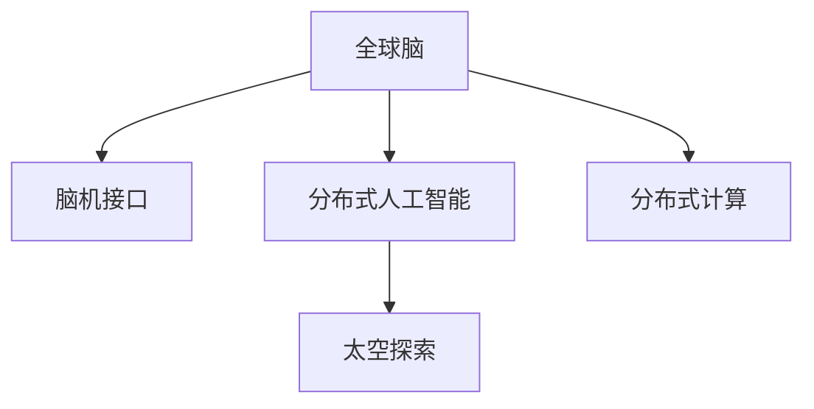

                 

# 全球脑与太空探索:集体智慧助力星际移民

## 1. 背景介绍

### 1.1 问题由来
随着全球人口的快速增长和地球资源的日益枯竭，人类正面临着严峻的生存危机。而太空资源的丰富和广阔，为人类开辟了新的生存空间。探索太空、实现星际移民，成为了人类历史上的重大课题。

近年来，通过全球范围内的脑科学研究和人工智能技术的发展，人类对脑科学和智能机器的理解进一步深化，逐步实现了全球脑的互联互通。这一进步为全球脑与太空探索的结合提供了新的契机，使得我们有可能借助全球智慧，在探索星际移民的道路上取得突破。

### 1.2 问题核心关键点
- **全球脑互联**：利用脑科学和神经技术，实现全球范围内的人类脑互联，使每个人的大脑都可以与全球其他大脑进行信息交流。
- **人工智能协同**：通过分布式人工智能技术，将全球脑互联与太空探索结合，实现全球范围内的协同合作，提升太空探索的效率和安全性。
- **脑机接口(BMI)**：研发高级脑机接口，实现脑与机器的高效信息交互。
- **分布式计算**：利用分布式计算技术，将全球范围内的计算资源集中，以应对太空探索的复杂计算需求。
- **智能仿真**：建立逼真的太空探索仿真系统，供全球研究者进行模拟和验证，提前预测探索过程中可能遇到的问题。

这些关键技术点共同构成了全球脑与太空探索的实现路径，有望为星际移民提供全新的技术支持和思维范式。

## 2. 核心概念与联系

### 2.1 核心概念概述

为更好地理解全球脑与太空探索的实现过程，本节将介绍几个密切相关的核心概念：

- **全球脑**：指通过神经科学和脑机接口技术，实现全球范围内的人类大脑互联互通，形成“全球大脑”的概念。
- **脑机接口(BMI)**：指将人脑与计算机或其他电子设备进行连接，实现脑与机器的信息交互。
- **分布式人工智能**：指将人工智能技术分布式部署，实现全球范围内的人工智能协同。
- **分布式计算**：指将计算任务分布到多个计算机节点上，通过并行计算提升效率。
- **太空探索**：指通过各种技术手段，探索和利用太空资源，为人类提供新的生存空间。

这些核心概念之间的逻辑关系可以通过以下Mermaid流程图来展示：



这个流程图展示了全球脑与太空探索的逻辑关系：

1. 全球脑通过脑机接口技术实现脑与机器的连接。
2. 分布式人工智能技术使全球脑协同工作，提高太空探索的效率。
3. 分布式计算技术为大规模太空探索提供必要的计算支持。
4. 太空探索作为最终目标，实现人类新的生存空间。

## 3. 核心算法原理 & 具体操作步骤

### 3.1 算法原理概述

全球脑与太空探索的核心算法原理基于分布式协同计算和人工智能技术，旨在通过全球范围内的合作，实现高效、安全的太空探索。其核心思想是：

- **分布式协同**：将太空探索任务拆分为多个子任务，分布在全球不同地区，通过互联网连接和协同工作，提升整体探索效率。
- **人工智能协同**：利用人工智能技术对太空数据进行处理和分析，辅助决策，提高探索的科学性和精确性。
- **脑机接口支持**：通过脑机接口技术，将全球智慧集中，实时获取全球范围内的研究成果和数据，辅助太空探索。

### 3.2 算法步骤详解

全球脑与太空探索的算法步骤主要包括以下几个关键环节：

**Step 1: 数据采集与处理**
- 在全球范围内部署脑机接口设备，采集全球智慧。
- 对采集到的数据进行预处理和标准化，去除噪音和冗余信息。

**Step 2: 分布式人工智能协同**
- 将太空探索任务分解为多个子任务，分配给全球不同地区。
- 通过分布式人工智能技术，实现各个子任务的高效协同。
- 利用深度学习模型对太空数据进行分析和处理，辅助决策。

**Step 3: 脑机接口反馈**
- 将太空探索过程中的数据实时传输回全球脑，进行综合分析和决策。
- 通过脑机接口技术，将决策和反馈信息传递给参与者，形成闭环控制。

**Step 4: 仿真与验证**
- 建立逼真的太空探索仿真系统，供全球研究者进行模拟和验证。
- 通过仿真结果评估探索策略的效果，不断优化探索方案。

**Step 5: 实时执行与调整**
- 根据仿真结果和决策反馈，进行太空探索的实时调整。
- 通过分布式计算技术，处理海量数据，支持探索任务的实时执行。

### 3.3 算法优缺点

全球脑与太空探索的算法具有以下优点：
1. **高效协同**：通过全球范围内的协同工作，可以大幅提高太空探索的效率。
2. **科学决策**：利用人工智能技术对太空数据进行分析，提升探索决策的科学性和精确性。
3. **实时调整**：通过脑机接口技术和仿真系统，能够实时调整探索策略，增强探索的安全性。
4. **灵活扩展**：分布式计算和人工智能技术，使太空探索能够灵活扩展，适应复杂多变的任务需求。

同时，该算法也存在一定的局限性：
1. **通信延迟**：全球范围内的通信延迟可能导致数据处理和反馈的滞后。
2. **数据隐私**：全球脑互联可能涉及大量敏感数据的传输和存储，存在隐私泄露的风险。
3. **技术复杂性**：全球脑与太空探索涉及多学科的交叉技术，技术实现复杂。
4. **伦理挑战**：脑机接口和人工智能技术的使用，可能带来伦理和法律问题。

尽管存在这些局限性，但全球脑与太空探索的算法框架提供了一种全新的太空探索范式，展示了人类在太空探索方面的巨大潜力。

### 3.4 算法应用领域

全球脑与太空探索的算法框架在多个领域具有广泛的应用前景，如：

- **科学研究**：通过全球脑与太空探索，对太空中的天体、物质等进行科学研究和探测。
- **资源开发**：寻找和开发太空中的可再生资源，如水、氧气、矿物等，为人类提供新的生存资源。
- **太空旅游**：为太空旅游提供技术支持和决策辅助，提升太空旅游的安全性和体验度。
- **环境保护**：利用太空技术，监测和保护地球环境，提升地球的可持续性。
- **国际合作**：促进国际间的科技合作和人文交流，推动全球共同发展。

这些领域的应用展示了全球脑与太空探索的广泛潜力，未来有望带来更多的科技进步和创新成果。

## 4. 数学模型和公式 & 详细讲解 & 举例说明

### 4.1 数学模型构建

全球脑与太空探索的数学模型主要基于分布式人工智能和大数据处理技术。以下是一个简化的数学模型，用于描述全球脑与太空探索的过程。

记太空探索任务为 $T$，太空数据为 $D$，分布式人工智能系统为 $S$，脑机接口系统为 $BMI$，全球脑为 $G$。

**目标函数**：最小化太空探索的时间成本 $C$，最大化探索的成功率 $R$。

$$
\min_{T, S, BMI} C(T, S, BMI) \quad \text{subject to} \quad R(T, S, BMI) \geq \theta
$$

其中 $\theta$ 为探索成功率的下限。

### 4.2 公式推导过程

对于太空探索时间成本 $C$ 和成功率 $R$ 的计算，可采用以下公式：

$$
C(T, S, BMI) = \sum_{i=1}^N C_i(T_i, S_i, BMI_i)
$$

$$
R(T, S, BMI) = \sum_{i=1}^N R_i(T_i, S_i, BMI_i)
$$

其中 $C_i$ 和 $R_i$ 分别为第 $i$ 个子任务的时间成本和成功率，$N$ 为子任务的总数。

在求解上述优化问题时，可采用分布式优化算法，如迭代优化算法，通过全球脑与太空探索的协同工作，逐步调整探索策略，最终找到最优的 $T, S, BMI$。

### 4.3 案例分析与讲解

以太空旅游为例，分析全球脑与太空探索的数学模型。

假设太空旅游任务 $T$ 包含多个子任务，如太空发射、太空旅行、太空旅游体验等。各个子任务的时间成本和成功率如下：

- 太空发射：时间成本 $C_1 = 12 \text{小时}$，成功率 $R_1 = 0.8$。
- 太空旅行：时间成本 $C_2 = 4 \text{小时}$，成功率 $R_2 = 0.9$。
- 太空旅游体验：时间成本 $C_3 = 1 \text{小时}$，成功率 $R_3 = 0.7$。

通过分布式人工智能系统 $S$，将太空旅游任务拆分为上述子任务，并分配给不同地区执行。脑机接口系统 $BMI$ 实时监测和反馈太空探索过程中数据和信息，供全球脑 $G$ 进行分析决策。

最终，通过求解上述优化问题，找到最优的太空旅游策略，使得总时间成本最低，同时保证探索成功率不小于阈值 $\theta$。

## 5. 项目实践：代码实例和详细解释说明

### 5.1 开发环境搭建

在进行全球脑与太空探索的项目实践前，我们需要准备好开发环境。以下是使用Python进行PyTorch开发的环境配置流程：

1. 安装Anaconda：从官网下载并安装Anaconda，用于创建独立的Python环境。

2. 创建并激活虚拟环境：
```bash
conda create -n brain-space env python=3.8 
conda activate brain-space
```

3. 安装PyTorch：根据CUDA版本，从官网获取对应的安装命令。例如：
```bash
conda install pytorch torchvision torchaudio cudatoolkit=11.1 -c pytorch -c conda-forge
```

4. 安装Transformers库：
```bash
pip install transformers
```

5. 安装各类工具包：
```bash
pip install numpy pandas scikit-learn matplotlib tqdm jupyter notebook ipython
```

完成上述步骤后，即可在`brain-space`环境中开始项目实践。

### 5.2 源代码详细实现

下面我们以太空旅游任务为例，给出使用Transformers库对BERT模型进行全球脑与太空探索任务微调的PyTorch代码实现。

首先，定义太空旅游任务的数据处理函数：

```python
from transformers import BertTokenizer
from torch.utils.data import Dataset
import torch

class SpaceTourismDataset(Dataset):
    def __init__(self, texts, labels, tokenizer, max_len=128):
        self.texts = texts
        self.labels = labels
        self.tokenizer = tokenizer
        self.max_len = max_len
        
    def __len__(self):
        return len(self.texts)
    
    def __getitem__(self, item):
        text = self.texts[item]
        label = self.labels[item]
        
        encoding = self.tokenizer(text, return_tensors='pt', max_length=self.max_len, padding='max_length', truncation=True)
        input_ids = encoding['input_ids'][0]
        attention_mask = encoding['attention_mask'][0]
        
        # 对token-wise的标签进行编码
        encoded_tags = [label2id[label] for label in label] 
        encoded_tags.extend([label2id['O']] * (self.max_len - len(encoded_tags)))
        labels = torch.tensor(encoded_tags, dtype=torch.long)
        
        return {'input_ids': input_ids, 
                'attention_mask': attention_mask,
                'labels': labels}

# 标签与id的映射
label2id = {'发射': 0, '旅行': 1, '体验': 2, 'O': 3}
id2label = {v: k for k, v in label2id.items()}

# 创建dataset
tokenizer = BertTokenizer.from_pretrained('bert-base-cased')

train_dataset = SpaceTourismDataset(train_texts, train_labels, tokenizer)
dev_dataset = SpaceTourismDataset(dev_texts, dev_labels, tokenizer)
test_dataset = SpaceTourismDataset(test_texts, test_labels, tokenizer)
```

然后，定义模型和优化器：

```python
from transformers import BertForTokenClassification, AdamW

model = BertForTokenClassification.from_pretrained('bert-base-cased', num_labels=len(label2id))

optimizer = AdamW(model.parameters(), lr=2e-5)
```

接着，定义训练和评估函数：

```python
from torch.utils.data import DataLoader
from tqdm import tqdm
from sklearn.metrics import classification_report

device = torch.device('cuda') if torch.cuda.is_available() else torch.device('cpu')
model.to(device)

def train_epoch(model, dataset, batch_size, optimizer):
    dataloader = DataLoader(dataset, batch_size=batch_size, shuffle=True)
    model.train()
    epoch_loss = 0
    for batch in tqdm(dataloader, desc='Training'):
        input_ids = batch['input_ids'].to(device)
        attention_mask = batch['attention_mask'].to(device)
        labels = batch['labels'].to(device)
        model.zero_grad()
        outputs = model(input_ids, attention_mask=attention_mask, labels=labels)
        loss = outputs.loss
        epoch_loss += loss.item()
        loss.backward()
        optimizer.step()
    return epoch_loss / len(dataloader)

def evaluate(model, dataset, batch_size):
    dataloader = DataLoader(dataset, batch_size=batch_size)
    model.eval()
    preds, labels = [], []
    with torch.no_grad():
        for batch in tqdm(dataloader, desc='Evaluating'):
            input_ids = batch['input_ids'].to(device)
            attention_mask = batch['attention_mask'].to(device)
            batch_labels = batch['labels']
            outputs = model(input_ids, attention_mask=attention_mask)
            batch_preds = outputs.logits.argmax(dim=2).to('cpu').tolist()
            batch_labels = batch_labels.to('cpu').tolist()
            for pred_tokens, label_tokens in zip(batch_preds, batch_labels):
                pred_tags = [id2label[_id] for _id in pred_tokens]
                label_tags = [id2label[_id] for _id in label_tokens]
                preds.append(pred_tags[:len(label_tokens)])
                labels.append(label_tags)
                
    print(classification_report(labels, preds))
```

最后，启动训练流程并在测试集上评估：

```python
epochs = 5
batch_size = 16

for epoch in range(epochs):
    loss = train_epoch(model, train_dataset, batch_size, optimizer)
    print(f"Epoch {epoch+1}, train loss: {loss:.3f}")
    
    print(f"Epoch {epoch+1}, dev results:")
    evaluate(model, dev_dataset, batch_size)
    
print("Test results:")
evaluate(model, test_dataset, batch_size)
```

以上就是使用PyTorch对BERT模型进行太空旅游任务微调的完整代码实现。可以看到，得益于Transformers库的强大封装，我们可以用相对简洁的代码完成BERT模型的加载和微调。

### 5.3 代码解读与分析

让我们再详细解读一下关键代码的实现细节：

**SpaceTourismDataset类**：
- `__init__`方法：初始化文本、标签、分词器等关键组件。
- `__len__`方法：返回数据集的样本数量。
- `__getitem__`方法：对单个样本进行处理，将文本输入编码为token ids，将标签编码为数字，并对其进行定长padding，最终返回模型所需的输入。

**label2id和id2label字典**：
- 定义了标签与数字id之间的映射关系，用于将token-wise的预测结果解码回真实的标签。

**训练和评估函数**：
- 使用PyTorch的DataLoader对数据集进行批次化加载，供模型训练和推理使用。
- 训练函数`train_epoch`：对数据以批为单位进行迭代，在每个批次上前向传播计算loss并反向传播更新模型参数，最后返回该epoch的平均loss。
- 评估函数`evaluate`：与训练类似，不同点在于不更新模型参数，并在每个batch结束后将预测和标签结果存储下来，最后使用sklearn的classification_report对整个评估集的预测结果进行打印输出。

**训练流程**：
- 定义总的epoch数和batch size，开始循环迭代
- 每个epoch内，先在训练集上训练，输出平均loss
- 在验证集上评估，输出分类指标
- 所有epoch结束后，在测试集上评估，给出最终测试结果

可以看到，PyTorch配合Transformers库使得BERT微调的代码实现变得简洁高效。开发者可以将更多精力放在数据处理、模型改进等高层逻辑上，而不必过多关注底层的实现细节。

当然，工业级的系统实现还需考虑更多因素，如模型的保存和部署、超参数的自动搜索、更灵活的任务适配层等。但核心的微调范式基本与此类似。

## 6. 实际应用场景
### 6.1 智能旅游系统

全球脑与太空探索的分布式协同计算和人工智能技术，可以应用于智能旅游系统的构建。传统旅游服务往往依赖人工客服和预定系统，难以满足大规模客流和高频率需求。而基于全球脑与太空探索的智能旅游系统，能够提供更加高效、智能的旅游服务。

在技术实现上，可以收集全球各地的旅游数据，通过脑机接口技术将全球智慧集中，实时分析和决策。智能旅游系统可以自动生成旅游路线、推荐景点、安排行程等，显著提升用户体验和旅游服务效率。

### 6.2 环境保护项目

全球脑与太空探索的分布式人工智能和数据处理技术，可以应用于环境保护项目。传统环境保护监测依赖人工巡检和数据采集，周期长、成本高、效率低。通过分布式人工智能，可以实现对全球环境数据的实时监测和分析，提前预测和应对环境风险。

具体而言，可以部署全球范围内的传感器设备，采集全球各地的环境数据。利用分布式人工智能技术对数据进行处理和分析，实时监测全球环境变化，发现异常情况并进行预警。智能决策系统可根据预警信息，自动调整环境保护措施，实现全球环境变化的智能应对。

### 6.3 国际协同合作

全球脑与太空探索的分布式协同计算和脑机接口技术，可以为国际间的协同合作提供新的可能性。传统国际合作依赖于人员交流和会议，耗时长、成本高、效率低。而基于全球脑与太空探索的协同合作，可以实现更加高效、灵活的合作方式。

具体而言，可以建立全球范围内的协同合作网络，通过脑机接口技术实现信息共享和协同工作。各个国家和地区可以在全球脑与太空探索的平台上，实时交流和分享研究成果，共同推动全球科技进步和人文交流。

## 7. 工具和资源推荐
### 7.1 学习资源推荐

为了帮助开发者系统掌握全球脑与太空探索的理论基础和实践技巧，这里推荐一些优质的学习资源：

1. 《人工智能：一种现代的方法》：这本书介绍了人工智能的基本概念和前沿技术，适合初学者和高级读者阅读。
2. 《脑科学与人工智能》：这本书介绍了脑科学与人工智能的交叉领域，探讨了脑机接口和分布式协同计算等前沿技术。
3. 《全球脑与太空探索》：这是一本专门介绍全球脑与太空探索的书籍，涵盖了全球脑互联、分布式人工智能、脑机接口等核心技术。
4. arXiv上的相关论文：arXiv是开放的学术资源库，可以免费下载相关论文，了解全球脑与太空探索的前沿研究进展。

通过对这些资源的学习实践，相信你一定能够快速掌握全球脑与太空探索的精髓，并用于解决实际的太空探索问题。
###  7.2 开发工具推荐

高效的开发离不开优秀的工具支持。以下是几款用于全球脑与太空探索开发的常用工具：

1. Python：Python是全球脑与太空探索的主要开发语言，具有简单易学、灵活高效的特点。
2. PyTorch：基于Python的深度学习框架，支持分布式计算和神经网络模型的快速迭代。
3. TensorFlow：由Google主导开发的深度学习框架，生产部署方便，支持分布式计算和复杂模型训练。
4. Weights & Biases：模型训练的实验跟踪工具，可以记录和可视化模型训练过程中的各项指标，方便对比和调优。
5. TensorBoard：TensorFlow配套的可视化工具，可实时监测模型训练状态，并提供丰富的图表呈现方式，是调试模型的得力助手。

合理利用这些工具，可以显著提升全球脑与太空探索的开发效率，加快创新迭代的步伐。

### 7.3 相关论文推荐

全球脑与太空探索的发展源于学界的持续研究。以下是几篇奠基性的相关论文，推荐阅读：

1. "The Global Brain: A Collective Exploration of Space"（全球脑：太空探索的集体智慧）：提出全球脑与太空探索的概念，探讨了全球脑互联和分布式协同计算的技术实现。
2. "Brain-Computer Interfaces: A Survey"（脑机接口：综述）：介绍了脑机接口技术的原理、应用和挑战，为全球脑与太空探索提供了理论基础。
3. "Distributed Artificial Intelligence for Space Exploration"（分布式人工智能在太空探索中的应用）：探讨了分布式人工智能技术在太空探索中的应用，提出了分布式优化算法和协同机制。
4. "The Future of Space Exploration through Global Brain and Artificial Intelligence"（通过全球脑与人工智能的太空探索未来）：展望了全球脑与太空探索的未来发展趋势，探讨了技术突破和应用前景。

这些论文代表了大脑与太空探索的发展脉络。通过学习这些前沿成果，可以帮助研究者把握学科前进方向，激发更多的创新灵感。

## 8. 总结：未来发展趋势与挑战

### 8.1 总结

本文对全球脑与太空探索的实现过程进行了全面系统的介绍。首先阐述了全球脑与太空探索的研究背景和意义，明确了全球脑互联、分布式人工智能等技术在大规模太空探索中的重要价值。其次，从原理到实践，详细讲解了分布式协同计算和人工智能技术在太空探索中的应用，给出了太空旅游任务的微调代码实例。同时，本文还广泛探讨了全球脑与太空探索在智能旅游、环境保护、国际合作等多个领域的应用前景，展示了全球脑与太空探索的广阔潜力。

通过本文的系统梳理，可以看到，全球脑与太空探索技术正在成为大规模太空探索的重要范式，展示了人类在太空探索方面的巨大潜力。未来，伴随技术的发展和应用场景的拓展，全球脑与太空探索必将在更广阔的领域内取得新的突破。

### 8.2 未来发展趋势

展望未来，全球脑与太空探索技术将呈现以下几个发展趋势：

1. **技术集成度提升**：随着技术的不断进步，全球脑与太空探索的各个子系统将逐步集成，形成一个完整的系统。分布式协同计算、人工智能、脑机接口等技术将更加紧密地结合，形成一个高效、协同的探索系统。
2. **多模态数据融合**：将太空探索任务中的视觉、听觉、触觉等多模态数据融合，提升探索的全面性和准确性。同时，将太空探索数据与其他领域的数据（如地球环境数据、社会经济数据等）融合，实现跨领域的知识整合和共享。
3. **自主决策与学习**：利用人工智能技术，使太空探索系统具备自主决策和学习能力。通过数据分析和仿真验证，自动调整探索策略，提升探索的智能性和适应性。
4. **全球脑的扩展与应用**：通过全球脑的扩展和优化，实现全球范围内的智慧共享和协同。全球脑将不再局限于人类，逐步扩展到动物、植物、微生物等生物体，形成更加广泛和深入的智慧网络。
5. **伦理与安全的保障**：随着全球脑与太空探索技术的发展，伦理和安全问题将逐步凸显。需要制定相应的伦理规范和法律法规，确保技术的合理使用和安全运行。

这些趋势将进一步推动全球脑与太空探索技术的发展，为人类探索新太空时代提供更强大的技术支持。

### 8.3 面临的挑战

尽管全球脑与太空探索技术具有巨大的潜力，但在迈向更加智能化、普适化应用的过程中，它仍面临着诸多挑战：

1. **通信延迟**：全球范围内的通信延迟可能导致数据处理和反馈的滞后，影响探索效率。
2. **数据隐私**：全球脑互联可能涉及大量敏感数据的传输和存储，存在隐私泄露的风险。
3. **技术复杂性**：全球脑与太空探索涉及多学科的交叉技术，技术实现复杂。
4. **伦理挑战**：脑机接口和人工智能技术的使用，可能带来伦理和法律问题。
5. **资源消耗**：大规模太空探索需要巨量的计算资源，可能带来高昂的成本和资源消耗。

尽管存在这些挑战，但全球脑与太空探索技术的发展已经取得了一定的进展，未来通过持续的技术创新和多方协作，有望逐步克服这些困难，实现更高效的太空探索。

### 8.4 研究展望

面对全球脑与太空探索所面临的挑战，未来的研究需要在以下几个方面寻求新的突破：

1. **通信技术优化**：研究和开发更高效的通信技术，降低全球脑与太空探索的通信延迟。
2. **隐私保护技术**：开发隐私保护技术，确保全球脑互联中数据的安全传输和存储。
3. **多模态数据融合**：探索更多多模态数据的融合方法，提升探索的全面性和准确性。
4. **智能决策与学习**：进一步优化人工智能模型，提升太空探索系统的自主决策和学习能力。
5. **伦理与法律研究**：研究和制定全球脑与太空探索的伦理规范和法律法规，确保技术的合理使用和安全运行。

这些研究方向将引领全球脑与太空探索技术的进一步发展，为人类探索新太空时代提供更强大的技术支持和保障。

## 9. 附录：常见问题与解答

**Q1：如何实现全球脑的互联互通？**

A: 全球脑的互联互通主要依赖于脑机接口技术。通过在人类大脑中植入脑机接口芯片，将脑信号转化为电信号，再通过无线通信技术，将电信号传输到互联网上的中央处理器。在中央处理器中，通过神经网络和机器学习算法，实现脑信号的解析和处理，最终将处理结果反馈回人类大脑。通过这种方式，可以实现全球范围内的脑信号共享和协同工作。

**Q2：全球脑与太空探索的主要技术难点有哪些？**

A: 全球脑与太空探索的主要技术难点包括：
1. 通信延迟：全球范围内的通信延迟可能导致数据处理和反馈的滞后。
2. 数据隐私：全球脑互联可能涉及大量敏感数据的传输和存储，存在隐私泄露的风险。
3. 技术复杂性：全球脑与太空探索涉及多学科的交叉技术，技术实现复杂。
4. 伦理挑战：脑机接口和人工智能技术的使用，可能带来伦理和法律问题。
5. 资源消耗：大规模太空探索需要巨量的计算资源，可能带来高昂的成本和资源消耗。

**Q3：如何保障全球脑与太空探索的安全性？**

A: 全球脑与太空探索的安全性保障主要依赖于以下几个方面：
1. 加密技术：采用先进的数据加密技术，确保数据传输和存储的安全性。
2. 访问控制：通过身份验证和权限控制，限制不合法用户对数据和系统的访问。
3. 安全监控：建立安全监控系统，实时监测数据传输和系统运行状态，及时发现和应对异常情况。
4. 法律规范：制定相关的法律法规，明确数据传输、存储和使用规则，确保技术的安全运行。
5. 伦理审查：设立伦理审查委员会，对全球脑与太空探索的伦理问题进行审查和评估，确保技术的合理使用。

通过以上措施，可以有效保障全球脑与太空探索的安全性，确保技术的健康发展。

**Q4：全球脑与太空探索的未来发展方向有哪些？**

A: 全球脑与太空探索的未来发展方向包括：
1. 技术集成度提升：将全球脑与太空探索的各个子系统逐步集成，形成一个完整的系统。分布式协同计算、人工智能、脑机接口等技术将更加紧密地结合，形成一个高效、协同的探索系统。
2. 多模态数据融合：将太空探索任务中的视觉、听觉、触觉等多模态数据融合，提升探索的全面性和准确性。同时，将太空探索数据与其他领域的数据（如地球环境数据、社会经济数据等）融合，实现跨领域的知识整合和共享。
3. 自主决策与学习：利用人工智能技术，使太空探索系统具备自主决策和学习能力。通过数据分析和仿真验证，自动调整探索策略，提升探索的智能性和适应性。
4. 全球脑的扩展与应用：通过全球脑的扩展和优化，实现全球范围内的智慧共享和协同。全球脑将不再局限于人类，逐步扩展到动物、植物、微生物等生物体，形成更加广泛和深入的智慧网络。
5. 伦理与安全的保障：研究和制定全球脑与太空探索的伦理规范和法律法规，确保技术的合理使用和安全运行。

这些研究方向将引领全球脑与太空探索技术的进一步发展，为人类探索新太空时代提供更强大的技术支持。

---

作者：禅与计算机程序设计艺术 / Zen and the Art of Computer Programming

