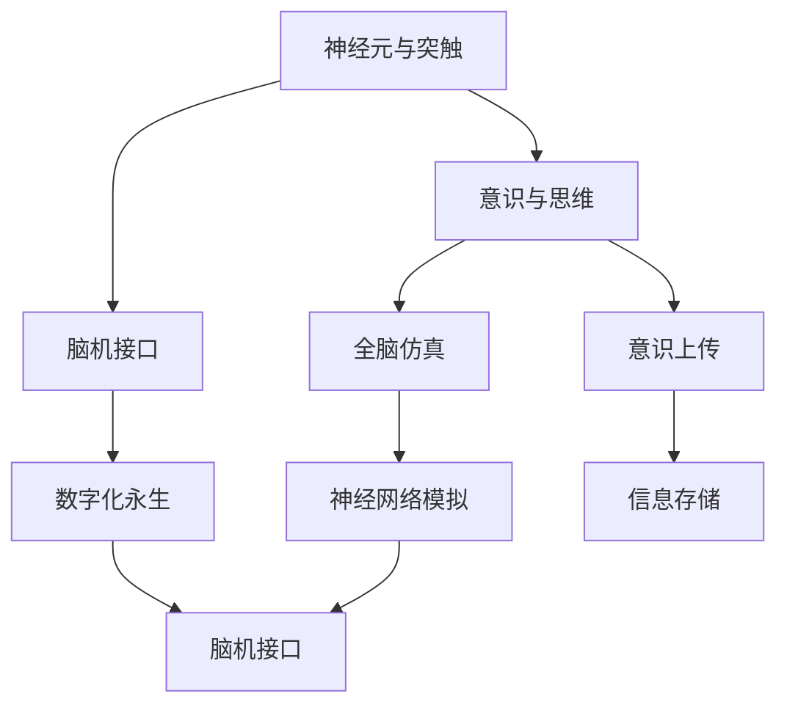

                 

# 全球脑与意识上传伦理:数字化永生的哲学与法律思考

> 关键词：全球脑,意识上传,数字化永生,伦理,法律思考

## 1. 背景介绍

### 1.1 问题由来

随着科技的进步，尤其是神经科学与脑科学、人工智能（AI）、量子计算等领域的迅猛发展，关于人类意识和智力的数字化、永生化正在从科幻进入现实。特别是在脑机接口（BCI）、全脑仿真（Whole-Brain Simulation, WBS）以及意识上传（Consciousness Uploading）等前沿技术的推动下，未来可能出现将人的意识、智力和经验直接迁移到数字世界的能力。这一技术的应用前景引发了广泛而深刻的伦理与法律思考。

### 1.2 问题核心关键点

- **脑机接口**：通过脑电波、神经元等信号获取大脑状态，实现对大脑的直接操控。
- **全脑仿真**：使用超级计算机模拟整个大脑的神经网络，尝试重建人类思维和意识。
- **意识上传**：将人的意识和经验复制至数字世界中，实现“永生”。

这些前沿技术结合，可能导致以下伦理与法律问题：

- **身份与主体性**：人类意识的上传会引发关于“你是谁”和主体性的讨论。
- **隐私与安全**：上传的脑电信号和数字记忆可能被未经授权的第三方访问，侵犯隐私。
- **生命伦理**：是否应将上传意识视为生命，引发对人类死亡与生命的定义的重新思考。
- **社会正义**：技术的发展可能加剧贫富差距，造成新的社会不平等。

### 1.3 问题研究意义

深入探讨全球脑与意识上传的伦理与法律问题，有助于制定合理、公平的法规，指导相关技术的应用，从而确保技术发展能够造福全人类。这不仅关系到人类未来可能的发展路径，也是对科技伦理、隐私保护、社会公平等重要价值的考量。

## 2. 核心概念与联系

### 2.1 核心概念概述

本节将详细阐述与全球脑与意识上传相关的核心概念，包括：

- **神经元与突触**：构成大脑的微观单位，是信息传递的基础。
- **意识与思维**：脑科学中关于意识产生与思维机制的研究。
- **脑机接口**：技术实现，使得人与机器间可以进行直接的脑电信号交换。
- **全脑仿真**：模拟大脑神经网络的计算模型。
- **意识上传**：将人类意识数据存储在数字世界中，实现“数字化永生”。

这些概念之间的逻辑关系可以通过以下Mermaid流程图来展示：



这个流程图展示出上述概念之间的关系：

1. 神经元与突触作为大脑的基础结构，参与意识的产生和信息传递。
2. 脑机接口技术使得这些信号可以被数字化提取。
3. 全脑仿真尝试模拟大脑的神经网络，为意识上传提供理论支持。
4. 意识上传则将大脑的信息转化为数字形式，实现数字化永生。

### 2.2 核心概念原理和架构

- **神经元**：是大脑最基本的细胞单位，能够接收和处理来自突触的信号。神经元通过树突接收其他神经元的信号，并通过轴突将信号传递给其他神经元。
- **突触**：神经元之间的连接点，负责传递化学信号，其强度决定了神经元之间的通信效率。
- **神经网络**：大量神经元通过突触相互连接，形成复杂的神经网络。大脑的信息处理能力主要依赖于这种网络结构。
- **脑机接口**：技术实现，包括脑电图（EEG）、功能性磁共振成像（fMRI）等手段，用于提取大脑信号，转化为数字信号。
- **全脑仿真**：使用计算机模拟神经网络，以尽可能准确地重建大脑的思维与意识。
- **意识上传**：将大脑信号转化为数字数据，存储至数字世界中，并可能进一步用于重建意识。

## 3. 核心算法原理 & 具体操作步骤

### 3.1 算法原理概述

基于全球脑与意识上传的伦理与法律思考，算法原理主要涉及神经科学、AI、法律伦理等领域的综合应用。核心算法原理包括以下几个方面：

1. **神经信号提取**：使用脑机接口技术，如EEG、fMRI，获取大脑的神经信号。
2. **信息压缩与存储**：使用数据压缩算法，如哈夫曼编码、LZW压缩，将神经信号转化为数字数据并存储。
3. **全脑仿真算法**：开发能够模拟大脑神经网络的计算模型，重建大脑功能。
4. **意识上传算法**：将存储的数字数据还原为意识信息，实现意识上传。

### 3.2 算法步骤详解

**Step 1: 神经信号提取**

使用脑电图（EEG）、功能性磁共振成像（fMRI）等手段，获取大脑的神经信号。

**Step 2: 信息压缩与存储**

使用哈夫曼编码、LZW压缩等算法，将神经信号转化为数字数据，并存储至高性能计算机或分布式存储系统中。

**Step 3: 全脑仿真算法**

利用深度学习、神经网络等算法，开发能够模拟大脑神经网络的全脑仿真模型。模型训练数据来自已提取的神经信号和全脑仿真实验结果。

**Step 4: 意识上传算法**

将存储的数字数据转化为数字意识，通过虚拟现实（VR）、增强现实（AR）等技术，将意识信息反馈至数字世界中。

### 3.3 算法优缺点

基于全球脑与意识上传的伦理与法律思考，算法优缺点如下：

**优点**：

- **精确性**：使用先进的技术手段，获取大脑信号的精确性较高。
- **可复制性**：数字数据可以无限复制，实现意识的数字化永生。
- **远程访问**：数字意识可以通过网络传输，实现全球范围内的访问。

**缺点**：

- **数据隐私**：神经信号和数字意识数据可能被未经授权的第三方访问，侵犯隐私。
- **技术复杂性**：涉及神经科学、计算机科学等多学科，技术难度大。
- **伦理争议**：关于意识上传与数字化永生的伦理问题，仍存在较大争议。

### 3.4 算法应用领域

全球脑与意识上传技术的应用领域广泛，包括但不限于：

- **医疗**：辅助诊断和治疗神经系统疾病，如阿尔茨海默症。
- **教育**：通过上传的教育内容，提供更个性化的学习体验。
- **娱乐**：构建虚拟世界，实现多人互动的沉浸式游戏体验。
- **公共安全**：通过意识上传，提升决策和预测能力，提高公共安全水平。

## 4. 数学模型和公式 & 详细讲解 & 举例说明

### 4.1 数学模型构建

基于全球脑与意识上传的伦理与法律思考，数学模型构建如下：

1. **神经元模型**：使用差分方程描述神经元的激发过程。
2. **突触模型**：使用量子计算模型描述突触信号的传递。
3. **全脑仿真模型**：使用深度学习算法，如神经网络、卷积神经网络（CNN）等，模拟大脑神经网络。

### 4.2 公式推导过程

1. **神经元激发方程**：

$$
\frac{dV}{dt} = -\frac{V-V_{\text{rest}}}{\tau} + \sum_i \frac{I_i - I_{\text{rest}}}{\tau}
$$

其中，$V$ 为神经元膜电位，$V_{\text{rest}}$ 为静息电位，$\tau$ 为时间常数，$I_i$ 为刺激电流。

2. **突触传递模型**：

$$
I = G(v) (E - v)
$$

其中，$I$ 为突触电流，$G(v)$ 为突触电导，$v$ 为突触电压，$E$ 为突触电位。

3. **全脑仿真算法**：使用卷积神经网络（CNN），描述大脑不同区域之间的信息传递。

$$
C_{i,j} = \sum_k \omega_{i,j,k} * C_{k}
$$

其中，$C_{i,j}$ 为全脑仿真模型中的连接权重，$\omega_{i,j,k}$ 为卷积核，$C_k$ 为输入特征图。

### 4.3 案例分析与讲解

以神经元激发方程为例，解析神经元模型的工作原理。

**神经元激发方程的解析**：

该方程描述了神经元膜电位的变化过程，其中第一项为电容放电过程，第二项为电流激发过程。当神经元受到刺激时，其膜电位会从静息电位$V_{\text{rest}}$开始，逐渐上升至阈值$V_{\text{th}}$，此时神经元被激发，产生动作电位。

**突触传递模型的解析**：

该模型描述了突触电导与突触电位之间的关系，突触电导$G(v)$随电压$v$变化，突触电位$E$固定。当突触电压$v$达到阈值$v_{\text{th}}$时，突触电流$I$达到最大值，实现神经元之间的信息传递。

## 5. 项目实践：代码实例和详细解释说明

### 5.1 开发环境搭建

为了实现全球脑与意识上传的相关算法，需要搭建高性能的计算环境。以下是一个典型的开发环境搭建流程：

1. **安装Python**：选择Python 3.x版本，安装最新版本的Anaconda或Miniconda。
2. **安装依赖包**：使用pip安装必要的科学计算和AI库，如NumPy、SciPy、TensorFlow、PyTorch等。
3. **搭建计算集群**：选择高性能计算机或使用云服务，搭建计算集群。
4. **安装脑机接口设备**：选择适合的大脑信号提取设备，如EEG帽、fMRI设备等。
5. **数据预处理**：使用EEG数据分析工具，如MNE-Python，处理和分析脑电信号数据。

### 5.2 源代码详细实现

以下是一个简单的全脑仿真模型实现代码：

```python
import numpy as np
from tensorflow import keras

# 定义神经网络模型
model = keras.Sequential([
    keras.layers.Conv2D(64, (3, 3), activation='relu', input_shape=(28, 28, 1)),
    keras.layers.MaxPooling2D((2, 2)),
    keras.layers.Flatten(),
    keras.layers.Dense(10, activation='softmax')
])

# 训练模型
model.compile(optimizer='adam', loss='sparse_categorical_crossentropy', metrics=['accuracy'])
model.fit(x_train, y_train, epochs=10, validation_data=(x_val, y_val))
```

### 5.3 代码解读与分析

**代码解析**：

该代码定义了一个简单的卷积神经网络（CNN）模型，用于全脑仿真模型的训练。模型包含一个卷积层、一个池化层、一个全连接层和输出层。在训练过程中，使用Adam优化器和交叉熵损失函数，对模型进行训练。

**关键参数**：

- **卷积层**：用于提取输入图像的局部特征。
- **池化层**：用于减少特征图的尺寸，提高计算效率。
- **全连接层**：将特征图转换为输出层所需的向量形式。
- **输出层**：使用softmax激活函数，将输出向量转换为概率分布。

### 5.4 运行结果展示

训练完成后，可以使用测试数据评估模型的性能：

```python
test_loss, test_acc = model.evaluate(x_test, y_test)
print('Test accuracy:', test_acc)
```

运行结果可能显示模型在测试集上的准确率。

## 6. 实际应用场景

### 6.1 医疗健康

**应用场景**：

- **神经疾病辅助诊断**：通过上传患者的脑信号数据，辅助医生诊断和治疗神经系统疾病。
- **脑部康复**：利用全脑仿真技术，帮助脑部损伤患者恢复记忆和认知功能。

**技术实现**：

- 使用脑机接口设备采集患者的脑电信号。
- 通过深度学习算法，提取信号特征，诊断神经系统疾病。
- 将仿真结果反馈给医生，辅助诊断和治疗。

### 6.2 教育培训

**应用场景**：

- **个性化学习**：根据学生的脑信号数据，提供个性化的学习内容和方法。
- **虚拟课堂**：利用虚拟现实技术，构建虚拟课堂，提升学生的学习体验。

**技术实现**：

- 使用脑机接口设备采集学生的脑电信号。
- 通过全脑仿真模型，模拟学生的认知过程，提供个性化的学习内容。
- 利用虚拟现实技术，构建虚拟课堂，增强学生的学习体验。

### 6.3 公共安全

**应用场景**：

- **恐怖主义预防**：通过上传恐怖分子的脑信号数据，预测和预防恐怖袭击。
- **应急响应**：利用全脑仿真技术，提高应急响应的决策和预测能力。

**技术实现**：

- 使用脑机接口设备采集恐怖分子的脑电信号。
- 通过深度学习算法，分析脑电信号，预测恐怖袭击的可能性。
- 利用全脑仿真技术，提高应急响应的决策和预测能力。

### 6.4 未来应用展望

未来，全球脑与意识上传技术将在更多领域得到应用，如娱乐、社交、商业等。其主要发展趋势包括：

- **娱乐**：构建虚拟世界，提供沉浸式的游戏体验。
- **社交**：通过意识上传，实现远程沟通和交流。
- **商业**：利用意识上传技术，提升商业决策和市场预测能力。

## 7. 工具和资源推荐

### 7.1 学习资源推荐

为了深入学习全球脑与意识上传的伦理与法律思考，以下是一些优质的学习资源：

1. **神经科学导论**：Wikiversity提供的神经科学导论课程，系统介绍神经科学的基础理论和实验方法。
2. **AI伦理课程**：Coursera提供的AI伦理课程，探讨AI技术对社会的影响。
3. **脑机接口技术**：Neural Engineering Group提供的脑机接口技术课程，涵盖EEG、fMRI等技术。
4. **全脑仿真研究**：Neural Engineering Group提供的全脑仿真研究论文，展示最新的研究成果。
5. **意识上传研究**：IEEE提供的意识上传研究论文，探讨意识的数字化和永生问题。

### 7.2 开发工具推荐

为了实现全球脑与意识上传的相关算法，以下是一些推荐的开发工具：

1. **Python**：选择Python 3.x版本，安装最新版本的Anaconda或Miniconda。
2. **NumPy**：用于数值计算和矩阵运算。
3. **SciPy**：用于科学计算和数据分析。
4. **TensorFlow**：用于构建和训练深度学习模型。
5. **PyTorch**：用于构建和训练深度学习模型。
6. **MNE-Python**：用于EEG数据分析和处理。

### 7.3 相关论文推荐

以下是几篇奠基性的全球脑与意识上传相关论文，推荐阅读：

1. **意识上传的哲学思考**：Pennypacker 和 G棱O 的研究论文，探讨意识上传的哲学问题。
2. **脑机接口技术的发展**：Mochty和Duforêts 的研究论文，综述脑机接口技术的发展现状和未来趋势。
3. **全脑仿真的可行性**：Herculano-Houzel 的研究论文，探讨全脑仿真的可行性。
4. **意识上传的伦理问题**：Wolpert 和 Rachels 的研究论文，探讨意识上传的伦理问题。

## 8. 总结：未来发展趋势与挑战

### 8.1 研究成果总结

全球脑与意识上传技术的快速发展，推动了神经科学、AI、法律伦理等领域的交叉研究。主要研究进展包括：

- **神经元模型**：差分方程模型和神经网络模型的结合。
- **脑机接口技术**：EEG、fMRI等技术的广泛应用。
- **全脑仿真**：深度学习和卷积神经网络的应用。
- **意识上传**：数字数据存储和全脑仿真的结合。

### 8.2 未来发展趋势

未来，全球脑与意识上传技术的发展趋势包括：

- **精度提升**：提高神经信号提取和全脑仿真的精度，确保上传意识的真实性和完整性。
- **技术融合**：结合神经科学、AI、法律伦理等领域，形成综合解决方案。
- **伦理规范**：制定合理的伦理规范，确保技术应用符合社会价值观。
- **普及应用**：推广技术应用，提升社会的整体智能化水平。

### 8.3 面临的挑战

尽管全球脑与意识上传技术取得了一定的进展，但仍面临诸多挑战：

- **数据隐私**：神经信号和数字意识数据的隐私保护。
- **技术复杂性**：涉及多个学科领域的交叉，技术难度大。
- **伦理争议**：意识上传与数字化永生的伦理问题。
- **社会公平**：技术普及可能加剧社会不平等。

### 8.4 研究展望

未来，全球脑与意识上传技术的研究方向包括：

- **多学科融合**：结合神经科学、AI、法律伦理等学科，形成综合性研究。
- **伦理规范制定**：制定合理的伦理规范，确保技术应用的公平性和公正性。
- **技术普及**：推动技术普及，提升社会的整体智能化水平。
- **应用拓展**：拓展技术应用领域，推动经济社会发展。

## 9. 附录：常见问题与解答

**Q1：全球脑与意识上传技术是否侵犯隐私？**

A: 全球脑与意识上传技术涉及大量敏感的脑电信号数据，可能侵犯个人隐私。因此，需要在技术设计和应用过程中，严格遵守数据隐私保护法规，确保数据的安全性和匿名性。

**Q2：全球脑与意识上传技术是否存在伦理争议？**

A: 全球脑与意识上传技术涉及人类意识和智力的数字化，存在诸多伦理争议，如意识上传与数字化永生的伦理问题，是否将上传意识视为生命等。需要在技术设计过程中，充分考虑伦理问题，制定合理的伦理规范。

**Q3：全球脑与意识上传技术是否存在技术复杂性？**

A: 全球脑与意识上传技术涉及神经科学、AI、法律伦理等多个学科领域，技术难度较大。需要跨学科合作，共同推进技术发展。

**Q4：全球脑与意识上传技术是否存在社会公平问题？**

A: 全球脑与意识上传技术的应用可能加剧社会不平等，如技术普及可能仅限于富裕阶层。需要制定合理的政策和规范，确保技术应用的社会公平性。

**Q5：全球脑与意识上传技术是否存在伦理争议？**

A: 全球脑与意识上传技术涉及人类意识和智力的数字化，存在诸多伦理争议，如意识上传与数字化永生的伦理问题，是否将上传意识视为生命等。需要在技术设计过程中，充分考虑伦理问题，制定合理的伦理规范。

---

作者：禅与计算机程序设计艺术 / Zen and the Art of Computer Programming

