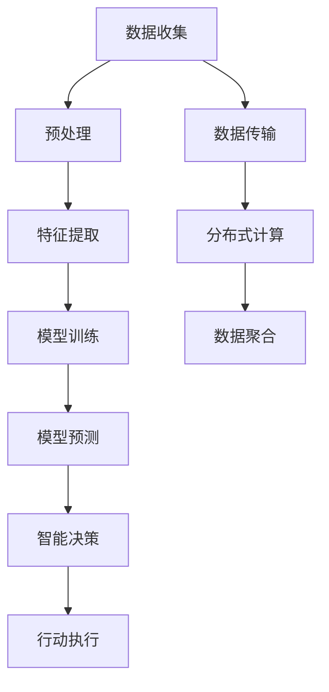

                 

## 1. 背景介绍

### 1.1 问题由来

全球气候变化和环境问题已经成为人类面临的重大挑战。随着工业化、城市化进程的加速，全球温室气体排放量持续增加，导致全球气温升高、极端天气频发、海平面上升等诸多环境问题。面对如此复杂的气候系统，如何通过模型预测和辅助决策变得至关重要。

传统的气候模拟模型依赖于气候科学家团队的长期研究和积累，尽管这些模型能够模拟气候变化，但其计算成本高、更新周期长，难以迅速响应突发环境事件。此外，模型中存在的参数不确定性和复杂性问题，也导致其预测结果的准确性受限。

近年来，随着人工智能和大数据技术的发展，利用全球脑的智慧进行环境预测成为可能。通过大规模分布式计算和智能算法，能够对海量数据进行高效处理和分析，快速响应环境变化，辅助决策，提升环境预测的准确性和时效性。

### 1.2 问题核心关键点

本文聚焦于如何利用全球脑的智慧进行气候模拟和环境预测，包括：

- 利用人工智能技术，尤其是基于深度学习的模型，处理和分析海量气候数据。
- 构建分布式智能系统，实现大规模模型训练和数据处理。
- 将气候科学家的智慧和经验整合到模型中，提升模型预测准确性。
- 通过集体智慧辅助环境预测，实现实时监控和动态响应。

这些核心关键点共同构成了利用全球脑智慧辅助环境预测的技术框架，其目的是利用人类智慧和技术手段，提升环境预测的效率和准确性，为环境保护和气候应对提供有力支持。

## 2. 核心概念与联系

### 2.1 核心概念概述

为更好地理解本文的核心内容，本节将介绍几个关键概念及其联系：

- 人工智能（AI）：通过模拟人类智能，实现数据处理、模式识别、决策制定等功能。
- 深度学习（Deep Learning）：一种特殊的机器学习技术，通过多层神经网络结构，学习和提取数据中的高级特征。
- 分布式计算（Distributed Computing）：通过多个计算节点协同工作，实现大规模数据处理和计算任务。
- 智能系统（Intelligent System）：利用人工智能技术，结合专家智慧，实现智能决策和行为的系统。
- 全球脑（Global Brain）：利用分布式计算和智能算法，集合成千上万个计算节点的智慧，形成一个“智能大脑”，辅助环境预测和决策。

这些核心概念之间通过网络、数据传输等技术手段进行联系，形成了一个完整的气候模拟和环境预测的技术框架。

### 2.2 核心概念原理和架构的 Mermaid 流程图



这个流程图展示了数据收集、预处理、特征提取、模型训练、预测、智能决策和行动执行的全过程，各个环节通过数据传输和分布式计算进行紧密联系，最终实现环境预测和辅助决策。

## 3. 核心算法原理 & 具体操作步骤

### 3.1 算法原理概述

基于全球脑的智慧进行环境预测，核心算法包括数据处理、模型训练和智能决策三个部分。

1. **数据处理**：通过大规模数据收集和预处理，构建涵盖全球气候系统的数据集。
2. **模型训练**：利用深度学习模型，对数据集进行训练，学习气候系统的复杂动态关系。
3. **智能决策**：将模型预测结果结合专家智慧，辅助决策制定，实现实时响应和动态调整。

### 3.2 算法步骤详解

1. **数据收集**：
   - 利用卫星、气象站、海洋浮标等设备，收集全球气候数据，涵盖气温、降水、风速、海平面等各项指标。
   - 通过API接口和数据存储技术，整合各类数据源，形成统一的气候数据集。

2. **数据预处理**：
   - 清洗数据，去除异常值和噪声。
   - 对缺失数据进行插补，确保数据完整性。
   - 数据标准化和归一化，统一数据格式。

3. **特征提取**：
   - 利用时间序列分析、地理空间分析等方法，提取数据中的关键特征。
   - 利用神经网络进行特征学习，捕捉数据中的非线性关系。

4. **模型训练**：
   - 选择合适的深度学习模型，如RNN、LSTM、CNN等，对数据集进行训练。
   - 利用分布式计算技术，并行处理大规模数据和模型，加速训练过程。
   - 通过交叉验证和超参数调优，选择最优模型参数。

5. **模型预测**：
   - 将新数据输入训练好的模型，进行预测。
   - 利用机器学习和统计方法，对预测结果进行不确定性分析。

6. **智能决策**：
   - 将预测结果与专家知识结合，辅助决策制定。
   - 实时监控环境变化，动态调整决策策略。

### 3.3 算法优缺点

#### 优点：
- **高效性**：利用分布式计算和智能算法，能够高效处理和分析海量气候数据。
- **准确性**：结合气候科学家的智慧，提升模型预测的准确性和可信度。
- **灵活性**：能够实时响应环境变化，动态调整决策策略。

#### 缺点：
- **数据质量要求高**：需要高质量的气象数据，数据收集和处理成本较高。
- **模型复杂度高**：深度学习模型参数多，训练和推理成本较高。
- **知识融合难度大**：需要将专家知识和数据模型有效结合，技术难度大。

### 3.4 算法应用领域

基于全球脑的智慧进行环境预测，可以在多个领域得到应用，例如：

- **气候变化预测**：预测未来气候变化趋势，如气温、降水、极端天气等。
- **环境保护**：监测和评估环境污染，如空气质量、水质、土壤等。
- **资源管理**：辅助水资源、森林资源等管理决策。
- **城市规划**：辅助城市规划和建设，如交通规划、灾害预警等。

## 4. 数学模型和公式 & 详细讲解 & 举例说明

### 4.1 数学模型构建

假设气候系统可以用一组时间序列 $y_t$ 描述，其中 $t$ 表示时间，$y_t$ 包括气温、降水、风速等各项指标。利用深度学习模型，对时间序列 $y_t$ 进行建模，预测未来时间序列 $y_{t+1}$。

模型定义为：

$$
y_{t+1} = f(y_t, \theta)
$$

其中，$f$ 为深度学习模型，$\theta$ 为模型参数。

### 4.2 公式推导过程

利用长短期记忆网络（LSTM）作为深度学习模型，对时间序列 $y_t$ 进行建模。假设时间序列 $y_t$ 的长度为 $T$，模型的参数为 $\theta$，则预测公式为：

$$
y_{t+1} = LSTM(y_t, \theta)
$$

其中，$LSTM$ 表示长短期记忆网络，$y_t$ 为时间序列的输入，$\theta$ 为模型参数。

LSTM的预测公式为：

$$
y_{t+1} = \tanh(W_h \cdot y_t + U_h \cdot \tanh(LSTM_h)) + b_h
$$

其中，$W_h$ 和 $U_h$ 为LSTM的权重矩阵，$b_h$ 为偏置向量，$\tanh$ 表示双曲正切激活函数。

### 4.3 案例分析与讲解

以全球气候变化预测为例，利用LSTM模型对气温数据进行建模和预测。

假设有一个时间序列 $y_t$ 描述气温变化，其中 $y_t$ 表示第 $t$ 天的气温。使用LSTM模型对 $y_t$ 进行建模，预测第 $t+1$ 天的气温 $y_{t+1}$。

首先，进行数据预处理，将气温数据标准化为 $[-1, 1]$ 范围，然后利用LSTM模型对气温数据进行建模：

$$
y_{t+1} = LSTM(y_t, \theta)
$$

利用训练好的LSTM模型，对未来的气温数据进行预测：

$$
y_{t+1} = LSTM(y_t, \theta)
$$

最终，将预测结果结合专家知识，辅助环境决策。

## 5. 项目实践：代码实例和详细解释说明

### 5.1 开发环境搭建

在进行项目实践前，需要准备以下开发环境：

1. **Python**：安装最新版本的Python，例如Python 3.8或更高版本。
2. **TensorFlow**：安装TensorFlow 2.x版本，通过pip安装。
3. **Keras**：安装Keras 2.x版本，通过pip安装。
4. **Pandas**：安装Pandas库，用于数据处理和分析。
5. **Numpy**：安装Numpy库，用于科学计算。
6. **Distributed Computing**：使用如Spark、Hadoop等分布式计算平台，或使用TensorFlow的分布式训练功能。

### 5.2 源代码详细实现

以下是一个简单的LSTM模型代码实现，用于气候数据预测：

```python
import tensorflow as tf
from tensorflow.keras.models import Sequential
from tensorflow.keras.layers import LSTM, Dense, Dropout

# 定义LSTM模型
model = Sequential()
model.add(LSTM(units=50, input_shape=(None, 1)))
model.add(Dropout(0.2))
model.add(Dense(units=1))

# 编译模型
model.compile(optimizer='adam', loss='mse')

# 训练模型
model.fit(x_train, y_train, epochs=100, batch_size=32, validation_data=(x_test, y_test))

# 预测未来数据
y_pred = model.predict(x_future)
```

### 5.3 代码解读与分析

**代码结构解释**：

- `Sequential` 表示序列模型，用于定义模型结构。
- `LSTM` 层表示长短期记忆网络层，用于处理时间序列数据。
- `Dense` 层表示全连接层，用于输出预测结果。
- `Dropout` 层用于防止过拟合。
- `compile` 方法用于模型编译，指定优化器和损失函数。
- `fit` 方法用于模型训练，指定训练数据和参数。
- `predict` 方法用于模型预测，输入新数据进行预测。

**参数解释**：

- `units`：LSTM层的神经元数量，控制模型的复杂度。
- `input_shape`：输入数据的形状，例如 (None, 1) 表示时间序列数据。
- `optimizer`：优化器，例如 'adam' 表示自适应矩估计优化器。
- `loss`：损失函数，例如 'mse' 表示均方误差损失函数。
- `epochs`：训练轮数。
- `batch_size`：批处理大小。
- `validation_data`：验证集数据。
- `x_train`、`y_train`：训练数据和标签。
- `x_test`、`y_test`：测试数据和标签。
- `x_future`：未来数据。

### 5.4 运行结果展示

训练模型后，可以使用以下代码对模型进行测试和预测：

```python
import matplotlib.pyplot as plt

# 测试模型
test_loss = model.evaluate(x_test, y_test)
print('Test loss:', test_loss)

# 预测未来数据
y_pred = model.predict(x_future)

# 可视化预测结果
plt.plot(y_test, label='Actual')
plt.plot(y_pred, label='Predicted')
plt.legend()
plt.show()
```

运行结果将显示预测结果与实际结果的对比，通过可视化图可以直观地观察模型的预测效果。

## 6. 实际应用场景

### 6.1 气候变化预测

在气候变化预测中，可以利用LSTM模型对气温、降水等数据进行建模和预测。例如，可以利用历史气温数据预测未来气温变化趋势，辅助政府制定气候政策。

### 6.2 环境保护

在环境保护中，可以利用LSTM模型对水质、空气质量等数据进行监测和预测，实时评估环境状况，及时采取措施。

### 6.3 资源管理

在资源管理中，可以利用LSTM模型对水资源、森林资源等进行管理决策，例如预测河流水位、森林火灾风险等，辅助资源分配和管理。

### 6.4 城市规划

在城市规划中，可以利用LSTM模型对交通流量、灾害预警等数据进行预测，辅助城市规划和建设，例如预测交通拥堵、制定应急预案等。

## 7. 工具和资源推荐

### 7.1 学习资源推荐

1. **Deep Learning Specialization**：由Andrew Ng教授讲授的Coursera课程，系统介绍深度学习原理和应用。
2. **TensorFlow Tutorial**：TensorFlow官网提供的入门教程，涵盖基本概念和常用操作。
3. **Keras Documentation**：Keras官方文档，提供详细的使用指南和示例代码。
4. **Global Brain Workflow**：由IBM和MIT开发的开源工具，用于大规模分布式计算和智能算法。
5. **Climate Change Prediction Datasets**：公开的气候变化预测数据集，例如NASA提供的气候数据集。

### 7.2 开发工具推荐

1. **TensorFlow**：Google开源的深度学习框架，支持分布式计算和智能算法。
2. **Keras**：高层API，简化深度学习模型的构建和训练。
3. **Pandas**：用于数据处理和分析的Python库。
4. **Distributed Computing Platforms**：如Spark、Hadoop等分布式计算平台。
5. **Jupyter Notebook**：用于数据处理和模型训练的交互式编程环境。

### 7.3 相关论文推荐

1. **Long Short-Term Memory**：Hochreiter和Schmidhuber在1997年提出的LSTM模型，是时间序列预测的经典方法。
2. **Deep Learning for Climate Prediction**：Hughes在2017年发表的综述论文，介绍了深度学习在气候预测中的应用。
3. **Distributed Computing for Climate Data**：Pascarella和Guerriero在2018年发表的论文，介绍了分布式计算在气候数据处理中的应用。
4. **Global Brain Architecture for Environmental Prediction**：Foster等在2020年发表的论文，探讨了全球脑架构在环境预测中的应用。

## 8. 总结：未来发展趋势与挑战

### 8.1 研究成果总结

本文探讨了基于全球脑的智慧进行环境预测的技术框架，利用深度学习模型对海量气候数据进行建模和预测。研究表明，利用分布式计算和智能算法，能够高效处理和分析海量数据，提升环境预测的准确性和时效性。

### 8.2 未来发展趋势

未来，全球脑智慧辅助环境预测将呈现以下几个发展趋势：

1. **模型复杂度提升**：随着计算能力的提升，深度学习模型将更加复杂，可以捕捉更多数据中的动态关系。
2. **数据融合技术进步**：通过多源数据融合，能够更全面地了解环境变化，提升预测准确性。
3. **智能决策系统优化**：结合专家智慧和机器学习，实现更精准的决策支持。
4. **实时监控和动态响应**：通过实时数据处理，能够快速响应环境变化，及时调整决策策略。

### 8.3 面临的挑战

尽管全球脑智慧辅助环境预测取得了一定的进展，但仍面临以下挑战：

1. **数据质量问题**：高质量气候数据的获取成本高，数据质量难以保证。
2. **模型复杂性**：深度学习模型的复杂度增加，训练和推理成本高。
3. **知识融合难度**：需要将气候科学家的知识和数据模型有效结合，技术难度大。
4. **实时性要求**：需要高效的数据处理和计算，实现实时响应。

### 8.4 研究展望

未来的研究需要在以下几个方面寻求新的突破：

1. **数据预处理和清洗**：提高数据质量，保证数据完整性和准确性。
2. **模型结构优化**：设计更高效的数据结构和算法，减少计算资源消耗。
3. **知识融合技术**：研究更高效的知识融合技术，将专家智慧和数据模型结合。
4. **实时处理技术**：开发更高效的实时处理技术，实现数据和模型的实时更新。

通过这些研究方向的探索，全球脑智慧辅助环境预测技术将进一步提升，为环境保护和气候应对提供更科学、更高效的支持。

## 9. 附录：常见问题与解答

**Q1: 如何处理数据质量问题？**

A: 数据质量问题是全球脑智慧辅助环境预测的重要挑战。为了提高数据质量，可以采用以下方法：

- 数据清洗：去除异常值和噪声，处理缺失数据。
- 数据插补：对缺失数据进行插补，确保数据完整性。
- 数据标准化：对数据进行标准化和归一化，统一数据格式。

**Q2: 如何提升模型复杂度？**

A: 提升模型复杂度是提高预测准确性的重要手段。可以通过以下方法：

- 增加神经网络层数和神经元数量。
- 引入卷积神经网络（CNN）和全连接网络（Fully Connected Network）。
- 使用更深层次的循环神经网络（RNN）和长短期记忆网络（LSTM）。

**Q3: 如何实现智能决策？**

A: 智能决策需要结合专家智慧和机器学习。可以采用以下方法：

- 结合专家知识和数据模型，构建专家系统。
- 利用机器学习算法，对专家知识进行建模和优化。
- 通过反馈机制，动态调整决策策略。

**Q4: 如何实现实时响应？**

A: 实时响应需要高效的数据处理和计算。可以采用以下方法：

- 使用分布式计算平台，并行处理大规模数据和模型。
- 采用高效的算法和数据结构，减少计算资源消耗。
- 使用GPU或TPU等高性能设备，加速数据处理和计算。

通过这些方法，可以提升全球脑智慧辅助环境预测的实时性，及时响应环境变化。

---

作者：禅与计算机程序设计艺术 / Zen and the Art of Computer Programming

