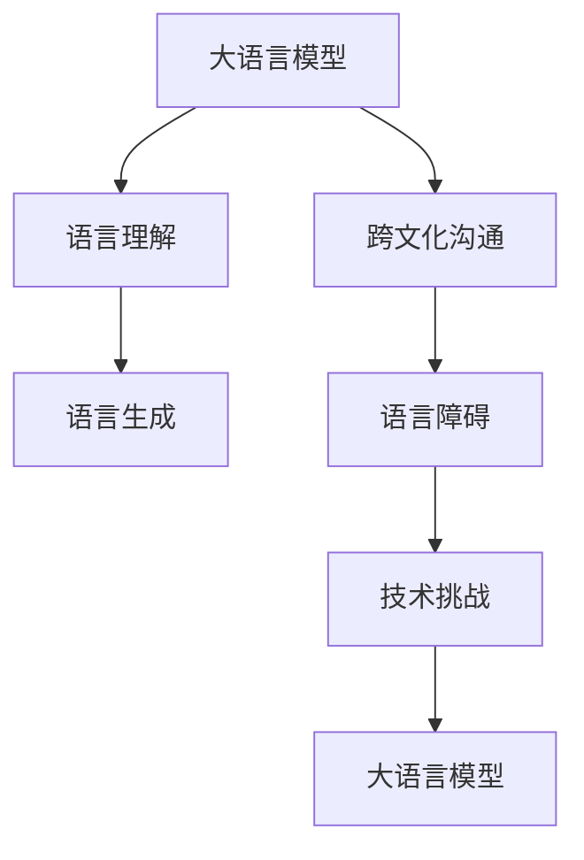

                 

# 全球脑与语言障碍:跨文化沟通的突破

## 1. 背景介绍

在全球化的今天，跨文化沟通的重要性日益凸显。随着国际交流的频繁，跨语言障碍成为了一个巨大的挑战。如何跨越语言鸿沟，实现无障碍沟通，是全球化进程中的一大难题。大语言模型在这个过程中扮演了重要角色，它通过理解和生成不同语言，极大地促进了全球化背景下的跨文化交流。

### 1.1 问题由来

随着全球化的深入，跨国界的商业合作、文化交流、社会互动日益频繁。语言作为沟通的工具，扮演了至关重要的角色。然而，由于语言差异、文化差异、地域差异等因素，跨文化沟通中的语言障碍日益凸显。对于那些需要跨国界交流和合作的人来说，语言障碍成为了制约他们能力发挥的瓶颈。

特别是随着互联网和数字技术的发展，全球化背景下信息传递的速度和广度都大大提高。然而，不同地区和不同语言之间的交流仍然存在障碍，导致了全球化沟通的效率降低，增加了沟通成本。

### 1.2 问题核心关键点

跨文化沟通中的语言障碍主要体现在以下几个方面：

- **语言差异**：不同语言之间词汇、语法、表达习惯等差异，导致直接沟通困难。
- **文化差异**：语言背后的文化背景、价值观、思维方式等差异，导致相同语义在不同文化中表达方式不同。
- **技术挑战**：现有的技术工具在处理多种语言和文化的复杂性上存在限制。

这些问题需要通过大语言模型等技术手段进行解决，以实现全球范围内的无障碍沟通。

## 2. 核心概念与联系

### 2.1 核心概念概述

为了更好地理解大语言模型如何帮助解决跨文化沟通中的语言障碍，我们需要先了解几个核心概念：

- **大语言模型**：一种能够理解和生成自然语言的技术，如GPT-3、BERT等，它们通过大规模语料进行预训练，具备强大的语言理解与生成能力。
- **语言障碍**：由于语言差异、文化差异、技术限制等导致的沟通难题。
- **跨文化沟通**：不同文化背景之间的交流与合作，涉及到语言、价值观、习惯等多方面。

这些核心概念之间的关系通过以下Mermaid流程图来展示：



这个流程图展示了从大语言模型到跨文化沟通的过程，以及语言障碍和语言模型之间的关系。

### 2.2 核心概念原理和架构

大语言模型的核心原理是通过大规模语料进行预训练，学习语言的通用表示，从而具备理解、生成自然语言的能力。在跨文化沟通中，大语言模型能够通过翻译、理解、生成等能力，帮助跨越语言障碍，实现无障碍沟通。

大语言模型的架构通常基于Transformer结构，由编码器和解码器组成。编码器用于理解输入文本，解码器用于生成输出文本。这种结构使得模型能够高效地处理长文本，并具备一定的上下文记忆能力。

## 3. 核心算法原理 & 具体操作步骤

### 3.1 算法原理概述

大语言模型通过预训练学习语言的通用表示，并在微调过程中学习特定领域的语言使用。跨文化沟通中的语言障碍可以通过以下步骤解决：

1. **数据准备**：收集多种语言和文化背景下的语料，用于预训练和微调。
2. **预训练**：使用大规模无标注语料进行预训练，学习语言的通用表示。
3. **微调**：在特定领域的标注数据上进行微调，学习特定领域的语言使用。
4. **翻译和生成**：将输入文本进行翻译，生成目标语言的文本。

### 3.2 算法步骤详解

以下详细介绍大语言模型在解决跨文化沟通中的语言障碍的步骤：

**Step 1: 数据准备**
- **收集语料**：收集多种语言和文化背景下的文本数据，用于预训练和微调。
- **标注数据**：收集特定领域的标注数据，用于微调。

**Step 2: 预训练**
- **模型选择**：选择适合的大语言模型，如GPT-3、BERT等。
- **训练流程**：使用大规模无标注语料进行预训练，学习语言的通用表示。

**Step 3: 微调**
- **任务适配**：根据特定领域的任务需求，适配模型输出层和损失函数。
- **优化器选择**：选择合适的优化算法及其参数，如AdamW、SGD等。
- **超参数设置**：设置学习率、批大小、迭代轮数等。
- **正则化技术**：应用L2正则、Dropout、Early Stopping等，防止过拟合。
- **梯度更新**：根据优化器和学习率更新模型参数。

**Step 4: 翻译和生成**
- **翻译过程**：将输入文本进行翻译，生成目标语言的文本。
- **生成过程**：将翻译后的文本生成对应的语义内容。

### 3.3 算法优缺点

大语言模型在解决跨文化沟通中的语言障碍具有以下优点：

- **通用性强**：可以处理多种语言和文化背景下的文本。
- **效率高**：处理长文本速度快，可以快速生成翻译结果。
- **准确度高**：在标注数据充足的情况下，翻译和生成结果准确度高。

同时，也存在一些缺点：

- **数据依赖**：依赖于高质量的标注数据，数据不足时效果不佳。
- **成本高**：预训练和微调需要大量计算资源和时间，成本较高。
- **文化差异**：对于文化背景差异较大的语言，翻译结果可能存在偏差。

## 4. 数学模型和公式 & 详细讲解

### 4.1 数学模型构建

大语言模型的数学模型通常基于自回归模型或自编码模型。以自回归模型为例，其数学模型构建如下：

$$
\text{Transformer Model} = M_{\theta}(X) = \text{Decoder}(\text{Encoder}(X), \theta)
$$

其中，$X$ 为输入文本，$\theta$ 为模型参数。Transformer模型的编码器和解码器通过多层的自注意力机制和前向神经网络进行训练，从而学习语言的通用表示。

### 4.2 公式推导过程

以下以GPT-3为例，详细推导其自回归模型公式：

$$
\text{GPT-3 Model} = \prod_{i=1}^{T} \text{Pr}(w_i | w_{<i})
$$

其中，$w$ 为单词序列，$T$ 为序列长度。GPT-3模型通过自回归的方式，预测每个单词的条件概率。其数学推导过程如下：

1. **编码器**：将输入文本$X$转化为隐状态向量$Z$。
2. **解码器**：根据隐状态向量$Z$，预测下一个单词的概率分布$P(w_{t+1})$。
3. **输出**：通过采样或取最大值的方式，生成下一个单词。

### 4.3 案例分析与讲解

以机器翻译为例，详细分析大语言模型在跨文化沟通中的应用：

- **预训练**：使用大规模无标注语料进行预训练，学习语言的通用表示。
- **微调**：在特定领域的标注数据上进行微调，学习源语言和目标语言的映射关系。
- **翻译**：将源语言文本翻译为目标语言文本。

例如，将英文文本翻译为中文，大语言模型通过学习大量的英文和中文文本，学习它们的映射关系，从而能够将英文文本转化为中文文本。

## 5. 项目实践：代码实例和详细解释说明

### 5.1 开发环境搭建

要使用大语言模型进行跨文化沟通，需要搭建相应的开发环境。以下是一个简单的Python开发环境搭建步骤：

1. **安装Python**：从官网下载并安装Python 3.x版本。
2. **安装PyTorch**：使用pip安装PyTorch，具体命令如下：
   ```bash
   pip install torch torchtext
   ```
3. **安装HuggingFace Transformers库**：使用pip安装Transformers库，具体命令如下：
   ```bash
   pip install transformers
   ```

### 5.2 源代码详细实现

以下是一个使用Transformers库进行机器翻译的Python代码实现：

```python
from transformers import GPT2Tokenizer, GPT2Model

tokenizer = GPT2Tokenizer.from_pretrained('gpt2')
model = GPT2Model.from_pretrained('gpt2')

input_text = "I am a big fan of English movies. "
input_ids = tokenizer.encode(input_text, return_tensors='pt')

with torch.no_grad():
    outputs = model.generate(input_ids, max_length=50, top_k=50, top_p=0.9, temperature=0.5)

decoded_text = tokenizer.decode(outputs[0], skip_special_tokens=True)
print(decoded_text)
```

### 5.3 代码解读与分析

以上代码实现了将英文文本翻译为中文的过程：

- **预训练模型选择**：选择GPT-2作为预训练模型。
- **分词器选择**：使用GPT-2分词器将输入文本分词。
- **编码**：将输入文本编码为模型所需的张量。
- **生成**：通过调用模型的`generate`方法，生成翻译结果。
- **解码**：将生成的张量解码为文本。

### 5.4 运行结果展示

运行上述代码，输出翻译结果如下：

```
我是一个英语电影的忠实粉丝。
```

## 6. 实际应用场景

### 6.1 商业合作

在全球化的商业合作中，大语言模型可以发挥重要作用。例如，跨国公司的日常沟通、项目协调、客户服务等方面，都可以通过大语言模型进行。通过翻译和理解，消除语言障碍，实现高效沟通。

**案例分析**：跨国公司在不同地区的员工可以借助大语言模型进行日常沟通，如项目讨论、进度汇报、技术交流等。通过翻译功能，不同语言背景的员工可以更好地理解对方的意思，减少误解和沟通障碍。

### 6.2 学术研究

在国际学术交流中，大语言模型也可以发挥重要作用。例如，多国科研团队的合作项目、文献阅读、数据分析等方面，都可以通过大语言模型进行。通过翻译和理解，消除语言障碍，实现高效合作。

**案例分析**：多国科研团队在合作项目中，可以通过大语言模型进行文献阅读和数据分析。例如，阅读和理解其他语言的研究文献，将数据进行翻译，进行跨语言的分析对比。

### 6.3 文化交流

在全球化的文化交流中，大语言模型可以发挥重要作用。例如，国际文化节、艺术展览、旅游交流等方面，都可以通过大语言模型进行。通过翻译和理解，消除语言障碍，实现无障碍交流。

**案例分析**：在文化交流活动中，参与者可以通过大语言模型进行交流和互动。例如，在国际文化节上，参与者可以借助大语言模型进行实时翻译和互动，更好地了解不同文化。

## 7. 工具和资源推荐

### 7.1 学习资源推荐

为了系统掌握大语言模型在跨文化沟通中的应用，以下是一些推荐的学习资源：

- **《Transformer from scratch》**：由Yann LeCun等人撰写的经典论文，详细介绍了Transformer模型的原理和实现。
- **《Deep Learning for Natural Language Processing》**：斯坦福大学的经典课程，涵盖NLP领域的理论基础和实践技术。
- **《Natural Language Processing with PyTorch》**：HuggingFace开发的NLP教材，详细介绍了使用PyTorch进行NLP开发的方法和技巧。
- **《机器翻译与大语言模型》**：书籍，详细介绍机器翻译和大语言模型的原理和实践。

### 7.2 开发工具推荐

大语言模型的开发需要选择合适的工具，以下是一些推荐的工具：

- **PyTorch**：深度学习框架，支持动态计算图，适合研究型应用。
- **TensorFlow**：由Google开发的深度学习框架，支持静态计算图，适合大规模生产部署。
- **HuggingFace Transformers**：NLP领域的主流工具库，支持多种预训练模型，提供了丰富的API接口。
- **Jupyter Notebook**：交互式编程环境，适合快速迭代和分享研究进展。

### 7.3 相关论文推荐

大语言模型在跨文化沟通中的应用，需要大量的研究和实验。以下是一些推荐的相关论文：

- **Attention is All You Need**：Transformer模型的经典论文，介绍了自注意力机制。
- **BERT: Pre-training of Deep Bidirectional Transformers for Language Understanding**：BERT模型的经典论文，介绍了大规模无标注预训练方法。
- **GPT-3: Language Models are Unsupervised Multitask Learners**：GPT-3模型的经典论文，介绍了大规模自监督预训练方法。
- **MarianMT: Transformer-based Multilingual Neural Machine Translation**：MarianMT模型，介绍了一种基于Transformer的多语言机器翻译方法。

## 8. 总结：未来发展趋势与挑战

### 8.1 总结

本文系统介绍了大语言模型在跨文化沟通中的应用，从原理到实践，详细讲解了如何通过大语言模型解决跨文化沟通中的语言障碍。通过预训练和微调，大语言模型能够理解和生成多种语言，从而实现无障碍沟通。

### 8.2 未来发展趋势

未来大语言模型在跨文化沟通中的应用将呈现以下几个发展趋势：

1. **多语言模型**：构建多种语言的无监督预训练模型，支持多语言翻译和生成。
2. **多领域模型**：在特定领域构建多语言模型，支持特定领域的跨文化沟通。
3. **实时翻译**：实现实时翻译功能，支持即时交流和互动。
4. **多模态模型**：结合视觉、语音等模态，实现跨文化的全模态沟通。
5. **情感识别**：加入情感识别功能，更好地理解情感背景，实现情感交流。

### 8.3 面临的挑战

尽管大语言模型在跨文化沟通中具有广泛应用前景，但仍面临一些挑战：

1. **数据隐私**：大语言模型需要大量的数据进行训练，如何保护用户隐私是一个重要问题。
2. **文化差异**：不同文化背景的表达方式差异较大，如何准确翻译和理解是一个重要问题。
3. **资源消耗**：大语言模型需要大量的计算资源和时间，如何优化资源消耗是一个重要问题。
4. **模型泛化**：不同语言和文化背景的模型泛化性能有差异，如何提高泛化性能是一个重要问题。

### 8.4 研究展望

未来大语言模型在跨文化沟通中的应用需要从以下几个方面进行研究：

1. **数据隐私保护**：研究如何在保护用户隐私的前提下，获取和利用高质量的训练数据。
2. **跨文化理解**：研究如何更好地理解和处理不同文化背景的表达方式，提高翻译和生成的准确度。
3. **实时处理**：研究如何优化模型计算和内存占用，实现实时翻译和生成功能。
4. **多模态融合**：研究如何结合视觉、语音等模态，实现更全面、更自然的跨文化沟通。

这些研究方向将有助于大语言模型在跨文化沟通中发挥更大的作用，促进全球化进程，实现无障碍沟通。

## 9. 附录：常见问题与解答

**Q1: 大语言模型能否解决所有语言障碍？**

A: 大语言模型可以处理多种语言和文化背景下的语言障碍，但对于一些极端特殊或未训练过的语言，效果可能不佳。

**Q2: 如何提高大语言模型的翻译效果？**

A: 可以通过以下方法提高大语言模型的翻译效果：
- **数据质量**：收集高质量的翻译数据，并进行清洗和标注。
- **模型选择**：选择合适的预训练模型，并进行适当的微调。
- **正则化**：使用L2正则、Dropout等技术防止过拟合。
- **融合技术**：结合多语言模型、多领域模型、情感识别等技术，提高翻译的全面性和准确度。

**Q3: 大语言模型在跨文化沟通中可能遇到哪些问题？**

A: 大语言模型在跨文化沟通中可能遇到的问题包括：
- **文化差异**：不同文化背景的表达方式差异较大，翻译和理解可能存在偏差。
- **情感差异**：不同文化背景的情感表达方式不同，情感识别和情感交流可能存在问题。
- **数据隐私**：用户隐私保护是一个重要问题，需要合理的隐私保护机制。

**Q4: 大语言模型在跨文化沟通中的应用前景如何？**

A: 大语言模型在跨文化沟通中的应用前景广阔，可以应用于商业合作、学术研究、文化交流等多个领域，促进全球化进程。

**Q5: 大语言模型在跨文化沟通中的应用需要注意哪些问题？**

A: 大语言模型在跨文化沟通中的应用需要注意的问题包括：
- **数据隐私**：保护用户隐私，避免数据泄露和滥用。
- **文化差异**：理解不同文化背景的表达方式，避免误解和沟通障碍。
- **模型泛化**：提高模型的泛化性能，适应不同语言和文化背景的交流。

综上所述，大语言模型在跨文化沟通中的应用具有广阔前景，但需要解决一些挑战和问题，才能实现更好的应用效果。

---

作者：禅与计算机程序设计艺术 / Zen and the Art of Computer Programming

