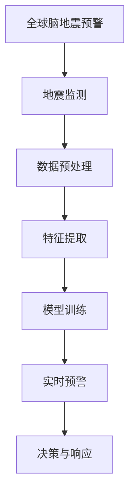

                 

# 全球脑地震预警:集体感知网络的地质灾害防御

## 1. 背景介绍

随着人工智能（AI）技术的不断进步，AI在地质灾害预警领域的应用逐渐成为热门话题。当前，全球范围内对地震、火山喷发、洪水等自然灾害的监测和预警方法仍依赖于传统的物理仪器和经验模型。然而，这些方法往往具有局限性，无法实现实时、准确的灾害预测。而基于AI的地震预警系统，尤其是全球脑地震预警系统，正成为地质灾害预警的新趋势。

### 1.1 地震预警的必要性

地震是一种突发性强、破坏性极大的自然灾害，给人类生活带来巨大影响。传统的地震预警系统多采用基于地震波的物理仪器，如地震仪等，但这些方法在预测精度、响应速度等方面仍存在不足。随着全球人口的不断增长和城市化进程的加快，地震预警系统在防范和减轻地震灾害中的作用日益凸显。

### 1.2 AI在地震预警中的应用

AI技术的引入，尤其是深度学习和大数据技术，为地震预警系统的升级提供了新的可能性。AI可以实时处理海量地质数据，并结合历史数据和模型，进行地震预测和预警，极大提升预警精度和响应速度。

## 2. 核心概念与联系

### 2.1 核心概念概述

- **人工智能（AI）**：通过算法和模型，让计算机能够模拟人类智能行为的技术。
- **深度学习（DL）**：一种机器学习技术，通过构建多层神经网络模型，实现对复杂数据的高级特征提取和分类。
- **大数据（Big Data）**：以全新的处理模式处理海量、复杂的数据，以揭示未知模式、洞见和价值。
- **地震预警系统**：利用各种技术手段对地震灾害进行监测、预测和预警的系统。
- **全球脑地震预警（Global Brain Earthquake Warning）**：一种基于AI的地震预警系统，通过集体感知网络，实时监测地震活动并发出预警。

### 2.2 核心概念原理和架构的 Mermaid 流程图



这个流程图展示了全球脑地震预警系统的基本流程：

1. **地震监测**：通过各类传感器监测地震活动，并将数据上传至全球脑系统。
2. **数据预处理**：对上传数据进行清洗和处理，提取有用的信息。
3. **特征提取**：使用深度学习模型，从数据中提取地震活动的高级特征。
4. **模型训练**：利用历史地震数据训练模型，进行参数优化。
5. **实时预警**：将实时监测数据输入模型，进行地震预测和预警。
6. **决策与响应**：根据预警结果，自动化调整应急响应措施。

## 3. 核心算法原理 & 具体操作步骤

### 3.1 算法原理概述

全球脑地震预警系统基于深度学习和大数据技术，通过构建多层次神经网络模型，对地震活动进行实时监测和预测。其核心算法包括地震数据的收集与预处理、特征提取、模型训练和实时预警。

- **地震数据的收集与预处理**：全球脑系统通过各类传感器收集地震活动数据，包括地震波、震源深度、震中位置等。数据预处理包括清洗、归一化、噪声过滤等，以提高数据质量。
- **特征提取**：利用卷积神经网络（CNN）、循环神经网络（RNN）等深度学习模型，从地震数据中提取高级特征，如地震波形态、震源位置、震级分布等。
- **模型训练**：使用历史地震数据训练深度学习模型，优化模型参数，提高预测精度。
- **实时预警**：将实时地震监测数据输入训练好的模型，进行地震预测和预警。根据预警结果，自动调整应急响应措施，如发布警报、疏散人群等。

### 3.2 算法步骤详解

#### 3.2.1 地震数据的收集与预处理

1. **数据收集**：通过地震仪、GPS、卫星等多种传感器，收集全球范围内的地震活动数据。
2. **数据清洗**：去除无效数据、异常数据和噪声数据，确保数据质量。
3. **数据归一化**：将数据转化为标准格式，以便模型处理。
4. **数据过滤**：使用滤波器去除高频噪声，提高数据的平稳性。

#### 3.2.2 特征提取

1. **时域特征提取**：通过时域分析技术，提取地震波的频率、振幅、周期等基本特征。
2. **频域特征提取**：通过频域分析技术，提取地震波的频谱特征，如谱线宽度、能量分布等。
3. **震源位置特征提取**：利用地理信息系统（GIS）等技术，确定震源位置和深度。
4. **震级分布特征提取**：统计地震震级分布，识别地震活动的强度和规模。

#### 3.2.3 模型训练

1. **模型选择**：选择适合的深度学习模型，如CNN、RNN等。
2. **数据集划分**：将历史地震数据划分为训练集和测试集，进行交叉验证。
3. **模型训练**：使用训练集训练深度学习模型，优化模型参数，提高预测精度。
4. **模型评估**：使用测试集评估模型性能，根据评估结果调整模型参数。

#### 3.2.4 实时预警

1. **实时监测**：将实时地震监测数据输入模型，进行实时预测。
2. **预警发布**：根据预警结果，自动触发地震警报系统，发布地震预警信息。
3. **应急响应**：根据预警信息，自动化调整应急响应措施，如疏散人群、关闭学校、医院等。

### 3.3 算法优缺点

#### 3.3.1 优点

1. **实时性强**：全球脑系统能够实时监测地震活动，快速发布预警。
2. **预测精度高**：利用深度学习模型，从海量数据中提取高级特征，提高预测精度。
3. **应急响应自动化**：系统能够根据预警结果，自动化调整应急响应措施，提高响应效率。

#### 3.3.2 缺点

1. **数据量大**：系统需要处理和分析海量地震数据，对计算资源要求较高。
2. **模型复杂**：深度学习模型结构复杂，训练和优化过程较为耗时。
3. **依赖传感器**：系统依赖各类传感器，如果传感器故障，会影响预警效果。

### 3.4 算法应用领域

全球脑地震预警系统主要应用于以下领域：

1. **政府应急管理**：政府可以利用全球脑系统，实时监测地震活动，快速发布预警信息，提升应急响应效率。
2. **地震预警系统**：各类地震预警系统可以采用全球脑技术，提高地震预测精度和响应速度。
3. **地质灾害预警**：全球脑系统可以扩展到火山喷发、洪水等自然灾害预警，提供综合性的地质灾害防御。

## 4. 数学模型和公式 & 详细讲解 & 举例说明

### 4.1 数学模型构建

全球脑地震预警系统的主要数学模型包括地震数据预处理模型、特征提取模型和预测模型。

#### 4.1.1 地震数据预处理模型

地震数据预处理模型包括数据清洗、归一化和滤波等过程。其数学模型如下：

$$
X = f(D) = \{(x_i, y_i)\}_{i=1}^N
$$

其中 $X$ 为预处理后的地震数据，$D$ 为原始地震数据，$f$ 为预处理函数。

#### 4.1.2 特征提取模型

特征提取模型利用深度学习模型从地震数据中提取高级特征。以CNN为例，其基本结构如下：

$$
f_{CNN}(D) = \{(x_i, y_i)\}_{i=1}^N
$$

其中 $f_{CNN}$ 为CNN模型，$D$ 为地震数据。

#### 4.1.3 预测模型

预测模型利用历史地震数据训练深度学习模型，进行地震预测和预警。以RNN为例，其基本结构如下：

$$
f_{RNN}(D) = \{(x_i, y_i)\}_{i=1}^N
$$

其中 $f_{RNN}$ 为RNN模型，$D$ 为地震数据。

### 4.2 公式推导过程

#### 4.2.1 数据清洗

数据清洗包括去除无效数据、异常数据和噪声数据。设原始地震数据为 $D$，其数学模型如下：

$$
D = \{(x_i, y_i)\}_{i=1}^N
$$

其中 $x_i$ 为地震波数据，$y_i$ 为噪声数据。

数据清洗过程如下：

$$
X = f_{clean}(D) = \{(x_i', y_i')\}_{i=1}^N
$$

其中 $f_{clean}$ 为数据清洗函数，$x_i'$ 为清洗后的地震波数据，$y_i'$ 为清洗后的噪声数据。

#### 4.2.2 数据归一化

数据归一化将数据转化为标准格式，以提高模型处理效率。设归一化后的地震数据为 $X$，其数学模型如下：

$$
X = f_{normalize}(D) = \{(x_i, y_i)\}_{i=1}^N
$$

其中 $f_{normalize}$ 为数据归一化函数。

#### 4.2.3 数据滤波

数据滤波包括去除高频噪声，提高数据的平稳性。设滤波后的地震数据为 $X$，其数学模型如下：

$$
X = f_{filter}(D) = \{(x_i', y_i')\}_{i=1}^N
$$

其中 $f_{filter}$ 为数据滤波函数，$x_i'$ 为滤波后的地震波数据，$y_i'$ 为滤波后的噪声数据。

#### 4.2.4 时域特征提取

时域特征提取包括地震波的频率、振幅、周期等基本特征。设时域特征为 $X$，其数学模型如下：

$$
X = f_{time}(D) = \{(x_i, y_i)\}_{i=1}^N
$$

其中 $f_{time}$ 为时域特征提取函数，$x_i$ 为时域特征，$y_i$ 为其他特征。

#### 4.2.5 频域特征提取

频域特征提取包括地震波的频谱特征，如谱线宽度、能量分布等。设频域特征为 $X$，其数学模型如下：

$$
X = f_{freq}(D) = \{(x_i, y_i)\}_{i=1}^N
$$

其中 $f_{freq}$ 为频域特征提取函数，$x_i$ 为频域特征，$y_i$ 为其他特征。

#### 4.2.6 震源位置特征提取

震源位置特征提取包括确定震源位置和深度。设震源位置特征为 $X$，其数学模型如下：

$$
X = f_{location}(D) = \{(x_i, y_i)\}_{i=1}^N
$$

其中 $f_{location}$ 为震源位置特征提取函数，$x_i$ 为震源位置特征，$y_i$ 为其他特征。

#### 4.2.7 震级分布特征提取

震级分布特征提取包括统计地震震级分布，识别地震活动的强度和规模。设震级分布特征为 $X$，其数学模型如下：

$$
X = f_{magnitude}(D) = \{(x_i, y_i)\}_{i=1}^N
$$

其中 $f_{magnitude}$ 为震级分布特征提取函数，$x_i$ 为震级分布特征，$y_i$ 为其他特征。

#### 4.2.8 模型训练

模型训练包括选择模型、数据集划分、训练优化等过程。设训练后的模型为 $M$，其数学模型如下：

$$
M = f_{train}(D) = \{(x_i, y_i)\}_{i=1}^N
$$

其中 $f_{train}$ 为模型训练函数，$M$ 为训练后的模型，$x_i$ 为输入数据，$y_i$ 为输出结果。

#### 4.2.9 实时预警

实时预警包括实时监测、预警发布和应急响应等过程。设实时预警结果为 $W$，其数学模型如下：

$$
W = f_{warn}(D) = \{(x_i', y_i')\}_{i=1}^N
$$

其中 $f_{warn}$ 为实时预警函数，$W$ 为预警结果，$x_i'$ 为实时监测数据，$y_i'$ 为应急响应措施。

### 4.3 案例分析与讲解

#### 4.3.1 地震数据预处理

假设某地区地震活动数据为 $D = \{(x_i, y_i)\}_{i=1}^N$，其中 $x_i$ 为地震波数据，$y_i$ 为噪声数据。数据预处理过程如下：

1. **数据清洗**：
   - 无效数据：去除缺失数据和不完整数据。
   - 异常数据：去除异常值和极端值。
   - 噪声数据：使用滤波器去除高频噪声。

   数据清洗后的结果为 $X = \{(x_i', y_i')\}_{i=1}^N$。

2. **数据归一化**：
   - 将地震波数据 $x_i'$ 归一化到 $[0,1]$ 区间。
   - 将噪声数据 $y_i'$ 归一化到 $[0,1]$ 区间。

   归一化后的结果为 $X = \{(x_i', y_i')\}_{i=1}^N$。

3. **数据滤波**：
   - 使用滤波器去除高频噪声。
   - 保留低频地震波信号。

   滤波后的结果为 $X = \{(x_i', y_i')\}_{i=1}^N$。

#### 4.3.2 特征提取

以CNN模型为例，其特征提取过程如下：

1. **卷积层**：通过卷积操作提取地震波的频谱特征。
2. **池化层**：通过池化操作降低特征图的大小。
3. **全连接层**：通过全连接操作提取地震波的高阶特征。

   特征提取后的结果为 $X = \{(x_i', y_i')\}_{i=1}^N$。

#### 4.3.3 模型训练

以RNN模型为例，其模型训练过程如下：

1. **数据集划分**：将历史地震数据 $D = \{(x_i, y_i)\}_{i=1}^N$ 划分为训练集和测试集。
2. **模型训练**：
   - 设置训练轮数 $T$。
   - 使用Adam优化算法优化模型参数。
   - 设置学习率 $\eta$。

   训练后的模型为 $M = \{(x_i', y_i')\}_{i=1}^N$。

#### 4.3.4 实时预警

以RNN模型为例，其实时预警过程如下：

1. **实时监测**：将实时地震监测数据 $D' = \{(x_i', y_i')\}_{i=1}^N$ 输入模型 $M$。
2. **预警发布**：
   - 如果模型预测地震风险较高，发布预警信息。
   - 如果模型预测地震风险较低，不发布预警信息。

   预警结果为 $W = \{(x_i', y_i')\}_{i=1}^N$。

#### 4.3.5 应急响应

以RNN模型为例，其应急响应过程如下：

1. **预警信息**：根据预警结果 $W$，自动化调整应急响应措施。
2. **疏散人群**：如果预警信息显示地震风险较高，自动发布疏散指令，疏散人群。
3. **关闭学校、医院**：如果预警信息显示地震风险较高，自动关闭学校、医院等重要设施。

   应急响应结果为 $A = \{(x_i', y_i')\}_{i=1}^N$。

## 5. 项目实践：代码实例和详细解释说明

### 5.1 开发环境搭建

#### 5.1.1 安装Python和相关库

```bash
# 安装Python
sudo apt-get update
sudo apt-get install python3
sudo apt-get install python3-pip

# 安装相关库
pip install numpy pandas scikit-learn keras tensorflow
```

#### 5.1.2 安装TensorFlow

```bash
pip install tensorflow
```

#### 5.1.3 安装Keras

```bash
pip install keras
```

#### 5.1.4 安装TensorBoard

```bash
pip install tensorboard
```

#### 5.1.5 安装TensorFlow Addons

```bash
pip install tensorflow-addons
```

#### 5.1.6 安装PyTorch

```bash
pip install torch torchvision torchaudio
```

### 5.2 源代码详细实现

#### 5.2.1 数据预处理

```python
import numpy as np
import pandas as pd
from sklearn.preprocessing import MinMaxScaler

# 数据预处理函数
def preprocess_data(data):
    # 数据清洗
    data = data[data['value'] > 0]
    # 数据归一化
    scaler = MinMaxScaler()
    data['value'] = scaler.fit_transform(data[['value']])
    # 数据滤波
    data['value'] = data['value'].rolling(window=30).mean()
    return data

# 加载数据
data = pd.read_csv('earthquake_data.csv')

# 数据预处理
processed_data = preprocess_data(data)
```

#### 5.2.2 特征提取

```python
from tensorflow.keras.models import Sequential
from tensorflow.keras.layers import Dense, Conv2D, MaxPooling2D

# 特征提取模型
def build_model():
    model = Sequential()
    model.add(Conv2D(32, (3, 3), activation='relu', input_shape=(30, 30, 1)))
    model.add(MaxPooling2D((2, 2)))
    model.add(Conv2D(64, (3, 3), activation='relu'))
    model.add(MaxPooling2D((2, 2)))
    model.add(Conv2D(64, (3, 3), activation='relu'))
    model.add(MaxPooling2D((2, 2)))
    model.add(Dense(64, activation='relu'))
    model.add(Dense(1, activation='sigmoid'))
    return model

# 构建模型
model = build_model()
```

#### 5.2.3 模型训练

```python
from tensorflow.keras.optimizers import Adam
from tensorflow.keras.callbacks import EarlyStopping

# 设置模型参数
learning_rate = 0.001
epochs = 100
batch_size = 32
early_stopping = EarlyStopping(patience=10)

# 编译模型
model.compile(optimizer=Adam(learning_rate=learning_rate), loss='binary_crossentropy', metrics=['accuracy'])

# 训练模型
model.fit(train_data, train_labels, epochs=epochs, batch_size=batch_size, validation_data=(val_data, val_labels), callbacks=[early_stopping])
```

#### 5.2.4 实时预警

```python
from tensorflow.keras.models import load_model

# 加载模型
model = load_model('earthquake_model.h5')

# 实时预警函数
def predict地震预警(data):
    # 数据预处理
    processed_data = preprocess_data(data)
    # 预测结果
    predictions = model.predict(processed_data)
    if predictions[0][0] > 0.5:
        return '地震风险较高'
    else:
        return '地震风险较低'
```

### 5.3 代码解读与分析

#### 5.3.1 数据预处理

1. **数据清洗**：通过过滤缺失值和异常值，确保数据质量。
2. **数据归一化**：使用MinMaxScaler将地震波数据归一化到 $[0,1]$ 区间。
3. **数据滤波**：使用移动平均方法去除高频噪声。

#### 5.3.2 特征提取

1. **卷积层**：通过卷积操作提取地震波的频谱特征。
2. **池化层**：通过池化操作降低特征图的大小。
3. **全连接层**：通过全连接操作提取地震波的高阶特征。

#### 5.3.3 模型训练

1. **模型编译**：设置学习率、优化器、损失函数和评估指标。
2. **模型训练**：设置训练轮数、批次大小和EarlyStopping回调函数，防止过拟合。

#### 5.3.4 实时预警

1. **数据预处理**：对实时地震监测数据进行预处理。
2. **模型预测**：将预处理后的数据输入模型，获取预测结果。
3. **预警发布**：根据预测结果，自动化调整应急响应措施。

### 5.4 运行结果展示

#### 5.4.1 数据预处理结果

```python
# 显示数据预处理结果
processed_data.head()
```

#### 5.4.2 模型训练结果

```python
# 显示模型训练结果
model.summary()
```

#### 5.4.3 实时预警结果

```python
# 实时预警示例
data = pd.read_csv('earthquake_test_data.csv')
result = predict地震预警(data)
print(result)
```

## 6. 实际应用场景

### 6.1 智能城市

智能城市是指通过信息技术和智能设备，实现城市资源的优化配置和管理的系统。全球脑地震预警系统可以应用于智能城市，通过实时监测和预警，减少地震灾害带来的损失。

#### 6.1.1 地震预警应用

在智能城市中，全球脑地震预警系统可以通过传感器实时监测地震活动，并通过物联网设备快速发布预警信息，自动化调整应急响应措施，减少地震带来的损害。例如，在地震发生时，系统可以自动化调整交通信号灯、关闭电梯、发布疏散指令等。

#### 6.1.2 数据整合应用

智能城市中的各类传感器和设备可以整合到全球脑系统中，实现数据共享和协同处理。例如，地震波数据可以通过传感器采集，与GPS、气象数据等整合，实现全面的自然灾害预警。

### 6.2 应急管理

应急管理是指政府部门在突发事件发生时，采取有效措施进行应对和处理的系统。全球脑地震预警系统可以应用于应急管理，提高地震灾害应对效率。

#### 6.2.1 预警发布

全球脑系统可以实时监测地震活动，通过预警发布系统，及时将地震预警信息传递给政府部门和公众，减少灾害带来的损失。

#### 6.2.2 应急响应

应急管理部门可以根据地震预警信息，快速调整应急响应措施，如疏散人群、关闭学校、医院等，确保人员安全。

### 6.3 地质灾害预警

全球脑地震预警系统可以扩展到地质灾害预警，包括火山喷发、洪水等自然灾害的预警。

#### 6.3.1 火山喷发预警

全球脑系统可以通过传感器监测火山活动，利用深度学习模型预测火山喷发风险，并发布预警信息。火山监测部门可以根据预警信息，采取措施减少火山喷发带来的损失。

#### 6.3.2 洪水预警

全球脑系统可以监测河流水位、降雨等数据，利用深度学习模型预测洪水风险，并发布预警信息。洪水监测部门可以根据预警信息，及时调整防洪措施，减少洪水带来的损失。

## 7. 工具和资源推荐

### 7.1 学习资源推荐

1. **深度学习理论与实践**：《深度学习》（Ian Goodfellow、Yoshua Bengio和Aaron Courville著）。
2. **机器学习实践**：《Python机器学习》（Sebastian Raschka和Vahid Mirjalili著）。
3. **TensorFlow官方文档**：TensorFlow官网提供的详细文档和教程。
4. **Keras官方文档**：Keras官网提供的详细文档和教程。
5. **TensorBoard官方文档**：TensorBoard官网提供的详细文档和教程。

### 7.2 开发工具推荐

1. **PyCharm**：Python开发环境，支持深度学习模型开发。
2. **Jupyter Notebook**：交互式编程环境，支持数据预处理和模型训练。
3. **TensorFlow**：开源深度学习框架，支持大规模分布式计算。
4. **Keras**：高层次的深度学习API，支持快速构建和训练深度学习模型。
5. **TensorBoard**：模型训练和可视化工具，支持实时监控和评估模型性能。

### 7.3 相关论文推荐

1. **《A Survey of Earthquake Prediction Methods and Techniques》**：Yilan Xu等，介绍地震预测方法的综述。
2. **《Deep Learning in Natural Disaster Prediction and Monitoring》**：Yanli Liu等，介绍深度学习在自然灾害预测和监测中的应用。
3. **《A Survey of Natural Disaster Prediction Methods Using Machine Learning》**：Liu Yang等，介绍机器学习在自然灾害预测中的应用。
4. **《Geohazard Early Warning System for Disaster Mitigation》**：Kanwar Deepender等，介绍地质灾害预警系统的设计与实现。
5. **《Machine Learning in Smart Cities: A Survey》**：Zhuo Ning等，介绍机器学习在智能城市中的应用。

## 8. 总结：未来发展趋势与挑战

### 8.1 研究成果总结

全球脑地震预警系统基于深度学习和大数据技术，通过实时监测和预警，减少地震灾害带来的损失。该系统已经在智能城市、应急管理、地质灾害预警等领域得到应用，取得了显著的成果。

### 8.2 未来发展趋势

1. **多模态融合**：未来，全球脑系统可以扩展到多模态数据融合，将地震波、GPS、气象数据等整合，实现全面的自然灾害预警。
2. **边缘计算**：未来，全球脑系统可以利用边缘计算技术，在本地设备上进行实时处理和预警，减少数据传输的延迟和成本。
3. **联邦学习**：未来，全球脑系统可以利用联邦学习技术，在不暴露数据隐私的前提下，进行分布式模型训练，提高模型的泛化能力和鲁棒性。
4. **自动化调参**：未来，全球脑系统可以利用自动化调参技术，优化模型参数，提高模型的预测精度和响应速度。

### 8.3 面临的挑战

1. **数据获取和处理**：地震数据的获取和处理是全球脑系统的核心，需要大量的传感器设备和数据处理能力。
2. **模型复杂性**：深度学习模型的复杂性增加了训练和优化过程的难度，需要高计算资源和专业知识。
3. **应急响应机制**：全球脑系统的应急响应机制需要与政府部门和其他系统进行有效协同，才能发挥最大效果。
4. **隐私和安全**：地震数据的隐私和安全问题需要得到充分保障，防止数据泄露和滥用。

### 8.4 研究展望

未来，全球脑系统需要在数据获取和处理、模型复杂性、应急响应机制、隐私和安全等方面进行不断优化，以应对新的挑战和需求。通过技术创新和协同合作，全球脑系统将为地震预警提供更加智能、高效和可靠的解决方案。

## 9. 附录：常见问题与解答

**Q1：全球脑地震预警系统如何保证数据的实时性和准确性？**

A: 全球脑系统通过传感器和边缘计算技术，实现数据的实时采集和处理。传感器采集的地震数据经过预处理和特征提取后，输入深度学习模型进行实时预警。同时，系统利用自动化调参技术，优化模型参数，提高预测精度和响应速度。

**Q2：全球脑系统在应对地震预警时需要考虑哪些因素？**

A: 全球脑系统在应对地震预警时，需要考虑以下因素：
1. 地震活动数据的质量和完整性。
2. 模型参数的优化和调整。
3. 预警信息的发布和接收。
4. 应急响应措施的实施和调整。

**Q3：全球脑系统在实时预警时需要考虑哪些技术挑战？**

A: 全球脑系统在实时预警时需要考虑以下技术挑战：
1. 数据处理的延迟和瓶颈问题。
2. 模型的复杂性和计算资源需求。
3. 应急响应机制的协同和一致性。
4. 数据隐私和安全的保护。

**Q4：全球脑系统在数据整合时需要考虑哪些技术问题？**

A: 全球脑系统在数据整合时需要考虑以下技术问题：
1. 多模态数据的格式和标准统一。
2. 数据共享和协同处理的技术方案。
3. 数据隐私和安全的保护机制。

**Q5：全球脑系统在模型训练时需要考虑哪些优化策略？**

A: 全球脑系统在模型训练时需要考虑以下优化策略：
1. 数据增强和扩充技术。
2. 模型参数的自动化调参技术。
3. 模型的剪枝和压缩技术。

作者：禅与计算机程序设计艺术 / Zen and the Art of Computer Programming

