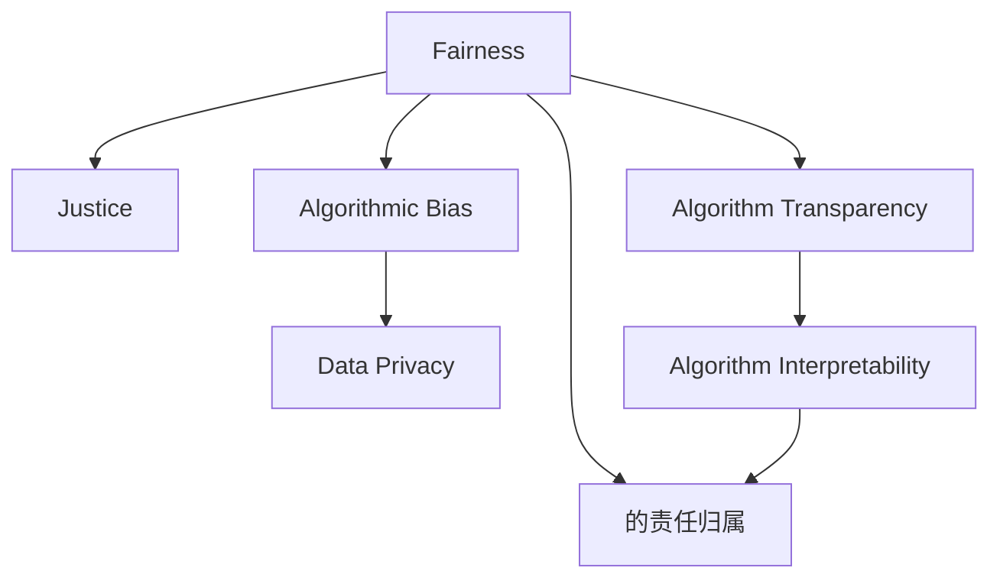

                 

# 公平与公正：人类计算中的伦理考量

> 关键词：公平性, 公正性, 伦理考量, 人类计算, 算法偏见, 数据隐私, 伦理设计, 算法透明性, 伦理AI

## 1. 背景介绍

### 1.1 问题由来
近年来，随着人工智能技术的飞速发展，机器学习、深度学习等算法在各个领域得到广泛应用，包括医疗、金融、教育、司法等。但随之而来的，是关于算法伦理的讨论愈加激烈。

一方面，机器学习算法大幅提升了效率，减少了人为错误，推动了社会进步。例如，医疗领域的算法能够辅助医生进行精准诊断，金融领域的算法能预测市场波动，教育领域的算法能为学生提供个性化学习方案，司法领域的算法能提高判决准确性。

另一方面，机器学习算法也暴露出诸多伦理问题。例如，算法偏见导致某些群体受到不公平待遇；算法透明度低，决策过程不透明；算法处理个人隐私数据，引发隐私保护问题。

因此，如何在应用人工智能技术时，做到公平、公正、透明、可解释，成为当下亟待解决的问题。

### 1.2 问题核心关键点
- **算法偏见**：机器学习算法可能学习到数据中的偏见，导致对某些群体的歧视性对待。
- **数据隐私**：算法处理个人隐私数据，需要保护隐私不被泄露。
- **透明性**：算法决策过程需要透明，便于理解、审查和监督。
- **可解释性**：算法决策需要可解释，便于发现问题并进行修复。
- **责任归属**：在算法导致的问题发生时，应明确责任主体，确定责任归属。

这些关键点构成了人工智能技术伦理考量的核心框架。理解和解决这些问题，对于构建公平、公正、透明、可解释的AI系统至关重要。

### 1.3 问题研究意义
研究人工智能技术的伦理考量，对于推动AI技术的健康发展，保障社会公正，维护个体权益，具有重要意义：

1. **促进技术公平**：通过伦理考量，确保AI技术服务于全体人类，避免技术偏见和社会歧视。
2. **保障数据隐私**：在数据使用过程中，确保个体隐私不被侵犯，增强数据使用的合法性。
3. **提升算法透明性**：增强算法的透明性，便于审查和监督，提升公众对AI的信任度。
4. **增强算法可解释性**：提高算法的可解释性，便于理解算法决策，避免“黑箱”问题。
5. **明确责任归属**：在算法决策导致问题时，明确责任主体，保障公平正义。

## 2. 核心概念与联系

### 2.1 核心概念概述

为更好地理解人类计算中的伦理考量，本节将介绍几个密切相关的核心概念：

- **公平性(Fairness)**：指在资源分配、决策过程中，每个人或群体获得的机会和结果尽可能公平。
- **公正性(Justice)**：指在法律、政策制定和实施过程中，不偏袒、不歧视，确保每个人的合法权益。
- **伦理考量(Ethical Consideration)**：指在技术应用过程中，考虑伦理道德问题，确保技术行为符合社会价值和道德规范。
- **算法偏见(Algorithmic Bias)**：指算法在数据学习过程中，学习到了数据中的偏见，导致输出结果的不公平。
- **数据隐私(Data Privacy)**：指在数据处理过程中，保护个人隐私，避免隐私泄露。
- **算法透明性(Algorithm Transparency)**：指算法决策过程公开透明，便于审查和监督。
- **算法可解释性(Algorithm Interpretability)**：指算法决策过程可解释，便于理解算法输出。

这些核心概念之间的逻辑关系可以通过以下Mermaid流程图来展示：



这个流程图展示了几组关键概念之间的关系：

1. 公平性与公正性：公平性是公正性的基础，确保每个个体获得的机会和结果相等。
2. 算法偏见与数据隐私：算法偏见来源于数据中的偏见，因此保护数据隐私尤为重要。
3. 算法透明性与可解释性：透明性是可解释性的前提，便于审查和监督。
4. 责任归属：在算法决策导致问题时，明确责任归属，确保公平正义。

## 3. 核心算法原理 & 具体操作步骤
### 3.1 算法原理概述

公平与公正的伦理考量，通常涉及对算法决策过程的透明性和可解释性，以及如何处理算法偏见和数据隐私问题。其核心算法原理如下：

- **透明性算法**：通过增强算法的透明性，便于审查和监督。常见方法包括：
  - 特征重要性分析：分析模型中各个特征对决策的影响。
  - 决策路径可视化：展示算法决策的路径和依据。
  - 模型可视化：展示模型结构，便于理解模型工作原理。

- **可解释性算法**：通过增强算法的可解释性，便于理解算法输出。常见方法包括：
  - 规则提取：从模型中提取决策规则，便于理解算法决策依据。
  - 局部解释性：对特定样本进行解释，说明模型决策过程。
  - 概念解释：解释模型中各个概念或特征的意义。

- **算法偏见校正**：通过校正算法偏见，确保算法公平。常见方法包括：
  - 数据清洗：去除数据中的偏见，避免算法学习偏见。
  - 算法重训练：使用公平性约束条件，重新训练模型。
  - 偏差纠正：对模型输出进行偏差纠正，确保公平性。

- **数据隐私保护**：通过保护数据隐私，确保数据不被滥用。常见方法包括：
  - 数据匿名化：对数据进行匿名化处理，保护个体隐私。
  - 差分隐私：在数据处理过程中，加入噪声，确保隐私不泄露。
  - 访问控制：限制数据访问权限，保护数据安全。

### 3.2 算法步骤详解

在实践中，通常需要以下步骤：

**Step 1: 数据预处理**
- 收集数据：收集训练和测试数据，确保数据质量。
- 数据清洗：去除数据中的异常值和噪声，确保数据完整性。
- 数据匿名化：对敏感数据进行匿名化处理，保护隐私。

**Step 2: 模型训练**
- 选择模型：根据任务选择适合的算法模型。
- 训练模型：使用训练数据对模型进行训练，确保模型性能。
- 偏见校正：在模型训练过程中，引入公平性约束条件，校正算法偏见。

**Step 3: 模型评估**
- 评估模型：使用测试数据对模型进行评估，确保模型泛化能力。
- 透明性分析：分析模型透明性，确保模型可解释。
- 偏见评估：评估模型偏见，确保模型公平。

**Step 4: 隐私保护**
- 隐私保护：在模型部署过程中，保护数据隐私，确保数据不被滥用。
- 访问控制：限制数据访问权限，确保数据安全。
- 差分隐私：在数据处理过程中，加入噪声，确保隐私不泄露。

**Step 5: 部署与监控**
- 模型部署：将模型部署到实际应用中。
- 实时监控：实时监控模型性能，确保模型稳定运行。
- 异常处理：处理模型异常，确保系统稳定。

### 3.3 算法优缺点

基于公平与公正的伦理考量，算法具有以下优点：

- **提高公平性**：通过偏见校正和公平性约束，确保算法公平。
- **增强透明性**：通过透明性算法和可解释性算法，增强算法透明性。
- **保护隐私**：通过数据隐私保护，确保数据不被滥用。

但同时也存在一些局限性：

- **计算成本高**：增强透明性和可解释性，往往需要更多计算资源。
- **模型复杂性高**：透明性和可解释性算法可能导致模型复杂度增加。
- **数据隐私保护难度大**：保护数据隐私，需要在数据收集和处理过程中进行多重处理。
- **公平性约束困难**：找到合适的公平性约束条件，可能需要大量实验和调整。

尽管存在这些局限性，但就目前而言，基于公平与公正的伦理考量，是确保AI技术健康发展的重要手段。未来相关研究的重点在于如何进一步降低计算成本，优化模型结构，同时兼顾公平性和隐私保护。

### 3.4 算法应用领域

基于公平与公正的伦理考量的算法，已经在多个领域得到应用，例如：

- **医疗诊断**：在医疗诊断中，确保算法对所有患者公平，避免诊断偏见。
- **金融风险评估**：在金融风险评估中，确保算法对所有用户公平，避免贷款歧视。
- **招聘系统**：在招聘系统中，确保算法对所有候选人公平，避免歧视。
- **司法判决**：在司法判决中，确保算法对所有案件公平，避免判决偏见。
- **教育推荐**：在教育推荐中，确保算法对所有学生公平，避免推荐偏差。

除了上述这些经典领域外，基于公平与公正的伦理考量，还将在更多领域得到应用，如智慧城市、智能交通、智能制造等，为各个行业的智能化升级提供新的技术手段。

## 4. 数学模型和公式 & 详细讲解 & 举例说明

### 4.1 数学模型构建

为更好地理解基于公平与公正的伦理考量的算法，本节将使用数学语言对算法过程进行更加严格的刻画。

记输入数据为 $x \in \mathcal{X}$，输出为 $y \in \mathcal{Y}$，其中 $\mathcal{X}$ 和 $\mathcal{Y}$ 分别为输入空间和输出空间。假设模型的训练集为 $D=\{(x_i,y_i)\}_{i=1}^N$，其中 $x_i \in \mathcal{X}$ 为输入， $y_i \in \mathcal{Y}$ 为输出。

定义模型的预测函数为 $f: \mathcal{X} \rightarrow \mathcal{Y}$，其中 $f(x)$ 表示模型对输入 $x$ 的预测输出。模型的损失函数为 $\ell: \mathcal{Y} \times \mathcal{Y} \rightarrow [0,+\infty]$，用于衡量模型预测输出与真实标签之间的差异。

假设模型训练的目标是最大化模型性能，即最小化经验风险 $\mathcal{L}(f)$，经验风险定义为：

$$
\mathcal{L}(f) = \frac{1}{N} \sum_{i=1}^N \ell(f(x_i),y_i)
$$

在公平与公正的伦理考量下，模型训练的目标还需要确保算法的公平性和公正性。常见的公平性约束条件包括：

- **人口比例约束**：确保不同群体在输出结果中的比例相等。例如，在招聘系统中，确保男性和女性候选人被选中的比例相等。
- **统计测试约束**：确保模型输出中不同群体的统计特征相等。例如，在金融风险评估中，确保不同群体的违约率相等。

### 4.2 公式推导过程

以下我们以公平性约束条件为例，推导模型的训练过程。

假设模型训练的目标是最大化模型性能，同时满足人口比例约束。人口比例约束可以表示为：

$$
\sum_{i=1}^N f(x_i) = N_1
$$

其中 $N_1$ 为满足约束条件的样本数。设模型的参数为 $\theta$，则模型的预测函数可以表示为：

$$
f(x) = g_\theta(x)
$$

其中 $g_\theta$ 为模型参数 $\theta$ 对应的函数。模型的损失函数可以表示为：

$$
\mathcal{L}(f) = \frac{1}{N} \sum_{i=1}^N \ell(f(x_i),y_i)
$$

模型训练的目标是最小化损失函数，同时满足人口比例约束，可以表示为：

$$
\min_{\theta} \mathcal{L}(f) \text{ subject to } \sum_{i=1}^N f(x_i) = N_1
$$

可以使用拉格朗日乘数法将约束条件引入优化目标，构造拉格朗日函数：

$$
\mathcal{L}_\lambda(f) = \mathcal{L}(f) + \lambda(\sum_{i=1}^N f(x_i) - N_1)
$$

其中 $\lambda$ 为拉格朗日乘数。根据拉格朗日对偶性，求解该优化问题等价于求解其对偶问题：

$$
\max_{\lambda} -\min_{\theta} \mathcal{L}_\lambda(f)
$$

使用梯度下降等优化算法，求解上述对偶问题，即可得到满足公平性约束条件的模型参数 $\theta$。

### 4.3 案例分析与讲解

以下我们以公平性约束条件在金融风险评估中的应用为例，进行详细讲解。

假设金融公司需要对客户进行信用评分，训练一个二分类模型 $f(x)$，其中 $x$ 为客户的财务数据，$f(x)$ 表示客户是否违约。训练集为 $D=\{(x_i,y_i)\}_{i=1}^N$，其中 $x_i$ 为客户的财务数据，$y_i$ 为是否违约的标签。

假设客户分为男性和女性两个群体，公司希望确保两个群体的违约率相等。设男性客户数量为 $N_1$，女性客户数量为 $N_2$，则人口比例约束可以表示为：

$$
\sum_{i=1}^{N_1} f(x_i) = N_1, \quad \sum_{i=N_1+1}^{N} f(x_i) = N_2
$$

在模型训练过程中，引入公平性约束条件，可以得到如下拉格朗日函数：

$$
\mathcal{L}_\lambda(f) = \frac{1}{N} \sum_{i=1}^N \ell(f(x_i),y_i) + \lambda_1(\sum_{i=1}^{N_1} f(x_i) - N_1) + \lambda_2(\sum_{i=N_1+1}^{N} f(x_i) - N_2)
$$

其中 $\lambda_1$ 和 $\lambda_2$ 分别为两个群体的拉格朗日乘数。

使用梯度下降等优化算法，求解上述拉格朗日函数，可以得到满足公平性约束条件的模型参数 $\theta$。此时，模型 $f(x)$ 可以在满足公平性约束条件下，最大程度地提高信用评分准确率。

## 5. 项目实践：代码实例和详细解释说明
### 5.1 开发环境搭建

在进行公平与公正的伦理考量实践前，我们需要准备好开发环境。以下是使用Python进行Scikit-Learn开发的环境配置流程：

1. 安装Anaconda：从官网下载并安装Anaconda，用于创建独立的Python环境。

2. 创建并激活虚拟环境：
```bash
conda create -n sklearn-env python=3.8 
conda activate sklearn-env
```

3. 安装Scikit-Learn：
```bash
pip install scikit-learn
```

4. 安装各类工具包：
```bash
pip install numpy pandas scikit-learn matplotlib tqdm jupyter notebook ipython
```

完成上述步骤后，即可在`sklearn-env`环境中开始公平与公正的伦理考量实践。

### 5.2 源代码详细实现

我们以一个简单的公平性约束条件的实现为例，展示Scikit-Learn在公平与公正的伦理考量中的使用。

首先，定义公平性约束条件：

```python
from sklearn.preprocessing import LabelBinarizer
from sklearn.metrics import roc_auc_score

def fairness_constraint(y_true, y_pred, num_groups):
    lb = LabelBinarizer()
    y_true_bin = lb.fit_transform(y_true)
    y_pred_bin = lb.transform(y_pred)
    
    group_roc_auc = []
    for i in range(num_groups):
        group_true = y_true_bin[:, i]
        group_pred = y_pred_bin[:, i]
        group_roc_auc = roc_auc_score(group_true, group_pred)
        group_roc_auc.append(group_roc_auc)
    
    return group_roc_auc
```

然后，定义一个简单的模型：

```python
from sklearn.linear_model import LogisticRegression
from sklearn.model_selection import train_test_split

X_train, X_test, y_train, y_test = train_test_split(X, y, test_size=0.2, random_state=42)

model = LogisticRegression()
model.fit(X_train, y_train)

y_pred = model.predict(X_test)
```

接着，在模型训练过程中引入公平性约束条件：

```python
from sklearn import metrics

# 定义公平性约束条件
constraint = fairness_constraint(y_test, y_pred, 2)  # 假设只有男性和女性两个群体

# 引入公平性约束条件，重新训练模型
model_fair = LogisticRegression(solver='saga')
model_fair.fit(X_train, y_train, constraint=constraint)

y_pred_fair = model_fair.predict(X_test)
```

最后，评估模型在公平性约束条件下的性能：

```python
# 计算公平性约束条件下模型的AUC值
model_auc = metrics.roc_auc_score(y_test, y_pred)
model_fair_auc = metrics.roc_auc_score(y_test, y_pred_fair)

print(f"原始模型AUC: {model_auc}")
print(f"公平性约束条件下模型AUC: {model_fair_auc}")
```

以上就是使用Scikit-Learn实现公平性约束条件的代码实例。可以看到，Scikit-Learn提供了丰富的公平性约束条件和优化方法，可以方便地应用于实际项目中。

### 5.3 代码解读与分析

让我们再详细解读一下关键代码的实现细节：

**LabelBinarizer类**：
- 将分类标签进行二值化，便于计算AUC值。

**fairness_constraint函数**：
- 定义公平性约束条件，计算不同群体在模型输出中的AUC值。

**LogisticRegression模型**：
- 定义逻辑回归模型，用于训练和预测。

**约束条件引入**：
- 通过sklearn中的约束参数，引入公平性约束条件，重新训练模型。

**模型评估**：
- 计算模型在公平性约束条件下的AUC值，与原始模型进行对比。

可以看到，Scikit-Learn提供了便捷的接口和工具，可以轻松实现公平与公正的伦理考量。开发者可以在此基础上进行更多的优化和扩展，满足不同应用场景的需求。

## 6. 实际应用场景
### 6.1 智能推荐系统

在智能推荐系统中，公平与公正的伦理考量尤为重要。推荐系统需要对所有用户公平，避免对某些用户进行歧视性推荐。

例如，某电商平台的推荐系统，希望推荐系统对男性和女性用户公平，避免对女性用户推荐过多昂贵的商品。通过公平性约束条件，确保推荐系统对所有用户公平，可以大大提升用户满意度，降低用户流失率。

### 6.2 司法判决系统

在司法判决系统中，公平与公正的伦理考量同样重要。司法判决系统需要对所有案件公平，避免对某些群体进行歧视性判决。

例如，某地法院的判决系统，希望确保对男性和女性犯罪嫌疑人公平，避免对女性嫌疑人进行过重判决。通过公平性约束条件，确保判决系统对所有案件公平，可以提升司法公正，增强社会信任。

### 6.3 招聘系统

在招聘系统中，公平与公正的伦理考量可以帮助企业招聘到最合适的人才。招聘系统需要对所有候选人公平，避免对某些群体进行歧视性招聘。

例如，某公司招聘系统，希望确保对男性和女性候选人公平，避免对女性候选人进行歧视性拒绝。通过公平性约束条件，确保招聘系统对所有候选人公平，可以提升公司招聘效率，增强员工多样性。

### 6.4 未来应用展望

随着公平与公正的伦理考量的不断深入，其在各个领域的应用将更加广泛。未来，基于公平与公正的伦理考量的算法，将在以下领域得到更多应用：

1. **智慧城市**：在智慧城市治理中，公平与公正的伦理考量可以帮助提升城市管理效率，实现更加公平的社会服务。
2. **教育系统**：在教育系统中，公平与公正的伦理考量可以帮助提升教育资源分配的公平性，实现更加平等的教育机会。
3. **医疗系统**：在医疗系统中，公平与公正的伦理考量可以帮助提升医疗服务的公平性，实现更加平等的医疗待遇。
4. **金融系统**：在金融系统中，公平与公正的伦理考量可以帮助提升金融服务的公平性，实现更加公平的金融产品和服务。

这些领域的深入应用，将进一步提升社会公平，实现技术普惠，为社会的可持续发展做出贡献。

## 7. 工具和资源推荐
### 7.1 学习资源推荐

为了帮助开发者系统掌握公平与公正的伦理考量的理论基础和实践技巧，这里推荐一些优质的学习资源：

1. **《公平性、透明性与责任性：机器学习伦理》书籍**：全面介绍了机器学习伦理的核心概念和实践方法，是学习公平与公正的伦理考量的重要参考书籍。

2. **CS3103《算法设计与分析》课程**：斯坦福大学开设的算法设计课程，包含大量关于算法公平性和透明性的讨论，适合对算法伦理感兴趣的读者。

3. **《机器学习伦理与法律》课程**：哈佛大学开设的机器学习伦理课程，涵盖机器学习伦理的多个方面，是学习公平与公正的伦理考量的重要资源。

4. **DeepAI网站**：提供大量关于机器学习伦理的文章和资源，涵盖公平性、透明性、可解释性等多个方面，适合深入学习。

5. **IEEE《人工智能伦理与责任》论文集**：IEEE关于人工智能伦理与责任的论文集，涵盖多个领域的人工智能伦理问题，是研究公平与公正的伦理考量的重要参考。

通过对这些资源的学习实践，相信你一定能够全面掌握公平与公正的伦理考量的精髓，并用于解决实际的伦理问题。

### 7.2 开发工具推荐

高效的开发离不开优秀的工具支持。以下是几款用于公平与公正的伦理考量的开发工具：

1. **Scikit-Learn**：基于Python的机器学习库，提供丰富的公平性约束条件和优化方法，适合快速实现公平与公正的伦理考量。

2. **TensorFlow**：由Google主导开发的深度学习框架，支持公平与公正的伦理考量的算法实现，适合大规模工程应用。

3. **PyTorch**：由Facebook主导开发的深度学习框架，支持公平与公正的伦理考量的算法实现，适合快速迭代研究。

4. **Weights & Biases**：模型训练的实验跟踪工具，可以记录和可视化模型训练过程中的各项指标，方便对比和调优。

5. **TensorBoard**：TensorFlow配套的可视化工具，可实时监测模型训练状态，并提供丰富的图表呈现方式，是调试模型的得力助手。

6. **Jupyter Notebook**：Python交互式编程环境，适合快速迭代研究，提供丰富的可视化工具。

合理利用这些工具，可以显著提升公平与公正的伦理考量的开发效率，加快创新迭代的步伐。

### 7.3 相关论文推荐

公平与公正的伦理考量的研究源于学界的持续研究。以下是几篇奠基性的相关论文，推荐阅读：

1. **《公平性、透明性与责任性：机器学习伦理》论文**：介绍了机器学习伦理的核心概念和实践方法，为公平与公正的伦理考量的研究提供了理论基础。

2. **《机器学习中的公平性问题》论文**：讨论了机器学习中的公平性问题，提出了多种解决公平性问题的算法和策略。

3. **《透明性与可解释性：机器学习的挑战与机遇》论文**：介绍了机器学习中的透明性和可解释性的挑战和机遇，为公平与公正的伦理考量的研究提供了实践指导。

4. **《公平性约束条件下的优化问题》论文**：探讨了在公平性约束条件下的优化问题，提出了多种解决公平性约束条件的算法。

5. **《数据隐私保护中的公平性问题》论文**：讨论了数据隐私保护中的公平性问题，提出了多种保护数据隐私的同时确保公平性的算法。

这些论文代表了大规模机器学习伦理考量的发展脉络。通过学习这些前沿成果，可以帮助研究者把握学科前进方向，激发更多的创新灵感。

## 8. 总结：未来发展趋势与挑战
### 8.1 研究成果总结

本文对公平与公正的伦理考量的研究进行了全面系统的介绍。首先阐述了公平与公正的伦理考量的研究背景和意义，明确了其在人工智能技术应用中的重要性。其次，从原理到实践，详细讲解了公平与公正的伦理考量的核心算法原理和操作步骤，给出了公平与公正的伦理考量任务开发的完整代码实例。同时，本文还广泛探讨了公平与公正的伦理考量的应用场景，展示了其广阔的应用前景。最后，本文精选了公平与公正的伦理考量的学习资源、开发工具和相关论文，力求为读者提供全方位的技术指引。

通过本文的系统梳理，可以看到，公平与公正的伦理考量的研究在大规模机器学习的应用中具有重要价值。其在保障社会公正、提升技术可信度、促进技术普惠等方面，具有广阔的发展前景。

### 8.2 未来发展趋势

展望未来，公平与公正的伦理考量的研究将呈现以下几个发展趋势：

1. **技术进步**：随着深度学习、强化学习等技术的进步，公平与公正的伦理考量的算法也将更加丰富和高效。

2. **伦理框架完善**：随着伦理考量的深入研究，公平与公正的伦理框架将更加完善，涵盖更多伦理问题。

3. **多领域应用**：公平与公正的伦理考量将在更多领域得到应用，如智慧城市、智慧交通、智慧医疗等，为各行业的智能化升级提供新的技术手段。

4. **跨学科合作**：公平与公正的伦理考量需要跨学科合作，涉及法律、伦理、社会学等多个领域，需要各领域的共同努力。

5. **国际标准制定**：公平与公正的伦理考量需要国际标准制定，确保技术公平、公正、透明。

以上趋势凸显了公平与公正的伦理考量的广阔前景。这些方向的探索发展，必将进一步提升公平与公正的伦理考量的应用范围，为社会的可持续发展做出贡献。

### 8.3 面临的挑战

尽管公平与公正的伦理考量的研究已经取得一定进展，但在迈向更加智能化、普适化应用的过程中，仍面临诸多挑战：

1. **数据质量问题**：数据质量直接影响公平与公正的伦理考量的效果，数据中存在偏见、不完整等问题时，需要投入大量资源进行数据清洗。

2. **计算资源需求高**：增强透明性和可解释性，往往需要更多计算资源，高性能计算设备的成本较高。

3. **算法复杂度提高**：公平与公正的伦理考量的算法复杂度提高，模型训练时间较长，需要优化算法和优化工具。

4. **算法效果与公平性平衡**：在提高公平性的同时，可能会降低算法效果，需要找到平衡点。

5. **隐私保护难度大**：保护数据隐私，需要在数据收集和处理过程中进行多重处理，难度较大。

6. **伦理规范制定困难**：伦理规范的制定需要跨学科、跨领域协作，需要更多的时间和资源。

尽管存在这些挑战，但公平与公正的伦理考量的研究仍具有重要意义。未来，需要通过多学科、多领域协作，持续推进公平与公正的伦理考量的研究，解决实际问题。

### 8.4 研究展望

面对公平与公正的伦理考量的诸多挑战，未来的研究需要在以下几个方面寻求新的突破：

1. **算法优化**：开发更加高效的算法，降低计算成本，优化模型结构。

2. **多学科协作**：加强跨学科合作，整合法律、社会学、伦理学等多个领域的知识，形成更完善的伦理框架。

3. **数据质量提升**：加强数据质量控制，确保数据中不含有偏见和不完整信息。

4. **隐私保护技术**：开发更加高效的数据隐私保护技术，确保数据安全。

5. **伦理规范制定**：制定更完善的伦理规范，指导公平与公正的伦理考量的应用。

6. **模型解释性增强**：增强模型的可解释性，便于理解和审查。

这些研究方向需要更多的理论和实践探索，未来必将在公平与公正的伦理考量的研究中取得新的突破，为社会的公平、公正、透明和可解释提供新的技术手段。

## 9. 附录：常见问题与解答

**Q1：公平与公正的伦理考量的核心是什么？**

A: 公平与公正的伦理考量的核心是确保技术在应用过程中，做到公平、公正、透明、可解释。具体包括以下几个方面：

1. **公平性**：确保所有个体或群体在技术应用中获得的机会和结果尽可能公平。

2. **公正性**：确保技术应用在法律、政策制定和实施过程中，不偏袒、不歧视，确保每个人的合法权益。

3. **透明性**：确保技术应用过程公开透明，便于审查和监督。

4. **可解释性**：确保技术应用过程可解释，便于理解算法决策。

这些核心点构成了公平与公正的伦理考量的基础，是确保技术健康发展的重要保障。

**Q2：如何提升公平与公正的伦理考量的效果？**

A: 提升公平与公正的伦理考量的效果，可以从以下几个方面入手：

1. **数据质量控制**：确保数据中不含有偏见和不完整信息，提高数据质量。

2. **算法优化**：开发更加高效的算法，降低计算成本，优化模型结构。

3. **跨学科协作**：加强跨学科合作，整合法律、社会学、伦理学等多个领域的知识，形成更完善的伦理框架。

4. **模型解释性增强**：增强模型的可解释性，便于理解和审查。

5. **伦理规范制定**：制定更完善的伦理规范，指导公平与公正的伦理考量的应用。

6. **隐私保护技术**：开发更加高效的数据隐私保护技术，确保数据安全。

这些措施可以综合应用，提升公平与公正的伦理考量的效果，确保技术健康发展。

**Q3：公平与公正的伦理考量是否适用于所有技术应用？**

A: 公平与公正的伦理考量适用于大多数技术应用，特别是涉及社会公正、个体权益保护的应用。例如，医疗、金融、司法、教育等领域。

但需要注意的是，某些特殊技术应用可能需要更多的伦理考量，如隐私保护、数据安全等。此外，对于某些技术应用，如军事、国家安全等领域，可能需要更多的保密和控制。

**Q4：公平与公正的伦理考量是否会对技术发展带来限制？**

A: 公平与公正的伦理考量不会对技术发展带来限制，反而会推动技术健康发展。通过公平与公正的伦理考量，可以避免技术偏见、歧视等问题，提升技术可信度，促进技术普惠。

但公平与公正的伦理考量需要在技术开发过程中加以考虑，可能会增加开发成本和复杂度。但这些成本和复杂度是确保技术公平、公正、透明、可解释的必要投入。

**Q5：如何衡量公平与公正的伦理考量的效果？**

A: 衡量公平与公正的伦理考量的效果，可以从以下几个方面入手：

1. **公平性指标**：如人口比例、统计测试等，确保技术对所有群体公平。

2. **透明性指标**：如特征重要性、决策路径可视化等，确保技术应用过程透明。

3. **可解释性指标**：如模型解释性、规则提取等，确保技术应用过程可解释。

4. **隐私保护指标**：如数据匿名化、差分隐私等，确保数据隐私保护。

5. **实际应用效果**：如用户满意度、用户流失率等，衡量技术实际应用效果。

通过这些指标的综合评估，可以全面衡量公平与公正的伦理考量的效果。

---

作者：禅与计算机程序设计艺术 / Zen and the Art of Computer Programming

