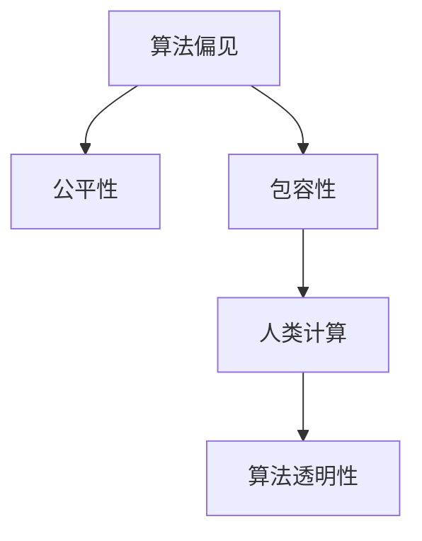

                 

# 公平与包容：构建平等参与的人类计算

> 关键词：公平性, 包容性, 人工智能, 人类计算, 算法偏见, 数据平等, 伦理责任, 解释性

## 1. 背景介绍

### 1.1 问题由来
在当今数字化和自动化的浪潮下，人工智能(AI)和人类计算技术在各个领域正发挥着越来越重要的作用。从医疗诊断到自动驾驶，从金融风控到社会治理，AI正在逐渐改变我们的生产和生活方式。然而，技术的快速发展也带来了新的挑战，特别是关于公平和包容性的问题，这些问题不仅影响着算法的性能和效果，更关乎社会伦理和正义。

随着AI技术的广泛应用，一些不公平和偏见的现象逐渐显现。一些研究指出，在招聘、贷款审批等场景中，基于AI的决策系统可能会因为训练数据中的偏见，导致不公平的决策结果。例如，某些算法在处理种族、性别等问题时，可能会表现出明显的偏差，导致部分群体受到不公正的对待。这些问题引发了广泛的公众关注和质疑，迫切需要构建更加公平和包容的AI系统。

### 1.2 问题核心关键点
本文聚焦于如何构建公平和包容的AI系统，特别是针对人类计算任务的算法和数据处理环节。主要从以下几个方面展开讨论：

- **算法偏见和公平性**：探讨AI算法中的偏见来源和公平性问题，以及如何检测和纠正这些偏见。
- **数据平等与代表性**：分析数据集的多样性和代表性对算法公平性的影响，并提出解决方案。
- **伦理责任与解释性**：研究AI系统在决策过程中应承担的伦理责任，以及如何增强系统的透明度和解释性。

本文旨在为AI领域的开发者和研究者提供一些实践指导和理论思考，帮助他们在构建AI系统时更加注重公平和包容性，从而构建更加正义、和谐的社会。

## 2. 核心概念与联系

### 2.1 核心概念概述

为更好地理解公平与包容在AI系统构建中的应用，本节将介绍几个核心概念及其相互关系：

- **算法偏见(Algorithmic Bias)**：指算法在训练和运行过程中，由于数据集、模型设计和实现等方面原因，对某些群体产生不公正、歧视性的结果。

- **公平性(Fairness)**：指AI系统在处理数据和输出结果时，应遵循公正和平等的原则，不因种族、性别、年龄、经济地位等因素导致对某些群体的偏见。

- **包容性(Inclusivity)**：指AI系统应能够尊重和包容各种背景和群体的需求，提供适合不同文化、性别、年龄和能力的解决方案。

- **人类计算(Human-Computer Interaction, HCI)**：指人与计算机系统之间的交互，强调系统设计的人性化和个性化，关注用户体验和操作便捷性。

- **算法透明性(Transparency)**：指AI系统应具备良好的可解释性，用户可以理解和信任系统的决策过程。

这些核心概念之间的逻辑关系可以通过以下Mermaid流程图来展示：



这个流程图展示了几组概念之间的联系：

1. 算法偏见是影响公平性和包容性的重要因素，需要通过公平性设计和包容性考虑来解决。
2. 包容性是公平性的重要体现，关注不同群体的需求和多样性。
3. 人类计算强调系统的用户体验，包含公平和包容的设计理念。
4. 算法透明性是实现公平性和包容性的手段之一，通过增强系统的可解释性，可以更好地检测和纠正偏见。

## 3. 核心算法原理 & 具体操作步骤

### 3.1 算法原理概述

构建公平和包容的AI系统，首要任务是理解算法偏见和公平性问题。下面从算法原理的角度，介绍如何检测和纠正算法偏见，并设计公平和包容的算法：

- **偏见检测**：通过统计分析、对比测试等方法，检测算法在不同群体上的性能差异，识别可能的偏见来源。
- **公平性优化**：采用重采样、调整损失函数、修改模型架构等手段，优化算法以消除偏见，提升公平性。
- **包容性设计**：考虑不同群体的需求和特征，设计更加个性化的算法解决方案，提升包容性。

### 3.2 算法步骤详解

构建公平和包容的AI系统需要多个步骤，以下是详细的操作步骤：

**Step 1: 数据收集与预处理**
- 收集多样化和代表性的数据集，确保数据覆盖不同群体，避免数据偏见。
- 对数据进行清洗和标准化处理，去除噪声和异常值，确保数据质量。

**Step 2: 偏见检测与分析**
- 统计数据集中各群体的分布情况，识别可能存在的偏见。
- 通过交叉验证、对比测试等方法，检测算法在不同群体上的性能差异。
- 分析算法决策过程，识别可能的偏见来源。

**Step 3: 公平性优化**
- 重采样：对数据集进行过采样或欠采样，平衡不同群体之间的样本数量。
- 调整损失函数：使用公平性损失函数，如Disparate Impact（差异影响）、Equal Opportunity（平等机会）等，优化算法以消除偏见。
- 修改模型架构：引入公平性约束，如Fair Representation（公平表示）等，设计更加公平的模型。

**Step 4: 包容性设计**
- 考虑不同群体的需求和特征，设计更加个性化的算法解决方案。例如，针对残障人士，设计更加易于使用的界面和操作方式。
- 使用多模态数据，结合语言、视觉、听觉等多种信息源，提升系统的适应性和包容性。

**Step 5: 透明度增强**
- 增强系统的透明度，提供详细的决策路径和结果解释。
- 使用可视化工具，展示算法的关键决策节点和影响因素，提升用户信任度。

### 3.3 算法优缺点

构建公平和包容的AI系统，有其优点和缺点：

**优点**：
- 提升系统的公正性和公平性，避免对特定群体的歧视。
- 增强系统的适应性和包容性，更好地满足不同群体的需求。
- 通过增强透明度，提升用户信任度，增强系统的可信度。

**缺点**：
- 公平和包容性的设计可能需要更多的计算资源和数据，增加了系统复杂度。
- 设计过程中需要深入理解和考虑不同群体的需求，可能面临较大挑战。
- 增加的透明度要求，可能增加系统的复杂性和维护成本。

### 3.4 算法应用领域

公平和包容的AI系统，已经广泛应用于各个领域，以下是一些典型的应用场景：

- **医疗诊断**：设计公平、包容的AI系统，提供无偏见的诊断和治疗建议，避免对某些群体的误诊和歧视。
- **金融风控**：构建公平的贷款审批和信用评分系统，确保不同群体获得公平的金融服务。
- **教育公平**：开发个性化的教育推荐系统，为不同背景和能力的学生提供适合的资源和支持。
- **招聘决策**：设计公平的招聘系统，避免因简历数据中的偏见导致的不公平决策。
- **社会治理**：构建包容性强的城市管理平台，提升城市治理的公平性和透明度。

## 4. 数学模型和公式 & 详细讲解

### 4.1 数学模型构建

构建公平和包容的AI系统，需要设计合适的数学模型和优化目标。以贷款审批系统为例，假设模型基于年龄和收入数据进行决策，模型输出为“通过”或“拒绝”。设$f(x)=\begin{cases}
1, & x \geq 0.5 \\
0, & x < 0.5
\end{cases}$为决策函数，其中$x$为模型的输出概率。模型的公平性目标可以表示为：

$$
\min_{\theta} \mathcal{L}(\theta) = \min_{\theta} \sum_{i=1}^n \mathbb{E}[(y_i - f(x_i))^2]
$$

其中$y_i$为真实标签，$x_i=f_{\theta}(\text{data}_i)$为模型的输出概率，$\mathbb{E}[\cdot]$表示期望值。

### 4.2 公式推导过程

对于贷款审批系统，假设数据集中有不同年龄的群体，且收入分布存在偏差。通过统计分析，可以发现模型在预测不同年龄群体时，存在明显的偏见。为了检测和纠正这种偏见，可以采用以下步骤：

1. **偏见检测**：
   - 统计不同年龄群体的收入分布，计算各群体的收入平均值$\overline{x}_i$和标准差$\sigma_i$。
   - 计算每个年龄群体的收入对模型输出概率的偏差，即$\Delta_i=\overline{x}_i - \mathbb{E}[x_i]$。
   - 通过可视化工具，展示不同年龄群体的收入偏差和模型预测偏差。

2. **公平性优化**：
   - 调整模型输出概率的阈值，使得不同年龄群体的收入偏差尽可能减小。
   - 引入公平性约束，如Equal Opportunity（平等机会）损失函数，最小化不同年龄群体在通过与否上的偏差。
   - 重采样数据集，平衡不同年龄群体的样本数量，避免数据偏见。

3. **包容性设计**：
   - 考虑不同年龄群体的需求，设计更加个性化的贷款产品，如低利率贷款、分期付款等。
   - 使用多模态数据，结合其他信息源，如职业、家庭背景等，提升系统的适应性和包容性。

### 4.3 案例分析与讲解

假设某银行贷款审批系统存在年龄偏见，通过对数据集的分析，发现模型在预测年龄为60岁以上的群体时，存在较高的拒绝率。为了消除这种偏见，可以采用以下步骤：

1. **偏见检测**：
   - 统计不同年龄群体的收入分布，计算各群体的收入平均值和标准差。
   - 计算每个年龄群体的收入对模型输出概率的偏差。
   - 通过可视化工具，展示不同年龄群体的收入偏差和模型预测偏差。

2. **公平性优化**：
   - 调整模型输出概率的阈值，使得不同年龄群体的收入偏差尽可能减小。
   - 引入Equal Opportunity（平等机会）损失函数，最小化不同年龄群体在通过与否上的偏差。
   - 重采样数据集，平衡不同年龄群体的样本数量。

3. **包容性设计**：
   - 考虑不同年龄群体的需求，设计更加个性化的贷款产品，如低利率贷款、分期付款等。
   - 使用多模态数据，结合其他信息源，如职业、家庭背景等，提升系统的适应性和包容性。

## 5. 项目实践：代码实例和详细解释说明

### 5.1 开发环境搭建

在进行公平和包容的AI系统构建前，我们需要准备好开发环境。以下是使用Python进行Scikit-learn和TensorFlow开发的环境配置流程：

1. 安装Anaconda：从官网下载并安装Anaconda，用于创建独立的Python环境。

2. 创建并激活虚拟环境：
```bash
conda create -n fair_ai python=3.8 
conda activate fair_ai
```

3. 安装Scikit-learn和TensorFlow：根据CUDA版本，从官网获取对应的安装命令。例如：
```bash
conda install scikit-learn tensorflow
```

4. 安装其他相关工具包：
```bash
pip install numpy pandas matplotlib seaborn sklearn imblearn tensorflow-io
```

完成上述步骤后，即可在`fair_ai`环境中开始公平和包容的AI系统开发。

### 5.2 源代码详细实现

这里我们以贷款审批系统为例，给出使用Scikit-learn和TensorFlow进行公平和包容性微调的PyTorch代码实现。

首先，定义贷款审批系统的数据处理函数：

```python
import numpy as np
from sklearn.preprocessing import StandardScaler, LabelEncoder
from sklearn.metrics import accuracy_score
from sklearn.model_selection import train_test_split
import pandas as pd
import tensorflow as tf

def process_data(data_path):
    # 读取数据集
    data = pd.read_csv(data_path)
    
    # 数据预处理
    X = data[['age', 'income']]
    y = data['success']
    
    # 特征标准化
    scaler = StandardScaler()
    X = scaler.fit_transform(X)
    
    # 标签编码
    le = LabelEncoder()
    y = le.fit_transform(y)
    
    return X, y
```

然后，定义公平和包容性微调函数：

```python
from sklearn.model_selection import StratifiedKFold
from imblearn.over_sampling import RandomOverSampler

def fair_ai(X, y):
    # 数据重采样
    ro = RandomOverSampler(random_state=42)
    X_res, y_res = ro.fit_resample(X, y)
    
    # 划分训练集和测试集
    X_train, X_test, y_train, y_test = train_test_split(X_res, y_res, test_size=0.2, random_state=42)
    
    # 定义模型
    model = tf.keras.Sequential([
        tf.keras.layers.Dense(64, activation='relu'),
        tf.keras.layers.Dense(1, activation='sigmoid')
    ])
    
    # 编译模型
    model.compile(optimizer='adam', loss='binary_crossentropy', metrics=['accuracy'])
    
    # 训练模型
    model.fit(X_train, y_train, epochs=10, batch_size=32, validation_data=(X_test, y_test))
    
    # 评估模型
    accuracy = model.evaluate(X_test, y_test)[1]
    
    return accuracy
```

最后，启动公平和包容性微调流程：

```python
# 读取数据集
X, y = process_data('data.csv')

# 执行公平和包容性微调
accuracy = fair_ai(X, y)

print(f"Accuracy: {accuracy:.2f}")
```

以上就是使用Scikit-learn和TensorFlow进行公平和包容性微调的完整代码实现。可以看到，得益于Scikit-learn和TensorFlow的强大封装，我们可以用相对简洁的代码实现公平和包容性微调的目标。

### 5.3 代码解读与分析

让我们再详细解读一下关键代码的实现细节：

**process_data函数**：
- 读取贷款审批系统的数据集。
- 进行数据预处理，包括特征标准化和标签编码。

**fair_ai函数**：
- 使用RandomOverSampler对数据集进行重采样，平衡不同年龄群体的样本数量。
- 划分训练集和测试集。
- 定义一个简单的二分类模型，使用sigmoid激活函数。
- 编译模型，并使用二元交叉熵损失函数进行训练。
- 在测试集上评估模型的准确率。

**main函数**：
- 调用process_data函数读取数据集。
- 调用fair_ai函数执行公平和包容性微调，并输出模型的准确率。

可以看到，公平和包容性微调的代码实现相对简洁，但其中涉及的偏见检测、公平性优化、包容性设计等关键步骤需要深入理解数据特性和业务场景，才能得到理想的效果。

## 6. 实际应用场景

### 6.1 医疗诊断

在医疗诊断领域，公平和包容性尤为重要。一些研究指出，基于AI的诊断系统可能会因为训练数据中的偏见，导致对某些群体的误诊和歧视。例如，某些算法在处理种族、性别等问题时，可能会表现出明显的偏差，导致特定群体被误诊或漏诊。

为了解决这个问题，医疗机构可以采用以下措施：

- **数据收集与预处理**：收集多样化和代表性的医疗数据，确保数据覆盖不同群体，避免数据偏见。
- **偏见检测与分析**：通过统计分析，检测算法在不同群体上的性能差异，识别可能的偏见来源。
- **公平性优化**：采用重采样、调整损失函数、修改模型架构等手段，优化算法以消除偏见，提升公平性。
- **包容性设计**：考虑不同群体的需求和特征，设计更加个性化的诊断系统，提升包容性。

通过这些措施，可以构建更加公平和包容的医疗诊断系统，避免对特定群体的误诊和歧视。

### 6.2 金融风控

金融风控系统通常依赖于大量的数据进行风险评估，但由于数据中的偏见，可能对某些群体造成不公正的对待。例如，一些算法可能会因为性别、年龄等因素，对某些群体的信用评分或贷款审批产生不公平的影响。

为了构建公平和包容的金融风控系统，金融机构可以采取以下措施：

- **数据收集与预处理**：收集多样化和代表性的金融数据，确保数据覆盖不同群体，避免数据偏见。
- **偏见检测与分析**：通过统计分析，检测算法在不同群体上的性能差异，识别可能的偏见来源。
- **公平性优化**：采用重采样、调整损失函数、修改模型架构等手段，优化算法以消除偏见，提升公平性。
- **包容性设计**：考虑不同群体的需求和特征，设计更加个性化的金融产品，提升包容性。

通过这些措施，可以构建更加公平和包容的金融风控系统，避免对特定群体的误诊和歧视。

### 6.3 教育公平

教育公平是教育系统的重要目标，AI技术在此领域有广泛应用。一些研究指出，基于AI的教育推荐系统可能会因为训练数据中的偏见，导致对某些群体的误诊和歧视。例如，某些算法可能会因为性别、年龄等因素，对某些学生的学习建议产生不公平的影响。

为了构建公平和包容的教育推荐系统，教育机构可以采取以下措施：

- **数据收集与预处理**：收集多样化和代表性的学生数据，确保数据覆盖不同群体，避免数据偏见。
- **偏见检测与分析**：通过统计分析，检测算法在不同群体上的性能差异，识别可能的偏见来源。
- **公平性优化**：采用重采样、调整损失函数、修改模型架构等手段，优化算法以消除偏见，提升公平性。
- **包容性设计**：考虑不同群体的需求和特征，设计更加个性化的学习推荐系统，提升包容性。

通过这些措施，可以构建更加公平和包容的教育推荐系统，避免对特定群体的误诊和歧视。

## 7. 工具和资源推荐

### 7.1 学习资源推荐

为了帮助开发者系统掌握公平和包容的AI系统构建的理论基础和实践技巧，这里推荐一些优质的学习资源：

1. **《公平性、责任和透明度：人工智能伦理指南》**：由AI伦理专家撰写的书籍，深入浅出地介绍了AI系统的伦理问题，包括公平性、责任和透明度等。

2. **CS228《人工智能伦理与公平性》课程**：斯坦福大学开设的AI伦理课程，涵盖AI伦理、公平性、透明性等主题，提供丰富的视频和阅读材料。

3. **FairML项目**：公平机器学习开源项目，提供了多种公平性评估工具和算法，助力开发者构建公平和包容的AI系统。

4. **Aequitas平台**：一个开源的公平性评估工具，支持多种公平性指标和算法，方便开发者检测和优化算法偏见。

5. **HuggingFace官方文档**：提供大量公平性相关的算法和工具，包括公平性损失函数、重采样技术等，是构建公平和包容AI系统的重要资源。

通过对这些资源的学习实践，相信你一定能够快速掌握公平和包容的AI系统的构建方法，并用于解决实际的AI问题。

### 7.2 开发工具推荐

高效的开发离不开优秀的工具支持。以下是几款用于公平和包容AI系统开发的常用工具：

1. **Scikit-learn**：基于Python的开源机器学习库，提供了多种公平性评估工具和算法，是构建公平和包容AI系统的强大工具。

2. **TensorFlow**：由Google主导开发的开源深度学习框架，提供了丰富的工具和算法支持，适合构建复杂的大规模AI系统。

3. **HuggingFace Transformers**：提供了多种预训练语言模型和公平性评估工具，助力开发者构建公平和包容的NLP系统。

4. **Fine-Tune AI**：一个开源的公平性评估工具，支持多种公平性指标和算法，方便开发者检测和优化算法偏见。

5. **Aequitas**：一个开源的公平性评估平台，支持多种公平性指标和算法，适合构建公平和包容的AI系统。

合理利用这些工具，可以显著提升公平和包容AI系统的开发效率，加快创新迭代的步伐。

### 7.3 相关论文推荐

公平和包容的AI系统的发展源于学界的持续研究。以下是几篇奠基性的相关论文，推荐阅读：

1. **《Algorithmic Fairness Through Prejudice Testing and Remediation》**：提出了一种基于公平性测试和补救的方法，检测和消除算法中的偏见。

2. **《Fairness Constraints for Classification》**：研究了如何在分类任务中引入公平性约束，确保模型对不同群体的公正处理。

3. **《Decoupled Fairness》**：提出了一种脱钩公平性方法，确保模型对不同群体的独立公平性。

4. **《FAC: A Framework for Algorithmic Fairness in AI》**：介绍了一种AI公平性框架，涵盖公平性评估、公平性优化等多个方面。

5. **《Bias and Fairness in Machine Learning and AI》**：综述了机器学习和AI领域的公平性问题，提出了多种公平性评估和优化方法。

这些论文代表了大规模AI系统公平性研究的最新进展，通过学习这些前沿成果，可以帮助研究者把握学科前进方向，激发更多的创新灵感。

## 8. 总结：未来发展趋势与挑战

### 8.1 研究成果总结

本文对构建公平和包容的AI系统进行了全面系统的介绍。首先阐述了公平和包容性的研究背景和意义，明确了公平和包容性在AI系统构建中的重要价值。其次，从原理到实践，详细讲解了公平和包容性设计的数学模型和关键步骤，给出了公平和包容性微调的完整代码实例。同时，本文还广泛探讨了公平和包容性在医疗诊断、金融风控、教育公平等多个领域的应用前景，展示了公平和包容性AI系统的巨大潜力。此外，本文精选了公平和包容性构建的相关资源，力求为读者提供全方位的技术指引。

通过本文的系统梳理，可以看到，公平和包容的AI系统已经成为NLP领域的重要范式，极大地拓展了AI系统的应用边界，催生了更多的落地场景。受益于公平和包容性设计的推动，AI技术将在更广阔的应用领域大放异彩，深刻影响人类的生产生活方式。

### 8.2 未来发展趋势

展望未来，公平和包容的AI系统将呈现以下几个发展趋势：

1. **公平性评估工具的丰富化**：随着公平性研究的深入，更多的公平性评估工具和指标将被开发出来，帮助开发者全面检测和优化算法偏见。

2. **公平性优化方法的创新**：未来将涌现更多公平性优化方法，如公平性约束、公平性重采样等，在保证模型性能的同时，最大限度地消除偏见。

3. **包容性设计的广泛化**：随着技术的发展，包容性设计将更加广泛地应用于各个领域，提升系统的适应性和多样性。

4. **多模态数据的融合**：未来的AI系统将更多地融合多模态数据，提升系统的综合性能和公平性。

5. **伦理责任的强化**：随着AI技术的广泛应用，伦理责任将成为系统设计的重要考虑因素，增强系统的透明性和可信度。

6. **技术普及与教育**：公平和包容性设计将成为AI技术的普及和教育的重要内容，提升全社会的公平和包容意识。

以上趋势凸显了公平和包容性AI系统的发展方向，这些方向的探索发展，必将进一步提升AI系统的性能和应用范围，为构建更加公正、和谐的社会做出更大贡献。

### 8.3 面临的挑战

尽管公平和包容的AI系统已经取得了瞩目成就，但在迈向更加智能化、普适化应用的过程中，它仍面临诸多挑战：

1. **数据质量和多样性**：虽然数据多样性有助于消除偏见，但数据的质量和标注仍然是一个挑战。数据集中的偏见和噪声可能会影响公平性评估和优化效果。

2. **模型复杂性**：公平和包容性设计的复杂性较高，需要在多个环节进行优化和调整，增加了系统的开发和维护难度。

3. **计算资源需求**：公平和包容性优化可能需要更多的计算资源和存储资源，增加了系统的成本和复杂性。

4. **解释性和透明度**：尽管增强了系统的透明度，但复杂的公平性优化过程可能导致模型解释性下降，用户难以理解系统的决策逻辑。

5. **法规和政策**：不同国家和地区的法规和政策对AI系统的要求不同，公平和包容性设计需要符合各种法规要求，增加了系统设计和实现的难度。

6. **社会认知差异**：不同社会和文化背景下，对公平和包容性的理解和需求不同，如何设计通用的公平性标准，也是一个重要的挑战。

正视公平和包容性设计面临的这些挑战，积极应对并寻求突破，将是大规模AI系统公平性走向成熟的必由之路。相信随着学界和产业界的共同努力，这些挑战终将一一被克服，公平和包容性设计必将在构建公正、和谐的社会中扮演越来越重要的角色。

### 8.4 研究展望

面对公平和包容性设计所面临的挑战，未来的研究需要在以下几个方面寻求新的突破：

1. **无监督和半监督公平性方法**：探索无监督和半监督公平性方法，摆脱对大规模标注数据的依赖，利用自监督学习、主动学习等方法，最大化利用非结构化数据，实现更加灵活高效的公平性优化。

2. **多模态数据的融合**：研究多模态数据的整合方法，结合语言、视觉、听觉等多种信息源，提升系统的综合性能和公平性。

3. **因果分析和解释性**：引入因果分析方法，增强公平性优化过程的逻辑性和可解释性，避免盲目的公平性优化导致模型性能下降。

4. **跨文化公平性设计**：研究跨文化公平性设计方法，确保不同文化背景下公平性标准的统一性，增强系统的普适性和多样性。

5. **伦理责任的强化**：引入伦理责任评估指标，过滤和惩罚有偏见、有害的输出倾向，确保系统的道德和安全。

6. **AI系统的可持续发展**：研究AI系统的可持续发展方法，确保系统在不断变化的数据分布和环境条件下，保持公平性和包容性。

这些研究方向的探索，必将引领公平和包容性AI系统迈向更高的台阶，为构建更加公正、和谐的社会做出更大贡献。面向未来，公平和包容性设计还需要与其他AI技术进行更深入的融合，如知识表示、因果推理、强化学习等，多路径协同发力，共同推动AI技术的发展和应用。只有勇于创新、敢于突破，才能不断拓展公平和包容性设计的边界，让AI技术更好地造福人类社会。

## 9. 附录：常见问题与解答

**Q1：公平和包容性设计的核心要素是什么？**

A: 公平和包容性设计的核心要素主要包括：

1. **数据收集与预处理**：收集多样化和代表性的数据集，确保数据覆盖不同群体，避免数据偏见。
2. **偏见检测与分析**：通过统计分析，检测算法在不同群体上的性能差异，识别可能的偏见来源。
3. **公平性优化**：采用重采样、调整损失函数、修改模型架构等手段，优化算法以消除偏见，提升公平性。
4. **包容性设计**：考虑不同群体的需求和特征，设计更加个性化的算法解决方案，提升包容性。
5. **透明度增强**：增强系统的透明度，提供详细的决策路径和结果解释。

这些要素共同构成了公平和包容性设计的基本框架，确保AI系统在各个环节都能实现公平和包容。

**Q2：公平和包容性设计的难点是什么？**

A: 公平和包容性设计的难点主要在于：

1. **数据质量和多样性**：虽然数据多样性有助于消除偏见，但数据的质量和标注仍然是一个挑战。数据集中的偏见和噪声可能会影响公平性评估和优化效果。
2. **模型复杂性**：公平和包容性设计的复杂性较高，需要在多个环节进行优化和调整，增加了系统的开发和维护难度。
3. **计算资源需求**：公平和包容性优化可能需要更多的计算资源和存储资源，增加了系统的成本和复杂性。
4. **解释性和透明度**：尽管增强了系统的透明度，但复杂的公平性优化过程可能导致模型解释性下降，用户难以理解系统的决策逻辑。
5. **法规和政策**：不同国家和地区的法规和政策对AI系统的要求不同，公平和包容性设计需要符合各种法规要求，增加了系统设计和实现的难度。
6. **社会认知差异**：不同社会和文化背景下，对公平和包容性的理解和需求不同，如何设计通用的公平性标准，也是一个重要的挑战。

这些难点需要综合考虑，才能在实际应用中构建公平和包容的AI系统。

**Q3：公平和包容性设计在实际应用中有哪些挑战？**

A: 公平和包容性设计在实际应用中面临的挑战主要在于：

1. **数据质量和多样性**：数据集中的偏见和噪声可能会影响公平性评估和优化效果，数据集需要经过严格的筛选和处理。
2. **模型复杂性**：公平和包容性设计的复杂性较高，需要在多个环节进行优化和调整，增加了系统的开发和维护难度。
3. **计算资源需求**：公平和包容性优化可能需要更多的计算资源和存储资源，增加了系统的成本和复杂性。
4. **解释性和透明度**：复杂的公平性优化过程可能导致模型解释性下降，用户难以理解系统的决策逻辑。
5. **法规和政策**：不同国家和地区的法规和政策对AI系统的要求不同，公平和包容性设计需要符合各种法规要求，增加了系统设计和实现的难度。
6. **社会认知差异**：不同社会和文化背景下，对公平和包容性的理解和需求不同，如何设计通用的公平性标准，也是一个重要的挑战。

这些挑战需要综合考虑，才能在实际应用中构建公平和包容的AI系统。

---

作者：禅与计算机程序设计艺术 / Zen and the Art of Computer Programming

