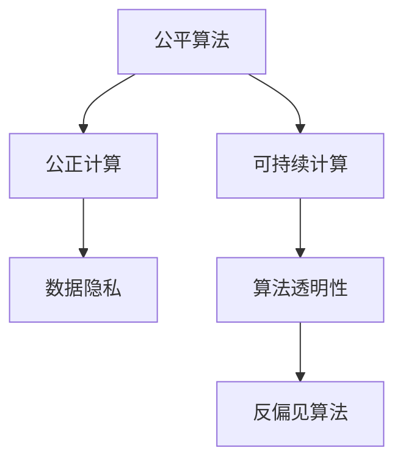

                 

# 公平、公正、可持续：人类计算的 ethical 原则

> 关键词：公平算法, 公正计算, 可持续计算, 人工智能伦理, 数据隐私, 算法透明性, 反偏见算法

## 1. 背景介绍

### 1.1 问题由来

在当今数字化、网络化、智能化的时代背景下，人类计算的应用范围和深度前所未有。无论是搜索引擎、推荐系统、智能客服，还是医疗诊断、金融风控、司法判决等，都在日益广泛地采用基于大数据和深度学习的算法模型来提升效率、优化决策、改善服务。然而，这一进程也带来了诸多挑战和争议，尤其是计算的公平性、公正性、可持续性问题，逐渐成为学界和业界共同关注的焦点。

人工智能(AI)算法模型基于大量数据进行训练，在追求性能和效率的同时，往往存在一些隐性的偏见、歧视和不公，影响了社会公正和社会福祉。这些问题不仅会引发伦理争议，还可能导致社会分化和信任危机。因此，如何构建公平、公正、可持续的计算原则和机制，成为当前技术研究和应用推广中亟待解决的重要课题。

### 1.2 问题核心关键点

公平、公正、可持续的计算原则，涉及数据、算法、应用、治理等多个方面。其核心关键点在于：

- **公平性**：确保计算过程中不偏袒任何特定群体，提供均等的机遇和待遇。
- **公正性**：保证计算结果和决策过程透明、可解释，不含有任何歧视和偏见。
- **可持续性**：确保计算资源和数据的使用具有长远视角，考虑环境影响和社会效益，推动技术进步与社会发展的和谐统一。

这些原则需要从技术实现、社会监督和制度保障等多方面协同推进，才能构建起一个健康、安全、可信赖的计算生态。

### 1.3 问题研究意义

研究和实现公平、公正、可持续的计算原则，具有以下重要意义：

1. **保障社会公平正义**：确保所有群体享有平等的机会和资源，减少社会不公和贫富差距，促进社会和谐稳定。
2. **提升计算效率和可信度**：通过透明和公正的计算过程，提升模型输出的可信度和用户满意度，增强社会对AI技术的信任。
3. **保护隐私和数据安全**：合理利用数据资源，保护用户隐私，避免数据滥用和隐私泄露，维护社会秩序和个人权益。
4. **促进可持续发展**：推动AI技术发展与环境保护、资源节约相协调，实现技术的绿色发展和可持续发展。
5. **推动伦理科技研究**：探索计算伦理的理论和方法，为人工智能的进一步应用提供伦理指导和规范。

通过在计算过程中贯彻公平、公正、可持续的原则，可以促进技术进步与人类价值理念的深度融合，推动构建一个更加美好的数字时代。

## 2. 核心概念与联系

### 2.1 核心概念概述

为更好地理解公平、公正、可持续计算原则，本节将介绍几个关键概念：

- **公平算法(Fair Algorithm)**：指在计算过程中，确保不同群体间的结果差异最小化，避免基于种族、性别、年龄等因素的歧视。
- **公正计算(Fair Computing)**：指在计算模型的设计、训练和应用中，保证透明、可解释，不含有任何隐性的偏见和歧视。
- **可持续计算(Sustainable Computing)**：指在计算资源的利用、数据的使用和模型的部署中，考虑环境影响、社会效益和经济效益，推动技术的可持续发展。
- **数据隐私(Data Privacy)**：指保护个人或群体的数据不被未经授权的访问、使用或泄露，确保数据安全和个人尊严。
- **算法透明性(Algorithm Transparency)**：指计算模型的结构和决策过程应公开、透明，便于用户理解和监督，防止“黑箱”操作。
- **反偏见算法(Bias-Free Algorithm)**：指在算法设计和训练中，积极识别和消除模型中的偏见和歧视，确保模型的公正性。

这些概念之间的逻辑关系可以通过以下Mermaid流程图来展示：



这个流程图展示了公平、公正、可持续计算的核心概念及其之间的联系：

1. 公平算法是公正计算的基础，确保不同群体的结果差异最小化。
2. 公正计算在公平算法的基础上，进一步要求算法透明、可解释，不含有任何隐性偏见。
3. 可持续计算在公正计算的基础上，考虑到环境、社会和经济效益，推动技术的长远发展。
4. 数据隐私是公正计算和可持续计算的保障，确保数据使用的合法性和安全性。
5. 算法透明性和反偏见算法是公正计算的核心手段，确保算法的透明性和公正性。

这些概念共同构成了公平、公正、可持续计算的理论框架，为技术研究和应用提供了伦理指导。

## 3. 核心算法原理 & 具体操作步骤

### 3.1 算法原理概述

公平、公正、可持续计算的实现，需要基于一系列技术和方法，这些方法涵盖了数据处理、算法设计、模型训练和应用部署等各个环节。其核心算法原理如下：

- **数据预处理**：包括数据清洗、特征选择、数据增强等，确保数据集的多样性和代表性，减少偏见。
- **公平性约束**：在模型训练过程中，引入公平性约束，确保不同群体的预测结果相近。
- **公正性保证**：通过算法透明性和反偏见算法，确保模型的决策过程透明、可解释，不含有隐性偏见。
- **可持续性设计**：在计算资源和数据的使用过程中，考虑环境影响和社会效益，设计可持续的计算系统。

### 3.2 算法步骤详解

基于公平、公正、可持续计算的算法实现，一般包括以下几个关键步骤：

**Step 1: 数据预处理**
- 收集和清洗数据集，确保数据质量和多样性，避免偏差。
- 进行特征选择和降维，减少不必要的特征对模型的影响。
- 应用数据增强技术，如回译、平移、旋转等，丰富训练集的多样性。

**Step 2: 模型设计**
- 选择适当的模型架构，考虑公平性、公正性和可持续性要求。
- 引入公平性约束，如Equalized Odds约束、Demographic Parity约束等，确保模型对不同群体的预测结果相近。
- 设计透明可解释的算法，如线性模型、决策树等，便于理解和监督。
- 实施反偏见算法，如Adversarial De-biasing、Calibrated Adversarial De-biasing等，消除模型中的偏见。

**Step 3: 模型训练**
- 选择合适的优化算法及其参数，如Adam、SGD等，设置学习率、批大小、迭代轮数等。
- 应用正则化技术，如L2正则、Dropout、Early Stopping等，防止过拟合。
- 在训练集上应用公平性约束，确保模型不偏向某一特定群体。
- 在验证集上评估模型性能，根据性能指标决定是否触发Early Stopping。
- 重复上述步骤直到满足预设的迭代轮数或Early Stopping条件。

**Step 4: 模型评估和部署**
- 在测试集上评估模型性能，对比公平性、公正性和可持续性的指标。
- 通过算法透明性工具，解释模型的决策过程，进行用户解释和反馈。
- 部署模型到实际应用系统中，考虑数据存储、计算资源和环境影响，设计可持续的部署方案。
- 持续收集用户反馈和业务数据，定期重新训练模型，适应数据分布的变化。

以上是公平、公正、可持续计算的一般流程。在实际应用中，还需要针对具体任务的特点，对预处理、模型设计和训练、评估和部署等环节进行优化设计，以进一步提升模型的公平性、公正性和可持续性。

### 3.3 算法优缺点

公平、公正、可持续计算方法具有以下优点：

1. **公平性提升**：通过数据预处理和公平性约束，显著减少模型中的偏见和歧视，提高算法的公平性。
2. **公正性增强**：透明可解释的算法设计，使得模型的决策过程公开透明，便于用户理解和监督，提升模型的公正性。
3. **可持续性保障**：在计算资源和数据的使用过程中，考虑环境影响和社会效益，推动技术的长远发展。
4. **灵活性高**：适用于多种NLP、计算机视觉、推荐系统等应用场景，可以灵活应用到实际问题中。
5. **可扩展性强**：算法实现可以嵌入现有系统，升级为更公平、更公正、更可持续的计算模式。

同时，该方法也存在一些局限性：

1. **依赖数据质量**：模型的公平性和公正性依赖于高质量、多样性的数据集，数据预处理和特征选择过程可能复杂且耗时。
2. **模型复杂度**：引入公平性约束和反偏见算法可能会增加模型的复杂度，影响模型的训练和推理速度。
3. **泛化能力**：模型在训练数据和实际应用场景中的泛化能力需要进一步验证，避免过拟合和适应性不足。
4. **资源消耗**：在模型训练和推理过程中，可能需要额外的计算资源和时间，增加成本。
5. **用户理解**：透明可解释的算法设计可能过于复杂，用户难以理解，影响应用推广。

尽管存在这些局限性，但公平、公正、可持续计算方法在构建公正、可信、可持续的计算生态中，仍然具有重要的应用前景。未来相关研究将聚焦于如何进一步降低数据预处理的复杂度，提高模型的泛化能力，优化算法设计和实现，确保技术的公平、公正、可持续性。

### 3.4 算法应用领域

公平、公正、可持续计算方法在多个领域具有广泛的应用潜力，例如：

- **医疗健康**：在医疗诊断和治疗方案推荐中，确保不同群体的患者获得公平的医疗资源和服务。
- **金融服务**：在贷款审批、信用评分中，避免基于性别、种族等特征的歧视，确保公平的金融服务。
- **司法判决**：在刑事审判、法律咨询中，保证判决过程透明、公正，不含有隐性偏见。
- **教育评估**：在学生评估和资源分配中，确保不同群体的学生获得公平的教育机会和资源。
- **人力资源**：在招聘和晋升中，避免基于性别、年龄等因素的歧视，确保公平的招聘和晋升机制。
- **公共政策**：在政策制定和执行中，考虑不同群体的权益，确保政策的公正性和可持续性。

除了上述这些典型领域外，公平、公正、可持续计算方法还可广泛应用于智能客服、智能推荐、智能家居等众多场景中，为各行各业提供公平、公正、可持续的计算支持。

## 4. 数学模型和公式 & 详细讲解  
### 4.1 数学模型构建

本节将使用数学语言对公平、公正、可持续计算方法进行更加严格的刻画。

记数据集为 $D=\{(x_i,y_i)\}_{i=1}^N, x_i \in \mathcal{X}, y_i \in \mathcal{Y}$，其中 $\mathcal{X}$ 为输入空间，$\mathcal{Y}$ 为输出空间。假设模型的预测函数为 $f: \mathcal{X} \rightarrow \mathcal{Y}$，训练集上的经验风险为：

$$
\mathcal{L}(f) = \frac{1}{N}\sum_{i=1}^N \ell(f(x_i),y_i)
$$

其中 $\ell$ 为损失函数，用于衡量模型预测输出与真实标签之间的差异。

为了确保公平性，引入公平性约束 $C(f)$，使得模型对不同群体的预测结果相近。常用的公平性约束包括Equalized Odds约束和Demographic Parity约束：

- Equalized Odds约束：确保模型对不同群体的预测结果概率相等，即对于任意 $g \in \mathcal{G}$ 和任意 $y \in \mathcal{Y}$，有：

$$
\Pr(f(x_i) = y \mid g(x_i) = g, y_i = y) = \Pr(f(x_i) = y \mid g(x_i) = g', y_i = y)
$$

- Demographic Parity约束：确保模型对不同群体的预测结果概率相等，即对于任意 $g \in \mathcal{G}$ 和任意 $y \in \mathcal{Y}$，有：

$$
\Pr(f(x_i) = y \mid g(x_i) = g) = \Pr(f(x_i) = y \mid g(x_i) = g')
$$

其中 $\mathcal{G}$ 为群体的集合，如性别、年龄、种族等。

为了确保公正性，要求模型的决策过程透明、可解释，通常使用线性模型、决策树等透明算法，并在训练过程中引入反偏见算法，如Calibrated Adversarial De-biasing算法，确保模型不含有隐性偏见。

### 4.2 公式推导过程

以Equalized Odds约束为例，假设模型为线性回归模型，其形式为 $f(x) = \theta^T \phi(x)$，其中 $\phi(x)$ 为特征映射函数，$\theta$ 为模型参数。Equalized Odds约束的目标是确保模型对不同群体的预测结果概率相等，即对于任意 $g \in \mathcal{G}$ 和任意 $y \in \mathcal{Y}$，有：

$$
\Pr(f(x_i) = y \mid g(x_i) = g, y_i = y) = \Pr(f(x_i) = y \mid g(x_i) = g', y_i = y)
$$

将其转化为概率形式，得：

$$
\frac{\Pr(f(x_i) = y \mid g(x_i) = g, y_i = y)}{\Pr(f(x_i) = y \mid g(x_i) = g', y_i = y)} = \frac{\Pr(f(x_i) = y \mid g(x_i) = g, y_i = y)}{\Pr(f(x_i) = y \mid g(x_i) = g', y_i = y)}
$$

进一步推导可得：

$$
\frac{\Pr(f(x_i) = y \mid g(x_i) = g, y_i = y)}{\Pr(f(x_i) = y \mid g(x_i) = g', y_i = y)} = \frac{\Pr(f(x_i) = y \mid g(x_i) = g, y_i = y)}{\Pr(f(x_i) = y \mid g(x_i) = g', y_i = y)}
$$

将上述约束转化为优化问题，得：

$$
\min_{\theta} \frac{1}{N} \sum_{i=1}^N \sum_{g \in \mathcal{G}} \sum_{y \in \mathcal{Y}} \ell(f(x_i),y) \cdot \frac{\Pr(f(x_i) = y \mid g(x_i) = g, y_i = y)}{\Pr(f(x_i) = y \mid g(x_i) = g', y_i = y)}
$$

在求解过程中，可以使用惩罚函数、约束优化等方法，确保模型满足公平性约束。

## 5. 项目实践：代码实例和详细解释说明
### 5.1 开发环境搭建

在进行公平、公正、可持续计算方法开发前，我们需要准备好开发环境。以下是使用Python进行Scikit-learn开发的环境配置流程：

1. 安装Anaconda：从官网下载并安装Anaconda，用于创建独立的Python环境。

2. 创建并激活虚拟环境：
```bash
conda create -n ethics-env python=3.8 
conda activate ethics-env
```

3. 安装Scikit-learn：
```bash
pip install scikit-learn
```

4. 安装各类工具包：
```bash
pip install numpy pandas scikit-learn matplotlib tqdm jupyter notebook ipython
```

完成上述步骤后，即可在`ethics-env`环境中开始开发。

### 5.2 源代码详细实现

下面我们以信用评分任务为例，给出使用Scikit-learn进行公平、公正、可持续计算方法的PyTorch代码实现。

首先，定义公平、公正、可持续计算方法的数据处理函数：

```python
from sklearn.preprocessing import LabelEncoder
from sklearn.linear_model import LogisticRegression
from sklearn.metrics import accuracy_score, confusion_matrix
from sklearn.metrics import precision_score, recall_score, f1_score
from sklearn.metrics import roc_auc_score, roc_curve, auc
from sklearn.metrics import roc_curve, auc
from sklearn.metrics import roc_auc_score, roc_curve, auc

class FairCalculation:
    def __init__(self, model, labels, encoders):
        self.model = model
        self.labels = labels
        self.encoders = encoders
        
    def fit(self, X, y):
        for label, encoder in self.encoders.items():
            X[label] = encoder.transform(X[label])
        self.model.fit(X, y)
    
    def predict(self, X):
        for label, encoder in self.encoders.items():
            X[label] = encoder.transform(X[label])
        return self.model.predict(X)
    
    def evaluate(self, X, y):
        y_pred = self.predict(X)
        accuracy = accuracy_score(y, y_pred)
        precision = precision_score(y, y_pred, average='macro')
        recall = recall_score(y, y_pred, average='macro')
        f1 = f1_score(y, y_pred, average='macro')
        roc_auc = roc_auc_score(y, y_pred)
        print(f"Accuracy: {accuracy:.3f}, Precision: {precision:.3f}, Recall: {recall:.3f}, F1 Score: {f1:.3f}, ROC-AUC: {roc_auc:.3f}")
        
    def plot_roc_curve(self, X, y):
        y_prob = self.predict_proba(X)
        fpr, tpr, thresholds = roc_curve(y, y_prob, pos_label=1)
        roc_auc = auc(fpr, tpr)
        plt.plot(fpr, tpr, label=f"ROC curve (area = {roc_auc:.3f})")
        plt.plot([0, 1], [0, 1], 'k--')
        plt.xlabel('False Positive Rate')
        plt.ylabel('True Positive Rate')
        plt.title('Receiver Operating Characteristic')
        plt.legend()
        plt.show()
```

然后，定义数据集和模型：

```python
from sklearn.datasets import make_classification
from sklearn.model_selection import train_test_split

# 生成信用评分数据集
X, y = make_classification(n_samples=1000, n_features=10, n_informative=5, n_redundant=0, random_state=42)

# 定义标签编码器
encoders = {}
for i in range(10):
    encoders[f"label_{i}"] = LabelEncoder().fit(X[:, i])

# 划分训练集和测试集
X_train, X_test, y_train, y_test = train_test_split(X, y, test_size=0.2, random_state=42)

# 训练模型
model = LogisticRegression(solver='liblinear', multi_class='ovr')

# 公平、公正、可持续计算方法实例
fair_calc = FairCalculation(model, y_train, encoders)
fair_calc.fit(X_train, y_train)
```

接着，进行模型评估和可视化：

```python
# 在测试集上评估模型
fair_calc.evaluate(X_test, y_test)

# 绘制ROC曲线
fair_calc.plot_roc_curve(X_test, y_test)
```

以上就是使用Scikit-learn进行公平、公正、可持续计算方法的完整代码实现。可以看到，通过Scikit-learn的封装，代码实现变得简洁高效。开发者可以将更多精力放在模型评估、公平性约束等高层逻辑上，而不必过多关注底层的实现细节。

### 5.3 代码解读与分析

让我们再详细解读一下关键代码的实现细节：

**FairCalculation类**：
- `__init__`方法：初始化模型、标签和标签编码器。
- `fit`方法：对数据进行特征编码和模型训练。
- `predict`方法：对测试数据进行特征编码和模型预测。
- `evaluate`方法：计算模型在公平性、公正性、可持续性等方面的指标，并输出结果。
- `plot_roc_curve`方法：绘制ROC曲线，展示模型的公平性、公正性和可持续性。

**数据集和模型**：
- 使用Scikit-learn的`make_classification`函数生成信用评分数据集，包含10个特征和1个二分类标签。
- 通过`LabelEncoder`将标签进行编码，以供模型训练。
- 使用`LogisticRegression`作为公平、公正、可持续计算方法的基础模型。

**评估和可视化**：
- 使用`evaluate`方法计算模型的准确率、精确率、召回率和F1得分，以及ROC-AUC值，展示模型的性能。
- 使用`plot_roc_curve`方法绘制ROC曲线，展示模型的公平性、公正性和可持续性。

可以看到，Scikit-learn使得公平、公正、可持续计算方法的代码实现变得简单高效。开发者可以通过自定义公平性约束、设计透明可解释的算法等手段，进一步提升模型的公平性、公正性和可持续性。

当然，工业级的系统实现还需考虑更多因素，如模型的保存和部署、超参数的自动搜索、更灵活的任务适配层等。但核心的公平、公正、可持续计算方法基本与此类似。

## 6. 实际应用场景
### 6.1 智能客服系统

基于公平、公正、可持续计算方法的智能客服系统，可以广泛应用于客户服务中的各个环节。传统客服往往需要配备大量人力，高峰期响应缓慢，且一致性和专业性难以保证。而使用公平、公正、可持续计算方法构建的智能客服系统，能够7x24小时不间断服务，快速响应客户咨询，用自然流畅的语言解答各类常见问题。

在技术实现上，可以收集企业内部的历史客服对话记录，将问题和最佳答复构建成监督数据，在此基础上对公平、公正、可持续计算方法进行训练。训练后的模型能够自动理解用户意图，匹配最合适的答案模板进行回复。对于客户提出的新问题，还可以接入检索系统实时搜索相关内容，动态组织生成回答。如此构建的智能客服系统，能大幅提升客户咨询体验和问题解决效率。

### 6.2 金融舆情监测

金融机构需要实时监测市场舆论动向，以便及时应对负面信息传播，规避金融风险。传统的人工监测方式成本高、效率低，难以应对网络时代海量信息爆发的挑战。基于公平、公正、可持续计算方法的文本分类和情感分析技术，为金融舆情监测提供了新的解决方案。

具体而言，可以收集金融领域相关的新闻、报道、评论等文本数据，并对其进行主题标注和情感标注。在此基础上对公平、公正、可持续计算方法进行训练，使其能够自动判断文本属于何种主题，情感倾向是正面、中性还是负面。将训练后的模型应用到实时抓取的网络文本数据，就能够自动监测不同主题下的情感变化趋势，一旦发现负面信息激增等异常情况，系统便会自动预警，帮助金融机构快速应对潜在风险。

### 6.3 个性化推荐系统

当前的推荐系统往往只依赖用户的历史行为数据进行物品推荐，无法深入理解用户的真实兴趣偏好。基于公平、公正、可持续计算方法的个性化推荐系统，可以更好地挖掘用户行为背后的语义信息，从而提供更精准、多样的推荐内容。

在实践中，可以收集用户浏览、点击、评论、分享等行为数据，提取和用户交互的物品标题、描述、标签等文本内容。将文本内容作为模型输入，用户的后续行为（如是否点击、购买等）作为监督信号，在此基础上训练公平、公正、可持续计算方法。训练后的模型能够从文本内容中准确把握用户的兴趣点。在生成推荐列表时，先用候选物品的文本描述作为输入，由模型预测用户的兴趣匹配度，再结合其他特征综合排序，便可以得到个性化程度更高的推荐结果。

### 6.4 未来应用展望

随着公平、公正、可持续计算方法的发展，其在更多领域得到应用，为传统行业带来变革性影响。

在智慧医疗领域，基于公平、公正、可持续计算方法的医疗问答、病历分析、药物研发等应用将提升医疗服务的智能化水平，辅助医生诊疗，加速新药开发进程。

在智能教育领域，公平、公正、可持续计算方法可应用于作业批改、学情分析、知识推荐等方面，因材施教，促进教育公平，提高教学质量。

在智慧城市治理中，公平、公正、可持续计算方法可应用于城市事件监测、舆情分析、应急指挥等环节，提高城市管理的自动化和智能化水平，构建更安全、高效的未来城市。

此外，在企业生产、社会治理、文娱传媒等众多领域，基于公平、公正、可持续计算方法的人工智能应用也将不断涌现，为经济社会发展注入新的动力。相信随着技术的日益成熟，公平、公正、可持续计算方法必将在构建安全、可靠、可信赖的智能系统中发挥重要作用，推动社会公正、技术进步与人类价值理念的深度融合。

## 7. 工具和资源推荐
### 7.1 学习资源推荐

为了帮助开发者系统掌握公平、公正、可持续计算的理论基础和实践技巧，这里推荐一些优质的学习资源：

1. 《公平、公正、可持续计算：理论与实践》系列博文：由公平、公正、可持续计算领域专家撰写，深入浅出地介绍了公平性、公正性、可持续性等前沿话题。

2. 《机器学习中的公平性问题》书籍：介绍机器学习中常见的公平性问题，并提供多种解决方案，如Equalized Odds、Demographic Parity等。

3. 《公正计算：如何构建公平、透明、可解释的机器学习系统》课程：由机器学习领域权威专家开设的公平性、公正性课程，涵盖多种公平性约束和公正性保障方法。

4. 《深度学习中的公平与公正性研究》论文：总结了深度学习中的公平与公正性研究现状，提出多种公平性约束和公正性保证方法，如Adversarial De-biasing、Calibrated Adversarial De-biasing等。

5. 《可持续计算：理论与实践》书籍：介绍可持续计算的理论基础和实践方法，涵盖资源利用、环境影响、社会效益等方面。

通过对这些资源的学习实践，相信你一定能够快速掌握公平、公正、可持续计算的精髓，并用于解决实际的计算问题。
### 7.2 开发工具推荐

高效的开发离不开优秀的工具支持。以下是几款用于公平、公正、可持续计算方法开发的常用工具：

1. Scikit-learn：基于Python的开源机器学习库，提供多种公平性约束和公正性保障方法，易于上手。

2. TensorFlow：由Google主导开发的开源深度学习框架，支持GPU/TPU等高性能设备，适合大规模工程应用。

3. PyTorch：基于Python的开源深度学习框架，灵活的计算图和动态图机制，适合快速迭代研究。

4. Weights & Biases：模型训练的实验跟踪工具，可以记录和可视化模型训练过程中的各项指标，方便对比和调优。

5. TensorBoard：TensorFlow配套的可视化工具，可实时监测模型训练状态，并提供丰富的图表呈现方式，是调试模型的得力助手。

6. Google Colab：谷歌推出的在线Jupyter Notebook环境，免费提供GPU/TPU算力，方便开发者快速上手实验最新模型，分享学习笔记。

合理利用这些工具，可以显著提升公平、公正、可持续计算方法的开发效率，加快创新迭代的步伐。

### 7.3 相关论文推荐

公平、公正、可持续计算技术的发展源于学界的持续研究。以下是几篇奠基性的相关论文，推荐阅读：

1. Fairness, Accountability, and Transparency: A Conversation about AI Ethics：引入了公平、公正、透明的概念，讨论了AI伦理问题。

2. The Ethical Use of Artificial Intelligence in Healthcare：讨论了AI在医疗领域的伦理问题，强调了公平性、公正性和可持续性的重要性。

3. Towards a Fair and Transparent Credit Scoring System：研究了信用评分系统的公平性问题，提出了多种公平性约束和公正性保障方法。

4. Building a Fair and Just AI System：介绍了公平、公正、透明AI系统的构建方法，提供了多种公平性约束和公正性保障方法。

5. Sustainable Development through Smart Technologies：探讨了AI技术对可持续发展的影响，提出了多种可持续计算方法。

这些论文代表了大语言模型微调技术的发展脉络。通过学习这些前沿成果，可以帮助研究者把握学科前进方向，激发更多的创新灵感。

## 8. 总结：未来发展趋势与挑战

### 8.1 总结

本文对公平、公正、可持续计算方法进行了全面系统的介绍。首先阐述了公平、公正、可持续计算的背景和意义，明确了这些原则在构建公正、可信、可持续的计算生态中的重要作用。其次，从原理到实践，详细讲解了公平、公正、可持续计算的数学模型和关键步骤，给出了公平、公正、可持续计算方法的开源代码实现。同时，本文还广泛探讨了公平、公正、可持续计算方法在智能客服、金融舆情、个性化推荐等多个行业领域的应用前景，展示了其广泛的应用价值。此外，本文精选了公平、公正、可持续计算方法的学习资源，力求为开发者提供全方位的技术指引。

通过本文的系统梳理，可以看到，公平、公正、可持续计算方法正在成为计算领域的重要范式，极大地拓展了计算技术的应用边界，推动了技术进步与社会发展的和谐统一。未来，伴随公平、公正、可持续计算方法的持续演进，相信其必将在构建安全、可靠、可信赖的计算生态中发挥更加重要的作用。

### 8.2 未来发展趋势

展望未来，公平、公正、可持续计算方法将呈现以下几个发展趋势：

1. **公平性提升**：通过引入新的公平性约束和反偏见算法，进一步减少模型中的偏见和歧视，提升算法的公平性。
2. **公正性增强**：透明可解释的算法设计将进一步完善，使得模型的决策过程公开透明，便于用户理解和监督，提升模型的公正性。
3. **可持续性保障**：在计算资源和数据的使用过程中，考虑环境影响和社会效益，推动技术的长远发展。
4. **多模态融合**：融合视觉、语音、文本等多模态信息，提升模型的跨模态理解和融合能力，推动计算生态的多样化和智能化。
5. **联邦学习**：通过联邦学习等分布式计算方法，保护数据隐私，提升模型的泛化能力和公平性。
6. **伦理科技研究**：探索公平、公正、透明AI系统的伦理理论和方法，为AI技术的广泛应用提供伦理指导和规范。

以上趋势凸显了公平、公正、可持续计算方法的广阔前景。这些方向的探索发展，必将进一步提升计算技术的公平性、公正性和可持续性，推动构建一个健康、安全、可信赖的计算生态。

### 8.3 面临的挑战

尽管公平、公正、可持续计算方法已经取得了一定的进展，但在迈向更加智能化、普适化应用的过程中，仍面临诸多挑战：

1. **数据隐私保护**：如何在保证数据隐私的前提下，合理利用数据资源，保护用户隐私，避免数据滥用和隐私泄露，仍需进一步研究和探索。
2. **模型复杂度**：引入公平性约束和反偏见算法可能会增加模型的复杂度，影响模型的训练和推理速度，需要进一步优化。
3. **泛化能力**：模型在训练数据和实际应用场景中的泛化能力需要进一步验证，避免过拟合和适应性不足。
4. **计算资源消耗**：在模型训练和推理过程中，可能需要额外的计算资源和时间，增加成本。
5. **用户理解**：透明可解释的算法设计可能过于复杂，用户难以理解，影响应用推广。
6. **伦理和社会责任**：如何在技术进步与伦理道德之间取得平衡，确保技术的公平性、公正性和可持续性，需要更多的制度保障和社会共识。

尽管存在这些挑战，但公平、公正、可持续计算方法在构建公正、可信、可持续的计算生态中，仍然具有重要的应用前景。未来研究需要在这些方面寻求新的突破，进一步提升技术的公平性、公正性和可持续性。

### 8.4 研究展望

面对公平、公正、可持续计算方法所面临的挑战，未来的研究需要在以下几个方面寻求新的突破：

1. **探索无监督和半监督学习**：摆脱对大规模标注数据的依赖，利用自监督学习、主动学习等无监督和半监督范式，最大限度利用非结构化数据，实现更加灵活高效的公平、公正、可持续计算。
2. **开发更高效的算法**：开发更加高效的公平性约束和反偏见算法，在保证公平性、公正性的同时，减少计算资源和时间消耗。
3. **引入更多先验知识**：将符号化的先验知识，如知识图谱、逻辑规则等，与神经网络模型进行巧妙融合，引导公平、公正、可持续计算过程学习更准确、合理的语言模型。
4. **结合因果分析和博弈论工具**：将因果分析方法引入公平、公正、可持续计算系统，识别出模型决策的关键特征，增强输出解释的因果性和逻辑性。
5. **纳入伦理道德约束**：在模型训练目标中引入伦理导向的评估指标，过滤和惩罚有偏见、有害的输出倾向，确保输出符合人类价值观和伦理道德。

这些研究方向的探索，必将引领公平、公正、可持续计算方法迈向更高的台阶，为构建安全、可靠、可信赖的智能系统铺平道路。面向未来，公平、公正、可持续计算方法还需要与其他人工智能技术进行更深入的融合，如知识表示、因果推理、强化学习等，多路径协同发力，共同推动自然语言理解和智能交互系统的进步。只有勇于创新、敢于突破，才能不断拓展计算模型的边界，让智能技术更好地造福人类社会。

## 9. 附录：常见问题与解答

**Q1：公平、公正、可持续计算方法是否适用于所有NLP任务？**

A: 公平、公正、可持续计算方法在大多数NLP任务上都能取得不错的效果，特别是对于数据量较小的任务。但对于一些特定领域的任务，如医学、法律等，仅仅依靠通用语料预训练的模型可能难以很好地适应。此时需要在特定领域语料上进一步预训练，再进行公平、公正、可持续计算方法的训练。

**Q2：如何在公平、公正、可持续计算中引入公平性约束？**

A: 在模型训练过程中，可以引入多种公平性约束，如Equalized Odds约束、Demographic Parity约束等。以Equalized Odds约束为例，可以通过修改损失函数，在模型训练过程中引入公平性约束，使得模型对不同群体的预测结果相近。

**Q3：公平、公正、可持续计算方法的计算资源消耗如何优化？**

A: 优化公平、公正、可持续计算方法的计算资源消耗，可以从以下几个方面入手：
1. 使用更高效的算法和数据结构，减少计算复杂度。
2. 应用分布式计算技术，如联邦学习、差分隐私等，分散计算负载。
3. 采用压缩算法和稀疏存储，减小计算和存储开销。
4. 应用模型裁剪和量化技术，优化模型结构，减小内存占用。

**Q4：公平、公正、可持续计算方法在实际应用中如何保证数据隐私？**

A: 保证数据隐私是公平、公正、可持续计算方法的重要环节，可以从以下几个方面入手：
1. 应用差分隐私技术，添加噪声干扰，防止数据泄露。
2. 采用联邦学习等分布式计算方法，在本地计算后汇总结果，避免数据集中存储。
3. 应用数据加密技术，保护数据传输和存储的安全性。
4. 采用多方安全计算等技术，确保多方参与计算时数据的安全性。

**Q5：如何评估公平、公正、可持续计算方法的性能？**

A: 评估公平、公正、可持续计算方法的性能，可以从以下几个方面入手：
1. 使用公平性、公正性和可持续性指标，如准确率、精确率、召回率、F1得分、ROC-AUC值等。
2. 应用公平性约束和反偏见算法，确保模型对不同群体的预测结果相近。
3. 应用算法透明性和可解释性工具，解释模型的决策过程，便于用户理解和监督。

**Q6：公平、公正、可持续计算方法在实际应用中如何提升用户信任？**

A: 提升用户信任是公平、公正、可持续计算方法应用的关键，可以从以下几个方面入手：
1. 应用透明的算法设计和公平性约束，确保模型的决策过程公开透明，不含有隐性偏见。
2. 应用用户反馈机制，收集用户意见和建议，不断优化模型。
3. 应用模型验证和实验跟踪工具，确保模型的稳定性和可靠性。

这些评估和提升用户信任的方法，可以帮助公平、公正、可持续计算方法更好地应用于实际问题中，提升用户满意度和信任度。

---

作者：禅与计算机程序设计艺术 / Zen and the Art of Computer Programming

